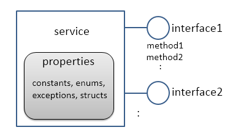
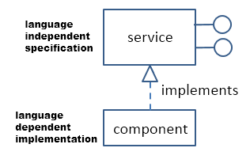
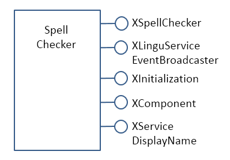
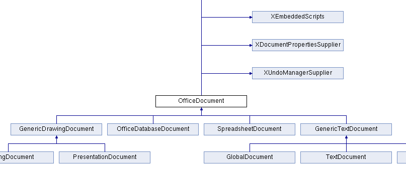
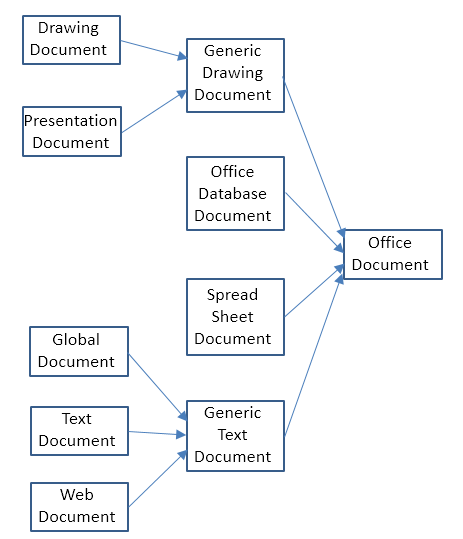

# Chapter 1. LibreOffice API Concepts

!!! note "Topics"
    Some History;
    Help and Examples  for
    the LibreOffice SDK
    (lodoc, loguide); Office
    as a Process; Common
    Structures (Interface,
    Property, Service, and
    Component); Service
    and Interface Inheritance
    Hierarchies; the Frame-
    Controller-Model (FCM)
    Relationship;
    Extensions; Comparison
    with Basic
    
    Example folder: "Utils"

This chapter describes LibreOffice API concepts without
resorting to code (that comes along in the next chapter).
These concepts include Office as a (possibly networked)
process, the interface, property, service, and component
structures, the two API inheritance hierarchies, and the
Frame-Controller-Model (FCM) relationship.

LibreOffice is an open source, cross-platform, office suite,
made up of six main applications, and lots of other useful
stuff. The applications are: Writer (a word processor),
Draw (vector graphics drawing), Impress (for slide
presentations), Calc (spreadsheets), Base (a database front-
end), and Math (for writing formulae). Some of the lesser-
known features include a charting library, spell checker, forms designer, thesaurus, e-
mail package, and support for extensions (e.g. new menu items and libraries). Aside
from Open Document Format (ODF) files, LibreOffice can import, convert, and
export a vast number of text, graphic, and other formats, including Microsoft Office
documents, PDF, HTML, SWF (Flash), and SQL databases.

LibreOffice is managed and developed by The Document Foundation
(https://libreoffice.org), and was first released in 2010. However, earlier Office
versions date back to the 1980's, and traces of this heritage are visible in many parts
of its API. Figure 1 shows a simplified timeline of how StarOffice begat OpenOffice,
and so on to LibreOffice.


Figure 1. Office's Timeline.

This book is not about how to use LibreOffice's GUI (e.g. where to find the menu
item for italicizing text). I'm also not going to discuss how to compile the LibreOffice
source, which is a focus of LibreOffice's development webpage
(https://wiki.documentfoundation.org/Development). My intention is to explain the
Java API that comes as part of the LibreOffice SDK, which you can obtain from
https://libreoffice.org/download/libreoffice-still.

If you're unsure how to install the SDK then please refer to the website accompanying
this book (https://fivedots.coe.psu.ac.th/~ad/jlop/). The "Installing the code for Java
LibreOffice Programming" page at https://fivedots.coe.psu.ac.th/~ad/jlop/install.html
gives step-by-step instructions, and also explains how to download the book's utility
classes and examples.


## 1.  Sources for API Information

Rather amazingly, today's API in LibreOffice is almost 100% compatible with
OpenOffice, which means that code developed 10-15 years ago (i.e. during the Sun
and Oracle stewardships of Office) still works with no (or very minor) changes.

It also means that a programmer can choose to read the LibreOffice Java API
documentation or the older OpenOffice material since, apart from formatting
differences, they're virtually the same. However, my preference is for the LibreOffice
pages because of the clickable inheritance diagrams, as I'll explain later.

Indeed, the examples at the LibreOffice API website (https://api.libreoffice.org) link
to the OpenOffice Developer's Guide at
https://wiki.openoffice.org/wiki/Documentation/DevGuide/OpenOffice.org_Developers_Guide.
Sadly, that rather old manual (for OpenOffice v3.1 released in 2009) is the
only long description of the Java Office API, and is overly technical in places. It can
be downloaded as a single PDF file from
https://wiki.openoffice.org/w/images/d/d9/DevelopersGuide_OOo3.1.0.pdf. The PDF
version has two drawbacks – its sections and sub-sections are unnumbered, making
the overall structure of each chapter somewhat confusing. Another problem is that
many of the code examples are missing newline characters, so are hard to read.

This book is my attempt to write a more gradual, modern introduction to the API.

I'm going to refer to the LibreOffice and OpenOffice APIs collectively as the Office
API due to their similarities. I believe that everything I say about LibreOffice Java
programming applies to OpenOffice. But, to be honest, I've only tested my examples
in LibreOffice on Windows 7. If you do find any inconsistencies, then please contact
me at ad@fivedots.coe.psu.ac.th with details.

I hope this book will make the more esoteric materials in the developer's guide easier
to understand. One of the ways I'll be flattening the learning curve is by hiding parts
of the API behind my own collection of utility classes. This is far from being a novel
idea, as it seems that every programmer who has ever written more than a few pages
of Office code ends up developing support functions. I've gratefully borrowed very
liberally from those intrepid programmers, but I take full responsibility for my coding
choices.

There's a lot of Java Office API examples and code snippets online (as you might
expect after 15+ years of existence). Your first stop should be the two groups of
examples at https://api.libreoffice.org/examples/examples.html (in the Java and
Developer's Guide subdirectories). They can also be found in the Office download in
<OFFICE>/sdk/examples; Basic, C++ and Python code is there as well. By the way,
<OFFICE> is my way of writing the path to the LibreOffice directory, which for
example is "C:\Program Files\LibreOffice 5" on my 32-bit test machine.

You should also browse the LibreOffice development forums
(https://imaccanici.org/en.libreofficeforum.org) and the corresponding ones for
OpenOffice (https://forum.openoffice.org/en/forum). Look for the sub-forums that
talk about the UNO API and/or macros. Sadly, imaccanici.org is an archive of the
defunct https://en.libreofficeforum.org/ site, but the OpenOffice forum is still going
strong, and very relevant. LibreOffice has a question-posing page, at
https://ask.libreoffice.org/en/questions, which is a good source of information.

https://oooforum.org/ is an older forum site, which has the unfortunate habit of
periodically disappearing from the Web. Often the only way to access one of its posts
or threads is via cached pages maintained by Google.

The Office API has been ported to many programming languages. The API was first
coded in C++, and later converted to Java, Basic, Python, C#, Perl, JavaScript,
OORexx, and many more. The most popular language is probably Basic, which is
principally used for writing macros (also called scripts) embedded in Office
documents, or in the Office application. A big advantage of Basic is its lack of typing,
which simplifies its version of the API. Basic macros utilize a similar set of Office
API functions as Java, so can be a useful source of ideas.

Perhaps the best place for learning about Office macro programming is Andrew
Pitonyak's website (https://pitonyak.org/), which includes an excellent free-to-
download book: "OpenOffice.org Macros Explained", a macros cookbook, and a
document focusing on database macros.

Another great site is https://openoffice3.web.fc2.com/, which is mostly written in
Japanese. This shouldn't put off non-Japanese readers since Google is quite happy to
translate the pages for you, and the code examples are mostly ASCII.


#### Finding API Documentation Online

The online API documentation can be time-consuming to search due to its great size.

If you want to have a browse, start at
https://api.libreoffice.org/docs/idl/ref/namespaces.html, which takes a while to load.

Each Office application (e.g. Writer, Draw, Impress, Calc, Base, Math) is supported
by multiple modules (similar to Java packages). For example, most of Writer's API is
in Office's "text" module, while Impress' functionality comes from the "presentation"
and "drawing" modules. These modules are located in com.sun.star package, which is
documented at
https://api.libreoffice.org/docs/idl/ref/namespacecom_1_1sun_1_1star.html.

Rather than searching manually through a module for a given class, it's a lot quicker
to get a search engine to do it for you. This is the purpose of my lodoc.bat batch file,
which utilizes DuckDuckGo (https://duckduckgo.com/). For instance, at the command
line, you can type:

`lodoc xtext`

and the Office API documentation on the XText interface will open in your browser.

lodoc.bat is 'almost' always returns the right page, mainly because Office interfaces,
and many of its services, have long unique names. (I'll explain what a service is
shortly.)
loDoc.bat can be found in the Utils/ folder listed at the start of this chapter, and its
also included in every example folder used in later chapters.

Service names are less unusual, and so you should probably add the word "service" to
your search. For instance, if you're looking for the Text service, type:

`lodoc text service`

Module names are also quite common words, so add "module" to the search. If you
want to reach the "text" module (which implements most of Writer), search for:

`lodoc text module`

You can call lodoc with Office application names, which are mapped to API module
names. For instance:

`lodoc Impress`

brings up the "presentation" module page.

You may be wondering why I chose to implement this script using DuckDuckGo
rather than Google? Google doesn't seem to like me querying it from the command
line. It periodically keeps asking me to type in a captcha string when I call it from
lodoc.bat. Another problem is that Google likes to replace my search strings with
'more likely' strings.


#### Searching the Online Developer's Guide

The online Developer's Guide can also be time-consuming to search because it's both
long (around 1650 pages), and poorly organized. To help, I've written a small batch
file called loGuide.bat which is quite similar to loDoc.bat. It calls DuckDuckGo,
limiting the search to the Developer's Guide web pages, and loads the first matching
page into your web browser.

For example:

`loguide "Lifetime of UNO Objects"`

loads the guide page with that heading into the browser. A less precise query will
probably produce the same page, but even when the result is 'wrong' it'll still be
somewhere in the guide.

loGuide.bat can be found in the Utils/ folder mentioned at the start of this chapter, and
is also included in every example folder used in later chapters.

The first argument of loGuide.bat can be an Office application name, which restricts
the search to the part of the guide focusing on that application's API. For instance:

`loguide Calc "Data Validation"`

and

`loguide impress "Page Formatting"`

search the Calc and Impress parts of the guide.

Calling loGuide.bat with just an application name, opens the guide at the start of the
chapter on that topic. For example:

`loguide writer`

opens the guide at the start of the "Text Documents" chapter.

Calling loGuide.bat with no arguments, makes the browser load the first page of the
guide.


## 2.  Office as a Process

Office is started as an OS process, and a Java program communicates with it via a
socket or named pipe. This necessarily complicates the Java/Office link, which is
illustrated in Figure 2.


Figure 2. A Java Program Using Office.


The invocation of Office and the setup of a named pipe link can be achieved with a
single call to the SDK's Bootstrap.bootstrap() method. Its source code is available
online, and makes for interesting reading. (Probably the most reliable way of finding
it is to google using the terms `Bootstrap libreoffice filetype:java.)

bootstrap() starts the Office executable (called soffice.exe) with several command line
arguments, the most important being "-accept" which specifies the use of pipes or
sockets for the interprocess link.

A call to XUnoUrlResolver.resolve() inside bootstrap() creates a remote component
context, which acts as proxy for the 'real' component context over in the Office
process (see Figure 2). The context is a container/environment for components and
UNO objects which I'll explain below. When a Java program refers to components
and UNO objects in the remote component context, the interprocess bridge maps
those references across the process boundaries to the corresponding components and
objects on the Office side.

Underpinning this mapping is the Universal Network Object (UNO) model which
links objects in different environments using the UNO remote protocol (URP). For
example, a method call is converted into a byte stream, sent across the bridge and
reconstructed. Method results are returned in the same way.

Thankfully, this network communication is hidden by the Office API. The only place
a beginner might encounter UNO mechanisms is when loading or saving documents.

Every document (more generally called a resource) is referred to using a Uniform
Resource Identifier (URI); URIs are employed by Office’s Universal Content Broker
(UCB) and Universal Content Providers (UCPs) to load and save a wide range of data
formats.

Bootstrap.bootstrap() sets up a remote component context based on named pipes, but
if you want to utilize sockets, then the coding is left to you. My Lo utility class
contains a socketContext() method that does the necessary work, and I'll show some
examples of its use in the next chapter.

Obtaining a remote component context is not the end of Office’s initialization.

Typically, at least three UNO objects are needed over on the Java side for most
programming tasks: a service manager, a Desktop object, and a component loader.

The service manager is used to load additional services into Office at runtime. The
Desktop object has nothing to do with the OS'es desktop – it refers to the top-level of
the Office application, particularly to its GUI. The component loader is used to load
or create Office documents.

Other UNO objects might be more useful depending on your programming task. For
example, for historical reasons, Office supports two slightly different service
managers (one that requires an explicit component context argument, and an older one
that doesn't). I've chosen to add both of them to the component context, as a
convenience to the programmer; this detail is hidden by my Lo util class.


## 3.  API Data Structures: interface, property, service, and component

There are four main data structures used by the API: interface, property, service, and
component.

The use of the word 'interface' is obviously influenced by its meaning in Java, but it's
probably best to keep it separate in your mind. An Office interface is a collection of
method prototypes (i.e. method names, input arguments, and return types) without any
implementation or associated data. A property is a name-value pair, used to store data.

A service comprises a set of interfaces and properties needed to support an Office
feature.

Figure 3 illustrates how interface, property, and service are related.




Figure 3. Services, Interfaces, Properties.


The Office documentation often talks about property structs (e.g. the Point and
KeyEvent structs). These are coded in Java as classes, and their names often clash
with classes in the standard JDK which can complicate their usage.

Since interfaces contain no code, a service is a specification for an Office feature.

When a service is implemented (i.e. its interfaces are implemented), it becomes a
component. This distinction means that the Office API can be implemented in
different languages (as components) but always employs the same specifications
(services), as represented in Figure 4.




Figure 4. Components and Services.

The developer's guide uses a notation like that shown in Figure 5 to draw a service
and its interfaces.


Figure 5. The OfficeDocument service.

I haven't drawn all the interfaces for OfficeDocument, since they're quite numerous,
and I haven’t listed the methods defined by each interface.

The developer's guide drawing for the SpellChecker service is shown in Figure 6.




Figure 6. The SpellChecker service.

The two figures illustrate a useful naming convention: all interface names start with
the letter "X".

The developer's guide notation leaves out information about the properties managed
by the services. Also, the services webpages at the LibreOffice site don't use the
guide’s notation.

The URLs for these pages are somewhat difficult to remember. The best thing is to
use my loDoc.bat tool to find them. For instance, you can access the office document
and spell checker services with:

`lodoc officedocument service`

and

`lodoc spellchecker service`

Note that the "officedocument" search result isn't ideal – it takes you to the IDL page
for the service. You need to click on the "OfficeDocument" link under the "Classes"
heading to get to the actual service details.

The LibreOffice service webpages usually list properties, but sometimes refer to them
as 'attributes'. If the service documentation doesn't describe the properties, then they're
probably being managed by a separate “Supplier” interface (e.g.
XDocumentPropertiesSupplier for OfficeDocument in Figure 5). The supplier will
include methods for accessing the properties as an XPropertySet object.

One great feature of the LibreOffice webpages is the inheritance diagrams on each
service and interface page. Part of the diagram for the OfficeDocument service is
shown in Figure 7.




Figure 7. Part of the Inheritance Diagram for the OfficeDocument Service.

Each box in the diagram can be clicked upon to jump to the documentation for that
subclass or superclass.


## 4.  Two Inheritance Hierarchies for Services and interfaces

Services and interfaces both use inheritance, as shown by the UML diagram in Figure
8.


Figure 8. Service and Interface Relationships and Hierarchies.

For example, OfficeDocument is the superclass service of all other document formats,
as illustrated in Figure 9.




Figure 9. OfficeDocument as a Superclass Service.

Part of this hierarchy can also be seen in Figure 7.

An interface can also be part of an inheritance hierarchy. For instance, the XModel
interface inherits XComponent and XInterface, as in Figure 10.


Figure 10. The Superclasses of XModel.

The LibreOffice documentation graphically displays these hierarchies (e.g. see Figure
7), but makes no visual distinction between the service and interface hierarchies. It
also represents the "contains" relationship between services and interfaces as
inheritance, rather than as lines with circles as in the developer's guide (e.g. see
Figures 5 and 6).


## 5.  The FCM Relationship

The Frame-Controller-Model (FCM) relationship (or design pattern) is a part of
Office which programmers will encounter frequently. It appears in the API as
connections between the XFrame, XController, and XModel interfaces, as shown in
Figure 11.


Figure 11. The FCM Relationship.


Every Office document inherits the OfficeDocument service (see Figure 9), and
Figure 5 shows that OfficeDocument supports the XModel interface. This means that
every document will include XModel methods for accessing the document's
resources, such as its URL, file name, type, and meta information. Via
XModel.getCurrentController(), a document's controller can be accessed.

A controller manages the visual presentation of a document. For instance, the Office
GUI interacts with the controller to position the cursor in a document, to control
which page is displayed, and to highlight selections. The XController interface
belongs to the Controller service, which is a superclass for viewing documents;
subclasses include TextDocumentView, DrawingDocumentDrawView, and
PresentationView.

From XController, it's possible to reach XFrame, which contains information about
the document's display window. A document utilizes two XWindow objects, called
the component and container windows. The component window represents the
rectangular area on screen that displays the document. It also handles GUI events,
such as window activation or minimization. The container window is the component's
parent. For example, a component window displaying a chart might be contained
within a spreadsheet window
A frame can contain child frames, allowing the Office GUI to be thought of as a tree
of frames. The root frame of this tree is the Desktop object, which you may recall is
one of the first three objects stored in the remote component context when we start
Office. This means that we can move around the frames in the Office GUI starting
from the loaded document, or from the root frame referred to from XDesktop. For
example, XDesktop provides getCurrentFrame() to access the currently active frame.


## 6.  Components Again

A knowledge of the FCM relationship, and its XFrame, XController, and XModel
interfaces, lets me give a more detailed definition of a component. Back in section 3
(and in Figure 4), I said a component was an implemented service. Another way of
understanding a component is in terms of how much of the FCM relationship it
supports, which allows the 'component' idea to be divided into three:

1.  A component that supports both the XModel and XController interfaces is usually
an Office document.
2.  A component with a controller but no model is typically used to implement library
functionality that doesn't need to load data. Examples include the spell checker,
and Office tools for creating database forms.
3.  A component with no model or controller (i.e. just an XWindow object) is used
for simple GUI elements, such as Office's help windows.

Of these three types, the component-as-document (number 1) is the most important
for our needs. In particular, I'll be using the component loader in the remote
component context to load Office documents.


## 7.  What's an Extension?

The Office developer's guide often uses the words 'extension', 'add-on', and 'add-in'.
I'll be spending four chapters on these features in Part 8 (along with macro
programming in Java), but it's worth briefly explaining them now.

An extension is a code library that extends Office's functionality. For Java
programmers, an extension usually takes the form of a JAR file containing a service,
its interfaces, properties, and their implementations. Since an extension implements
the service, it may also be referred to as a component.

An add-on is an extension with additional XML files defining a GUI for the extension
(e.g. a menu bar, menu item, or toolbar icon). An add-on is rendered in Office's GUI
in the same way as standard Office elements.

An add-in or, to use its full name, a Calc Add-in, is an extension that adds a new
function to Calc.


## 8.  A Comparison with the Basic API

If you start searching the forums, newsgroups, blogs, and web sites for Office
examples, it soon becomes clear that Java is not the language of choice for most
Office programmers. Basic (sometimes called StarBasic, OpenOffice.org Basic,
LibreOffice Basic, or even Visual Basic or VB by mistake) is the darling of the
coding crowd.

This is understandable since Office (both LibreOffice and OpenOffice) includes an
IDE for editing and debugging Basic macros. Also, there's a lot of good resources on
how to utilize these tools (e.g. start browsing the LibreOffice wiki page "LibreOffice
Basic Help", https://help.libreoffice.org/Basic/Basic_Help). The few books that have
been written about programming the Office API have all used Basic (e.g. Pitonyak's
"OpenOffice.org Macros Explained" at https://pitonyak.org/book/).

There are two styles of Basic macro programming – scripts can be attached to specific
documents, or to the Office application. In a document, a macro can respond to Office
events, such as the loading of the document, or its modification. The macro can
monitor the user's key presses or menu button presses, and can utilize Office dialogs.

This isn't the place for a language war between Java and Basic, but it's fair to say that
the Basic Office API is simpler than the Java version! This is partly due to the fact
that Basic has a weaker typing system than Java, but also that the Office abstractions
used by Basic are simpler than those in Java.

The main difference is that the Basic API doesn't use interfaces. Instead of a service
containing a collection of interfaces, each of which has methods, a Basic service
directly contains all the methods. This means that an Office service can be understood
as a plain-old object containing methods and data (in the form of properties).

I'm at a loss why this abstraction wasn't used in Java. One use of interfaces is to
employ interface typing, but most of the typing protection is applied at runtime when
one interface is cast to another. This means that one of the big benefits of typing
(compile-time error detection) is lost.

Another advantage of Basic is its hiding of the complexities of accessing Office at
start-up, and for requesting services. In comparison, for many years, there was no
Bootstrap class in the Java Office API. This meant that every Java programmer had to
grapple with difficult code for linking to Office and obtaining a remote component
context.

In the Basic API, there's no remote component context since the macros run inside
Office or inside a document that is loaded into Office. Incidentally, this means that
Basic code doesn't need those few extra microseconds for every operation to
communicate across process boundaries.

The Basic programmer still utilizes a service manager, Desktop object, and perhaps a
loader. This means that the first few lines of a macro might be:

```basic
Dim oSM, oDesk, oDoc As Object
Set oSM = CreateObject("com.sun.star.ServiceManager")
Set oDesk = oSM.createInstance("com.sun.star.frame.Desktop")
Set oDoc = oDesk.loadComponentFromURL(
             "file:///C:/tmp/testdoc.odt", "_blank", 0, noArgs())
```

However, if the script is part of a loaded document, then the call to
loadComponentFromURL() isn't needed, reducing the code to:

```basic
Set oSM = CreateObject("com.sun.star.ServiceManager")
Set oDesk = oSM.createInstance("com.sun.star.frame.Desktop")
Set oDoc = oDesk.CurrentComponent
```

Also, Office's Basic runtime environment automatically creates a service manager and
Desktop object, so it's unnecessary to create them explicitly. This reduces the code to
a one-liner:

```basic
Set oDoc = StarDesktop.CurrentComponent
```

or even:

```basic
Set oDoc = ThisComponent
```

If other services are needed, Basic programmers call the createUnoService() function
which transparently requests the named service from the service manager. For
instance:

```basic
set sfAcc = CreateUnoService("com.sun.star.ucb.SimpleFileAccess")
sfAcc.CreateFolder(dirName)
```

Recall that a Basic service contains all the methods from its interfaces, so once the
service reference has been obtained, methods can be called directly.

One of the aims of my utilities is to hide as much of the complexity of Office as the
Basic version of the API.

Having just reread this section, I may have just convinced myself to become a Basic
programmer . The reason I'm going to stick with Java is that it's a full-featured
language, with massive numbers of standard and third-part APIs which can augment
the Office API.