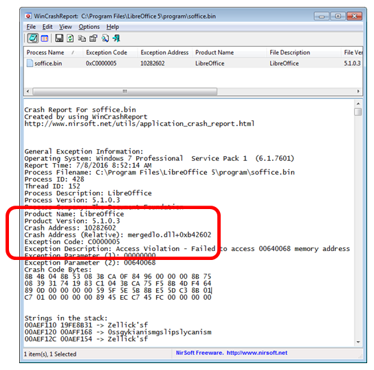
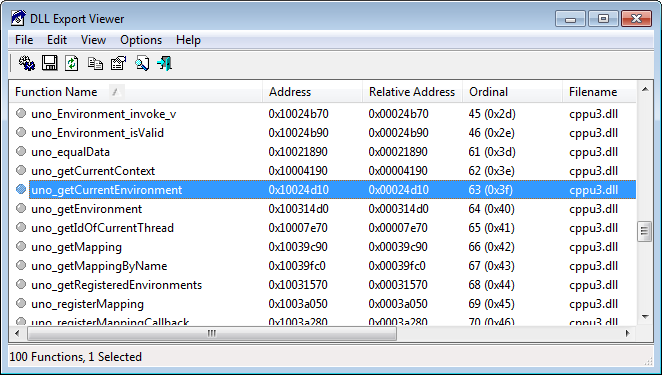
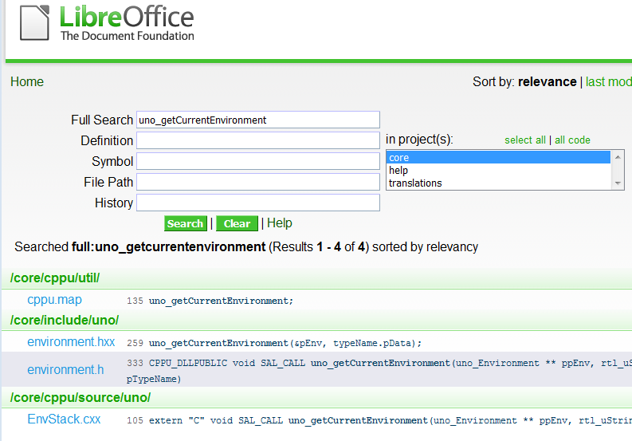

# Chapter 2. Starting and Stopping 

!!! note "Topics"
    Starting Office; 
    Closing Down/Killing 
    Office; Opening a 
    Document; Creating a 
    Document; Saving; 
    Closing; Document 
    Conversion; Bug 
    Detection and Reporting 

    Example folders: "Office 
    Tests" and "Utils" 
 
Chapter 1 introduced some of the core ideas of Office. 

Now it's time to show how these data structures and 
relationships (e.g. service, interfaces, FCM, inheritance) 
are programmed in Office's Java API.  

This chapter will focus on the most fundamental tasks: 
starting Office, loading (or creating) a document, saving 
and closing the document, and shutting down Office. The 
DocConverter.java example at the end pulls these together to show how to convert a 
document into another format. 

All the examples come from the "Office Tests" directory in the code download 
associated with this book, and make liberal use of the classes in the "Utils" directory. 

For details please visit http://fivedots.coe.psu.ac.th/~ad/jlop/. 

My aim with these utilities is to hide some of the verbiage of Office. When (if?) a 
programmer feels ready for more detail, then my code is documented. I'll only explain 
functions here that illustrate Office ideas, such as service managers and components. 

This is the first chapter with code, and so the first where programs could crash! 
Section 8 gives a few tips on bug detection and reporting. 

 
## 1.  Starting Office 

Every program must load Office before working with a document, and shut it down 
before exiting. These tasks are handled by loadOffice() and closeOffice() from the Lo 
utility class. A typical program will look like the following: 
 
import com.sun.star.uno.*; 
import com.sun.star.lang.*; 
import com.sun.star.frame.*; 
 
 
public class OfficeInfo 
{ 
  public static void main(String[] args) 
  { 
    XComponentLoader loader = Lo.loadOffice(); 
 
    // load, manipulate and close a document 
 
    Lo.closeOffice(); 
  } // end of main() 
 
}  // end of OfficeInfo class 
 
 
Lo.loadOffice() invokes Office and sets up a UNO bridge using named pipes. There's 
also a Lo.loadSocketOffice() which uses sockets instead of pipes. Both functions 
return a reference to a component loader which can be used to load a document.  

loadOffice() and loadSocketOffice() call a one-argument version of loadOffice() 
which uses a boolean to decide whether to use pipes or sockets to link to Office. In 
both cases, a remote component context is created on the Java side (see Chapter 1, 
Figure 2) and then a service manager, Desktop object, and component loader are 
initialized. The code below shows some details: 
 
// in the Lo class 
// globals  
private static XComponentContext xcc = null; 
private static XDesktop xDesktop = null; 
private static XMultiComponentFactory mcFactory = null;    
 
 
public static XComponentLoader loadOffice(boolean usingPipes) 
{ 
  System.out.println("Loading Office..."); 
  if (usingPipes) 
    xcc = bootstrapContext(); // connects to office via pipes 
  else 
    xcc = socketContext();    // connects to office via a socket 
  if (xcc == null) { 
    System.out.println("Office context could not be created"); 
    System.exit(1); 
  } 
 
  // get the remote office service manager 
  mcFactory = xcc.getServiceManager(); 
  if (mcFactory == null) { 
    System.out.println("Office Service Manager is unavailable"); 
    System.exit(1); 
  } 
 
  // desktop service handles application windows and documents 
  xDesktop = createInstanceMCF(XDesktop.class,  
                               "com.sun.star.frame.Desktop"); 
  if (xDesktop == null) { 
    System.out.println("Could not create a desktop service"); 
    System.exit(1); 
  } 
 
  // XComponentLoader provides ability to load components 
  return Lo.qi(XComponentLoader.class, xDesktop); 
}  // end of loadOffice() 
 
loadOffice() probably illustrates my most significant coding decisions – the use of 
global static variables inside the Lo class. In particular, the XComponentContext, 
XDesktop, and XMultiComponentFactory objects created by loadOffice() are stored 
globally for later use. I chose this approach since it allows other support functions to 
be called with simpler arguments because the objects can be accessed without the user 
having to explicitly pass around references to them. The main drawback is that 
loadOffice() cannot be safely called more than once (i.e. it is non-reentrant) since a 
second call will overwrite the globals set during the first call. 

The creation of the XDesktop interface object uses createInstanceMCF(): 
 
// in the Lo class 
public static <T> T createInstanceMCF(Class<T> aType,  
                                            String serviceName) 
{ if ((xcc == null) || (mcFactory == null)) { 
    System.out.println("No office connection found"); 
    return null; 
  } 
 
  T interfaceObj = null; 
  try {   // get service, then interface 
    Object o = mcFactory.createInstanceWithContext(serviceName, xcc); 
    interfaceObj = Lo.qi(aType, o);     
  } 
  catch (Exception e) { 
    System.out.println("Couldn't create interface for \"" +  
                                      serviceName + "\": " + e); 
  } 
  return interfaceObj; 
}  // end of createInstanceMCF() 
 
 
public static <T> T qi(Class<T> aType, Object o) 
// the "Loki" function -- reduces typing 
{  return UnoRuntime.queryInterface(aType, o);  } 
 
 
If you ignore the error-checking, createInstanceMCF() does two things. The call to 
XMultiComponentFactory.createInstanceWithContext() asks the service manager 
(mcFactory) to create a service object inside the remote component context (xcc). 

Then the call to UnoRuntime.queryInterface() looks inside the service instance for the 
specified interface (aType), returning an instance of the interface as its result.  

My Lo.qi() function's only purpose is to reduce programmer typing, since calls to 
UnoRuntime.queryInterface() are very common. 

The use of generics makes createInstanceMCF() useful for creating any type of 
interface object. Unfortunately, generics aren't utilized in the Office API, which relies 
instead on Object, Office's Any class, or the XInterface class which is inherited by all 
interfaces.  

 
A Quick Look at Sockets 
Note: you can skip this section if socket communication with Office isn't of interest. 

loadOffice() starts by calling bootstrapContext() or socketContext() to create a remote 
component context. bootstrapContext() is very short since it build a UNO bridge 
based on named pipes using Office's Bootstrap class. However, I also implemented a 
socket-based bridge, in Lo.socketContext(). The steps it performs are: 
 invoke Office as a process using sockets; 
 create a local component context and service manager (local in the sense of 
being in the Java process); 
 connect to Office via its socket. I use the Connector service, but another 
approach is to employ the UnoUrlResolver service; 
 layer a UNO bridge on top of the socket link; 
 retrieve a reference to the remote component context via the UNO bridge 
(remote in the sense that it refers across process boundaries to Office). 

Office's own Bootstrap class implements a similar sequence of steps for linking to 
Office via pipes. It starts Office by calling Java's Runtime.exec(), and I've used the 
same approach, but assumed that soffice.exe is part of Window's PATH environment 
variable. The relevant code fragment is: 
 
String[] cmdArray = new String[3]; 
cmdArray[0] = "soffice"; 
cmdArray[1] = "-headless"; 
cmdArray[2] = "-accept=socket,host=localhost,port=" + 
                                       SOCKET_PORT + ";urp;"; 
Process p = Runtime.getRuntime().exec(cmdArray); 
 
SOCKET_PORT has the value 8100. Since this port number is fixed, it’s possible to 
check the socket’s status outside Office. For example, on Windows, I type: 
netstat | grep 8100 
If you wondering where grep comes from, I got it from gow 
(https://github.com/bmatzelle/gow), a light-weight installer of UNIX command line 
utilities for Windows. 

 
 
## 2.  Closing Down/Killing Office 

Lo.closeOffice() shuts down Office by calling terminate() on the XDesktop instance 
created inside loadOffice(): 
boolean isDead = xDesktop.terminate() 
This is usually sufficient but occasionally I've found it necessary to delay the 
terminate() call for a few milliseconds in order to give Office components time to 
finish. I noticed this especially when using an OfficeBean panel for displaying 
documents (which I'll describe much later in Chapter 44). As a consequence, 
Lo.closeDown() may actually call terminate() a few times, until it returns true. 

While developing/debugging code, it's quite easy to inadvertently trigger a runtime 
exception in the Office API. In the worst case, this can cause your program to exit 
without calling Lo.closeDown(). This will leave an extraneous Office process running 
in the OS, which should be killed. The easiest way is with a Windows batch file 
containing: 
taskkill /f /t /im soffice.exe 
This uses the fact that the office process is called soffice.exe. Another useful batch 
script is one that checks only if the process is running: 
tasklist /FI "IMAGENAME eq soffice.exe" 
These are packaged up as lokill.bat and lolist.bat in my code. So if you're unsure if 
Office is really dead, type: 
lokill 
at a command prompt. 

The Unix shell script versions of these files could use killall, pkill, ps, or kill. 

Lo.killOffice() inelegantly terminates Office by calling the lokill.bat script from 
inside Java: 
 
// part of the Lo class 
public static void killOffice() 
{ 
  try { 
    Runtime.getRuntime().exec("cmd /c lokill.bat"); 
    System.out.println("Killed Office"); 
  } 
  catch (java.lang.Exception e) { 
    System.out.println("Unable to kill Office: " + e); 
  } 
}  // end of killOffice() 
 
The code is nasty since it relies on there being a cmd.exe OS tool and a lokill.bat 
batch file in the current directory. 

 
 
## 3.  Opening a Document 

The general format of a program that opens a document, manipulates it in some way, 
and then saves it, is: 
 
public static void main(String[] args) 
{ 
  XComponentLoader loader = Lo.loadOffice(); 
  XComponent doc = Lo.openDoc(args[0], loader); 
  if (doc == null) { 
    System.out.println("Could not open " + args[0]); 
    Lo.closeOffice(); 
    return; 
  } 
 
  // use the Office API to manipulate doc... 

 
  Lo.saveDoc(doc, "foo.docx");  // save as a Word file 
  Lo.closeDoc(doc); 
  Lo.closeOffice(); 
} // end of main() 
 
 
The new methods are Lo.openDoc(), Lo.saveDoc(), and Lo.closeDoc(). 

openDoc() calls XComponentLoader.loadComponentFromURL(), which requires a 
document URL, the type of Office frame used to display the document, optional 
search flags, and an array of document properties. For example: 
 
String fileURL = FileIO.fnmToURL(fnm); 
PropertyValue[] props = Props.makeProps("Hidden", true); 
XComponent doc =  
         loader.loadComponentFromURL(fileURL, "_blank", 0, props); 
 
The frame type is almost always "_blank" which indicates that a new window will be 
created for the newly loaded document. (Other possibilities are listed in the 
XComponentLoader documentation which you can access with lodoc 
XComponentLoader.) The search flags are usually set to 0, and document properties 
are stored in the PropertyValue array, props. 

loadComponentFromURL()'s return type is XComponent, which refers to the 
document. 

FileIO.fnmToURL() converts an ordinary filename (e.g. “foo.doc”) into a URL (a full 
path prefixed with file:///).  

Props.makeProps() takes a property name and value and returns a PropertyValue 
array; there are several variants which accept different numbers of property name-
value pairs. 

A complete list of document properties can be found in the MediaDescriptor 
documentation (accessed with lodoc MediaDescriptor service), but some of the 
important ones are listed in Table 1. 

 
Property Name  Use 
AsTemplate Creates a new document using a specified template. 

Hidden Determines if the document is invisible after being 
loaded. 

ReadOnly Opens the document read-only. 

StartPresentation Starts showing a slide presentation immediately after 
loading the document. 

Table 1. Some Document Properties. 

 
 
## 4.  Creating a Document 

A new document is created by calling 
XComponentLoader.loadComponentFromURL() with a special URL string for the 
document type. The possible strings are listed in Table 2. 

 
URL String Document Type 
"private:factory/swriter" Writer 
"private:factory/sdraw" Draw 
"private:factory/simpress" Impress 
"private:factory/scalc" Calc 
"private:factory/sdatabase" Base 
"private:factory/swriter/web" HTML document in Writer 
"private:factory/swriter/GlobalDocument" A Master document in Writer 
"private:factory/schart" Chart 
"private:factory/smath" Math Formulae 
".component:Bibliography/View1" Bibliography Entries 
".component:DB/QueryDesign" 
".component:DB/TableDesign" 
".component:DB/RelationDesign" 
".component:DB/DataSourceBrowser" 
".component:DB/FormGridView" 
Database User Interfaces 
Table 2. URLs for Creating New Documents. 

 
For instance, a Writer document is created by: 
XComponent doc =  
     loader.loadComponentFromURL("private:factory/swriter",  
                                 "_blank", 0, props); 
The utility classes include code for simplifying the creation of Writer, Draw, Impress, 
Calc, and Base documents, which I'll be looking at in later chapters.  

 
 
A Second Service Manager 
Lo.loadDoc() and Lo.createDoc() do a bit of additional work after document 
loading/creation – they instantiate a XMultiServiceFactory service manager which is 
stored in the Lo class. This is done by applying Lo.qi() to the document: 
 
// global in Lo.java 
private static XMultiServiceFactory msFactory = null; 
 
// in loadDoc() 
XComponent doc =  
      loader.loadComponentFromURL(fileURL, "_blank", 0, props); 
msFactory =  Lo.qi(XMultiServiceFactory.class, doc); 
 
I first employed Lo.qi() in createInstanceMCF() to access an interface inside a 
service. This time qi() is casting one interface (XComponent) to another 
(XMultiServiceFactory). 

The XMultiServiceFactory object is the second service manager we've encountered; 
the first was an XMultiComponentFactory instance, created during Office's loading.  

The reasons for Office having two service managers are historical: the 
XMultiServiceFactory manager is older, and creates a service object without the need 
for an explicit reference to the remote component context.  

As Office developed, it was decided that service object creation should always be 
relative to an explicit component context, and so the newer XMultiComponentFactory 
service manager came into being. A lot of older code still uses the 
XMultiServiceFactory service manager, so both are supported in the Lo class.  

Another difference between the managers is that the XMultiComponentFactory 
manager is available as soon as Office is loaded, while the XMultiServiceFactory 
manager is initialized only when a document is loaded or created. 

 
 
## 5.  Saving a Document 

One of the great strengths of Office is that it can export a document in a vast number 
of formats, but the programmer must specify the output format (which is called a filter 
in the Office documentation). 

XStorable.storeToURL() takes the name of the output file (in URL format), and an 
array of properties, one of which should be "FilterName". Two other useful output 
properties are "Overwrite" and "Password". Input and output document properties are 
listed in the MediaDescriptor service documentation (lodoc MediaDescriptor 
service).  

If "Overwrite" is set to true then the file will be saved without prompting the user if 
the file already exists. The "Password" property contains a string which must be 
entered into an Office dialog by the user before the file can be opened again. 

The steps in saving a file are: 
 
String saveFileURL = FileIO.fnmToURL(fnm); 
String[] nms = new String[] {"Overwrite", "FilterName", "Password"}; 
Object[] vals = new Object[] {true, format, password}; 
PropertyValue[] storeProps = Props.makeProps(nms, vals); 
 
XStorable store = Lo.qi(XStorable.class, doc); 
store.storeToURL(saveFileURL, storeProps); 
 
I've used a variant of the Props.makeProps() method to create an array of three 
properties. If you don't want a password, then the third property should be left out. 

Lo.qi() is used again to cast an interface, this time from XComponent to XStoreable. 

Figure 5 in Chapter 1 shows that XStoreable is part of the OfficeDocument service, 
which means that it's inherited by all Office document types. 

 
What's a Filter Name? 
XStorable.storeToURL() needs a "FilterName" property value, but what should the 
string be to export the document in Word format for example? 
Info.getFilterNames() returns an array of all the filter names supported by Office. 

There's an example call in OfficeInfo.java, but is commented out because it returns a 
250+ element list! 
Rather than force a programmer to search through this list for the correct name, 
Lo.saveDoc() allows him to supply just the name and extension of the output file. For 
example, in section 3, Lo.saveDoc() was called like so: 
Lo.saveDoc(doc, "foo.docx"); 
saveDoc() extracts the file extension (i.e. "docx") and maps it to a corresponding filter 
name in Office (in this case, "Office Open XML Text"). One concern is that it's not 
always clear which extension-to-filter mapping should be utilized. For instance, 
another suitable filter name for "docx" is "MS Word 2007 XML". I've essentially 
ignored this problem, by hardwiring a fixed selection into saveDoc(). 

Another issue is that the choice of filter sometimes depends on the extension and the 
document type. For example, a Writer document saved as a PDF file should use the 
filter "writer_pdf_Export", but if the document is a spreadsheet then 
"calc_pdf_Export" is the correct choice. Consequently, saveDoc() examines both the 
extension and the document's service name, which is accessed via the XServiceInfo 
interface: 
 
XServiceInfo xInfo = Lo.qi(XServiceInfo.class, doc); 
boolean isWriter =     // is it a Writer doc? 
        xInfo.supportsService("com.sun.star.text.TextDocument"); 
 
The main document service names are listed in Table 3. 

 
Document Type Service Name 
Writer com.sun.star.text.TextDocument 
Draw com.sun.star.drawing.DrawingDocument 
Impress com.sun.star.presentation.PresentationDocument 
Calc com.sun.star.sheet.SpreadsheetDocument 
Base com.sun.star.sdb.OfficeDatabaseDocument 
Table 3. Document Service Names. 

 
We encountered these service names back in Chapter 1, Figure 8 – they're subclasses 
of the OfficeDocument service. 

A third problem is incompletness; I've only implemented saveDoc() mappings for a 
small subset of Office's 250+ filter names, so if you try to save a file with an exotic 
extension then my code will most likely break. 

If you want to study the details, start with Lo.saveDoc(), and burrow down; the 
trickiest part is Lo.ext2Format(). 

 
 
## 6.  Closing a Document 

Closing a document is a pain if you want to check with the user beforehand: should a 
modified file be saved, thereby overwriting the old version? My solution is not to 
bother the user, so the file is closed without saving, irrespective of any modifications. 

In other words, it's essential to explicitly save a changed document with 
Lo.saveDoc() before calling Lo.closeDoc().  

The code for closing employs Lo.qi() to cast the document's XComponent interface to 
XCloseable: 
 
XCloseable closeable =  Lo.qi(XCloseable.class, doc); 
closeable.close(false);   // doc. closed without saving 
 
 
## 7.  A General Purpose Converter 

The DocConverter.java example in "Office Tests/" takes two command line 
arguments: the name of an input file and the extension that should be used when 
saving the loaded document. For instance: 
run DocConverter points.ppt odp 
will save slides in MS PowerPoint format as an Impress presentation. The following 
converts a JPEG image into PNG: 
run DocConverter skinner.jpg png 
The code for DocConverter is short: 
  
import com.sun.star.uno.*;  
import com.sun.star.lang.*;  
import com.sun.star.frame.*;  
  
  
public class DocConverter   
{  
  public static void main(String args[])   
  {  
    if (args.length != 2) {  
      System.out.println("Usage: DocConverter fnm extension");  
      return;  
    }  
 
    XComponentLoader loader = Lo.loadOffice();  
    XComponent doc = Lo.openDoc(args[0], loader);  
    if (doc == null) {  
      System.out.println("Could not open " + args[0]);  
      Lo.closeOffice();  
      return;  
    }  
  
    String name = Info.getName(args[0]);  
    Lo.saveDoc(doc, name + "." + args[1]);  
    Lo.closeDoc(doc);  
    Lo.closeOffice();  
  } // end of main()  
  
}  // end of DocConverter class  
 
 
## 8.  Bug Detection and Reporting 

This chapter began our coding with the Office API, and so the possibility of bugs also 
becomes an issue. If you find a problem with one of my support classes (e.g. in 
Lo.java) or one of my examples (e.g. in DocConverter.java), then please contact me at 
ad@fivedots.coe.psu.ac.th, supplying as much detail as possible.  

Another source of bugs is the LibreOffice API itself, which is hardly a surprise 
considering its complexity and age. If you find a problem, then you should first search 
LibreOffice's Bugzilla site at https://bugs.documentfoundation.org/ to see if the 
problem has been reported previously (it probably has). Various types of search are 
explained in the Bugzilla documentation at 
https://bugs.documentfoundation.org/docs/en/html/using/ 
If you want to report a new bug, then you'll need to set up an account, which is quite 
simple, and also explained by the documentation.  

Often when people report bugs they don't include enough information, perhaps 
because the error window displayed by Windows is somewhat lacking. For example, a 
typical crash report window  is shown in Figure 1. 

 
 

Figure 1. The LibreOffice Crash Reported by Windows 7. 

 
If you're going to make an official report, you should first read the article "How to 
Report Bugs in LibreOffice" (https://wiki.documentfoundation.org/QA/BugReport). 

Expert forum members and Bugzilla maintainers sometimes point people towards 
WinDbg for Windows as a tool for producing good debugging details. The wiki has a 
detailed explanation of how to install and use it 
(https://wiki.documentfoundation.org/How_to_get_a_backtrace_with_WinDbg), 
which is a bit scary in its complexity.  

A much easier alternative is the WinCrashReport application from NirSoft 
(http://www.nirsoft.net/utils/application_crash_report.html). It presents the Windows 
Error Reporting (WER) data generated by a crash in a readable form.  

When a crash window appears (like the one in Figure 1), start WinCrashReport to 
examine the automatically-generated error report, as in Figure 2. 

 
 

Figure 2. WinCrashReport GUI 
 
Figure 2 indicates that the problem lies inside mergedlo.dll, an access violation (the 
exception code 0xC0000005) to a memory address.  

mergedlo.dll is part of LibreOffice which probably means that you can find the DLL 
in <OFFICE>/program. Most Office DLLs are located in that directory, but it's useful 
to have a fast file search utility on your machine to find files that might be in third-
party libraries or in Windows. I use SwiftSearch 
(https://sourceforge.net/projects/swiftsearch/). 

WinCrashReport generates two alternative call stacks, with slightly more information 
in the second in this case. mergedlo.dll is called by the uno_getCurrentEnvironment() 
function in cppu3.dll, as indicated in Figure 3. 

 
 

Figure 3. The Second Call Stack in WinCrashReport. 

 
This narrows the problem to a specific function and two DLLs, which is very helpful.  

If you want to better understand the DLLs, they can be examined using DLL Export 
Viewer, another NirSoft tool (http://www.nirsoft.net/utils/dll_export_viewer.html), 
which lists a DLL's exported functions. Running it on mergedlo.dll turns up nothing, 
but the details for cppu3.dll are shown in Figure 4. 

 
 

Figure 4. DLL Export Viewer's view of cppu3.dll 
 
mergedlo.dll appears to be empty inside DLL Export Viewer because it exports no 
functions. That probably means it's being used as a store for resources, such as icons, 
cursors, and images. There's another NirSoft tool for looking at DLL resources, called 
ResourcesExtract (http://www.nirsoft.net/utils/resources_extract.html). 

The offending function must be uno_getCurrentEnvironment() which Figure 4 
confirms to be in cppu3.dll. 

 
Looking at the Source Code 
You might want to narrow the problem down further by looking at 
uno_getCurrentEnvironment()'s source. This is easy with  the "OpenGrok for 
LibreOffice" website (http://opengrok.libreoffice.org/) for searching the gigantic code 
base. Figure 5 shows the results for an "uno_getCurrentEnvironment" search. 

 
 

Figure 5. OpenGrok Results for "uno_getCurrentEnvironment" 
 
The function's code is in EnvStack.cxx, which can be examined by clicking on the 
linked function name shown at the bottom of Figure 5. 

If you're interested in exploring the code base more widely, there are some very good 
blog posts about it by Eilidh McAdam: "Exploring the LibreOffice code base" 
(http://www.lanedo.com/exploring-the-libreoffice-code-base/) and "LibreOffice 
Development Howto" (http://www.lanedo.com/libreoffice-development-howto/). 

 
 
  
