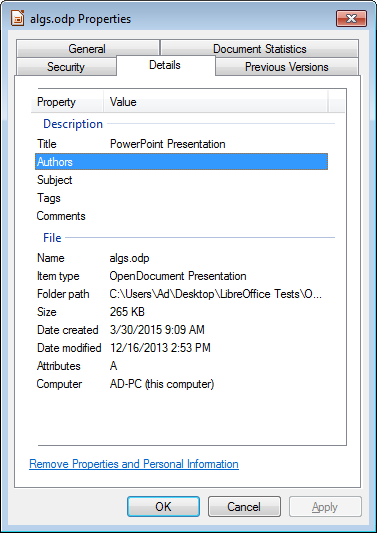
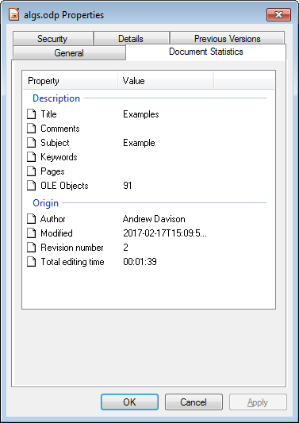
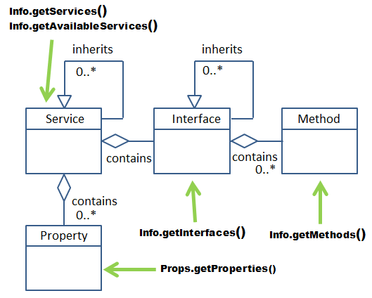
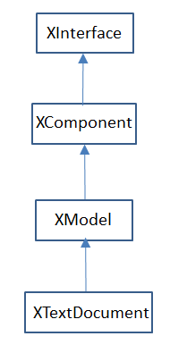

# Chapter 3. Examining

!!! note "Topics"
    Examining
    Office; Getting and
    Setting Document
    Properties; Examining a
    Document for API
    Details; Examining a
    Document Using MRI

    Example folders: "Office
    Tests" and "Utils"

This chapter looks at ways to examine the state of the
Office application and a document. A document will be
examined in three different ways: the first retrieves
properties about the file, such as its author, keywords, and
when it was last modified. The second and third
approaches extract API details, such as what services and
interfaces it uses. This can be done by calling functions in
my Utils class or by utilizing the MRI extension added to Office.

Once again all the examples come from the "Office Tests" directory in the code
download associated with this book, and make liberal use of the classes in the "Utils"
directory. For details please visit https://fivedots.coe.psu.ac.th/~ad/jlop/.


## 1.  Examining Office

It's sometimes necessary to examine the state of the Office application, for example to
determine its version number or installation directory. There are two main ways of
finding this information, using configuration properties and path settings.


### 1.1 Examining Configuration Properties

Configuration management is a complex area, which is explained reasonably well in
chapter 15 of the developer's guide and online at
https://wiki.openoffice.org/wiki/Documentation/DevGuide/Config/Configuration_Management;
I'll only explain the basics here. The easiest way of accessing the relevant
online section is by typing:
`loguide "Configuration Management"`

Office stores a large assortment of XML configuration data as ".xcd" files in the
`<OFFICE>\share\registry` directory. They can be programatically accessed in three
steps: first a ConfigurationProvider service is created, which represents the
configuration database tree. The tree is examined with a ConfigurationAccess service
which is supplied with the path to the node of interest. Configuration properties can
be accessed by name with the XNameAccess interface.

These steps are hidden inside Info.getConfig() which requires at most two arguments
– the path to the required node, and the name of the property inside that node.

The two most useful paths seem to be "/org.openoffice.Setup/Product" and
"/org.openoffice.Setup/L10N", which are hardwired as constants in the Info class. The
simplest version of getConfig() looks along both paths by default so the programmer
only has to supply a property name when calling the method. This is illustrated in the
OfficeInfo.java example in the "Office Tests/" folder:

```java
// in OfficeInfo.java
XComponentLoader loader = Lo.loadOffice();

// look up 5 Office properties
System.out.println("Office name: " + Info.getConfig("ooName"));
System.out.println("Office version (long): " +
                         Info.getConfig("ooSetupVersionAboutBox"));
System.out.println("Office version (short): " +
                         Info.getConfig("ooSetupVersion"));
System.out.println("Office language location: " +
                         Info.getConfig("ooLocale"));
System.out.println("System language location: \"" +
                       Info.getConfig("ooSetupSystemLocale") + "\"");
```

On one of my test machines, the following is printed:

```
Office name: LibreOffice
Office version (long): 5.1.0.3
Office version (short): 5.1
Office language location: en-US
System language location: ""
```

Many other property names, which don't seem that useful, are documented in my Info
class. One way of finding the most current list is to browse `main.xcd` in
`<OFFICE>\share\registry`.


### 1.2.  Examining Path Settings

Path settings store directory locations for parts of the Office installation, such as the
whereabouts of the gallery and spellchecker files. A partial list of predefined paths is
accessible from within LibreOffice, via the Tools menu: Tools, Options,
LibreOffice, Paths. But the best source of information is the developer's guide, in the
"Path Organization" section of chapter 6, or at
https://wiki.openoffice.org/wiki/Documentation/DevGuide/OfficeDev/Path_Organization,
which can be accessed using:
`loguide "Path Organization"`

One issue is that path settings comes in two forms: a string holding a single directory
path, or a string made up of a ";'-separated paths. Additionally, the directories are
returned in URI format (i.e. they start with "file:///").

Info.getPaths() hides the creation of a PathSettings service, and the accessing of its
properties.

Probably the most common Office forum question about paths is how to determine
Office's installation directory. Unfortunately, that isn't one of the paths stored in the
PathSettings service, but the information is accessible via one of the other paths. It's
possible to retrieve the path for AddIns (which is <OFFICE>/program/addin), and
move up the directory hierarchy two levels. This trick is implemented by
Info.getOfficeDir().

Examples of using Info.getOfficeDir() and Info.getPaths() appear in OfficeInfo.java:

```java
// in OfficeInfo.java
System.out.println("Office Dir: " + Info.getOfficeDir());

System.out.println("Working Dir: " + Info.getPaths("Work"));
System.out.println("Addin Dir: " + Info.getPaths("Addin"));
System.out.println("Filters Dir: " + Info.getPaths("Filter"));
System.out.println("Templates Dirs: " + Info.getPaths("Template"));
System.out.println("Gallery Dir: " + Info.getPaths("Gallery"));
```


## 2.  Getting and Setting Document Properties

Document properties is the information that's displayed when you right-click on a file
icon, and select "Properties" from the menu, as in Figure 1.


Figure 1. A Properties Dialog in Windows 7 for "algs.odp".


If you select the "Details" tab, a list of properties appears like those in Figure 2.




Figure 2. Details Properties List for "algs.odp".


An issue with document properties is that the Office API for manipulating them has
changed. The old interfaces were XDocumentInfoSupplier and XDocumentInfo, but
these have been deprecated, and replaced by XDocumentPropertiesSupplier and
XDocumentProperties. This wouldn't really matter except that while OpenOffice
retains those deprecated interfaces, LibreOffice has removed them.


### 2.1.  Reporting OS File Properties

My DocProps.java example prints the document properties by calling:
`Info.printDocProperties(doc);`

printDocProperties() converts the document to an XDocumentPropertiesSupplier
interface, and extracts the XDocumentProperties object:

```java
public static void printDocProperties(XComponent doc)
{
  XDocumentPropertiesSupplier docPropsSupp =
            UnoRuntime.queryInterface(
                   XDocumentPropertiesSupplier.class, doc);
  XDocumentProperties dps = docPropsSupp.getDocumentProperties();

  printDocProps(dps);
  XPropertyContainer udProps = dps.getUserDefinedProperties();
  Props.showObjProps("UserDefined Info", udProps);
 }  // end of printDocProperties()
```

Although the XDocumentProperties interface belongs to a DocumentProperties
service, that service does not contain any properties/attributes. Instead its data is
stored inside XDocumentProperties and accessed and changed with get/set methods
based on the attribute names. For example, the Author attribute is obtained by calling
XDocumentProperties.getAuthor().

As a consequence, my printDocProps() consists of a long list of get method calls
inside print statements:

```java
public static void printDocProps(XDocumentProperties dps)
{
  System.out.println("Document Properties Info");
  System.out.println("Author: " + dps.getAuthor());
  System.out.println("Title: " + dps.getTitle());
  System.out.println("Subject: " + dps.getSubject());
  System.out.println("Description: " + dps.getDescription());
  System.out.println("Generator: " + dps.getGenerator());
     :  // more of the same
}
```

However, user-defined file properties are accessed with an XPropertyContainer, as
can be seen back in printDocProperties().


### 2.2.  Setting Document Properties

The setting of document properties is done with set methods, as in Info.setDocProps()
which sets the file's subject, title, and author properties:

```java
// in the Info class
public static void setDocProps(XComponent doc,
                 String subject, String title, String author)
{
  XDocumentPropertiesSupplier dpSupplier =
           UnoRuntime.queryInterface(
                 XDocumentPropertiesSupplier.class, doc);
  XDocumentProperties docProps =
                 dpSupplier.getDocumentProperties();
  docProps.setSubject(subject);
  docProps.setTitle(title);
  docProps.setAuthor(author);
}  // end setDocProps()
```

This method is called at the end of DocProps.java:

```java
// code fragment from DocProps.java
Info.setDocProps(doc, "Example", "Examples", "Andrew Davison");
Lo.save(doc);     // must save or the props are lost
```

After the properties are changed, the document must be saved otherwise the changes
will be lost when the document is closed.

The changed properties appear in the "Document Statistics" list shown in Figure 3.




Figure 3. "Document Statistics" Properties List for "algs.odp".


## 3.  Examining a Document for API Information

After programming with the Office API for a while, you may start to notice that two
coding questions keep coming up. They are:
1.  For the service I'm using at the moment, what are its properties?
2.  When I need to do something to a document (e.g. close an XComponent
instance), which interface should I cast XComponent to by calling Lo.qi?

The first question arose in Chapter 2 when I needed to set properties in
loadComponentFromURL() and storeToURL(). Unfortunately the LibreOffice
documentation for OfficeDocument doesn't list all the properties associated with the
service. Have a look for yourself by typing `lodoc OfficeDocument service`, which
takes you to its IDL Page unfortunately. You'll then need to click on the
"OfficeDocument" link in the "Classes" section to reach the documentation.
OfficeDocument's "Public Attributes" section only lists four properties.

The second problem is also only partly addressed by the LibreOffice documentation.
The pages helpfully includes inheritance tree diagrams that can be clicked on to jump
to the documentation about other services and interfaces. But the diagrams don't make
a distinction between “contains” relationships (for interfaces in a service) and the two
kinds of inheritance (for services and for interfaces).

I'm not the first person to notice these problems; in fact, similar complaints have
appeared frequently in the Office forums. Two approaches for easing matters are
often suggested. One is to write code to print out details about a loaded document,
which is my approach in the next subsection. A second technique is to install an
Office extension for browsing a document's structure. I'll look at one such extension,
MRI, in section 2.2.


### 3.1.  Printing Programming Details about a Document

I've hidden the messy job of collecting service, interface, property, and method
information about a document inside the Info and Props utility classes. The five main
methods for retrieving details can be understood by considering their position in
Figure 4's Service and Interface Relationship diagram.




Figure 4. Methods to Investigate the Service and Interface
Relationships and Hierarchies.


The methods are shown in action in the DocProps.java example, which loads a
document and prints information about its services, interfaces, methods, and
properties. The relevant code fragment:

```java
// part of DocProps.java
XComponent doc = Lo.openDoc(args[0], loader);

System.out.println("\n------ Services for this document: -------");
for(String service : Info.getServices(doc))
  System.out.println("  " + service);

System.out.println("\n--- Available Services for this doc: ---");
int count = 0;
for(String service : Info.getAvailableServices(doc)) {
  System.out.println("  " + service);
  count++;
}
System.out.println("No. available services: " + count);

System.out.println("\n------ Interfaces for this document: -------");
count = 0;
for(String intfs : Info.getInterfaces(doc)) {
  System.out.println("  " + intfs);
  count++;
}
System.out.println("No. interfaces: " + count);

String interfaceName = "com.sun.star.text.XTextDocument";
System.out.println("\n------ Methods for interface " +
                                    interfaceName + ": ------");
String[] methods = Info.getMethods(interfaceName);
for(String methodName : methods)
  System.out.println("  " + methodName + "();");
System.out.println("No. methods: " + methods.length);

System.out.println("\n---- Properties for this document: ----");
count = 0;
for(Property p : Props.getProperties(doc)) {
  System.out.println("  " + Props.showProperty(p));
  count++;
}
System.out.println("No. properties: " + count);
```

When I examined a Word file with this program, only three services were found:
OfficeDocument, GenericTextDocument, and TextDocument, which correspond to
the text document part of the hierarchy in Chapter 1, Figure 9. That doesn't seem so
bad until you look at the output from the other Info.getXXX() methods: the document
can call 206 other available services, 69 interfaces, and manipulate 40 properties.

In the code above only the methods available to XTextDocument are printed:

```java
String interfaceName = "com.sun.star.text.XTextDocument";
String[] methods = Info.getMethods(interfaceName);
```

Sixteen methods are listed, collectively inherited from the interfaces in
XTextDocument 's inheritance hierarchy shown in Figure 5.




Figure 5. Inheritance Hierarchy for XTextDocument.


A similar diagram appears on the XTextDocument documentation webpage (`lodoc XTextDocument`),
but is complicated by also including the inheritance hierarchy for
the TextDocument service. Note, the interface hierarchy is also textually represented
in the "Public Member Functions" section of the documentation.

The last part of the code fragment prints all the document's property names and types
by calling Props.showProperty(). If you only want to know about one specific
property then use Props.getProperty(), which requires a reference to the document and
the property name:

```java
String propName = "CharacterCount";
System.out.println("Value of " + propName + ": " +
                         Props.getProperty(doc, propName) );
```

File Types
Another group of utility methods let a programmer investigate a file's document type.

The DocProps.java example also shows these methods in action:

```java
// part of DocProps.java
XComponentLoader loader = Lo.loadOffice();

String ext = Info.getExt(args[0]);
if (ext != null) {
  System.out.println("\nFile Extension: " + ext);
  System.out.println("Extension format: " + Lo.ext2Format(ext));
}

// get document type
String docType = Info.getDocType(args[0]);
if (docType != null) {
  System.out.println("Doc type: " + docType + "\n");
  Props.showDocTypeProps(docType);
}
```

One advantage of these functions is that they can be called before the file's document
is loaded with Lo.openDoc().

The data printed for the Word file, "story.doc", is:

```
File Extension: doc
Extension format: MS Word 97
Doc type: writer_MS_Word_97

Properties for "writer_MS_Word_97":
  Mandatory: false
  Finalized: false
  MediaType: application/msword
  Preferred: true
  UIName: Microsoft Word 97/2000/XP/2003
  Extensions: [doc]
  DetectService: com.sun.star.text.FormatDetector
  UINames: [     = Microsoft Word 97/2000/XP/2003  ]
  PreferredFilter: MS Word 97
  ClipboardFormat: MSWordDoc
  URLPattern: []
  Name: writer_MS_Word_97
```

Lo.ext2Format() print's the Office filter name ("MS Word 97") associated with the
file's extension (".doc"). Info.getDocType() returns the type of the document once the
file has been loaded (e.g. "writer_MS_Word_97"). Props.showDocTypeProps() prints
the properties associated with that type. Probably the most useful is the
"PreferredFilter" which is the best filter name to use when saving the document.


### 3.2.  Examining a Document Using Extensions

It's hardly surprising that Office developers have wanted to make the investigation of
services, interfaces, and properties associated with documents and other objects
easier. There are several extension which do this, and I tried three of them: MRI,
XRayTool (https://bernard.marcelly.perso.sfr.fr/Files_en/XrayTool60_en.odt), and
Object Inspector (https://wiki.openoffice.org/wiki/Object_Inspector). Probably the
best in terms of functionality and documentation is MRI, which I'll describe here.

MRI can be downloaded from
https://extensions.services.openoffice.org/en/project/mri-uno-object-inspection-tool,
depositing an OXT file (probably called "MRI-1.3.3.oxt") on your machine.

Installing an extension is done through the Tools, Extension Manager menu item.

Click on the "Add" button and select the OXT file. Or you may be able to simply
double click on the file to start the installation.

One (perhaps temporary) problem is that I was unable to install the versions of MRI
available at the LibreOffice extensions site (v.1.1.2 or the pre-release v.1.1.4 at
https://extensions.libreoffice.org/extension-center). However, the newer edition,
v.1.2.4, at OpenOffice's extension's website
(https://extensions.services.openoffice.org/en/project/mri-uno-object-inspection-tool)
did install successfully.

Once installed, MRI can be accessed through Office's GUI via the Tools, Add-ons
menu item, or programmatically as in my ExamineDoc.java example:

```java
// part of ExamineDoc.java
XComponentLoader loader = Lo.loadOffice();
XComponent doc = Lo.openDoc(args[0], loader);
Lo.mriInspect(doc);
```

A window appears, like the one in Figure 6.


Figure 6. MRI Examination of a Document.


The tabs along the top of the large window allow you to switch between information
about the document's properties, methods, interfaces, and services. Unlike my earlier
print methods, it's possible to move around the window's data, looking inside property
objects.

One enormously useful feature is automatic code generation, which is possible in a
variety of different languages, including Java. The code type is set through the Tools,
Code menu item, and the code appears in a window which is initially of size 0. It's
hidden below the large window and above the status bar; drag the large window's
lower border upwards to make the code window visible.

A click on a method or property will cause code to be generated which utilizes the
method or property. For example, when I clicked on the CharacterCount property
(shown at the bottom of Figure 6), the following code fragment was produced:

```java
public static void snippet(XComponentContext xComponentContext,
                               Object oInitialTarget)
{ try {
    XPropertySet xPropSet = UnoRuntime.queryInterface(
                              XPropertySet.class, oInitialTarget);
    int nCharacterCount = AnyConverter.toInt(
                 xPropSet.getPropertyValue("CharacterCount"));
  }
  catch (UnknownPropertyException e1)
  { e1.printStackTrace(); }
  catch (IllegalArgumentException e2)
  { e2.printStackTrace(); }
  catch (WrappedTargetException e3)
  { e3.printStackTrace(); }
}
```

The snippet() function is passed the component context and initial target object (the
text document). UnoRuntime.queryInterface() casts the document to the XPropertySet
interface, and getPropertyValue() looks up the CharacterCount value. (Recall that
Office's UnoRuntime.queryInterface() is my Lo.qi().)
The Office AnyConverter class converts Office types to Java types, but could actually
be left out in this case. The exception handling could also be shortened.

One benefit of using MRI is the large amount of excellent documentation. The
extension includes a "Help" menu item, and a configurable link to online Office
documentation. MRI has its own wiki, at https://github.com/hanya/MRI/wiki/, and
there are several forum posts about using it for code generation (e.g.
https://forum.openoffice.org/en/forum/viewtopic.php?f=74&t=49294) and for
navigating MRI's object hierarchy
(https://forum.openoffice.org/en/forum/download/file.php?id=17368&sid=373c5d78240f4093fb3721fe4264dd20).


#### Some Quirks of Using MRI

Lo.mriInspect() executes the following code, which I lifted from the "Run MRI"
section of the MRI wiki:

```java
// in Lo.java
public static void mriInspect(Object obj)
{
  XIntrospection xi =
        createInstanceMCF(XIntrospection.class, "mytools.Mri");
  if (xi == null) {
    System.out.println("MRI Inspector Service could not
                        be instantiated");
    return;
  }
  System.out.println("MRI Inspector Service instantiated");
  xi.inspect(obj);
}  // end of mriInspect()
```

"mytools.Mri" is the name of the service added to Office when MRI is installed.

createInstanceMCF() creates an instance of the service, and accesses its
XIntrospection interface, so that the XIntrospection.inspect() method can be called.

One drawback is that inspect() returns immediately after spawning the MRI GUI (i.e.
the window in Figure 3), allowing ExamineDoc.java to continue. It would be better if
the program paused, which can be achieved by calling Lo.waitEnter():

```java
// part of ExamineDoc.java
XComponentLoader loader = Lo.loadOffice();
XComponent doc = Lo.openDoc(args[0], loader);
Lo.mriInspect(doc);

Lo.waitEnter();
```

Another issue is that when the MRI window is closed by the user, the link to Office is
broken (the UNO bridge is deleted). But this doesn't happen if the document is visible
on-screen when the MRI window is closed.

In general, it turns out to be quite useful to display the document, especially during
program debugging and development. A visible document allows the coder to see
incremental changes as they occur.

The simplest way of making a document visible is by employing the FCM
relationship mentioned in Chapter 1. Starting from the document, it's easy to switch to
the XModel interface, and from there go to the container window. Its XWindow
interface has a setVisible() method that can make the document visible (or hide it).

The corresponding code fragment is:

```java
XModel model = Lo.qi(XModel.class, doc);
XFrame frame = model.getCurrentController().getFrame();
XWindow xWindow = frame.getContainerWindow();
xWindow.setVisible(true);   // or false to hide
xWindow.setFocus();
```

This code is packaged up in the GUI utility class, and called with GUI.setVisible().

The code in ExpandDoc becomes:

```java
// part of ExamineDoc.java
XComponentLoader loader = Lo.loadOffice();
XComponent doc = Lo.openDoc(args[0], loader);

GUI.setVisible(doc, true);   // needed so that close of MRI doesn't
                             // cause the UNO bridge to be disposed
Lo.mriInspect(doc);
Lo.waitEnter();
```
