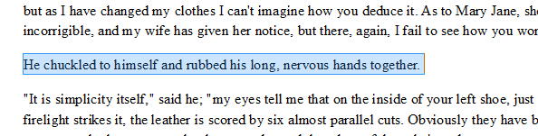
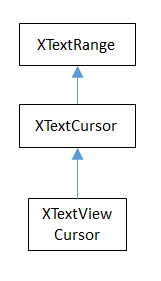
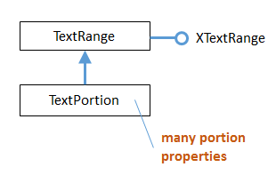

# Chapter 5. Text API Overview

!!! note "Topics"
    API Overview;
    Text Cursors; Extracting
    Text; Cursor Iteration;
    Creating Cursors;
    Creating a Document;
    Using and Comparing
    Text Cursors;
    Inserting/Changing Text
    in a Document; Text
    Enumeration;
    Appending Documents

    Example folders: "Text
    Tests" and "Utils"


The next few chapters look at programming with the text
document part of the Office API. This chapter begins with
a quick overview of the text API, then a detailed look at
text cursors for moving about in a document, extracting
text, and adding/inserting new text.

Text cursors aren't the only way to move around inside a
document; it's also possible to iterate over a document by
treating it as a sequence of paragraphs.

The chapter finishes with a look at how two (or more) text
documents can be appended.

The online Developer's Guide begins text document programming at
https://wiki.openoffice.org/wiki/Documentation/DevGuide/Text/Text_Documents
(the easiest way of accessing that page is to type loguide writer). It corresponds to
Chapter 7 in the printed guide (available at
https://wiki.openoffice.org/w/images/d/d9/DevelopersGuide_OOo3.1.0.pdf), but the
Web material is better structured and formatted.

The guide's text programming examples are in TextDocuments.java, downloadable
from https://api.libreoffice.org/examples/DevelopersGuide/examples.html#Text.

Although the code is long, it's well-organized. Some smaller text processing examples
are available at https://api.libreoffice.org/examples/examples.html#Java_examples.

This chapter (and later ones) assume that you're familiar with Writer, including text
concepts such as paragraph styles. If you're not, then I recommend the "Writer
Guide", a user manual, available at https://libreoffice.org/get-help/documentation
or https://wiki.documentfoundation.org/Documentation/Publications.


## 1.  An Overview of the Text Document API

The API is centered around four text document services which subclass
OfficeDocument, as shown in Figure 1.


Figure 1. The Text Document Services.


I'll be concentrating on the TextDocument service, which is documented at
https://api.libreoffice.org/docs/idl/ref/servicecom_1_1sun_1_1star_1_1text_1_1TextDocument.html.
Or you can type `lodoc TextDocument service`, which unfortunately
takes you to the IDL page for TextDocument; to reach the documentation, click on
"TextDocument" under the "Classes" heading.

The GlobalDocument service in Figure 1 is employed by master documents, such as a
book or thesis. A master document is typically made up of links to files holding its
parts, such as chapters, bibliography, and appendices.

The WebDocument service in Figure 1 is for manipulating web pages, although its
also possible to generate HTML files with the TextDocument service.

TextDocument, GlobalDocument, and WebDocument are mostly empty because those
services don't define any interfaces or properties. The GenericTextDocument service
is where  the action takes place, as summarized in Figure 2.


Figure 2. The Text Document Services, and some Interfaces.


The numerous 'Supplier' interfaces in Figure 2 are Office's way of accessing different
elements in a document. For example, XStyleFamiliesSupplier manages character,
paragraph, and other styles, while XTextTableSupplier deals with tables.

I'll be looking at these suppliers in later chapters, which is why they're highlighted,
but for now let's only consider the XTextDocument interface at the top right of the
GenericTextDocument service box in Figure 2
XTextDocument has a getText() method for returning an XText object. XText
supports functionality related to text ranges and positions, cursors, and text contents.

It inherits XSimpleText and XTextRange, as indicated in Figure 3.


Figure 3. XText and its Superclasses.


Text content covers a multitude, such as embedded images, tables, footnotes, and text
fields. Many of the suppliers shown in Figure 2 (e.g. XTextTablesSupplier) are for
iterating through text content (e.g. accessing the document's tables).

I'll concentrate on ordinary text in this chapter, and look at more esoteric content
forms in Chapters 7 and 8.

A text document can utilize eight different cursors, which fall into two groups, as in


Figure 4.


Figure 4. Types of Cursor.


XTextCursor contains methods for moving around the document, and an instance is
often called a model cursor because of its close links to the document's data. A
program can create multiple XTextCursor objects if it wants, and can convert an
XTextCursor into XParagraphCursor, XSentenceCursor, or XWordCursor. The
differences are that while an XTextCursor moves through a document character by
character, the others travel in units of paragraphs, sentences, and words.

A program may employ a single XTextViewCursor cursor, to represent the cursor the
user sees in the Writer application window; for this reason, it's often called the view
cursor. XTextViewCursor can be converted into a XLineCursor, XPageCursor, or
XScreenCursor object, which allows it to move in terms of lines, pages, or screens.

A cursor's location is specified using a text range, which can be the currently selected
text, or a position in the document. A text position is a text range that begins and ends
at the same point.


## 2.  Extracting Text from a Document

The ExtractText.java example opens a document using Lo.openOffice(), and tries to
print its text:

```java
public static void main(String[] args)
{
  if (args.length != 1) {
    System.out.println("Usage: ExtractText fnm");
    return;
  }

  XComponentLoader loader = Lo.loadOffice();
  XComponent doc = Lo.openDoc(args[0], loader);
  if (doc == null) {
    System.out.println("Could not open " + args[0]);
    Lo.closeOffice();
    return;
  }

  if (Info.isDocType(doc, Lo.WRITER_SERVICE)) {
    XTextDocument textDoc = Write.getTextDoc(doc);
    XTextCursor cursor = Write.getCursor(textDoc);
    String text = Write.getAllText(cursor);
    System.out.println("--------- Text Content --------");
    System.out.println(text);
    System.out.println("-------------------------------");
  }
  else
    System.out.println("Extraction unsupported for this doc type");

  Lo.closeDoc(doc);
  Lo.closeOffice();
} // end of main()
```

Info.isDocType() tests the document's type by casting it into an XServiceInfo
interface. Then it calls XServiceInfo.supportsService() to check the document's
service capabilities:

```java
public static boolean isDocType(Object doc, String docType)
// in the Info utility class
{ XServiceInfo si = Lo.qi(XServiceInfo.class, doc);
  return si.supportsService(docType);
}
```

The argument type of the document is Object rather than XComponent so that a wider
range of objects can be passed to the function for testing.

The service names for documents are hard to remember, so they're defined as
constants in my Lo class:

```java
// in the Lo class
public static final String WRITER_SERVICE =
               "com.sun.star.text.TextDocument";
public static final String BASE_SERVICE =
               "com.sun.star.sdb.OfficeDatabaseDocument";
public static final String CALC_SERVICE =
               "com.sun.star.sheet.SpreadsheetDocument";
public static final String DRAW_SERVICE =
               "com.sun.star.drawing.DrawingDocument";
public static final String IMPRESS_SERVICE =
              "com.sun.star.presentation.PresentationDocument";
public static final String MATH_SERVICE =
              "com.sun.star.formula.FormulaProperties";
```

Write.getTextDoc() uses Lo.qi() to cast the document's XComponent interface into an
XTextDocument:

```java
// in the Lo class
public static final String WRITER_SERVICE =
               "com.sun.star.text.TextDocument";
public static final String BASE_SERVICE =
               "com.sun.star.sdb.OfficeDatabaseDocument";
public static final String CALC_SERVICE =
               "com.sun.star.sheet.SpreadsheetDocument";
public static final String DRAW_SERVICE =
               "com.sun.star.drawing.DrawingDocument";
public static final String IMPRESS_SERVICE =
              "com.sun.star.presentation.PresentationDocument";
public static final String MATH_SERVICE =
              "com.sun.star.formula.FormulaProperties";
```

TextDocument textDoc = Lo.qi(XTextDocument.class, doc);
This may fail (i.e. return null) if the loaded document isn't an instance of the
TextDocument service.

The casting 'power' of Lo.qi() is confusing – it depends on the document's service
type. All text documents are instances of the TextDocument service (see Figure 2).
This means that Lo.qi() can 'switch' between any of the interfaces defined by
TextDocument or its superclasses (i.e. the interfaces in GenericTextDocument or
OfficeDocument). For instance, the following cast is fine:

```java
XStyleFamiliesSupplier xSupplier =
                   Lo.qi(XStyleFamiliesSupplier.class, doc);
```

This changes the instance into an XStyleFamiliesSupplier, which can access the
document's styles.

Alternatively, the following converts the instance into a supplier defined in
OfficeDocument:

```java
XDocumentPropertiesSupplier xSupplier =
               Lo.qi(XDocumentPropertiesSupplier.class, doc);
```

Most of the examples in this chapter and the next few cast the document to
XTextDocument since that interface can access the document's contents as an XText
object:

```java
XTextDocument textDoc = Lo.qi(XTextDocument.class, doc);
XText xText = textDoc.getText();
```

The XText instance can access all the capabilities shown in Figure 3.

A common next step is to create a cursor for moving around the document. This is
easy since XText inherits XSimpleText which has a createTextCursor() method:

```java
XTextCursor textCursor = xText.createTextCursor();
```

These few lines are so useful that I've put them inside a Write.getCursor() method:

```java
public static XTextCursor getCursor(XTextDocument textDoc)
// get cursor from a text document
{
  XText xText = textDoc.getText();
  if (xText == null) {
    System.out.println("Text not found in document");
    return null;
  }
  else
    return xText.createTextCursor();
}  // end of getCursor()
```

An XTextCursor can be converted into other kinds of model cursors (e.g.

XParagraphCursor, XSentenceCursor, XWordCursor; see Figure 4). That's not
necessary in for the ExtractText.java example; instead, the XTextCursor is passed to
Write.getAllText() to access the text as a sequence of characters:

```java
public static String getAllText(XTextCursor cursor)
{
  cursor.gotoStart(false);
  cursor.gotoEnd(true);
  String text = cursor.getString();
  cursor.gotoEnd(false);    // to deselect everything in the doc
  return text;
}  // end of getAllText()
```

All cursor movement operations take a boolean argument which specifies whether the
movement should also select the text. For example, in getAllText(),
cursor.gotoStart(false) shifts the cursor to the start of the text without selecting
anything. The subsequent call to cursor.gotoEnd(true) moves the cursor to the end of
the text and selects all the text moved over. The call to getString() on the third line
returns the selection (i.e. all the text in the document).

Two other useful XTextCursor methods are:

```java
boolean goLeft(short charCount, boolean isSelected)
boolean goRight(short charCount, boolean isSelected)
```

They move the cursor left or right by a given number of characters, and the boolean
argument specifies whether the text moved over is selected.

All cursor methods return a boolean result which indicates if the move (and optional
selection) was successful.

Another method worth knowing is:

```java
boolean gotoRange(XTextRange textRange, boolean isSelected)
```

gotoRange() takes an XTextRange argument, which represents a selected region or
position where the cursor should be moved to. For example, it's possible to find a
bookmark in a document, extract its text range/position, and move the cursor to that
location with gotoRange(). I'll show code for doing this in Chapter 7.

The XTextCursor methods are documented at
https://api.libreoffice.org/docs/idl/ref/interfacecom_1_1sun_1_1star_1_1text_1_1XTextCursor.html
(or type `lodoc XTextCursor`).


#### A Problem with Write.getAllText()

Write.getAllText() may fail if supplied with a very large document because
XTextCursor.getString() might be unable to construct a big enough String object. For
that reason, it's better to iterate over large documents returning a paragraph of text at a
time. These iteration techniques are described next.


## 3.  Cursor Iteration

My HighlightText.java example uses paragraph and word cursors (i.e. the
XParagraphCursor and XWordCursor interfaces in Figure 4). It also employs the view
cursor, an XTextViewCursor instance, to control the Writer application's visible
cursor.

```java
The main() function of HighlightText:

public static void main(String args[])
{
  if (args.length < 1) {
    System.out.println("Usage: run HighlightText <fnm>");
    return;
  }

  XComponentLoader loader = Lo.loadOffice();
  XTextDocument doc = Write.openDoc(args[0], loader);
  if (doc == null) {
    System.out.println("Could not open " + args[0]);
    Lo.closeOffice();
    return;
  }

  GUI.setVisible(doc, true);  // make doc visible on-screen

  showParagraphs(doc);
  System.out.println("Word count: " + countWords(doc));
  showLines(doc);

  Lo.closeDoc(doc);
  Lo.closeOffice();
}  // end of main()
```

main() calls Write.openDoc() to return the opened document as an XTextDocument
instance. If you recall, the previous ExtractText.java example started with an
XComponent instance by calling Lo.openDoc(), and then converted it to
XTextDocument. Write.openDoc() returns the XTextDocument reference in one go.

showParagraphs() moves the visible on-screen cursor through the document,
highlighting a paragraph at a time. This requires two cursors – an instance of
XTextViewCursor and a separate XParagraphCursor. The paragraph cursor is capable
of moving through the document paragraph-by-paragraph, but it's a model cursor, so
invisible to the user looking at the document on-screen. showParagraphs() extracts the
start and end positions of each paragraph and uses them to move the view cursor,
which is visible.

The code for showParagraphs():

```java
private static void showParagraphs(XTextDocument doc)
{
  XTextViewCursor tvc = Write.getViewCursor(doc);
  XParagraphCursor paraCursor = Write.getParagraphCursor(doc);
  paraCursor.gotoStart(false);
              // go to start of text; no selection
  do {
    paraCursor.gotoEndOfParagraph(true); // select 1 paragraph
    String currPara = paraCursor.getString();
    if (currPara.length() > 0) {
      // move view cursor to highlight current paragraph
      tvc.gotoRange( paraCursor.getStart(), false);
      tvc.gotoRange( paraCursor.getEnd(), true);

      Lo.wait(500);   // slow down paragraph changing speed
    }
  } while (paraCursor.gotoNextParagraph(false));
}  // end of showParagraphs()
```

The code utilizes two Write utility functions (Write.getViewCursor() and
Write.getParagraphCursor()) to create the cursors. The subsequent do-while loop is a
common coding pattern for iterating over a text document:

```java
paraCursor.gotoStart(false);
do {
  paraCursor.gotoEndOfParagraph(true);   // select 1 paragraph

  // do something to the selected text range...

} while (paraCursor.gotoNextParagraph(false));
```

gotoNextParagraph() tries to move the cursor to the beginning of the next paragraph.

If the moves fails (i.e. when the cursor has reached the end of the document), the
function returns false, and the loop terminates.

The call to gotoEndOfParagraph() at the beginning of the loop moves the cursor to the
end of the paragraph and selects its text. Since the cursor was originally at the start of
the paragraph, the selection will span that paragraph.

XParagraphCursor and the sentence and word cursors inherit XTextCursor, as shown
in Figure 5.


Figure 5. The Model Cursors Inheritance Hierarchy.


Since all these cursors also inherit XTextRange, they can easily access and change
their text selections/positions. In the showParagraphs() method above, the two ends of
the paragraph are obtained by calling the inherited XTextRange.getStart() and
XTextRange.getEnd(), and the positions are used to move the view cursor:

```java
XTextViewCursor tvc = Write.getViewCursor(doc);
       :
tvc.gotoRange(paraCursor.getStart(), false);
tvc.gotoRange(paraCursor.getEnd(), true);
```

gotoRange() sets the text range/position of the view cursor: the first call moves the
cursor to the paragraph's starting position without selecting anything, and the second
moves it to the end position, selecting all the text in between. Since this is a view
cursor, the selection is visible on-screen, as illustrated in Figure 6.




Figure 6. A Selected Paragraph.


Note that getStart() and getEnd() do not return integers but collapsed text ranges,
which is Office-lingo for a range that starts and ends at the same cursor position.

Somewhat confusingly, the XTextViewCursor interface inherits XTextCursor (as
shown in Figure 7). This only means that XTextViewCursor supports the same
character-based movement and text range operations as the model-based cursor.




Figure 7. The XTextViewCursor Inheritance Hierarchy.


## 4.  Creating Cursors

An XTextCursor is created by calling Write.getCursor(), which can then be converted
into a paragraph, sentence, or word cursor by using Lo.qi(). For example, the Write
utility class defines getParagraphCursor() as:

```java
public static XParagraphCursor getParagraphCursor(
                                      XTextDocument textDoc)
{ XTextCursor cursor = getCursor(textDoc);
  if (cursor == null) {
    System.out.println("Text cursor is null");
    return null;
  }
  else
    return Lo.qi(XParagraphCursor.class, cursor);
}  // end of getParagraphCursor()
```

Obtaining the view cursor is a little more tricky since it's only accessible via the
document's controller.

As described in Chapter 1, section 5 about the FCM relationship, the controller is
reached via the document's model, as shown in the first two lines of
Write.getViewCursor():

```java
public static XTextViewCursor getViewCursor(XTextDocument textDoc)
{
  XModel model = Lo.qi(XModel.class, textDoc);
  XController xController = model.getCurrentController();

  // the controller supplies the TextViewCursor
  XTextViewCursorSupplier supplier = Lo.qi(
                   XTextViewCursorSupplier.class, xController);
  return supplier.getViewCursor();
}  // end of getViewCursor()
```

The view cursor isn't directly accessible from the controller; a supplier must be
queried, even though there's only one view cursor per document.


### 4.1.  Counting Words

countWords() in HightlightText.java shows how to iterate over the document using a
word cursor:

```java
private static int countWords(XTextDocument doc)
{
  XWordCursor wordCursor = Write.getWordCursor(doc);
  wordCursor.gotoStart(false);     // go to start of text

  int wordCount = 0;
  String currWord;
  do {
    wordCursor.gotoEndOfWord(true);
    currWord = wordCursor.getString();
    if (currWord.length() > 0)
      wordCount++;
  } while( wordCursor.gotoNextWord(false));
  return wordCount;
}  // end of countWords()
```

This uses the same kind of do-while loop as showParagraphs() except that the
XTextWordCursor methods gotoEndOfWord() and gotoNextWord() control the
iteration. Also, there's no need for an XTextViewCursor instance since the selected
words aren't shown on the screen.


### 4.2.  Displaying Lines

showLines() in HightlightText.java iterates over the document highlighting a line at a
time. Don't confuse this with sentence selection because a sentence may consist of
several lines on the screen. A sentence is part of the text's organization (i.e. in terms
of words, sentences, and paragraphs) while a line is part of the document view (i.e.

line, page, screen). This means that XLineCursor is a view cursor, which is obtained
by converting XTextViewCursor with Lo.qi():

```java
XTextViewCursor tvc = Write.getViewCursor(doc);
XLineCursor lineCursor =  Lo.qi(XLineCursor.class, tvc);
```

The line cursor has limited functionality compared to the model cursors (paragraph,
sentence, word). In particular, there's no "next' function for moving to the next line
(unlike gotoNextParagraph() or gotoNextWord()). The screen cursor also lacks this
ability, but the page cursor offers jumpToNextPage().

One way of getting around the absence of a 'next' operation is shown in showLines():

```java
private static void showLines(XTextDocument doc)
{
  XTextViewCursor tvc = Write.getViewCursor(doc);
  tvc.gotoStart(false);     // go to start of text

  XLineCursor lineCursor =
         Lo.qi(XLineCursor.class, tvc);

  boolean haveText = true;
  do {
    lineCursor.gotoStartOfLine(false);
    lineCursor.gotoEndOfLine(true);  // select 1 line

    Lo.wait(500);   // slow down the line changing speed
    tvc.collapseToEnd();  // make selection disappear

    haveText = tvc.goRight((short) 1, true); // move 1 char
  } while (haveText);
}  // end of showLines()
```

The view cursor is manipulated using the XTextViewCursor object and the
XLineCursor line cursor. This is possible since the two references point to the same
on-screen cursor. Either one can move it around the display.

Inside the loop, XLineCursor's gotoStartOfLine() and gotoEndOfLine() highlight a
single line. Then the XTextViewCursor instance deselects the line, by moving the
cursor to the end of the selection with collapseToEnd(). At the end of the loop,
goRight() tries to move the cursor one character to the right. If goRight() succeeds
then the cursor is shifted one position to the first character of the next line. When the
loop repeats, this line will be selected. If doRight() fails, then there are no more
characters to be read from the document, and the loop finishes.


## 5.  Creating a Document

All the examples so far have involved the manipulation of an existing document. The
HelloText.java example creates a new text document, containing two short
paragraphs, and saves it as "hello.odt". The main() function is:

```java
public static void main(String[] args)
{
  XComponentLoader loader = Lo.loadOffice();
  XTextDocument doc = Write.createDoc(loader);

  if (doc == null) {
    System.out.println("Writer doc creation failed");
    Lo.closeOffice();
    return;
  }

  GUI.setVisible(doc, true);    // make the document visible

  XTextCursor cursor = Write.getCursor(doc);
  cursor.gotoEnd(false);
           // move cursor to end of doc before appending

  Write.appendPara(cursor, "Hello LibreOffice.\n");
  Lo.wait(1000);   // slow things down so they can be seen

  Write.appendPara(cursor, "How are you?.");
  Lo.wait(2000);

  Lo.saveDoc(doc, "hello.odt");
         // or use extension doc, docx, rtf, pdf, txt
  Lo.closeDoc(doc);
  Lo.closeOffice();
} // end of main()
```

Write.createDoc() calls Lo.createDoc() with the text document service name (the
Lo.WRITER_STR constant is "swriter"). Office creates a TextDocument service with
an XComponent interface, which is cast to the XTextDocument interface, and
returned:

```java
// in the Write class
public static XTextDocument createDoc(XComponentLoader loader)
{
  XComponent doc = Lo.createDoc(Lo.WRITER_STR, loader);
  return Lo.qi(XTextDocument.class, doc);
}
```

Text documents are saved using Lo.saveDoc() which was described in Chapter 2.
saveDoc() examines the filename's extension to determine its type. The known
extensions include doc, docx, rtf, odt, pdf, and txt.

Back in HelloText.java, a cursor is needed before text can be added; one is created by
calling Write.getCursor().

The call to XTextCursor.gotoEnd() isn't really necessary because the new cursor is
pointing to an empty document so is already at its end. It's included to emphasize the
assumption by Write.appendPara() (and other Write.appendXXX() functions) that the
cursor is positioned at the end of the document before new text is added.

Write.appendPara() calls three other methods in the Write utility class:

```java
// in the Write class
public static int appendPara(XTextCursor cursor, String text)
{ append(cursor, text);
  append(cursor, ControlCharacter.PARAGRAPH_BREAK);
  return getPosition(cursor);
}
```

The 'append' name is utilized several times in Write – one version takes a string as its
second argument, the other a short representing a control character:

```java
// in the Write class
public static int append(XTextCursor cursor, String text)
{ cursor.setString(text);
  cursor.gotoEnd(false);
  return getPosition(cursor);
}  // end of append()


public static int append(XTextCursor cursor, short ctrlChar)
{ XText xText = cursor.getText();
  xText.insertControlCharacter(cursor, ctrlChar, false);
  cursor.gotoEnd(false);
  return getPosition(cursor);
}
```

The first append() function uses XTextCursor.setString() to add the user-supplied
string. The second function employs XTextCursor.insertControlCharacter(). After the
addition of the text or character, the cursor is moved to the end of the document, and
getPosition() is called to return the cursor's new position as an integer:

```java
public static int getPosition(XTextCursor cursor)
{  return (cursor.getText().getString()).length();  }
```

getPosition() is not very robust – it assumes that getString() will be able to convert the
document's text into a string. This may fail if the document is very big (you may
recall the same problem with my Write.getAllText() described earlier).

Office deals with this size issue by using XTextRange instances, which encapsulate
text ranges and positions. Write.getPosition() returns an integer because its easier to
understand when you're first learning to program with Office. It's better style to use
and compare XTextRanges rather than integer positions, an approach I'll demonstrate
in the next section.


## 6.  Using and Comparing Text Cursors

My TalkingBook.java example utilizes the third-party library FreeTTS
(https://freetts.sourceforge.net/) to convert text into speech. The inner workings of
FreeTTS aren't relevant here, so are hidden inside a support class called Speaker. It
has three public methods:

* Speaker(): instantiates a FreeTTS instance – a male voice
* say(String s): converts the string s into speech
* dispose(): closes down the FreeTTS instance

TalkingBook employs two text cursors: a paragraph cursor that iterates over the
paragraphs in the document, and a sentence cursor that iterates over all the sentences
in the current paragraph and passes each sentence to Speaker.say(). FreeTTS is
capable of speaking long or short sequences of text, but TalkingBook processes a
sentence at a time since this sounds more natural when spoken.

The crucial function in TalkingBook.java is speakSentences():

```java
private static void speakSentences(XTextDocument doc)
{
  Speaker speaker = new Speaker();  // create FreeTTS voice

  XTextViewCursor tvc = Write.getViewCursor(doc);
  XParagraphCursor paraCursor = Write.getParagraphCursor(doc);
  paraCursor.gotoStart(false);     // go to start of text

  // create range comparer for the entire document
  XTextRangeCompare comparer =  Lo.qi(
                        XTextRangeCompare.class, doc.getText());

  String currParaStr, currSentStr;
  do {
    paraCursor.gotoEndOfParagraph(true);  // select 1 paragraph
    XTextRange endPara = paraCursor.getEnd();

    currParaStr = paraCursor.getString();

    if (currParaStr.length() > 0) {
      // set sentence cursor to start of paragraph
      XTextCursor cursor =
            paraCursor.getText().createTextCursorByRange(
                                           paraCursor.getStart());
      XSentenceCursor sc = Lo.qi(
                                  XSentenceCursor.class, cursor);
      sc.gotoStartOfSentence(false);   // goto start
      do {
        sc.gotoEndOfSentence(true);   // select 1 sentence
        if (comparer.compareRegionEnds(endPara, sc.getEnd()) > 0)
          // has sentence cursor passed end of current paragraph?
          break;

        // move view cursor to highlight current sentence
        tvc.gotoRange(sc.getStart(), false);
        tvc.gotoRange(sc.getEnd(), true);

        currSentStr = stripNonWordChars(sc.getString());
                      // clean up string to make speech nicer
        if (currSentStr.length() > 0)
          speaker.say(currSentStr);
      } while (sc.gotoNextSentence(false));
    }
  } while (paraCursor.gotoNextParagraph(false));

  speaker.dispose();
}  // end of speakSentences()
```

speakSentences() comprises two nested loops: the outer loop iterates through the
paragraphs, and the inner loop through the sentences in the current paragraph.

The sentence cursor is created like so:

```java
XTextCursor cursor =
        paraCursor.getText().createTextCursorByRange(
                                     paraCursor.getStart());
XSentenceCursor sc =
        Lo.qi(XSentenceCursor.class, cursor);
```

The XText reference is returned by paraCursor.getText(), and a text cursor is created.

createTextCursorByRange() allows the start position of the cursor to be specified. The
text cursor is converted into a sentence cursor with Lo.qi().

The tricky aspect of this code is the meaning of paraCursor.getText() which is the
XText object that paraCursor utilizes. This is not a single paragraph but the entire text
document. Remember that the paragraph cursor is created with:
XParagraphCursor paraCursor = Write.getParagraphCursor(doc);
This corresponds to:

XText xText = doc.getText();
XTextCursor textCursor = xText.createTextCursor();
XParagraphCursor paraCursor = Lo.qi(
                         XParagraphCursor.class, textCursor);

Both the paragraph and sentence cursors refer to
the entire text document. This means that I cannot
code the inner loop using the coding pattern from
before. That would result in something like the
following:

```java
// set sentence cursor to point to start
of this paragraph
XTextCursor cursor = paraCursor.getText().createTextCursorByRange(
                                            paraCursor.getStart())
XSentenceCursor sc = Lo.qi(
                                   XSentenceCursor.class, cursor);

sc.gotoStartOfSentence(false);   // goto start
do {
  sc.gotoEndOfSentence(true);    // select 1 sentence
  // do something with the sentence
  //  :
} while (sc.gotoNextSentence(false));
```

!!! Note
    To further confuse matters, a
    XText object does not always
    correspond to the entire text
    document. For example, a text
    frame (e.g. like this one) can
    return an XText object for the
    text only inside the frame.

The problem with the above code fragment is that
XSentenceCursor.gotoNextSentence() will keep moving to the next sentence until it
reaches the end of the text document. This is not the desired behavior – what I want is
for the loop to terminate when the last sentence of the current paragraph has been
processed.

We need to compare text ranges, in this case the end of the current sentence with the
end of the current paragraph. This capability is handled by the XTextRangeCompare
interface. A comparer object is created at the beginning of speakSentence(), initialized
to compare ranges that can span the entire document:

```java
XTextRangeCompare comparer =
   Lo.qi(XTextRangeCompare.class, doc.getText());
```

This comparer object is utilized inside the sentence-iterating loop to compare the end
of the current paragraph (the endPara text range) with the end of current sentence (the
sc.getEnd() text range):

```java
if (comparer.compareRegionEnds(endPara, sc.getEnd()) > 0)
  break;
```

If the sentence ends after the end of the paragraph then compareRegionEnds() returns
a positive number, and the inner loop terminates.

This approach doesn't suffer from the problem in Write.getPosition() with
XTextRange.getString(), and using its length as a position:


```java
public static int getPosition(XTextCursor cursor)
{  return (cursor.getText().getString()).length();
```

Since there's no String object being created by the comparer, there's no way that the
instantiation can fail due to the size of the text.


## 7.  Inserting/Changing Text in a Document

My ShuffleWords.java example searches a document and changes the words it
encounters. Figure 8 shows the program in progress: "predominates" has been
selected but not yet changed, but all the previous 'big' words have been shuffled.


Figure 8. Shuffling of Words.


A word shuffle is applied to every word of four letters or more, but only involves the
random exchange of the middle letters without changing the first and last characters.

The applyShuffle() function which iterates through the words in the input file is
similar to countWords() in HighlightText.java. One difference is the use of
XText.insertString():

```java
private static void applyShuffle(XTextDocument doc)
{
  XText docText = doc.getText();

  XWordCursor wordCursor = Write.getWordCursor(doc);
  wordCursor.gotoStart(false);     // go to start of text

  XTextViewCursor tvc = Write.getViewCursor(doc);

  String currWord;
  do {
    wordCursor.gotoEndOfWord(true);

    // move the text view cursor, and highlight the current word
    tvc.gotoRange(wordCursor.getStart(), false);
    tvc.gotoRange(wordCursor.getEnd(), true);
    currWord = wordCursor.getString().trim();
    if (currWord.length() > 0) {
      Lo.wait(250);
          // slow down so user can see selection before change
      docText.insertString(wordCursor, midShuffle(currWord), true);
    }
  } while( wordCursor.gotoNextWord(false));
}  // end of applyShuffle()
```

insertString() is located in XSimpleText:

```java
void insertString(XTextRange xRange, String s, boolean willReplace)
```

The string s is inserted at the cursor's text range position. If willReplace is true then
the string replaces the current selection (which is the case in applyShuffle()).

midShuffle() shuffles the string in currWord, returning a new word. It doesn't use the
Office API, so I won't explain it here.


## 8.  Treating a Document as Paragraphs and Text Portions

Another approach for moving around a document involves the XEnumerationAccess
interface which treats the document as a series of Paragraph text contents.

XEnumerationAccess is an interface in the Text service, which means that an XText
reference can be converted into it by using Lo.qi(). These relationships are shown in
Figure 9.


Figure 9. The Text Service and its Interfaces.


The following code fragment utilizes this technique:

```java
XText xText = doc.getText();    // get text of document
XEnumerationAccess enumAccess =
               Lo.qi(XEnumerationAccess.class, xText);
```

XEnumerationAccess contains a single method, createEnumeration() which creates an
enumerator (an instance of XEnumeration). Each element returned from this iterator is
a Paragraph text content:

```java
// create enumerator over the document text
XEnumeration textEnum = enumAccess.createEnumeration();

while (textEnum.hasMoreElements()) {    // loop through paragraphs
   XTextContent textCon =
         Lo.qi(XTextContent.class, textEnum.nextElement());
   // use the Paragraph text content (textCon) in some way...

}
```

Paragraph doesn't support its own interface (i.e. there's no XParagraph), so I've used
Lo.qi() to access its XTextContent interface, which belongs to the TextContent
subclass. The hierarchy is shown in Figure 10.


Figure 10. The Paragraph Text Content Hierarchy.


Iterating over a document to access Paragraph text contents doesn't seem much
different from iterating over a document using a paragraph cursor, except that the
Paragraph service offers a more structured view of a paragraph.

In particular, you can use another XEnumerationAccess instance  to iterate over a
single paragraph, viewing it as a sequence of text portions.

The following code illustrates the notion, using the textCon text content from the
previous piece of code:

```java
if (!Info.supportService(textCon, "com.sun.star.text.TextTable")) {
  // create enumerator over a paragraph
  XEnumerationAccess enumAccess =
                 Lo.qi(XEnumerationAccess.class, textCon);
  XEnumeration paraEnum = enumAccess.createEnumeration();

  while (paraEnum.hasMoreElements()) {    // loop through portions
    XTextRange txtRange =
           Lo.qi(XTextRange.class, paraEnum.nextElement());
    // use the text portion (txtRange) in some way...

  }
}
```

The TextTable service is a subclass of Paragraph, and cannot be enumerated.

Therefore, I surrounded the paragraph enumerator with an if-test to skip a paragraph if
it's really a table.

The paragraph enumerator returns text portions, represented by the TextPortion
service. TextPortion contains a lot of useful properties which describe the paragraph,
but it doesn't have its own interface (such as XTextPortion). However, TextPortion
inherits the TextRange service, so I can use Lo.qi() to obtain its XTextRange
interface. This hierarchy is shown in Figure 11.




Figure 11. The TextPortion Service Hierarchy.


TextPortion includes a "TextPortionType" property which identifies the type of the
portion. Other properties access different kinds of portion data, such as a text field or
footnote.

For instance, the following prints the text portion type and the string inside the
txtRange text portion (txtRange comes from the previous code fragment):

```java
System.out.println("  " +
   Props.getProperty(txtRange, "TextPortionType") +
   " = \"" + txtRange.getString() + "\"");
```

These code fragments are combined together in my ShowBookText.java example.

More details on enumerators and text portions are given in the Developers Guide at
https://wiki.openoffice.org/wiki/Documentation/DevGuide/Text/Iterating_over_Text
(or use `loGuide "Iterating over Text"`).


## 9.  Appending Documents Together

If you need to write a large multi-part document (e.g. a thesis with chapters,
appendices, contents page, and an index) then you should utilize a master document,
which acts as a repository of links to documents representing the component parts.
You can find out about master documents in Chapter 13 of the Writers Guide, at
https://wiki.documentfoundation.org/Documentation/Publications.

However, the complexity of master documents isn't always needed. Often the aim is
simply to append one document to the end of another. In that case, the
XDocumentInsertable interface, and its insertDocumentFromURL() method is more
suitable.

My DocsAppend.java example uses
XDocumentInsertable.insertDocumentFromURL(). A list of filenames is read from
the command line; the first file is opened, and the other files appended to it by
appendTextFiles():

```java
// part of DocsAppend.java
private static void appendTextFiles(XTextDocument doc, String[] args)
{
  XTextCursor cursor = Write.getCursor(doc);
  for (int i=1; i < args.length; i++) {
    /* start at 1 to skip the first file, which has
       been opened as doc */
    try {
      cursor.gotoEnd(false);
      // Write.pageBreak(cursor);

      System.out.println("Appending " + args[i]);
      XDocumentInsertable inserter =
                      Lo.qi(XDocumentInsertable.class, cursor);
      if (inserter == null)
        System.out.println("Inserter could not be created");
      else
        inserter.insertDocumentFromURL(
            FileIO.fnmToURL(args[i]), new PropertyValue[0]);
    }
    catch (java.lang.Exception e)
    {  System.out.println("Could not append " +
                                     args[i] + ": " + e);    }
  }
}  // end of appendTextFiles()
```

An XDocumentInsertable instance is obtained by converting the text cursor with
UnoRuntime.queryInterface().

XDocumentInsertable.insertDocumentFromURL() requires two arguments – the URL
of the file that's being appended, and an empty property value array.