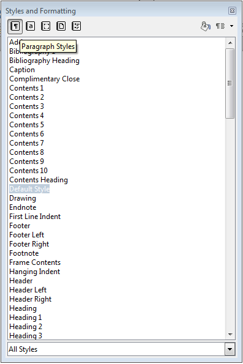
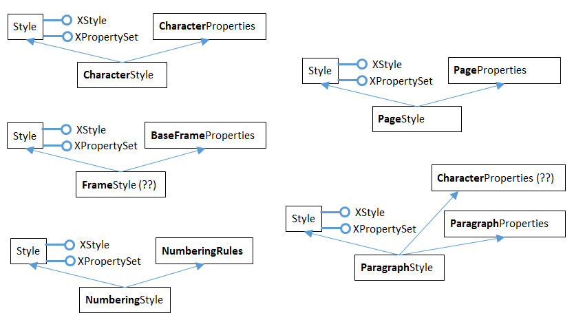
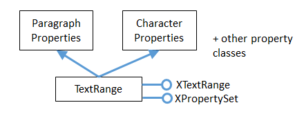
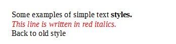
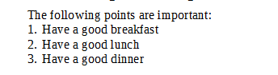

# Chapter 6. Text Styles 
 
 
This chapter focuses on how text documents styles can be 
examined and manipulated. This revolves around the 
XStyleFamiliesSupplier interface in 
GenericTextDocument, which is highlighted in Figure 1 (a 
repeat of Figure 2 in Chapter 5). 

 

Figure 1. The Text Document Services, and some Interfaces. 

 
XStyleFamiliesSupplier has a getStyleFamilies() method for returning text style 
families. All these families are stored in an XNameAccess object, as depicted in 

Figure 2. 

XNameAccess is one of Office's collection types, and employed when the objects in a 
collection have names. There's also an XIndexAccess for collections in index order. 

XNameContainer and XIndexContainer add the ability to insert and remove objects 
from a collection.  

Example folders: "Text 
Tests" and "Utils" 

!!! note "Topics"
    Five Style 
Families; Properties; 
Listing Styles;  Creating 
a Style; Applying Styles; 
Paragraph/Word Styles; 
Hyperlink Styling; Text 
Numbering; Headers and 
Footers 
 

Figure 2. Style Families and their Property Sets. 

 
Five style family names are used by text documents: "CharacterStyles", 
"FrameStyles", "NumberingStyles", "PageStyles", and "ParagraphStyles". The 
XNameAccess families collection can be accessed with one of those names, and 
returns a style family. A style family is a modifiable collection of PropertySet objects, 
stored in an XNameContainer object. 

Figure 2 shows that if the "ParagraphStyles" family is retrieved, it contains property 
sets labelled "Header", "List", "Standard", and quite a few more. Each property set 
can format a paragraph, change the text's font, size, and many other attributes. These 
property sets are called styles. 

The "CharacterStyles" family is a container of property sets (styles) which affect 
selected sentences, words, or characters in the document. The "FrameStyles" 
container holds property sets (styles) for formatting graphic and text frames. The 
"NumberingStyles" family is for adding numbers or bullets to paragraphs. The 
"PageStyles" family is for formatting pages. 

The names of the property sets (styles) in the style families can be listed using 
LibreOffice's GUI. If you create a new text document in Writer, a "Styles and 
Formatting" dialog window appears when you press F11 (or click on the brown 
spanner icon in the "Formatting" toolbar). Within the window you can switch between 
five icons representing the five style families. Figure 3 shows the list of property set 
(style) names for the paragraph styles family. They corresponds to the property set 
names shown in Figure 2. 

 
 

Figure 3. Styles and Formatting Window in Writer. 

 
The names listed in the window are the same as the names used in the API, except in 
two cases: the "Default Style" name that appears in the GUI window for "Paragraph 
Styles" and "Page Styles" is changed to "Standard" in the API. Strangely, the "Default 
Style" name for "Character Styles" in the GUI is called "Default Style" in the API. 

Accessing a style (a property set) is a three-step process, shown below. First the style 
families, then the style family (e.g. "ParagraphStyle"), and then the style (e.g. 

"Standard"): 
 
// 1. get the style families 
XStyleFamiliesSupplier xSupplier = 
                       Lo.qi(XStyleFamiliesSupplier.class, doc); 
XNameAccess nameAcc = xSupplier.getStyleFamilies(); 
 
// 2. get the paragraph style family 
XNameContainer paraStyleCon = Lo.qi(XNameContainer.class,  
                          nameAcc.getByName("ParagraphStyles")); 
 
// 3. get the 'standard' style (property set) 
XPropertySet standardProps = Lo.qi(XPropertySet.class,  
                          paraStyleCon.getByName("Standard")); 
 
The code that implements this process in the Write utility class is a bit more 
complicated since the calls to getByName() may raise exceptions if their string 
arguments are incorrect. 

The calls to Lo.qi() cast the object returned from a collection into the correct type. 

 
 
## 1.  What Properties are in a PropertySet? 

The "Standard" name in the "ParagraphStyles" style family refers to a property set 
(style). Each set is a collection of name=value pairs, and there are get and set methods 
using a name to get/set its value. This is simple enough, but what names should the 
programmer use? 
Each property set (style) in the same style family contain the same properties, but 
with different values. For instance, in Figure 2 the "Header", "Title", "Standard", 
"List", and "Table" sets contain the same named properties. 

The names of the properties used by the sets in a style family can be found in the 
documentation for their "XXXStyle" service. Table 1 summarizes the mapping. 

 
Style Family Name Service where Properties 
are Defined 
"CharacterStyles" CharacterStyle 
"FrameStyles" FrameStyle (??) 
"NumberingStyles" NumberingStyle 
"PageStyles" PageStyle 
"ParagraphStyles" ParagraphStyle 
Table 1. Properties Information for Each Style Family. 

 
The easiest way of finding Office documentation for the services in the second 
column of Table 1 is with lodoc.bat. For example, the page about CharacterStyle 
can be found with lodoc CharacterStyle service.  

The FrameStyle service (full name: com.sun.star.style.FrameStyle) has a "??" against 
it since there's no online documentation for that service, although such a service 
exists. 

A style's properties are usually defined across several classes in an inheritance 
hierarchy. The hierarchies for the five styles are summarized in Figure 4. 

 

Figure 4. The Inheritance Hierarchies for the Style Services. 

 
Figure 4 shows the hierarchies for the five style services: CharacterStyle, FrameStyle, 
NumberingStyle, PageStyle, and ParagraphStyle. There's clearly a lot of similarities 
between them, so I'll focus on CharacterStyle.  

There are three services containing character style properties: CharacterStyle, Style, 
and CharacterProperties. If you visit the online documentation for CharacterStyle, the 
properties are listed under the heading "Public Attributes", which is shown in Figure 
5. 

 

Figure 5. Part of the Online Documentation for CharacterStyle. 

 
CharacterStyle defines six properties itself, but there are many more inherited from 
the Style and CharacterProperties services. If you click on the triangles next to the 
"Public Attributes inherited from" lines, the documentation expands to display those 
properties. 

Figure 4 contains two "(??)" strings – one is to indicate that there's no documentation 
for FrameStyle, so I'm guessing about its inheritance hierarchy.  

The other "(??)" is in the ParagraphStyle hierarchy. The documentation for 
ParagraphStyle, and the information in the developers guide, indicate that 
ParagraphStyle inherits only Style and ParagraphCharacter. I believe this to be 
incorrect, based on my coding with ParagraphStyle (some of which you'll see in the 
next sections). ParagraphStyle appears to inherits three services: Style, 
ParagraphCharacter, and CharacterStyle, as indicated in Figure 6. 

 

Figure 6. The Paragraph Service and its Superclasses. 

 
For more information of the styles API, start in the development guide in the "Overall 
Document Features" section, online at: 
https://wiki.openoffice.org/wiki/Documentation/DevGuide/Text/ 
          Overall_Document_Features 
or type loGuide "Overall Document Features" 
The character and paragraph style properties are explained in the "Formatting" 
section: 
https://wiki.openoffice.org/wiki/Documentation/DevGuide/Text/ 
          Formatting 
or type  loGuide writer Formatting 
 
 
## 2.  Listing Styles Information 

My StylesInfo.java example illustrates some of the Writer and Info utility functions 
for examining style families and their property sets. The main() function starts by 
listing the style families names: 
 
XTextDocument doc = Write.openDoc(args[0], loader); 
 
// get all the style families for this document 
String[] styleFamilies = Info.getStyleFamilyNames(doc); 
System.out.println("No. of Style Family Names: " +  
                                  styleFamilies.length); 
for(String styleFamily : styleFamilies) 
  System.out.println("  " + styleFamily); 
System.out.println(); 
 
The output lists the five family names: 
 
No. of Style Family Names: 5 
  CharacterStyles 
  FrameStyles 
  NumberingStyles 
  PageStyles 
  ParagraphStyles 
 
Info.getStyleFamilyNames() starts by casting the document to an 
XStyleFamiliesSupplier interface. Then the style families XNameAccess collection is 
obtained by calling XStyleFamiliesSupplier.getStyleFamilies().The family names in 
that collection are extracted with XNameAccess.getElementName(): 
 
public static String[] getStyleFamilyNames(XComponent doc) 
// in the Info class 
{ 
  XStyleFamiliesSupplier xSupplier =  Lo.qi( 
                            XStyleFamiliesSupplier.class, doc); 
  XNameAccess nameAcc = xSupplier.getStyleFamilies(); 
  String[] names = nameAcc.getElementNames(); 
  Arrays.sort(names); 
  return names; 
}  // end of getStyleFamilyNames() 
 
Back in StylesInfo.java, the main() function continues by looping through the list of 
style family names, printing all the style (property set) names in each family: 
 
// list all the style names for each style family 
for(int i=0; i < styleFamilies.length; i++) { 
  String styleFamily = styleFamilies[i]; 
  System.out.println((i+1) + ". \"" + styleFamily +  
                               "\" Style Family contains:"); 
  String[] styleNames = Info.getStyleNames(doc, styleFamily); 
  Lo.printNames(styleNames); 
} 
 
The output is lengthy, but informative: 
 
## 1.  "CharacterStyles" Style Family contains: 

  "Bullet Symbols"  "Caption characters"  "Citation"  "Default Style" 
  "Definition"  "Drop Caps"  "Emphasis"  "Endnote Symbol" 
  "Endnote anchor"  "Example"  "Footnote Symbol"  "Footnote anchor" 
  "Index Link"  "Internet link"  "Line numbering"  "Main index entry" 
  "Numbering Symbols"  "Page Number"  "Placeholder"  "Rubies" 
  "Source Text"  "Strong Emphasis"  "Teletype"  "User Entry" 
  "Variable"  "Vertical Numbering Symbols"  "Visited Internet Link" 
 
## 2.  "FrameStyles" Style Family contains containers: 

  "Formula"  "Frame"  "Graphics"  "Labels" 
  "Marginalia"  "OLE"  "Watermark" 
 
## 3.  "NumberingStyles" Style Family contains containers: 

  "List 1"  "List 2"  "List 3"  "List 4" 
  "List 5"  "Numbering 1"  "Numbering 2"  "Numbering 3" 
  "Numbering 4"  "Numbering 5" 
 
## 4.  "PageStyles" Style Family contains containers: 

  "Endnote"  "Envelope"  "First Page"  "Footnote" 
  "HTML"  "Index"  "Landscape"  "Left Page" 
  "Right Page"  "Standard" 
 
## 5.  "ParagraphStyles" Style Family contains containers: 

  "Addressee"  "Bibliography 1"  "Bibliography Heading"  "Caption" 
  "Contents 1"  "Contents 10"  "Contents 2"  "Contents 3" 
  "Contents 4"  "Contents 5"  "Contents 6"  "Contents 7" 
  "Contents 8"  "Contents 9"  "Contents Heading"  "Drawing" 
  "Endnote"  "First line indent"  "Footer"  "Footer left" 
  "Footer right"  "Footnote"  "Frame contents"  "Hanging indent" 
  "Header"  "Header left"  "Header right"  "Heading" 
  "Heading 1"  "Heading 10"  "Heading 2"  "Heading 3" 
  "Heading 4"  "Heading 5"  "Heading 6"  "Heading 7" 
  "Heading 8"  "Heading 9"  "Horizontal Line"  "Illustration" 
  "Illustration Index 1"  "Illustration Index Heading"  "Index"  
"Index 1" 
  "Index 2"  "Index 3"  "Index Heading"  "Index Separator" 
  "List"  "List 1"  "List 1 Cont."  "List 1 End" 
  "List 1 Start"  "List 2"  "List 2 Cont."  "List 2 End" 
  "List 2 Start"  "List 3"  "List 3 Cont."  "List 3 End" 
  "List 3 Start"  "List 4"  "List 4 Cont."  "List 4 End" 
  "List 4 Start"  "List 5"  "List 5 Cont."  "List 5 End" 
  "List 5 Start"  "List Contents"  "List Heading"  "List Indent" 
  "Marginalia"  "Numbering 1"  "Numbering 1 Cont."  "Numbering 1 End" 
  "Numbering 1 Start"  "Numbering 2"  "Numbering 2 Cont."  "Numbering 
2 End" 
  "Numbering 2 Start"  "Numbering 3"  "Numbering 3 Cont."  "Numbering 
3 End" 
  "Numbering 3 Start"  "Numbering 4"  "Numbering 4 Cont."  "Numbering 
4 End" 
  "Numbering 4 Start"  "Numbering 5"  "Numbering 5 Cont."  "Numbering 
5 End" 
  "Numbering 5 Start"  "Object index 1"  "Object index heading"  
"Preformatted 
  "Quotations"  "Salutation"  "Sender"  "Signature" 
  "Standard"  "Subtitle"  "Table"  "Table Contents" 
  "Table Heading"  "Table index 1"  "Table index heading"  "Text" 
  "Text body"  "Text body indent"  "Title"  "User Index 1" 
  "User Index 10"  "User Index 2"  "User Index 3"  "User Index 4" 
  "User Index 5"  "User Index 6"  "User Index 7"  "User Index 8" 
  "User Index 9"  "User Index Heading"  
 
Info.getStyleNames() retrieves the XNameContainer object for each style family, and 
extracts its style (property set) names using getElementNames(): 
 
public static String[] getStyleNames(XComponent doc, 
                                String familyStyleName) 
// in Info.java 
{ XNameContainer styleContainer =  
                getStyleContainer(doc, familyStyleName); 
  if (styleContainer == null) 
    return null; 
  else { 
    String[] names = styleContainer.getElementNames(); 
    Arrays.sort(names); 
    return names; 
  } 
}  // end of getStyleNames() 
 
The last part of StylesInfo.java lists the properties for a specific property set. 

Info.getStyleProps() does that:  
 
XPropertySet getStyleProps(XComponent doc, 
                     String familyStyleName, String propSetNm) 
{ XNameContainer styleContainer =  
           getStyleContainer(doc, familyStyleName); 
           // container is a collection of named property sets 
  if (styleContainer == null) 
    return null; 
  else { 
    XPropertySet nameProps = null; 
    try { 
      nameProps = Lo.qi( XPropertySet.class,  
                    styleContainer.getByName(propSetNm)); 
    } 
    catch(Exception e) 
    {  System.out.println("Could not access style: " + e);  } 
    return nameProps; 
  } 
}  // end of getStyleProps() 
 
Its arguments are the document, the style family name, and style (property set) name. 

A reference to the property set is returned. Accessing the "Standard" style (property 
set) of the "ParagraphStyle" family would require: 
 
XPropertySet props =  
       Info.getStyleProps(doc, "ParagraphStyles", "Standard") 
 
The property set can be nicely printed by calling Props.showProps(): 
Props.showProps("ParagraphStyles \"Standard\"", props ); 
The output is long, but begins and ends like so: 
 
ParagraphStyles "Standard" Properties 
  BorderDistance == 0 
  BottomBorder == com.sun.star.table.BorderLine2@1a8a1dc 
  BottomBorderDistance == 0 
  BreakType == com.sun.star.style.BreakType@18e5cde 
  Category == 0 
  CharAutoKerning == true 
  CharBackColor == -1 
  CharBackTransparent == true 
       : 
  Rsid == Any[Type[unsigned long], 0] 
  SnapToGrid == true 
  StyleInteropGrabBag == [Lcom.sun.star.beans.PropertyValue;@1701da1 
  TopBorder == com.sun.star.table.BorderLine2@6f3b58 
  TopBorderDistance == 0 
  WritingMode == 0 
 
This listing, and in fact any listing of a style from "ParagraphStyles", shows that the 
properties are a mixture of those defined in the Style, ParagraphProperties, and 
CharacterProperties services.  

 
 
## 3.  Creating a New Style 

My StoryCreator.java example adds a new style to the paragraph style family, and 
uses it to format the document's paragraphs. 

The new ParagraphStyle service is referenced using one of its interfaces, the usual one 
being XStyle since all the different style services support it (as shown in Figure 4). 

For example: 
 
// create a new paragraph style 
XStyle paraStyle = Lo.createInstanceMSF(XStyle.class,  
                       "com.sun.star.style.ParagraphStyle"); 
 
Lo.createInstanceMSF()'s second argument is the full name of the service, and the 
first argument is the interface. All the style services are located in the 
"com.sun.star.style" package. 

Since I want to change property in this new style, I cast the XStyle interface to 
XPropertySet: 
XPropertySet props = Lo.qi(XPropertySet.class, paraStyle); 
A property is modified using setPropertyValue().  

 
props.setPropertyValue("ParaBottomMargin", 400); 
props.setPropertyValue("CharFontName", "Times New Roman"); 
props.setPropertyValue("CharHeight", 12.0f); 
 
These three properties are defined in one of the 'Properties' classes inherited by 
ParagraphStyle (as shown in Figure 4). "ParaBottomMargin" appears in 
ParagraphProperties, while "CharFontName" and "CharHeight" come from 
CharacterProperties. 

After setting the style's properties, the new style added to the document's paragraph 
style family: 
 
// access the paragraph style family 
XNameContainer paraStyles =  
           Info.getStyleContainer(textDoc, "ParagraphStyles"); 
 
// store the style in the style family with the name "Foo" 
paraStyles.insertByName("Foo", props); 
 
The style is stored with the name "Foo", but any unique name would be good (perhaps 
one a little more descriptive than "Foo" would be better). 

The style creation code in StoryCreator.java is located in createParaStyle() and 
follows the  code fragment sequence described above: 
 
public static boolean createParaStyle(XTextDocument textDoc,  
                                               String styleName) 
// create a new paragraph container/style called styleName 
{ 
  XNameContainer paraStyles =  
        Info.getStyleContainer(textDoc, "ParagraphStyles"); 
  if (paraStyles == null) 
    return false; 
 
  try { 
    // create new paragraph style properties set 
    XStyle paraStyle = Lo.createInstanceMSF( 
                 XStyle.class, "com.sun.star.style.ParagraphStyle"); 
    XPropertySet props = Lo.qi(XPropertySet.class, paraStyle); 
 
    // set some properties 
    props.setPropertyValue("CharFontName", "Times New Roman"); 
    props.setPropertyValue("CharHeight", 12.0f); 
    props.setPropertyValue("ParaBottomMargin", 400); 
                                   //  4mm, in 100th mm units 
 
    // set paragraph line spacing to 6mm  
    LineSpacing lineSpacing = new LineSpacing(); 
      lineSpacing.Mode = LineSpacingMode.FIX; 
      lineSpacing.Height = 600; 
      props.setPropertyValue("ParaLineSpacing", lineSpacing); 
 
    // some more common properties; not all used here  
    /* props.setPropertyValue("CharWeight",  
                               com.sun.star.awt.FontWeight.BOLD); 
       props.setPropertyValue("CharAutoKerning", true); 
       props.setPropertyValue("ParaAdjust",  
                              ParagraphAdjust.CENTER_value); 
       props.setPropertyValue("ParaFirstLineIndent", 0); 
       props.setPropertyValue("BreakType", BreakType.PAGE_AFTER); 
    */ 
      // store those properties in a container called styleName 
      paraStyles.insertByName(styleName, props); 
      return true; 
    } 
    catch(com.sun.star.uno.Exception e)  
    { System.out.println("Could not set paragraph style");   
      return false; 
    } 
  }  // end of createParaStyle() 
 
The "ParaLineSpacing" property is a little more complex than the others since its 
value isn't a basic type, but a LineSpacing object.  

The ParagraphProperties documentation for "ParaLineSpacing" is shown in Figure 7. 

 
 

Figure 7. The ParaLineSpacing Property in the ParagraphProperties Documentation. 

 
Clicking on the "com::sun::star::style::LineSpacing" return type will load the 
LineSpacing documentation page  into the browser.  

In StoryCreator.java, createParaStyle() is called like so: 
 
XTextDocument doc = Write.createDoc(loader); 
 
if (!createParaStyle(doc, "adParagraph")){ 
  System.out.println("Could not create new paragraph style"); 
  Lo.closeOffice(); 
  return; 
} 
 
A new style called "adParagraph" is added to the paragraph style family. It uses 
Times New Roman 12pt font, and leaves a 6mm space between paragraphs.  

 
 
## 4.  Applying Styles to Paragraphs (and Characters) 

I've added an "adParagraph" style to the paragraph style family, but how do I apply 
that style to some paragraphs in the document? 
The easiest way is through the document's XTextRange interface. XTextRange is 
supported by the TextRange service, which inherits ParagraphProperties and 
CharacterProperties (and several other property classes), as illustrated in Figure 8. 

 

Figure 8. The TextRange Service. 

 
XTextRange can be cast to XPropertySet to make the properties in 
ParagraphProperties and CharacterProperties accessible. An existing (or new) 
paragraph style is applied to a text range by setting its "ParaStyleName" property: 
 
XTextRange xTextRange = doc.getText().getStart(); 
XPropertySet props = Lo.qi(XPropertySet.class, xTextRange); 
props.setProperty("ParaStyleName", "adParagraph"); 
 
Using Props.setProperty(), simplifies this to: 
 
XTextRange xTextRange = doc.getText().getStart(); 
Props.setProperty(xTextRange, "ParaStyleName", "adParagraph"); 
 
The code above obtains the text range at the start of the document, and set its 
paragraph style to "adParagraph". Any text added from this position onwards will use 
that style.  

This approach is used in StoryCreator.java: the style is set first, then text is added. 

 
 
## 5.  Cursors and Text Ranges 

Another technique for applying styles uses a cursor to select a text range. Then the 
text's properties are accessed through the cursor.  

All the different kinds of model and view cursor belong to the TextCursor service, 
and this inherits TextRange. This allows us to extend Figure 8 to become Figure 9. 

 

Figure 9. Cursor Access to Text Properties. 

 
This hierarchy means that a cursor can access the TextRange service and its text 
properties. The following code fragment demonstrates the idea: 
 
XTextCursor cursor = Write.getCursor(textDoc); 
cursor.gotoEnd(true);   // select the entire document 
 
XPropertySet props = Lo.qi(XPropertySet.class, cursor); 
props.setProperty("ParaStyleName", "adParagraph"); 
 
Using Props.setProperty(), simplifies this to: 
 
XTextCursor cursor = Write.getCursor(textDoc); 
cursor.gotoEnd(true); 
Props.setProperty(cursor, "ParaStyleName", "adParagraph"); 
 
This approach is employed in StoryCreator.java when some paragraphs (such as 
section headers) need to use a paragraph style other than "adParagraph". I'll supply 
details in a moment. 

 
 
## 6.  Building a Story Document 

StoryCreator.java starts by setting the "adParagraph" style, then employs readText() 
to read text from a file and add it to the document: 
 
XTextRange xTextRange = doc.getText().getStart(); 
Props.setProperty(xTextRange, "ParaStyleName", "adParagraph"); 
 
XTextCursor cursor = Write.getCursor(doc); 
readText("scandal.txt", cursor); 
Write.endParagraph(cursor); 
 
readText() assumes the text file has a certain format. For example, "scandal.txt" 
begins like so: 
 
Title: A Scandal in Bohemia 
Author: Sir Arthur Conan Doyle 
 
Part I. 

 
To Sherlock Holmes she is always THE woman. I have seldom heard 
him mention her under any other name. In his eyes she eclipses 
and predominates the whole of her sex.  

 
It was not that he felt any emotion akin to love for Irene Adler.  

All emotions, and that one particularly, were abhorrent to his  
cold, precise but admirably balanced mind.  

 
A paragraph is a series of text lines followed by a blank line. But there are exceptions: 
lines that starts with "Title: ", "Author: " or "Part " are treated as headings, and styled 
differently. When the text above is processed, the resulting document looks like 

Figure 10. 

 

Figure 10. The Output of StoryCreator.java. 

 
readText() is implemented using Java's FileReader and BufferedReader: 
 
public static void readText(String fnm, XTextCursor cursor) 
/* Write the text in fnm into a Office document. 

   Use current paragraph styling unless the line starts 
   with "Title: ", "Author: ", or "Part ". 

*/ 
{ 
  StringBuilder sb = new StringBuilder(0); 
  BufferedReader br = null; 
  try { 
    br = new BufferedReader(new FileReader(fnm)); 
    System.out.println("Reading text from: " + fnm); 
 
    String line; 
    while ((line = br.readLine()) != null) { 
      // System.out.println("<" + line + ">"); 
      if (line.length() == 0) { 
        if (sb.length() > 0) 
          Write.appendPara(cursor, sb.toString()); 
        sb.setLength(0); 
      } 
      else if (line.startsWith("Title: ")) { 
        Write.appendPara(cursor, line.substring(7)); 
        Write.stylePrevParagraph(cursor, "Title"); 
      } 
      else if (line.startsWith("Author: ")) { 
        Write.appendPara(cursor, line.substring(8)); 
        Write.stylePrevParagraph(cursor, "Subtitle"); 
      } 
      else if (line.startsWith("Part ")) { 
        Write.appendPara(cursor, line); 
        Write.stylePrevParagraph(cursor, "Heading"); 
      } 
      else { 
        sb.append(line + " "); 
      } 
    } 
    if (sb.length() > 0) 
      Write.appendPara(cursor, sb.toString()); 
  } 
  catch (FileNotFoundException ex) 
  {  System.out.println("Could not open: " + fnm); } 
  catch (IOException ex)  
  {  System.out.println("Read error: " + ex); } 
  finally { 
    try { 
      if (br != null) 
        br.close(); 
    } 
    catch (IOException ex)  
    {  System.out.println("Problem closing " + fnm); } 
  } 
}  // end of readText() 
 
The interesting bits are the calls to Write.appendPara() and 
Write.stylePrevParagraph() which add a paragraph to the document and apply a style 
to it. For instance: 
 
else if (line.startsWith("Author: ")) { 
  Write.appendPara(cursor, line.substring(8)); 
  Write.stylePrevParagraph(cursor, "Subtitle"); 
} 
 
Write.appendPara() writes the string into the document as a paragraph (the input line 
without the "Author: " substring). Write.stylePrevParagraph() changes the paragraph 
style from "adParagraph" to "Subtitle".  

The hard part of Write.stylePrevParagraph() is making sure that the style change only 
affects the previous paragraph. Text appended after this line should use "adParagraph" 
styling.  

 
public static void stylePrevParagraph(XTextCursor cursor,  
                                      Object propVal) 
{  stylePrevParagraph(cursor, "ParaStyleName", propVal);  } 
 
 
public static void stylePrevParagraph(XTextCursor cursor, 
                             String propName, Object propVal) 
{ 
  // save current property 
  Object oldValue = Props.getProperty(cursor, propName); 
 
  // apply property change to previous paragraph 
  XParagraphCursor paraCursor = Lo.qi( 
                                XParagraphCursor.class, cursor); 
  paraCursor.gotoPreviousParagraph(true);   // select prev para 
  Props.setProperty(paraCursor, propName, propVal); 
 
  // reset the cursor and property 
  paraCursor.gotoNextParagraph(false); 
  Props.setProperty(cursor, propName, oldValue); 
}  // end of stylePrevParagraph() 
 
The current "ParaStyleName" value is stored before changing its value in the selected 
range. Afterwards, that style name is applied back to the cursor.  

stylePrevParagraph() changes the XTextCursor into a paragraph cursor so that it's 
easier to move around across paragraphs. 

readText() calls Write.stylePrevParagraph() with three style names ("Title", 
"Subtitle", and "Heading"). I obtained those names from looking at the "Paragraph 
Styles" dialog window in Figure 3. 

 
 
## 7.  Style Changes to Words and Phrases 

Aside from changing paragraph styles, it's useful to apply style changes to words or 
strings inside a paragraph. For example, to highlight a word in bold, or write several 
words in red italics for emphasis.  

This is implemented by Write.styleLeft() using a similar approach to 
Write.stylePrevParagraph(). styleLeft() is passed an integer position which lies to the 
left of the current cursor position. Character style changes are applied to the text range 
defined by that distance: 
 
public static void styleLeft(XTextCursor cursor,  
                   int pos, String propName, Object propVal) 
{ 
  // save current property 
  Object oldValue = Props.getProperty(cursor, propName); 
 
  // apply property change to the left of cursor 
  int currPos = getPosition(cursor); 
  cursor.goLeft((short)(currPos-pos), true); 
  Props.setProperty(cursor, propName, propVal); 
 
  // reset the cursor and property 
  cursor.goRight((short)(currPos-pos), false); 
  Props.setProperty(cursor, propName, oldValue); 
}  // end of styleLeft() 
 
An XTextCursor is used to select the range, and the new style is set. Then the cursor 
is moved back to its old position, and the previous style reapplied. 

The Write class contain a few support functions that set common styles using 
styleLeft(): 
 
public static void styleLeftBold(XTextCursor cursor, int pos) 
{  styleLeft(cursor, pos, "CharWeight",  
                           com.sun.star.awt.FontWeight.BOLD);  } 
 
 
public static void styleLeftItalic(XTextCursor cursor, int pos) 
{  styleLeft(cursor, pos, "CharPosture",  
                           com.sun.star.awt.FontSlant.ITALIC);  } 
 
 
public static void styleLeftColor(XTextCursor cursor,  
                                   int pos, java.awt.Color col) 
{  styleLeft(cursor, pos, "CharColor", Lo.getColorInt(col));  } 
 
 
public static void styleLeftCode(XTextCursor cursor, int pos) 
// code is text in 10pt Courier New 
{  styleLeft(cursor, pos, "CharFontName", "Courier New"); 
   styleLeft(cursor, pos, "CharHeight", 10); 
} 
 
The position (the pos value) passed to styleLeft() can be obtained from 
Write.getPosition(), or as the result of the Write.append() methods. 

My BuildDoc.java example contains several examples of how to use 
Write.styleLeft(): 
 
// code fragment from BuildDoc.java 
XTextCursor cursor = Write.getCursor(doc); 
 
int pos = Write.append(cursor, "Some examples of simple text "); 
Write.append(cursor, "styles.\n"); 
Write.styleLeftBold(cursor, pos);  // bold text back to pos 
 
pos = Write.getPosition(cursor); 
Write.appendPara(cursor, "This line is written in red italics."); 
Write.styleLeftColor(cursor, pos, Color.RED);   // red 
Write.styleLeftItalic(cursor, pos);             // italics 
 
Write.appendPara(cursor, "Back to old style\n"); 
 
The resulting text in the document looks like Figure 11. 

 

Figure 11. Styled Text. 

 
The following fragment from BuildDoc.java applies a 'code' styling to several lines: 
 
// code fragment from BuildDoc.java 
Write.appendPara(cursor, "Here's some code:"); 
 
pos = Write.getPosition(cursor); 
Write.append(cursor, "\npublic class Hello\n"); 
Write.append(cursor, "{\n"); 
Write.append(cursor, "  public static void main(String args[]\n"); 
Write.append(cursor, " { System.out.println(\"Hello Andrew\"); }\n"); 
Write.appendPara(cursor, "}  // end of Hello class\n"); 
Write.styleLeftCode(cursor, pos); 
 
Figure 12 shows the generated document text. 

 

Figure 12. Text with Code Styling. 

 
Unfortunately, styleLeft() depend on integer character positions, which are calculated 
using Write.getPosition(). As I've mentioned before, this method could fail if asked to 
generate too large a string, and this would cause styleLeft() to die. 

 
 
## 8.  Hyperlink Styling 

Text hyperlinks are implemented as styles, using "HyperLinkURL", and perhaps 
"HyperLinkName", and "HyperLinkTarget". BuildDoc.java shows how the 
"HyperLinkURL" property is set: 
 
Write.appendPara(cursor, "A link to my JLOP website:"); 
String urlStr = "http://fivedots.coe.psu.ac.th/~ad/jlop/"; 
 
pos = Write.getPosition(cursor); 
Write.append(cursor, urlStr); 
 
Write.styleLeft(cursor, pos, "HyperLinkURL", urlStr); 
Write.endParagraph(cursor); 
 
When the document is viewed, the text is drawn as a link as in Figure 13. 

 

Figure 13. Text Containing a Hypertext Link. 

 
If the user control-clicks on the link, then the URL value of "HyperLinkURL" will be 
loaded into the browser. 

The "HyperLinkName" property specifies a link name, which can be used when 
searching a document. "HyperLinkTarget" corresponds to the HTML hypertext target 
attribute, and has a default value of "_self".  

 
  
## 9.  Text Numbering 

It's straightforward to number paragraphs by using Write.styleLeft() and the 
"NumberingStyleName" property. The following code from BuildDoc.java, numbers 
three paragraphs: 
 
// code fragment from BuildDoc.java 
Write.appendPara(cursor, "The following points are important:"); 
 
pos = Write.appendPara(cursor, "Have a good breakfast"); 
Write.appendPara(cursor, "Have a good lunch"); 
Write.appendPara(cursor, "Have a good dinner\n"); 
Write.styleLeft(cursor, pos, "NumberingStyleName", "Numbering 1"); 
 
The result is shown in Figure 14. 

 

Figure 14. Numbered Paragraphs. 

 
"NumberingStyleName" is a property in ParagraphProperties, and the "Numbering 1" 
style is from the "Paragraph Styles" dialog window in Figure 3.  

Bullets are drawn instead of numbers by changing the style name to "List 1" (see 
Figure 15). 

 

Figure 15. Bulleted Paragraphs. 

 
One issue with numbered paragraphs is that their default behavior retains the current 
count when numbering another group of text. For example, a second group of 
numbered paragraphs appearing in the document after Figure 14 would start at '4'. 

This is fixed by setting the "ParaIsNumberingRestart" property to true: 
Write.styleLeft(cursor, pos, "ParaIsNumberingRestart", true); 
 
One large topic I won’t be looking at is document numbering. This includes the 
numbering of chapter headings and lines. Chapter and line numbering are dealt with 
differently from most document styles. Instead of being accessed via 
XStyleFamiliesSupplier, they employ XChapterNumberingSupplier and 
XNumberFormatsSupplier.  

For more details, see the development guide: 
https://wiki.openoffice.org/wiki/Documentation/DevGuide/Text/Line_Numbering_an
d_Outline_Numbering 
or type loGuide "Line Numbering". 

 
 
10.  Other Style Changes 
StoryCreator.java illustrates three other styling effects: the creation of a header, 
setting the page to A4 format, and employing page numbers in the footer. The 
relevant calls are: 
 
// code fragment in StoryCreator.java 
Write.setHeader(doc, "From: " + args[0]); 
Write.setA4PageFormat(doc); 
Write.setPageNumbers(doc); 
 
Write.setA4PageFormat() sets the page formatting. Write.setPageNumbers() utilizes 
text fields, which I'll examine in the "Text Fields" section in Chapter 7. 

Changing the header in Write.setHeader() requires the setting of the "HeaderIsOn" 
boolean in the "Standard" page style. Adding text to the header is done via an XText 
reference. The code for Write.setHeader(): 
 
public static void setHeader(XTextDocument textDoc, String hText) 
/* Modify the header via the page style for the document.  

   Put the text on the right hand side in the header in 
   Times New Roman, 10pt */ 
{ 
  XPropertySet props =  
         Info.getStyleProps(textDoc, "PageStyles", "Standard"); 
  if (props == null) { 
    System.out.println("Could not access standard page style"); 
    return; 
  } 
 
  try { 
    props.setPropertyValue("HeaderIsOn", true); 
                 // header is turned on in the document 
 
    // access the header's XText and cursor 
    XText headerText = Lo.qi(XText.class,  
                         props.getPropertyValue("HeaderText")); 
    XTextCursor headerCursor = headerText.createTextCursor(); 
    headerCursor.gotoEnd(false); 
    
    // header is on the rhs and in Times New Roman, 10pt 
    XPropertySet headerProps = Lo.qi( 
                                XPropertySet.class, headerCursor); 
    headerProps.setPropertyValue("CharFontName","Times New Roman"); 
    headerProps.setPropertyValue("CharHeight", 10); 
    headerProps.setPropertyValue("ParaAdjust",ParagraphAdjust.RIGHT); 
 
    headerText.setString(hText + "\n"); 
  }  
  catch (Exception ex)  
  {  System.out.println(ex); } 
}  // end of setHeader() 
 
The header's XText reference is retrieved via the page style's "HeaderText" property, 
and a cursor is created local to the header: 
XTextCursor headerCursor = headerText.createTextCursor(); 
This cursor can only move around inside the header not the entire document.  

The properties of the header's XText are changed using the cursor, and then the text is 
added.  

