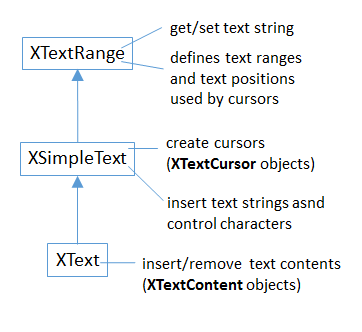
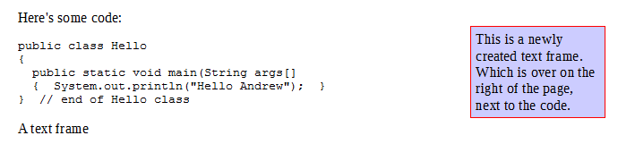
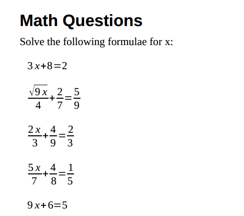
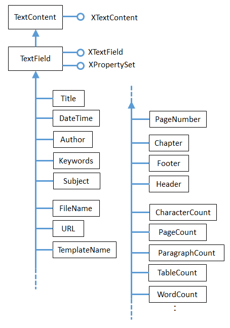
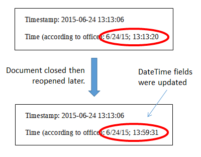
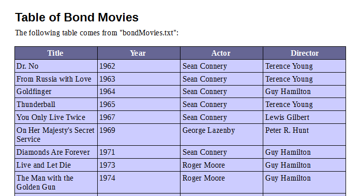
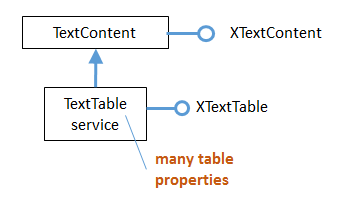
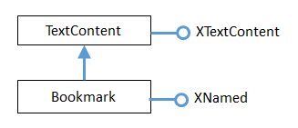
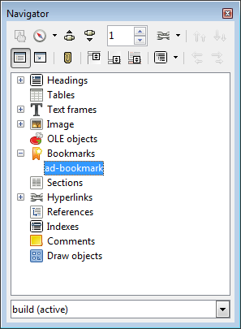

# Chapter 7. Text Content Other than Strings

!!! note "Topics"
    Accessing Text
    Content; Text  Frames;
    Embedded Objects
    (Math Formulae); Text
    Fields; Text Tables;
    Bookmarks

    Example folders: "Text
    Tests" and "Utils"


Chapter 5 looked at using text cursors to move around
inside text documents, adding or extracting text strings.

That chapter utilized the XText inheritance hierarchy,
which is shown again in Figure 1.




Figure 1. XText and its Superclasses.


The documents manipulated in Chapter 5 only contained character-based text, but can
be a lot more varied, including text frames, embedded objects, graphics, shapes, text
fields, tables, bookmarks, text sections, footnotes and endnotes, and more.

From the XText service its possible to access the XTextContent interface (see Figure
1), which belongs to the TextContent service. As Figure 2 indicates, that service is the
parent of many subclasses which represent different kinds of text document content.


Figure 2. The TextContent Service and Some Subclasses.


A more complete hierarchy can be found in the documentation for TextContent
(`lodoc TextContent service`).

The two services highlighted in orange relate to graphical content, which is explained
in the next chapter.

Table 1 summarizes content types in terms of their services and access methods. Most
of the methods are in Supplier interfaces which are part of the GenericTextDocument
or OfficeDocument services in Figure 2 of Chapter 5.

If the service text is in bold then there's an example of how to manipulate its content
later in this chapter.


|Content Name     |Service for Creating Content|Access Method in Supplier                   |
|                 |                            |                                            |
|Text Frame       |TextFrame                   |XNameAccess XTextFrameSupplier.             |
|                 |                            |getTextFrames()                             |
|Embedded Object  |TextEmbeddedObject          |XComponent XTextEmbeddedObjectSupplier2.    |
|                 |                            |getEmbeddedObject()                         |
|Graphic Object   |TextGraphicObject;          |XNameAccess XTextGraphicObjectsSupplier.    |
|                 |                            |getGraphicObjects()                         |
|Shape            |text.Shape, drawing.Shape   |XDrawPage XDrawPageSupplier.                |
|                 |or a subclass               |getDrawPage()                               |
|Text Field       |TextField                   |XEnumerationAccess XTextFieldsSupplier.     |
|                 |                            |getTextFields()                             |
|Text Table       |TextTable                   |XNameAccess XTextTablesSupplier.            |
|                 |                            |getTextTables()                             |
|Bookmark         |Bookmark                    |XNameAccess XBookmarksSupplier.             |
|                 |                            |getBookmarks()                              |
|Paragraph        |Paragraph                   |XEnumerationAccess on XText                 |
|Text Section     |TextSection                 |XNameAccess XTextSectionsSupplier.          |
|                 |                            |getTextSections()                           |
|Footnote         |Footnote                    |XIndexAccess XFootnotesSupplier.            |
|                 |                            |getFootnotes()                              |
|End Note         |Endnote                     |XIndexAccess XEndnotesSupplier.getEndnotes()|
|Reference Mark   |ReferenceMark               |XNameAccess XReferenceMarksSupplier.        |
|                 |                            |getReferenceMarks()                         |
|Index            |DocumentIndex               |XIndexAccess XDocumentIndexesSupplier.      |
|                 |                            |getDocumentIndexes()                        |
|Link Target      |LinkTarget                  |XNameAccess XLinkTargetSupplier.getLinks()  |
|Redline          |RedlinePortion              |XEnumerationAccess XRedlinesSupplier.       |
|                 |                            |getRedlines()                               |
|Content Metadata |InContentMetaData           |XDocumentMetadataAccess                     |

Table 1. Creating and Accessing Text Content.


Rows 3 and 4 are highlighted to indicate that graphical content is discussed in the next
chapter.


## 1.  How to Access Text Content

Most of the examples in this chapter create text document content rather than access
it. This is mainly because the different access functions work in a similar way, so you
don’t need many examples to get the general idea.

First the document is converted into a supplier, then its getXXX() method is called
(see column 3 of Table 1). For example, accessing the graphic objects in a document
(see row 3 of Table 1) requires:

=== "java"
    ```java
    // get the graphic objects supplier
    XTextGraphicObjectsSupplier imsSupplier =
                   Lo.qi(XTextGraphicObjectsSupplier.class, doc);
    
    // access the graphic objects collection
    XNameAccess xNameAccess = imsSupplier.getGraphicObjects();
    ```

The names associated with the graphic objects in XNameAccess can be extracted with
XNameAccess.getElementNames(), and printed:

=== "java"
    ```java
    String[] names = xNameAccess.getElementNames();
    System.out.println("Number of graphic names: " + names.length);
    Arrays.sort(names);       // sort them, if you want
    Lo.printNames(names);     // useful for printing long lists
    ```

A particular object in an XNameAccess collection is retrieved with getByName():

=== "java"
    ```java
    XInterface oGraphic = xNameAccess.getByName("foo");
                        // get graphic object called "foo"
    ```

XInterface is the Office equivalent of Java's Object: every interface subclasses
XInterface.

A common next step is to convert the object into a property set, which makes it
possible to lookup the properties stored in the object's service. For instance, the
graphic object’s filename or URL can be retrieved using:

=== "java"
    ```java
    XPropertySet props =  Lo.qi(XPropertySet.class, oGraphic);
    String fnm = (String) props.getPropertyValue("GraphicURL");
    ```

I know the graphic object's URL is stored in the "GraphicURL" property from looking
at the documentation for the TextGraphicObject service. It can be (almost) directly
accessed by typing `lodoc TextGraphicObject service`; unfortunately
DuckDuckGo chooses the TextGraphicObjects service, and you need to click on the
"TextGraphicObject" link below the title to get to the required page.

It's possible to call setPropertyValue() to change a property:

`props.setPropertyValue("Transparency", (short)50);`

**What About the Text Content I Don't Cover?**

Table 1 has many rows without bold entries, which means I won't be looking at them.

except for the very brief descriptions here; for more please consult the Developer's
Guide at
https://wiki.openoffice.org/wiki/Documentation/DevGuide/Text/Working_with_Text_Documents
(or type `loGuide "Working with Text Documents"`). All the examples
in that section are in TextDocuments.java at
https://api.libreoffice.org/examples/DevelopersGuide/examples.html#Text.

**Text Sections.** A text section is a grouping of paragraphs which can be assigned their
own style settings. More usefully, a section may be located in another file, which is
the mechanism underlying master documents. See:
https://wiki.openoffice.org/wiki/Documentation/DevGuide/Text/Text_Sections (or
type `loGuide "Text Sections"`).

**Footnotes and Endnotes.** Footnotes and endnotes are blocks of text that appear in the
page footers and at the end of a document. They can be treated as XText objects, so
manipulated using the same techniques as the main document text. See:
https://wiki.openoffice.org/wiki/Documentation/DevGuide/Text/Footnotes_and_Endnotes
(or type `loGuide Footnotes`).

**Reference Marks.** Reference marks can be inserted throughout a document, and then
jumped to via GetReference text fields:
https://wiki.openoffice.org/wiki/Documentation/DevGuide/Text/Reference_Marks (or
type `loGuide "Reference Marks"`).

**Indexes and Index Marks.** Index marks, like reference marks, can be inserted
anywhere in a document, but are used to generate indices (collections of information)
inside the document. There are several types of index marks used for generating lists
of chapter headings (i.e. a book's index), lists of key words, illustrations, tables, and a
bibliography. For details see:
https://wiki.openoffice.org/wiki/Documentation/DevGuide/Text/Indexes_and_Index_Marks
(or type `loGuide Indexes`).

**Link Targets.** A link target (sometimes called a jump mark) labels a location inside a
document. These labels can be included as part of a filename so that the document can
be opened at that position. For information, see:
https://wiki.openoffice.org/wiki/Documentation/DevGuide/Text/Link_Targets (or
type `loGuide "Link Targets"`).

**Redlines.** Redlines are the changes recorded when a user edits a document with track
changes turned on. Each of the changes is saved as a text fragment (also called a text
portion) inside a redline object. See:
https://wiki.openoffice.org/wiki/Documentation/DevGuide/Text/Redline (or type
`loGuide Redline`).


## 2.  Adding a Text Frame to a Document

The TextFrame service inherits many of its properties and interfaces, so its
inheritance hierarchy is shown in detail in Figure 3.


Figure 3. The TextFrame Service Hierarchy.


Figure 3 includes two sibling services of TextFrame: TextEmbeddedObject and
TextGraphicObject, which I'll discuss a bit later; infact, I'll only get around to
TextGraphicObject in the next chapter.

The BaseFrameProperties service contains most of the frame size and positional
properties, such as "Width", "Height", and margin and border distance settings.

A TextFrame interface can be converted into a text content (i.e. XTextContent) or a
shape (i.e. XShape). Typically, the former is used when adding text to the frame, the
latter when manipulating the shape of the frame.

In my BuildDoc.java example, text frame creation is done by Write.addTextFrame(),
with BuildDoc supplying the frame's y-axis coordinate position for its anchor:

=== "java"
    ```java
    // code fragment in BuildDoc.java
    XTextViewCursor tvc = Write.getViewCursor(doc);
    int yPos = tvc.getPosition().Y;   // y-axis anchor position
    
            :  // other unrelated code
    
    Write.appendPara(cursor, "A text frame");
    
    Write.addTextFrame(cursor, yPos,
           "This is a newly created text frame.\n
            Which is over on the right of the page, next to the code.",
                4000, 1500);   // width x height of frame
    ```

An anchor specifies how the text content is positioned relative to the ordinary text
around it. Anchoring can be relative to a character, paragraph, page, or another frame.

Write.addTextFrame() uses page anchoring, which means that BuildDoc must obtain
a view cursor, so that an on-screen page position can be calculated. As Figure 4
shows, the text frame is located on the right of the page, with its top edge level with
the start of the code listing.




Figure 4. Text Frame Position in the Document.


In the code fragment above, Write.getViewCursor() creates the view cursor, and
XTextViewCursor.getPosition() returns its (x, y) coordinate on the page. The y-
coordinate is stored in yPos until after the code listing has been inserted into the
document, and then passed to Write.addTextFrame().

Write.addTextFrame() is defined as:

=== "java"
    ```java
    public static void addTextFrame(XTextCursor cursor, int yPos,
                               String text, int width, int height)
    {
      try {
        XTextFrame xFrame = Lo.createInstanceMSF(XTextFrame.class,
                                "com.sun.star.text.TextFrame");
        if (xFrame == null) {
          System.out.println("Could not create a text frame");
          return;
        }
    
        // convert frame to a shape interface; set size
        XShape tfShape = Lo.qi(XShape.class, xFrame);
        tfShape.setSize(new Size(width, height));
    
        // get properties of the frame
        XPropertySet frameProps = Lo.qi(XPropertySet.class, xFrame);
    
        // anchor the text frame to the page
        frameProps.setPropertyValue("AnchorType",
                              TextContentAnchorType.AT_PAGE);
        frameProps.setPropertyValue("FrameIsAutomaticHeight", true);
                                          // will grow if necessary
    
        // add a red border around all 4 sides
        BorderLine border = new BorderLine();
        border.OuterLineWidth = 1;
        border.Color = 0xFF0000;  // red
        frameProps.setPropertyValue("TopBorder", border);
        frameProps.setPropertyValue("BottomBorder", border);
        frameProps.setPropertyValue("LeftBorder", border);
        frameProps.setPropertyValue("RightBorder", border);
    
        // make the text frame blue
        frameProps.setPropertyValue("BackTransparent", false);
                                               // not transparent
        frameProps.setPropertyValue("BackColor", 0xCCCCFF);   // blue
    
        // set the horizontal and vertical position
        frameProps.setPropertyValue("HoriOrient",
                                    HoriOrientation.RIGHT);
    
        frameProps.setPropertyValue("VertOrient",
                                    VertOrientation.NONE);
        frameProps.setPropertyValue("VertOrientPosition", yPos);
                                                     // down from top
    
        // insert empty text frame into document
        append(cursor, xFrame);
        endParagraph(cursor);
    
        // add text to the text frame
        XText xFrameText = xFrame.getText();
        XTextCursor xFrameCursor = xFrameText.createTextCursor();
        xFrameText.insertString(xFrameCursor, text, false);
      }
      catch (Exception e) {
        System.out.println("Insertion of text frame failed: " + e);
      }
    }  // end of addTextFrame()
    ```

addTextFrame() starts by creating a TextFrame service, and accessing its XTextFrame
interface:

=== "java"
    ```java
    XTextFrame xFrame = Lo.createInstanceMSF(XTextFrame.class,
                                    "com.sun.star.text.TextFrame");
    ```

The service name for a text frame is listed as "TextFrame" in row 1 of Table 1, but
Lo.createInstanceMSF() requires a fully qualified name. Almost all the text content
services, including TextFrame, are in the com.sun.star.text package.

The XTextFrame interface is converted into XShape so the frame's dimensions can be
set. The interface is also cast to XPropertySet so that various frame properties can be
initialized; these properties are defined in the TextFrame and BaseFrameProperties
services (see Figure 3).

The "AnchorType" property uses the AT_PAGE anchor constant to tie the frame to
the page. There are five anchor constants: AT_PARAGRAPH, AT_CHARACTER,
AS_CHARACTER, AT_PAGE, and AT_FRAME, which are defined in the
TextContentAnchorType enumeration.

The difference between AT_CHARACTER and AS_CHARACTER relates to how
the surrounding text is wrapped around the text content. "AS" means that the text
content is treated as a single (perhaps very large) character inside the text, while "AT"
means that the text frame's upper-left corner is positioned at that character location.

The frame's page position is dealt with a few lines later by the "HoriOrient" and
"VertOrient" properties. The HoriOrientation and VertOrientation constants are a
convenient way of positioning a frame at the corners or edges of the page. However, I
use "VertOrientPosition" to set the vertical position using the yPos coordinate, and
switch off the "VertOrient" vertical orientation.

Towards the end of Write.addTextFrame(), the frame is added to the document by
calling a version of Write.append() that expects an XTextContent object:

=== "java"
    ```java
    // in the Write class
    public static int append(XTextCursor cursor,
                                     XTextContent textContent)
    // append text content such as a text frame, table, text field
    {
      XText xText = cursor.getText();
      xText.insertTextContent(cursor, textContent, false);
      cursor.gotoEnd(false);
      return getPosition(cursor);
    }
    ```

It utilizes the XText.insertTextContent() method.

The last task of Write.addTextFrame(), is to insert some text into the frame.

XTextFrame inherits XTextContent, and so has access to the getText() method (see
Figure 3). This means that all the text manipulations possible in a document are also
possible inside a frame.

The ordering of the tasks at the end of addTextFrame() is important. Office prefers
that an empty text content be added to the document, and the data inserted afterwards.


## 3.  Adding a Text Embedded Object to a Document

Text embedded object content support OLE (Microsoft's Object Linking and
Embedding), and is typically used to create a frame linked to an external Office
document. Probably, its most popular use is to link to a chart, but I'll delay looking at
that until Chapter 33.

The best way of getting an idea of what OLE objects are available is to go to the
Writer application's Insert menu, Object, "OLE Object" dialog. In my version of
Office, it lists Office spreadsheet, chart, drawing, presentation, and formula
documents, and a range of Microsoft and PDF types.

Note that text embedded objects aren't utilized for adding graphics to a document.

That's easier to do using the TextGraphicObject or GraphicObjectShape services,
which I'll describe next.

In this section I'll explain how to insert mathematical formulae into a text document.

The example code is in MathQuestions.java, but most of the formula embedding is
performed by Write.addFormula():

=== "java"
    ```java
    public static void addFormula(XTextCursor cursor, String formula)
    {
      try {
        XTextContent embedContent =
                  Lo.createInstanceMSF(XTextContent.class,
                          "com.sun.star.text.TextEmbeddedObject");
        if (embedContent == null) {
          System.out.println("Could not create a formula");
          return;
        }
    
        // get property set for the embedded object
        XPropertySet props =  Lo.qi(XPropertySet.class, embedContent);
    
        // set class ID (type) for object
        props.setPropertyValue("CLSID", Lo.MATH_CLSID);
    
        // anchor object as a character
        props.setPropertyValue("AnchorType",
                                TextContentAnchorType.AS_CHARACTER);
    
        // insert empty object into document
        append(cursor, embedContent);
        endLine(cursor);
    
        // access object's model
        XEmbeddedObjectSupplier2 supp = Lo.qi(
                     XEmbeddedObjectSupplier2.class, embedContent);
        XComponent oEmbed = supp.getEmbeddedObject();
    
        // insert formula into the object
        XPropertySet formulaProps = Lo.qi(XPropertySet.class, oEmbed);
        formulaProps.setPropertyValue("Formula", formula);
      }
      catch (Exception e) {
        System.out.println("\"" + formula + "\" failed: " + e);
      }
    }  // end of addFormula()
    ```

A math formula is passed to addFormula() as a string in a format I'll explain shortly.

The method begins by creating a TextEmbeddedObject service, and referring to it
using the XTextContent interface:

=== "java"
    ```java
    XTextContent embedContent =
         Lo.createInstanceMSF(XTextContent.class,
                       "com.sun.star.text.TextEmbeddedObject");
    ```

Details about embedded objects are given in row 2 of Table 1.

Unlike TextFrame which has an XTextFrame interface, there's no
XTextEmbeddedObject interface for TextEmbeddedObject. This can be confirmed by
looking at the TextFrame inheritance hierarchy in Figure 3. There is an
XEmbeddedObjectSuppler, but that's for accessing objects, not creating them. Instead
I've utilized the XTextContent interface in Lo.createInstanceMSF() because it's the
most specific interface available.

The XTextContent interface is converted to XPropertySet so the "CLSID" and
"AnchorType" properties can be set. "CLSID" is specific to TextEmbeddedObject –
its value is the OLE class ID for the embedded document. The Lo.java utility contains
the class ID constants for Office's documents:

=== "java"
    ```java
    // in the Lo class
    public static final String WRITER_CLSID =
                         "8BC6B165-B1B2-4EDD-aa47-dae2ee689dd6";
    
    public static final String CALC_CLSID =
                         "47BBB4CB-CE4C-4E80-a591-42d9ae74950f";
    
    public static final String DRAW_CLSID =
                         "4BAB8970-8A3B-45B3-991c-cbeeac6bd5e3";
    
    public static final String IMPRESS_CLSID =
                         "9176E48A-637A-4D1F-803b-99d9bfac1047";
    
    public static final String MATH_CLSID =
                         "078B7ABA-54FC-457F-8551-6147e776a997";
    
    public static final String CHART_CLSID =
                         "12DCAE26-281F-416F-a234-c3086127382e";
    ```

The "AnchorType" property is set to AS_CHARACTER so the formula string will be
anchored in the document in the same way as a string of characters.

As with the text frame in Write.addTextFrame(), an empty text content is added to the
document first, then filled with the formula.

The embedded object's content is accessed via the XEmbeddedObjectSupplier2
interface which has a get method for obtaining the object:

=== "java"
    ```java
    XEmbeddedObjectSupplier2 supp =
           Lo.qi(XEmbeddedObjectSupplier2.class, embedContent);
    XComponent oEmbed = supp.getEmbeddedObject();
    ```

The properties for this empty object (oEmbed) are accessed, and the formula string is
assigned to the "Formula" property:

XPropertySet formulaProps = Lo.qi(XPropertySet.class, oEmbed);
formulaProps.setPropertyValue("Formula", formula);

### 3.1.  What's a Formula String?

Although I've explained the working of Write.addFormula(), I haven't explained the
format of the formula string that's passed to it. There's a good overview of the
notation in the "Commands Reference" appendix of Office's "Math Guide", available
at https://libreoffice.org/get-help/documentation
For example, the formula string:
"1 {5}over{9} + 3 {5}over{9} = 5 {1}over{9}"
is rendered as:

[*** Formula did not render in MarkDown ***]


### 3.2.  Building Formulae

MathQuestions.java is mainly a for-loop for randomly generating numbers and
constructing simple formulae strings. Ten formulae are added to the document, which
is saved as "mathQuestions.pdf". The main() function:

=== "java"
    ```java
    public static void main(String[] args)
    {
      XComponentLoader loader = Lo.loadOffice();
      XTextDocument doc = Write.createDoc(loader);
      if (doc == null) {
        System.out.println("Writer doc creation failed");
        Lo.closeOffice();
        return;
      }
    
      XTextCursor cursor = Write.getCursor(doc);
      Write.appendPara(cursor, "Math Questions");
      Write.stylePrevParagraph(cursor, "Heading 1");
      Write.appendPara(cursor, "Solve the formulae for x:\n");
    
      Random r = new Random();
      String formula;
      for(int i=0; i < 10; i++) {    // generate 10 formulae
        int iA = r.nextInt(8)+2;     // generate some integers
        int iB = r.nextInt(8)+2;
        int iC = r.nextInt(9)+1;
        int iD = r.nextInt(8)+2;
        int iE = r.nextInt(9)+1;
        int iF1 = r.nextInt(8)+2;
    
        int choice = r.nextInt(3); // decide between 3 formulae
        if (choice == 0)
          formula = "{{{sqrt{" + iA + "x}} over " + iB + "} +
                      {" + iC + " over " + iD +
                       "}={" + iE + " over " + iF1 + "}}";
        else if (choice == 1)
          formula = "{{{" + iA + "x} over " + iB + "} +
                      {" + iC + " over " + iD +
                      "}={" + iE + " over " + iF1 + "}}";
        else
          formula = "{" + iA + "x + " + iB + " =" + iC + "}";
    
        Write.addFormula(cursor, formula);
        Write.endParagraph(cursor);
      }
    
      Write.append(cursor, "Timestamp: " + Lo.getTimeStamp()  + "\n");
      Lo.saveDoc(doc, "mathQuestions.pdf");
      Lo.closeDoc(doc);
      Lo.closeOffice();
    } // end of main()
    ```

Figure 5 shows a screenshot of part of mathQuestions.pdf.




Figure 5. Math Formulae in a Text Document.


## 4.  Text Fields

A text field differs from other text content in that its data is generated dynamically by
the document, or by an external source such as a database . Document-generated text
fields include text showing the current date, the page number, the total number of
pages in the document, and cross-references to other areas in the text. I'll look at three
examples: the DateTime, PageNumber, and PageCount text fields.

When a text field depends on an external source, there are two fields to initialize: the
master field representing the external source, and the dependent field for the data used
in the document; only the dependent field is visible. I won't be giving any
dependent/master field examples, but there's one in the Development Guide section
on text fields, at:
https://wiki.openoffice.org/wiki/Documentation/DevGuide/Text/Text_Fields (or type
`loGuide "Text Fields"`).

It utilizes the User master field, which allows the external source to be user-defined
data. The code appears in the TextDocuments.java example at
https://api.libreoffice.org/examples/DevelopersGuide/examples.html#Text.

Different  kinds of text field are implemented as subclasses of the TextField service.
You can see the complete hierarchy in the online documentation for TextField
(`lodoc TextField service`). Figure 6 presents a simplified version.




Figure 6. Simplified Hierarchy for the TextField Service.


### 4.1.  The DateTime TextField

The BuildDoc.java example ends with a few lines that appear to do the same thing
twice:

=== "java"
    ```java
    // code fragment from BuildDoc.java
    Write.appendPara(cursor, "\nTimestamp: " + Lo.getTimeStamp()+"\n");
    
    Write.append(cursor, "Time (according to office): ");
    Write.appendDateTime(cursor);
    Write.endParagraph(cursor);
    ```

Lo.getTimeStamp() inserts a timestamp (which includes the date and time), and then
Write.appendDateTime() inserts the date and time. Although these may seem to be the
same, getTimeStamp() adds a string while appendDateTime() creates a text field. The
difference becomes apparent if you open the file some time after it was created.

Figure 7 shows two screenshots of the time-stamped parts of the document taken after
it was first generated, and nearly 50 minutes later.




Figure 7. Screenshots of the Timestamps.


The text field timestamp is updated each time the file is opened in edit mode (which is
the default in Writer).

This dynamic updating occurs in all text fields. For example, if you add some pages to
a document, all the places in the document that use the PageCount text field will be
updated to show the new length.

Write.appendDateTime() creates a DateTime service, and returns its XTextField
interface (see Figure 6). The TextField service only contains two properties, with
most being in the subclass (DateTime in this case).

=== "java"
    ```java
    public static int appendDateTime(XTextCursor cursor)
    {
      XTextField dtField = Lo.createInstanceMSF(XTextField.class,
                     "com.sun.star.text.TextField.DateTime");
      Props.setProperty(dtField, "IsDate", true);
                          // so date is reported
      append(cursor, dtField);
      append(cursor, "; ");
    
      dtField = Lo.createInstanceMSF(XTextField.class,
                     "com.sun.star.text.TextField.DateTime");
      Props.setProperty(dtField, "IsDate", false);
                          // so time is reported
      return append(cursor, dtField);
    }  // end of appendDateTime()
    ```

The method adds two DateTime text fields to the document. The first has its "IsDate"
property set to true, so that the current date is inserted; the second sets "IsDate" to
false so the current time is shown.


### 4.2.  The PageNumber and PageCount Text Fields

I discussed most of StoryCreator.java in Chapter 6 on styles, but skipped over how
page numbers were added to the document's page footer. The footer is shown in
Figure 8.


Figure 8. Page Footer using Text Fields.


Write.setPageNumbers() inserts the PageNumber and PageCount text fields into the
footer's text area:

=== "java"
    ```java
    // in the Write class
    public static void setPageNumbers(XTextDocument textDoc)
    {
      // get 'standard' style for page style family
      XPropertySet props = Info.getStyleProps(textDoc,
                                        "PageStyles", "Standard");
      if (props == null) {
        System.out.println("Could not access standard page style");
        return;
      }
    
      try {
        props.setPropertyValue("FooterIsOn", Boolean.TRUE);
                      // footer must be turned on in the document
    
        // access the footer as XText
        XText footerText = Lo.qi(XText.class,
                               props.getPropertyValue("FooterText"));
        XTextCursor footerCursor = footerText.createTextCursor();
    
        /* set footer text properties via its cursor:
           font, font size, paragraph orientation    */
        Props.setProperty(footerCursor, "CharFontName",
                                        "Times New Roman");
        Props.setProperty(footerCursor, "CharHeight", 12.0f);
        Props.setProperty(footerCursor, "ParaAdjust",
                                        ParagraphAdjust.CENTER);
    
        // add text fields to the footer
        append(footerCursor, getPageNumber());
        append(footerCursor, " of ");
        append(footerCursor, getPageCount());
      }
      catch (Exception ex)
      {  System.out.println(ex); }
    }  // end of setPageNumbers()
    
    
    public static XTextField getPageNumber()
    // return Arabic style number showing current page value
    {
      XTextField numField = Lo.createInstanceMSF(XTextField.class,
                               "com.sun.star.text.TextField.PageNumber");
      Props.setProperty(numField, "NumberingType",
                                   NumberingType.ARABIC);
      Props.setProperty(numField, "SubType", PageNumberType.CURRENT);
      return numField;
    }
    
    
    public static XTextField getPageCount()
    // return Arabic style number showing current page count
    {
      XTextField pcField = Lo.createInstanceMSF(XTextField.class,
                              "com.sun.star.text.TextField.PageCount");
      Props.setProperty(pcField, "NumberingType",
                                  NumberingType.ARABIC);
      return pcField;
    }
    ```

Write.setPageNumbers() starts by accessing the "Standard" property set (style) for the
page style family. Via its properties, the method turns on footer functionality and
accesses the footer text area as an XText object.

An XTextCursor is created for the footer text area, and properties are configured:

=== "java"
    ```java
    XText footerText = Lo.qi(XText.class,
                          props.getPropertyValue("FooterText"));
    
    XTextCursor footerCursor = footerText.createTextCursor();
    
    Props.setProperty(footerCursor, "CharFontName", "Times New Roman");
    ```

These properties will be applied to the text and text fields added afterwards:

=== "java"
    ```java
    append(footerCursor, getPageNumber());
    append(footerCursor, " of ");
    append(footerCursor, getPageCount());
    ```

getPageNumber() and getPageCount() deal with the properties for the PageNumber
and PageCount fields.

I found out about them by looking at the documentation for their services  (e.g. use
`lodoc TextField.PageNumber` service; "TextField." is needed due to PageNumber
being a common word).


## 5.  Adding a Text Table to a Document

The MakeTable.java example reads in data about James Bond movies from
"bondMovies.txt" and stores it as a text table in "table.odt". The first few rows are
shown in Figure 9.




Figure 9. A Bond Movies Table.


The "bondMovies.txt" file is read by readTable() utilizing standard Java file
processing. It returns a list of String arrays:

=== "java"
    ```java
    ArrayList<String[]> rowsList = readTable("bondMovies.txt");
    ```

Each line in "bondMovies.txt" is converted into a string array by pulling out the
substrings delimited by tab characters.

readTable() ignores blank lines in the file, and lines beginning with "//". Also, I
assume that the first row in the list contains the table's header text.

The first few lines of "bondMovies.txt" are:

```
// https://en.wikipedia.org/wiki/James_Bond#Ian_Fleming_novels

Title  Year  Actor  Director

Dr. No  1962  Sean Connery  Terence Young
From Russia with Love  1963  Sean Connery  Terence Young
Goldfinger  1964  Sean Connery  Guy Hamilton
Thunderball  1965  Sean Connery  Terence Young
You Only Live Twice  1967  Sean Connery  Lewis Gilbert
On Her Majesty's Secret Service 1969 George Lazenby  Peter R. Hunt
Diamonds Are Forever  1971  Sean Connery  Guy Hamilton
Live and Let Die  1973  Roger Moore  Guy Hamilton
The Man with the Golden Gun  1974  Roger Moore  Guy Hamilton
     :
```

The main() function for MakeTable.java is:

=== "java"
    ```java
    public static void main(String args[])
    {
    
      ArrayList<String[]> rowsList = readTable("bondMovies.txt");
      if (rowsList.size() == 0) {
        System.out.println("No data read from bondMovies.txt");
        return;
      }
    
      XComponentLoader loader = Lo.loadOffice();
      XTextDocument doc = Write.createDoc(loader);
      if (doc == null) {
        System.out.println("Writer doc creation failed");
        Lo.closeOffice();
        return;
      }
    
      XTextCursor cursor = Write.getCursor(doc);
      Write.appendPara(cursor, "Table of Bond Movies");
      Write.stylePrevParagraph(cursor, "Heading 1");
      Write.appendPara(cursor,
         "The following table comes from \"bondMovies.txt\":\n");
    
      Write.addTable(cursor, rowsList);
    
      Write.endParagraph(cursor);
      Write.append(cursor, "Timestamp: " + Lo.getTimeStamp() + "\n");
    
      Lo.saveDoc(doc, "table.odt");
      Lo.closeDoc(doc);
      Lo.closeOffice();
    } // end of main()
    ```

Write.addTable() does the work of converting the list of rows into a text table.

Figure 10 shows the hierarchy for the TextTable service: it's a subclass of
TextContent and supports the XTextTable interface.




Figure 10. The TextTable Hierarchy.


XTextTable contains methods for accessing a table in terms of its rows, columns, and
cells. The cells are referred to using names, based on letters for columns and integers
for rows, as in Figure 11.


Figure 11. The Cell Names in a Table.


Write.addTable() uses this naming scheme in the XTextTable.getCellByName()
method to assign data to cells:

=== "java"
    ```java
    public static void addTable(XTextCursor cursor,
                                     ArrayList<String[]> rowsList)
    // part of the Write utility class
    {
      try {
        // create a text table
        XTextTable table = Lo.createInstanceMSF(XTextTable.class,
                                      "com.sun.star.text.TextTable");
        if (table == null) {
          System.out.println("Could not create a text table");
          return;
        }
    
        // initialize table dimensions
        int numRows = rowsList.size();
        int numCols = (rowsList.get(0)).length;
        if (numCols > 26) {    // column labelling goes from 'A' to 'Z'
          System.out.println("Too many columns: " + numCols +
                                            "; using first 26");
          numCols = 26;
        }
        table.initialize(numRows, numCols);
    
        // add the table to the document
        append(cursor, table);
        endParagraph(cursor);
    
        // set table properties
        XPropertySet tableProps = Lo.qi(XPropertySet.class, table);
        tableProps.setPropertyValue("BackTransparent", false);
                                             // not transparent
        tableProps.setPropertyValue("BackColor", 0xCCCCFF);
                                             // light blue
    
        // set color of first row (i.e. the header) to dark blue
        XTableRows rows = table.getRows();
        Props.setProperty(rows.getByIndex(0), "BackColor", 0x666694);
                                             // dark blue
        // write table header
        String[] rowData = rowsList.get(0);
        for (int x=0; x < numCols; x++)
          setCellHeader( mkCellName(x,1), rowData[x], table);
                             // e.g. "A1", "B1", "C1", etc.
    
    
        // insert table body
        for (int y=1; y < numRows; y++) {   // start in 2nd row of list
          rowData = rowsList.get(y);
          for (int x=0; x < numCols; x++)
            setCellText( mkCellName(x,y+1), rowData[x], table);
                             // e.g. "A2", "B5", "C3", etc.
    
        }
      }
      catch (Exception e)
      {  System.out.println("Table insertion failed:" + e);  }
    }  // end of addTable()
    ```

A TextTable service with an XTableText interface is created at the start of
addTable(). Then the required number of rows and columns is calculated so that
XTextTable.initialize() can be called to specify the table's dimensions.

Table-wide properties are set (properties are listed in the TextTable documentation).
Note that if "BackTransparent" isn't set to false then Office crashes when the program
tries to save the document.

The color property of the header row is set to dark blue. This requires a call to
XTextTable.getRows() to return an XTableRows object representing all the rows.
This object inherits XIndexAccess, so the first row is accessed with index 0.

The filling of the table with data is performed by two loops. The first deals with
adding text to the header row, the second deals with all the other rows.

mkCellName() converts an (x, y) integer pair into a cell name like those in Figure 11:

=== "java"
    ```java
    public static String mkCellName(int x, int y)
    {  return "" + ((char)('A' + x)) + y;  }
    ```

Write.setCellHeader() uses TextTable.getCellByName() to access a cell, which is of
type XCell. We'll study XCell in Part 4 because it's used for representing cells in a
spreadsheet.

The Cell service supports both the XCell and XText interfaces, as in Figure 12.


Figure 12. The Cell Service.


This means that Lo.qi() can convert an XCell instance into XText, which makes the
cell's text and properties accessible to a text cursor. Write.setCellHeader() implements
these features:

=== "java"
    ```java
    private static void setCellHeader(String cellName,
                                   String data, XTextTable table)
    // puts text into the named cell of the table, colored white
    {
      // convert XCell to XText
      XText cellText = Lo.qi(XText.class,
                             table.getCellByName(cellName));
    
      // create  a cursor inside the cell
      XTextCursor textCursor = cellText.createTextCursor();
    
      Props.setProperty(textCursor, "CharColor", 0xFFFFFF);
                                             // use white text
      cellText.setString(data);
    }  // end of setCellHeader()
    ```

The cell's "CharColor" property is changed so the inserted text in the header row is
white, as in Figure 9.

Write.setCellText() is shorter than setCellHeader() because there's no need to change
the text's color:

=== "java"
    ```java
    private static void setCellText(String cellName,
                                String data, XTextTable table)
    // puts text into the named cell of the table
    {
      XText cellText = Lo.qi(XText.class,
                             table.getCellByName(cellName));
      cellText.setString(data);
    }  // end of setCellText()
    ```


## 6.  Adding a Bookmark to the Document

Write.addBookmark() adds a named bookmark at the current cursor position:

=== "java"
    ```java
    public static void addBookmark(XTextCursor cursor, String name)
    {
      XTextContent bmkContent = Lo.createInstanceMSF(
                                    XTextContent.class,
                                    "com.sun.star.text.Bookmark");
      if (bmkContent == null) {
        System.out.println("Could not create a bookmark");
        return;
      }
    
      // convert bookmark content to a named collection
      XNamed bmksNamed = Lo.qi(XNamed.class, bmkContent);
      bmksNamed.setName(name);
    
      append(cursor, bmkContent);
      endParagraph(cursor);
    }  // end of addBookmark()
    ```

The Bookmark service doesn't have a specific interface (such as XBookmark), so
Lo.createInstanceMSF() returns an XTextContent interface. These services and
interfaces are summarized by Figure 13.




Figure 13. The Bookmark Service and Interfaces.


Bookmark supports XNamed, which allows it to be viewed as a named collection of
bookmarks (note the plural). This is useful when searching for a bookmark or adding
one, as in the BuildDoc.java example. It calls Write.addBookmark() to add a
bookmark called "ad-Bookmark" to the document:

=== "java"
    ```java
    // code fragment from BuildDoc.java
    Write.append(cursor, "This line ends with a bookmark");
    Write.addBookmark(cursor, "ad-bookmark");
    ```

Bookmarks, such as "ad-bookmark", are not rendered when the document is opened,
which means that nothing appears after the "The line ends with a bookmark." string in
"build.odt".

However, bookmarks are listed in Writer's "Navigator" window (press F5), as in
Figure 14.




Figure 14. The Writer Navigator Window.


Clicking on the bookmark causes Writer to jump to its location in the document.


Using Bookmarks
One programming use of bookmarks is for moving a cursor around a document. Just
as with real-world bookmarks, you can add one at some important location in a
document and jump to that position at a later time.

Write.findBookmark() finds a bookmark by name, returning it as an XTextContent
instance:

=== "java"
    ```java
    public static XTextContent findBookmark(XTextDocument doc,
                                                    String bmName)
    { XBookmarksSupplier supplier =
                           Lo.qi(XBookmarksSupplier.class, doc);
      if (supplier == null) {
        System.out.println("Bookmark supplier could not be created");
        return null;
      }
    
      XNameAccess namedBookmarks = supplier.getBookmarks();
      if (namedBookmarks == null)  {
        System.out.println("Name access to bookmarks not possible");
        return null;
      }
    
      if (!namedBookmarks.hasElements())  {
        System.out.println("No bookmarks found");
        return null;
      }
    
      // find the specified bookmark
      Object oBookmark = null;
      try {
        oBookmark = namedBookmarks.getByName(bmName);
      }
      catch(com.sun.star.uno.Exception e) {}
    
      if (oBookmark == null) {
        System.out.println("Bookmark \"" + bmName + "\" not found");
        return null;
      }
    
      // there's no XBookmark, so return XTextContent
      return Lo.qi(XTextContent.class, oBookmark);
    }  // end of findBookmark()
    ```

findBookmark() can't return an XBookmark object since there's no such interface (see
Figure 13), but XTextContent is a good alternative. XTextContent has a getAnchor()
method which returns an XTextRange that can be used for positioning a cursor. The
following code fragment from BuildDoc.java illustrates the idea:

=== "java"
    ```java
    // code fragment from BuildDoc.java
    XTextContent bookmark = Write.findBookmark(doc, "ad-bookmark");
    XTextRange bmRange = bookmark.getAnchor();
    
    XTextViewCursor viewCursor = Write.getViewCursor(doc);
    viewCursor.gotoRange(bmRange, false);
    ```

The call to gotoRange() moves the view cursor to the "ad-bookmark" position, which
causes an on-screen change. gotoRange() can be employed with any type of cursor.