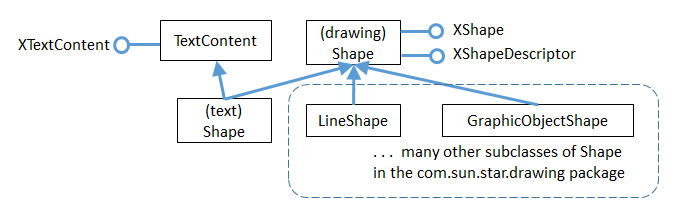
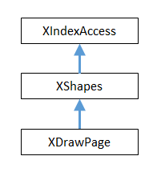
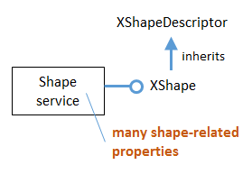

# Chapter 8. Graphic Content

!!! note "Topics"
    Graphics;
    Linked Images/Shapes

    Example folders: "Text
    Tests" and "Utils"

Chapter 7 looked at several forms of text document
content (e.g. text frames, math formulae, text fields and
tables, and bookmarks), as indicated by Figure 1. However
the different ways of adding graphical content (corresponding to the services
highlighted in orange) are the focus of this chapter


Figure 1. The TextContent Service and Some Subclasses.


## 1.  Linking a Graphic Object to a Document

Adding an image to a text document follows the same steps as other text content, as
shown in Write.addImageLink():

```java
public static void addImageLink(XTextDocument doc,
                             XTextCursor cursor, String fnm)
{  addImageLink(doc, cursor, fnm, 0, 0);  }
                     // 0, 0 means use image's size as width & height


public static void addImageLink(XTextDocument doc,
                           XTextCursor cursor, String fnm,
                           int width, int height)
{ try {

    // create TextContent for graphic
    XTextContent tgo = Lo.createInstanceMSF(XTextContent.class,
                             "com.sun.star.text.TextGraphicObject");
    if (tgo == null) {
      System.out.println("Could not create a text graphic object");
      return;
    }

    // set anchor and URL properties
    XPropertySet props = Lo.qi( XPropertySet.class, tgo);
    props.setPropertyValue("AnchorType",
                           TextContentAnchorType.AS_CHARACTER);
    props.setPropertyValue("GraphicURL", FileIO.fnmToURL(fnm));

    // optionally set the width and height
    if ((width > 0) && (height > 0)) {
      props.setPropertyValue("Width", width);
      props.setPropertyValue("Height", height);
    }

    // append image to document, followed by a newline
    append(cursor, tgo);
    endLine(cursor);
  }
  catch (Exception e) {
    System.out.println("Insert of \"" + fnm + "\" failed: " + e);
  }
}  // end of addImageLink()
```

The TextGraphicObject service doesn't offer a XTextGraphicObject interface, so
Lo.createInstanceMSF() returns an XTextContext.

The interface is also converted to XPropertySet because several properties need to be
set. The frame is anchored, and the image's filename is assigned to "GraphicURL"
(after being changed into a URL).

The image's size on the page depends on the dimensions of its enclosing frame, which
are set in the "Width" and "Height" properties:

```java
props.setPropertyValue("Width", 4500);   // 45 mm width
props.setPropertyValue("Height", 4000);  // 40 mm height
```

The values are in 1/100 mm units, so 4500 is 45 mm or 4.5 cm.

If these properties aren't explicitly set then the frame size defaults to being the width
and height of the image.

In more realistic code, the width and height properties would be calculated as some
scale factor of the image's size, as measured in 1/100 mm units not pixels. These
dimensions are available if the image file is loaded as an XGraphic object, as shown
in Images.getSize100mm():

```java
// in the Images class
public static Size getSize100mm(String imFnm)
{
  XGraphic graphic = loadGraphicFile(imFnm);
  if (graphic == null)
    return null;
  return (Size) Props.getProperty(graphic, "Size100thMM");
}  // end of getSize100mm()


public static XGraphic loadGraphicFile(String imFnm)
{
  // create graphics provider
  XGraphicProvider gProvider = Lo.createInstanceMCF(
                    XGraphicProvider.class,
                    "com.sun.star.graphic.GraphicProvider");
  if (gProvider == null) {
    System.out.println("Graphic Provider could not be found");
    return null;
  }

  // set URL property and query it for XGraphic
  PropertyValue[] fileProps =
            Props.makeProps("URL", FileIO.fnmToURL(imFnm));
  try {
    return gProvider.queryGraphic(fileProps);
  }
  catch(Exception e)
  { System.out.println("Could not load XGraphic from " + imFnm);
    return null;
  }
}  // end of loadGraphicFile()
```

Displaying the image at a scaled size is possible by combining
Images.getSize100mm() and Write.addImageLink():

```java
Size imSize = Images.getSize100mm(imFnm);
int w = (int)Math.round(imSize.Width*1.5);   // enlarge by 1.5x
int h = (int)Math.round(imSize.Height*1.5);
Write.addImageLink(doc, cursor, imFnm, w, h);
```

A possible drawback of Write.addImageLink() is that the document only contains a
link to the image. This becomes an issue if you save the document in a format other
than ".odt". In particular, when saved as a Word ".doc" file, the link is lost.


## 2.  Adding a Graphic to a Document as a Shape

An alternative to inserting a graphic as a link is to treat it as a shape. Shapes will be
discussed at length in Part 3, so I won't go into much detail about them here. One
difference between a graphic link and shape is that shapes can be rotated.

Shapes can be created using the com.sun.star.text.Shape service,
com.sun.star.drawing.Shape, or one of its subclasses, while
XDrawPageSupplier.getDrawPage() accesses the shapes in a document.

The shape hierarchy is quite extensive (i.e. there are many kinds of shape), so only the
parts used here are shown in Figure 2:




Figure 2. Part of the Shape Hierarchy.


In Figure 2, "(text) Shape" refers to the com.sun.star.text.Shape service, while
"(drawing) Shape" is com.sun.star.drawing.Shape.

My examples use GraphicObjectShape to create a shape containing an image, and
LineShape to add a line to the document.

The XShapeDescriptor interface in com.sun.star.drawing.Shape is a useful way to
obtain the name of a shape service.


### 2.1.  Creating an Image Shape

The BuildDoc.java example adds an image shape to the document by calling
Write.addImageShape():

```java
// code fragment in BuildDoc.java
Write.append(cursor, "Image as a shape: ");
Write.addImageShape(doc, cursor, imFnm); // image filename
Write.endParagraph(cursor);
```

Write.addImageShape() comes in two versions: with and without width and height
arguments. A shape with no explicitly set width and height properties is rendered as a
miniscule image (about 1 mm wide). Call me old-fashioned, but I want to see the
graphic, so Write.addImageShape() calculates the picture's dimensions if none are
supplied by the user.

Another difference between image shape and image link is how the content's
"GraphicURL" property is employed. The image link version contains its URL, while
the image shape's "GraphicURL" stores its bitmap as a string.

The code for Write.addImageShape():

```java
public static void addImageShape(XTextDocument doc,
                            XTextCursor cursor, String fnm)
{  addImageShape(doc, cursor, fnm, 0, 0);  }
              /* 0, 0 means that the method must calculate
                 the image's size */


public static void addImageShape(XTextDocument doc,
           XTextCursor cursor, String fnm, int width, int height)
{
  Size imSize;
  if ((width > 0) && (height > 0))
    imSize = new Size(width, height);
  else {
    imSize = Images.getSize100mm(fnm);
    if (imSize == null)
      return;
  }

  try {
    // create TextContent for the graphic shape
    XTextContent gos = Lo.createInstanceMSF(
              XTextContent.class,
              "com.sun.star.drawing.GraphicObjectShape");
    if (gos == null) {
      System.out.println("Could not create a graphic shape");
      return;
    }

    // store the image's bitmap in the "GraphicURL" property
    String bitmap = Images.getBitmap(fnm);
    Props.setProperty(gos, "GraphicURL", bitmap);

    // set the shape's size
    XShape xDrawShape = Lo.qi(XShape.class, gos);
    xDrawShape.setSize(imSize);  // must be set, or image is tiny

    // insert image shape into the document, followed by newline
    append(cursor, gos);
    endLine(cursor);
  }
  catch(Exception e) {
    System.out.println("Insert of \"" + fnm + "\" failed: " + e);
  }
}  // end of addImageShape()
```

The image's size is calculated using Images.getSize100mm() if the user doesn't supply
a width and height, and is used towards the end of the method.

An image shape is created using the GraphicObjectShape service, and its
XTextContent interface is converted to XPropertySet for assigning its properties, and
to XShape for setting its size (see Figure 2). XShape includes a setSize() method.

Images.getBitmap() converts the graphic into a bitmap string.

```java
// in the Images utility class
public static String getBitmap(String fnm)
{
  try {
    // create a BitmapTable service and named container
    XNameContainer bitmapContainer =
         Lo.createInstanceMSF(XNameContainer.class,
                       "com.sun.star.drawing.BitmapTable");

    // insert image into container
    if (!FileIO.isOpenable(fnm))
      return null;

    String picURL = FileIO.fnmToURL(fnm);
    if (picURL == null)
      return null;

    bitmapContainer.insertByName(fnm, picURL);
            // use the filename as the name of the bitmap

    // return the bitmap as a string
    return (String) bitmapContainer.getByName(fnm);
  }
  catch(Exception e)
  { System.out.println("Could not create bitmap for " + fnm);
    return null;
  }
}  // end of getBitmap()
```

getBitmap() uses a BitmapTable service to store the image's file in an
XNameContainer. When the bitmap value is retrieved from the container, it can be
cast to a string.

A named container requires a name be assigned to the bitmap value; I use the image's
filename, but any unique string would do.


### 2.2.  Adding Other Graphics to the Document

The graphic text content can be any subclass of Shape. In the last section I created a
GraphicObjectShape service, and accessed its XTextContent interface:

```java
XTextContent gos = Lo.createInstanceMSF(XTextContent.class,
                        "com.sun.star.drawing.GraphicObjectShape");
```

In this section I'll use LineShape:

```java
XTextContent ls = Lo.createInstanceMSF(XTextContent.class,
                       "com.sun.star.drawing.LineShape");
```

The aim is to draw an horizontal line in the document, to act as a divider between
paragraphs. The line will be half-a-page wide and centered, like the one in Figure 3


Figure 3. A Graphical Line Divider.


The difficult part is calculating the width of the line, which should only extend across
half the writing width. This isn't the same as the page width because it doesn't include
the left and right margins.

The page and margin dimensions are accessible through the "Standard" page style, as
implemented in Write.getPageTextWidth():

```java
public static int getPageTextWidth(XTextDocument textDoc)
// get the page's writing width
{
  // access the "standard" style in the pages style family
  XPropertySet props =
         Info.getStyleProps(textDoc, "PageStyles", "Standard");
  if (props == null) {
    System.out.println("Could not access the standard page style");
    return 0;
  }

  // lookup the page and margin widths
  try {
    int width = ((Integer)props.getPropertyValue(
                                      "Width")).intValue();
    int leftMargin = ((Integer)props.getPropertyValue(
                                      "LeftMargin")).intValue();
    int rightMargin = ((Integer)props.getPropertyValue(
                                     "RightMargin")).intValue();

    return (width - (leftMargin + rightMargin));  // writing width
  }
  catch (Exception e)
  {  System.out.println("Could not access page dimensions: " + e);
     return 0;
  }
}  // end of getPageTextWidth()
```

getPageTextWidth() returns the writing width in 1/100 mm units, which is scaled,
then passed to Write.addLineDivider():

```java
// code fragment in BuildDoc,java
int textWidth = Write.getPageTextWidth(doc);
Write.addLineDivider(cursor, (int)Math.round(textWidth*0.5) );
                                     // scale width by 0.5
```

addLineDivider() creates a LineShape service with an XTextContent interface (see
Figure 2). This is converted to XShape so its setSize() method can be passed the line
width:

```java
public static void addLineDivider(XTextCursor cursor,
                                             int lineWidth)
// in the Writer class
{ try {
    // create TextContent for a line
    XTextContent ls = Lo.createInstanceMSF(
                       XTextContent.class,
                       "com.sun.star.drawing.LineShape");
    if (ls == null) {
      System.out.println("Could not create a line shape");
      return;
    }

    // set line size
    XShape lineShape = Lo.qi(XShape.class, ls);
    lineShape.setSize( new Size(lineWidth, 0));

    endParagraph(cursor);
    append(cursor, ls);   // put line in its own paragraph
    endParagraph(cursor);

    // center the line paragraph
    stylePrevParagraph(cursor, "ParaAdjust",
             com.sun.star.style.ParagraphAdjust.CENTER);

    endParagraph(cursor);
  }
  catch(Exception e)
  {  System.out.println("Insertion of graphic line failed");  }
}  // end of addLineDivider()
```

The centering of the line is achieved by placing the shape in its own paragraph, then
using Write.stylePrevParagraph() to center it.


## 3.  Accessing Linked Images and Shapes

The outcome of running BuildDoc.java is a "build.odt" file containing four graphics –
two are linked images, one is an image shape, and the other a line shape.

The ExtractGraphics.java example extracts linked graphics from a document, saving
them as PNG files. It also prints information about the shapes in the document.

When ExtractGraphics is passed "build.odt", the following is output:

```
Num. of text graphics: 2
Saving graphic in graphics1.png
Image size in pixels: 319 x 274
Saving graphic in graphics2.png
Image size in pixels: 319 x 274

Num. of draw shapes: 3
  Shape service: FrameShape; z-order: 0
  Shape service: com.sun.star.drawing.GraphicObjectShape; z-order: 1
  Shape service: com.sun.star.drawing.LineShape; z-order: 2
```

A user who looked at "build.odt" for themselves might say that it contains three
images not the two reported by ExtractGraphics. Why the discrepancy?
ExtractGraphics.java only saves linked graphics, and only two were added by
Write.addImageLink(). The other image was inserted using Write.addImageShape()
which creates an image shape.

The number of shapes reported by ExtractGraphics.java may also confuse the user –
why are there three rather than two? The only shapes added to the document were an
image and a line.

The names of the services gives a clue: the second and third shapes are the expected
GraphicObjectShape and LineShape, but the first is a text frame (FrameShape) added
by Write.addTextFrame(). Although this frame is an instance of the TextFrame
service, it's reported as a FrameShape. That's a bit mysterious because there's no
FrameShape service in the Office documentation.

The main() function of ExtractGraphics.java:

```java
public static void main(String[] args)
{
  XComponentLoader loader = Lo.loadOffice();

  XTextDocument textDoc = Write.openDoc(args[0], loader);
  if (textDoc == null) {
    System.out.println("Could not open " + args[0]);
    Lo.closeOffice();
    return;
  }

  // save text graphics to files
  ArrayList<XGraphic> pics = Write.getTextGraphics(textDoc);
  if (pics == null)
    return;
  System.out.println("\nNum. of text graphics: " + pics.size());
  int i = 1;
  for(XGraphic pic : pics) {
    Images.saveGraphic(pic, "graphics" + i + ".png", "png");
    Size sz = (Size) Props.getProperty(pic, "SizePixel");
    System.out.println("Image size in pixels: " +
                                sz.Width + " x " + sz.Height);
    i++;
  }
  System.out.println();

  // report on shapes in the document
  XDrawPage drawPage = Write.getShapes(textDoc);
  ArrayList<XShape> shapes = Draw.getShapes(drawPage);
  if (shapes != null)
    System.out.println("\nNum. of draw shapes: " + shapes.size());
  for(XShape shape : shapes)
    Draw.printShapeInfo(shape);
  System.out.println();

  Lo.closeDoc(textDoc);
  Lo.closeOffice();
}  // end of main()
```

The first block of code saves text graphic objects as PNGs, and the second reports on
shapes.


### 3.1.  Finding and Saving Text Graphics in a Document

Write.getTextGraphics() returns a list of XGraphic objects: first it retrieves a
collection of the graphic links in the document, then iterates through them creating an
XGraphic object for each one:

```java
// in the Write class
public static ArrayList<XGraphic> getTextGraphics(
                                    XTextDocument textDoc)
{ // get all the graphic links
  XNameAccess xNameAccess = getGraphicLinks(textDoc);
  if (xNameAccess == null)
    return null;
  String[] names = xNameAccess.getElementNames();
  System.out.println("Number of graphics found: " + names.length);

  // build a list of XGraphic objects, one for each link
  ArrayList<XGraphic> pics = new ArrayList<XGraphic>();
  for (int i = 0; i < names.length; i++) {
    Object graphicLink = null;
    try {
      graphicLink = xNameAccess.getByName(names[i]);
    }
    catch(com.sun.star.uno.Exception e) {}

    if (graphicLink == null)
      System.out.println("No graphic found for " + names[i]);
    else {
      XGraphic xGraphic = Images.loadGraphicLink(graphicLink);
      if (xGraphic != null)
        pics.add(xGraphic);
      else
        System.out.println(names[i] + " could not be accessed");
    }
  }
  return pics;
}  // end of getTextGraphics()
```

Graphic objects are accessed with XTextGraphicObjectsSupplier, as implemented by
Write.getGraphicLinks():

```java
// in the Write class
public static XNameAccess getGraphicLinks(XComponent doc)
{
  XTextGraphicObjectsSupplier imsSupplier =
                  Lo.qi(XTextGraphicObjectsSupplier.class, doc);
  if (imsSupplier == null) {
    System.out.println("Supplier could not be created");
    return null;
  }

  XNameAccess xNameAccess = imsSupplier.getGraphicObjects();
  if (xNameAccess == null)  {
    System.out.println("Name access to graphics not possible");
    return null;
  }

  if (!xNameAccess.hasElements())  {
    System.out.println("No graphics elements found");
    return null;
  }
  return xNameAccess;
}  // end of getGraphicLinks()
```

Back in Write.getTextGraphics, each graphic is loaded by calling
Images.loadGraphicLink(). It loads an image from the URL associated with a link:

```java
// in the Images class
public static XGraphic loadGraphicLink(Object graphicLink)
{
  // create graphic provider
  XGraphicProvider gProvider =  Lo.createInstanceMCF(
                        XGraphicProvider.class,
                       "com.sun.star.graphic.GraphicProvider");
  if (gProvider == null) {
    System.out.println("Graphic Provider could not be found");
    return null;
  }

  // set up URL property then load as an XGraphic
  try {
    XPropertySet xprops = Lo.qi(XPropertySet.class, graphicLink);
    PropertyValue[] gProps = Props.makeProps("URL",
                (String) xprops.getPropertyValue("GraphicURL") );
    return gProvider.queryGraphic(gProps);
  }
  catch(Exception e)
  {  System.out.println("Unable to retrieve graphic");
     return null;
  }
}  // end of loadGraphicLink()
```

Note that the XGraphic is not extracted from the document but loaded from a URL.

Back in ExtractGraphics.java, the XGraphic objects are saved as PNG files, and their
pixel sizes reported:

```java
private static void savePics(XTextDocument textDoc)
// method in ExtractGraphics.java
{
  ArrayList<XGraphic> pics = Write.getTextGraphics(textDoc);
  if (pics == null)
    return;
  System.out.println("No. of graphic retrieved: " +  pics.size());
  int i = 1;
  for(XGraphic pic : pics) {
    Images.saveGraphic(pic, "graphics" + i + ".png", "png");
    Size sz = (Size) Props.getProperty(pic, "SizePixel");
    System.out.println("Image Pixel size: " +
                             sz.Width + " x " + sz.Height);
    i++;
  }
}  // end of savePics()
```

Images.saveGraphic() utilizes the graphic provider's XGraphicProvider.storeGraphic()
method:

```java
// in XGraphicProvider
void storeGraphic(XGraphic g, PropertyValue[] props)
{ ... }
```

Its second argument is an array of PropertyValue objects, not a PropertySet. My
Props.java utility class provides several functions for creating PropertyValue
instances, which are a variant of the {name=value} pair idea, but with extra data
fields. One such function is:

```java
// in Props.java
PropertyValue[] makeProps(String[] nms, Object[] vals)
{ ... }
```

It's passed an array of names and values, which are paired up as PropertyValue
objects, and returned in an array.

In saveGraphic(), these methods are used like so:

```java
XGraphicProvider gProvider = Lo.createInstanceMCF(
                      XGraphicProvider.class,
                     "com.sun.star.graphic.GraphicProvider");

// set up properties for storing the graphic
PropertyValue[] props = Props.makeProps(
                           "URL", FileIO.fnmToURL(fnm),
                           "MimeType", "image/" + imFormat);

gProvider.storeGraphic(pic, props);
```

The idea is to call XGraphicProvider.saveGraphics() with the "URL" and
"MimeType" properties set – the URL is for the image file, and the mimetype is an
image type (e.g. "image/png").

saveGraphic() is coded as:

```java
public static void saveGraphic(XGraphic pic,
                                String fnm, String imFormat)
{ // create graphic provider
  XGraphicProvider gProvider = Lo.createInstanceMCF(
                       XGraphicProvider.class,
                       "com.sun.star.graphic.GraphicProvider");
  if (gProvider == null) {
    System.out.println("Graphic Provider could not be found");
    return;
  }

  if (pic == null) {
    System.out.println("Supplied image is null");
    return;
  }

  // set up properties for storing the graphic
  PropertyValue[] pngProps = Props.makeProps(
                           "URL", FileIO.fnmToURL(fnm),
                           "MimeType", "image/" + imFormat);
  try {
    gProvider.storeGraphic(pic, pngProps);
  }
  catch(com.sun.star.uno.Exception e)
  {  System.out.println("Unable to save graphic"); }
}  // end of saveGraphic()
```

Other possible image MIME types include "gif", "jpeg", "wmf", and "bmp". For
instance, this call will save the image as a GIF:
Images.saveGraphic(pic, "graphics" + i + ".gif", "gif");
The printed output from saveGraphic() contains another surprise:

```
Num. of text graphics: 2
Saving graphic in graphics1.png
Image size in pixels: 319 x 274
Saving graphic in graphics2.png
Image size in pixels: 319 x 274
```

The two saved graphics are the same size, but the second image is bigger inside the
document. The discrepancy is because the rendering of the image in the document is
bigger, scaled up to fit the enclosing frame; the original image is unchanged.


### 3.2.  Finding the Shapes in a Document

The second block of code in ExtractGraphics reports on the shapes found in the
document. The relevant code fragment is:

```java
// code fragment from ExtractGraphics.java
XDrawPage drawPage = Write.getShapes(textDoc);
ArrayList<XShape> shapes = Draw.getShapes(drawPage);
if (shapes != null)
  System.out.println("\nNum. of draw shapes: " + shapes.size());
for(XShape shape : shapes)
  Draw.printShapeInfo(shape);
```

Shapes are accessed with the XDrawPageSupplier.getDrawPage() method, which
returns a single XDrawPage:

```java
public static XDrawPage getShapes(XTextDocument textDoc)
{
  XDrawPageSupplier drawPageSupplier = Lo.qi(
                           XDrawPageSupplier.class, textDoc);
  if (drawPageSupplier == null) {
    System.out.println("Draw page supplier could not be created");
    return null;
  }
  return drawPageSupplier.getDrawPage();
}  // end of getShapes()
```

XDrawPage's usual role is to represent the canvas in Office's Draw, or a slide in
Impress, and so plays an important role in Part 3. Several support functions inside that
part's Draw utility class will be used here.

XDrawPageSupplier.getDrawPage() returns a single XDrawPage for the entire text
document. That doesn't mean that the shapes all have to occur on a single text page,
but rather that all the shapes spread across multiple text pages are collected into a
single draw page.

XDrawPage inherits from XShapes and XindexAccess, as shown in Figure 4, which
means that a page can be viewed as a indexed collection of shapes.




Figure 4. Partial Inheritance Hierarchy for XDrawPage.


Draw.getShapes() uses this idea to iterate through the draw page and store the shapes
in a list:

```java
// in the Draw class
public static ArrayList<XShape> getShapes(XDrawPage dp)
{
  if (dp == null) {
    System.out.println("Draw page is null");
    return null;
  }

  if (dp.getCount() == 0) {
    System.out.println("Draw page does not contain any shapes");
    return null;
  }

  // create a shapes list
  ArrayList<XShape> xShapesList = new ArrayList<XShape>();
  try {
    for(int j=0; j < dp.getCount(); j++)
      xShapesList.add( Lo.qi(XShape.class, dp.getByIndex(j)));
  }
  catch(Exception e)
  {   System.out.println("Extraction error in draw page");  }

  return xShapesList;
}  // end of getShapes()
```

XShape is part of the Shape service, which contains many shape-related properties.

XShape inherits XShapeDescriptor, which includes a getShapeType() method for
returning the shape type as a string. Figure 5 summarizes these details.




Figure 5. The Shape Service and XShape Interface

Draw.printShapeInfo() accesses the Shape service associated with an XShape
reference, and prints its "XOrder" property. This number indicates the order that the
shapes were added to the document.

```java
public static void printShapeInfo(XShape xShape)
{
  Integer nZOrder = (Integer) Props.getProperty(xShape, "ZOrder");
  System.out.println("  Shape service: " + xShape.getShapeType() +
                     "; z-order: " + nZOrder);
}
```

printShapeInfo() also calls the inherited XShapeDescriptor.getShapeType() method to
report the shape's service name.


### 3.3.  Another Way of Accessing Drawing Shapes

The XDrawPageSupplier documentation states that this interface is deprecated,
although what's meant to replace it isn't clear. My guess is
com.sun.star.text.XTextShapesSupplier, although I wasn't able to get it to supply
anything. For example, the following always reports that the supplier is null:

```java
XTextShapesSupplier shpsSupplier = Lo.qi(
                              XTextShapesSupplier.class, textDoc);
if (shpsSupplier == null)
  System.out.println("Could not obtain text shapes supplier");
else
  System.out.println("Num. of text shapes: " +
                        shpsSupplier.getShapes().getCount());
```