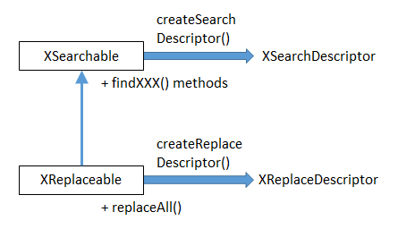
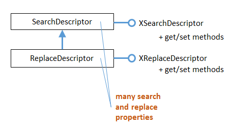

# Chapter 9. Text Search and Replace 
 
 
The GenericTextDocument service supports the 
XSearchable and XReplaceable interfaces (see Chapter 5, 
Figure 2), which are the entry points for doing regular 
expression based search and replace inside a document. 

XSearchable.createSearchDescriptor() builds a search 
description (an ordinary string or a regular expression). The search is executed with 
XSearchable.findAll() or findFirst() and findNext().  

XReplaceable works in a similar way but with a replace descriptor which combines a 
replacement string with the search string. XReplaceable.replaceAll() performs search 
and replacement, but the XSearchable searching methods are available as well. This is 
shown in Figure 1. 

 

Figure 1. The XSearchable and XReplaceable Interfaces. 

 
The following code fragment utilizes the XSearchable and XSearchDescriptor 
interfaces: 
 
XSearchable searchable = Lo.qi(XSearchable.class, doc); 
XSearchDescriptor srchDesc = searchable.createSearchDescriptor(); 
srchDesc.setSearchString("colou?r");    
       // a regular expression meaning "color" or "colour" 
 
XReplaceable and XReplaceDescriptor objects are configured in a similar way, as 
shown in the examples. 

XSearchDescriptor and XReplaceDescriptor contain get and set methods for their 
strings. But a lot of the search functionality is expressed as properties in their 
SearchDescriptor and ReplaceDescriptor services. Figure 2 summarizes these 
arrangements. 

!!! note "Topics"
    Finding the First 
Matching Phrase; 
Replacing all the 
Matching Words; 
Finding all Matching 
Phrases 
Example folders: "Text 
Tests" and "Utils" 
 

Figure 2. The SearchDescriptor and ReplaceDescriptor Services. 

 
The next code fragment accesses the SearchDescriptor properties, and switches on 
regular expression searching: 
 
XPropertySet srchProps = Lo.qi(XPropertySet.class, srchDesc); 
srchProps.setPropertyValue("SearchRegularExpression", true); 
 
Alternatively, Props.setProperty() can be employed: 
Props.setProperty(srchDesc, "SearchRegularExpression", true); 
Once a search descriptor has been created (i.e. its string is set and any properties 
configured), then one of the findXXX() methods in XSearchable can be called.  

For instance, XSearchable.findFirst() returns the text range of the first matching 
element (or null), as in: 
 
XInterface srch = (XInterface) searchable.findFirst(srchDesc); 
XTextRange matchTR = Lo.qi(XTextRange.class, srch); 
 
The example programs, TextReplace.java and ItalicsStyler.java, demonstrate search 
and replacement. TextReplace.java uses XSearchable to find the first occurrence of a 
regular expression and XReplaceable to replace multiple occurrences of other words. 

ItalicsStyler.java calls XSearchable's findAll() to find every occurrence of a phrase.  

 
 
## 1.  Finding the First Matching Phrase 

TextReplace.java repeatedly calls XSearchable.findFirst() with regular expressions 
taken from an array. The first matching phrase for each expression is reported. For 
instance, the call: 
 
String words[] = {"(G|g)rit", "colou?r"}; 
findWords(doc, words); 
 
prints the following when "story.doc" is searched: 
 
Searching for first occurrence of "(G|g)rit" 
  - found "Grit" 
    - on page 1 
    - at char position: 929 
Searching for first occurrence of "colou?r" 
  - found "colour" 
    - on page 5 
    - at char position: 10856 
 
Three pieces of information are printed for each match: the text that matched, its page 
location, and its character position calculated from the start of the document. The 
character position could be obtained from a text cursor or a text view cursor, but I 
need a page cursor to access the page number. Therefore the easiest thing to use a text 
view cursor, and a linked page cursor. 

The code for findWords(): 
 
private static void findWords(XTextDocument doc, String[] words) 
{ 
  // get the text view cursor and linked page cursor 
  XTextViewCursor tvc = Write.getViewCursor(doc); 
  tvc.gotoStart(false); 
  XPageCursor pageCursor = Lo.qi(XPageCursor.class, tvc); 
 
  try { 
    XSearchable searchable = Lo.qi(XSearchable.class, doc); 
    XSearchDescriptor srchDesc =  
                          searchable.createSearchDescriptor(); 
 
    for(int i = 0; i < words.length; i++ ) { 
      System.out.println("Searching for first occurrence of \"" +  
                                                  words[i] + "\""); 
      srchDesc.setSearchString(words[i]); 
      Props.setProperty(srchDesc, "SearchRegularExpression", true); 
 
      XInterface  srch = (XInterface) searchable.findFirst(srchDesc); 
      if (srch != null) { 
        XTextRange matchTR = Lo.qi(XTextRange.class, srch); 
        tvc.gotoRange(matchTR, false);  
        System.out.println("  - found \"" +  
                                   matchTR.getString() + "\""); 
        System.out.println("    - on page " +  
                                     pageCursor.getPage()); 
        tvc.gotoStart(true);   
        System.out.println("    - at char position: " +  
                                     tvc.getString().length());  
      } 
      else 
        System.out.println("  - not found"); 
    } 
  } 
  catch(com.sun.star.uno.Exception e) { 
    System.out.println(e); 
  } 
}  // end of findWords() 
 
findWords() creates the text view cursor (tvc), moves it to the start of the document, 
and links the page cursor to it:  
XPageCursor pageCursor = Lo.qi(XPageCursor.class, tvc); 
There is only one view cursor in an application, so when the text view cursor moves, 
so does the page cursor, and vice versa. 

The XSearchable and XSearchDescriptor interfaces are instantiated, and a for-loop 
searches for each word in the supplied array. If XSearchable.findFirst() returns a 
matching text range, it's used by XTextCursor.gotoRange() to update the position of 
the cursor.  

After the page position has been printed, the cursor is moved to the start of the 
document with selection turned on: 
 
tvc.gotoStart(true);  
System.out.println("    - at char position: " +  
                                      tvc.getString().length());  
 
This means that tvc.getString() will return all the text from the start of the document 
to the current matching point, and so length() will return the character position 
measured from the beginning of the file. As I've mentioned previously, this approach 
may fail if the size of the string being instantiated is too big. 

 
 
## 2.  Replacing all the Matching Words 

TextReplace.java also contains a method called replaceWords(), which takes two 
string arrays as arguments: 
 
// code fragment inside TextReplace.java 
String ukWords[] = { 
  "colour", "neighbour", "centre", "behaviour", "metre", "through" }; 
 
String usWords[] = { 
  "color", "neighbor", "center", "behavior", "meter", "thru" }; 
 
replaceWords(doc, ukWords, usWords); 
 
replaceWords() cycles through the arrays, replacing all occurrences of the words in 
the first array (e.g. in ukWords[]) with the corresponding words in the second array 
(e.g. in usWords[]). For instance, every occurrence of "colour" is replaced by "color". 

The output: 
 
Change all occurrences of ... 

  colour -> color 
    - no. of changes: 1 
  neighbour -> neighbor 
    - no. of changes: 2 
  centre -> center 
    - no. of changes: 2 
  behaviour -> behavior 
    - no. of changes: 0 
  metre -> meter 
    - no. of changes: 0 
  through -> thru 
    - no. of changes: 4 
 
Since replaceWords() doesn't report page and character positions, its code is 
somewhat shorter than findWords(): 
 
private static void replaceWords(XTextDocument doc,  
                       String[] oldWords, String[] newWords) 
{ 
  XReplaceable replaceable = Lo.qi(XReplaceable.class, doc); 
  XReplaceDescriptor replaceDesc =  
                        replaceable.createReplaceDescriptor(); 
 
  System.out.println("Change all occurrences of ..."); 
  for (int i = 0; i < oldWords.length; i++) { 
    System.out.println("  " + oldWords[i] + " -> " + newWords[i]); 
    replaceDesc.setSearchString(oldWords[i]); 
    replaceDesc.setReplaceString(newWords[i]); 
 
    int numChanges = replaceable.replaceAll(replaceDesc);      
                           // replace all occurrence of word 
    System.out.println("    - no. of changes: " + numChanges); 
  } 
}  // end of replaceWords() 
 
The XReplaceable and XReplaceDescriptor interfaces are created in a similar way to 
their search versions. The replace descriptor has two set methods, one for the search 
string, the other for the replacement string. 

 
 
## 3.  Finding all Matching Phrases 

ItalicsStyler.java is supplied with a filename and a string on the command line. For 
instance: 
> run ItalicsStyler story.doc scandal 
The program opens the file and uses the "search all' method in XSearchable to find all 
occurrences of the string in the document. The matching strings are italicized and 
colored red, and the changed document saved as "italicized.doc". These changes are 
not performed using XReplaceable methods. 

Figure 3 shows a fragment of the resulting document, with the "scandal" text in the 
title and header changed. The search ignores case, so the word in the title ("Scandal") 
was correctly modified. 

 
 

Figure 3. A Fragment of The Italicized Document. 

 
The ItalicsStyler program also outputs matching details: 
 
Searching for all occurrence of "scandal" 
No. of matches: 5 
  - found "scandal" 
    - on page 1 
    - starting at char position: 6 
  - found "Scandal" 
    - on page 1 
    - starting at char position: 2 
  - found "scandal" 
    - on page 6 
    - starting at char position: 13153 
  - found "scandal" 
    - on page 18 
    - starting at char position: 38736 
  - found "scandal" 
    - on page 21 
    - starting at char position: 46425 
 
As with TextReplace.java, the printed details include the page and character positions 
of the matches. 

The searching in ItalicsStyler.java is performed by italicizeAll(), which bears a close 
resemblance to findWords(): 
 
private static void italicizeAll(XTextDocument doc, String phrase) 
{ 
  // get the text view cursor and linked page cursor 
  XTextViewCursor tvc = Write.getViewCursor(doc); 
  tvc.gotoStart(false); 
  XPageCursor pageCursor = Lo.qi(XPageCursor.class, tvc); 
 
  try { 
    XSearchable xSearchable = Lo.qi(XSearchable.class, doc); 
    XSearchDescriptor srchDesc =  
                         xSearchable.createSearchDescriptor(); 
 
    System.out.println("Searching for all  
                         occurrences of \"" + phrase + "\""); 
    int phraseLen = phrase.length(); 
    srchDesc.setSearchString(phrase); 
    Props.setProperty(srchDesc, "SearchCaseSensitive", false); 
 
    XIndexAccess matches = xSearchable.findAll(srchDesc); 
    System.out.println("No. of matches: " + matches.getCount()); 
    for (int i = 0; i < matches.getCount(); i++) { 
      XTextRange matchTR = Lo.qi(XTextRange.class,  
                                      matches.getByIndex(i)); 
      if (matchTR != null) { 
        tvc.gotoRange(matchTR, false); 
        System.out.println("  - found \"" +  
                                matchTR.getString() + "\""); 
        System.out.println("    - on page " +  
                                        pageCursor.getPage()); 
        tvc.gotoStart(true); 
        System.out.println("    - starting at char position: " +  
                    (tvc.getString().length() - phraseLen)); 
        Props.setProperties(matchTR,  
                   new String[] {"CharColor", "CharPosture"}, 
                   new Object[] { 0xFF0000,  
                          com.sun.star.awt.FontSlant.ITALIC} ); 
      } 
    } 
  } 
  catch(com.sun.star.uno.Exception e) { 
    System.out.println(e); 
  } 
}  // end of italicizeAll() 
 
After the search descriptor string has been defined, the "SearchCaseSensitive" 
property in SearchDescriptor is set to false: 
 
srchDesc.setSearchString(phrase); 
Props.setProperty(srchDesc, "SearchCaseSensitive", false); 
 
This allows the search to match text contains both upper and lower case letters, such 
as "Scandal". Many other search variants, such as restricting the search to complete 
words, and the use of search similarity parameters are described in the 
SearchDescriptor documentation (loDoc SearchDescriptor service). 

XSearchable.findAll() returns an XIndexAccess collection, which is examined 
element-by-element inside a for-loop. The text range for each element is obtained by 
applying Lo.qi(): 
XTextRange matchTR = Lo.qiXTextRange.class, matches.getByIndex(i)); 
The reporting of the matching page and character position use text view and page 
cursors in the same way as findWords() in TextReplace.java.  

XTextRange is part of the TextRange service, which inherits ParagraphProperties and 
CharacterProperties. These properties are changed to adjust the character color and 
style of the selected range: 
 
Props.setProperties(matchTR,  
      new String[] {"CharColor", "CharPosture"}, 
      new Object[] { 0xFF0000, com.sun.star.awt.FontSlant.ITALIC} ); 
 
This changes the "CharColor" and "CharPosture" properties to red and italic.  

