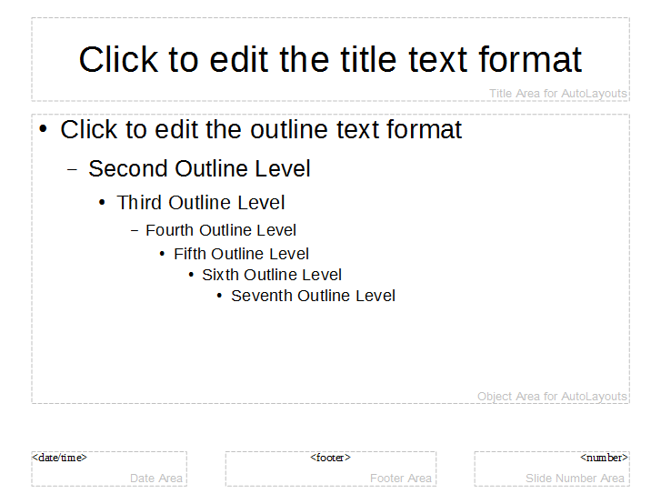

# Chapter 12. Examining a Draw/Impress Document 

!!! note "Topics"
    Examining 
    Slides/Pages; Page 
    Layers;  Styles 

    Example folders: "Draw 
    Tests" and "Utils" 
 
 
This chapter describes the SlidesInfo.java example, which 
shows the basics of how to open and display a Draw or 
Impress file. The code also illustrates how the slides or pages can be examined, 
including how to retrieve information on their layers and styles. 

The SlidesInfo.java main() function: 
 
public static void main(String args[]) 
{ 
  if (args.length != 1) { 
    System.out.println("Usage: SlidesInfo <filename>"); 
    return; 
  } 
 
  XComponentLoader loader = Lo.loadOffice(); 
  XComponent doc = Lo.openDoc(args[0], loader); 
  if (doc == null) { 
    System.out.println("Could not open the file: " + args[0]); 
    Lo.closeOffice(); 
    return; 
  } 
 
  if (!Draw.isShapesBased(doc)) { 
    System.out.println("-- not a drawing or slides presentation"); 
    Lo.closeOffice(); 
    return; 
  } 
 
  GUI.setVisible(doc, true); 
  Lo.delay(1000);    // need delay or zoom may not work 
 
  GUI.zoom(doc, GUI.ENTIRE_PAGE); 
         // or GUI.OPTIMAL, GUI.PAGE_WIDTH, GUI.ENTIRE_PAGE 
  // GUI.zoomValue(doc, 60);   // percentage size 
 
  System.out.println("\nNo of slides: " +  
                          Draw.getSlidesCount(doc) + "\n"); 
 
  XDrawPage currSlide = Draw.getSlide(doc, 0); // access first page 
 
  Size sz = Draw.getSlideSize(currSlide); 
  System.out.println("Size of slide (mm): (" +  
                            sz.Width + ", " + sz.Height + ")\n"); 
  reportLayers(doc); 
  reportStyles(doc); 
 
  Lo.closeDoc(doc); 
  Lo.closeOffice(); 
} // end of main() 
 
Lo.openDoc() is capable of opening any Office document, and importing documents 
in other formats, so it's worthwhile checking the resulting XComponent object before 
progressing. Draw.isShapesBased() returns true if the file holds a Draw or Impress 
document: 
 
// in the Draw class 
public static boolean isShapesBased(XComponent doc) 
{  return Info.isDocType(doc, Lo.DRAW_SERVICE) ||  
          Info.isDocType(doc, Lo.IMPRESS_SERVICE);  } 
 
The document is made visible on-screen by calling GUI.setVisible(), and the 
application view is resized so all the drawing (or slide) is visible inside the window. 

Draw.zoom() can be passed three different constants for showing the entire width of 
the page, the entire page, or an optimal view that zooms in so all the 'data' on the page 
is visible without the empty space around it. Alternatively, Draw.zoomValue() allows 
the user to supply a zooming percentage. 

These two methods are defined using Lo.dispatchCmd(), which was introduced at the 
end of Chapter 4: 
 
// in the Draw class 
public static void zoom(XComponent doc, short view) 
{ 
  if (view == OPTIMAL) 
    Lo.dispatchCmd("ZoomOptimal"); 
  else if (view == PAGE_WIDTH) 
    Lo.dispatchCmd("ZoomPageWidth"); 
  if (view == ENTIRE_PAGE) 
    Lo.dispatchCmd("ZoomPage"); 
  else { 
    System.out.println("Did not recognize zoom view: " +  
                              view + "; using optimal"); 
    Lo.dispatchCmd("ZoomOptimal"); 
  } 
  Lo.delay(500); 
}  // end of zoom() 
 
 
public static void zoomValue(XComponent doc, int value) 
// zoom to a specific value using a dispatch 
{ 
  String[] zoomLabels = {"Zoom.Value", "Zoom.ValueSet", "Zoom.Type"}; 
  Object[] zoomVals = {(short)value, 28703, 0}; 
 
  Lo.dispatchCmd("Zoom", Props.makeProps(zoomLabels, zoomVals)); 
  Lo.delay(500); 
}  // end of zoomValue() 
 
I found the four dispatch commands ("ZoomOptimal", "ZoomPageWidth", 
"ZoomPage", and "Zoom") by browsing the "Development/DispatchCommands" 
documentation page at 
https://wiki.documentfoundation.org/Development/DispatchCommands. A great 
offline source is the UICommands.ods spreadsheet, put together by Ariel Constenla-
Haile, which can be obtained from 
https://arielch.fedorapeople.org/devel/ooo/UICommands.ods. 

Draw.zoomValue() uses the "Zoom" dispatch which requires the setting of properties. 

Its "Zoom.Type" parameter can be assigned 0, 1, 2, or 3 which correspond to zooming 
in terms of percentages, an optimal view, entire page, or page width. Unfortunately, I 
was only able to get the 0 value to work, which is why the others are handled by 
Draw.zoom(). 

The call to Lo.delay() at the end of the zoom methods gives Office time to carry out 
the zooming before my code does anything else. The same trick is utilized in the 
main() function, after the call to GUI.setVisible(). 

 
 
## 1.  Accessing Slides/Pages 

Most of my Draw class method names include the word 'slide' (e.g. 

Draw.getSlidesCount(),  Draw.getSlide(), Draw.getSlideSize()). That's a bit 
misleading since most of them will work just as well with Draw or Impress 
documents. For example, Draw.getSlidesCount() will return 1 when applied to a 
newly created Draw document. 

Draw.getSlidesCount() calls Draw.getSlides() which returns an XDrawPages object; 
XDrawPages supports a getCount() method: 
 
// in the Draw class 
public static int getSlidesCount(XComponent doc) 
{ 
  XDrawPages slides = getSlides(doc); 
  if (slides == null) 
    return 0; 
  return slides.getCount(); 
}  // end of getSlidesCount() 
 
 
public static XDrawPages getSlides(XComponent doc) 
// return all the pages as an XDrawPages object 
{ 
  XDrawPagesSupplier supplier = Lo.qi(XDrawPagesSupplier.class, doc); 
  if (supplier == null) 
    return null; 
  return supplier.getDrawPages(); 
}  // end of getSlides() 
 
getSlides() employs the XDrawPagesSupplier interface which is part of 
GenericDrawingDocument shown in Figure 2 of Chapter 11. 

Draw.getSlide() (note: no "s") also calls Draw.getSlides(), but treats the XDrawPages 
object as an indexed container of XDrawPage objects: 
 
// in the Draw class 
public static XDrawPage getSlide(XComponent doc, int idx) 
{   return getSlide( getSlides(doc), idx);  } 
 
 
public static XDrawPage getSlide(XDrawPages slides, int idx) 
{ 
  XDrawPage slide = null; 
  try { 
    slide = Lo.qi(XDrawPage.class, slides.getByIndex(idx)); 
  } 
  catch(Exception e) 
  {  System.out.println("Could not get slide " + idx);  } 
  return slide; 
}  // end of getSlide() 
 
Draw.getSlideSize() returns a com.sun.star.awt.Size object created from looking up 
the "Width" and "Height" properties of the supplied slide/page: 
 
// in the Draw class 
public static Size getSlideSize(XDrawPage xDrawPage) 
// get size of the given page (in mm units) 
{ 
  try { 
    XPropertySet props = Lo.qi(XPropertySet.class, xDrawPage); 
    if (props == null) { 
       System.out.println("No slide properties found"); 
       return null; 
     } 
    int width = (Integer) props.getPropertyValue("Width"); 
    int height = (Integer) props.getPropertyValue("Height"); 
    return new Size(width/100, height/100); 
  } 
  catch(Exception e) 
  {  System.out.println("Could not get page dimensions"); 
     return null; 
  } 
}  // end of getSlideSize() 
 
These Width" and "Height" properties are stored in XDrawPage's GenericDrawPage 
service, shown in Figure 5 of Chapter 11.  

My Draw class specifies measurements in millimeters rather than Office's 1/100 mm 
units. For instance, Draw.getSlideSize() would return Office page dimensions of 
28000 by 21000 as (280, 210). 

 
 
## 2.  Page Layers 

A Draw or Impress page consists of five layers called "layout", "controls", 
"measurelines", "background", and "backgroundobjects". The first three are described 
in the Draw user guide, but"measurelines" is called "Dimension Lines".  

Probably "layout" is the most important layer since that's where shapes are located. 

Form controls (e.g. buttons) are added to "controls", which is always the top-most 
layer. "background", and "backgroundobjects" refer to the master page graphic and 
any shapes on that page.  

Each layer can be made visible or invisible independent of the others. It's also 
possible to create new layers.  

reportLayers() in SlidesInfo.java prints each layer's properties: 
 
// in SlidesInfo.java 
private static void reportLayers(XComponent doc) 
{ 
  XLayerManager lm = Draw.getLayerManager(doc); 
  for(int i=0; i < lm.getCount(); i++) 
    try { 
      Props.showObjProps(" Layer " + i, lm.getByIndex(i)); 
    } 
    catch(com.sun.star.uno.Exception e) {} 
 
  XLayer layer = Draw.getLayer(doc, "backgroundobjects"); 
  Props.showObjProps("Background Object Props", layer); 
}  // end of reportLayers() 
 
Draw.getLayerManager() obtains an XLayerManager instance which can be treated as 
an indexed container of XLayer objects. Draw.getLayer() converts the 
XLayerManager into a named container, so it can be searched by layer name. 

Typical output from reportLayers() is: 
 
 Layer 0 Properties 
  Description == 
  IsLocked == false 
  IsPrintable == true 
  IsVisible == true 
  Name == layout 
  Title == 
 
 Layer 1 Properties 
  Description == 
  IsLocked == false 
  IsPrintable == true 
  IsVisible == true 
  Name == background 
  Title == 
 
 Layer 2 Properties 
  Description == 
  IsLocked == false 
  IsPrintable == true 
  IsVisible == true 
  Name == backgroundobjects 
  Title == 
 
 Layer 3 Properties 
  Description == 
  IsLocked == false 
  IsPrintable == true 
  IsVisible == true 
  Name == controls 
  Title == 
 
 Layer 4 Properties 
  Description == 
  IsLocked == false 
  IsPrintable == true 
  IsVisible == true 
  Name == measurelines 
  Title == 
 
Background Object Props Properties 
  Description == 
  IsLocked == false 
  IsPrintable == true 
  IsVisible == true 
  Name == backgroundobjects 
  Title == 
 
Each layer contains six properties. Four are defined by the Layer service; use lodoc 
layer service drawing to see its documentation. The most useful property is 
probably "IsVisible" which toggles the layer's visibility. 

 
 
## 3.  Styles 

Draw and Impress utilize the same style organization as text documents, which was 
explained in Chapter 6. Figure 1 shows its structure. 

 

Figure 1. Draw/Impress Style Families and their Property Sets. 

 
The style family names are different from those in text documents. The "Default" 
style family corresponds to the styles defined in a document's default master page. 

Figure 2 shows this master page in Impress. 

 
 

Figure 2. The Default Master Page in Impress. 

 
The master page (also known as a template in Impress' GUI) contains style 
information related to the title, seven outline levels and background areas (e.g. the 
date, the footer, and the slide number in Figure 2). Not all the master page styles are 
shown in Figure 2; for instance, there's a subtitle style, notes area, and a header.  

If a slide deck is formatted using a master page (Impress template) other than 
"Default", such as "Inspiration", then the style family name will be changed 
accordingly. The "Inspiration" family contains the same properties (styles) as 
"Default", but with different values.  

Details on coding with master pages and Impress templates are given in the 
MastersUse.java and PointsBuilder.java examples in Chapter 17.  

The other Draw/Impress style families are "cell", "graphics" and "table". "table" and 
"cell" contain styles which affect the colors used to draw a table and its cells. 

"graphics" affects the appearance of shapes. Examples of how to use the "graphics" 
style family are given in the DrawPictures.java example in Chapter 14. 

The reportStyles() method inside SlidesInfo.java is: 
 
private static void reportStyles(XComponent doc) 
// report style information: families, styles, properties 
{ 
  String[] styleNames = Info.getStyleFamilyNames(doc); 
  System.out.println("Style Families in this document:"); 
  Lo.printNames(styleNames); 
 
  for (String styleName : styleNames) { 
    String[] conNames = Info.getStyleNames(doc, styleName); 
    System.out.println("Styles in the \"" +  
                        styleName + "\" style family:"); 
    Lo.printNames(conNames); 
  } 
 
/* 
  XPropertySet props = Info.getStyleProps(doc,  
                                "Default", "outline1"); 
  XPropertySet props = Info.getStyleProps(doc,  
                                "graphics", "objectwitharrow"); 
         // accessing a style causes Office to crash upon exiting 
  Props.showProps("Object Arrow Properties", props);   // long 
*/ 
}  // end of reportStyles() 
 
The method prints the names of the style families, and the names of the styles 
(property sets) inside each family. Typical output is: 
 
Style Families in this document: 
  "Inspiration"  "cell"  "graphics"  "table" 
 
Styles in the "Inspiration" style family: 
  "background"  "backgroundobjects"  "notes"  "outline1" 
  "outline2"  "outline3"  "outline4"  "outline5" 
  "outline6"  "outline7"  "outline8"  "outline9" 
  "subtitle"  "title" 
 
Styles in the "cell" style family: 
  "blue1"  "blue2"  "blue3"  "bw1" 
  "bw2"  "bw3"  "default"  "earth1" 
  "earth2"  "earth3"  "gray1"  "gray2" 
  "gray3"  "green1"  "green2"  "green3" 
  "lightblue1"  "lightblue2"  "lightblue3"  "orange1" 
  "orange2"  "orange3"  "seetang1"  "seetang2" 
  "seetang3"  "sun1"  "sun2"  "sun3" 
  "turquoise1"  "turquoise2"  "turquoise3"  "yellow1" 
  "yellow2"  "yellow3" 
 
Styles in the "graphics" style family: 
 "Object with no fill and no line" "headline" "headline1" "headline2" 
  "measure" "objectwitharrow" "objectwithoutfill" "objectwithshadow" 
  "standard"  "text"  "textbody"  "textbodyindent" 
  "textbodyjustfied"  "title"  "title1"  "title2" 
 
Styles in the "table" style family: 
  "blue"  "bw"  "default"  "earth" 
  "green"  "lightblue"  "orange"  "seetang" 
  "sun"  "turquoise"  "yellow" 
 
The final part of reportStyles() prints the properties for a specified style. The code is 
commented out for two reasons – first, the output can be extremely long, but the main 
reason is that Office has a problem accessing drawing styles. Although 
Info.getStyleProps() works, allowing style properties to be accessed and changed, 
Office crashes when the program exits. It's fairly benign since the Office process is 
fully terminated, but an error message appears on-screen. 

 
