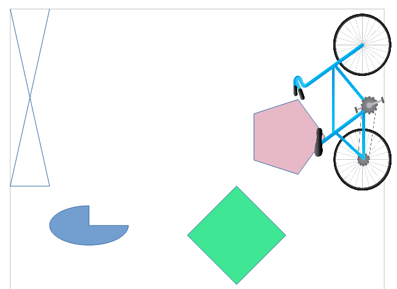

# Chapter 14. Animation

!!! note "Topics"
    Circle
    Movement; Line
    Rotation; Animating an
    Image; The Gallery
    Module

    Example folders: "Draw
    Tests" and "Utils"


DrawPicture.java contains a commented-out call to
animShapes() which shows how to animate a circle and a
line. There's a second animation example in
AnimBicycle.java which translates and rotates a bicycle
image. The chapter ends with a brief outline of the
com.sun.star.gallery module.


## 1.  Animating a Circle and a Line

animShapes() in DrawPicture.java implements two animation loops that work in a
similar manner. Inside a loop, a shape is drawn, the function (and program) sleeps for
a brief period, then the shape's position, size, or properties are updated, and the loop
repeats.

The first animation loop moves a circle across the page from left to right, reducing its
radius at the same time. The second loop rotates a line counter-clockwise while
changing its length. The animShapes() code:

=== "java"
    ```java
    // in DrawPicture.java
    private static void animShapes(XDrawPage currSlide)
    {
      // reduce circle size and move to the right
      int xc = 40;
      int yc = 150;
      int radius = 40;
      XShape circle = null;
      for (int i=0; i < 20; i++) {
        if (circle != null)
          currSlide.remove(circle);
        circle = Draw.drawCircle(currSlide, xc, yc, radius);
                                   // (x-center, y-center, radius)
        Lo.delay(200);
        xc += 5;         // move right
        radius *= 0.95;  // reduce size
      }
    
      // rotate line counter-clockwise, and change length
      int x2 = 140;
      int y2 = 110;
      XShape line = null;
      for (int i=0; i <= 25; i++) {
        if (line != null)
          currSlide.remove(line);
        line = Draw.drawLine(currSlide, 40, 100, x2, y2);
        Lo.delay(200);
        x2 -= 4;
        y2 -= 4;
      }
    }  // end of animShapes()
    ```

The shape (circle or line) is changed by removing the current version from the page
and inserting a new updated instance. This means that a lot of objects are created and
removed in a short amount of time. The alternative approach, which retains the shape
and only update its properties, is used in the bicycle animation explained next.


## 2.  Animating an Image

The AnimBicycle.java example moves a bicycle image to the right and rotates it
counter-clockwise. Figure 1 shows the page after the animation has finished.




Figure 1. Animated Bicycle and Shapes.


The animation is performed by animateBike():

=== "java"
    ```java
    private static void animateBike(XDrawPage currSlide)
    {
      String fnm = Info.getGalleryDir() +
                       "/transportation/Bicycle-Blue.png";
      XShape shape = Draw.drawImage(currSlide, fnm, 60, 100, 90, 50);
                                          // (x,y), width, height
      if (shape == null) {
        System.out.println("Bike shape not created");
        return;
      }
    
      Point pt = Draw.getPosition(shape);
      int angle = Draw.getRotation(shape);
      for (int i=0; i <= 18; i++) {
         Draw.setPosition(shape, pt.X+(i*5), pt.Y); // move right
         Draw.setRotation(shape, angle+(i*5));   // rotates
         Lo.delay(200);
      }
    
      System.out.println("Final Angle: " + Draw.getRotation(shape));
      Draw.printMatrix( Draw.getTransformation(shape));
    }  // end of animateBike()
    ```

The image comes from Office’s Gallery collection whose location is returned by
Info.getGalleryDir(). There are several gallery locations that Office might use, but
getGalleryDir() returns the main one, which is <OFFICE>/share/gallery/. This
directory divides the collection into a number of subdirectories, and the bicycle is in
transportation/Bicycle-Blue.png.

The animation loop in animateBike() is similar to the ones in animShapes(), using
Lo.delay() to space out changes over time. However, instead of creating a new shape
on each iteration, a single GraphicObjectShape is created by Draw.drawImage()
before the loop starts. Inside the loop, that shape’s position and orientation are
repeatedly updated by Draw.setPosition() and Draw.setRotation().


### 2.1.  Drawing the Image

There are several versions of Draw.drawImage(); the main one is:

=== "java"
    ```java
    // in the Draw class
    public static XShape drawImage(XDrawPage slide,String imFnm,
                              int x, int y, int width, int height)
    // units in mm's
    {
      System.out.println("Adding the picture \"" + imFnm + "\"");
      XShape imShape = addShape(slide, "GraphicObjectShape",
                                                x, y, width, height);
      setImage(imShape, imFnm);
      setLineStyle(imShape, LineStyle.NONE);
                         // so no border around the image
      return imShape;
    }  // end of drawImage()
    
    
    public static void setImage(XShape shape, String imFnm)
    {
      String bitmap = Images.getBitmap(imFnm);
      Props.setProperty(shape, "GraphicURL", bitmap);
                  // embed bitmap from image file
    }  // end of setImage()
    ```

drawImage() uses the supplied (x, y) position, width, and  height to create an empty
GraphicObjectShape. An image is added by setImage(), which loads a bitmap from a
file, and assigns it to the shape's "GraphicURL" property. By using a bitmap, the
image is embedded in the document.

Alternatively, a URL could be assigned to "GraphicURL", causing the document's
image to be a link back to its original file. That version is coded using:

=== "java"
    ```java
    Props.setProperty(shape, "GraphicURL", FileIO.fnmToURL(imFnm));
                                  // link to image file
    ```

A second version of Draw.drawImage() doesn't require width and height arguments –
they're obtained from the image’s dimensions:

=== "java"
    ```java
    // in the Draw class
    public static XShape drawImage(XDrawPage slide, String imFnm,
                                                       int x, int y)
    // units in mm's
    {
      Size imSize = Images.getSize100mm(imFnm);   // in 1/100 mm units
      if (imSize == null) {
        System.out.println("Could not calculate size of " + imFnm);
        return null;
      }
      else
        return drawImage(slide, imFnm, x, y,
                      imSize.Width/100, imSize.Height/100);
    }  // end of drawImage()
    ```

The image’s size is returned in 1/100 mm units by Images.getSize100mm(). It loads
the image as an XGraphic object so that its "Size100thMM" property can be
examined:

=== "java"
    ```java
    // in the Images class
    public static Size getSize100mm(String imFnm)
    {
      XGraphic graphic = loadGraphicFile(imFnm);
      if (graphic == null)
        return null;
      return (Size) Props.getProperty(graphic, "Size100thMM");
    }  // end of getSize100mm()
    ```

This approach isn’t very efficient since it means that the image is being loaded twice,
once as an XGraphic object by getSize100mm(), and also as a bitmap by setImage().


### 2.2.  Updating the Bike’s Position and Orientation

The animateBike() animation uses Draw methods for getting and setting the shape’s
position and orientation:

=== "java"
    ```java
    // in the Draw class
    public static Point getPosition(XShape shape)
    { Point pt = shape.getPosition();
      return new Point(pt.X/100, pt.Y/100);  // convert to mm
    }
    
    public static void setPosition(XShape shape, int x, int y)
    {   shape.setPosition(new Point(x*100, y*100));  }
    
    
    public static int getRotation(XShape shape)
    { return ((Integer)Props.getProperty(shape, "RotateAngle"))/100;  }
    
    public static void setRotation(XShape shape, int angle)
    {  Props.setProperty(shape, "RotateAngle", angle*100);  }
    ```

The position is accessed and changed using the XShape methods getPosition() and
setPosition(), with the only complication being the changes of millimeters into 1/100
mm units, and vice versa.

Rotation is handled by getting and setting the shape's"RotateAngle" property, which is
inherited from the RotationDescriptor class. The angle is expressed in "1/100 of a
degree" units (e.g. 4500 rather than 45 degrees), and a positive rotation is counter-
clockwise.

One issue is that RotationDescriptor is deprecated; the modern programmer is
encouraged to rotate a shape using the matrix associated with the "Transformation"
property.

The Draw class has are two support functions for "Transformation": one extracts the
matrix from a shape, and the other prints it:

=== "java"
    ```java
    public static HomogenMatrix3 getTransformation(XShape shape)
    /* Returns a transformation matrix, which seems to
       represent a clockwise rotation:
          cos(t)  sin(t) x
         -sin(t)  cos(t) y
            0       0    1      */
    { return (HomogenMatrix3)
                  Props.getProperty(shape, "Transformation");
    } // end of getTransformation()
    
    
    public static void printMatrix(HomogenMatrix3 mat)
    {
      System.out.println("Transformation Matrix:");
      System.out.printf("\t%10.2f\t%10.2f\t%10.2f\n",
          mat.Line1.Column1, mat.Line1.Column2, mat.Line1.Column3);
      System.out.printf("\t%10.2f\t%10.2f\t%10.2f\n",
          mat.Line2.Column1, mat.Line2.Column2, mat.Line2.Column3);
      System.out.printf("\t%10.2f\t%10.2f\t%10.2f\n",
          mat.Line3.Column1, mat.Line3.Column2, mat.Line3.Column3);
    
      double radAngle = Math.atan2(mat.Line2.Column1,
                                   mat.Line1.Column1);
                                // sin(t), cos(t)
      int currAngle = (int)Math.round( Math.toDegrees(radAngle));
      System.out.println("  Current angle: " + currAngle);
      System.out.println();
    }  // end of printMatrix()
    ```

These methods are called at the end of animateBike():

=== "java"
    ```java
    // in animateBike() in AnimBicycle.java
    Draw.printMatrix( Draw.getTransformation(shape));
    ```

The output is:

```
Transformation Matrix:
              0.00         5001.00        15383.00
          -9001.00            0.00        10235.00
              0.00            0.00            1.00
  Current angle: -90
```

These numbers suggests that the transformation was a clockwise rotation, but the calls
to Draw.setRotation() in the earlier animation loop made the bicycle turn counter-
clockwise. This discrepancy led me to stay with the deprecated approach for shape
rotation.


## 3.  Another Way to Access the Gallery

There's an alternative way to obtain gallery images based around themes and items,
implemented by the com.sun.star.gallery module (see `lodoc Gallery module`).
Subdirectories of gallery/ are themes (e.g. there's a transportation theme), and the files
in those directories are items.

The three interfaces in the module are: XGalleryThemeProvider, XGalleryTheme, and
XGalleryItem. XGalleryThemeProvider represents the gallery/ directory as a
sequence of named XGalleryTheme objects, as shown in Figure 2.


Figure 2. The GalleryThemeProvider Service.


A XGalleryTheme represents the file contents of a subdirectory (such as
transportation/) as a container of indexed XGalleryItem objects, which is depicted in
Figure 3.


Figure 3. The GalleryTheme Service.


Each XGalleryItem represents a file, which may be a graphic or some other resource,
such as an audio file. The details about each item (file) are stored as properties which
are defined in the GalleryItem service (see `lodoc GalleryItem service`).

The Gallery.java utility class helps access the gallery in this way, and
GalleryInfo.java contains some examples of its use:

=== "java"
    ```java
    public static void main(String args[])
    {
      XComponentLoader loader = Lo.loadOffice();
    
      // list all gallery themes (i.e. the sub-dirs below gallery/)
      Gallery.reportGallerys();
      System.out.println();
    
      // list all items for the Transportation theme
      // i.e. list all the files in gallery/transportation
      Gallery.reportGalleryItems("Transportation");
      System.out.println();
    
      // find an item that has "bicycle" as part of its name
      // in the Transportation theme
      XGalleryItem gItem =
           Gallery.findGalleryItem("Transportation", "bicycle");
      System.out.println();
    
      // print out the item's properties
      Gallery.reportGalleryItem(gItem);
    
      Lo.closeOffice();
    } // end of main()
    ```

Gallery.reportGallerys() gives details about 14 themes, Gallery.reportGalleryItems()
prints the names of the 14 items (files) in the transportation theme.

Gallery.findGalleryItem() searches that theme for an item name containing "bicycle",
and  Gallery.reportGalleryItem() reports its details:

```
Gallery item information:
  Fnm: "Bicycle-Blue.png"
  Path: "C:\Program Files\LibreOffice 5\share\gallery
                           \transportation\Bicycle-Blue.png"
  Title: ""
  Type: graphic
```