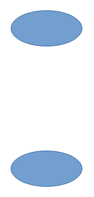
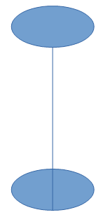
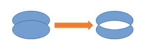
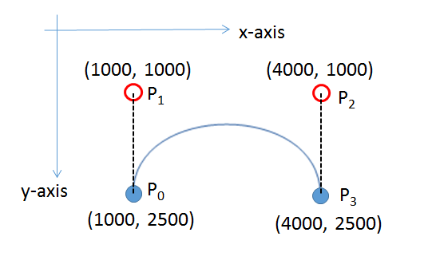
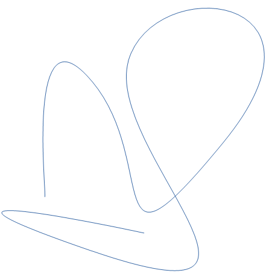

# Chapter 15. Complex Shapes

!!! note "Topics"
    Connecting Two
    Rectangles; Shape
    Composition (grouping,
    binding, and
    combining); Combining
    with Dispatches;
    Undoing Composition;
    Bezier Curves (simple
    and complex)

    Example folders: "Draw
    Tests" and "Utils"


This chapter looks at three complex topics involving
shapes: connecting rectangles, shape composition, and
drawing Bezier curves.


## 1.  Connecting Two Rectangles

A line can be drawn between two shapes using a
LineShape. But it's much easier to join the shapes with a
ConnectorShape, which can be attached precisely by
linking its two ends to glue points on the shapes. Glue points are the little blue circles
which appear on a shape when you use connectors in Draw. They occur in the middle
of the upper, lower, left, and right sides of the shape, although it's possible to create
extra ones.

By default a connector is drawn using multiple horizontal and vertical lines. It's
possible to change this to a curve, a single line, or a connection made up of multiple
lines which are mostly horizontal and vertical. Figure 1 shows the four types linking
the same two rectangles.


Figure 1. Different Styles of Connector.


Grouper.java contains code for generating the top-left example in Figure 1:

```java
// Grouper.java
public static void main (String args[])
{
  XComponentLoader loader = Lo.loadOffice();
  XComponent doc = Draw.createDrawDoc(loader);
  if (doc == null) {
    System.out.println("Draw doc creation failed");
    Lo.closeOffice();
    return;
  }

  GUI.setVisible(doc, true);
  Lo.delay(1000);    // need delay or zoom may not occur
  GUI.zoom(doc, GUI.ENTIRE_PAGE);

  XDrawPage currSlide = Draw.getSlide(doc, 0); //access first page

  System.out.println("\nConnecting rectangles ...");
  XNameContainer gStyles = Info.getStyleContainer(doc, "graphics");
  connectRectangles(currSlide, gStyles);

     : // code for grouping, binding, and combining shape,
     : // discussed later

  Lo.saveDoc(doc, "grouper.odg");
  Lo.closeDoc(doc);
  Lo.closeOffice();
}
```

The connectRectangles() function creates two labeled rectangles, and links them with
a standard connector. The connector starts on the bottom edge of the green rectangle
and finishes at the top edge of the blue one (as shown in the top-left of Figure 1). The
method also prints out some information about the glue points of the blue rectangle.

```java
// in Grouper.java
private static void connectRectangles(XDrawPage currSlide,
                                       XNameContainer gStyles)
{
  // dark green rectangle with shadow and text
  XShape greenRect = Draw.drawRectangle(currSlide,
                                          70, 180, 50, 25);
  Props.setProperty(greenRect, "FillColor",
             Lo.getColorInt(java.awt.Color.GREEN.darker()));
  Props.setProperty(greenRect, "Shadow", true);
  Draw.addText(greenRect, "Green Rect");

  // (blue, the default color) rectangle with shadow and text
  XShape blueRect = Draw.drawRectangle(currSlide,
                                         140, 220, 50, 25);
  Props.setProperty(blueRect, "Shadow", true);
  Draw.addText(blueRect, "Blue Rect");

  // connect the two rectangles; from the first shape to the second
  XShape connShape = Draw.addConnector(currSlide,
                          greenRect, Draw.CONNECT_BOTTOM,
                          blueRect, Draw.CONNECT_TOP);

  // Draw.setStyle(connShape, gStyles, "objectwitharrow");
  Props.setProperty(connShape, "LineWidth", 100);  // 1mm
  Props.setProperty(connShape, "FillColor", 7512015);// dark blue

  // report the glue points for the blue rectangle
  GluePoint2[] gps = Draw.getGluePoints(blueRect);
  if (gps != null) {
    System.out.println("Glue Points for blue rectangle");
    for(int i=0; i < gps.length; i++) {
      Point pos = gps[i].Position;
      System.out.println("  Glue point " + i + ": (" +
                                 pos.X + ", " + pos.Y + ")");
    }
  }
}  // end of connectRectangles()
```

Note that Draw.addText() is used to label the shapes.

Draw.addConnector() links the two rectangles based on glue point names supplied as
arguments. These names are defined in the Draw class:

```java
// in the Draw class
public static final int CONNECT_TOP = 0;
public static final int CONNECT_RIGHT = 1;
public static final int CONNECT_BOTTOM = 2;
public static final int CONNECT_LEFT = 3;
```

Draw.addConnector() creates a ConnectorShape object and sets several of its
properties. A simplified inheritance hierarchy for ConnectorShape is shown in Figure
2, with the parts important for connectors drawn in red.


Figure 2. The ConnectorShape Hierarchy.


Unlike many shapes, such as the RectangleShape, ConnectorShape doesn't have a
FillProperties class; instead it has ConnectorProperties (see lodoc
ConnectorProperties), which holds most of the properties used by
Draw.addConnector(). addConnector() is defined as:

```java
// in the Draw class
public static XShape addConnector(XDrawPage slide,
                        XShape shape1, int fromConnect,
                        XShape shape2, int toConnect)
{
  XShape xConnector = addShape(slide, "ConnectorShape", 0,0,0,0);

  XPropertySet props = Lo.qi(XPropertySet.class, xConnector);
  try {
    props.setPropertyValue("StartShape", shape1);
    props.setPropertyValue("StartGluePointIndex", fromConnect);

    props.setPropertyValue("EndShape", shape2);
    props.setPropertyValue("EndGluePointIndex", toConnect);

    props.setPropertyValue("EdgeKind", ConnectorType.STANDARD);
                        // STANDARD, CURVE, LINE, LINES
  }
  catch(Exception e)
  {  System.out.println("Could not connect the shapes");  }

  return xConnector;
}  // end of addConnectorShape()
```

Draw.addShape() is called with a (0,0) position, zero width and height. The real
position and dimensions of the connector are set via its properties. "StartShape" and
"StartGluePointIndex"  specify the starting shape and its glue point, and "EndShape"
and "EndGluePointIndex" define the ending shape and its glue point. "EdgeKind"
specifies one of the connection types from Figure 1.

Grouper.java's connectRectangles() has some code for retrieving an array of glue
points for a shape:

```java
// in connectRectangles() in Grouper.java
GluePoint2[] gps = Draw.getGluePoints(blueRect);
```

Draw.getGluePoints() converts the shape into an XGluePointsSupplier, and calls its
getGluePoints() method to retrieve an indexed container of GluePoint2 objects. To
simplify the access to the points data, this structure is returned as an array:

```java
public static GluePoint2[] getGluePoints(XShape shape)
{
  XGluePointsSupplier gpSupp =
               Lo.qi( XGluePointsSupplier.class, shape);
  XIndexContainer gluePts = gpSupp.getGluePoints();

  int numGPs = gluePts.getCount();  // should be 4 by default
  if (numGPs == 0) {
    System.out.println("No glue points for this shape");
    return null;
  }
  GluePoint2[] gps = new GluePoint2[numGPs];
  for(int i=0; i < numGPs; i++) {
    try {
      gps[i] = Lo.qi(GluePoint2.class, gluePts.getByIndex(i));
    }
    catch(com.sun.star.uno.Exception e)
    {  System.out.println("Could not access glue point " + i);  }
  }
  return gps;
}  // end of getGluePoints()
```

connectRectangles() doesn't do much with this data, aside from printing out each glue
points coordinate. They're specified in 1/100 mm units relative to the center of the
shape.

Figure 1 shows that connectors don't have arrows, but this can be remedied by
changing the connector's graphics style. The "graphics" style family is obtained by
Info.getStyleContainer(), and passed to connectRectangles():

```java
// in main() of Grouper.java
XNameContainer gStyles = Info.getStyleContainer(doc, "graphics");
connectRectangles(currSlide, gStyles);
```

Inside connectRectangles(), the connector's graphic style is changed to use arrows:

```java
// in connectRectangles() of Grouper.java
Draw.setStyle(connShape, gStyles, "objectwitharrow");
Props.setProperty(connShape, "LineWidth", 50);  // 0.5 mm
Props.setProperty(connShape, "FillColor", 7512015);// dark blue
```

The "objectwitharrow" style creates thick black arrows, with the head at the 'from' end
of the connector (i.e. pointing at the green rectangle in my example). The line width
can be adjusted by setting the shape's "LineWidth" property (which is defined in the
LineProperties class), and its color with "FillColor". However, the change to
"FillColor" has no effect for some reason, and so the arrow remains black, as shown
in Figure 3.


Figure 3. A Connector with an Arrow.


The arrow head is too big and extends too far over the shape. This can be modified by
changing the arrow name assigned to the connector's "LineStartName" property, and
by setting "LineStartCenter " to false. The place to find names for arrow heads is the
Line dialog box in LibreOffice's "Line and Filling" toolbar. The names appear in the
"Start styles" combobox, as shown in Figure 4.


Figure 4. The Arrow Styles in LibreOffice.


If the properties are set to:

```java
// in connectRectangles() of Grouper.java
Props.setProperty(connShape, "LineStartCenter", false);
Props.setProperty(connShape, "LineStartName", "Short line arrow");
```

then the arrow head changes to that shown in Figure 5.


Figure 5. A More Beautiful Arrow.


An arrow can be added to the other end of the connector by adjusting its
"LineEndCenter" and "LineEndName" properties.

I found out about these "objectwitharrow" style properties by listing its property set
returned by Info.getStyleProps():

```java
// in main() of Grouper.java
// print the "objectwitharrow" style in the "graphics" style family
Props.showObjProps("Objects with Arrow Graphics Style",
     Info.getStyleProps(doc, "graphics", "objectwitharrow"));
```

Alternatively, you can browse through the LineProperties class inherited by
ConnectorShape (shown in Figure 2; use `lodoc LineProperties`).

There's a drawback to calling Info.getStyleProps()  – it causes Office to crash when
the Grouper.java exits. Office doesn't leave behind a zombie process, but an error
message appears on-screen.


## 2.  Shape Composition

Office supports three kinds of shape composition for converting multiple shapes into a
single shape. The new shape is automatically added to the page, and the old shapes
are removed. The three techniques are:

1.  grouping: the shapes form a single shape without being changed in any way.
Office has two mechanisms for grouping: the ShapeGroup shape and the
deprecated XShapeGrouper interface;
2.  binding: this is similar to grouping, but also draws connector lines between the
original shapes;
3.  combining: the new shape is built by changing the original shapes if they
overlap each other. Office supports four combination styles, called merging,
subtraction, intersection, and combination (the default).

Grouper.java illustrates these techniques:

```java
// in main() of Grouper.java
//   :
Size slideSize = Draw.getSlideSize(currSlide);
int width = 40;
int height = 20;
int x = (slideSize.Width*3)/4 - width/2;
int y1 = 20;
int y2 = slideSize.Height/2 - (y1 + height);  // so separated
// int y2 = 30;     // so overlapping

// create two ellipses, s1 and s2
XShape s1 = Draw.drawEllipse(currSlide, x, y1, width, height);
XShape s2 = Draw.drawEllipse(currSlide, x, y2, width, height);

Draw.showShapesInfo(currSlide);

// group/bind/combine the ellipses
groupEllipses(currSlide, s1, s2);
// bindEllipses(currSlide, s1, s2);
// combineEllipses(currSlide, s1, s2);

Draw.showShapesInfo(currSlide);

// 2. combine some rectangles
XShape compShape = combineRects(doc, currSlide);
Draw.showShapesInfo(currSlide);
Lo.delay(2000);   // delay so user can see composition
  :
```

Two ellipses are created, and positioned at the top-right of the page.

Draw.showShapesInfo() is called to supply information about all the shapes on the
page:

```
Draw Page shapes:
  Shape service: com.sun.star.drawing.RectangleShape; z-order: 0
  Shape service: com.sun.star.drawing.RectangleShape; z-order: 1
  Shape service: com.sun.star.drawing.ConnectorShape; z-order: 2
  Shape service: com.sun.star.drawing.EllipseShape; z-order: 3
  Shape service: com.sun.star.drawing.EllipseShape; z-order: 4
```

The two rectangles and the connector listed first are the results of calling
connectRectangles() earlier in Grouper.java. The two ellipses were just created in the
code snipper given above.


### 2.1.  Grouping Shapes

Grouper.java calls groupEllipses() to group the two ellipses:

```java
// in Grouper.java
XShape s1 = Draw.drawEllipse(currSlide, x, y1, width, height);
XShape s2 = Draw.drawEllipse(currSlide, x, y2, width, height);
groupEllipses(currSlide, s1, s2);
```

groupElllipses() is:

```java
// in Grouper.java
private static void groupEllipses(XDrawPage currSlide,
                                       XShape s1, XShape s2)
{
  XShape shapeGroup = Draw.addShape(currSlide, "GroupShape",0,0,0,0);
  XShapes shapes = Lo.qi(XShapes.class, shapeGroup);
  shapes.add(s1);
  shapes.add(s2);
}  // end of groupEllipses()
```

The GroupShape is converted to an XShapes interface so the two ellipses can be
added to it. Note that GroupShape has no position or size; they are determined from
the added shapes.

An alternative approach for grouping is the deprecated XShapeGrouper, but it
requires a few more lines of coding. An example can be found in the Developer's
Guide, at
https://wiki.openoffice.org/wiki/Documentation/DevGuide/Drawings/Grouping,_Combining_and_Binding/
(use `loguide "Grouping, Combining and Binding"`).

The on-screen result of groupEllipses() is that the two ellipses become a single shape,
as poorly shown in Figure 6.




Figure 6. The Grouped Ellipses.


There's no noticeable difference from two ellipses until you click on one of them,
which causes both to be selected as a single shape.

The change is better shown by a second call to Draw.showShapesInfo(), which
reports:

```
Draw Page shapes:
  Shape service: com.sun.star.drawing.RectangleShape; z-order: 0
  Shape service: com.sun.star.drawing.RectangleShape; z-order: 1
  Shape service: com.sun.star.drawing.ConnectorShape; z-order: 2
  Shape service: com.sun.star.drawing.GroupShape; z-order: 3
```

The two ellipses have disappeared, replaced by a single GroupShape.


### 2.2.  Binding Shapes

Instead of groupEllipses(), it's possible to call bindEllipses() in Grouper.java:

```java
// in Grouper.java
XShape s1 = Draw.drawEllipse(currSlide, x, y1, width, height);
XShape s2 = Draw.drawEllipse(currSlide, x, y2, width, height);
bindEllipses(currSlide, s1, s2);
```

The function is defined as:

```java
// in Grouper.java
private static void bindEllipses(XDrawPage currSlide,
                                    XShape s1, XShape s2)
{
  XShapes shapes =  Lo.createInstanceMCF(XShapes.class,
                      "com.sun.star.drawing.ShapeCollection");
  shapes.add(s1);
  shapes.add(s2);
  XShapeBinder binder = Lo.qi(XShapeBinder.class, currSlide);
  binder.bind(shapes);
}  // end of bindEllipses()
```

An empty XShapes shape is created, then filled with the component shapes. The
shapes inside XShapes are converted into a single object XShapeBinder.bind().

The result is like the grouped ellipses but with a connector linking the shapes, as in
Figure 7.




Figure 7. The Bound Ellipses.


The result is also visible in a call to Draw.showShapesInfo():

```
Draw Page shapes:
  Shape service: com.sun.star.drawing.RectangleShape; z-order: 0
  Shape service: com.sun.star.drawing.RectangleShape; z-order: 1
  Shape service: com.sun.star.drawing.ConnectorShape; z-order: 2
  Shape service: com.sun.star.drawing.ClosedBezierShape; z-order: 3
```

The two ellipses have been replaced by a closed Bezier shape.

In my opinion, it's easier to link shapes explicitly with connectors, using code like that
in connectRectangles() from section 1. If the result needs to be a single shape, then
grouping (not binding) can be applied to the shapes and the connector.


### 2.3.  Combining Shapes with XShapeCombiner

Grouper.java calls combineEllipse() to combine the two ellipses:

```java
// in Grouper.java
XShape s1 = Draw.drawEllipse(currSlide, x, y1, width, height);
XShape s2 = Draw.drawEllipse(currSlide, x, y2, width, height);
combineEllipses(currSlide, s1, s2);
```

combineEllipses() employs the XShapeCombiner interface, which is used in the same
way as XShapeBinder:

```java
// in Grouper.java
private static void combineEllipses(XDrawPage currSlide,
                                      XShape s1, XShape s2)
{
  XShapes shapes =  Lo.createInstanceMCF(XShapes.class,
                          "com.sun.star.drawing.ShapeCollection");
  shapes.add(s1);
  shapes.add(s2);
  XShapeCombiner combiner = Lo.qi(XShapeCombiner.class, currSlide);
  combiner.combine(shapes);
}  // end of combineEllipses()
```

The combined shape only differs from grouping if the two ellipses are initially
overlapping. Figure 8 shows that the interesecting areas of the two shapes is removed
from the combination.




Figure 8. Combining Shapes with  XShapeCombiner.


The result is also visible in a call to Draw.showShapesInfo():

```
Draw Page shapes:
  Shape service: com.sun.star.drawing.RectangleShape; z-order: 0
  Shape service: com.sun.star.drawing.RectangleShape; z-order: 1
  Shape service: com.sun.star.drawing.ConnectorShape; z-order: 2
  Shape service: com.sun.star.drawing.ClosedBezierShape; z-order: 3
```

The two ellipses have again been replaced by a closed Bezier shape .


### 2.4.  Richer Shape Combination by Dispatch

The drawback of XShapeCombiner that it only supports combination, not merging,
subtraction, or intersection. I had to implement those effects by using dispatches, as
shown in combineRects() in Grouper.java:

```java
// in Grouper.java
private static XShape combineRects(XComponent doc,
                                     XDrawPage currSlide)
{
  System.out.println("\nCombining rectangles ...");
  XShape r1 = Draw.drawRectangle(currSlide, 50, 20, 40, 20);
  XShape r2 = Draw.drawRectangle(currSlide, 70, 25, 40, 20);

  XShapes shapes =  Lo.createInstanceMCF(XShapes.class,
                          "com.sun.star.drawing.ShapeCollection");
  shapes.add(r1);
  shapes.add(r2);
  return Draw.combineShape(doc, shapes, Draw.COMBINE);
       // Draw.MERGE, Draw.SUBTRACT, Draw.INTERSECT, Draw.COMBINE
}  // end of combineRects()
```

The dispatching is performed by Draw.combineShape(), which is passed an array of
XShapes and a constant representing one of the four combining techniques.

Figure 9 shows the results when the two rectangles created in combineRects() are
combined in the different ways.


Figure 9. The Four Ways of Combining Shapes.


The merging change in Figure 9 is a bit subtle – notice that there's no black outline
between the rectangles after merging; the merged object is a single shape.

When combineRects() returns, Draw.showShapesInfo() reports:

```
Draw Page shapes:
  Shape service: com.sun.star.drawing.RectangleShape; z-order: 0
  Shape service: com.sun.star.drawing.RectangleShape; z-order: 1
  Shape service: com.sun.star.drawing.ConnectorShape; z-order: 2
  Shape service: com.sun.star.drawing.ClosedBezierShape; z-order: 3
  Shape service: com.sun.star.drawing.PolyPolygonShape; z-order: 4
```

The combined shape is a PolyPolygonShape, which means that the shape is created
from multiple polygons.

One tricky aspect of combining shapes with dispatches is that the shapes must be
selected prior to the dispatch being sent. After the dispatch has been processed, the
selection will have been changed to contain only the single new shape. This approach
is implemented in combineShape():

```java
public static XShape combineShape(XComponent doc,
                              XShapes shapes, int combineOp)
{
  // select the shapes for the dispatch to apply to
  XSelectionSupplier selSupp =  Lo.qi(XSelectionSupplier.class,
                                   GUI.getCurrentController(doc));
  selSupp.select(shapes);

  if (combineOp == MERGE)
    Lo.dispatchCmd("Merge");
  else if (combineOp == INTERSECT)
    Lo.dispatchCmd("Intersect");
  else if (combineOp == SUBTRACT)
    Lo.dispatchCmd("Substract");   // misspelt!
  else if (combineOp == COMBINE)
    Lo.dispatchCmd("Combine");
  else {
     System.out.println("Did not recognize op: " +
                               combineOp + "; using merge");
     Lo.dispatchCmd("Merge");
  }
  Lo.delay(500);   // give time for dispatch to be processed

  // extract the new single shape from the modified selection
  XShapes xs = Lo.qi(XShapes.class, selSupp.getSelection());
  XShape combinedShape = null;
  try {
    combinedShape = Lo.qi(XShape.class, xs.getByIndex(0));
  }
  catch(com.sun.star.uno.Exception e)
  {  System.out.println("Could not get combined shape");  }

  return combinedShape;
}  // end of combineShape()
```

The shapes are selected by adding them to an XSelectionSupplier. The requested
dispatch is sent to the selection, and then the function briefly sleeps to ensure that the
dispatch has been processed. An XShapes object is obtained from the changed
selection, and the new PolyPolygonShape is extracted and returned.


## 3.  Undoing a Grouping/Binding/Combining

Any shapes which have been grouped, bound, or combined can be ungrouped,
unbound, or uncombined. On screen the separated shapes will look the same as
before, but may not have the same shape types as the originals.

The main() function of Grouper.java shows how the combination of the two
rectangles can be undone:

```java
// in Grouper.java
    :
XShape compShape = combineRects(doc, currSlide);
    :
XShapeCombiner combiner = Lo.qi(XShapeCombiner.class, currSlide);
combiner.split(compShape);  // split the rectangles
Draw.showShapesInfo(currSlide);
```

The combined rectangles shape is passed to XShapeCombiner.split() which removes
the combined shape from the slide, replacing it by its components.
Draw.showShapesInfo() shows this result:

```
Draw Page shapes:
  Shape service: com.sun.star.drawing.RectangleShape; z-order: 0
  Shape service: com.sun.star.drawing.RectangleShape; z-order: 1
  Shape service: com.sun.star.drawing.ConnectorShape; z-order: 2
  Shape service: com.sun.star.drawing.ClosedBezierShape; z-order: 3
  Shape service: com.sun.star.drawing.PolyPolygonShape; z-order: 4
  Shape service: com.sun.star.drawing.PolyPolygonShape; z-order: 5
```

The last two shapes listed are the separated rectangles, but represented now by two
PolyPolygonShapes.

XShapeCombiner.split() only works on shapes that were combined using a
"COMBINE" dispatch. Shapes that were composed using merging, subtraction, or
intersection, can not be separated.

For grouped and bound shapes, the methods for breaking apart a shape are
XShapeGrouper.ungroup() and XShapeBinder.unbind(). For example:

```java
XShapeGrouper grouper = Lo.qi(XShapeGrouper.class, currSlide);
grouper.ungroup(compShape);
```


## 4.  Bezier Curves

The simplest Bezier curve is defined using four coordinates, as in Figure 10.




Figure 10. A Cubic Bezier Curve.


P0 and P3 are the start and end points of the curve (also called nodes or anchors), and
P1 and P2 are control points, which specify how the curve bends between the start
and finish. A curve using four points in this way is a cubic Bezier curve, the default
type in Office.

The code for generating Figure 10 is in drawCurve() in BezierBuilder.java:

```java
// in drawCurve() in BezierBuilder.java
private static XShape drawCurve(XDrawPage currSlide)
{
  Point[] pathPts = new Point[4];
  PolygonFlags[] pathFlags = new PolygonFlags[4];

  pathPts[0] = new Point(1000, 2500);
  pathFlags[0] = PolygonFlags.NORMAL;

  pathPts[1] = new Point(1000,1000);    // control point
  pathFlags[1] = PolygonFlags.CONTROL;

  pathPts[2] = new Point(4000,1000);    // control point
  pathFlags[2] = PolygonFlags.CONTROL;

  pathPts[3] = new Point(4000,2500);
  pathFlags[3] = PolygonFlags.NORMAL;

  return Draw.drawBezier(currSlide, pathPts, pathFlags, true);
}  // end of drawCurve()
```

Most of the curve generation is done by Draw.drawBezier(), but the programmer must
still define two arrays and a boolean. The pathPts[] array holds the four coordinates,
and pathFlags[] specify their types. The final boolean argument of Draw.drawBezier()
indicates whether the generated curve is to be open or closed.

Figure 11 shows how the curve is rendered.


Figure 11. The Drawn Bezier Curve.


Draw.drawBezier() uses the isOpen boolean to decide whether to create an
OpenBezierShape or a ClosedBezierShape. Then it fills a PolyPolygonBezierCoords
data structure with the coordinates and flags before assigning the structure to the
shape's "PolyPolygonBezier" property:

```java
public static XShape drawBezier(XDrawPage slide,
              Point[] pts, PolygonFlags[] flags, boolean isOpen)
{
  if (pts.length != flags.length) {
    System.out.println("Mismatch in lengths of
                                   points and flags array");
    return null;
  }

  String bezierType = isOpen ? "OpenBezierShape" :
                               "ClosedBezierShape";
  XShape bezierPoly = addShape(slide, bezierType, 0, 0, 0, 0);

  // create space for one Bezier shape
  PolyPolygonBezierCoords aCoords = new PolyPolygonBezierCoords();
              // for shapes formed by one *or more* Bezier polygons
  aCoords.Coordinates = new Point[1][];
  aCoords.Flags = new PolygonFlags[1][];
  aCoords.Coordinates[0] = pts;
  aCoords.Flags[0] = flags;

  Props.setProperty(bezierPoly, "PolyPolygonBezier", aCoords);
  return bezierPoly;
}  // end of drawBezier()
```

A PolyPolygonBezierCoords object can store multiple Bezier curves, but
Draw.drawBezier() only assigns one curve to it. Each curve is defined by an array of
coordinates and a set of flags.


### 4.1.  Drawing a Simple Bezier

The hard part of writing drawCurve() in BezierBuilder.java is knowing what
coordinates to put into pathPts[]. Probably the 'easiest' solution is to use a SVG editor
to draw the curve by hand, and then extract the coordinates from the generated file.

As the quotes around 'easiest' suggest, this isn't actually that easy since a curve can be
much more complex than my example. A real example may be composed from
multiple curves, straight lines, quadratic Bezier sub-curves (i.e. ones which use only a
single control point between anchors), arcs, and smoothing. The official specification
can be found at https://w3.org/TR/SVG/paths.html, and there are many tutorials
on the topic, such as https://svgbasics.com/curves.html and
https://w3schools.com/svg/svg_path.asp.

Even if you're careful and only draw curves like mine, the generated SVG is not quite
the same as the coordinates used by Office's PolyPolygonBezierCoords. However, the
translation is fairly straightforward, once you've done one or two.

One good online site for drawing simple curves is
https://blogs.sitepointstatic.com/examples/tech/svg-curves/cubic-curve.html,
developed by Craig Buckler. It restricts you to manipulating a curve made up of two
anchors and two controls, like mine, and displays the corresponding SVG path data,
as in Figure 12.


Figure 11. Drawing a Curve Online.


Figure 12 is a bit small – the path data at the top-right is:
<path d="M100,250 C100,100 400,100 400,250" />
The path contains two operations: "M" and "C". "M" moves the drawing point to a
specified coordinate (in this case (100, 250)). The "C" is followed by three
coordinates: (100,100),  (400, 100), and (400, 250). The first two are the control
points and the last is the end point of the curve. There's no start point since the result
of the "M" operation is used by default.

Translating this to Office coordinates means using the "M" coordinate as the start
point, and applying some scaling of the values to make the curve visible on the page.
Remember that Office uses 1/100 mm units for drawing. A simple scale factor is to
multiply all the numbers by 10, producing: (1000, 2500), (1000,1000),  (4000, 1000),
and (4000, 2500). These are the numbers in Figure 10, and utilized by drawCurve() in
BezierBuilder.java.


### 4.2.  Drawing a Complicated Bezier Curve

What if you want to draw a curve of more than four points? I use Office's Draw
application to draw the curve manually, save it as an SVG file, and then extract the
path coordinates from that file.

I use Draw because it generates path coordinates using 1/100 mm units, which saves
me from having to do any scaling.

You might be thinking that if Draw can generate SVG data then why not just import
that data as a Bezier curve into the code? Unfortunately, this isn't quite possible at
present – it's true that you can import an SVG file into Office, but it's stored as an
image. In particular, it's available as a GraphicObjectShape not a OpenBezierShape or
a ClosedBezierShape. This means that you cannot examine or change its points.

As an example of my approach, consider the complex curve in Figure 13 which I
drew in Draw and exported as an SVG file.


Figure 13. A Complex Bezier Curve, manually produced in Draw.


Details on how to draw Bezier curves are explained in the Draw user guide, at the end
of section 11 on advanced techniques.

The SVG file format is XML-based, so the saved file can be opened by a text editor.

The coordinate information for this OpenBezierShape is near the end of the file:

```
<g class="com.sun.star.drawing.OpenBezierShape">
  <g id="id3">
    <path fill="none" stroke="rgb(0,0,0)" d="M 5586,13954 C
5713,13954 4443,2905 8253,7477 12063,12049 8634,19415 15619,10906
22604,2397 11682,1381 10285,6334 8888,11287 21207,21447 8253,17002 -
4701,12557 11174,15986 11174,15986"/>
  </g>
</g>
```

The path consists of a single "M" operation, and a long "C" operation, which should
be read as a series of cubic Bezier curves. Each curve in the "C" list is made from
three coordinates, since the start point is implicitly given by the initial "M" move or
the end point of the previous curve in the list.

Copy the data and save it as two lines in a text file (e.g. in bpts2.txt):

```java
M 5586,13954

C 5713,13954 4443,2905 8253,7477 12063,12049 8634,19415 15619,10906
22604,2397 11682,1381 10285,6334 8888,11287 21207,21447 8253,17002 -
4701,12557 11174,15986 11174,15986
```

BuildBezier.java contains some functions for reading in this data and building the
arrays required by Draw.drawBezier(). So when the following is called:

```java
run BezierBuilder bpts2.txt
```

the curve shown in Figure 14 appears on a page.




Figure 14. The Curve Drawn by BuildBezier.java

The BuildBezier.java data-reading functions can only handle a single "M" and "C"
operation. If the curve you draw has straight lines, arcs, smoothing, or multiple parts,
then the SVG file will contain operations that my code cannot process.

However, the data-reading functions do recognize the "Z" operation, which specifies
that the curve should be closed. If "Z" is added as a new line at the end of the
bpts2.txt, then the closed Bezier curve in Figure 15 is generated.


Figure 15. The Closed Curve Drawn by BuildBezier.java