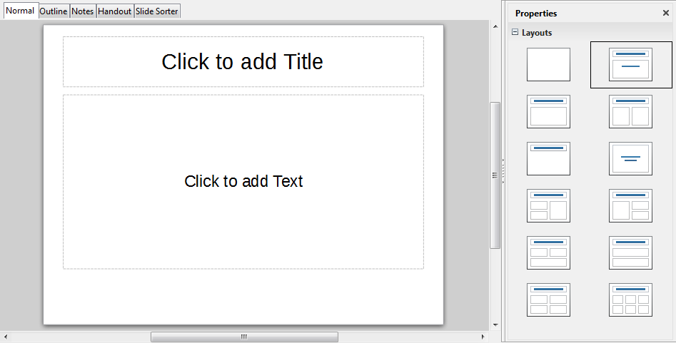
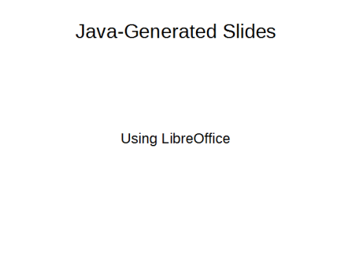
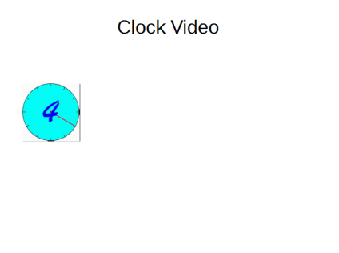
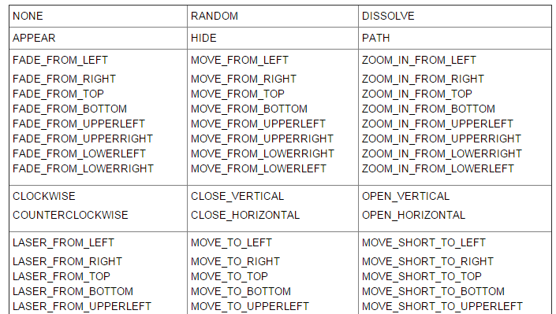
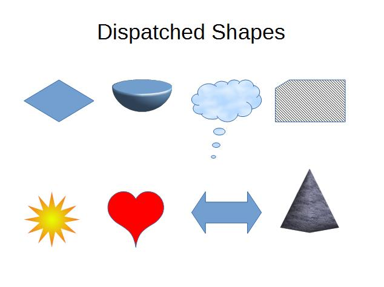
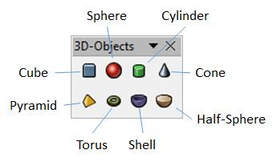
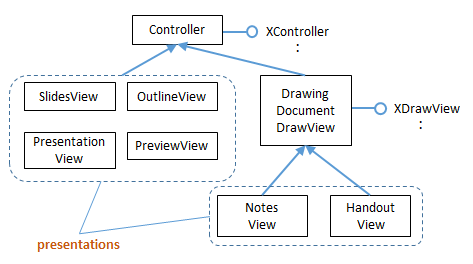

# Chapter 16. Making Slides

!!! note "Topics"
    Creating Slides:
    title, subtitle, bullets,
    images, video, buttons;
    Shape Animations;
    Dispatch Shapes (special
    symbols, block arrows,
    3D shapes, flowchart
    elements, callouts, and
    stars); Slide Viewing

    Example folders: "Draw
    Tests" and "Utils"


The MakeSlides.java example creates a deck of five slides,
illustrating different aspects of slide generation:

* Slide 1. A slide combining a title and subtitle (see
Figure 3);
* Slide 2. A slide with a title, bullet points, and an image
(see Figure 4);
* Slide 3. A slide with a title, and an embedded video
which plays automatically when that slide appears during a slide show (see Figure
6);
* Slide 4. A slide with an ellipse and a rounded rectangle acting as buttons. During a
slide show, clicking on the ellipse starts a video playing in an external viewer.
Clicking on the rounded rectangle causes the slide show to jump to the first slide
in the deck (see Figure 7);
* Slide 5. This slide contains eight shapes generated using dispatches, including
special symbols, block arrows, 3D shapes, flowchart elements, callouts, and stars
(see Figure 9).

MakeSlides.java creates a slide deck, adds the five slides to it, and finishes by saving
the presentation in "makeslides.odp":

```java
public static void main (String args[])
{
  XComponentLoader loader = Lo.loadOffice();
  XComponent doc = Draw.createImpressDoc(loader);  // Impress doc
  if (doc == null) {
    System.out.println("Impress doc creation failed");
    Lo.closeOffice();
    return;
  }

  // first slide: title + subtitle
  XDrawPage currSlide = Draw.getSlide(doc, 0);
  Draw.showShapesInfo(currSlide);
  Draw.titleSlide(currSlide, "Java-Generated Slides",
                                      "Using LibreOffice");
  Draw.showShapesInfo(currSlide);

  // second slide (bullets and image)
  currSlide = Draw.addSlide(doc);
  doBullets(currSlide);

  // third slide: title and video
  currSlide = Draw.addSlide(doc);
  Draw.titleOnlySlide(currSlide, "Clock Video");
  Draw.drawMedia(currSlide, "clock.avi", 20, 70, 50, 50);

  // fourth slide: buttons
  currSlide = Draw.addSlide(doc);
  buttonShapes(currSlide);

  // fifth slide: shapes created with dispatches
  dispatchShapes(doc);

  System.out.println("Total no. of slides: " +
                              Draw.getSlidesCount(doc));
  Lo.saveDoc(doc, "makeslides.odp");
  Lo.closeDoc(doc);
  Lo.closeOffice();
} // end of main()
```

The five slides are explained in the following sections.


## 1.  The First Slide (Title and Subtitle)

Draw.createImpressDoc() calls Lo.createDoc(), supplying it with the Impress
document string type:

```java
// in the Draw class
public static XComponent createImpressDoc(XComponentLoader loader)
{  return Lo.createDoc("simpress", loader);  }
```

This creates a new slide deck with one slide whose layout depends on Impress' default
settings. Figure 1 shows the usual layout when a user starts Impress.




Figure 1. The Default New Slide in Impress.


The slide contains two empty presentation shapes – the text rectangle at the top is a
TitleTextShape, and the larger rectangle below is a SubTitleShape.

This first slide, which is at index position 0 in the deck, can be referred to by calling
Draw.getSlide():

```java
XDrawPage currSlide = Draw.getSlide(doc, 0);
```

This is the same method used to get the first page in a Draw document, so I won't go
through it again. The XDrawPage object can be examined by calling
Draw.showShapesInfo() which lists all the shapes (both draw and presentation ones)
on the slide:

```java
// in Draw
public static void showShapesInfo(XDrawPage dp)
{
  System.out.println("Draw Page shapes:");
  ArrayList<XShape> shapes = getShapes(dp);
  if (shapes != null) {
    for(XShape shape : shapes)
      showShapeInfo(shape);
  }
}  // end of showShapesInfo()


public static void showShapeInfo(XShape xShape)
{ System.out.println("  Shape service: " + xShape.getShapeType() +
                     "; z-order: " + getZOrder(xShape));
}  // end of showShapeInfo()

public static int getZOrder(XShape shape)
{  return (Integer) Props.getProperty(shape, "ZOrder");  }
```

Draw.showShapesInfo() output for the first slide is:

```
Draw Page shapes:
  Shape service: com.sun.star.presentation.TitleTextShape; z-order: 0
  Shape service: com.sun.star.presentation.SubtitleShape; z-order: 1
```

Obviously, the default layout sometimes isn't the one we want. One solution would be
to delete the unnecessary shapes on the slide, then add the shapes that we do want. A
better approach is the programming equivalent of selecting a different slide layout.

This is implemented as several Draw methods, called titleSlide(), bulletsSlide(),
titleOnlySlide(), and blankSlide(), which change the slide's layout to those shown in
Figure 2.


Figure 2. Slide Layout Methods.


A title/subtitle layout is used for the first slide by calling:

```java
Draw.titleSlide(currSlide, "Java-Generated Slides",
                                       "Using LibreOffice");
```

It generates the slide shown in Figure 3.




Figure 3. The Title and Subtitle Slide.


Having a Draw.titleSlide() method may seem a bit silly since we've seen that the first
slide already uses this layout (e.g. in Figure 1). That's true for my Impress setup, but
may not be the case for other installations with different configurations.

The other layouts shown on the right of Figure 1 could also be implemented as Draw
methods, but the four in Figure 2 seem most useful. They set the "Layout" property in
the DrawPage service in the com.sun.star.presentation module (not the one in the
drawing module).

The documentation for DrawPage (use lodoc DrawPage presentation service)
only says that "Layout" stores a short; it doesn't list the possible values or how they
correspond to layouts. However, there is a list at the excellent Japanese Office
website,  http://openoffice3.web.fc2.com/OOoBasic_Impress.html#OOoIPLy01a,
which I used as the basis of the layout constants in my Draw class:

```java
// in Draw
public static final int LAYOUT_TITLE_SUB = 0;
            // title, and subtitle below (the default, usually)

public static final int LAYOUT_TITLE_BULLETS = 1;
           // the usual one you want

public static final int LAYOUT_TITLE_CHART = 2;
public static final int LAYOUT_TITLE_2CONTENT = 3;
                   // 2 boxes: 1x2  (row x column), 1 row
public static final int LAYOUT_TITLE_CONTENT_CHART = 4;
public static final int LAYOUT_TITLE_CONTENT_CLIP = 6;
public static final int LAYOUT_TITLE_CHART_CONTENT = 7;
public static final int LAYOUT_TITLE_TABLE = 8;
public static final int LAYOUT_TITLE_CLIP_CONTENT = 9;
public static final int LAYOUT_TITLE_CONTENT_OBJECT = 10;

public static final int LAYOUT_TITLE_OBJECT = 11;
public static final int LAYOUT_TITLE_CONTENT_2CONTENT = 12;
            // 3 boxes in 2 columns: 1 in first col, 2 in second
public static final int LAYOUT_TITLE_OBJECT_CONTENT = 13;
public static final int LAYOUT_TITLE_CONTENT_OVER_CONTENT = 14;
            // 2 boxes: 2x1, 1 column
public static final int LAYOUT_TITLE_2CONTENT_CONTENT = 15;
            // 3 boxes in 2 columns: 2 in first col, 1 in second
public static final int LAYOUT_TITLE_2CONTENT_OVER_CONTENT = 16;
            // 3 boxes on 2 rows: 2 on first row, 1 on second
public static final int LAYOUT_TITLE_CONTENT_OVER_OBJECT = 17;
public static final int LAYOUT_TITLE_4OBJECT = 18;  // 4 boxes: 2x2

public static final int LAYOUT_TITLE_ONLY = 19;
            // title only; no body shape
public static final int LAYOUT_BLANK = 20;

public static final int LAYOUT_VTITLE_VTEXT_CHART = 27;
       // vertical title, vertical text, and chart
public static final int LAYOUT_VTITLE_VTEXT = 28;
public static final int LAYOUT_TITLE_VTEXT = 29;
public static final int LAYOUT_TITLE_VTEXT_CLIP = 30;

public static final int LAYOUT_CENTERED_TEXT = 32;

public static final int LAYOUT_TITLE_4CONTENT = 33; // 4 boxes: 2x2
public static final int LAYOUT_TITLE_6CONTENT = 34; // 6 boxes: 2x3
```

The four constants highlighted above are used by the Draw methods described next.

Draw.titleSlide() starts by setting the slide's "Layout" property to
LAYOUT_TITLE_SUB:

```java
// in Draw
public static void titleSlide(XDrawPage currSlide,
                              String title, String subTitle)
{
  Props.setProperty(currSlide, "Layout", LAYOUT_TITLE_SUB);
                                 // title and subtitle

  // add the title text to the title shape
  XShape xs = Draw.findShapeByType(currSlide, Draw.TITLE_TEXT);
  XText textField = Lo.qi(XText.class, xs);
  textField.setString(title);

  // add the subtitle text to the subtitle shape
  xs = Draw.findShapeByType(currSlide, Draw.SUBTITLE_TEXT);
  textField = Lo.qi(XText.class, xs);
  textField.setString(subTitle);
}  // end of titleSlide()
```

This changes the slide's layout to an empty TitleTextShape and SubtitleShape. The
functions adds title and subtitle strings to these shapes, and returns. The tricky part  is
obtaining a reference to a particular shape so it can be modified.

One (bad) solution is to use the index ordering of the shapes on the slide, which is
displayed by Draw.showShapesInfo(). It turns out that TitleTextShape is first (i.e. at
index 0), and SubtitleShape second. This can be used to write the following code:

```java
XShapes xShapes = Lo.qi(XShapes.class, currSlide);

XShape titleShape = Lo.qi(XShape.class, xShapes.getByIndex(0));
XShape subTitleShape = Lo.qi(XShape.class, xShapes.getByIndex(1));
```

This is a bit hacky, so I coded Draw.findShapeByType() instead, which searches for a
shape based on its type:

```java
// in Draw
public static XShape findShapeByType(XDrawPage slide,
                                     String shapeType)
{ ArrayList<XShape> shapes = getShapes(slide);
  if (shapes == null) {
    System.out.println("No shapes were found in the draw page");
    return null;
  }
  for (XShape shape : shapes) {
    if (shapeType.equals(shape.getShapeType()))
      return shape;
  }
  System.out.println("No shape found of type \"" +
                                        shapeType + "\"");
  return null;
}  // end of findShapeByType()
```

I added constants to the Draw class so the programmer wouldn't have to remember
long shape type names:

```java
// in Draw
public static final String TITLE_TEXT =
                   "com.sun.star.presentation.TitleTextShape";
public static final String SUBTITLE_TEXT =
                   "com.sun.star.presentation.SubtitleShape";
public static final String BULLETS_TEXT =
```
                   "com.sun.star.presentation.OutlinerShape";

This allows me to find the title shape by calling:

```java
XShape xs = Draw.findShapeByType(currSlide, Draw.TITLE_TEXT);
```


## 2.  The Second Slide (Title, Bullets, and Image)

The second slide uses a title and bullet points layout, with an image added at the
bottom right corner. The relevant lines in MakeSlides.java are:

```java
// in main() in MakeSlides.java...
currSlide = Draw.addSlide(doc);
doBullets(currSlide);
```

The result is shown in Figure 4.


Figure 4. A Slide with a Title, Bullet Points, and an Image.


The slide is created by doBullets() in MakeSlides.java:

```java
// in MakeSlides.java
private static void doBullets(XDrawPage currSlide)
{
  XText body = Draw.bulletsSlide(currSlide,
                                 "What is an Algorithm?");

  // bullet levels are 0, 1, 2,...

  Draw.addBullet(body, 0, "An algorithm is a finite
                          set of unambiguous instructions
                          for solving a problem.");
  Draw.addBullet(body, 1, "An algorithm is correct if on
                          all legitimate inputs, it outputs
                          the right answer in a finite amount
                          of time");
  Draw.addBullet(body, 0, "Can be expressed as");
  Draw.addBullet(body, 1, "pseudocode");
  Draw.addBullet(body, 1, "flow charts");
  Draw.addBullet(body, 1, "text in a natural language
                                          (e.g. English)");
  Draw.addBullet(body, 1, "computer code");

  // add the image
  XShape im = Draw.drawImageOffset(currSlide, "skinner.png",
                                               0.6, 0.5);
            // in bottom right corner, and scaled if necessary
  Draw.moveToBottom(currSlide, im);  //move pic below slide text
}  // end of doBullets()
```

Draw.bulletsSlide() works in a similar way to Draw.titleSlide() – first the slide's
layout is set, then the presentation shapes are found and modified:

```java
// in Draw
public static XText bulletsSlide(XDrawPage currSlide, String title)
{
  Props.setProperty(currSlide, "Layout", LAYOUT_TITLE_BULLETS);

  // add the title text to the title shape
  XShape xs = Draw.findShapeByType(currSlide, Draw.TITLE_TEXT);
  XText textField = Lo.qi(XText.class, xs);
  textField.setString(title);

  // return a reference to the bullet text area
  xs = Draw.findShapeByType(currSlide, Draw.BULLETS_TEXT);
  return Lo.qi(XText.class, xs);
}  // end of bulletsSlide()
```

The `Draw.LAYOUT_TITLE_BULLETS` constant changes the slide's layout to contain
two presentation shapes – a TitleTextShape at the top, and an OutlinerShape beneath
it (as in the second picture in Figure 2). Draw.bulletsSlide() calls
Draw.findShapeByType() twice to find these shapes, but it does nothing to the
OutlinerShape itself, returning it as an XText reference. This allows text to be inserted
into the shape by other code (i.e. by Draw.addBullet()).


### 2.1.  Adding Bullets to a Text Area

Draw.addBullet() converts the shape's XText reference into an XTextRange, which
offers a setString() method:

```java
  public static void addBullet(XText bullsText, int level,
                                                     String text)
  { // access the end of the bullets text
    XTextRange tr = Lo.qi(XTextRange.class,bullsText).getEnd();

    // set the bullet's level
    Props.setProperty(tr, "NumberingLevel",(short)level);

    tr.setString(text + "\n");  // add the text
  }  // end of addBullet()
```

As explained in Chapter 5, XTextRange is part of the TextRange service which
inherits both paragraph and character property classes, as indicated by Figure 5.


Figure 5. The TextRange Service.


A look through the ParagraphProperties documentation reveals a "NumberingLevel"
property which affects the displayed bullet level (use lodoc ParagraphProperties).

Another way of finding out about the properties associated with XTextRange is to use
my Props.showObjProps() to list all of them:

```java
Props.showObjProps("TextRange in OutlinerShape", tr);
```

The bullet text is added with XTextRange.setString(). A newline is added to the text
before the set, to ensure that the string is treated as a complete paragraph. The
drawback is that the newline causes an extra bullet symbol to be drawn after the real
bullet points. This can be seen in Figure 4, at the bottom of the slide. (Principal
Skinner is pointing at it.)


### 2.2.  Offsetting an Image

The AnimBicycle.java example in Chapter 14 employed a version of
Draw.drawImage() based around specifying an (x, y) position on the page and a width
and height for the image frame. Draw.drawImageOffset() used here is a variant which
specifies its position in terms of fractional offsets from the top-left corner of the slide.

For example:

```java
XShape im = Draw.drawImageOffset(currSlide, "skinner.png", 0.6, 0.5);
```

The last two arguments mean that the image's top-left corner will be placed at a point
that is 0.6 of the slide's width across and 0.5 of its height down. drawImageOffset()
also scales the image so that it doesn't extend beyond the right and bottom edges of
the slide. The scaling is the same along both dimensions so the picture isn't distorted.

The code for Draw.drawImageOffset():

```java
// in Draw
public static XShape drawImageOffset(XDrawPage slide,
                String imFnm, double xOffset, double yOffset)
{
  if ((xOffset < 0) || (xOffset >= 1)) {
    System.out.println("xOffset should be between 0-1; using 0.5");
    xOffset = 0.5;
  }
  if ((yOffset < 0) || (yOffset >= 1)) {
    System.out.println("yOffset should be between 0-1; using 0.5");
    yOffset = 0.5;
  }

  Size slideSize = Draw.getSlideSize(slide);  // in mm units
  if (slideSize == null) {
    System.out.println("Image drawing cannot proceed");
    return null;
  }
  int x = (int)Math.round(slideSize.Width * xOffset); //in mm units
  int y = (int)Math.round(slideSize.Height * yOffset);

  int maxWidth = slideSize.Width - x;
  int maxHeight = slideSize.Height - y;
  Size imSize = Images.calcScale(imFnm, maxWidth, maxHeight);

  return drawImage(slide, imFnm, x, y,
                         imSize.Width, imSize.Height);
}  // end of drawImageOffset()
```

drawImageOffset()  uses the slide's size to determine an (x, y) position for the image,
and its width and height. Images.calcScale() calculates the best width and height for
the image frame such that the image will be drawn entirely on the slide:

```java
// in the Images class
public static Size calcScale(String fnm, int maxWidth,
                                             int maxHeight)
{ Size imSize = Images.getSize100mm(fnm);   // in 1/100 mm units
  if (imSize == null)
    return null;

  // calculate the scale factors to obtain these maximums
  double widthScale = ((double)maxWidth*100)/imSize.Width;
  double heightScale = ((double)maxHeight*100)/imSize.Height;

  // use the smallest scale factor
  double scaleFactor = (widthScale < heightScale) ?
                                      widthScale : heightScale;
  // calculate new dimensions for the image
  int w = (int)Math.round(imSize.Width * scaleFactor/100);
  int h = (int)Math.round(imSize.Height * scaleFactor/100);
  return new Size(w, h);
}  // end of calcScale()
```

calcScale() uses Images.getSize100mm() to retrieve the size of the image in 1/100
mm units, and then a scale factor is calculated for both the width and height. This is
used to set the image frame's dimensions when the graphic is loaded by drawImage().


## 3.  The Third Slide (Title and Video)

The third slide consists of a title shape and a video frame, which looks like Figure 6.




Figure 6. A Slide Containing a Video Frame.


When this slide appears in a slide show, the video will automatically start playing.

The code for generating this slide is:

```java
// main() of MakeSlides.java...
currSlide = Draw.addSlide(doc);
Draw.titleOnlySlide(currSlide, "Clock Video");
Draw.drawMedia(currSlide, "clock.avi", 20, 70, 50, 50);
```

Draw.titleOnlySlide()  works in a similar way to titleSlide() and bulletsSlide():

```java
// in Draw
public static void titleOnlySlide(XDrawPage currSlide, String header)
{
  Props.setProperty(currSlide, "Layout", LAYOUT_TITLE_ONLY);
                                  // title only; no body shape
  // add the text to the title shape
  XShape xs = Draw.findShapeByType(currSlide, Draw.TITLE_TEXT);
  XText textField = Lo.qi(XText.class, xs);
  textField.setString(header);
}  // end of titleOnlySlide()
```

The MediaShape service doesn't appear in the Office documentation. Perhaps one
reason for its absence is that the shape behaves a little 'erratically'. In particular,
although MakeSlides.java successfully builds a slide deck containing the video,
Office crashes upon exiting. Also, when the deck is run as a slide show, the video
frame is sometimes incorrectly placed, although the video plays correctly.

Draw.drawMedia() is defined as:

```java
// in Draw
public static XShape drawMedia(XDrawPage slide, String fnm,
                            int x, int y, int width, int height)
// causes Office to crash on exiting
{
  XShape shape = addShape(slide, "MediaShape",
                                       x, y, width, height);
  // Props.showObjProps("Shape", shape);
  System.out.println("Loading media: \"" + fnm + "\"");
  Props.setProperty(shape, "MediaURL", FileIO.fnmToURL(fnm));
  Props.setProperty(shape, "Loop", true);
  return shape;
}  // end of drawMedia()
```

In the absence of documentation, I used Props.showObjProps() to list the properties
for the MediaShape:

```java
Props.showObjProps("Shape", shape);
```

The "MediaURL" property requires a file in URL format, and "Loop" is a boolean for
making the animation play repeatedly.

Office supports the AVI and WMV video formats, but not MP4.


## 4.  The Fourth Slide (Title and Buttons)

The fourth slide has two 'buttons' – an ellipse which starts a video playing in an
external application, and a rounded rectangle which makes the presentation jump to
the first slide. These actions are both implemented using the "OnClick" property for
presentation shapes. Figure 7 shows how the slide looks.


Figure 7. A Slide with Two 'Buttons'.


The relevant code in main() of MakeSlides.java is:

```java
currSlide = Draw.addSlide(doc);
buttonShapes(currSlide);
```

This button approach to playing a video doesn't suffer from the strange behavior when
using MediaShape on the third slide.

The buttonShapes() method in MakeSlides.java creates the slide:

```java
// in MakeSlides.java
private static void buttonShapes(XDrawPage currSlide)
{
  Draw.titleOnlySlide(currSlide, "Wildlife Video Via Button");

  // button in the center of the slide
  com.sun.star.awt.Size sz = Draw.getSlideSize(currSlide);
  int width = 80;
  int height = 40;
  XShape ellipse = Draw.drawEllipse(currSlide, (sz.Width-width)/2,
                        (sz.Height-height)/2, width, height);
  Draw.addText(ellipse, "Start Video", 30);

  Props.setProperty(ellipse, "OnClick", ClickAction.DOCUMENT);
  Props.setProperty(ellipse, "Bookmark",
                        FileIO.fnmToURL("wildlife.wmv"));

  // draw a rounded rectangle with text
  XShape button = Draw.drawRectangle(currSlide,
           sz.Width-width-5, sz.Height-height-5, width, height);
  Draw.addText(button, "Click to go\nto Slide 1");
  Draw.setGradientColor(button, "Radial red/yellow");
  Props.setProperty(button, "CornerRadius", 300); // 1/100 mm units

  Props.setProperty(button, "OnClick", ClickAction.FIRSTPAGE);
     // clicking makes the presentation jump to first slide
}  // end of buttonShapes()
```

A minor point of interest is that a rounded rectangle is a RectangleShape, but with its
"CornerRadius" property set.

The more important part of the method is the two uses of the "OnClick" property from
the presentation Shape class.

Clicking on the ellipse executes the video file "wildlife.wmv". This requires
"OnClick" to be assigned the ClickAction.DOCUMENT constant, and "Bookmark" to
refer to the file as an URL.

Clicking on the rounded rectangle causes the slide show to jump back to the first
page. This needs "OnClick" to be set to ClickAction.FIRSTPAGE.

Several other forms of click action are listed in Table 1.


|ClickAction     |Name Effect                                       |
|----------------|--------------------------------------------------|
|NONE            |No action is performed on the click.              |
|                |Animation and fade effects are also switched off. |
|PREVPAGE        |The presentation jumps to the previous page.      |
|NEXTPAGE        |The presentation jumps to the next page.          |
|FIRSTPAGE       |The presentation continues with the first page.   |
|LASTPAGE        |The presentation continues with the last page.    |
|BOOKMARK        |The presentation jumps to a bookmark.             |
|DOCUMENT        |The presentation jumps to another document.       |
|INVISIBLE       |The object renders itself invisible after a click.|
|SOUND           |A sound is played after a click.                  |
|VERB            |An OLE verb is performed on this object.          |
|VANISH          |The object vanishes with its effect.              |
|PROGRAM         |Another program is executed after a click.        |
|MACRO           |An Office macro is executed after the click.      |
|STOPPRESENTATION|The presentation is stopped after the click.      |

Table 1. ClickAction Effects.


Table 1 shows that it's possible to jump to various places in a slide show, and also
execute macros and external programs. In both cases, the "Bookmark" property is
used to specify the URL of the macro or program. For example, the following will
invoke Windows' calculator when the button is pressed:

```java
Props.setProperty(button, "OnClick", ClickAction.PROGRAM);
Props.setProperty(button, "Bookmark",
           FileIO.fnmToURL(System.getenv("SystemRoot") +
                           "\\System32\\calc.exe") );
```

"Bookmark" requires an absolute path to the application, converted to URL form.

The ClickAction documentation can be reached using `lodoc ClickAction`, which
loads the IDL webpage for the enumeration. Clicking on the "ClickAction" enum
name takes you to a table very like the one in Table 1.


## 5.  Shape Animation

Shape animations are performed during a slide show, and are regulated through three
presentation Shape properties: "Effect", "Speed" and "TextEffect".

"Effect" can be assigned a large range of animation effects, which are defined as
constants in the AnimationEffect enumeration. Use `lodoc AnimationEffect`  to
reach the presentation Shape service, then browse for its "Effect" property.

Alternatively, you can find details in the com.sun.star.presentation module (use
`lodoc presentation module`). Another nice summary, in the form of a large table, is in the
Developer's Guide at
https://wiki.openoffice.org/wiki/Documentation/DevGuide/Drawings/Animations_and_Interactions
(use `loGuide "Animations and Interactions"`). Figure 8 shows part of that table.




Figure 8. Part of the AnimationEffect Constants Table
in the Developer's Guide.


There are two broad groups of effects: those that move a shape onto the slide when the
page appears, and fade effects that make a shape gradually appear in a given spot.

The following code fragment makes the ellipse on the fourth slide fade into view,
starting with the bottom of the shape:

```java
// in buttonShapes() in MakeSlides.java
Props.setProperty(ellipse, "Effect",
                      AnimationEffect.FADE_FROM_BOTTOM);
Props.setProperty(ellipse, "Speed", AnimationSpeed.SLOW);
```

The animation speed can be set to AnimationSpeed.SLOW,
AnimationSpeed.MEDIUM, or AnimationSpeed.FAST.

Unfortunately, there seems to be a problem saving these effects in the presentation file
("makeSlides.odp") created by MakeSlides.java. When that file is opened as a slide
show, no animation effects occur – the ellipse is simply displayed.

It seems that the shape animation properties are not saved to the ODP file, because
when the ellipse is examined inside Impress, its "Custom Animation" task pane is
empty.


#### More Complex Shape Animations

If you browse chapter 9 of the Impress user's guide on slide shows, its animation
capabilities extend well beyond the constants in AnimationEffect. These features are
available through the XAnimationNode interface, which is obtained like so:

```java
XAnimationNodeSupplier nodeSupp =
                 Lo.qi(XAnimationNodeSupplier.class, slide);
XAnimationNode slideNode = nodeSupp.getAnimationNode();
```

XAnimationNode allows a programmer much finer control over animation timings
and animation paths for shapes. XAnimationNode is part of the large
com.sun.star.animations package (see `lodoc animations module`). I won't be use
XAnimationNode here.


## 6.  The Fifth Slide (Various Dispatch Shapes)

The fifth slide is a hacky, slow solution for generating the numerous shapes in
Impress' GUI which have no corresponding classes in the API. The approach uses
dispatch commands, JNA, and Java's Robot class (first described back in Chapter 4).

The resulting slide is shown in Figure 9.




Figure 9. Shapes Created by Dispatch Commands.


The shapes in Figure 9 are just a few of the many available via Impress' "Drawing
Toolbar", shown in Figure 10. The relevant menus are labeled and their sub-menus
are shown beneath the toolbar.


Figure 10. The Shapes Available from the Drawing Toolbar.


Each sub-menu shape has a name which appears in a tooltip when the cursor is placed
over the shape's icon. This text turns out to be very useful when writing the dispatch
commands.

There's also a "3D-Objects" toolbar which offers the shapes in Figure 11.




Figure 11. The 3D-Objects Toolbar.


Some of these 3D shapes are available in the API as undocumented Shape subclasses,
but I was unable to programmatically resize the shapes to make them visible. The
only way I could get them to appear at a reasonable size was by creating them with
dispatch commands.

Although there's no mention of these custom and 3D shapes in the Developer's Guide,
their dispatch commands do appear in the UICommands.ods spreadsheet (available
from https://arielch.fedorapeople.org/devel/ooo/UICommands.ods). They're also
mentioned, in less detail, in the online documentation for Impress dispatches at
https://wiki.documentfoundation.org/Development/DispatchCommands#Impress_slot
s_.28sdslots.29.

It's quite easy to match up the tooltip names in the GUI with the dispatch names. For
example, the smiley face in the Symbol shapes menu is called "Smiley Face" in the
GUI and ".uno:SymbolShapes.smiley" in the UICommands spreadsheet.

MakeSlides.java generates the eight shapes in Figure 9 by calling dispatchShapes():

```java
// in MakeSlides.java
private static void dispatchShapes(XComponent doc)
{
  XDrawPage currSlide = Draw.addSlide(doc);
  Draw.titleOnlySlide(currSlide, "Dispatched Shapes");

  GUI.setVisible(doc, true);
  Lo.wait(1000);
  Draw.gotoPage(doc, currSlide);
  System.out.println("Viewing Slide number: " +
       Draw.getSlideNumber(Draw.getViewedPage(doc)));

  // first row
  XShape dShape = Draw.addDispatchShape(currSlide,
                      "BasicShapes.diamond", 20, 60, 50, 30);

  Draw.addDispatchShape(currSlide,
                      "HalfSphere", 80, 60, 50, 30);  // 3D

  dShape = Draw.addDispatchShape(currSlide,
               "CalloutShapes.cloud-callout", 140, 60, 50, 30);
  Draw.setBitmapColor(dShape, "Sky");

  dShape = Draw.addDispatchShape(currSlide,
            "FlowChartShapes.flowchart-card", 200, 60, 50, 30);
  Draw.setHatchingColor(dShape, "Black -45 degrees");

  // second row
  dShape = Draw.addDispatchShape(currSlide,
                    "StarShapes.star12", 20, 140, 40, 40);
  Draw.setGradientColor(dShape, "Radial red/yellow");
  Props.setProperty(dShape, "LineStyle", LineStyle.NONE);
                                         // no outline

  dShape = Draw.addDispatchShape(currSlide,
                    "SymbolShapes.heart", 80, 140, 40, 40);
  Props.setProperty(dShape, "FillColor", 0xFF0000);

  Draw.addDispatchShape(currSlide,
             "ArrowShapes.left-right-arrow", 140, 140, 50, 30);
             // Block Arrow sub-menu

  dShape = Draw.addDispatchShape(currSlide,
                      "Cyramid", 200, 120, 50, 50);
                      // 3D pyramid, misspelt
  Draw.setBitmapColor(dShape, "Stone");

  Draw.showShapesInfo(currSlide);
}  // end of dispatchShapes()
```

A title-only slide is created, followed by eight calls to Draw.addDispatchShape() to
create two rows of four shapes in Figure 9.


### 6.1.  Viewing the Fifth Slide

Draw.addDispatchShape() requires the fifth slide to be the active, visible window on-
screen. This necessitates a call to GUI.setVisible() to make the document visible, but
that isn't quite enough. Making the document visible causes the first slide to be
displayed, not the fifth one.

Impress offers many ways of viewing slides, which are implemented in the API as
view classes that inherit the Controller service. The inheritance structure is shown in
Figure 12.




Figure 12. Impress View Classes.


When a Draw or Impress document is being edited, the view is
DrawingDocumentDrawView, which supports a number of useful properties, such as
"ZoomType" and "VisibleArea". Its XDrawView interface is employed for getting
and setting the current page displayed in this view.

Draw.gotoPage() gets the XController interface for the document, and converts it to
XDrawView so the visible page can be set:

```java
// in Draw
public static void gotoPage(XComponent doc, XDrawPage page)
{ XController ctrl = GUI.getCurrentController(doc);
  gotoPage(ctrl, page);
}  // end of jumpToPage()


public static void gotoPage(XController ctrl, XDrawPage page)
{
  XDrawView xDrawView = Lo.qi(XDrawView.class, ctrl);
  xDrawView.setCurrentPage(page);
}  // end of gotoPage()
```

After the call to Draw.gotoPage(), the specified draw page will be visible on-screen,
and so receive any dispatch commands.

Draw.getViewedPage()  returns a reference to the currently viewed page by calling
XDrawView.getCurrentPage():

```java
// in Draw
public static XDrawPage getViewedPage(XComponent doc)
{
  XController ctrl = GUI.getCurrentController(doc);
  XDrawView xDrawView = Lo.qi(XDrawView.class, ctrl);
  return xDrawView.getCurrentPage();
}  // end of getViewedPage()
```


### 6.2.  Adding a Dispatch Shape to the Visible Page

If you try adding a smiley face to a slide inside Impress, it's a two-step process. It isn't
enough only to click on the icon, it's also necessary to drag the cursor over the page in
order for the shape to appear and be resized.

These steps are necessary for all the Drawing toolbar and 3D-Objects shapes, and are
emulated by my code. The programming equivalent of clicking on the icon is done by
calling Lo.dispatchCmd(), while implementing a mouse drag utilizes JNA and Java's
Robot class.

Draw.addDispatchShape() uses createDispatchShape() to create the shape, and then
positions and resizes it:

```java
// in Draw
public static XShape addDispatchShape(XDrawPage slide,
              String shapeDispatch,
              int x, int y, int width, int height)
{
  warnsPosition(slide, x, y);
  XShape shape = createDispatchShape(slide, shapeDispatch);
  if (shape != null) {
    setPosition(shape, x, y);
    setSize(shape, width, height);
  }
  return shape;
}  // end of addDispatchShape()
```

Draw.createDispatchShape() implements icon selection and click-and-drag:

```java
// in Draw
public static XShape createDispatchShape(XDrawPage slide,
                                      String shapeDispatch)
{ int numShapes = slide.getCount();

  Lo.dispatchCmd(shapeDispatch);
            // select the shape icon; Office must be visible
  Lo.wait(1000);

  // click and drag on the page to create the shape on the page;
  // the current page must be visible
  java.awt.Point p1 =
              JNAUtils.getClickPoint( JNAUtils.getHandle() );
  java.awt.Point p2 = JNAUtils.getOffsetPoint(p1, 100, 100);
                                          // hardwired offset
  JNAUtils.doDrag(p1, p2);  // drag the cursor between p1 and p2
  Lo.wait(2000);

  /* get a reference to the shape by assuming it's
     the top one on the page */
  int numShapes2 = slide.getCount();
  if (numShapes2 == numShapes+1) {  // there's a new shape
    System.out.println("Shape \"" + shapeDispatch + "\" created");
    return Draw.findTopShape(slide);
  }
  else {   // no new shape
    System.out.println("Shape \"" + shapeDispatch +
                                              "\" not created");
    return null;
  }
}  // end of createDispatchShape()
```

The click-and-drag operation doesn't return a reference to the shape, so
createDispatchShape() ends by calling Draw.findTopShape(). It returns a reference to
the top-most shape on the page, which I'm assuming is the new shape.


### 6.3.  Using JNA to Click and Drag

JNAUtils.getHandle() returns Window's handle for Office, and getClickPoint()
calculates the center of the Office window:

```java
// in JNAUtils
public static Point getClickPoint(HWND handle)
{
  Rectangle bounds = getBounds(handle);
  if (bounds == null) {
    System.out.println("Bounding rectangle is null");
    return null;
  }

  int xCenter = bounds.x + bounds.width/2;
  int yCenter = bounds.y + bounds.height/2;
  return new Point(xCenter, yCenter);
}  // end of getClickPoint()
```

I'm hoping that this point is somewhere on the slide.

JNAUtils.getOffsetPoint() creates a second point offset some distance from the first:

```java
public static Point getOffsetPoint(Point p1, int xDist, int yDist)
{  return new Point( p1.x + xDist, p1.y + yDist);  }
```

Again, I'm hoping this point is on the slide.

JNAUtils.doDrag() employs Java's Robot class to send mouse actions to the active
window. doDrag() moves the cursor to the first point, then sends press and move
events to simulate a cursor drag to the second point. It finishes by sending a release
event for the mouse button:

```java
// in JNAUtils
public static void doDrag(final Point clickPt,
                                    final Point releasePt)
// drag the cursor between the two points
{ if (clickPt == null) {
    System.out.println("Click point is null");
    return;
  }
  if (releasePt == null) {
    System.out.println("Release point is null");
    return;
  }

  EventQueue.invokeLater(new Runnable() {
    public void run() {
      try {
        Point oldPos = MouseInfo.getPointerInfo().getLocation();
        Robot r = new Robot();
        r.mouseMove(clickPt.x, clickPt.y);
        Lo.delay(300);
        r.mousePress(InputEvent.BUTTON1_MASK);
        Lo.delay(300);
        r.mouseMove(releasePt.x, releasePt.y);
        Lo.delay(300);
        r.mouseRelease(InputEvent.BUTTON1_MASK);
        r.mouseMove(oldPos.x, oldPos.y);
      }
      catch(AWTException e)
      {  System.out.println("Unable to carry out Drag: " + e); }
    }
  });
}  // end of doDrag()
```

The Robot events must be added to Java's event queue, so are wrapped up in a call to
EventQueue.invokeLater(). The final call to Robot.mouseMove() moves the cursor
back to its original position.


### 6.4.  Things that Can Go Wrong

createDispatchShape() assumes that the slide being edited by Office is the visible,
active window. If these conditions aren't met then the dispatch and the dragging will
go to the wrong window. Unfortunately, calling GUI.setVisible() and
Draw.gotoPage() do not guarantee these conditions, since after their call the OS or the
user may inadvertently change the desktop's focus. A different window could become
active, and so receive those commands.

There are also timing issues: the call to Lo.dispatchCmd() returns immediately, but
the processing of the dispatch by Office may take hundreds of milliseconds. This is
why calls to Lo.delay() are scattered through the code, to give the dispatches time to
be processed.

There's also a timing problem with EventQueue.invokeLater() which returns
immediately after queuing up the Robot actions. The processing of its events may also
take many hundreds of milliseconds, so createDispatchShape() must call Lo.delay()
after returning from JNAUtils.doDrag().

Yet another problem is my assumption that the press and drag points are on the slide,
and not some other part of the application window, such as the toolbar.


### 6.5.  3D Shapes Might be Different (but aren't)

3D shapes are available both through the 3D-Objects toolbar (see Figure 11), and as
undocumented Shape APIs. The classes don't match up exactly with the eight shapes
in the toolbar, but are similar.The classes are Shape3DCubeObject,
Shape3DSphereObject, , Shape3DPolygonObject, Shape3DLatheObject,
Shape3DExtrudeObject, and Shape3DSceneObject, which all belong to the
com.sun.star.drawing package.

It should be possible to build a 3D cube by calling:

```java
XShape shape3D = Draw.addShape(currSlide,
                      "Shape3DCubeObject", 120, 120, 60, 60);
```

I tried this, and it nearly worked. The resulting slide contains a Shape3DCubeObject
object, which I deduced by listing all the shapes on the current slide with
Draw.showShapesInfo(). Unfortunately, the shape is invisible because its width and
height are 0. No amount of fiddling with its properties could change these zero
dimensions.

The conclusion of all this programming ugliness is that the API needs to be brought
up to date so it can access all the shapes available through the GUI.