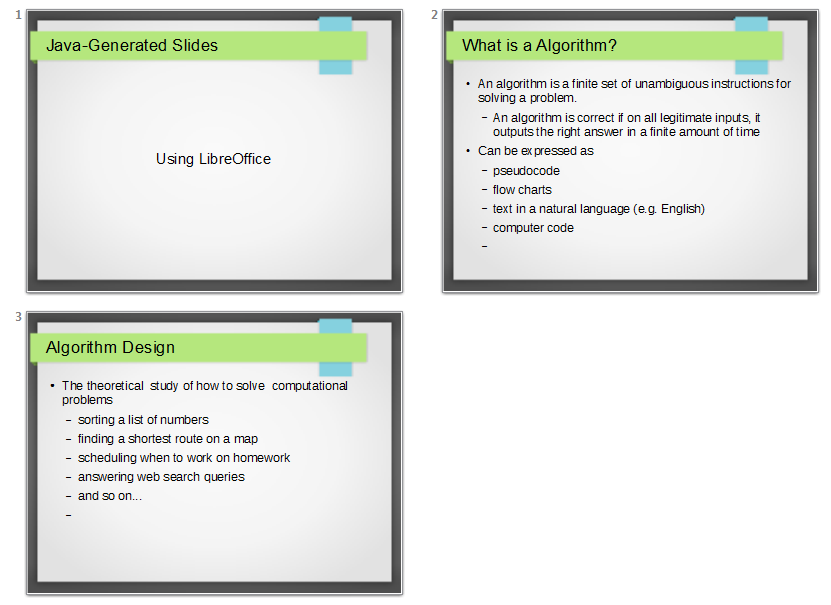
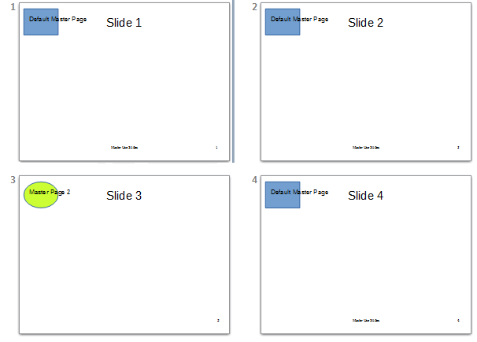
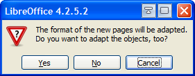

# Chapter 17. Slide Deck Manipulation

!!! note "Topics"
    Deck Building;
    Master Pages; Adding a
    Slide to  a Deck;
    Rearranging a Deck;
    Appending Two Decks;
    Exporting a Slide as an
    Image; Extracting the
    Text from a Deck

    Example folders: "Draw
    Tests" and "Utils"


This chapter looks at a number of common tasks
performed with slide decks:

* building a slide deck based on a file of text notes;
* using, changing, and creating master pages for slide decks;
* adding a slide to an existing deck;
* rearranging the slides in a deck;
* appending two (or more) decks;
* exporting a slide from a deck as an image;
* extracting all the text from a slide deck.


## 1.  Building a Deck from Notes

With Draw methods such as titleSlide() and bulletsSlide() it's quite easy to write a
program that converts a set of notes in a text file into a slides deck. The
PointsBuilder.java example does just that, using textual input formatted as shown
below:

```
What is a Algorithm?

> An algorithm is a finite set of unambiguous instructions for
solving a problem.


>> An algorithm is correct if on all legitimate inputs, it outputs
the right answer in a finite amount of time

> Can be expressed as
>>pseudocode
>>flow charts
>>text in a natural language (e.g. English)
>>computer code


Algorithm Design

> The theoretical  study of how to solve  computational problems
>>sorting a list of numbers
>>   finding a shortest route on a map
>> scheduling when to work on homework
>> answering web search queries
>> and so on...
```


When PointsBuilder reads this text, it generates three slides, and saves them to
"points.odp" which is shown in Figure 1.




Figure 1. Slides Generated by PointsBuilder.java

The title slide in Figure 1 is generated automatically, but the other slides are created
from the input text by calling Draw.bulletsSlide() and Draw.addBullet().

The reason the output looks so good is that PointsBuilder.java uses one of Impress'
templates, "Inspiration.otp". These files are listed in Impress when you open the
"Master Pages" section of the Tasks pane, part of which is shown in Figure 2.


Figure 2. The List of Master Pages in Impress.


If you move the cursor over the thumbnail images, the name of the template file is
displayed as a tooltip.

The main() function of PointsBuilder.java starts by printing the names of all the
available templates, before using "Inspiration.otp" to create a new presentation
document:

=== "java"
    ```java
    public static void main (String args[])
    {
      if (args.length != 1) {
        System.out.println("Usage: PointsBuilder <points fnm>");
        return;
      }
      XComponentLoader loader = Lo.loadOffice();
      reportTemplates();
    
      String templateFnm = Draw.getSlideTemplatePath() +
                                           "Inspiration.otp";
      XComponent doc = Lo.createDocFromTemplate(templateFnm, loader);
      if (doc == null) {
        System.out.println("Impress doc creation failed");
        Lo.closeOffice();
        return;
      }
    
      readPoints(args[0], doc);
      System.out.println("Total no. of slides: " +
                                  Draw.getSlidesCount(doc));
      Lo.saveDoc(doc, "points.odp");
      Lo.closeDoc(doc);
      Lo.closeOffice();
    }  // end of main()
    ```

reportTemplates() uses Info.getDirs("Template") to retrieve a list of all the directories
examined by Office when looking for templates. It also calls
Draw.getSlideTemplatePath() to retrieve the default slide template directory, and
prints the names of the files in that folder:

=== "java"
    ```java
    // in PointsBuilder.java
    private static void reportTemplates()
    {
      String[] templateDirs = Info.getDirs("Template");
      System.out.println("Templates dirs:");
      for(String dir : templateDirs)
        System.out.println("  " + dir);
    
      String templateDir = Draw.getSlideTemplatePath();
      System.out.println("\nTemplates files in \"" +
                                           templateDir + "\"");
      String[] templatesFnms = FileIO.getFileNames(templateDir);
      for(String fnm : templatesFnms)
        System.out.println("  " + fnm);
    }  // end of reportTemplates()
    ```

reportTemplates()'s output:

```
Templates dirs:
  C:\Program Files\LibreOffice 4\share\template\en-US
  C:\Program Files\LibreOffice 4\share\template\common
  C:\Users\Ad\Desktop\LibreOffice Tests\
       Draw Tests\$BUNDLED_EXTENSIONS\wiki-publisher\templates
  C:\Users\Ad\AppData\Roaming\LibreOffice\4\user\template

Templates files in "C:\Program Files\LibreOffice 4\
                           share/template/common/layout/"
  AbstractGreen.otp
  AbstractRed.otp
  AbstractYellow.otp
  BrightBlue.otp
  DNA.otp
  Inspiration.otp
  LushGreen.otp
  Metropolis.otp
  Sunset.otp
  Vintage.otp
```

PointsBuilder employs the "Inspiration.otp" template, via the call:

=== "java"
    ```java
    String templateFnm = Draw.getSlideTemplatePath() + "Inspiration.otp";
    XComponent doc = Lo.createDocFromTemplate(templateFnm, loader);
    ```

Lo.createDocFromTemplate() is a variant of  Lo.createDoc() which specifies a
template for the new document. It calls
XComponentLoader.loadComponentFromURL() with the template file as an
argument, and sets the "AsTemplate" property:

=== "java"
    ```java
    // in the Lo class
    // global
    private static XMultiServiceFactory msFactory = null;
    
    
    public static XComponent createDocFromTemplate(String templatePath,
                                          XComponentLoader loader)
    // create a new document using the specified template
    {
      if (!FileIO.isOpenable(templatePath))
        return null;
      System.out.println("Opening template " + templatePath);
      String templateURL = FileIO.fnmToURL(templatePath);
      if (templateURL == null)
        return null;
    
      PropertyValue[] props =
          Props.makeProps("Hidden", true, "AsTemplate", true);
      XComponent doc = null;
      try {
        doc = loader.loadComponentFromURL(templateURL,"_blank",0,props);
        msFactory =  Lo.qi(XMultiServiceFactory.class, doc);
      }
      catch (Exception e) {
        System.out.println("Could not create doc from template: " + e);
      }
      return doc;
    }  // end of createDocFromTemplate()
    ```

The readPoints() method in PointsBuilder.java loads the text points file line-by-line. It
ignores blank lines and lines starting with "//", and examines the first character on
each line:

=== "java"
    ```java
    // in PointsBuilder.java
    private static void readPoints(String fnm, XComponent doc)
    {
      XDrawPage currSlide  = Draw.getSlide(doc, 0);
      Draw.titleSlide(currSlide, "Java-Generated Slides",
                                 "Using LibreOffice");
      XText body = null;
      try {
        BufferedReader br = new BufferedReader( new FileReader(fnm));
        String line;
        char ch;
        while((line = br.readLine()) != null) {
          if (line.length() == 0)  // blank line
            continue;
          if (line.startsWith("//"))   // comment
            continue;
          ch = line.charAt(0);
          if (ch == '>')  // a bullet with some indentation
            processBullet(line, body);
          else {  // a title for a new slide
            currSlide = Draw.addSlide(doc);
            body = Draw.bulletsSlide(currSlide, line);
          }
        }
        br.close();
        System.out.println("Read in points file: " + fnm);
      }
      catch (IOException e)
      { System.out.println("Error reading points file: " + fnm); }
    }  // end of readPoints()
    ```

If the line starts with a '>', then processBullet() is called to determine how many '>'s
start the line. Depending on the number, Draw.addBullet() is called with a different
bullet indentation level value. If the line doesn't start with a '>', then it's assumed to be
the title line of a new slide, and Draw.addSlide() and Draw.bulletsSlide() create a new
bullets-based slide.


## 2.  Master Pages

When a new slide deck is created it always has a single slide and a default master
page, and every slide created subsequently will use this master page to format its
background. The easiest way to view the master page is through the Impress GUI – by
clicking on the View, Master, Slide Master menu, which displays something like
Figure 3.


Figure 3. The Default Master Page.


There are five presentation shapes in Figure 3. From top-to-bottom, left-to-right, they
are TitleTextShape, OutlinerShape , DateTimeShape. FooterShape, and
SlideNumberShape.

Even though a new slide links to this master page, the date/time, footer, and slide
number text are not automatically displayed on the slide; their rendering must be
turned on.

It's possible to create more master pages in addition to the default one in Figure 3, and
link a slide to one of those.

The MastersUse.java example illustrates a number of master page features: the default
master page has text added to its footer section, and a shape and text are placed in its
top-left corner. The slide deck holds four slides – three of them link to the default
master page, and are set to display its footer and slide number. However, the third
slide in the deck links to a second master page with a slightly different appearance.

Figure 4 shows the all the slides in the deck.




Figure 4. A Slide Deck with Two Master Pages.


Slides 1, 2, and 4 use the default master page, while slide 3 uses the new master.

The main() function for MastersUse.java is:

=== "java"
    ```java
    public static void main(String args[])
    {
      XComponentLoader loader = Lo.loadOffice();
    
      XComponent doc = Draw.createImpressDoc(loader);
      if (doc == null) {
        System.out.println("Impress doc creation failed");
        Lo.closeOffice();
        return;
      }
    
      // report the shapes on the default master page
      XDrawPage masterPage = Draw.getMasterPage(doc, 0);
      System.out.println("Default Master Page");
      Draw.showShapesInfo(masterPage);
    
      // set the master page's footer text
      Draw.setMasterFooter(masterPage, "Master Use Slides");
    
      // add a rectangle and text to the default master page
      // at the top-left of the slide
      Size sz = Draw.getSlideSize(masterPage);
      Draw.drawRectangle(masterPage, 5, 7, sz.Width/6, sz.Height/6);
      Draw.drawText(masterPage, "Default Master Page", 10,15,100,10,24);
    
      /* set slide 1 to use the master page's slide number
         but its own footer text */
      XDrawPage slide1 = Draw.getSlide(doc, 0);
      Draw.titleSlide(slide1, "Slide 1", "");
      Props.setProperty(slide1, "IsPageNumberVisible", true);
          // use the master page's slide number
      Props.setProperty(slide1, "IsFooterVisible", true);
      Props.setProperty(slide1, "FooterText", "MU Slides");
          // change master page's footer for first slide (does not work)
    
      /* add three more slides, which use the master page's
         slide number and footer */
      for(int i=1; i < 4; i++) {
        XDrawPage slide = Draw.insertSlide(doc, i);
        Draw.bulletsSlide(slide, "Slide " + (i+1));
        Props.setProperty(slide, "IsPageNumberVisible", true);
        Props.setProperty(slide, "IsFooterVisible", true);
      }
    
      // create master page 2
      XDrawPage masterPage2 = Draw.insertMasterPage(doc, 1);
      Draw.addSlideNumber(masterPage2);   // add slide number
      System.out.println("Master Page 2");
      Draw.showShapesInfo(masterPage2);
    
      // link third slide to master page 2
      Draw.setMasterPage(Draw.getSlide(doc, 2), masterPage2);
    
      // put green ellipse and text on master page 2
      XShape ellipse = Draw.drawEllipse(masterPage2, 5, 7,
                                       sz.Width/6, sz.Height/6);
      Props.setProperty(ellipse, "FillColor", 0xCCFF33);  //neon green
      Draw.drawText(masterPage2, "Master Page 2", 10, 15, 100, 10, 24);
    
      Lo.saveDoc(doc, "muSlides.odp");
      Lo.closeDoc(doc);
      Lo.closeOffice();
    }  // end of main()
    ```


### 2.1.  Accessing a Master Page

A presentation (or drawing) document can access its master pages through the
XMasterPagesSupplier interface in the GenericDrawingDocument service.
XMasterPagesSupplier.getMasterPages() returns a single XDrawPages object:

=== "java"
    ```java
    XMasterPagesSupplier mpSupp = Lo.qi(XMasterPagesSupplier.class, doc);
    XDrawPages pgs = mpSupp.getMasterPages();
    ```

The XDrawPages object is an indexed collection, with the default master page at
position 0:

=== "java"
    ```java
    XDrawPage masterPage = Lo.qi(XDrawPage.class, pgs.getByIndex(0));
    ```

Note that there's no "XMasterPage" interface – both slides and master pages are
manipulated using XDrawPage.

These preceding lines are packaged up as Draw.getMasterPage():

=== "java"
    ```java
    // in the Draw class
    public static XDrawPage getMasterPage(XComponent doc, int idx)
    // get master page by index
    {
      try {
        XMasterPagesSupplier mpSupp =
                  Lo.qi(XMasterPagesSupplier.class, doc);
        XDrawPages pgs = mpSupp.getMasterPages();
        return Lo.qi(XDrawPage.class, pgs.getByIndex(idx));
      }
      catch(Exception e)
      {  System.out.println("Could not find master slide " + idx);
         return null;
      }
    }  // end of getMasterPage()
    ```

There's a second way of obtaining a master page, via the link between a slide and its
master; the linked master is called a target. This is implemented by a second
Draw.getMasterPage() method:

=== "java"
    ```java
    // in the Draw class
    public static XDrawPage getMasterPage(XDrawPage slide)
    // return master page for the slide
    {
      XMasterPageTarget mpTarget =
                           Lo.qi(XMasterPageTarget.class, slide);
      return mpTarget.getMasterPage();
    }  // end of getMasterPage()
    ```


### 2.2.  What's on a Master Page?

The default master page was shown in Figure 3, and its structure is confirmed in
MastersUse.java when Draw.showShapesInfo() is called:

=== "java"
    ```java
    // in main() of MastersUse.java
    XDrawPage masterPage = Draw.getMasterPage(doc, 0);
    System.out.println("Default Master Page");
    Draw.showShapesInfo(masterPage);
    ```

The output:

```
Default Master Page
Draw Page shapes:
  Shape service: com.sun.star.presentation.TitleTextShape; z-order: 0
  Shape service: com.sun.star.presentation.OutlinerShape; z-order: 1
  Shape service: com.sun.star.presentation.DateTimeShape; z-order: 2
  Shape service: com.sun.star.presentation.FooterShape; z-order: 3
  Shape service: com.sun.star.presentation.SlideNumberShape;z-order:4
```

A new master page is created  by using XMasterPagesSupplier.getMasterPages() and
XDrawPages.insertNewByIndex(), as shown in Draw.insertMasterPage():

=== "java"
    ```java
    // in the Draw class
    public static XDrawPage insertMasterPage(XComponent doc, int idx)
    // creates new master page at the given index position,
    {
      XMasterPagesSupplier mpSupp =
                              Lo.qi(XMasterPagesSupplier.class, doc);
      XDrawPages pgs = mpSupp.getMasterPages();
      return pgs.insertNewByIndex(idx);
    }  // end of insertMasterPage()
    ```

The new master page contains no presentation shapes (unlike the default one). They
must be added separately.


### 2.3.  Modifying a Master Page

MastersUse.java changes the default master page in three ways: it adds text to the
footer shape (which is empty by default), and places a blue rectangle and some text in
the top-left corner of the master:

=== "java"
    ```java
    // in main() of MastersUse.java
    // set the master page's footer text
    Draw.setMasterFooter(masterPage, "Master Use Slides");
    
    // add a rectangle and text to the default master page
    // at the top-left of the slide
    Size sz = Draw.getSlideSize(masterPage);
    Draw.drawRectangle(masterPage, 5, 7, sz.Width/6, sz.Height/6);
    Draw.drawText(masterPage, "Default Master Page", 10,15, 100,10, 24);
    ```

Draw.setMasterFooter() searches through the shapes on the page looking for a
FooterShape. The shape is cast to a text interface, and a string added:

=== "java"
    ```java
    // in Draw
    public static void setMasterFooter(XDrawPage master, String text)
    // set the master page's footer text
    {
      XShape footerShape = Draw.findShapeByType(master,
                              "com.sun.star.presentation.FooterShape");
      XText textField = Lo.qi(XText.class, footerShape);
      textField.setString(text);
    }  // end of setMasterFooter()
    ```

MastersUse's second master page contains no shapes initially. An ellipse and some
text are added to it in the same way as for the default master page:

=== "java"
    ```java
    // in main() of MastersUse.java
    XDrawPage masterPage2 = Draw.insertMasterPage(doc, 1);
              :
    // put ellipse and text on master page 2
    XShape ellipse = Draw.drawEllipse(masterPage2, 5, 7,
                                      sz.Width/6, sz.Height/6);
    Props.setProperty(ellipse, "FillColor", 0xCCFF33); // neon green
    Draw.drawText(masterPage2, "Master Page 2", 10, 15, 100, 10, 24);
    ```

Unlike the default master page, a number shape must be explicitly added to the
second master, by calling Draw.addSlideNumber():

=== "java"
    ```java
    Draw.addSlideNumber(masterPage2);
    ```

It is implemented as:

=== "java"
    ```java
    // in the Draw class
    public static XShape addSlideNumber(XDrawPage slide)
    // add slide number at bottom right (like on the default master)
    {
      Size sz = Draw.getSlideSize(slide);
      int width = 60;
      int height = 15;
      return Draw.addPresShape(slide, "SlideNumberShape",
              sz.Width-width-12, sz.Height-height-4, width, height);
    }  // end of addSlideNumber()
    ```

Draw.addPresShape() creates a shape from the "com.sun.star.presentation" package:

=== "java"
    ```java
    // in the Draw class
    public static XShape addPresShape(XDrawPage slide,
                           String shapeType,
                           int x, int y, int width, int height)
    { warnsPosition(slide, x, y);
      XShape shape = Lo.createInstanceMSF(XShape.class,
                          "com.sun.star.presentation."+shapeType);
      if (shape != null) {
        slide.add(shape);
        setPosition(shape, x, y);
        setSize(shape, width, height);
      }
      return shape;
    }  // end of addPresShape()
    ```


### 2.4.  Using a Master Page

New slides are automatically linked to the default master page, but properties must be
explicitly set in order for the master's date/time, footer, and page number to be visible
on the slide. For example, the footer and page number are drawn on a slide like so:

=== "java"
    ```java
    // in main() of MastersUse.java
    XDrawPage slide1 = Draw.getSlide(doc, 0);
         :
    Props.setProperty(slide1, "IsPageNumberVisible", true);
    Props.setProperty(slide1, "IsFooterVisible", true);
    ```

The relevant property for showing the date/time is "IsDateTimeVisible". All these
properties are define in the com.sun.star.presentation.DrawPage service.

A related property is "FooterText", which changes the footer text for a specific slide.

For example:

=== "java"
    ```java
    Props.setProperty(slide1, "FooterText", "MU Slides");
    ```

However, this only works if the linked master page doesn't have its own footer text.

A slide can be linked to a different master by calling Draw.setMasterPage():

=== "java"
    ```java
    // in main() of MastersUse.java
    // link third slide to second master
    XDrawPage slide3 = Draw.getSlide(doc, 2);
    Draw.setMasterPage(slide3, masterPage2);
    ```

It uses the XMasterPageTarget interface to create the new link:

=== "java"
    ```java
    // in the Draw class
    public static void setMasterPage(XDrawPage slide, XDrawPage mPg)
    { XMasterPageTarget mpTarget =
                    Lo.qi(XMasterPageTarget.class, slide);
      mpTarget.setMasterPage(mPg);
    }
    ```


## 3.  Adding a Slide to a Deck

The last section used XDrawPages.insertNewByIndex() to add a master page to the
deck The same method is more commonly employed to add an ordinary slide.

An example is shown in ModifySlides.java: its main() function opens a file, adds a
title-only slide at the end of the deck, and a title/subtitle slide at the beginning. It
finishes by saving the modified deck to a new file:

=== "java"
    ```java
    public static void main(String args[])
    {
      if (args.length != 1) {
        System.out.println("Usage: ModifySlides fnm");
        return;
      }
    
      XComponentLoader loader = Lo.loadOffice();
      XComponent doc = Lo.openDoc(args[0], loader);
      if (!Info.isDocType(doc, Lo.IMPRESS_SERVICE)) {
        System.out.println("-- not a slides presentation");
        Lo.closeOffice();
        return;
      }
    
      XDrawPages slides = Draw.getSlides(doc);
    
      // add a title-only slide with a graphic at the end
      XDrawPage lastPage = slides.insertNewByIndex(numSlides);
      Draw.titleOnlySlide(lastPage, "Any Questions?");
      Draw.drawImage(lastPage, "questions.png");
    
      // add a title/subtitle slide at the start
      XDrawPage firstPage = slides.insertNewByIndex(0);
                                // this is added after first slide!
      Draw.titleSlide(firstPage, "Interesting Slides", "Andrew");
    
      Lo.saveDoc(doc, Info.getName(args[0]) + "_Mod." +
                                         Info.getExt(args[0]));
      Lo.closeDoc(doc);
      Lo.closeOffice();
    } // end of main()
    ```

But if you examine the new file, you'll see that the title/subtitle slide has become the
second slide in the deck. This highlights a restriction on
XDrawPages.insertNewByIndex(), which is that a new slide cannot be inserted at
index position 0. Instead, it will be inserted at the next spot, position 1.


## 4.  Rearranging a Slide Deck

A surprising gap in the presentation API is the lack of a simple way  to rearrange
slides: for example, to move the second slide to the fifth position.

The closest the API comes is the ability to duplicate a slide, but the copy is always
inserted after the original, so isn't of much use. If you did want to do this, the code
would be something like:

=== "java"
    ```java
    XDrawPageDuplicator dup = Lo.qi(XDrawPageDuplicator.class, doc);
    XDrawPage dupSlide = dup.duplicate(slide);
          // dupSlide is located after original slide in the deck
    ```

The only way to rearrange slides inside Office is with dispatch commands, in
particular with the "Copy" and "Paste" commands. This is complicated by the fact that
copying an entire slide is only possible when the deck is displayed in slide-sorter
mode.

The CopySlide.java example illustrates the technique but, as with most uses of
dispatching, is quite fragile. The better answer is to utilize a third-part API, the ODF
Toolkit, which is the topic of Chapter 51.

CopySlide.java is called with three arguments – the filename and two slide indices.

The first index is the source slide's position in the deck, and the second is the position
after which the copied slide will appear. For instance:

```
> run CopySlide points.odp 1 4
```

will copy the second slide of the deck to after the fifth slide.

The main() function of CopySlide.java:

=== "java"
    ```java
    public static void main(String args[])
    {
      if (args.length != 3) {
        System.out.println("Usage: CopySlide fnm from-index to-index");
        return;
      }
    
      XComponentLoader loader = Lo.loadOffice();
      XComponent doc = Lo.openDoc(args[0], loader);
      if (doc == null) {
        System.out.println("Could not open the file: " + args[0]);
        Lo.closeOffice();
        return;
      }
    
      int fromIdx = Lo.parseInt(args[1]);
      int toIdx = Lo.parseInt(args[2]);
      int numSlides = Draw.getSlidesCount(doc);
      if ((fromIdx < 0) || (toIdx < 0) ||
          (fromIdx >= numSlides) || (toIdx >= numSlides)) {
        System.out.println("One or both indices are out of range");
        Lo.closeOffice();
        return;
      }
    
      GUI.setVisible(doc, true);
    
      copyTo(doc, fromIdx, toIdx);
      // Draw.deleteSlide(doc, fromIdx);
          // a problem if the copying changes the indices
    
      Lo.save(doc);   // overwrite
      Lo.closeDoc(doc);
      Lo.closeOffice();
    } // end of main()
    ```

All the interesting stuff is performed by copyTo(). One minor thing to note is the call
to Lo.save() which causes the changed slide deck to be saved back to its original file.

It is defined as:

=== "java"
    ```java
    // in the Lo class
    public static void save(XComponent doc)
    {
      XStorable store = Lo.qi(XStorable.class, doc);
      try {
        store.store();
        System.out.println("Saved the document by overwriting");
      }
      catch (IOException e) {
         System.out.println("Could not save the document");
      }
    }  // end of save()
    ```

I usually avoid calling Lo.save() due to the fact that it overwrites the input file; I
prefer to create a new file to hold changes.

I've commented out the call to Draw.deleteSlide() in main() due to its potential to
cause damage. The problem is that the new slide may cause the overall indexing of
the slide deck to change. For example, consider what happens if the fourth slide is
copied to after the second slide. This will create a new third slide, moving the old
third slide, and all later slides, to the right. If the program now deletes the fourth slide,
that's not the slide that's just been copied, but the repositioned third slide.

The copyTo() function in CopySlide.java:

=== "java"
    ```java
    // in CopySlide.java
    private static void copyTo(XComponent doc, int fromIdx, int toIdx)
    /* Copy fromIdx slide to the clipboard in slide-sorter mode,
       then paste it to after the toIdx slide.
    
    */
    { XController ctrl = GUI.getCurrentController(doc);
    
      Lo.dispatchCmd("DiaMode");
          // Switch to slide-sorter view so that slides can be copied
      Lo.delay(5000);   // give Office plenty of time to do it
    
      XDrawPage fromSlide = Draw.getSlide(doc, fromIdx);
      XDrawPage toSlide = Draw.getSlide(doc, toIdx);
    
      Draw.gotoPage(ctrl, fromSlide);  // select this slide
      Lo.dispatchCmd("Copy");
      System.out.println("Copied " + fromIdx);
    
      Draw.gotoPage(ctrl, toSlide);
      Lo.dispatchCmd("Paste");
      System.out.println("Pasted to after " + toIdx);
    
      Lo.dispatchCmd("DrawingMode");
    }  // end of copyTo()
    ```

The method sends out four dispatches: the "DiaMode" command switches the
application into slide-sorter mode, and is followed by "Copy", "Paste", and finally
"DrawingMode" which switches the mode back to normal.

There are a few complications. One is that Draw.gotoPage() must be called twice. The
first call ensures that the source slide is the visible, active window before the "Copy"
is processed. The second Draw.gotoPage() call makes sure the destination slide is now
visible. This means that "Paste" will insert the copied slide after the destination slide,
as required.

I usually call Draw.gotoPage() with a document argument (e.g. Draw.gotoPage(doc,
fromSlide)). This does not work correctly for the pasting of the slide, for reasons I'm
unsure about. The solution is to use a reference to the document's controller, as shown
in copyTo():

=== "java"
    ```java
    XController ctrl = GUI.getCurrentController(doc);
      :
    Draw.gotoPage(ctrl, fromSlide);
      :
    Draw.gotoPage(ctrl, toSlide);
    ```


## 5.  Appending Slide Decks Together

A common Office forum question is how to add the slides of one deck to the end of
another. One solution is to use "Copy" and "Paste" dispatches as in section 4, but in a
more complicated fashion. As you might guess, the ODF Toolkit library described in
Chapter 51 is a better solution, but I'll focus on using Office here.

This approach means that two application windows could be open at the same time:
one containing the deck that is being copied, and another for the destination slide
deck. This requires references to two different application views and frames, which
can be a problem because of the design of my utility classes.

Another problem is caused by the issue of master page copying. When a slide using a
different master page is copied to a deck, Impress will query the user with an
'Adaption' dialog asking if the copied slide's format (i.e. its master page) should be
copied over to the destination deck. The dialog looks like Figure 5.




Figure 5. Adaption Dialog.


If you want the format of the copied deck to be retained in its new location, then you
have to click the "Yes" button.  Carrying out this clicking action programmatically
requires stepping outside the Office API, and using JNA to interact with the dialog
box.

The resulting code is in the AppendSlides.java example. The main() function mostly
processes the program's command line arguments, a list of filenames. The first file is
the destination deck for the slides copied from the other files:

=== "java"
    ```java
    // globals: controller and frame for the destination deck
    private static XController toCtrl;
    private static XFrame toFrame;
    
    
    public static void main(String args[])
    {
      if (args.length < 2) {
        System.out.println("Usage: AppendSlides fnm1 fnm2 ...");
        return;
      }
    
      XComponentLoader loader = Lo.loadOffice();
      XComponent doc = Lo.openDoc(args[0], loader);
      if (doc == null) {
        System.out.println("Could not open first file: " + args[0]);
        Lo.closeOffice();
        return;
      }
    
      GUI.setVisible(doc, true);
    
      // controller and frame refs for the destination deck
      toCtrl = GUI.getCurrentController(doc);
      toFrame = GUI.getFrame(doc);
    
      Lo.dispatchCmd(toFrame, "DiaMode", null);
          // Switch to slide-sorter view so that slides can be pasted
    
      XDrawPages toSlides = Draw.getSlides(doc);
    
      // process the other files on the command line
      for(int i=1; i < args.length; i++) {  // start at 1
        XComponent appDoc = Lo.openDoc(args[i], loader);
        if (appDoc == null)
          System.out.println("Could not open the file: " + args[i]);
        else
          appendDoc(toSlides, appDoc);
      }
    
      Lo.saveDoc(doc, Info.getName(args[0]) + "_Append." +
                                         Info.getExt(args[0]));
    
      Lo.dispatchCmd(toFrame, "PageMode", null);
                 // back to normal mode (does not work)
      Lo.closeDoc(doc);
      Lo.closeOffice();
    } // end of main()
    ```

Note that the controller and frame reference for the destination deck are saved as
globals. I've done this to reduce the number of arguments passed between the
functions.

The for-loop in the middle of main() processes each of the slide decks in turn,
appending their slides to the destination deck.

appendDoc() accesses a slide deck in a second Impress window, which means that a
second controller and frame reference are needed; they're stored in fromCtrl and
fromFrame:

=== "java"
    ```java
    // in AppendSlides.java
    private static void appendDoc(XDrawPages toSlides, XComponent doc)
    /* Append doc to the end of toSlides.
    
       Access the slides in the document, and the
       document's controller and frame refs.
    
       Switch to slide-sorter view so that slides can be copied.
    
    */
    {
      GUI.setVisible(doc, true);
    
      // get this document's controller and frame refs
      XController fromCtrl = GUI.getCurrentController(doc);
      XFrame fromFrame = GUI.getFrame(doc);
    
      Lo.dispatchCmd(fromFrame, "DiaMode", null);
              // switch this document to slide-sorter mode
    
      XDrawPages fromSlides = Draw.getSlides(doc);
      if (fromSlides == null)
        System.out.println("- No slides found");
      else {
        System.out.println("- Adding slides");
        appendSlides(toSlides, fromSlides, fromCtrl, fromFrame);
      }
    
      Lo.dispatchCmd(fromFrame, "PageMode", null);
           // change back to normal slide view (does not work)
      Lo.closeDoc(doc);
      System.out.println();
    }  // end of appendDoc()
    ```

appendDoc() calls appendSlides() to cycle through the slides, copying each one to the
destination deck:

=== "java"
    ```java
    // in AppendSlides.java
    private static void appendSlides(XDrawPages toSlides,
                                     XDrawPages fromSlides,
                        XController fromCtrl, XFrame fromFrame)
    /* Append fromSlides to the end of toSlides
       Loop through the fromSlides, copying each one.
    
    */
    { for (int i=0; i < fromSlides.getCount(); i++) {
        XDrawPage fromSlide = Draw.getSlide(fromSlides, i);
        XDrawPage toSlide = Draw.getSlide(toSlides,
                                        toSlides.getCount()-1);
             // the copy of fromSlide will be placed *after* toSlide
        copyTo(fromSlide,fromCtrl,fromFrame, toSlide,toCtrl,toFrame);
      }
    }  // end of appendSlides()
    ```

The for-loop in appendSlides() calls copyTo() which copies and pastes a slide using
dispatch commands. In addition, it deals with the 'Adaption' dialog in Figure 5.

=== "java"
    ```java
    // in AppendSlides.java
    private static void copyTo(XDrawPage fromSlide,
                               XController fromCtrl, XFrame fromFrame,
                               XDrawPage toSlide,
                               XController toCtrl, XFrame toFrame)
    // copy fromSlide to *after* toSlide
    {
      Draw.gotoPage(fromCtrl, fromSlide);  // select this slide
      System.out.print("-- Copy --> ");
      Lo.dispatchCmd(fromFrame, "Copy", null);
      Lo.delay(1000);
    
      Draw.gotoPage(toCtrl, toSlide);   // select this slide
      System.out.println("Paste");
    
      // wait for "Adaption" dialog and click it
      Thread monitorThread = new Thread() {
        public void run() {
          Lo.delay(500);
          clickWindow("LibreOffice");
        }
      };
      monitorThread.start();
    
      Lo.dispatchCmd(toFrame, "Paste", null);
    }  // end of copyTo()
    ```

The dialog is handled by starting a Java thread which executes clickWindow(). This
waits for the dialog by suspending until a window with a title starting with
"LibreOffice" appears. I chose this string since it's what appears at the start of the
dialog's title bar in Figure 5:

=== "java"
    ```java
    // in AppendSlides.java
    private static void clickWindow(String windowTitle)
    {
      HWND handle = JNAUtils.findTitledWin(windowTitle);
      if (handle == null)
        return;
    
      Rectangle bounds = JNAUtils.getBounds(handle);
      int xCenter = bounds.x + 64;   // hard-wired loc for "Yes"
      int yCenter = bounds.y + 91;
      JNAUtils.doClick( new Point(xCenter, yCenter));
    }  // end of clickWindow()
    ```

JNAUtils.findTitledWin() returns a handle to the window it has detected. The bounds
of the window are obtained, and a click event is sent to the (64, 91) coordinate inside
that window. These 'magic' coordinates are the location of the "Yes" button in the
dialog. This is both ugly and fragile since the position is almost certain to change
across different platforms and versions of Office.

Let's also not forget that if the title of the "Adaption" dialog changes in a future
version of Office, then JNAUtils.findTitledWin() may end up looking forever for the
window.

The AppendSlides.java and CopySlide.java examples highlight important missing
features in the presentation API. Copying and pasting a slide in a deck should be
available as methods in XDrawPages.

If you need a robust way of doing these tasks, I suggest looking at the ODF Toolkit
library in Chapter 51.


## 6.  Exporting a Slide as an Image

A drawing or slide can be exported as an image by using the GraphicExportFilter
service and its XGraphicExportFilter interface. The service is represented in Figure 6.


Figure 6. The GraphicExportFilter Service, Interfaces, and Methods.


In older documentation, such as the Developer's Guide, there's no mention of
XGraphicExportFilter. The guide claims that GraphicExportFilter directly supports
XExporter, XFilter, and XMimeTypeInfo. Use `lodoc XGraphicExportFilter` to
access the online documentation for the interface.

The Slides2Image.java example reads three arguments from the command line: the
filename of the slide deck, the index number of the slide, and the format used for
saving the slide's image. For example:

```
> run Slide2Image algs.ppt 2 png
```

The index number value may be a source of confusion since slides are numbered from
1 inside Impress' GUI, but from 0 in the API. In this case, '2' means the third slide in
the deck.

The main() function for Slide2Image.java:

=== "java"
    ```java
    public static void main(String args[])
    {
      if (args.length != 3) {
        System.out.println("Usage: Slide2Image fnm index imageFormat");
        return;
      }
      String fnm = args[0];
      int idx = Lo.parseInt(args[1]);
      String imFormat = args[2];
    
      XComponentLoader loader = Lo.loadOffice();
      XComponent doc = Lo.openDoc(fnm, loader);
      if (doc == null) {
        System.out.println("Could not open " + fnm);
        Lo.closeOffice();
        return;
      }
    
      XDrawPage slide = Draw.getSlide(doc, idx);
      if (slide == null) {
        Lo.closeOffice();
        return;
      }
    
      String[] names = Images.getMimeTypes();
      System.out.println("Known GraphicExportFilter mime types:");
      for (int i=0; i < names.length; i++)
        System.out.println("  " + names[i]);
    
      String outFnm = Info.getName(fnm) + idx + "." + imFormat;
      System.out.println("Saving page " + idx + " to \"" +outFnm+ "\"");
      String mime = Images.changeToMime(imFormat);
      Draw.savePage(slide, outFnm, mime);
      Lo.closeDoc(doc);
      Lo.closeOffice();
    }  // end of main()
    ```

The example uses two mime functions: Images.getMimeTypes() and
Images.changeToMime(). The first returns an array of all the mime types supported
by GraphicExportFilter by calling XMimeTypeInfo.getSupportedMimeTypeNames():

=== "java"
    ```java
    // in the Images class
    public static String[] getMimeTypes()
    {
      XMimeTypeInfo mi = Lo.createInstanceMCF(XMimeTypeInfo.class,
                 "com.sun.star.drawing.GraphicExportFilter");
      return mi.getSupportedMimeTypeNames();
    }
    ```

The printed array is:

```
Known GraphicExportFilter mime types:
  image/x-MS-bmp
  image/x-emf
  image/x-eps
  image/gif
  image/jpeg
  image/x-met
  image/x-portable-bitmap
  image/x-pict
  image/x-portable-graymap
  image/png
  image/x-portable-pixmap
  image/x-cmu-raster
  image/svg+xml
  image/x-svm
  image/tiff
  image/x-wmf
  image/x-xpixmap
```

Images.changeToMime() looks through the mime array for a type that contains the
supplied format as a substring:

=== "java"
    ```java
    // in the Images class
    public static String changeToMime(String imFormat)
    {
      String[] names = getMimeTypes();
      String imf = imFormat.toLowerCase().trim();
      for (int i=0; i < names.length; i++) {
        if (names[i].contains(imf)) {
          System.out.println("Using mime type: " + names[i]);
          return names[i];
        }
      }
    
      System.out.println("No matching mime type, so using image/png");
      return "image/png";
    }  // end of changeToMime()
    ```

Draw.savePage() creates an XGraphicExportFilter object, configuring it with the page
to be exported and the mime type filter:

=== "java"
    ```java
    // in the Draw class
    public static void savePage(XDrawPage page, String fnm,
                                             String mimeType)
    { String saveFileURL = FileIO.fnmToURL(fnm);
      if (saveFileURL == null)
        return;
      System.out.println("Saving page in " + fnm);
    
      // create graphics exporter
      XGraphicExportFilter gef =
               Lo.createInstanceMCF(XGraphicExportFilter.class,
                         "com.sun.star.drawing.GraphicExportFilter");
    
      // set the output 'document' to be specified page
      XComponent doc = Lo.qi(XComponent.class, page);
      gef.setSourceDocument(doc);    // link exporter to the document
    
      // export the page by converting to the specified mime type
      PropertyValue props[] = Props.makeProps("MediaType", mimeType,
                                              "URL", saveFileURL);
      gef.filter(props);
      System.out.println("Export completed");
    }  // end of savePage()
    ```

The name of the XExporter.setSourceDocument() method is a bit misleading since its
input argument should either be an XDrawPage (a slide, as here), XShape (a shape on
the slide), or an XShapes object (a collection of shapes on a slide).

XFilter.filter() exports the slide (or shape), based on values supplied in a properties
array. The array should contain the mime type and the URL of the output file.


## 7.  Extracting the Text from a Slide Deck

Draw.getShapesText() supports the fairly common task of extracting all the text from
a presentation. It is used by the ExtractText.java example:

=== "java"
    ```java
    // from ExtractText.java
         :
    if (Draw.isShapesBased(doc)) {
      String text = Draw.getShapesText(doc);
      System.out.println("----- Text Content -----");
      System.out.println(text);
      System.out.println("------------------------");
    }
    else
      System.out.println("Extraction unsupported");
        :
    ```

Draw.getShapesText() calls getOrderedShapes() to collect all the shapes from all the
slides in the document. It then iterates over the shapes list, converting each shape to
text and adding it to a StringBuffer:

=== "java"
    ```java
    // in the Draw class
    public static String getShapesText(XComponent doc)
    {
      StringBuilder sb = new StringBuilder();
      ArrayList<XShape> xShapes = getOrderedShapes(doc);
      for(XShape xShape : xShapes) {
        String text = getShapeText(xShape);
        sb.append(text + "\n");
      }
      return sb.toString();
    }  // end of getShapeText()
    ```

Draw.getShapeText() pulls the text from a shape by casting it to a text interface, then
uses a cursor to select the text:

=== "java"
    ```java
    public static String getShapeText(XShape xShape)
    // get text from inside a shape
    {
      XText xText = Lo.qi(XText.class, xShape);
      XTextCursor xTextCursor = xText.createTextCursor();
      XTextRange xTextRange = Lo.qi(XTextRange.class, xTextCursor);
      return xTextRange.getString();
    }  // end of getShapeText()
    ```

getOrderedShapes() iterates over each slide in the document calling another version of
itself to extract the shapes from a slide:

=== "java"
    ```java
    public static ArrayList<XShape> getOrderedShapes(XComponent doc)
    //  get shapes from all pages of the doc
    {
      XDrawPage[] slides = getSlidesArr(doc);
      if (slides == null)
        return null;
    
      ArrayList<XShape> shapes = new ArrayList<XShape>();
      for(XDrawPage slide : slides)
        shapes.addAll( getOrderedShapes(slide));
      return shapes;
    }  // end of getOrderedShapes()
    ```

The ordering of the shapes in a slide may not match their reading order  (i.e. top-
down, left-to-right). For example, I read a slide by first looking at the text in the
TitleShape, before reading the bullets below in the OutlinerShape. However,
TitleShape may be stored at the end of the slide's container.

getOrderedShapes() deals with the problem by extracting all the shapes from the slide
into a list, and then sorting it based on each shape's z-order. A shape with z-order 0
will be moved before a shape with z-order 1. This almost always corresponds to the
user's reading order of the shapes. For example, TitleShape usually has a z-order of 0.

=== "java"
    ```java
    public static ArrayList<XShape> getOrderedShapes(XDrawPage slide)
    //  get all the shapes on the slide in increasing z-order
    {
      ArrayList<XShape> shapes = getShapes(slide);
      Collections.sort(shapes, new Comparator<XShape>() {
         public int compare(XShape s1, XShape s2)
         {  return (getZOrder(s1) > getZOrder(s2)) ? -1 : 1;  }
      });
      return shapes;
    }  // end of getOrderedShapes()
    
    
    public static int getZOrder(XShape shape)
    {  return (Integer) Props.getProperty(shape, "ZOrder");  }
    ```

getShapes() extracts all the shapes from a slide as a list:

=== "java"
    ```java
    public static ArrayList<XShape> getShapes(XDrawPage slide)
    {
      if (slide == null) {
        System.out.println("Slide is null");
        return null;
      }
      if (slide.getCount() == 0) {
        System.out.println("Slide does not contain any shapes");
        return null;
      }
    
      ArrayList<XShape> shapes = new ArrayList<XShape>();
      try {
        for(int j=0; j < slide.getCount(); j++)
          shapes.add( Lo.qi(XShape.class, slide.getByIndex(j)));
      }
      catch(Exception e)
      {   System.out.println("Shapes extraction error in slide");  }
    
      return shapes;
    }  // end of getShapes()
    ```