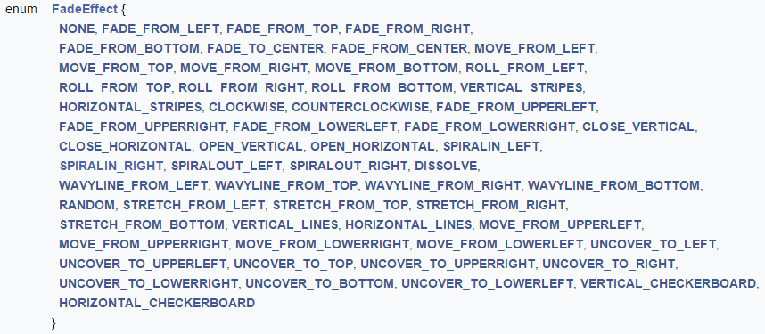

# Chapter 18. Slide Shows 
 
!!! note "Topics"
    Starting a Slide 
    Show; Play and End a 
    Slide Show 
    Automatically; Play a 
    Slide Show Repeatedly; 
    Play a  Custom Slide 
    Show 

    Example folders: "Draw 
    Tests" and "Utils" 

 
This chapter focuses on ways to programmatically control 
slide shows. If you're unfamiliar with what Impress offers 
in this regard, then chapter 9 of the Impress user guide 
gives a good overview. 

Creating and controlling slide shows employs properties 
in the Presentation service, and methods in the 
XSlideShowController interface (see Figure 1). 

 

Figure 1. The Slide Show Presentation Services. 

 
Two elements of slide shows not shown in Figure 1 are slide transition effects (e.g. 

have the next slide fade into view, replacing the current one), and shape animation 
effects (e.g. have some text whoosh in from the bottom of the screen). These effects 
are mostly controlled by setting properties – transition properties are in the 
com.sun.star.presentation.DrawPage service, animations properties in 
com.sun.star.presentation.Shape. 

 
 
## 1.  Starting a Slide Show 

The BasicShow.java example shows how a program can start a slide show, and then 
let the user progress through the presentation by clicking on a slide, pressing the space 
bar, or using the arrow keys.  

While the slide show is running, BasicShow.java suspends, but wakes up when the 
user exits the show. This can occur when he presses the ESC key, or clicks on the 
slide show's "click to exit" screen. BasicShow then closes the document and shuts 
down Office. 

The main() function: 
 
// in BasicShow.java 
public static void main(String args[]) 
{ 
  XComponentLoader loader = Lo.loadOffice(); 
  XComponent doc = Lo.openDoc(args[0], loader); 
  if (doc == null) { 
    System.out.println("Could not open "+ args[0]); 
    Lo.closeOffice(); 
    return; 
  } 
 
  GUI.setVisible(doc, true); 
     // slideshow start() crashes if the doc is not visible 
 
  XPresentation2 show = Draw.getShow(doc); 
  Props.showObjProps("Slide show", show); 
  show.start(); 
  XSlideShowController sc = Draw.getShowController(show); 
  Draw.waitEnded(sc);   // BasicShow waits for the user 
                        // to finish the slide show 
  Lo.closeDoc(doc); 
  Lo.closeOffice(); 
}  // end of main() 
 
The document is opened in the normal way and a slide show object created by calling 
Draw.getShow(), which is defined as: 
 
// in the Draw class 
public static XPresentation2 getShow(XComponent doc) 
{ 
  XPresentationSupplier ps = Lo.qi(XPresentationSupplier.class, doc); 
  return Lo.qi(XPresentation2.class, ps.getPresentation()); 
} 
 
The call to Props.showObjProps() in main() prints the properties associated with the 
slide show, most of which are defined in the Presentation service (see Figure 1): 
 
Slide show Properties 
  AllowAnimations == true 
  CustomShow == 
  Display == 0 
  FirstPage == 
  IsAlwaysOnTop == false 
  IsAutomatic == false 
  IsEndless == false 
  IsFullScreen == true 
  IsMouseVisible == false 
  IsShowAll == true 
  IsShowLogo == false 
  IsTransitionOnClick == true 
  Pause == 10 
  StartWithNavigator == false 
  UsePen == false 
 
The default values for these properties are sufficient for most presentations. 

The slide show is started by calling XPresentation.show() and, although the call 
returns immediately, it may be a few 100 milliseconds before the presentation appears 
on screen. If you have more than one monitor, one of them will be allocated a 
"Presenter Console" window. 

This short period while the slide show initializes can cause a problem if the 
XSlideShowController instance is requested too quickly – null will be returned if the 
slide show hasn't finished being created. Draw.getShowController() handles this issue 
by waiting: 
 
// in the Draw class 
public static XSlideShowController getShowController( 
                                        XPresentation2 show) 
// keep trying to get the slide show controller 
{ 
  XSlideShowController sc = show.getController();    
     // may return null if executed too quickly after start of show 
 
  int numTries = 1; 
  if ((sc == null) && (numTries < 4)) {  // try 3 times 
    Lo.delay(1000);  // give the slide show time to start 
    numTries++; 
    sc = show.getController(); 
  } 
  if (sc == null)  
    System.out.println("Could not obtain slide show controller"); 
  return sc; 
}  // end of XSlideShowController getShowController() 
 
getShowController() tries to obtain the controller three times before giving up and 
returning null. 

The XSlideShowController interface gives the programmer much greater control over 
the slide show, including the ability to change the slide being displayed, and monitor 
and control the slide show state. Two topics I won't cover here are how 
XSlideShowController can assign listeners to the slide show (of type 
XSlideShowListener), and how to utilize the XSlideShow interface.  

Back in BasicShow.java, the main() function suspends by calling Draw.waitEnded(); 
the idea is that the program will sleep until the human presenter ends the slide show. 

waitEnded() is implemented using XSlideShowController: 
 
// in the Draw class 
public static void waitEnded(XSlideShowController sc) 
{  
  while (sc.getCurrentSlideIndex() != -1) //presentation not ended  
    Lo.delay(1000); 
  System.out.println("End of presentation detected"); 
} 
 
XSlideShowController.getCurrentSlideIndex() normally returns a slide index (i.e. 0 or 
greater), but when the slide show has finished it returns -1. waitEnded() keeps polling 
for this value, sleeping for a second between each test. 

 
 
## 2.  Play and End a Slide Show Automatically 

The AutoShow.java example removes the need for a presenter to click on a slide to 
progress to the next one, and terminates the show itself after the last slide had been 
displayed: 
 
// in AutoShow.java 
public static void main(String args[]) 
{ 
  XComponentLoader loader = Lo.loadOffice(); 
  XComponent doc = Lo.openDoc(args[0], loader); 
  if (doc == null) { 
    System.out.println("Could not open "+ args[0]); 
    Lo.closeOffice(); 
    return; 
  } 
 
  GUI.setVisible(doc, true); 
 
  // fast automatic change between all the slides 
  XDrawPage[] slides = Draw.getSlidesArr(doc); 
  for(XDrawPage slide : slides) 
    Draw.setTransition(slide, FadeEffect.NONE, AnimationSpeed.FAST,  
                                     Draw.AUTO_CHANGE, 1); 
 
  XPresentation2 show = Draw.getShow(doc); 
  show.start(); 
 
  XSlideShowController sc = Draw.getShowController(show); 
 
  Draw.waitLast(sc, 3000);  // terminate 3 seconds after the 
                            // last slide has been shown 
  System.out.println("Ending the slide show"); 
  sc.deactivate(); 
  show.end(); 
 
  Lo.closeDoc(doc); 
  Lo.closeOffice(); 
}  // end of main() 
 
Automatic Slide Transitioning 
The automated transition between slides is configured by calling Draw.setTransition() 
on every slide in the deck: 
Draw.setTransition(slide, FadeEffect.NONE,  
                          AnimationSpeed.FAST,  
                          Draw.AUTO_CHANGE, 1); 
setTransition() combines the setting of four slide properties: "Effect", "Speed", 
"Change", and "Duration": 
 
// in the Draw class 
public static void setTransition(XDrawPage currSlide,  
             FadeEffect fadeEffect, AnimationSpeed speed,  
             int change, int duration) 
{ try { 
    XPropertySet props = Lo.qi(XPropertySet.class, currSlide); 
    props.setPropertyValue("Effect", fadeEffect); 
    props.setPropertyValue("Speed", speed); 
    props.setPropertyValue("Change", change); 
    props.setPropertyValue("Duration", duration);  // in seconds 
  } 
  catch (Exception e)  
  {  System.out.println("Could not set slide transition");  } 
}  // end of setTransition() 
 
Slide transition properties (such as "Effect", "Speed", "Change", and "Duration") are 
defined in the com.sun.star.presentation.DrawPage service. However, the possible 
values for "Effect" are stored in an enumeration listed at the end of the 
com.sun.star.presentation module (use lodoc presentation module, and scroll to 
the bottom of the page); Figure 2 shows the enum. 

 
 

Figure 2. The FadeEffect Enum. 

 
If you click on a word in the enum, then the browser follows a link to more 
information.  

The "Speed" property is used to set the speed of a slide transition, and its values are 
also stored in an enum in the com.sun.star.presentation package. There are three 
possible settings: AnimationSpeed.SLOW,  AnimationSpeed.MEDIUM, and 
AnimationSpeed.FAST. 

The "Change" property specifies how a transition is triggered. The property can take 
one of three integer values, which aren't defined by an enum for some reason. Instead, 
the programmer can use constants defined in my Draw class: 
 
// in the Draw class 
// slide show change constants 
public static final int CLICK_ALL_CHANGE = 0; 
public static final int AUTO_CHANGE = 1;    
public static final int CLICK_PAGE_CHANGE = 2; 
 
The default behavior is represented by 0 (Draw.CLICK_ALL_CHANGE) which requires 
the presenter to click on a slide to change it, and a click is also need to trigger any 
shape animations on the page. A value of 2 (Draw.CLICK_PAGE_CHANGE)  relieves the 
presenter from clicking to trigger shape animations, but he still needs to activate a 
slide transition manually. AutoShow.java passes Draw.AUTO_CHANGE to 
Draw.setTransition() which causes all the animations and transitions to execute 
automatically. 

The "Duration" property is specified in seconds and refers to how long the current 
slide stays on display before the transition effect begins. This is different from the 
"Speed" property which refers to how quickly a transition is performed. 

 
Finishing Automatically 
The other aspect of this automated slide show is making it stop when the last slide has 
been displayed. This is implemented by Draw.waitLast(): 
 
// in the Draw class 
public static void waitLast(XSlideShowController sc, int delay) 
{ 
  int numSlides = sc.getSlideCount(); 
  while (sc.getCurrentSlideIndex() < numSlides-1) {   
                 // has not yet reached the last slide 
    Lo.delay(500); 
  } 
  Lo.delay(delay); 
}  // end of waitLast() 
 
waitLast() keeps checking the current slide index and sleeps until the last slide in the 
deck is reached. It then goes to sleep one last time, to give the final slide time to be 
seen by the user. 

 
 
## 3.  Play a Slide Show Repeatedly 

Another common kind of automated slide show is one that plays the show repeatedly, 
only terminating when the presenter steps in and presses the ESC key. This only 
requires four lines to be changed in AutoShow.java, shown in bold below: 
 
// in AutoShow.java 
  :   
XPresentation2 show = Draw.getShow(doc); 
Props.showObjProps("Slide show", show); 
Props.setProperty(show, "IsEndless", true); 
Props.setProperty(show, "Pause", 0);    
                   // no pause before repeating 
show.start(); 
 
XSlideShowController sc = Draw.getShowController(show); 
 
// Draw.waitLast(sc, 3000);    
        // commented out; replaced by the next line 
Draw.waitEnded(sc); 
System.out.println("Ending the slide show"); 
sc.deactivate(); 
show.end(); 
  : 
 
The "IsEndless" property turns on slide show cycling, and "Pause" indicates how long 
the black "Click to exit" screen is displayed before the show restarts. 

Draw.waitEnded() is the same as before – it makes AutoShow.java suspend until the 
user clicks on the exit screen or presses the ESC key. 

 
 
## 4.  Play a  Custom Slide Show 

A custom slide show is a display sequence other than the usual one that starts with the 
first slide and moves linearly through to the last. A named 'play list' of pages must be 
created, consisting of references to slides in the deck. The list can point to the slides in 
any order, and may reference a slide more than once.  

Draw.buildPlayList() creates the named play list using three arguments: the slide 
document, an array of slide indices which represents the intended playing sequence, 
and a name for the list. For example: 
 
int[] slideIdxs = new int[] {5, 6, 7, 8}; 
XNameContainer playList =  
         Draw.buildPlayList(doc, slideIdxs, "ShortPlay"); 
 
This creates a play list called "ShortPlay" which will show the slides with indices 5, 6, 
7, and 8 (note: the first slide has index 0). Draw.buildPlayList is used in the 
CustomShow.java example: 
 
// in CustomShow.java 
public static void main(String args[]) 
{ 
  XComponentLoader loader = Lo.loadOffice(); 
  XComponent doc = Lo.openDoc("algs.odp", loader); 
  if (doc == null) { 
    System.out.println("Could not open algs.odp"); 
    Lo.closeOffice(); 
    return; 
  } 
 
  GUI.setVisible(doc, true); 
 
  int[] slideIdxs = new int[] {5, 6, 7, 8};  
  XNameContainer playList =  
      Draw.buildPlayList(doc, slideIdxs, "ShortPlay"); 
 
  XPresentation2 show = Draw.getShow(doc); 
  Props.setProperty(show, "CustomShow", "ShortPlay"); 
 
  show.start(); 
  XSlideShowController sc = Draw.getShowController(show); 
  Draw.waitEnded(sc); 
 
  Lo.closeDoc(doc); 
  Lo.closeOffice(); 
}  // end of main() 
 
The play list is installed by setting the "CustomShow" property in the slide show. The 
rest of the code in CustomShow.java is similar to the BasicShow.java example. 

 
Creating a Play List Using Containers 
The most confusing part of Draw.buildPlayList() is its use of two containers to hold 
the play list: 
 
// part of buildPlayList() in the Draw class 
      : 
// get name container for the slide show 
XNameContainer playList = Draw.getPlayList(doc); 
 
// get factory from the container 
XSingleServiceFactory xFactory =  
            Lo.qi(XSingleServiceFactory.class, playList); 
 
// use factory to make an index container 
XIndexContainer slidesCon =  Lo.qi(XIndexContainer.class,  
                                   xFactory.createInstance()); 
      : 
 
An index container is created by XSingleServiceFactory.createInstance(), which 
requires a factory instance. This factory is most conveniently obtained from an 
existing container, namely the one for the slide show. That's obtained by 
Draw.getPlayList(): 
 
// in the Draw class 
public static XNameContainer getPlayList(XComponent doc) 
// get a name container for the play list 
{ 
  XCustomPresentationSupplier cpSupp =  
            Lo.qi(XCustomPresentationSupplier.class, doc); 
  return cpSupp.getCustomPresentations(); 
} 
 
Draw.buildPlayList() fills the index container with references to the slides, and then 
places it inside the name container: 
 
/* store the index container under the play list name 
   in the name container */ 
playList.insertByName(customName, slidesCon); 
 
In other words, the play list is a name container holding a named index container. 

The rest of buildPlayList() is straightforward: 
 
// in the Draw class 
public static XNameContainer buildPlayList(XComponent doc,  
                          int[] slideIdxs, String customName) 
{ 
  // get a name container for the play list 
  XNameContainer playList = Draw.getPlayList(doc); 
 
  try { 
    // create an index container for the play list 
    XSingleServiceFactory xFactory =  
            Lo.qi(XSingleServiceFactory.class, playList); 
    XIndexContainer slidesCon =  Lo.qi(XIndexContainer.class,  
                                      xFactory.createInstance()); 
 
    /* index container is assigned slide references 
       whose indices come from slideIdxs 
    */ 
    System.out.println("Building play list using: "); 
    for(int j=0; j < slideIdxs.length; j++) { 
      XDrawPage slide = Draw.getSlide(doc, slideIdxs[j]); 
      if (slide != null) { 
        slidesCon.insertByIndex(j, slide); 
        System.out.println("  Slide " + slideIdxs[j]); 
      } 
    }   
 
    /* store the index container under the play list name 
       in the name container */ 
    playList.insertByName(customName, slidesCon); 
    System.out.println("Playlist has name: " + customName + "\n"); 
    return playList; 
  } 
  catch (com.sun.star.uno.Exception e)  
  {  System.out.println("Unable to build play list: " + e);   
     return null; 
  } 
}  // end of buildPlayList() 
 
The for-loop employs the array of indices to get references to the slides via 
Draw.getSlide(). Each reference is added to the index container. 

 
