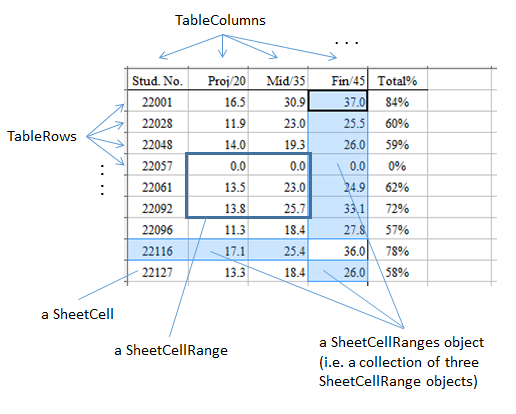
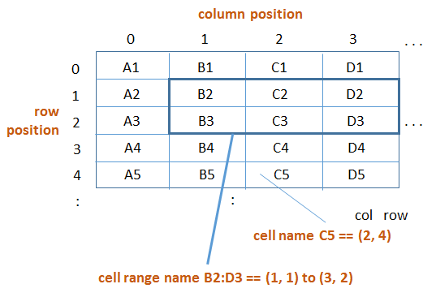
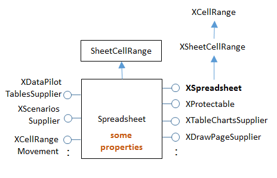
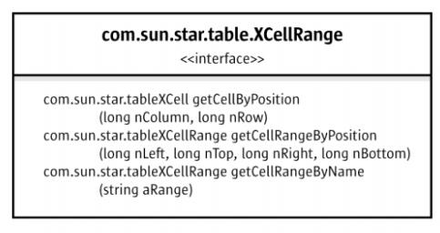
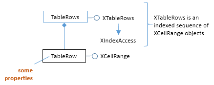
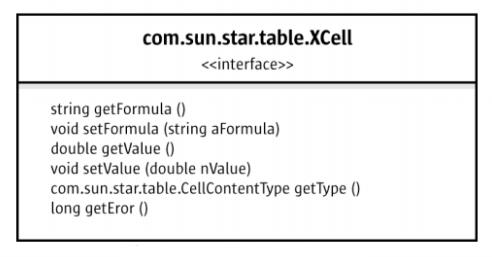
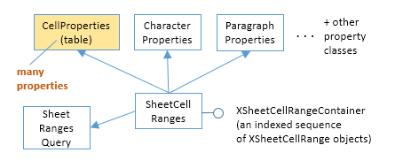

# Chapter 19. Calc API Overview

!!! note "Topics"
    The Spreadsheet
    Document; Document
    Spreadsheets;
    Spreadsheet Data; The
    Spreadsheet Service;
    Cell Range Services;
    Cell Services; Sheet Cell
    Ranges

    Example folders: "Calc
    Tests" and "Utils"


This chapter gives an overview of the main services and
interfaces used in the Calc parts of the Office API,
illustrated with small code fragments. I'll revisit these
topics in greater details (and with larger examples) in
subsequent chapters.

If you're unfamiliar with Calc, then a good starting point is
its user guide, available from
https://www.libreoffice.org/get-help/documentation/.
Chapter 8 of the Developer's Guide looks at spreadsheet programming, and is
available from
https://wiki.openoffice.org/w/images/d/d9/DevelopersGuide_OOo3.1.0.pdf.
Alternatively, you can access the chapter online, starting at
https://wiki.openoffice.org/wiki/Documentation/DevGuide/Spreadsheets/Spreadsheet_Documents
(or use `loguide calc`). The guide's examples can be found at
http://api.libreoffice.org/examples/DevelopersGuide/examples.html#Spreadsheet.
There's also a few examples in the "Spreadsheet Document Examples" section of
http://api.libreoffice.org/examples/examples.html#Java_examples.


## 1.  The Spreadsheet Document

The Calc API is organized around the SpreadsheetDocument service which subclasses
OfficeDocument. Figure 1 shows these services, including some of their interfaces.


Figure 1. Some Spreadsheet Services and Interfaces.


Calc's functionality is mostly divided between two Java packages (modules), sheet
and table, which are documented at
http://api.libreoffice.org/docs/idl/ref/namespacecom_1_1sun_1_1star_1_1sheet.html
and
http://api.libreoffice.org/docs/idl/ref/namespacecom_1_1sun_1_1star_1_1table.html.
Alternatively, you can try  `lodoc star sheet module` and `lodoc star table module`,
but these only get you 'close' to the right pages.

The reason for this module division is Office's support for three types of 'table': text
tables, database tables, and spreadsheets. A spreadsheet is a table with formulae added
into the mix.


## 2.  Document Spreadsheets

A spreadsheet document (i.e. a Calc file) can consist of multiple spreadsheets (or
sheets). This is implemented using two services – called Spreadsheets (note the 's')
and Spreadsheet, as in Figure 2.


Figure 2. A Spreadsheet Document Hierarchy.


The sheets stored in a Spreadsheets object can be accessed by index or by name. A
newly created document always contains a blank spreadsheet in index position 0.

The following code fragment shows how the first sheet in the "test.odt" document is
accessed:

```java
XComponentLoader loader = Lo.loadOffice();
XComponent compdoc = Lo.openDoc("test.odt", loader);
XSpreadsheetDocument doc =
                 Lo.qi(XSpreadsheetDocument.class, compdoc);

XSpreadsheets sheets = doc.getSheets();
XIndexAccess sheetsIdx = Lo.qi(XIndexAccess.class, sheets);
XSpreadsheet sheet = Lo.qi(XSpreadsheet.class,
                                sheetsIdx.getByIndex(0));
```

These steps are hidden by methods in the Calc utility class, so the programmer can
write:

```java
XComponentLoader loader = Lo.loadOffice();
XSpreadsheetDocument doc = Calc.openDoc("test.odt", loader);
XSpreadsheet sheet = Calc.getSheet(doc, 0);
```

#### Some Casting Required

Surprisingly, XSpreadsheetDocument doesn't subclass XComponent. This means that
it's not possible to pass an XSpreadsheetDocument reference to a method expecting
an XComponent argument, such as the original GUI.setVisible(), which had the
signature:

```java
// in the GUI class (old version)
public static void setVisible(XComponent objDoc, boolean isVisible);
```

Text documents can be passed to GUI.setVisible() because XTextDocument does
subclass XComponent. The same is possible for Draw and Impress documents.

It's possible to manipulate a spreadsheet document as an XComponent, but it must be
cast first:

```java
XComponent xc = Lo.qi(XComponent.class, doc);
GUI.setVisible(xc, true);
```

I decided to hide this casting issue by weakening the typing of methods using
XComponent parameters. For example, the current version of GUI.setVisible()
assumes that its first argument is of type Object:

```java
// in the GUI class
public static void setVisible(Object objDoc, boolean isVisible)
{
  XComponent doc = Lo.qi(XComponent.class, objDoc);
  XWindow xWindow = getFrame(doc).getContainerWindow();
  xWindow.setVisible(isVisible);
  xWindow.setFocus();
}  // end of setVisible()
```

This GUI.setVisible() can be called with a XSpreadsheet reference:
GUI.setVisible(doc, true);
The document is cast to XComponent inside GUI.setVisible() and then progresses as
before.


## 3.  Spreadsheet Data

The data in a spreadsheet can be accessed in many ways: for example, as individual
cells, cell ranges, collections of cell ranges, rows, and columns. These ways of
viewing data are supported by different services which are used as labels in Figure 3.




Figure 3. Services used with Spreadsheet Data.


The simplest spreadsheet unit is a cell, which can be located by its (column, row)
coordinate/position or by its name, as in Figure 4.




Figure 4. Addressing Cells.


For instance, the cell named "C5" in Figure 4 is at coordinate (2,4). Note that row
names start at '1' but row positions begin at 0. A cell range is defined by the position
of the top-left and bottom-right cells in the range's rectangle, and can use the same
dual naming scheme. For example, the cell range B2:D3 is the rectangle between the
cells (1,1) and (3,2).

A spreadsheet document may contain multiple sheets, so a cell address can include a
sheet name. The first sheet is called "Sheet1", the second "Sheet2", and so on. For
example, "Sheet1.A3:Sheet3.D4" refers to a cube of 24 cells consisting of 3 sheets of
8 cells between A3 and D4. Sheets can be assigned more informative names, if you
wish.

A collection of cell ranges is defined using "~" (the tilde) as the concatenation
operator. For example, "A1:C3~B2:D2" is a group of two ranges, A1:C3 and B2:D2.
The comma, ",", can be used as an alternative concatenation symbol, at least in some
Calc functions.

There's also an intersection operator, "!", for calculating the intersection of two
ranges.

Cell references can be relative or absolute, which mainly affect how formulae are
copied between cells. For example, a formula (=A1*3) in cell "C3" becomes (=B1*3)
when copied one cell to the right into "D3". However, an absolute reference (which
uses "$" as a prefix) is unaffected when moved. For instance (=$A$1*3) stops the "A"
and "1" from being changed by a move.

My Calc.java support class includes methods for converting between simple cell
names and positions; they don't handle "~", "!", or absolute references using "$".


## 4.  The Spreadsheet Service

The Spreadsheet service is a subclass of SheetCellRange, as shown in Figure 5, which
means that a sheet can be treated as a very big cell range.




Figure 5. The Spreadsheet Service.


A great deal of spreadsheet-related functionality is implemented as interfaces
belonging to the Spreadsheet service. The most important is probably XSpreadsheet
(see 	lodoc xspreadsheet reference	), which gives the programmer access to a
sheet's cells and cell ranges via getCellByPosition(), getCellRangeByPosition(), and
getCellRangeByName().  For example:

```java
  :
XSpreadsheet sheet = Calc.getSheet(doc, 0);
XCell cell = sheet.getCellByPosition(2, 4);    // (column,row)

XCellRange cellRange1 = sheet.getCellRangeByPosition(1,1,3,2);
          // startColumn, startRow, endColumn, endRow

XCellRange cellRange2 = sheet.getCellRangeByName("B2:D3");
```

Oddly enough there's no getCellByName() method, but my Calc.java class adds one.


## 5.  Cell Range Services

The main service for cell ranges is SheetCellRange, which inherits the CellRange
service from the table module and several property-based classes, as indicated in
Figure 6.


Figure 6. The Cell Range Services.


SheetCellRange supports an XSheetCellRange interface, but that interface gets most
of its functionality by inheriting XCellRange from the table module. Most programs
that manipulate cell ranges tend to use XCellRange rather than XSheetCellRange.

XCellRange is where the useful cell and cell range access methods are defined, as
shown in the class diagram in Figure 7.




Figure 7. The CellRange Class Diagram.


You can access the documentation using 	lodoc XCellRange	.

What's missing from XCellRange is a way to set the values in a cell range. This is
supported by the XCellRangeData interface (see Figure 6) which offers a
setDataArray() method (and a getDataArray()).

CellProperties in the table module is frequently accessed to adjust cell styling, such as
color, borders, and the justification and orientation of data inside a cell. However,
styling for a cell's text is handled by properties in the CharacterProperties or
ParagraphProperties classes (see Figure 6).

Rows and columns of cells can be accessed using the TableRows and TableColumns
services (and their corresponding XTableRows and XTableColumns interfaces).
They're accessed through the XColumnRowRange interface shown in Figure 6. Code
for obtaining the first row of a sheet is:

```java
XColumnRowRange crRange = Lo.qi(XColumnRowRange.class, sheet);
    // get the XColumnRowRange interface for the sheet

XTableRows rows = crRange.getRows();  // get all the rows
XIndexAccess con = Lo.qi(XIndexAccess.class, rows);
                // treat the rows as an indexed container

XCellRange rowRange = Lo.qi(XCellRange.class, con.getByIndex(0));
                // access the first row as a cell range
```

XTableRows is an indexed container containing a sequence of XCellRange objects.
The TableRow services and interfaces are shown in Figure 8:




Figure 8. The TableRow Services and Interfaces.


Similar coding is used to retrieve a column: XColumnRowRange.getColumns() gets
all the columns. Figure 9 shows the TableColumn services and interfaces.


Figure 9. The TableColumn Services and Interfaces.


My Calc class includes methods that hide these details, so the accessing the first row
of the sheet becomes:

```java
XCellRange rowRange = Calc.getRowRange(sheet, 0);
```


## 6.  Cell Services

XCellRange.getCellByPosition() returns a single cell from a given cell range.
However, this method can also be applied to a sheet because the API considers a sheet
to be a very big cell range. For example:

```java
XCell cell = sheet.getCellByPosition(2, 4)
```

The SheetCell service manages properties related to cell formulae and cell input
validation. However, most cell functionality comes from inheriting the Cell service in
the table module, and its XCell interface. This arrangement is shown in Figure 10.


Figure 10. The SheetCell Services and Interfaces.


SheetCell doesn't support an XSheetCell interface; instead most programming is done
using XCell. XCell contains useful methods for getting and setting the values in a cell
(which may be numbers, text, or formulae). For example, the following stores the
number 9 in the cell at coordinate (2, 4) (the "C5" cell):

```java
  :
XSpreadsheet sheet = Calc.getSheet(doc, 0);
XCell cell = sheet.getCellByPosition(2, 4);    // (column,row)
cell.setValue(9);
```

SheetCell inherits the same properties as SheetCellRange. For example,
CellProperties stores cell formatting properties, while text styling properties are
supported by CharacterProperties and ParagraphProperties (see Figure 10).

The Cell service supports both the XCell and XText interfaces. Via the XText
interface, it's possible to manipulate cell text in the same way that text is handled in a
text document. However, for most purposes, it’s enough to use XCell's setFormula()
which, despite its name, can be used to assign plain text to a cell. For instance:

```java
cell.setFormula("hello");     // put "hello" text in the cell
```

Calc differentiates between ordinary text and formulae by expecting a formula to
begin with "=".

The XCell class diagram is shown in Figure 11.




Figure 11. The XCell Class Diagram.


The documentation for XCell can be found using `lodoc xcell`.


## 7.  Sheet Cell Ranges

A collection of cell ranges has its own service, SheetCellRanges, shown in Figure 12.




Figure 12. The SheetCellRanges Services and Interfaces.


SheetCellRanges doesn't turn up much when programming since it's easy to access
multiple cell ranges by accessing them one at a time inside a loop.

One major use for SheetCellRanges are in sheet searches which return the matching
cell ranges in a XSheetCellRangeContainer object. I'll give examples in Chapter 26.


