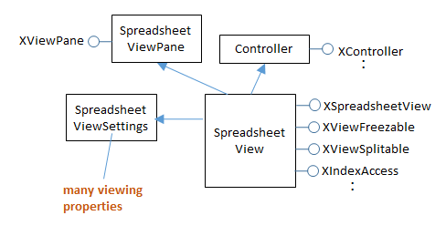

# Chapter 20. Spreadsheet Displaying and Creation 

!!! note "Topics"
    Displaying a 
    Document; Read-only 
    and Protected Viewing; 
    Active Sheets; Sheet 
    Names; Zooming; 
    Creating a Document; 
    Cell Names and Ranges; 
    Cell Values; Data 
    Arrays; Rows and 
    Columns of Data; 
    Adding a Picture and a 
    Chart 

    Example folders: "Calc 
    Tests" and "Utils" 
 
 
This chapter looks at two main topics: the display of an 
existing spreadsheet document, and the creation of a new 
document, based around two examples, ShowSheet.java 
and BuildTable.java. 

As part of displaying a document, I'll also describe how to 
use read-only and protected viewing, change the active 
sheet, use sheet names, and adjust the window view size 
by zooming. 

Document creation illustrates the use of cell names and 
ranges, the setting of cell data using arrays, rows, and columns, and adding a picture 
and a chart to a sheet. 

 
 
## 1.  Displaying a Document 

The ShowSheet.java example shows how to open a spreadsheet document, and 
display its first sheet. If the program is called with a filename argument, then the 
document is saved to that file before the program closes. The extension of the output 
filename is used to determine the exported file type.  For example: 
run ShowSheet totals.ods show.pdf 
displays the totals.ods spreadsheet, and saves it as a PDF file. Alternatively: 
run ShowSheet sorted.csv sorted.html   
opens the CSV file as a Calc document, and saves it as HTML. 

The main() function of ShowSheet.java: 
 
// in ShowSheet.java 
public static void main(String args[]) 
{   
  String outFnm = null; 
  if ((args.length < 1) || (args.length > 2)) { 
    System.out.println("Usage: run ShowSheet fnm [out-fnm]"); 
    return; 
  } 
  if (args.length == 2) 
    outFnm = args[1]; 
   
  XComponentLoader loader = Lo.loadOffice(); 
  XSpreadsheetDocument doc = Calc.openDoc(args[0], loader); 
  if (doc == null) { 
    System.out.println("Could not open " + args[0]); 
    Lo.closeOffice(); 
    return; 
  } 
 
  GUI.setVisible(doc, true); 
  Calc.gotoCell(doc, "A1");   // move view to top of sheet 
 
  // XSpreadsheet sheet = Calc.getSheet(doc, 0);  // not needed here 
 
  Lo.waitEnter();  // wait for user to press <ENTER> 
 
  if (outFnm != null) 
    Lo.saveDoc(doc, outFnm); 
  Lo.closeDoc(doc); 
  Lo.closeOffice(); 
}  // end of main() 
 
Calc.openDoc() opens the document, returning an XSpreadsheetDocument reference: 
 
// in the Calc class 
public static XSpreadsheetDocument openDoc(String fnm,  
                         XComponentLoader loader) 
{ 
  XComponent doc = Lo.openDoc(fnm, loader); 
  if (doc == null) { 
    System.out.println("Document is null"); 
    return null; 
  } 
  return getSSDoc(doc); 
}  // end of openDoc() 
 
 
public static XSpreadsheetDocument getSSDoc(XComponent doc) 
{   
  if (!Info.isDocType(doc, Lo.CALC_SERVICE)) { 
    System.out.println("Not a spreadsheet doc; closing"); 
    Lo.closeDoc(doc); 
    return null; 
  } 
  XSpreadsheetDocument ssDoc =  
                  Lo.qi(XSpreadsheetDocument.class, doc); 
  if (ssDoc == null) { 
    System.out.println("Not a spreadsheet doc; closing"); 
    Lo.closeDoc(doc); 
    return null; 
  } 
  return ssDoc; 
}  // end of getSSDoc() 
 
First Lo.openDoc() returns an XComponent reference, then getSSDoc() converts it to 
XSpreadsheetDocument. This conversion will fail if the input document isn't a 
spreadsheet. 

GUI.setVisible(true) causes Office to display the spreadsheet's active sheet, which is 
the one that was being worked on when the file was previously saved. In addition, the 
application will display the cell or cells selected in the sheet at that time. The selection 
can be changed by calling Calc.gotoCell(): 
 
// in the Calc class 
public static void gotoCell(XSpreadsheetDocument doc,  
                                               String cellName) 
{ XFrame frame = getController(doc).getFrame(); 
  gotoCell(frame, cellName); 
} 
 
 
public static XController getController(XSpreadsheetDocument doc) 
{ XModel model = Lo.qi(XModel.class, doc); 
  return model.getCurrentController(); 
} 
 
 
public static void gotoCell(XFrame frame, String cellName) 
{  Lo.dispatchCmd(frame, "GoToCell",  
            Props.makeProps("ToPoint", cellName));  } 
 
Any changes to the document's view requires a reference to its controller. The active 
cell is changed by sending a "GoToCell" dispatch to the controller's frame. 

"GoToCell" requires a cell name argument, which is encoded as a property array 
containing a single "ToPoint" property. 

Calc.getSheet() returns a reference to the currently active sheet. but that line is 
commented out in ShowSheet.java, since it's not needed. getSheet() is implemented 
using code similar to that described in the previous chapter: 
 
// in the Calc class 
public static XSpreadsheet getSheet(XSpreadsheetDocument doc,  
                                              int index) 
{ XSpreadsheets sheets = doc.getSheets(); 
  XSpreadsheet sheet = null; 
  try { 
    XIndexAccess xSheetsIdx = Lo.qi(XIndexAccess.class, sheets); 
    sheet = Lo.qi(XSpreadsheet.class,  
                                xSheetsIdx.getByIndex(index)); 
  } 
  catch (Exception e) { 
    System.out.println("Could not access spreadsheet: " + index); 
  } 
  return sheet; 
}  // end of getSheet() 
 
If the user calls ShowSheet.java with a filename argument, then Lo.saveDoc() 
performs a save to that file. saveDoc() utilizes Lo.ext2Format() to map the filename's 
extension (e.g. "pdf", "html", "xhtml") and the document type (in this case, a 
spreadsheet) to a suitable output format. The function consists of a long switch 
statement which decides on the most suitable mapping, as illustrated by the code 
fragment: 
 
// in the Lo class 
public static String ext2Format(int docType, String ext) 
{ 
  switch (ext) { 
    case "doc": return "MS Word 97"; 
    case "docx": return "Office Open XML Text"; 
       : 
       :   // many more cases 
 
    case "pdf":  
      if (docType == Lo.WRITER) 
        return "writer_pdf_Export"; 
      else if (docType == Lo.IMPRESS) 
        return "impress_pdf_Export"; 
      else if (docType == Lo.DRAW) 
        return "draw_pdf_Export"; 
      else if (docType == Lo.CALC) 
        return "calc_pdf_Export"; 
      else if (docType == Lo.MATH) 
        return "math_pdf_Export"; 
      else  
        return "writer_pdf_Export"; 
        :  // many more cases 
}   // end of ext2Format() 
 
The "pdf" case is selected when the output file extension is "pdf", but the export 
format also depends on the Office document. For ShowSheet.java, the docType value 
will be Lo.CALC, which causes ext2Format() to return "calc_pdf_Export". 

Lo.ext2Format() is very far from comprehensive, but understands Office and MS 
spreadsheet formats, CSV, RTF, text, HTML, XHTML, and PDF. Other mappings 
can be added as required. 

 
### 1.1.  Read-only and Protected Viewing 

One variant of ShowSheet.java prevents a user from changing the spreadsheet. 

Unfortunately, implementing this by opening the document read-only isn't particularly 
robust because Office always displays a message asking if the user wants to override 
the read-only setting. Nevertheless, the code is short: 
 
// commented out in ShowSheet.java 
XComponent cDoc = Lo.openReadOnlyDoc(args[0], loader); 
XSpreadsheetDocument doc = Calc.getSSDoc(cDoc); 
 
openReadOnlyDoc() calls Lo.openDoc() with the "ReadOnly" property set to true: 
 
// in the Calc class 
public static XComponent openReadOnlyDoc(String fnm,  
                                         XComponentLoader loader) 
{  return openDoc(fnm, loader,  
                Props.makeProps("Hidden", true, "ReadOnly", true) );  
} 
 
If you want to actually stop the user from changing the spreadsheet, then it must be 
protected, using the XProtectable interface: 
 
XProtectable pro = Lo.qi(XProtectable.class, doc); 
pro.protect("foobar"); 
 
XProtectable.protect() assigns a password to the sheet (in this example, "foobar"), 
which the user must supply in order to change any data . 

Document-level protection isn't supported in the current version of Office. The best 
we can do is to apply protection to individual sheets. Namely: 
 
// commented out in ShowSheet.java 
XSpreadsheet sheet = Calc.getSheet(doc, 0); // get sheet 1 
XProtectable pro = Lo.qi(XProtectable.class, sheet); 
pro.protect("foobar"); 
 
// query the user for the password 
String pwd = GUI.getPassword("Sheet protection", "Supply password:"); 
if ((pwd != null) && pwd.equals("foobar")) {  // check input 
  System.out.println("Password correct"); 
  pro.unprotect("foobar"); 
} 
else { 
  System.out.println("Password incorrect"); 
  GUI.showJMessageBox("Password Status", "Password incorrect"); 
} 
 
The code fragment above shows how to query the user for the password. 

GUI.getPassword() displays a dialog window which includes a Java JPasswordField 
component for hiding the entered data: 
 
// in the GUI class 
public static String getPassword(String title, String inputMsg)  
{ 
  JLabel jl = new JLabel(inputMsg); 
  JPasswordField jpf = new JPasswordField(24); 
  Object[] ob = {jl, jpf}; 
  int result = JOptionPane.showConfirmDialog(null, ob, title,  
                                    JOptionPane.OK_CANCEL_OPTION); 
  if (result == JOptionPane.OK_OPTION) 
    return new String(jpf.getPassword()); 
  else  
    return null; 
}  // end of getPassword() 
 
 
### 1.2.  Changing the Active Sheet 

Another variation of ShowSheet allows the user to specify which sheet to make 
active, and so be displayed in Office. It's not enough to execute Calc.getSheet() with a 
sheet index; Calc.setActiveSheet() must also be called to make that sheet active: 
 
// in the Calc class 
public static void setActiveSheet(XSpreadsheetDocument doc,  
                                     XSpreadsheet sheet) 
{ XSpreadsheetView ssView =  
          Lo.qi(XSpreadsheetView.class, getController(doc)); 
  ssView.setActiveSheet(sheet); 
}  // end of setActiveSheet() 
 
Calc.setActiveSheet() converts the controller interface for the document into an 
XSpreadsheetView, which is the main interface for the SpreadsheetView service (see 
Figure 1). 

 
 

Figure 1. The SpreadsheetView Services and Interfaces. 

 
SpreadsheetView implements a number of interfaces for affecting the user's view of a 
document. View-related properties are stored in the inherited 
SpreadsheetViewSettings class, which can be listed by calling Props.showObjProps(): 
 
// commented out in ShowSheet.java 
XSpreadsheetView ssView =  
          Lo.qi(XSpreadsheetView.class, getController(doc)); 
Props.showObjProps("Spreadsheet view", ssView); 
 
 
### 1.3.  Sheet Names 

Default spreadsheet names use "Sheet" followed by a positive integer. For example, a 
new document will name its first sheet "Sheet1". Calc.getSheet() can accept a sheet 
name, as in the following code which makes "Sheet1" active: 
 
// in ShowSheet.java 
XSpreadsheet sheet = Calc.getSheet(doc, "Sheet1"); 
Calc.setActiveSheet(doc, sheet); 
 
All the sheet names in a document can be accessed via Calc.getSheetNames(), and a 
sheet's name can be changed by Calc.setSheetName(): 
 
// in the Calc class 
public static String[] getSheetNames(XSpreadsheetDocument doc) 
{ XSpreadsheets sheets = doc.getSheets(); 
  return sheets.getElementNames(); 
} 
 
 
public static void setSheetName(XSpreadsheet sheet, String name) 
{ 
  XNamed xNamed = Lo.qi(XNamed.class, sheet); 
  if (xNamed == null) 
    System.out.println("Could not access spreadsheet"); 
  else 
    xNamed.setName(name); 
}  // end of setSheetName() 
 
 
### 1.4.  Zooming  

Zooming the view of a document is done by adjusting properties in 
SpreadsheetViewSettings (see Figure 1 above). The "ZoomType" property specifies 
the kind of zooming, which may be a size percentage or a constant indicating a 
particular zooming amount. The constants are defined in Calc.java: 
 
// in the Calc class 
public static final short OPTIMAL = 0; 
public static final short PAGE_WIDTH = 1; 
public static final short ENTIRE_PAGE = 2; 
public static final short BY_VALUE = 3; 
public static final short PAGE_WIDTH_EXACT = 4; 
 
The constants are understood by Calc.zoom():  
 
// in the Calc class 
public static void zoom(XSpreadsheetDocument doc, short type) 
{ XController ctrl = getController(doc); 
  Props.setProperty(ctrl, "ZoomType", type);   
} 
 
For example, the entire sheet can be made visible by calling: 
Calc.zoom(doc, Calc.ENTIRE_PAGE); 
For percentage zooming, the value must be assigned to the "ZoomValue" property. 

This is handled by Calc.zoomValue(): 
 
// in the Calc class 
public static void zoomValue(XSpreadsheetDocument doc, int value) 
{ 
  XController ctrl = getController(doc); 
  Props.setProperty(ctrl, "ZoomType", BY_VALUE); 
  Props.setProperty(ctrl, "ZoomValue", (short)value);          
} 
 
 
## 2.  Creating a Document 

The BuildTable.java example shows how to create a new spreadsheet document, 
populate it with data, apply cell styling, and save it to a file. I'll look at styling in the 
next chapter, and will concentrate here on the different ways to add data to a sheet. 

The main() function of BuildTable.java is: 
 
// in BuildTable.java 
public static void main(String args[]) 
{ 
  XComponentLoader loader = Lo.loadOffice(); 
  XSpreadsheetDocument doc = Calc.createDoc(loader); 
  if (doc == null) { 
    System.out.println("Document creation failed"); 
    Lo.closeOffice(); 
    return; 
  } 
  GUI.setVisible(doc, true); 
  XSpreadsheet sheet = Calc.getSheet(doc, 0); 
 
  convertAddresses(sheet); 
 
  // uncomment one of these build methods 
  // buildCells(sheet); 
  // buildRows(sheet); 
  // buildCols(sheet); 
  buildArray(sheet); 
 
  Lo.saveDoc(doc, "buildTable.ods"); 
 
  Lo.waitEnter(); 
  Lo.closeDoc(doc); 
  Lo.closeOffice(); 
}  // end of main() 
 
main() can call one of four different build methods to demonstrate various Calc.java 
functions for filling cells and cell ranges. convertAddresses() illustrates the Calc.java 
methods for converting between cell names and positions, and between cell range 
names and position intervals. 

 
### 2.1.  Switching between Cell Names, Cell Ranges, and Positions 

Although the Calc.java get/set methods for cells, columns, rows, and cell ranges 
support both name and position based addressing (e.g. "D5" and (3, 4)), it's still 
sometimes necessary to convert between the different formats. convertAddresses() 
demonstrates those methods: 
 
// in BuildTable.java 
private static void convertAddresses(XSpreadsheet sheet) 
{ 
  // cell name <--> position 
  java.awt.Point pos = Calc.getCellPosition("AA2"); 
  System.out.println("Position of AA2: (" +pos.x+", "+pos.y+")"); 
 
  XCell cell = Calc.getCell(sheet, pos.x, pos.y); 
  Calc.printCellAddress(cell); 
 
  System.out.println("AA2: " + Calc.getCellStr(pos.x, pos.y)); 
  System.out.println(); 
 
  // cell range name <--> position 
  java.awt.Point[] range = Calc.getCellRangePositions("A1:D5"); 
  System.out.println("Range of A1:D5: (" +  
                      range[0].x + ", " +  range[0].y +   
           ") -- (" + range[1].x + ", " +  range[1].y +  ")"); 
 
  XCellRange cellRange = Calc.getCellRange(sheet,  
           range[0].x, range[0].y, range[1].x, range[1].y); 
  Calc.printAddress(cellRange); 
  System.out.println("A1:D5: " +  
             Calc.getRangeStr(range[0].x, range[0].y,   
                                range[1].x, range[1].y)); 
  System.out.println(); 
}  // end of convertAddresses() 
 
convertAddresses() prints the following: 
 
Position of AA2: (26, 1) 
Cell: Sheet1.AA2 
AA2: AA2 
 
Range of A1:D5: (0, 0) -- (3, 4) 
Range: Sheet1.A1:D5 
A1:D5: A1:D5 
 
Cell Name Manipulation 
Calc.getCellPosition() converts a cell name, such as "AA2", into a (column, row) 
position coordinate, which it returns as a Java Point object. For "AA2" the result is 
(26, 1), since the column labeled "AA" follows "Z" in a spreadsheet. The 
implementation uses regular expression parsing of the input string to separate out the 
alphabetic and numerical parts before processing them: 
 
// in the Calc class 
public static Point getCellPosition(String cellName) 
{ 
   Pattern p = Pattern.compile( "([a-zA-Z]+)([0-9]+)" ); 
   Matcher m = p.matcher(cellName); 
   if (m.matches()) {  
     int nColumn = columnStringToNumber( m.group(1).toUpperCase() ); 
     int nRow = rowStringToNumber(m.group(2)); 
     return new Point(nColumn, nRow); 
   } 
   else { 
     System.out.println("No match found"); 
     return null; 
   } 
 }  // end of getCellPosition() 
 
Calc.getCell() converts a position into an XCell reference to the cell: 
XCell cell = Calc.getCell(sheet, 26, 1); 
The function is a wrapper around XCellRange.getCellByPosition(): 
 
// first version of Calc.getCell() 
public static XCell getCell(XSpreadsheet sheet, int column, int row) 
{  
  try { 
    return sheet.getCellByPosition(column, row); 
  } 
  catch (Exception e) { 
    System.out.println("Could not access cell at: " +  
                               column + " - " + row); 
    return null; 
  } 
}  // end of getCell() 
 
A second version of getCell() refers to a cell by name: 
XCell cell = Calc.getCell(sheet, "AA2"); 
The code: 
 
// 2nd version of Calc.getCell() 
public static XCell getCell(XSpreadsheet sheet, String cellName) 
{  
  XCellRange cellRange = sheet.getCellRangeByName(cellName); 
  return getCell(cellRange, 0, 0);   // calls 1st getCell() 
}  
 
The call to XCellRange.getCellRangeByName() with a single cell name returns a cell 
range made up of one cell. This XCellRange reference can be passed to Calc.getCell() 
since XCellRange is a superclass of XSpreadsheet. The first version of getCell() is 
called, and XCellRange.getCellByPosition() treats (0, 0) as a position relative to the 
cell range. There's only one cell in this range, so getCellByPosition() returns a 
reference to the "AA2" cell. 

 
Cell Range Manipulation 
The second half of convertAddresses() shows off some of the cell range addressing 
methods. Calc.getCellRangePositions() returns an array of two Java Point objects 
corresponding to the top-left and bottom-right cells of the range: 
 
// in convertAddresses() in BuildTable.java 
    : 
java.awt.Point[] range = Calc.getCellRangePositions("A1:D5"); 
System.out.println("Range of A1:D5: (" +  
                       range[0].x + ", " +  range[0].y +   
            ") -- (" + range[1].x + ", " +  range[1].y +  ")"); 
 
Only simple cell range names of the form <cell name> ':' <cell name> are understood 
by my functions. Range operators, such as "~", "!", and absolute references using "$" 
aren't supported. 

Calc.getCellRange() converts a range address into an XCellRange reference: 
XCellRange cellRange = Calc.getCellRange(sheet, "A1:D5"); 
This method wraps a call to XCellRange.getCellRangeByName(): 
 
// in the Calc class 
public static XCellRange getCellRange(XSpreadsheet sheet,  
                                              String rangeName) 
{ XCellRange cellRange = sheet.getCellRangeByName(rangeName); 
  if (cellRange == null) 
    System.out.println("Could not access: \"" + rangeName + "\"" ); 
  return cellRange; 
} 
 
 
### 2.2.  Changing Cell Values 

Back in BuildTable.java, the buildCells() methods shows how individual cells can be 
assigned values. The code uses two versions of Calc.setVal(), one that accepts a cell 
position, the other a cell name. For example: 
 
// in buildCells() in BuildTable.java 
   : 
Calc.setVal(sheet, "B2", 31.45);    // name 
Calc.setVal(sheet, 1, 0, "JAN");    // (column, row) 
 
Both methods store a number or a string in a cell, by processing the input value as an 
Object: 
 
// in the Calc class 
public static void setVal(XSpreadsheet sheet,  
                               String cellName, Object value) 
// save value using cell name 
{ Point pos = getCellPosition(cellName); 
  setVal(sheet, pos.x, pos.y, value);  // column, row 
}  
 
 
public static void setVal(XSpreadsheet sheet,  
                           int column, int row, Object value) 
// save value using cell position 
{ XCell cell = getCell(sheet, column, row); 
  setVal(cell, value); 
}  
 
 
public static void setVal(XCell cell, Object value) 
// decide how to save value based on its type 
{  
  if (value instanceof Number) 
    cell.setValue( convertToDouble(value)); 
  else if (value instanceof String) 
    cell.setFormula((String)value); 
  else 
    System.out.println("Value is not a number/string: " + value); 
}  // end of setVal() 
 
The third setVal() function examines the type of the value to decide whether to call 
XCell.setValue() or XCell.setFormula(). 

 
### 2.3.  Storing 2D Arrays of Data 

The buildArray() method in BuildTables.java shows how a block of data can be stored 
by Calc.setArray(): 
 
// in BuildTable.java 
private static void buildArray(XSpreadsheet sheet) 
{ 
  Object[][] vals = { 
               {"", "JAN", "FEB", "MAR", "APR", "MAY", "JUN", 
                     "JUL", "AUG", "SEP", "OCT", "NOV", "DEC"}, 
               {"Smith", 42, 58.9, -66.5, 43.4, 44.5, 45.3,  
                        -67.3, 30.5, 23.2, -97.3, 22.4, 23.5}, 
               {"Jones", 21, 40.9, -57.5, -23.4, 34.5, 59.3,  
                         27.3, -38.5, 43.2, 57.3, 25.4, 28.5}, 
               {"Brown", 31.45, -20.9, -117.5, 23.4, -114.5, 115.3,  
                         -171.3, 89.5, 41.2, 71.3, 25.4, 38.5} 
            }; 
  Calc.setArray(sheet, "A1:M4", vals); 
 
  Calc.setVal(sheet, "N1", "SUM"); 
  Calc.setVal(sheet, "N2", "=SUM(B2:M2)"); 
  Calc.setVal(sheet, "N3", "=SUM(B3:M3)"); 
  Calc.setVal(sheet, "N4", "=SUM(A4:L4)"); 
}  // end of buildArray() 
 
Calc.setArray() accepts a 2D array of Object values (which means it can contain a 
mix of strings and doubles) with the data arranged in row-order. For example, the data 
shown above is stored in the sheet as in Figure 2. 

 
 

Figure 2. A Block of Data Added to a Sheet. 

 
The second argument of Calc.setArray() can be a cell range or a single cell name 
representing the top-left corner of the range. In the latter case, the cell range is 
calculated from the size of the array. This means that the call used above could be 
rewritten as: 
Calc.setArray(sheet, "A1", vals);  // string was "A1:M4" 
Calc.setArray() is defined as: 
 
// in the Calc class 
public static void setArray(XSpreadsheet sheet,  
                         String name, Object[][] values) 
// decide how sheet area is referred to by name 
{ 
  if (isCellRangeName(name)) 
    setArrayRange(sheet, name, values); 
  else   // is a cell name 
    setArrayCell(sheet, name, values); 
}  // end of setArray() 
 
 
public static void setArrayRange(XSpreadsheet sheet,  
                        String rangeName, Object[][] values) 
// store array using cell range name 
{ XCellRange cellRange = getCellRange(sheet, rangeName); 
  setCellRangeArray(cellRange, values); 
}  // end of setArrayRange() 
 
 
public static void setArrayCell(XSpreadsheet sheet,  
                           String cellName, Object[][] values) 
// store array using cell name 
{ 
  // calculate cell range name using array size 
  Point pos = getCellPosition(cellName); 
  int colEnd = pos.x + values[0].length-1; 
  int rowEnd = pos.y + values.length-1; 
  XCellRange cellRange =  
            getCellRange(sheet, pos.x, pos.y, colEnd, rowEnd); 
  setCellRangeArray(cellRange, values); 
}  // end of setArrayCell() 
 
 
public static void setCellRangeArray(XCellRange cellRange,  
                                     Object[][] values) 
// store the array as data in the cell range 
{ XCellRangeData crData = Lo.qi(XCellRangeData.class, cellRange); 
  crData.setDataArray(values); 
}  // end of setCellRangeArray() 
 
The storage of the array is performed by Calc.setCellRangeArray() which is passed an 
XCellRange object and a 2D array. XCellRange is converted into XCellRangeData 
which has a setDataArray() method. 

 
### 2.4.  Storing Rows of Data 

Calc.setRow() lets the programmer store a 1D array as a row of data: 
 
Calc.setRow(sheet, "B2",   
           new Object[] {42, 58.9, -66.5, 43.4, 44.5, 45.3,  
                         -67.3, 30.5, 23.2, -97.3, 22.4, 23.5}); 
 
Calc.setRow() employs XCellRangeData.setDataArray(), which requires an 
XCellRange object and a 2D array: 
 
// in the Calc class 
public static void setRow(XSpreadsheet sheet,  
                           String cellName, Object[] values) 
// store values in row using cell name 
{ Point pos = getCellPosition(cellName); 
  setRow(sheet, pos.x, pos.y, values);    // column, row 
} 
 
 
public static void setRow(XSpreadsheet sheet, 
                       int colStart, int rowStart, Object[] values) 
// store values in row starting at (colstart, rowstart) 
{ 
  XCellRange cellRange = getCellRange(sheet, colStart, rowStart, 
                            colStart + values.length-1, rowStart); 
      // calculate cell range based on array size 
  XCellRangeData crData = Lo.qi(XCellRangeData.class, cellRange); 
  crData.setDataArray( new Object[][]{values});    
       // store the row as a 2D array containing one row of data 
}  // end of setRow() 
 
 
### 2.5.  Storing Columns of Data 

Calc.setCol() lets the programmer store a column of data, as shown in 
BuildTable.java in its buildCols() method: 
 
// in BuildTable.java 
private static void buildCols(XSpreadsheet sheet) 
{ 
  Calc.setCol(sheet, "A2",  
        new Object[] {"JAN", "FEB", "MAR", "APR", "MAY", "JUN", 
                      "JUL", "AUG", "SEP", "OCT", "NOV", "DEC"}); 
  Calc.setVal(sheet, "A14", "SUM"); 
 
  Calc.setVal(sheet, "B1", "Smith"); 
  Calc.setCol(sheet, "B2",   
        new Object[] {42, 58.9, -66.5, 43.4, 44.5, 45.3,  
                     -67.3, 30.5, 23.2, -97.3, 22.4, 23.5}); 
  Calc.setVal(sheet, "B14", "=SUM(B2:M2)"); 
 
  Calc.setVal(sheet, 2, 0, "Jones"); 
  Calc.setCol(sheet, 2, 1,   
        new Object[] {21, 40.9, -57.5, -23.4, 34.5, 59.3,  
                      27.3, -38.5, 43.2, 57.3, 25.4, 28.5}); 
  Calc.setVal(sheet, 2, 13, "=SUM(B3:M3)"); 
 
  Calc.setVal(sheet, 3, 0, "Brown"); 
  Calc.setCol(sheet, 3, 1,   
        new Object[] {31.45, -20.9, -117.5, 23.4, -114.5, 115.3,  
                     -171.3, 89.5, 41.2, 71.3, 25.4, 38.5}); 
  Calc.setVal(sheet, 3, 13, "=SUM(A4:L4)"); 
}  // end of buildCols() 
 
buildCols() creates the spreadsheet shown in Figure 3. 

 
 

Figure 3. Columns of Data in a Sheet. 

 
Column creation is a little harder than row building since it's not possible to use 
XCellRangeData.setDataArray() which assumes that data is row-ordered. Instead 
Calc.setCol() calls Calc.setVal() in a loop: 
 
// in the Calc class 
public static void setCol(XSpreadsheet sheet,  
                       String cellName, Object[] values) 
// store values in column using cell name 
{ Point pos = getCellPosition(cellName); 
  setCol(sheet, pos.x, pos.y, values);    // column, row 
} 
 
 
public static void setCol(XSpreadsheet sheet, 
                    int colStart, int rowStart, Object[] values) 
// store values down a column starting at (colstart, rowstart) 
{ 
 XCellRange cellRange = getCellRange(sheet, colStart, rowStart, 
                            colStart, rowStart + values.length-1); 
    // calculate cell range from data size 
  XCell xCell = null; 
  for (int i = 0; i < values.length; i++) { 
    xCell = getCell(cellRange, 0, i);     // column -- row 
    setVal(xCell, values[i]); 
  } 
}  // end of setCol() 
 
 
### 2.6.  Adding a Picture 

Adding an image to a spreadsheet is straightforward since every sheet is also a draw 
page. The Spreadsheet service has an XDrawPageSupplier interface, which has a 
getDrawPage() method. The returned XDrawPage reference points to a transparent 
drawing surface that lies over the top of the sheet.  

Adding a picture is done by calling Draw.drawImage(): 
 
// in addPic() in BuildTables.java 
XDrawPageSupplier dpSupp = Lo.qi(XDrawPageSupplier.class, sheet); 
XDrawPage page = dpSupp.getDrawPage(); 
Draw.drawImage(page, "skinner.png", 50, 40); 
    : 
 
The (50, 40) passed to Draw.drawImage() is the (x, y) offset from the top-left corner 
of the sheet, specified in millimeters. This method comes from my Draw.java support 
class, explained in Part 3. 

 
Warning when Drawing 
Many of the Draw.java methods take a document argument, such as 
Draw.getSlidesCount() which returns the number of draw pages in the document: 
 
System.out.println("No of draw pages: " +  
                             Draw.getSlidesCount(doc)); 
 
These methods assume that the document argument can be cast to XComponent. For 
instance, the function prototype for getSlidesCount() is: 
int getSlidesCount(XComponent doc); 
Unfortunately, this casting will not work with spreadsheet documents because 
XSpreadsheetDocument doesn't inherit XComponent. Instead the 
XSpreadsheetDocument interface must be explicitly converted to XComponent first, 
as in: 
 
// in addPic() in BuildTables.java 
XComponent compDoc = Lo.qi(XComponent.class, doc); 
System.out.println("No of draw pages: " +  
                             Draw.getSlidesCount(compDoc)); 
 
### 2.7.  Adding a Chart 

I'll be discussing charting at length in Part 5, but I'll give a taster of it here since a 
CellRangeAddress object is used to pass data to the charting methods. For example, 
the cell range for "A1:N4" is passed to Chart2.insertChart(): 
 
// commented out code in BuildTables.java 
CellRangeAddress rangeAddr =  Calc.getAddress(sheet, "A1:N4"); 
Chart2.insertChart(sheet, rangeAddr, "D6", 21, 11, "Column"); 
 
The other arguments used by Chart2.insertChart() are a cell name, the millimeter 
width and height of the generated chart, and a chart type string. The named cell acts as 
an anchor point for the top-left corner of the chart. Figure 4 shows what the resulting 
chart looks like. 

 
 

Figure 4. A Column Chart in a Spreadsheet. 

 
