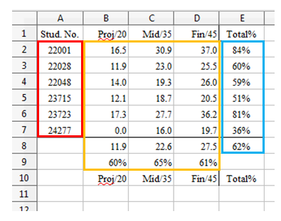

# Chapter 21. Extracting Data 
 
 
This chapter is about extracting data from a spreadsheet. 

Two types of extraction are described: methods which are 
supplied with a predetermined cell range in order to obtain 
data from cells, rows, columns, and 2D regions. The other 
type of extraction uses cell ranges generated at run time 
based on content queries applied to the entire used area of 
the sheet. This approach requires the use of sheet cursors. 

All the example code comes from ExtractNums.java, 
which examines the "small totals.ods" spreadsheet shown in Figure 1. 

 
 

Figure 1. The "small totals.ods" Spreadsheet. 

 
Numerical data is stored in the cell range A2:D7 and the rest of the values are 
calculated using formulae. 

ExtracNums.java starts by accessing cells and cell ranges by name: 
 
// in ExtractNums.java 
public static void main(String args[]) 
{   
  String outFnm = null; 
  if (args.length != 1) { 
    System.out.println("Usage: run ExtractNums fnm"); 
    return; 
  } 
   
  XComponentLoader loader = Lo.loadOffice(); 
  XSpreadsheetDocument doc = Calc.openDoc(args[0], loader); 
  if (doc == null) { 

!!! note "Topics"
    Getting a Cell 
Value; Getting the Data 
from a Cell Range; 
Getting Rows and 
Columns of Data;  
Obtaining Cell Ranges 
by Using Queries; 
Finding the Used Area 
with Sheet Cursors 
Example folders: "Calc 
Tests" and "Utils" 
    System.out.println("Could not open " + args[0]); 
    Lo.closeOffice(); 
    return; 
  } 
  GUI.setVisible(doc, true); 
  XSpreadsheet sheet = Calc.getSheet(doc, 0); 
 
  System.out.println("\nA1 string: " + Calc.getVal(sheet, "A1")); 
 
  XCell cell = Calc.getCell(sheet, "A2"); 
  System.out.println("A2 type: " + Calc.getTypeString(cell)); 
  System.out.println("A2 value: " + Calc.getNum(sheet, "A2")); 
 
  cell = Calc.getCell(sheet, "E2"); 
  System.out.println("E2 type: " + Calc.getTypeString(cell)); 
  System.out.println("E2 formula: " + Calc.getVal(sheet, "E2")); 
  System.out.println(); 
 
  Object[][] data = Calc.getArray(sheet, "A1:E10"); 
  Calc.printArray(data); 
 
  double[][] ids = Calc.getDoublesArray(sheet, "A2:A7"); 
  Calc.printArray(ids); 
 
  double[] projs = Calc.convertToDoubles(  
                             Calc.getCol(sheet, "B2:B7")); 
  System.out.println("Project scores"); 
  for(double proj : projs) 
    System.out.println("  " + proj); 
 
  double[] stud = Calc.convertToDoubles(  
                             Calc.getRow(sheet, "A4:E4")); 
  System.out.println("\nStudent scores"); 
  for(double v : stud) 
    System.out.println("  " + v); 
 
   : // more complex extraction code, explained later 
 
  Lo.waitEnter(); 
  Lo.closeDoc(doc); 
  Lo.closeOffice(); 
}  // end of main() 
 
The output is: 
 
A1 string: Stud. No. 

A2 type: VALUE 
A2 value: 22001.0 
E2 type: FORMULA 
E2 formula: =SUM(B2:D2)/100 
 
Row x Column size: 10 x 5 
  Stud. No.  Proj/20  Mid/35  Fin/45  Total% 
  22001.0  16.4583333333333  30.9166666666667  37.0125  0.843875 
  22028.0  11.875  23.0416666666667  25.4625  0.6037916666666671 
  22048.0  13.9583333333333  19.25  25.9875  0.591958333333333 
  23715.0  12.0833333333333  18.6666666666667  20.475  0.51225 
  23723.0  17.2916666666667  27.7083333333333  36.225  0.81225 
  24277.0  0.0  16.0416666666667  19.6875  0.357291666666667 
    11.9444444444444  22.6041666666667  27.475  0.6202361111111111 
    0.5972222222222221  0.645833333333334  0.6105555555555561 
    Proj/20  Mid/35  Fin/45  Total% 
 
Row x Column size: 6 x 1 
  22001.0 
  22028.0 
  22048.0 
  23715.0 
  23723.0 
  24277.0 
 
Project scores 
  16.4583333333333 
  11.875 
  13.9583333333333 
  12.0833333333333 
  17.2916666666667 
  0.0 
 
Student scores 
  22048.0 
  13.9583333333333 
  19.25 
  25.9875 
  0.591958333333333 
 
I'll explain the highlighted get methods in the following sections. 

 
 
## 1.  Getting a Cell Value 

There are three versions of Calc.getVal() which access a value by cell name or 
position: 
 
// in the Calc class 
public static Object getVal(XSpreadsheet sheet, String cellName) 
// get value by cell name 
{ Point pos = getCellPosition(cellName); 
  return getVal(sheet, pos.x, pos.y);  // column, row 
}  // end of getVal() 
 
 
public static Object getVal(XSpreadsheet sheet,  
                                       int column, int row) 
// get value by cell position 
{ XCell xCell = getCell(sheet, column, row); 
  return getVal(xCell, column, row);  
}  // end of getVal() 
 
 
public static Object getVal(XCell cell, int column, int row) 
// get value based on the type of the data in the cell 
{  
  CellContentType type = cell.getType(); 
  if (type == CellContentType.EMPTY) 
    return null; 
  else if (type == CellContentType.VALUE) 
    return new Double( cell.getValue()); 
  else if ((type == CellContentType.TEXT) ||  
           (type == CellContentType.FORMULA)) 
    return cell.getFormula(); 
  else { 
    System.out.println("Unknown cell type; returning null"); 
    return null; 
  } 
}  // end of getVal() 
 
The third getVal() utilizes XCell.getType() to decide how to extract the value. A cell 
may contain four different data types: a number, text, a formula, or be empty. When 
the data is numerical, the double value is accessed by calling XCell.getValue(), while 
for text or a formula XCell.getFormula() is employed. getVal() returns these different 
types of data cast to Object.  

This return type may be inconvenient for a user, who might have to cast the result to 
something more specific, such as a double. The support functions include  
Calc.getNum() which does this task.  

There's also Calc.getTypeString() which returns cell type information as a string: 
 
// in the Calc class 
public static String getTypeString(XCell cell) 
{  
  CellContentType type = cell.getType(); 
  if (type == CellContentType.EMPTY) 
    return "EMPTY"; 
  else if (type == CellContentType.VALUE) 
    return "VALUE"; 
  else if (type == CellContentType.TEXT) 
    return "TEXT"; 
  else if (type == CellContentType.FORMULA) 
    return "FORMULA"; 
  else { 
    System.out.println("Unknown cell type"); 
    return "??"; 
  } 
}  // end of getTypeString() 
 
 
## 2.  Getting the Data from a Cell Range 

Calc.getArray() extracts the data from a cell range as a 2D array of Objects. It utilizes 
XCellRangeData.getDataArray(): 
 
// in the Calc class 
public static Object[][] getArray(XSpreadsheet sheet,  
                                         String rangeName) 
{ XCellRange cellRange = getCellRange(sheet, rangeName); 
  XCellRangeData crData  = Lo.qi(XCellRangeData.class, cellRange); 
  return crData.getDataArray(); 
}  // end of getArray() 
 
XCellRangeData.getDataArray() evaluates any formulae it encounters. This can be 
seen in the output from: 
// part of ExtractNum.java 
Object[][] data = Calc.getArray(sheet, "A1:E10"); 
The cell range includes several formulae (e.g. in "E8" and "E9"), but the data array 
contains their numerical values. 

If you don't want formulae to be evaluated then you'll need to implement your own 
version of getArray() which uses XCellRangeFormula. Its getDataArray() method 
doesn't process formulae. The code would look something like: 
 
XCellRange cellRange = getCellRange(sheet, rangeName); 
XCellRangeFormula crForm  =  
                 Lo.qi(XCellRangeFormula.class, cellRange); 
return crForm.getDataArray(); 
 
Calc.getArray() returns a 2D array of Objects. Calc.getDoublesArray() can be 
employed to cast them to an array of doubles. 

 
 
## 3.  Getting Rows and Columns of Data 

Calc.getRow() extracts a row of data by utilizing Calc.getArray() since the array is in 
row-major order: 
 
// in the Calc class 
public static Object[] getRow(XSpreadsheet sheet, String rangeName) 
{ 
  Object[][] vals = getArray(sheet, rangeName); 
  return extractRow(vals, 0);   // assumes user wants 1st row 
}  // end of getRow() 
 
 
public static Object[] extractRow(Object[][] vals, int rowIdx) 
// get specified row index from vals 
{ 
  int rowSize = vals.length; 
  if ((rowIdx < 0) || (rowIdx > rowSize-1)) { 
    System.out.println("Row index out of range"); 
    return null; 
  } 
  else  
    return vals[rowIdx]; 
}  // end of extractRow() 
 
Calc.getRow() defaults to extracting the first row in the 2D array returned by 
Calc.getArray(), but it's possible to obtain other rows by directly calling 
Calc.extractRow(). 

Extracting a column from a sheet is more tricky since Calc.extractCol() must navigate 
the row-ordered array returned by Calc.getArray(). The retrieved column is returned 
as a 1D array: 
 
// in the Calc class 
public static Object[] getCol(XSpreadsheet sheet, String rangeName) 
{ 
  Object[][] vals = getArray(sheet, rangeName); 
  return extractCol(vals, 0);      // assumes user wants 1st column 
}  // end of getCol() 
 
 
public static Object[] extractCol(Object[][] vals, int colIdx) 
// extract the specified column index from vals 
{ 
  int rowSize = vals.length; 
  int colSize = vals[0].length;     
          // assumes all columns are this length 
 
  if ((colIdx < 0) || (colIdx > colSize-1)) { 
    System.out.println("Column index out of range"); 
    return null; 
  } 
  else { 
    Object[] colVals = new Object[rowSize]; 
    for (int row = 0; row < rowSize; row++) 
      colVals[row] = vals[row][colIdx]; 
    return colVals; 
  } 
}  // end of extractCol() 
 
 
## 4.  Obtaining Cell Ranges by Using Queries 

A drawback of extracting data from a spreadsheet with getVal(), getArray(), 
getRow(), and getCol() is that they require the programmer to supply cell names or 
ranges. In other words, the location of the data must be known beforehand. For 
example, the call: 
double[][] ids = Calc.getDoublesArray(sheet, "A2:A7"); 
assumes that the data is located in the "A2:A7" range. 

A more flexible approach is offered by the SheetRangesQuery service, which can 
search for a cell range (or ranges) satisfying a content query. For example, it can 
return a sequence of cell ranges that cover all the numerical data in the sheet, or cell 
ranges for all the formulae. 

The search area for these queries is usually the entire used part of a sheet, which are 
all the cells containing numbers, text, or formulae. Obtaining this area involves sheet 
cursors, but the details are hidden inside Calc.findUsedRange().  

The following code fragment illustrates how Calc.findUsedRange() and the 
SheetRangesQuery service can be used together : 
 
// the second half of ExtractNums.java 
      : 
// get the cell range which spans the used area of the sheet 
XCellRange usedCellRange = Calc.findUsedRange(sheet); 
 
// find cell ranges that cover all the numerical cells 
XCellRangesQuery crQuery =  
                Lo.qi(XCellRangesQuery.class, usedCellRange); 
XSheetCellRanges cellRanges =   
                crQuery.queryContentCells((short) CellFlags.VALUE); 
 
The cell range returned by Calc.findUsedRange() is converted to XCellRangesQuery, 
which contains the SheetRangesQuery methods. 

XCellRangesQuery.queryContentCells() is passed the CellFlags.VALUE constant so 
that the search will returns ranges that cover all the numerical data.  

The SheetRangesQuery service is inherited by SheetCell, SheetCellRange, and 
SheetCellRanges, as summarized in Figure 2. 

 
 

Figure 2. The SheetRangesQuery Services and Interfaces. 

 
The XFormulaQuery interface is used to find cells that are used by a formula, or cells 
that utilize a formula's result. 

The CellFlags constants used in XCellRangesQuery.queryContentCells() are 
documented at 
http://api.libreoffice.org/docs/idl/ref/namespacecom_1_1sun_1_1star_1_1sheet_1_1C
ellFlags.html#a0f9444c5a241b2cd5f34553b05a18ca8, or use lodoc cellflags. 

The constants can be combined with bit operations, such as "|". For instance, the 
query: 
 
XSheetCellRanges cellRanges =  crQuery.queryContentCells( 
                (short) (CellFlags.VALUE | CellFlags.FORMULA)); 
 
finds all the cell ranges that contain numbers or formulae. 

The XSheetCellRanges object is most easily processed as an array of cell range 
addresses: 
CellRangeAddress[] addrs = cellRanges.getRangeAddresses(); 
The following code prints out each range address and the numerical data in the range: 
 
 // part of ExtractNums.java 
     : 
 if (cellRanges == null) 
   System.out.println("No cell ranges found"); 
 else { 
   System.out.println("Found cell ranges: " + 
                   cellRanges.getRangeAddressesAsString() + "\n"); 
 
   CellRangeAddress[] addrs = cellRanges.getRangeAddresses(); 
   System.out.println("Cell ranges (" + addrs.length + "):"); 
   for(CellRangeAddress addr : addrs) { 
     Calc.printAddress(addr); 
     double[][] vals = Calc.getDoublesArray(sheet,  
                                     Calc.getRangeStr(addr)); 
    Calc.printArray(vals); 
  } 
} 
 
For the "small totals.ods" spreadsheet shown in Figure 1, the output is: 
 
Found cell ranges: Marks.A2:D7 
 
Cell ranges (1): 
Range: Sheet1.A2:D7 
Row x Column size: 6 x 4 
  22001.0  16.4583333333333  30.9166666666667  37.0125 
  22028.0  11.875  23.0416666666667  25.4625 
  22048.0  13.9583333333333  19.25  25.9875 
  23715.0  12.0833333333333  18.6666666666667  20.475 
  23723.0  17.2916666666667  27.7083333333333  36.225 
  24277.0  0.0  16.0416666666667  19.6875 
 
The query found the range A2:D7, which excludes the labels on the first row, and the 
formula down the "E column and along rows "8" and "9" (see Figure 1). These 
formulae could be included by modifying the query: 
 
XSheetCellRanges cellRanges =  crQuery.queryContentCells( 
                  (short) (CellFlags.VALUE | CellFlags.FORMULA)); 
 
The output changes to: 
 
Found cell ranges: Marks.A2:A7,Marks.B2:D9,Marks.E2:E8 
 
Cell ranges (3): 
Range: Sheet1.A2:A7 
Row x Column size: 6 x 1 
  22001.0 
  22028.0 
  22048.0 
  23715.0 
  23723.0 
  24277.0 
 
Range: Sheet1.B2:D9 
Row x Column size: 8 x 3 
  16.4583333333333  30.9166666666667  37.0125 
  11.875  23.0416666666667  25.4625 
  13.9583333333333  19.25  25.9875 
  12.0833333333333  18.6666666666667  20.475 
  17.2916666666667  27.7083333333333  36.225 
  0.0  16.0416666666667  19.6875 
  11.9444444444444  22.6041666666667  27.475 
  0.5972222222222221  0.645833333333334  0.6105555555555561 
 
Range: Sheet1.E2:E8 
Row x Column size: 7 x 1 
  0.8438749999999999 
  0.6037916666666671 
  0.591958333333333 
  0.5122500000000001 
  0.81225 
  0.357291666666667 
  0.6202361111111111 
 
The query returned three cell ranges. I thought they would be the numerical region (as 
before) and two ranges covering the formulae down the "E" column and along rows 
"8" and "9". Instead, the regions are those highlighted in Figure 3. 

 
 

Figure 3. The Cell Ranges Returned by the Value+Formula Query. 

 
The shape of these ranges suggests that they're chosen to maximize column length. 

Also searching for two content types (e.g. numbers and formulae) means that a single 
cell range may contain both types of data. 

 
 
## 5.  Finding the Used Area with Sheet Cursors 

The previous section relied on Calc.findUsedRange() to retrieve the sheet's used area; 
this section explains how that method is implemented using sheet cursors. 

A sheet cursor is analogous to a text cursor but moves across cells in a spreadsheet. 

As the cursor is moved, its cell range can be expanded or collapsed in a variety of 
ways, which parallels the selection of text by a text cursor. 

Calc.findUsedRange() creates a cursor and then calls findUsedCursor() to expand its 
cell range over the used area: 
 
// in the Calc class 
public static XCellRange findUsedRange(XSpreadsheet sheet) 
{ XSheetCellCursor cursor = sheet.createCursor(); 
  return findUsedCursor(cursor); 
} 
 
 
public static XCellRange findUsedCursor(XSheetCellCursor cursor) 
{ 
  // use the cursor to select the used area 
  XUsedAreaCursor uaCursor = Lo.qi(XUsedAreaCursor.class, cursor); 
  uaCursor.gotoStartOfUsedArea(false);  // find start of area 
  uaCursor.gotoEndOfUsedArea(true);     // select to end 
 
  XCellRange usedRange = Lo.qi(XCellRange.class, uaCursor); 
  return usedRange; 
}   // end of findUsedCursor() 
 
Figure 4 shows the services and interfaces related to sheet cursors. 

Calc.findUsedRange() employs the XSheetCellCursor interface. 

 

Figure 4. The SheetCellCursor Services and Interfaces. 

 
An XSheetCellCursor cursor is assigned to a sheet by calling 
XSpreadsheet.createCursor() or XSpreadsheet.createCursorByRange().  

Calc.findUsedRange() needs the ability to find the sheet's used area, which is obtained 
by converting XSheetCellCursor into XUsedAreaCursor (see Figure 4): 
 
// in Calc.findUsedCursor() 
XUsedAreaCursor uaCursor = Lo.qi(XUsedAreaCursor.class, cursor); 
uaCursor.gotoStartOfUsedArea(false); 
uaCursor.gotoEndOfUsedArea(true); 
 
The goto methods move the cursor to the start and end of the used area, and by calling 
gotoEndOfUsedArea() with a true flag, the cursor's cell range is extended from the 
start of the used area to its end.  

The cell range is retrieved by converting the cursor into a XCellRange: 
XCellRange usedRange = Lo.qi(XCellRange.class, uaCursor); 
 
