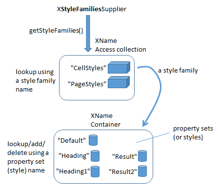
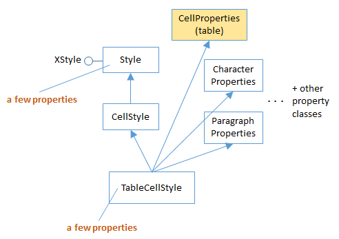

# Chapter 22. Styles

!!! note "Topics"
    Obtaining Style
    Information:  the
    TableCellStyle and
    TablePageStyle
    Services;  Creating and
    Using a New Style;
    Adding Borders

    Example folders: "Calc
    Tests" and "Utils"


This chapter looks at how spreadsheet styles are stored,
how they can be examined, and how new styles can be
instantiated and used.


## 1.  Obtaining Style Information

Calc uses the same style API as Writer, Draw, and Impress documents. Figure 1
shows its structure.




Figure 1. Calc Style Families and their Property Sets.


The Calc API only has two style families, CellStyles and PageStyles. A cell style can
be applied to a cell, a cell range, or a spreadsheet (which is a very big cell range). A
page style can be applied only to a spreadsheet.

Each style family consists of styles, which are collection of property sets. The default
cell style is called "Default", as is the default page style.

The StylesAllInfo.java example prints out the style family names and the style names
associated with the input document:

```java
// in StylesAllInfo.java
public static void main(String args[])
{
  if (args.length < 1) {
    System.out.println("Usage: run StylesAllInfo <fnm>");
    return;
  }

  XComponentLoader loader = Lo.loadOffice();
  XComponent doc = Lo.openDoc(args[0], loader);
  if (doc == null) {
    System.out.println("Could not open " + args[0]);
    Lo.closeOffice();
    return;
  }

  // get all the style families for this document
  String[] styleFamilies = Info.getStyleFamilyNames(doc);
  System.out.println("Style Family Names (" +
                             styleFamilies.length + "): ");
  for(String styleFamily : styleFamilies)
    System.out.println("  " + styleFamily);
  System.out.println();

  // list all the style names for each style family
  for(int i=0; i < styleFamilies.length; i++) {
    String styleFamily = styleFamilies[i];
    System.out.println((i+1) + ". \"" + styleFamily +
                                         "\" Family styles:");
    String[] styleNames = Info.getStyleNames(doc, styleFamily);
    Lo.printNames(styleNames);
  }

  Lo.closeDoc(doc);
  Lo.closeOffice();
}  // end of main()
```

This code uses the Info.getStyleFamilyNames() and Info.getStyleNames() functions
which I utilized in earlier chapters, so I won't explain their implementation again. The
output for a simple spreadsheet is:

```
Style Family Names (2):
  CellStyles
  PageStyles

1.  "CellStyles" Family styles:

No. of names: 5
  "Default"  "Heading"  "Heading1"  "Result"
  "Result2"


2.  "PageStyles" Family styles:

No. of names: 2
  "Default"  "Report"
```

#### Finding Style Information

From a programming point of view, the main difficult with styles is finding
documentation about their properties, so that a value can be correctly read or changed.

One approach is to use my Info.getStyleProps() method to list the properties for a
given style family and style name. For example, the following displays all the
properties for the default cell and page styles:

```java
// commented out code in StylesAllInfo.java
Props.showProps("CellStyles Default",
                  Info.getStyleProps(doc, "CellStyles", "Default") );

Props.showProps("PageStyles Default",
                 Info.getStyleProps(doc, "PageStyles", "Default") );
```

The problem is that the output is extremely long, and some property names are less
descriptive/understandable than others.

It's probably better to search the online documentation for properties. Cell styles are
managed by the TableCellStyle service (see Figure 22) and page styles by the
TablePageStyle service (Figure 23). Use `lodoc TableCellStyle` and
`lodoc TablePageStyle` to access the online information.

The properties managed by TableCellStyle are inherited from a number of places, as
summarized by Figure 2.




Figure 2. The TableCellStyle Service.


By far the most important source of cell style properties is the CellProperties class in
the table module (use `lodoc cellproperties service`). However, if a property
relates to the text in a cell then it's more likely to originate from the
CharacterProperties or ParagraphProperties classes in the style module (e.g. use
`lodoc characterproperties service`).

The properties managed by TablePageStyle are also inherited from a few places, as
summarized by Figure 3.


Figure 3. The TablePageStyle Service.


The main place to look for page properties is the PageProperties class in the style
module (e.g. use `lodoc pageproperties service`). The properties relate to things
such as page margins, headers, and footers, which become important when printing a
sheet.


## 2.  Creating and Using New Styles

The steps required in creating and using a new style are illustrated by
BuildTables.java, in createStyles() and applyStyles():

```java
// in BuildTables.java
// globals
private static String HEADER_STYLE_NAME = "My HeaderStyle";
private static String DATA_STYLE_NAME = "My DataStyle";


public static void main(String args[])
{
  XComponentLoader loader = Lo.loadOffice();
  XSpreadsheetDocument doc = Calc.createDoc(loader);
  if (doc == null) {
    System.out.println("Document creation failed");
    Lo.closeOffice();
    return;
  }
  GUI.setVisible(doc, true);
  XSpreadsheet sheet = Calc.getSheet(doc, 0);

  buildArray(sheet);
  createStyles(doc);
  applyStyles(sheet);

  Lo.saveDoc(doc, "buildTable.ods");
  Lo.waitEnter();
  Lo.closeDoc(doc);
  Lo.closeOffice();
}  // end of main()
```

createStyles() creates two cell styles called "My HeaderStyle" and "My DataStyle",
which are applied to the spreadsheet by applyStyles(). The result is shown in Figure 4.


Figure 4. Styled Spreadsheet Cells.


The "My HeaderStyle" style is applied to the top row and the first column: the cells
are colored blue, and the text made white and centered. The "My DataStyle" is used
for the numerical data and formulae cells: the background color is made a light blue,
and the text is right-justified. applyStyles() also changes the border properties of the
bottom edges of the cells in the last row to be thick and blue.

The resulting spreadsheet is saved in "buildTable.ods". If this document is examined
by the StylesAllInfo.java program, it lists the new styles in the "CellStyles" family:

```
> run StylesAllInfo buildTable.ods
Loading Office...

Opening buildTable.ods
Style Family Names (2):
  CellStyles
  PageStyles


1.  "CellStyles" Family styles:

No. of names: 7
  "Default"  "Heading"  "Heading1"  "My DataStyle"
  "My HeaderStyle"  "Result"  "Result2"


2.  "PageStyles" Family styles:

No. of names: 2
  "Default"  "Report"

Closing the document
Closing Office
Office terminated
```

### 2.1.  Creating a New Style

BuildTables.java calls createStyles() to create two styles:

```java
// in BuildTables.java
public static void createStyles(XSpreadsheetDocument doc)
// create HEADER_STYLE_NAME and
// DATA_STYLE_NAME cell styles
{
  try {
    XStyle style1 = Calc.createCellStyle(doc, HEADER_STYLE_NAME);

    XPropertySet props1 = Lo.qi(XPropertySet.class, style1);
    props1.setPropertyValue("IsCellBackgroundTransparent", false);
    props1.setPropertyValue("CellBackColor", 0x6699FF);   //dark blue
    props1.setPropertyValue("CharColor", 0xFFFFFF);       // white

    // Center cell content horizontally and vertically in the cell
    props1.setPropertyValue("HoriJustify", CellHoriJustify.CENTER);
    props1.setPropertyValue("VertJustify", CellVertJustify.CENTER);


    XStyle style2 = Calc.createCellStyle(doc, DATA_STYLE_NAME);

    XPropertySet props2 = Lo.qi(XPropertySet.class, style2);
    props2.setPropertyValue("IsCellBackgroundTransparent", false);
    props2.setPropertyValue("CellBackColor", 0xC2EBFF); //light blue
    props2.setPropertyValue("ParaRightMargin", 500);
                                      // move away from right edge
  }
  catch (com.sun.star.uno.Exception e) {
    System.out.println(e);
  }
}  // end of createStyles()
```

The styles are created by two calls to Calc.createCellStyle(), which stores them in the
"CellStyles" family:

```java
// in the Calc class
public static XStyle createCellStyle(XSpreadsheetDocument doc,
                                           String styleName)
{
  // access the "CellStyles" family
  XComponent compDoc = Lo.qi(XComponent.class, doc);
  XNameContainer styleFamilies =
              Info.getStyleContainer(compDoc, "CellStyles");

  // create a new style
  XStyle style = Lo.createInstanceMSF(XStyle.class,
                          "com.sun.star.style.CellStyle");
  try {
    styleFamilies.insertByName(styleName, style);  // add to family
    return style;
  }
  catch(Exception e)
  {  System.out.println("Unable to create style: " + styleName);
     return null;
  }
}  // end of createCellStyle()
```

Calc.createCellStyle() calls Info.getStyleContainer() to return a reference to the
"CellStyles" family as an XNameContainer. A new cell style is created by calling
Lo.createInstanceMSF(), and referred to using the XStyle interface. This style is
added to the family by calling XNameContainer.insertByName() with the name
passed to the function.

A new style is automatically derived from the "Default" style, so the rest of the
createStyles() method involves the changing of properties. Five are adjusted in the
"My HeaderStyle" style, and three in "My DataStyle".

The header properties are "IsCellBackgroundTransparent", "CellBackColor",
"CharColor", "HoriJustify", and "VertJustify", which are all defined in the
CellProperties class (see Figure 2).

The data properties are "IsCellBackgroundTransparent", "CellBackColor", and
"ParaRightMargin". Although "IsCellBackgroundTransparent" and "CellBackColor"
are from the CellProperties class, "ParaRightMargin" is inherited from the
ParagraphProperties class in the style module (also in Figure 2).


### 2.2.  Applying a New Style

The new styles, "My HeaderStyle" and "My DataStyle", are applied to the spreadsheet
by the BuildTable.java method applyStyles():

```java
// in BuildTable.java
private static void applyStyles(XSpreadsheet sheet)
{
  // apply cell styles
  Calc.changeStyle(sheet, "B1:N1", HEADER_STYLE_NAME);
  Calc.changeStyle(sheet, "A2:A4", HEADER_STYLE_NAME);
  Calc.changeStyle(sheet, "B2:N4", DATA_STYLE_NAME);

  // change borders for the cell ranges
  Calc.addBorder(sheet, "A4:N4", Calc.BOTTOM_BORDER, 0x6699FF);
                                  //dark blue bottom edge

  Calc.addBorder(sheet, "N1:N4",
               Calc.LEFT_BORDER | Calc.RIGHT_BORDER, 0x6699FF);
                                  // dark blue left and right edges
}  // end of applyStyles()
```

The header style is applied to two cell ranges: B1:N1 is the top row containing the
months (see Figure 4), and A2:A4 is the first column. The data style is applied to
B2:N4 which spans the numerical data and formulae.

Calc.changeStyle() is defined as:

```java
// in the Calc class
public static void changeStyle(XSpreadsheet sheet,
                          String rangeName, String styleName)
{ XCellRange cellRange = Calc.getCellRange(sheet, rangeName);
  Props.setProperty(cellRange, "CellStyle", styleName);
}
```

Calc.changeStyles() manipulates the styles via the cell range. The cellRange variable
refers to a SheetCellRange service which inherits many properties, including those
from CellProperties. Its "CellStyle" property holds the style name used by that cell
range.


### 2.3.  Adding Borders

The Calc.addBorder() method highlights borders for a given range of cells. The two
calls in applyStyles() draw a blue line along the bottom edge of the A4:N4 cell range,
and two lines on either side of the "SUM" column (the N1:N4 range), as shown in
Figure 5.


Figure 5. Borders around the Data.


Four border constants are defined in Calc.java:

```java
// in the Calc class
// for border decoration (bitwise composition is possible)
public static final int TOP_BORDER = 0x01;
public static final int BOTTOM_BORDER = 0x02;
public static final int LEFT_BORDER = 0x04;
public static final int RIGHT_BORDER = 0x08;
```

Calc.addBorder() highlights a border or borders for a cell range in three steps. First it
creates a border line style, by instantiating a BorderLine2 object. That line style is
used to create a border style represented by a TableBorder2 object. Finally, the border
style is applied to the cell range by setting its "TableBorder2" property.


```java
// in the Calc class
public static void addBorder(XSpreadsheet sheet, String rangeName,
                                     int borderVals, int color)
{
  // create a border line style
  BorderLine2 line = new BorderLine2();
  line.Color = color;
  line.InnerLineWidth = line.LineDistance = 0;
  line.OuterLineWidth = 100;

  // use the line style to set border styles
  TableBorder2 border = new TableBorder2();

  if ((borderVals & Calc.TOP_BORDER) == Calc.TOP_BORDER) {
    border.TopLine = line;
    border.IsTopLineValid = true;
  }

  if ((borderVals & Calc.BOTTOM_BORDER) == Calc.BOTTOM_BORDER) {
    border.BottomLine = line;
    border.IsBottomLineValid = true;
  }

  if ((borderVals & Calc.LEFT_BORDER) == Calc.LEFT_BORDER) {
    border.LeftLine = line;
    border.IsLeftLineValid = true;
  }

  if ((borderVals & Calc.RIGHT_BORDER) == Calc.RIGHT_BORDER) {
    border.RightLine = line;
    border.IsRightLineValid = true;
  }

  // store the border style in the cell range
  XCellRange cellRange = sheet.getCellRangeByName(rangeName);
  Props.setProperty(cellRange, "TableBorder2", border);
}  // end of addBorder()
```