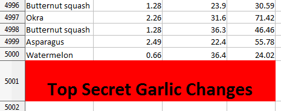
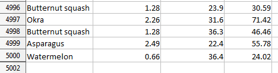
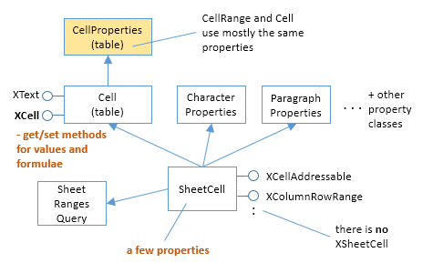
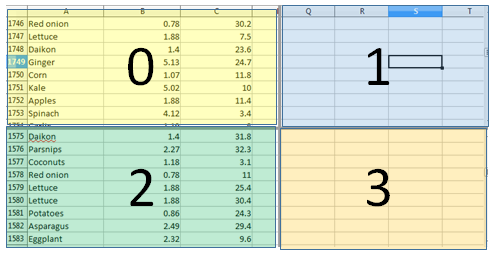
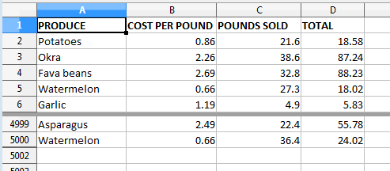

# Chapter 23. Garlic Secrets 

!!! note "Topics"
    Freezing Rows; 
    GeneralFunctions; Sheet 
    Searching; Sheet Range 
    Queries; Hidden  Cells; 
    Cell Merging; Splitting 
    Windows; View Panes; 
    View State Data; Active 
    Panes;  Inserting Rows 
    and Columns; Shifting 
    Cells  

    Example folders: "Calc 
    Tests" and "Utils"  
 
This chapter's GarlicSecrets.java example illustrates how 
data can be extracted from an existing spreadsheet 
("produceSales.xlsx") using 'general' functions, sheet 
searching, and sheet range queries. It also has more 
examples of cell styling, and demonstrates sheet freezing, 
view pane splitting, pane activation, and the insertion of 
new rows into a sheet. 

The idea for this chapter, and the data, comes from the 
Excel example in chapter 12 of "Automate the Boring Stuff with Python" by Al 
Sweigart. However, he utilized the Python library OpenPyXL to manipulate his file. 

The beginning of the spreadsheet is shown in Figure 1. 

 
 

Figure 1. Part of the "produceSales.xlsx" Spreadsheet. 

 
Each row holds information about the sale of fruit or vegetables. The columns are the 
type of produce sold (column A), the cost per pound of that produce (B), the number 
of pounds sold (C), and the total revenue from the sale (D). The TOTAL column is 
calculated using a formula which multiplies the cost per pound by the number of 
pounds sold, and rounds the result to the nearest cent. For example, cell "D2" contains 
"=ROUND(B2*C2, 2)". 

Most of the main() function for GarlicSecrets.java is shown below. I'll explain the 
commented out parts in later sections: 
 
// in GarlicSecrets.java 

private static final String FNM = "produceSales.xlsx"; 
private static final String OUT_FNM = "garlicSecrets.ods"; 
 
 
public static void main(String args[]) 
{   
  XComponentLoader loader = Lo.loadOffice(); 
  XSpreadsheetDocument doc = Calc.openDoc(FNM, loader); 
  if (doc == null) { 
    System.out.println("Could not open " + FNM); 
    Lo.closeOffice(); 
    return; 
  } 
 
  GUI.setVisible(doc, true); 
  XSpreadsheet sheet = Calc.getSheet(doc, 0); 
  Calc.gotoCell(doc, "A1");  // make sure top of sheet is visible 
 
  // freeze first 3 rows of view 
  // Calc.freezeRows(doc, 3);  
 
  // report total for the "Total" column 
  XCellRange totalRange = Calc.getColRange(sheet, 3); 
  double total =  
      Calc.computeFunction(GeneralFunction.SUM, totalRange); 
  System.out.printf("Total before change: %.2f\n", total); 
 
  increaseGarlicCost(doc, sheet); 
 
  // recalculate total and print again 
  total = Calc.computeFunction(GeneralFunction.SUM, totalRange); 
  System.out.printf("Total after change:  %.2f\n", total); 
 
 
  // add a label at the bottom of the data, and hide it... 

 
  // split sheet into panes... 

 
  // make top pane the active one in the first sheet... 

 
  // add a new first row, and label that as at the bottom... 

 
  Lo.saveDoc(doc, OUT_FNM); 
 
  Lo.waitEnter(); 
  Lo.closeDoc(doc); 
  Lo.closeOffice(); 
}  // end of main() 
 
 
## 1.  Freezing Rows 

Calc.freezeRows() specifies the number of rows that should be 'frozen' on-screen as 
Office's view of the spreadsheet changes (e.g. when the user scrolls downwards). The 
function's argument is the number of rows to freeze, not a row index, and the choice 
of which rows are frozen depends on which row is currently selected (active) in the 
application window when the function is called.  

The earlier call to Calc.gotoCell() in main() means that "A1" is the active cell in the 
spreadsheet, and so row "1" is the active row (and "A" the active column). For that 
reason, Calc.freezeRows(doc, 3) will freeze rows "1", "2", and "3" so they remain in 
view when the spreadsheet is scrolled up or down. 

Calc.freezeRows() and Calc.freezeCols() are implemented using Calc.freeze(): 
 
// in the Calc class 
public static void freezeRows(XSpreadsheetDocument doc, int numRows) 
{  freeze(doc, 0, numRows);  } 
 
 
public static void freezeCols(XSpreadsheetDocument doc, int numCols) 
{  freeze(doc, numCols, 0);  } 
 
 
public static void freeze(XSpreadsheetDocument doc,  
                               int numCols, int numRows) 
{ XViewFreezable xFreeze =   
           Lo.qi(XViewFreezable.class, getController(doc));  
  xFreeze.freezeAtPosition(numCols, numRows);  
} 
 
Calc.freeze() accesses the SpreadsheetView service (see Figure 2) via the document's 
controller, and utilizes its XViewFreezable interface to call freezeAtPosition().  

 

Figure 2. The SpreadsheetView Services and Interfaces. 

 
 
## 2.  General Functions 

Office has a small set of functions (called GeneralFunctions) which can be applied to 
cell ranges without the need for formula strings (i.e. a string starting with "="). 

They're listed in the enum section at the end of the sheet module at 
http://api.libreoffice.org/docs/idl/ref/namespacecom_1_1sun_1_1star_1_1sheet.html, 
or use lodoc GeneralFunctions. The more important functions  are shown in Table 
1. 

 
GeneralFunction Name Calculation Applied to the Cell Values 
SUM  Sum the numerical values. 

COUNT  Count all the values, including the non-
numerical ones. 

COUNTNUMS  Count only the numerical values. 

AVERAGE  Average all the numerical values. 

MAX  Find the maximum of all the numerical values. 

MIN  Find the minimum of all the numerical values. 

PRODUCT  Return the product of all the numerical values. 

STDEV  The standard deviation is calculated for the 
values based on using a sample size. 

STDEVP  The standard deviation is calculated for the 
values based on using the entire population. 

VAR  The variance is calculated for the values based 
on using a sample size. 

VARP  The variance is calculated for the values based 
on using the entire population. 

Table 1. Some GeneralFunctions. 

 
GeneralFunction.SUM is used in main(), to sum the "TOTALS" column of the 
spreadsheet: 
 
// in GarlicSecrets.java 
XCellRange totalRange = Calc.getColRange(sheet, 3); 
double total =  
      Calc.computeFunction(GeneralFunction.SUM, totalRange); 
 
Cal.getColRange() utilizes the XColumnRowRange interface to access the sheet as a 
series of columns. The required column is extracted from the series via its index 
position: 
 
// in the Calc class 
public static XCellRange getColRange(XSpreadsheet sheet, int idx) 
{ 
  XColumnRowRange crRange = Lo.qi(XColumnRowRange.class, sheet); 
  XTableColumns cols = crRange.getColumns();  // get all columns 
 
  XIndexAccess con = Lo.qi(XIndexAccess.class, cols); 
  try {   // get column at idx position 
    return Lo.qi(XCellRange.class, con.getByIndex(idx));  
  } 
  catch(Exception e) 
  {  System.out.println("Could not access range for col pos " +idx); 
     return null; 
  } 
}  // end of getColRange() 
 
The sheet can also be treated as a series of rows by calling 
XColumnRowRange.getRows(), as in Calc.getRowRange(): 
 
// in the Calc class 
public static XCellRange getRowRange(XSpreadsheet sheet, int idx) 
{ 
  XColumnRowRange crRange = Lo.qi(XColumnRowRange.class, sheet); 
  XTableRows rows = crRange.getRows();  // get all rows 
  XIndexAccess con = Lo.qi(XIndexAccess.class, rows); 
  try {  // get row at idx position 
    return Lo.qi(XCellRange.class, con.getByIndex(idx));  
  } 
  catch(Exception e) 
  {  System.out.println("Could not access range for row pos " +idx); 
     return null; 
  } 
}  // end of getRowRange() 
 
The column returned by Calc.getColRange(sheet,3) includes the cell containing 
the word "TOTALS", but GeneralFunction.SUM only sums cells holding numerical 
data. 

Calc.computeFunction() obtains the XSheetOperation interface for the cell range, and 
calls XSheetOperation.computeFunction() to apply a GeneralFunction: 
 
// in the Calc class 
public static double computeFunction(GeneralFunction fn,  
                                       XCellRange cellRange) 
{ try { 
    XSheetOperation sheetOp =  
                     Lo.qi(XSheetOperation.class, cellRange); 
    return sheetOp.computeFunction(fn); 
  } 
  catch(Exception e)  
  {  System.out.println("Compute function failed: " + e);  
     return 0; 
  } 
}  // end of computeFunction() 
 
 
## 3.  Searching for the Cost of Garlic, and Increasing it 

GarlicSecrets.java increases the "Code per Pound" value for every garlic entry. The 
source document uses $1.19 (e.g. see row 6 of Figure 1). Due to a worldwide garlic 
shortage, this must be increased by 5% to $1.2495.  

increaseGarlicCost() in GarlicSecrets.java scans every used row in the sheet, 
examining the "Produce" cell to see if it contains the string "Garlic". When the string 
is found, the corresponding "Cost per Pound" entry on that row is changed. When the 
scanning reaches an empty cell, the end of the data has been reached, and the function 
returns.  

 
// in GarlicSecrets.java 
private static int increaseGarlicCost(XSpreadsheetDocument doc,  
                                      XSpreadsheet sheet) 
{ int row = 0; 
  XCell prodCell = Calc.getCell(sheet, 0, row);    
              // get produce cell in first row 
  XCell costCell; 
  while (prodCell.getType() !=  CellContentType.EMPTY) { 
    // iterate down produce column until an empty cell is reached 
    if (prodCell.getFormula().equals("Garlic")) { 
      Calc.gotoCell(doc, Calc.getCellStr(0, row));  
                              // show the cell on-screen 
      costCell = Calc.getCell(sheet, 1, row);     
                              // change cost/pound entry in the row 
      costCell.setValue( 1.05* costCell.getValue()); 
      Props.setProperty(costCell, "CharWeight",  
                           com.sun.star.awt.FontWeight.BOLD); 
      Props.setProperty(costCell, "CharColor", 0xFF0000);  // red 
    } 
    row++; 
    prodCell = Calc.getCell(sheet, 0, row);    
                   // get produce cell in next row 
  } 
  return row; 
}  // end of increaseGarlicCost() 
 
To help the user see that changes have been made to the sheet, the text of each 
updated "Cost per Pound" cell is made bold and red. The cell properties being altered 
come from the CharacterProperties class.  

The progression of the function is also highlighted by calling Calc.gotoCell() inside 
the loop. This causes the spreadsheet to scroll down, to follow the changes. 

Back in main() after the updates, the "Totals" column is summed once again, and the 
new value reported: 
 
Total before change: 231353.57 
Total after change:  231488.58 
 
 
## 4.  Adding a Secret, Hidden Message 

The change made by increaseGarlicCost() are of a top-secret nature, and so the code 
adds an invisible message to the end of the sheet: 
 
// in main() of GarlicSecrets.java 
    : 
int emptyRowNum = findEmptyRow(sheet); 
addGarlicLabel(doc, sheet, emptyRowNum);  // add msg to row 
 
Lo.delay(2000);       // wait a bit before hiding row 
 
XCellRange rowRange = Calc.getRowRange(sheet, emptyRowNum); 
Props.setProperty(rowRange, "IsVisible", false);  
    : 
 
findEmptyRow() returns the index of the first empty row in the sheet, which happens 
to be the first row after the end of the data. It passes the index to addGarlicLabel() 
which inserts the large red text "Top Secret Garlic Changes" into the first cell on the 
row. The message is so big that several cells are merged together to make enough 
space; the row's height is also increased. The result is shown in Figure 3. 

 
 

Figure 3. The Message at the end of the Sheet. 

 
This message is visible for about 2 seconds before it's hidden by setting the height of 
the row to 0. This results in Figure 4. 

 
 

Figure 4. The Hidden Message at the end of the Sheet. 

 
findEmptyRow() utilizes a sheet ranges query to find all the empty cell ranges in the 
first column (XCellRangesQuery.queryEmptyCells()). Then it extracts the smallest 
row index from those ranges: 
 
// in GarlicSecrets.java 
public static int findEmptyRow(XSpreadsheet sheet) 
{ 
  // create a cell range spanning the first column of the sheet 
  XCellRange colRange = Calc.getColRange(sheet, 0); 
  Calc.printAddress(colRange); 
 
  // build query using the column cell range 
  XCellRangesQuery crQuery =  
                   Lo.qi(XCellRangesQuery.class, colRange); 
 
  // find all empty cell ranges in the column 
  XSheetCellRanges scRanges = crQuery.queryEmptyCells(); 
 
  CellRangeAddress[] addrs = scRanges.getRangeAddresses(); 
  Calc.printAddresses(addrs); 
 
  // find smallest row index in those ranges 
  int row = -1; 
  if (addrs != null) { 
    row  = addrs[0].StartRow; 
    for (int i = 1; i < addrs.length; i++) { 
      if (row < addrs[i].StartRow) 
        row = addrs[i].StartRow; 
    } 
    System.out.println("First empty row is at position: " + row); 
  } 
  else 
    System.out.println("Could not find an empty row"); 
  return row; 
}  // end of findEmptyRow() 
 
The XCellRangesQuery interface needs a cell range to search, which is obtained by 
calling Calc.getColRange() to get the first column. The cell range is printed by 
Calc.printAddress(): 
Range: Sheet1.A1:A1048576 
The first column extends down to row 1048576. 

XCellRangesQuery.queryEmptyCells() returns an XSheetCellRanges object, and an 
array of cell range addresses are extracted from it. Calc.printAddresses() prints: 
Range: Sheet1.A5001:A1048576 
There's only one empty cell range in the column, starting at row position 5001 and 
extending to the bottom of the sheet. This is correct because the produce data is made 
up of 5000 records. 

findEmptyRow() returns the smallest start row (i.e. 5001). 

 
 
## 5.  Adding the Label 

addGarlicLabel() adds the large text string "Top Secret Garlic Changes" to the first 
cell in the supplied row. The cell is made wider by merging a few cells together, made 
taller by adjusting the row height, and turned bright red. 

 
// in GarlicSecrets.java 
private static void addGarlicLabel(XSpreadsheetDocument doc,  
                          XSpreadsheet sheet, int emptyRowNum) 
{ 
  Calc.gotoCell(doc, Calc.getCellStr(0, emptyRowNum)); 
     // goto first cell of the empty row 
 
  // merge first few cells of the row 
  XCellRange cellRange = Calc.getCellRange(sheet, 0, emptyRowNum,   
                                                  3, emptyRowNum); 
  XMergeable xMerge = Lo.qi(XMergeable.class, cellRange); 
  xMerge.merge(true); 
 
  Calc.setRowHeight(sheet, emptyRowNum, 18);  // make row taller 
 
  // set text and properties in the cell 
  XCell cell = Calc.getCell(sheet, 0, emptyRowNum); 
  cell.setFormula("Top Secret Garlic Changes");  // add text 
 
  // adjust cell text properties 
  Props.setProperty(cell, "CharWeight",  
                              com.sun.star.awt.FontWeight.BOLD); 
  Props.setProperty(cell, "CharHeight", 24); 
  Props.setProperty(cell, "CellBackColor", 0xFF0000);  // red 
  Props.setProperty(cell, "HoriJustify", CellHoriJustify.CENTER); 
  Props.setProperty(cell, "VertJustify", CellVertJustify.CENTER); 
}  // end of addGarlicLabel() 
 
Cell merging requires a cell range, which is obtained by calling the version of 
Calc.getCellRange that employs start and end cell positions in (column, row) order. 

The range spans the first four cells of the empty row, making it wide enough for the 
large text. 

The XMergeable  interface is supported by the SheetCellRange service and uses 
merge() with a boolean argument to merge or unmerge a cell range.  

Changing the cell height affects the entire row, not just the merged cells, and so 
Calc.setRowHeight() manipulates a cell range representing the row: 
 
// in the Calc class 
public static void setRowHeight(XSpreadsheet sheet,  
                                        int idx, int height) 
{ XCellRange rowRange = getRowRange(sheet, idx); 
  Props.setProperty(rowRange, "Height", height*100);   
                                        // in 1/100 mm units 
}  
 
setRowHeight() illustrates the difficulties of finding property documentation. The first 
line obtains an XCellRange interface for the row, and the second line changes a 
property in the cell range's service. Pretend for a moment, that we don't know the 
name of this height property ("Height"). How could we find it?  
That depends on finding the cell range's service. First turn to the online 
documentation for the XCellRange class, which includes the class diagram shown in 
Figure 5 (which can be reached with lodoc XCellRange). 

 

Figure 5. Classes that Inherit XCellRange. 

 
This diagram combines the service and interface inheritance hierarchies. Ignoring the 
interfaces that inherit XCellRange  is easy because their names always begin with 
"X". The remaining names mean that XCellRange is implemented by almost every 
service in the Calc API: CellRange (twice), TableColumn, TableRow, and TextTable. 

CellRange appears twice because the blue triangle in the bottom-right corner of the 
first CellRange box means that there's more subclass hierarchy that's not shown; in 
this case, SheetCellRange, SheetCellCursor, and Spreadsheet. The height property 
must be in one of these services, or one of their superclasses.  

The correct choice is TableRow because the cell range is representing a spreadsheet 
row. TableRow contains four properties, one of which is "Height". 

Another approach for finding the service is to call Info.showServices(). For example, 
by adding the following line to Calc.setRowHeight(): 
Info.showServices("Cell range for a row", cellRange); 
The following is printed: 
 
Cell range for a row Supported Services (1) 
  "com.sun.star.table.TableRow" 
 
Back in addGarlicLabel(), text is stored in the cell, and its properties set. Although 
XMergeable changes a cell range into a cell, it doesn't return a reference to that cell. It 
can be accessed by calling Calc.getCell(): 
XCell cell = Calc.getCell(sheet, 0, emptyRowNum); 
The various cell properties changed in addGarlicLabel() are inherited from different 
classes shown in Figure 6.  

 

Figure 6. The SheetCell Services and Interfaces. 

 
"CharWeight" and "CharHeight" come from CharacterProperties, and 
"CellBackColor", "HoriJustify", and "VertJustify" from CellProperties. 

Back in main(), the newly created label is hidden after an interval of  2 seconds: 
 
// in main() of GarlicSecrets.java 
Lo.delay(2000);       // wait a bit before hiding last row 
 
XCellRange rowRange = Calc.getRowRange(sheet, emptyRowNum); 
Props.setProperty(rowRange, "IsVisible", false);  
   : 
 
Row invisibility requires a property change to the row. The row's cell range is 
obtained by calling Calc.getRowRange(), and then the "IsVisible" property is 
switched off. Finding the name of this property involves the same investigative skills 
as the search for "Height" in Calc.setRowHeight(). As with "Height", "IsVisible" is 
defined in the TableRow service. 

 
 
## 6.  Splitting a Window into Two View Panes 

The produce sales data is quite lengthy, so it's useful to split the window into two 
view panes: one showing the modified rows at the end, and the other the first few 
rows at the top of the sheet. My first attempt at splitting the sheet is shown in Figure 
## 7.  The division occurs just above row 4999, drawn as a thick dark gray line. 

 
 

Figure 7. Two Views of the Sheet. 

 
The code in main() of GarlicSecrets.java for this: 
 
// in GarlicSecrets.java 
    : 
// split window into 2 view panes 
String cellName = Calc.getCellStr(0, emptyRowNum-2); 
System.out.println("Splitting at: " + cellName); 
Calc.splitWindow(doc, cellName);   // doesn't work with Calc.freeze()  
    : 
 
Calc.splitWindow() can utilize the SpreadsheetView service (see Figure 2), and its 
XViewSplitable interface: 
 
XController controller = Calc.getController(doc); 
XViewSplitable viewSplit = Lo.qi(XViewSplitable.class, xController); 
 
Unfortunately, XViewSplitable only offers a splitAtPosition() method which specifies 
the split location in terms of pixels. In addition, the interface is deprecated. 

A better alternative is to employ the "splitWindow" dispatch command, which has a 
"ToPoint" property argument for a cell name (e.g. "A4999") where the split will 
occur. Therefore, Calc.splitWindow() is coded as: 
 
// in the Calc class 
public static void splitWindow(XSpreadsheetDocument doc,  
                                      String cellName) 
{ XFrame frame = getController(doc).getFrame(); 
  gotoCell(frame, cellName); 
  Lo.dispatchCmd(frame, "SplitWindow",  
                   Props.makeProps("ToPoint", cellName)); 
  }  // end of splitWindow() 
  
 
public static void gotoCell(XFrame frame, String cellName) 
{  Lo.dispatchCmd(frame, "GoToCell",  
                  Props.makeProps("ToPoint", cellName));  } 
 
The call to Calc.gotoCell() changes the on-screen active cell. If it's left out then the 
"SplitWindow" dispatch creates a split at the currently selected cell rather than the 
one stored in the "ToPoint" property. In other words, it appears that the 
"SplitWindow" dispatch ignores the property. 

Figure 7 shows another problem with the split – the top pane still shows the rows of 
data immediately above the split line. I want the top view to show the first rows at the 
start of the sheet. 

One way of changing the displayed rows is via the view's XViewPane interface (see 
Figure 2). Each view (or pane) created by a split is represented by an XViewPane 
object, and a collection of all the current panes can be accessed through the 
SpreadsheetView service. This approach is implemented in Calc.getViewPanes(), 
which returns the collection as an array: 
 
// in the Calc class 
public static XViewPane[] getViewPanes(XSpreadsheetDocument doc) 
{ 
  XIndexAccess con = Lo.qi(XIndexAccess.class, getController(doc)); 
  if (con == null) { 
    System.out.println("Could not access the view pane container"); 
    return null; 
  } 
  if (con.getCount() == 0) { 
    System.out.println("No view panes found"); 
    return null; 
  } 
 
  // put each XViewPane obj in container into an array 
  XViewPane[] panes = new XViewPane[con.getCount()]; 
  for (int i=0; i < con.getCount(); i++) { 
    try { 
      panes[i] = Lo.qi(XViewPane.class, con.getByIndex(i)); 
    } 
    catch(Exception e) 
    {  System.out.println("Could not get view pane " + i);  } 
  } 
  return panes; 
}  // end of getViewPanes() 
 
Calc.getViewPanes() is called like so: 
 
XViewPane[] panes = Calc.getViewPanes(doc); 
System.out.println("No of panes: " + panes.length); 
 
The XViewPane interface has methods for setting and getting the visible row and 
column in the view. For example, the first pane can be made to show the first row, by 
calling: 
panes[0].setFirstVisibleRow(0); 
 
 
## 7.  View States, and Making the Top Pane Active 

The previous section split the window into two panes, and changed the view in the top 
pane to show the first rows of the sheet. But there's still a problem which can be seen 
in Figure 7 – the active cell is still in the bottom pane, and I want it to be in the first 
row of the top pane. More coding is required. 

Hidden away in the XController interface are the methods getViewData() and 
restoreViewData() . They allow a programmer to access and change the view details 
of all the sheets in the document. For example, the following retrieval of the view data 
for a document: 
XController ctrl = getController(doc); 
System.out.println( ctrl.getViewData() ); 
prints: 
100/60/0;0;tw:270;3/13/0/0/0/0/2/0/0/0/1;5/15/0/0/0/0/2/0/0/0/0;0/0/0
/0/0/0/2/0/0/0/0 
This can be better understood by separating the data according to the ";'s, producing: 
 
100/60/0 
0 
tw:270 
3/13/0/0/0/0/2/0/0/0/1 
5/15/0/0/0/0/2/0/0/0/0 
0/0/0/0/0/0/2/0/0/0/0 
 
The first three lines refer to the document's zoom settings, the active sheet index, and 
the position of the scrollbar. The fourth line and below give the view state information 
for each sheet. In the example document, there are three sheets, so three view state 
lines. 

Each view state consists of 11 values, separated by "/"s. Their meaning, based on their 
index positions: 
 indices 0 and 1 contain the current cursor position in terms of column and row 
positions; 
 index 2: this records if column split mode is being used (0 or 1); 
 3: is row split mode being used? (0 or 1); 
 4: the vertical split position (in pixels); 
 5: the horizontal split position (in pixels); 
 6: the active/focused pane number for this sheet; 
 7: the left column index of the left-hand panes; 
 8: the left column index of the right-hand panes; 
 9: the top row index of the upper panes; 
 10: the top  row index of the lower panes. 

A sheet can be split horizontal and/or vertically, which can generate a maximum of 
four panes, which are numbered as in Figure 8. 

 
 

Figure 8. The Four Panes in a Split Window. 

 
If a window is split only horizontally, then numbers 0 and 1 are used. If the split is 
only vertical, then the numbers used are 0 and 2. 

Only one pane can be active (i.e. have keyboard focus) at a time. For example, in 
Figure 8, pane 1 is active. The active pane number is stored in view state index 6. 

The view state information at index positions 7 to 10 define the top-left corners of 
each pane. For example, since pane 1 is in the top-right of the sheet, its top-left corner 
is obtained by combining the values in view state index positions 8 and 9. Position 8 
supplies the column index of the two right-hand panes, and position 9 the row index 
of the top two panes. 

If a sheet is not split at all, then its top-left corner is reconstructed by accessing index 
positions 7 and 10. 

Although it's possible for a programmer to extract all this information from the view 
data string by himself, I've implemented a support class called ViewState which stores 
the data in a more easily accessible form. Calc.getViewStates() parses the view data 
string, creating an array of ViewState objects, one object for each sheet in the 
document. For example, the following code is in GarlicSecrets.java: 
 
// in GarlicSecrets.java 
   : 
ViewState[] states = Calc.getViewStates(doc); 
for(ViewState s : states) 
  s.report(); 
 
When it's executed after the sheet has been split as shown in Figure 7, the following is 
printed: 
 
Sheet View State 
  Cursor pos (column, row): (0, 4998) or "A4999" 
  Sheet is split horizontally at 138 
  Number of focused pane: 2 
  Left column indices of left/right panes: 0 / 0 
  Top row indices of upper/lower panes: 4992 / 4998 
 
One view state is reported since the document only contains one sheet. The output 
says that the sheet is split vertically, and the lower pane is active (in focus). 

Calc.getViewStates() is implemented as: 
 
// in the Calc class 
public static ViewState[] getViewStates(XSpreadsheetDocument doc) 
{ 
  // get view data from controller 
  XController ctrl = getController(doc); 
  String viewData = (String) ctrl.getViewData(); 
 
  // split into parts based on ";" delimiter 
  String[] viewParts = viewData.split(";"); 
  if (viewParts.length < 4) { 
    System.out.println("No sheet view states found in view data"); 
    return null; 
  } 
 
  // build view states array from view data after first 3 entries 
  ViewState[] states = new ViewState[viewParts.length-3]; 
  for(int i=3; i < viewParts.length; i++) 
    states[i-3] = new ViewState(viewParts[i]);   
                       // construct view state object 
  return states; 
} // end of getViewStates() 
 
The first three entries in the view data (i.e. the document's zoom, active sheet, and 
scrollbar position) are discarded, so only the document's view states are stored. 

Paired with Calc.getViewStates() is Calc.setViewStates() which uses an array of 
ViewState objects to update the view states of a document. It is coded as: 
 
// in the Calc class 
public static void setViewStates(XSpreadsheetDocument doc,  
                                  ViewState[] states) 
{ 
  // get view data from controller 
  XController ctrl = getController(doc); 
  String viewData = (String) ctrl.getViewData(); 
  String[] viewParts = viewData.split(";"); 
  if (viewParts.length < 4) { 
    System.out.println("No sheet states found in view data"); 
    return; 
  } 
 
  // start building a string holding the modified view data 
  StringBuilder vdNew = new StringBuilder(); 
  for (int i=0; i < 3; i++)  // copy first 3 parts unchanged 
    vdNew.append(viewParts[i]).append(";");    
 
  // build rest of string using supplied view states array 
  for(int i=0; i < states.length; i++) { 
    vdNew.append( states[i].toString());  //add new state as string 
    if (i != states.length-1) 
      vdNew.append(";"); 
  } 
 
  // use string to update controller's view data 
  ctrl.restoreViewData(vdNew.toString()); 
 } // end of setViewStates() 
 
A new view data string is constructed, and loaded into the document by calling 
XController.restoreViewData(). The string is composed from view state strings 
obtained by calling ViewState.toString() for each ViewState object. Also, the existing 
values for the document's zoom, active sheet, and scrollbar position are copied over 
unchanged by extracting their current values from a call to 
XController.getViewData(). 

I'm finally able to change the active pane to be the top view. While I'm at it, I'll also 
move the view in that newly activated pane to the top of the sheet: 
 
// in main() in GarlicSecrets.java 
       : 
ViewState[] states = Calc.getViewStates(doc); 
 
// move focus to top pane in the first sheet 
states[0].movePaneFocus(ViewState.MOVE_UP); 
Calc.setViewStates(doc, states); 
 
Calc.gotoCell(doc, "A1");    // move selection to top cell 
 
// print revised view states 
states = Calc.getViewStates(doc); 
for(ViewState s : states) 
  s.report(); 
     : 
 
The view states are obtained by calling Calc.getViewStates(). The states[] array will 
hold one ViewState object for each sheet in the document, so by using states[0] the 
panes in the first sheet will be affected. ViewState.movePaneFocus(), which I'll 
describe shortly, changes the focus to the top pane. Finally, the modified view states 
are written back to the document by Calc.setViewStates(). 

Figure 9 shows the outcome of this code: the active cell is now in the top pane, at cell 
"A1". 

 
 

Figure 9. A Changed Active Cell and Pane. 

 
The code fragment above also prints out the revised view state, which is: 
 
Sheet View State 
  Cursor pos (column, row): (0, 0) or "A1" 
  Sheet is split horizontally at 138 
  Number of focused pane: 0 
  Left column indices of left/right panes: 0 / 0 
  Top row indices of upper/lower panes: 0 / 4998 
 
ViewState.movePaneFocus() changes one value in the view state – the focused pane 
number (index no. 6 in the list given earlier). I decided not to implement this by 
having the programmer supply a pane number  (i.e., 0, 1, 2, or 3 as shown in Figure 8) 
since these numbers may not all be used in a given split. Instead the focus change is 
specified in terms of a direction, as shown in the code: 
 
// in the ViewState class 
 
// globals for moving the pane focus 
public static final int MOVE_UP = 0; 
public static final int MOVE_DOWN = 1; 
public static final int MOVE_LEFT = 2; 
public static final int MOVE_RIGHT = 3; 
 
private int focusNum; 
 
 
public void movePaneFocus(int dir) 
{   
  if (dir == MOVE_UP) { 
    if (focusNum == 3) 
      focusNum = 1; 
    else if (focusNum == 2) 
      focusNum = 0; 
    else 
      System.out.println("cannot move up"); 
  } 
  else if (dir == MOVE_DOWN) { 
    if (focusNum == 1) 
      focusNum = 3; 
    else if (focusNum == 0) 
      focusNum = 2; 
    else 
      System.out.println("cannot move down"); 
  } 
  else if (dir == MOVE_LEFT) { 
    if (focusNum == 1) 
      focusNum = 0; 
    else if (focusNum == 3) 
      focusNum = 2; 
    else 
      System.out.println("cannot move left"); 
  } 
  else if (dir == MOVE_RIGHT) { 
    if (focusNum == 0) 
      focusNum = 1; 
    else if (focusNum == 2) 
      focusNum = 3; 
    else 
      System.out.println("cannot move right"); 
  } 
  else 
    System.out.println("Unknown move direction"); 
}  // end of movePaneFocus() 
 
 
## 8.  Adding a New First Row and Shifting Cells 

The final task in GarlicSecrets.java is to add the "Top Secret Garlic Changes" text to 
the sheet again, this time as a visible title for the spreadsheet. The only new API 
feature used is the insertion of a row. This is done with: 
 
// in GarlicSecrets.java 
// add a new first row, and label it 
Calc.insertRow(sheet, 0); 
addGarlicLabel(doc, sheet, 0); 
 
The addGarlicLabel() method is unchanged from earlier, but is now passed row index 
0 rather than the last row. The result is shown in Figure 10. 

 
 

Figure 10. The Sheet with a New Title Row. 

 
Calc.insertRow()  manipulates a row as a cell range, so it's once again necessary to 
access the sheet's XColumnRowRange interface, to retrieve a TableRows object. The 
XTableRows interface supports the adding and removal of rows at specified index 
positions. This allows Calc.insertRow() to be coded as: 
 
// in the Calc class 
public static void insertRow(XSpreadsheet sheet, int idx) 
{ 
  XColumnRowRange crRange = Lo.qi(XColumnRowRange.class, sheet); 
  XTableRows rows = crRange.getRows(); 
  rows.insertByIndex(idx, 1);   // add 1 row at idx position 
} 
 
There's a similar Calc.insertCols() method that utilizes the XTableColumns interface: 
 
// in the Calc class 
public static void insertColumn(XSpreadsheet sheet, int idx) 
{ 
  XColumnRowRange crRange = Lo.qi(XColumnRowRange.class, sheet); 
  XTableColumns cols = crRange.getColumns(); 
  cols.insertByIndex(idx, 1);   // add 1 column at idx position 
} 
 
The insertion of an arbitrary number of blank cells into a sheet is a bit more 
complicated because existing cells must be 'moved' out of the way, and this can be 
done by moving them downwards or to the right. The shift-able cells are specified as a 
cell range, and the sheet's XCellRangeMovement interface moves them in a specific 
direction. XCellRangeMovement is supported by the Spreadsheet service. 

The Calc.insertCells() method implements this approach: 
 
// in the Calc class 
public static void insertCells(XSpreadsheet sheet,  
                        XCellRange cellRange, boolean isShiftRight) 
/* insert blank cells at cellRange, moving the existing ones 
   to the right or down depending on the boolean argument */ 
{  
  XCellRangeMovement mover =  
                       Lo.qi(XCellRangeMovement.class, sheet);  
  CellRangeAddress addr = getAddress(cellRange);  // cells to shift 
  if (isShiftRight)   // move right 
    mover.insertCells(addr, CellInsertMode.RIGHT); 
  else                // or move down 
    mover.insertCells(addr, CellInsertMode.DOWN); 
}  // end of insertCells() 
 
An example call: 
 
XCellRange blanks = Calc.getCellRange(sheet, "A4999:B5001"); 
Calc.insertCells(sheet, blanks, true);  // shift right 
 
This shifts the last three rows of the produce sheet (A4999:B5001) to the right by two 
cells, producing Figure 11. 

 
 

Figure 11. Shifted Cells at the end of the Produce Sheet. 

 
 
