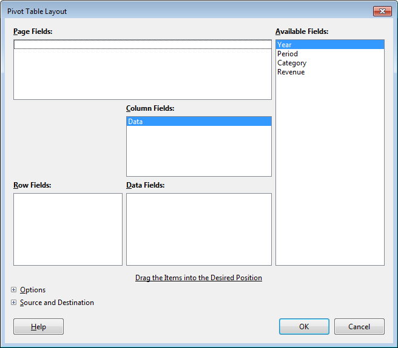
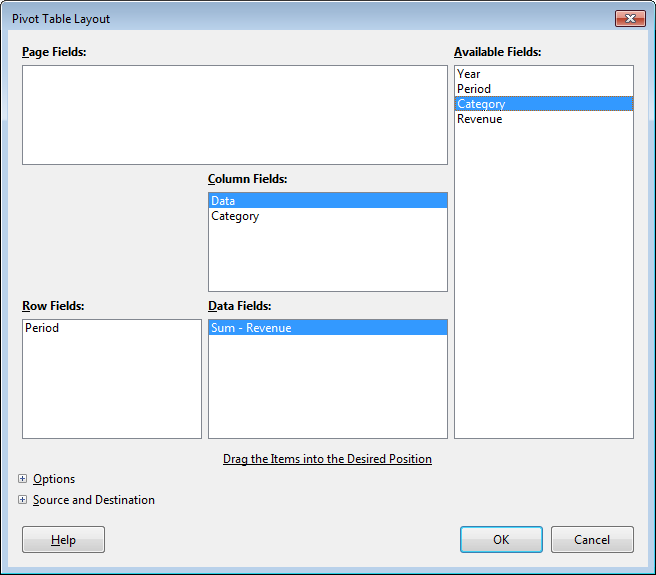
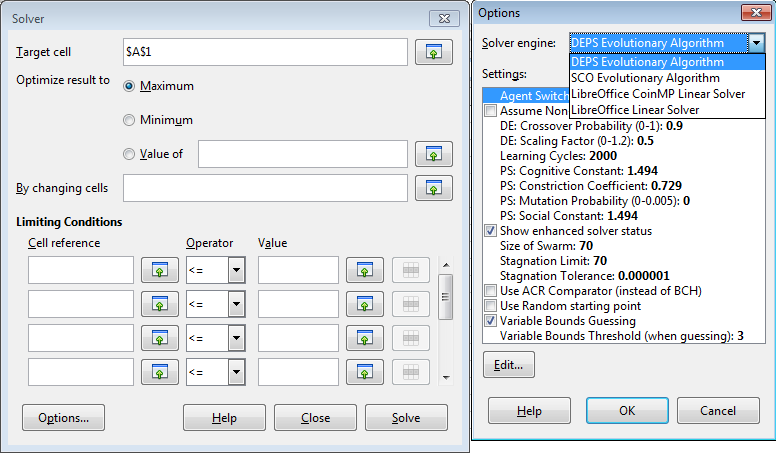
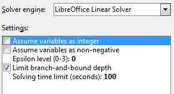
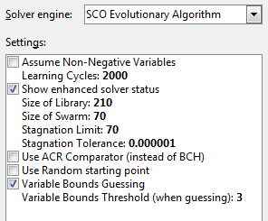
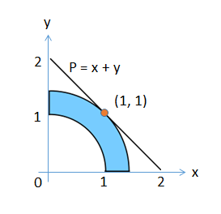

# Chapter 27. Functions and Data Analysis

!!! note "Topics"
    Calling Calc
    Functions from Code;
    Pivot Tables; Goal Seek;
    Linear and Nonlinear
    Solving (using SCO,
    DEPS)

    Example folders: "Calc
    Tests" and "Utils"

This chapter looks at how to utilize Calc's spreadsheet
functions directly from Java, and then examines four of
Calc's data analysis features: pivot tables, goal seeking,
and linear and nonlinear solving. There are two nonlinear
examples, one using the SCO solver, the using employing
DEPS.


## 1.  Calling Calc Functions from Code

Calc comes with an extensive set of functions, which are described in Appendix B of
the Calc User Guide, available from https://www.libreoffice.org/get-
help/documentation/. The information is also online at
https://help.libreoffice.org/Calc/Functions_by_Category, organized into 11 categories:

1.  Database: for extracting information from Calc tables, where the data is
organized into rows. The "Database" name is a little misleading, but the
documentation makes the point that Calc database functions have nothing to
do with Base databases.  Chapter 13 of the Calc User Guide ("Calc as a
Simple Database") explains the distinction in detail.
2.  Date and Time; e.g. see the EASTERSUNDAY function below
3.  Financial: for business calculations;
4.  Information: many of these return boolean information about cells, such as
whether a cell contains text or a formula;
5.  Logical: functions for boolean logic;
6.  Mathematical: trigonometric, hyperbolic, logarithmic, and summation
functions; e.g. see ROUND, SIN, and RADIANS below;
7.  Array: many of these operations treat cell ranges like 2D arrays; e.g. see
TRANSPOSE below;
8.  Statistical: for statistical and probability calculations; e.g., see AVERAGE and
SLOPE below;
9.  Spreadsheet: for finding values in tables, cell ranges, and cells;
10. Text: string manipulation functions;
11. Add-ins: a catch-all category that includes a lot of functions – extra data and
time operations, conversion functions between number bases, more statistics,
and complex numbers. See IMSUM and ROMAN below for examples. The
"Add-ins" documentation starts at
https://help.libreoffice.org/Calc/Add-in_Functions, and continues in
https://help.libreoffice.org/Calc/Add-in_Functions,_List_of_Analysis_Functions_Part_One and
https://help.libreoffice.org/Calc/Add-in_Functions,_List_of_Analysis_Functions_Part_Two.

A different organization for the functions documentation is used at the OpenOffice
site
(https://wiki.openoffice.org/wiki/Documentation/How_Tos/Calc:_Functions_listed_by_category),
and is probably easy to use when browsing/searching for a suitable function.

If you know the name of the function, then a reasonably effective way of finding its
documentation is to search for "libreoffice calc function" + the function name.

The standard way of using these functions is, of course, inside cell formulae. But it's
also possible to call them from code via the XFunctionAccess interface.
XFunctionAccess only contains a single function, callFunction(), but it can be a bit
hard to use due to data typing issues.

Calc.callFun() creates an XFunctionAccess instance, and executes callFunction():

```java
// in the Calc class
public static Object callFun(String funcName, Object[] args)
{
  try {
    XFunctionAccess fa =
          Lo.createInstanceMCF(XFunctionAccess.class,
                    "com.sun.star.sheet.FunctionAccess");
    return fa.callFunction(funcName, args);
  }
  catch(Exception e)
  {  System.out.println("Could not invoke \"" + funcName + "\"");
     return null;
  }
}  // end of callFun()


public static Object callFun(String funcName, Object arg)
{  return callFun(funcName, new Object[]{arg});  }
```

Calc.callFun() is passed the Calc function name and an array of arguments; the
function's result is returned as an Object instance. The second version of
Calc.callFun() is for calling functions that accept a single argument.

Several examples of how to use Calc.callFun() can be found in the FunctionsTest.java
example:

```java
// in FunctionsTest.java
public static void main(String[] argus)
{
  XComponentLoader loader = Lo.loadOffice();

  // round a double
  System.out.println("ROUND result for 1.999 is: " +
                     Calc.callFun("ROUND", 1.999) + "\n");

     :  // more examples, explained below

  Lo.closeOffice();
}  // end of main()
```

The value passed to Calc.callFun() in the code above is an ordinary double, but Java
autoboxes it to become a Double object. This is passed to the second version of
Calc.callFun() which handles a single Object input argument.

The printed result is:

```
ROUND result for 1.999 is: 2.0
```

Java can be used to convert the returned Object value. For example, the value returned
by ROUND can be cast to a double:

```java
double res = (Double) Calc.callFun("ROUND", 1.999);
```

The Object is cast to Double, and then Java unboxes the object, converting it to a
double.

Function calls can be nested, as in:

```java
// in FunctionsTest.java
System.out.printf("SIN result for 30 degrees is: %.3f\n\n",
         Calc.callFun("SIN",  Calc.callFun("RADIANS", 30)));
```

The call to RADIANS converts 30 degrees to radians. The returned Object is accepted
by the SIN function as input. The output is:
SIN result for 30 degrees is: 0.500
Many functions require more than one argument. In that case, the sequence of
arguments must be stored in an Object[] array before passing them to Calc.callFun().

For instance:

```java
// in FunctionsTest.java
Object[] args = new Object[]{1, 2, 3, 4, 5};   // five args
double avg = (Double) Calc.callFun("AVERAGE", args);
System.out.println("Average of the numbers is: " +avg + "\n");
```

This reports the average to be 3.0.

When the Calc function documentation talks about an "array" or "matrix" argument,
then the data needs to be packaged as a 2D array. For example, the SLOPE function
takes two arrays of x and y coordinates as input, and calculates the slope of the line
through them. These two 1D arrays must be passed to Calc.callFun() as two 2D
arrays:

```java
// in FunctionsTest.java
double[][] xData = {{1.0, 2.0, 3.0}};
    // a 2D array/matrix holding one row of data
double[][] yData = {{3.0, 6.0, 9.0}};

args = new Object[]{yData, xData};
double slope = (Double) Calc.callFun("SLOPE", args);
System.out.println("SLOPE of the line: " + slope + "\n");
```

The args array has to be built in stages so that the two arrays can be treated as two
Objects. The slope result is 3.0, as expected.

The functions in the "Array" category almost all use 2D arrays as arguments. For
example, the TRANSPOSE function is called like so:

```java
// in FunctionsTest.java
// transpose a matrix
double[][] arr = {{1, 2, 3},{4, 5, 6}};
args = new Object[]{arr};
Object[][] transMat = (Object[][]) Calc.callFun("TRANSPOSE", args);
Calc.printArray(transMat);
```

The input array is in row-order, so the array arr created above has two rows and three
columns. The printed transpose is:

```
Row x Column size: 3 x 2
  1.0  4.0
  2.0  5.0
  3.0  6.0
```

Note that the result of this call to Calc.callFun() was not a double but a transposed 2D
array, which is why the Object result was cast to Object[][]. Unfortunately, Java's
typing does not allow the result to be cast to double[][]. The casting can be done using
Calc.convertToDoubles():

```java
double[][] trans = Calc.convertToDoubles(transMat);
```

The TRANSPOSE function only takes a single argument, so it's possible to use the
second version of Calc.callFun() which takes a single Object input argument. A slight
problem is caused by Java's type system; it's necessary to explicitly cast the double[][]
array to Object in the call:

```java
// in FunctionsTest.java
Object[][] transMat =
   (Object[][]) Calc.callFun("TRANSPOSE", (Object)arr);
```

If arr is not cast then Java will issue a runtime error.

There are several functions for manipulating imaginary numbers, which must be
written in the form of strings. For example, IMSUM sums a series of complex
numbers like so:

```java
// in FunctionsTest.java
// sum two imaginary numbers: "13+4j" + "5+3j" returns 18+7j.

String[][] nums = {{"13+4j"},{"5+3j"}};
args = new Object[]{nums};
String sum = (String) Calc.callFun("IMSUM", args);
System.out.println("13+4j + 5+3j: "+ sum + "\n");
```

Since IMSUM expects a series of complex numbers, Calc.callFun() must be passed a
2D array. Each row contains a single string argument representing a complex number.

The summed complex number is returned as the string "18+7j". This means that the
Calc.callFun() result is cast to String in this case.

The IMSUM function is only processing a single argument, and so the single
argument version of Calc.callFun() can be called. As with the TRANSPOSE function
example, the String[][] array must be expicitly cast to an Object:

```java
String sum = (String) Calc.callFun("IMSUM", (Object)nums);
```

#### Functions Help

If you can't access the Calc documentation on functions, then Calc.java contains two
help functions: Calc.getFunctionNames() and Calc.printFunctionInfo(). The former
prints a very long list of function names:

```java
// in FunctionsTest.java
System.out.println("Function names");
Lo.printNames( Calc.getFunctionNames(), 6);
```

The output begins like so:

```
Function names
No. of names: 483
  "ABS"  "ACCRINT"  "ACCRINTM"  "ACOS"  "ACOSH"  "ACOT"
  "ACOTH"  "ADDRESS"  "AGGREGATE"  "AMORDEGRC"  "AMORLINC"  "AND"
  "ARABIC"  "AREAS"  "ASC"  "ASIN"  "ASINH"  "ATAN"
  "ATAN2"  "ATANH"  "AVEDEV"  "AVERAGE"  "AVERAGEA"  "AVERAGEIF"
  "AVERAGEIFS"  "B"  "BAHTTEXT"  "BASE"  "BESSELI"  "BESSELJ"
  "BESSELK"  "BESSELY"  "BETA.DIST"  "BETA.INV"  "BETADIST"  "BETAINV"
  "BIN2DEC"  "BIN2HEX"  "BIN2OCT"  "BINOM.DIST"  "BINOM.INV"  "BINOMDIST"
    :
```

If you know a function name, then Calc.printFunctionInfo() will print details about it.

For instance, information about the ROMAN function is obtained like so:
Calc.printFunctionInfo("ROMAN");
The output is:

```
Properties for "ROMAN":
  Id: 383
  Category: 10
  Name: ROMAN
  Description: Converts a number to a Roman numeral.

  Arguments: [Lcom.sun.star.sheet.FunctionArgument;@b3fc9e

No. of arguments: 2
1.  Argument name: Number

   Description: "The number to be converted to a Roman numeral must
be in the 0 - 3999 range."
   Is optional?: false

2.  Argument name: Mode

   Description: "The more this value increases, the more the Roman
numeral is simplified. The value must be in the 0 - 4 range."
   Is optional?: true
```

This output states that ROMAN can be called with one or two arguments, the first
being a decimal, and the second an optional argument for the amount of
'simplification' carried out on the Roman numeral. For example, here are two ways to
convert 999 into Roman form:

```java
// in FunctionsTest.java
String roman = (String) Calc.callFun("ROMAN", 999);

args = new Object[]{999, 4};   // use max simplification
String roman4 = (String) Calc.callFun("ROMAN", args);

System.out.println("999 in Roman numerals: "+
                             roman + " or " + roman4 + "\n");
```

The output is:

```
999 in Roman numerals: CMXCIX or IM
```

Calc.getFunctionNames() and Calc.printFunctionInfo() utilize the
XFunctionDescriptions interface for retrieving an indexed container of function
descriptions. Each function description is an array of PropertyValue objects, which
contain a "Name" property. Calc.findFunction() uses this organization to return the
PropertyValue[] array for a given function name:

```java
// in the Calc class
public static PropertyValue[] findFunction(String funcNm)
// get the function description properties for funcNm
{
  // get all the function descriptions
  XFunctionDescriptions funcsDesc =
    Lo.createInstanceMCF(XFunctionDescriptions.class,
               "com.sun.star.sheet.FunctionDescriptions");
  if (funcsDesc == null) {
    System.out.println("No function descriptions were found");
    return null;
  }

  // find the description whose fn name == funcNm
  int numFuncs = funcsDesc.getCount();
  for (int i = 0; i < numFuncs; i++) {
    try {
      PropertyValue[] props =
             (PropertyValue[]) funcsDesc.getByIndex(i);
      for (int p = 0; p < props.length; p++) {
        if ((props[p].Name.equals("Name")) &&
            (props[p].Value.equals(funcNm)))
          return props;
      }
    }
    catch(Exception e) {}
  }
  System.out.println("Function \"" + funcNm + "\" not found");
  return null;
}  // end of findFunction()
```

The PropertyValue[] array contains five properties: "Name", "Description", "Id",
"Category", and "Arguments". The "Arguments" property stores an array of
FunctionArgument objects which contain information about each argument's name,
description, and whether it is optional. This information is printed by
Calc.printFunArguments():

```java
// in the Calc class
public static void printFunArguments(PropertyValue[] propVals)
// print the function argument info in propVals
{
  // get the FunctionArgument property
  FunctionArgument[] fargs =  (FunctionArgument[])
                    Props.getValue("Arguments", propVals);
  if (fargs == null) {
    System.out.println("No arguments found");
    return;
  }

  // print all the info
  System.out.println("No. of arguments: " + fargs.length);
  for (int i=0; i < fargs.length; i++)
    printFunArgument(i, fargs[i]);
}  // end of printFunArguments()


public static void printFunArgument(int i, FunctionArgument fa)
{
  System.out.println((i+1) + ". Argument name: " + fa.Name);
  System.out.println("   Description: \"" + fa.Description + "\"");
  System.out.println("   Is optional?: " + fa.IsOptional + "\n");

}  // end of printFunArgument()

Calc.printFunctionInfo() calls Calc.findFunction() and Calc.printFunArguments() to
report on a complete function:

// in the Calc class
public static void printFunctionInfo(String funcName)
{
  PropertyValue[] propVals = findFunction(funcName);
  Props.showProps(funcName, propVals);
  printFunArguments(propVals);
  System.out.println();
}  // end of printFunctionInfo()
```


## 2.  Pivot Tables

Pivot tables are explained in detail in chapter 8 of the Calc User's Guide. They allow a
user to view a spreadsheet consisting of columns of data in a variety of table formats,
thereby highlighting the relationships between the columns. For example, Figure 1
shows the small spreadsheet in my "pivottable1.ods".


Figure 1. The "pivottable1.ods" Spreadsheet.


The spreadsheet uses a database-like organization, with each row acting as a record,
and each column is a different type/kind of information. This formatting style is
described in chapter 13 "Calc as a Simple Database" in the User Guide.

The drawback of this kind of data structuring is that it can be difficult to see the
underlying relationships between the columns; this is where pivot tables can help.

For example, a pivot table can be generated showing how the "Category" column
affects "Revenue (see Figure 2).


Figure 2. "Category" Affecting "Revenue".


Note that the pivot table shows the revenue sum in column B, since several revenue
entries in the original sheet are covered by each category.

Alternatively, it's possible to see how "Period" and "Category" interact to affect the
revenue, as in Figure 3.


Figure 3. Period and Category Affect on "Revenue".


The ordering of the "Period" values can be changed by clicking on the arrow next to
the "Period" text in cell "A2", then selecting a custom sort (e.g. Jan, Feb, Mar, etc.).

The "Total Result" row and column are added automatically, and can be changed
easily. It's also possible to change the way that the revenue data is grouped (e.g. it can
be averaged instead of being summed).

Pivot tables are straightforward to create and modify via Calc's GUI, starting from the
Data, Pivot Table, Create menu item. Calc automatically selects all the cells used
in the database-like table like the one in Figure 1, and displays the layout dialog
shown in Figure 4.




Figure 4. The Pivot Table Layout GUI.


The right-most "Available Fields" list contains the names of the columns in the sheet,
while the other four fields (Page, Column, Row, and Data) are empty. Figure 4 shows
a bug in the current version of the Pivot Table GUI – the addition of a "Data" name in
the "Column" fields list. This name cannot be removed from the layout dialog, but can
be ignored since it doesn't appear in the rendered pivot table.

The pivot table layout in Figure 5 is easily created by dragging the "Period" name to
the Row fields list, "Category to the Column fields list, and "Revenue" to the Data
fields list, where it's converted into "Sum – Revenue".




Figure 5. The Layout for the Pivot Table in Figure 3.


#### Pivot Tables in the API

The Calc API refers to pivot tables by their old Office name, DataPilot tables. The
relationships between the DataPilotservices and interfaces are shown in Figure 6.


Figure 6. The DataPilot Services and Interfaces.


Figure 6 is best understood by reading downwards: a DataPilotTables service (note
the "s") is a sequence of DataPilotTable services. Each table contains a
DataPilotFields service (note the "s") which manages a sequence of DataPilotField
objects.

Each DataPilotField is a named property set, representing a column in the source
sheet. For example, in the following code, four pilot fields will be created for the
"pivottable1.ods" sheet shown in Figure 1, one each for the columns named Year,
Period, Category, and Revenue.

Figure 6 mentions one of the more important services – DataPilotDescriptor, which
does the hard work of converting sheet columns into pilot fields. DataPilotDescriptor
is also responsible for assigning each pilot field to one of the Page, Column, Row, or
Data field lists.

The PivotSheet1.java example illustrates how to create the pivot table shown in
Figure 3. The program begins by opening the "pivottable1.ods" file (Figure 1):

```java
// in PivotSheet1.java
public static void main(String args[])
{
  XComponentLoader loader = Lo.loadOffice();
  XSpreadsheetDocument doc =
               Calc.openDoc("pivottable1.ods", loader);
  if (doc == null) {
    System.out.println("Could not open pivottable1.ods");
    Lo.closeOffice();
    return;
  }
  GUI.setVisible(doc, true);

  XSpreadsheet sheet = Calc.getSheet(doc, 0);
  XSpreadsheet dpSheet =
              Calc.insertSheet(doc, "Pivot Table", (short)1);

  createPivotTable(sheet, dpSheet);
  Calc.setActiveSheet(doc, dpSheet);

  Lo.saveDoc(doc, "pivotExample1.ods");
  Lo.waitEnter();
  Lo.closeDoc(doc);
  Lo.closeOffice();
}  // end of main()
```

A second sheet (called dpSheet) is created to hold the generated pivot table, and
createPivotTable() is called:

```java
// in PivotSheet1.java
private static void createPivotTable(
                  XSpreadsheet sheet, XSpreadsheet dpSheet)
{
  XCellRange cellRange = Calc.findUsedRange(sheet);
         // find the table data on the sheet

  XDataPilotTables dpTables = Calc.getPilotTables(sheet);

  /* create a new pilot descriptor which will later be added
     as a new pilot table to the pilot tables */
  XDataPilotDescriptor dpDesc =
                   dpTables.createDataPilotDescriptor();

  /* add the sheet's column data to the descriptor;
     this causes the creation of pilot fields */
  dpDesc.setSourceRange( Calc.getAddress(cellRange) );

  /* assign "Available" (Hidden) pilot fields to the
     Page, Column, Row, and Data fields
  */
  XIndexAccess fields = dpDesc.getHiddenFields();
  XPropertySet props;

  // set Page field; not used here
  //props = Lo.findContainerProps(fields, "Year");
  //Props.setProperty(props, "Orientation",
  //                            DataPilotFieldOrientation.PAGE);

  // set Column field
  props = Lo.findContainerProps(fields, "Category");
  Props.setProperty(props, "Orientation",
                              DataPilotFieldOrientation.COLUMN);

  // set Row field
  props = Lo.findContainerProps(fields, "Period");
  Props.setProperty(props, "Orientation",
                              DataPilotFieldOrientation.ROW);

  // set Data field, calculating the sum
  props = Lo.findContainerProps(fields, "Revenue");
  Props.setProperty(props, "Orientation",
                              DataPilotFieldOrientation.DATA);
  Props.setProperty(props, "Function", GeneralFunction.SUM);

  // add new pivot table to other tables and to sheet at A1
  CellAddress destAddr = Calc.getCellAddress(dpSheet, "A1");
  dpTables.insertNewByName("PivotTableExample", destAddr, dpDesc);
}  // end of createPivotTable()
```

All the sheet's data is selected by calling Calc.findUsedRange(). Then
Calc.getPilotTables() obtains the DataPilotTables service:

```java
// in the Calc class
public static XDataPilotTables getPilotTables(XSpreadsheet sheet)
{
  XDataPilotTablesSupplier dpSupp =
           Lo.qi(XDataPilotTablesSupplier.class, sheet);
  XDataPilotTables dpTables = dpSupp.getDataPilotTables();
  if (dpTables == null)
    System.out.println("No data pilot tables found");
  return dpTables;
}  // end of getPilotTables()
```

Calc.getPilotTables() utilizes the XDataPilotTablesSupplier interface of the
Spreadsheet service to obtain the DataPilotTables service.

PivotSheet1.java's task is to create a new pilot table, which it does indirectly by
creating a new pilot description. After this pilot description has been initialized, it will 
be added to the DataPilotTables service as a new pilot table.

An empty pilot description is created by calling
XDataPilotTables.createDataPilotDescriptor():

```java
// in createPivotTable in PivotTable.java
XDataPilotTables dpTables = Calc.getPilotTables(sheet);
XDataPilotDescriptor dpDesc = dpTables.createDataPilotDescriptor();
```

The new XDataPilotDescriptor reference (dpDesc) creates a pilot table by carrying
out two tasks – loading the sheet data into the pilot table, and assigning the resulting
pilot fields to the Page, Column, Row, and Data fields in the descriptor. This latter
task is similar to what the Calc user does in the GUI's layout window in Figure 5.

The descriptor is assigned a source range that spans all the data:

```java
dpDesc.setSourceRange( Calc.getAddress(cellRange) );
```

It converts each detected column into a DataPilotField service, which is a named
property set; the name is the column heading.

These pilot fields are conceptually stored in the "Available Fields" list shown in the
layout window in Figure 5, and are retrieved by calling
XDataPilotDescriptor.getHiddenFields():

```java
XIndexAccess fields = dpDesc.getHiddenFields();
```

It's useful to list the names of these pilot fields:

```java
// in createPivotTable() in PivotSheet1.java
String[] fieldNames = Lo.getContainerNames(fields);
System.out.println("Field Names (" + fieldNames.length + "):");
for(String name : fieldNames)
  System.out.println("  " + name);
```

The output for the spreadsheet in Figure 1 is:

```
Field Names (5):
  Year
  Period
  Category
  Revenue
  Data
```

This list includes the strange "Data" pilot field which you may remember also
cropped up in the layout window in Figure 4.

The second task is to assign selected pilot fields to the Page, Column, Row, and Data
field lists. The standard way of doing this is illustrated below for the case of assigning
the "Category" pilot field to the Column field list:

```java
// in createPivotTable() in PivotSheet1.java
XPropertySet props = Lo.findContainerProps(fields, "Category");
Props.setProperty(props, "Orientation",
                            DataPilotFieldOrientation.COLUMN);
```

The fields variable refers to all the pilot fields as an indexed container.

Lo.findContainerProps() searches through that container looking for the specified
field name.


```java
// in the Lo class
public static XPropertySet findContainerProps(
                                     XIndexAccess con, String nm)
{ if (con == null) {
    System.out.println("Container is null");
    return null;
  }

  for (int i=0; i < con.getCount(); i++) {
    try {
      Object oElem = con.getByIndex(i);
      XNamed named = Lo.qi(XNamed.class, oElem);
      if (named.getName().equals(nm)) {
        return (XPropertySet) Lo.qi(XPropertySet.class, oElem);
      }
    }
    catch(Exception e)
    {  System.out.println("Could not access element " + i);  }
  }

  System.out.println("Could not find a \"" + nm + "\" prop set");
  return null;
}  // end of findContainerProps()
```

The returned property set is an instance of the DataPilotField service, so a complete
list of all the properties can be found in its documentation (use
`lodoc datapilotfield`).

The important property for our needs is "Orientation" which can be assigned a
DataPilotFieldOrientation constant, whose values are HIDDEN, COLUMN, ROW,
PAGE, and DATA, representing the field lists in the layout window.

Once the required pilot fields have been assigned to field lists, the new pivot table is
added to the other tables and to the sheet by calling
XDataPilotTables.insertNewByName(). It takes three arguments: a unique name for
the table, the cell address where the table will be drawn, and the completed pilot
descriptor:

```java
// in createPivotTable() in PivotSheet1.java
// add new pivot table to other tables and to sheet at A1
CellAddress destAddr = Calc.getCellAddress(dpSheet, "A1");
dpTables.insertNewByName("PivotTableExample", destAddr, dpDesc);
```

This code should mark the end of the createPivotTable() method, but I found that
more complex pivot tables would often not be correctly drawn. The cells in the Data
field would be left containing the word "#VALUE!". This problem can be fixed by
explicitly requesting a refresh of the pivot table, using:

```java
// in createPivotTable() in PivotSheet1.java
// access pilot tables
XDataPilotTables dpTables2 = Calc.getPilotTables(dpSheet);

// find new table by name
XDataPilotTable dpTable =
           Calc.getPilotTable(dpTables2, "PivotTableExample");

if (dpTable != null)
  dpTable.refresh();   // update the table entries
```

Calc.getPilotTable() searches XDataPilotTables, which is a named container of
XDataPilotTable objects.

Oddly enough, it's not enough to call Calc.getPilotTable() on the current
XDataPilotTables reference (called dpTables in createPivotTable()), since the new
pivot table isn't found.

My "Calc Tests" folder contains two more pivot table examples, called
PivotSheet2.java and PivotTable.java. PivotSheet2.java creates a more complex pivot
table after reading in the spreadsheet stored in pivottable2.ods. PivotTable.java
creates its own spreadsheet before generating a table. Both examples only use the
methods in PivotSheet1.java, so won't be described here.


## 3.  Seeking a Goal

The Tools, Goal Seek menu item in Calc allows a formula to be executed
'backwards'. Instead of supplying the input to a formula, and obtaining the formula's
result, the result is given and "goal seek" works backwards through the formula to
calculate the value that produces the result.

The GoalSeek.java example contains several uses of "goal seeking". It begins like so:

```java
// in GoalSeek.java
public static void main(String args[])
{
  XComponentLoader loader = Lo.loadOffice();
  XSpreadsheetDocument doc = Calc.createDoc(loader);
  if (doc == null) {
    System.out.println("Document creation failed");
    Lo.closeOffice();
    return;
  }
  XSpreadsheet sheet = Calc.getSheet(doc, 0);
  XGoalSeek gs = Lo.qi(XGoalSeek.class, doc);

  Calc.setVal(sheet, "C1", 9);    // x-variable and starting value
  Calc.setVal(sheet, "C2", "=SQRT(C1)");   // formula

  double x = Calc.goalSeek(gs, sheet, "C1", "C2", 4);
                                 // x-var, formula, result
  System.out.println("x == " + x + " when sqrt(x) == 4\n");
                         // x is 16

       :  // more goal seek examples

  Lo.closeDoc(doc);
  Lo.closeOffice();
}  // end of main()
```

Goal seek functionality is accessed via the XGoalSeek interface of the document.
Also, a spreadsheet is needed to hold an initial guess for the input value being
calculated  (which I'll call the x-variable), and for the formula. In the example above,
the x-variable is stored in cell "C1" with an initial value of 9, and its formula (sqrt(x))
in cell "C2".

Calc.goalSeek() is passed the cell names of the x-variable and formula, and the
formula's result, and  returns the x-value that produces that result. In the example
above, Calc.goalSeek() returns 16, because that's the input to sqrt() that results in 4.

Calc.goalSeek() is defined as:

```java
// in the Calc class
public static double goalSeek(XGoalSeek gs, XSpreadsheet sheet,
          String xCellName, String formulaCellName, double result)
// find x input to formula which produces result;
// use value in xCellName as a starting guess
{
  CellAddress xPos = Calc.getCellAddress(sheet, xCellName);
  CellAddress formulaPos =
                Calc.getCellAddress(sheet, formulaCellName);

  GoalResult goalResult = gs.seekGoal(formulaPos, xPos, ""+result);
  if (goalResult.Divergence >= 0.1)
    System.out.println("NO result; divergence: " +
                               goalResult.Divergence);
  return goalResult.Result;
}  // end of goalSeek()
```

The heart of Calc.goalSeek() is a call to XGoalSeek.seekGoal() which requires three
arguments: the address of the x-variable cell, the address of the formula cell, and a
string representing the formula's result. The call returns a GoalResult object that
contains two fields: Result holds the calculated x-value, and Divergence measures the
accuracy of the x-value. If the goal seek has succeeded, then the Divergence value
should be very close to 0; if it failed to find an x-value then Divergence may be very
large since it measures the amount the x-value changed in the last iteration of the
"goal seek" algorithm.

I wasn't able to find out what algorithm "goal seek" employs, but it's most likely a
root-finding methods, such as Newton–Raphson or the secant method. These may fail
for a poor choice of starting x-value or if the formula function has a strange derivative
(an odd curvature). This can be demonstrated by asking "goal seek" to look for an
impossible x-value, such as the input that makes sqrt(x) == -4:

```java
// in GoalSeek.java
x = Calc.goalSeek(gs, sheet, "C1", "C2", -4);
System.out.println("x == " + x + " when sqrt(x) == -4\n");
```

There's no need to change the starting value in "C1" or the formula in "C2". The
output is:

```
NO result; divergence: 1.7976931348623157E308
x == 3.2462079627414548E-6 when sqrt(x) == -4
```

"Goal seek" can be useful when examining complex equations, such as:

[*** missing formula ***]

What's the x-value that produces y == 2?

Actually, this equation is simple:        is factorized into           , and the
common       factor removed from the fraction; the equation becomes:

So when y == 2, x will be 1. But let's do things the number-crunching way, and
supply the original formula to "goal seek":

```java
// in GoalSeek.java
Calc.setVal(sheet, "D1", 0.8);    // x-variable and starting value
Calc.setVal(sheet, "D2", "=(D1^2 - 1)/(D1 - 1)");   // formula
x = Calc.goalSeek(gs, sheet, "D1", "D2", 2);
System.out.println("x == " + x + " when x+1 == 2\n");
```

The printed x-value is: 1.0000000000000053.

If a formula requires numerical values, they can be supplied as cell references, which
allows them to be adjusted easily. The next "goal seek" example employs an annual
interest formula, I = x*n*i, where I is the annual interest, x the capital, n the number
of years, and i the interest rate. As usual, the x-variable has a starting value in a cell,
but n and i are also represented by cells so that they can be changed. The code is:

```java
// in GoalSeek.java
Calc.setVal(sheet, "B1", 100000);  // x-variable; possible value
Calc.setVal(sheet, "B2", 1);       // n, no. of years
Calc.setVal(sheet, "B3", 0.075);   // i, interest rate (7.5%)

Calc.setVal(sheet, "B4", "=B1*B2*B3");   // formula
x= Calc.goalSeek(gs, sheet, "B1", "B4", 15000);
System.out.println("x == " + x + " when x*" +
      Calc.getVal(sheet, "B2") + "*" + Calc.getVal(sheet, "B3") +
      "  == 15000\n");  // x is 200,000
```

"Goal seek" is being asked to determine the x-value when the annual return from the
formula is 20000. The values in the cells "B2" and "B3" are employed, and the printed
answer is:

```
x == 200000.0 when x*1.0*0.075  == 15000
```


## 4.  Linear and Nonlinear Solving

Calc supports both linear and nonlinear programming via its Tools  Solver menu
item. The name "linear programming" dates from just after World War II, and doesn't
mean programming in the modern sense; in fact, it's probably better to use its other
common name, "linear optimization".

Linear optimization starts with a series of linear equations involving inequalities, and
finds the best numerical values that satisfy the equations according to a 'profit'
equation that must be maximized (or minimized). Fortunately, this has a very nice
graphical representation when the equations only involve two unknowns: the
equations cam be drawn as lines crossing the x- and y- axes, and the best values will
be one of the points where the lines intersect.

As you might expect, nonlinear programming (optimization) is a generalization of the
linear case where some of the equations are non-linear (e.g. perhaps they involve
polynomials, logarithmic, or trigonometric functions).

A gentle introduction to linear optimization and its graphing can be found at
http://www.purplemath.com/modules/linprog.htm, or you can start at the Wikipedia
page, https://en.wikipedia.org/wiki/Linear_programming.

The Calc documentation on linear and nonlinear solving is rather minimal. There's no
mention of it in the Calc Developer's Guide, and just a brief section on its GUI at the
end of chapter 9 ("Data Analysis") of the Calc User guide.

The current version of LibreOffice (v. 5) offers four optimization tools (called
solvers) – two linear optimizers called "LibreOffice Linear Solver" and "LibreOffice
CoinMP Linear Solver", and two nonlinear ones called "DEPS Evolutionary
Algorithm" and "SCO Evolutionary Algorithm". The easiest way of checking the
current solver situation in your version of Office is to look at Calc's Solver dialog
window (by clicking on the Tools  Solver menu item), and click on the "Options"
button. The options dialog window lists all the installed solvers, and their numerous
parameters, as in Figure 8.




Figure 8. The LibreOffice Solvers and their Parameters.


Another way of getting a list of the installed solvers, is to call Calc.listSolvers(),
which is demonstrated in the first example given below.

The two linear solvers are implemented as DLLs, located in the <OFFICE>\program
folder as lpsolve55.dll and CoinMP.dll. The source code for these libraries is online,
at https://docs.libreoffice.org/sccomp/html/files.html, with the code (and graphs of the
code) accessible via the "Files" tab. The file names are LpsolveSolver.cxx and
CoinMPSolver.cxx.

The lpsolve55.dll filename strongly suggests that Office's basic linear solver is
lp_solve 5.5, which originates online at http://lpsolve.sourceforge.net/. That site has
extensive documentation, including a great introduction to linear optimization. The
first programming example below comes from one of the examples in its
documentation. One interesting possibility for the lpsolve library is that it can be
called directly from Java without the need for Calc. The necessary steps are described
on the "Using lp_solve 5.5 in Java programs" page for lp_solve 5.5 at
http://lpsolve.sourceforge.net/. The relevant download is lp_solve_5.5.2.0_java.zip
from http://sourceforge.net/projects/lpsolve/files/lpsolve/5.5.2.0/.

Office's other linear optimizer, the CoinMP solver, comes from the COIN-OR
(Computational Infrastructure for Operations Research) open-source project which
started at IBM research (http://www.coin-or.org/). According to
http://www.coin-or.org/projects/CoinMP.xml, CoinMP implements most of the functionality of three
other COIN-OR projects, called CLP (Coin LP), CBC (Coin Branch-and-Cut), and
CGL (Cut Generation Library). The CLP and CBC solvers are documented at
http://www.coin-or.org/projects/Clp.xml and
http://www.coin-or.org/projects/Cbc.xml, and come with large user guides,
at http://www.coin-or.org/Clp/userguide/ and http://www.coin-or.org/Cbc/. The collection of cut
generators in the CGL library is used to speed up the execution of CLP and CBC (see
http://www.coin-or.org/projects/Cgl.xml).

A good overview of COIN-OR can be found in a series of slides by Matthew
Saltzman at http://dimacs.rutgers.edu/Workshops/COIN/slides/saltzman.pdf. There's
also a Wikipedia page about COIN-OR.

The two nonlinear solvers are known as DEPS and SCO for short, and are explained
in the OpenOffice wiki at https://wiki.openoffice.org/wiki/NLPSolver, along with
descriptions of their extensive (and complicated) parameters. They're implemented as
JAR files, located in <OFFICE>\share\extensions\nlpsolver as nlpsolver.jar and
EvolutionarySolver.jar. Two of the examples below use these solvers.


### 4.1.  A Linear Optimization Problem

The LinearSolverTest.java example shows how to use the basic linear solver, and also
CoinMP. It implements the following linear optimization problem, which comes from
http://lpsolve.sourceforge.net/5.1/formulate.htm. There are three constraint
inequalities:

```
120x + 210y ≤ 15000
110x + 30y ≤ 4000
x + y ≤ 75
```
The 'profit' expression to be maximized is:

```
P = 143x + 60y
```

The maximum P value is 6315.625, when x == 21.875 and y == 53.125. Perhaps the
easiest way of calculating this outside of Office is via the  linear optimization tool at
http://www.zweigmedia.com/utilities/lpg/index.html?lang=en. Its solution is shown in
Figure 9.


Figure 9. Solved and Graphed Linear Optimization Problem.


Aside from giving the answer, the equations are graphed, which shows how the
maximum profit is one of the equation's intersection points.

The main() function for LinearSolverTest.java:

```java
// in LinearSolverTest.java
public static void main(String args[])
{
  XComponentLoader loader = Lo.loadOffice();
  XSpreadsheetDocument doc = Calc.createDoc(loader);
  if (doc == null) {
    System.out.println("Document creation failed");
    Lo.closeOffice();
    return;
  }
  XSpreadsheet sheet = Calc.getSheet(doc, 0);

  Calc.listSolvers();

  // specify the variable cells
  CellAddress xPos = Calc.getCellAddress(sheet, "B1");   // x
  CellAddress yPos = Calc.getCellAddress(sheet, "B2");   // y
  CellAddress[] vars = new CellAddress[]{ xPos, yPos };

  // specify profit equation
  Calc.setVal(sheet, "B3", "=143*B1 + 60*B2");
                       // P = 143x + 60y, maximize
  CellAddress profitEqu = Calc.getCellAddress(sheet, "B3");

  // set up equation formulae without inequalities
  Calc.setVal(sheet, "B4", "=120*B1 + 210*B2");
  Calc.setVal(sheet, "B5", "=110*B1 + 30*B2");
  Calc.setVal(sheet, "B6", "=B1 + B2");

  // create the constraints
  // constraints are equations and their inequalities
  SolverConstraint sc1 =
      Calc.makeConstraint(sheet, "B4","<=", 15000);
                           // 120x + 210y <= 15000
         // B4 is the cell address that is constrained

  SolverConstraint sc2 =
      Calc.makeConstraint(sheet, "B5", "<=", 4000);
                           // 110x + 30y <= 4000

  SolverConstraint sc3 =
      Calc.makeConstraint(sheet, "B6", "<=", 75);
                           // x + y <= 75

  SolverConstraint[] constraints =
      new SolverConstraint[]{ sc1, sc2, sc3 };

  // initialize the linear solver (basic linear or CoinMP)
  XSolver solver = Lo.createInstanceMCF(XSolver.class,
                "com.sun.star.comp.Calc.LpsolveSolver");
             // "com.sun.star.comp.Calc.CoinMPSolver");

  // System.out.println("Solver: " + solver);
  solver.setDocument(doc);
  solver.setObjective(profitEqu);
  solver.setVariables(vars);
  solver.setConstraints(constraints);
  solver.setMaximize(true);

  Props.showObjProps("Solver", solver);
  Props.setProperty(solver, "NonNegative", true);
     // restrict the search to the top-right quadrant of the graph

  // execute the solver; print the result
  solver.solve();
  Calc.solverReport(solver);

  Lo.closeDoc(doc);
  Lo.closeOffice();
}  // end of main()
```

The call to Calc.listSolvers() isn't strictly necessary but it provides useful information
about the names of the solver services:

```java
Services offered by the solver:
  com.sun.star.comp.Calc.CoinMPSolver
  com.sun.star.comp.Calc.LpsolveSolver
  com.sun.star.comp.Calc.NLPSolver.DEPSSolverImpl
  com.sun.star.comp.Calc.NLPSolver.SCOSolverImpl
```

One of these names is needed when calling Lo.createInstanceMCF() to create a solver
instance.

Calc.listSolvers() is implemented as:

```java
// in the Calc class
public static void listSolvers()
{
  System.out.println("Services offered by the solver:");
  String[] nms = Info.getServiceNames("com.sun.star.sheet.Solver");
  if (nms == null)
    System.out.println("  none");
  else {
    for(String service : nms)
      System.out.println("  " + service);
    System.out.println();
  }
}  // end of listSolvers()
```

The real work of listSolvers() is done by calling Info.getServiceNames() which finds
all the implementations that support "com.sun.star.sheet.Solver".

Back in LinearSolverTest.java, the inequality and profit equations are defined as
formulae in a sheet, and the variables in the equations are also assigned to cells.

The two variables in this problem (x and y) are assigned to the cells "B1" and "B2",
and the cell addresses are stored in an array for later:

```java
// in LinearSolverTest.java
CellAddress xPos = Calc.getCellAddress(sheet, "B1");   // x
CellAddress yPos = Calc.getCellAddress(sheet, "B2");   // y
CellAddress[] vars = new CellAddress[]{ xPos, yPos };
```

Next the equations are defined. Their formulae are assigned to cells without their
inequality parts:

```java
// in LinearSolverTest.java
// specify profit equation
Calc.setVal(sheet, "B3", "=143*B1 + 60*B2");
                     // P = 143x + 60y, maximize
CellAddress profitEqu = Calc.getCellAddress(sheet, "B3");

// set up equation formulae without inequalities
Calc.setVal(sheet, "B4", "=120*B1 + 210*B2");
Calc.setVal(sheet, "B5", "=110*B1 + 30*B2");
Calc.setVal(sheet, "B6", "=B1 + B2");
```

Now the three equation formulae are converted into SolverConstraint objects by
calling Calc.makeConstraint(), and the constraints are stored in an array for later use:

```java
// in LinearSolverTest.java
// create the constraints:
// constraints are equations and their inequalities
SolverConstraint sc1 =
    Calc.makeConstraint(sheet, "B4","<=", 15000);
                         // 120x + 210y <= 15000
       // B4 is the cell address that is constrained

SolverConstraint sc2 =
    Calc.makeConstraint(sheet, "B5", "<=", 4000);
                         // 110x + 30y <= 4000

SolverConstraint sc3 =
    Calc.makeConstraint(sheet, "B6", "<=", 75);
                         // x + y <= 75

SolverConstraint[] constraints =
    new SolverConstraint[]{ sc1, sc2, sc3 };
```

A constraint is the cell name where an equation is stored and an inequality.

Calc.makeConstraint() is defined as:

```java
// in the Calc class
public static SolverConstraint makeConstraint(
                   XSpreadsheet sheet, String cellName,
                   String op, double d)
{ return makeConstraint(Calc.getCellAddress(sheet, cellName),op,d); }


public static SolverConstraint makeConstraint(
                   CellAddress addr, String op, double d)
{ return makeConstraint(addr, toConstraintOp(op), d);   }


public static SolverConstraint makeConstraint(
                   XSpreadsheet sheet, String cellName,
                   SolverConstraintOperator op, double d)
{  return makeConstraint(Calc.getCellAddress(sheet, cellName),op,d);}


public static SolverConstraint makeConstraint(CellAddress addr,
                    SolverConstraintOperator op, double d)
{ SolverConstraint sc = new SolverConstraint();
  sc.Left = addr;
  sc.Operator = op;
  sc.Right = d;
  return sc;
}  // end of makeConstraint()
```

That's a lot of functions to create a SolverConstraint object with four arguments.

Now the solver is created, and its parameters are set:

```java
// in LinearSolverTest.java
XSolver solver = Lo.createInstanceMCF(XSolver.class,
                      "com.sun.star.comp.Calc.LpsolveSolver");
solver.setDocument(doc);
solver.setObjective(profitEqu);
solver.setVariables(vars);
solver.setConstraints(constraints);
solver.setMaximize(true);  // maximize the profit equ
```

The XSolver interface is utilized by all the solvers, but the name of service can vary.
In the code above I'm using the basic linear solver. A CoinMP solver would be
created by changing "LpsolveSolver" to "CoinMPSolver":

```java
XSolver solver = Lo.createInstanceMCF(XSolver.class,
                      "com.sun.star.comp.Calc.CoinMPSolver");
```

The various "set" methods are described in the XSolver documentation as public
variables (call lodoc xsolver to see the page). They load the profit equation,
constraints, and variables into the solver. It's also necessary to specify that the profit
equation be maximized, and link the solver to the Calc document.

These "set" methods are used in the same way no matter which of the four solvers is
employed. Where the solvers differ is in their service properties. As mentioned above,
there's a few sources of online information depending on which solver you're using, or
you could look at the options dialog window shown in Figure 8.

Another source is to call Props.showObjProps() on the solver, to list its property
names and current values:
Props.showObjProps("Solver", solver);
When the basic linear solver is being used, showObjProps()'s output is:

```
EpsilonLevel == 0
Integer == false
LimitBBDepth == true
NonNegative == false
Timeout == 100
```

This corresponds to the information shown for the basic linear solver in the options
dialog in Figure 10.




Figure 10. The Options Dialog for the Basic Linear Solver.


As to what these parameters actually mean, you'll have to look through the "lp_solve
API reference" section of the documentation at http://lpsolve.sourceforge.net/. For
example, the "epsilon level" is partly explained under the sub-heading "set_epslevel".

The only property I've changed in the LinearSolverTest.java example is
"NonNegative", which is set to true:

```java
// in LinearSolverTest.java ...
Props.setProperty(solver, "NonNegative", true);
```

This restricts the search for intersection points to the top-right quadrant of the graph.
Alternatively I could have implemented two more constraints:

```
x ≥ 0
y ≥ 0
```

The solver's results are printed by Calc.solverReport():

```java
// in LinearSolverTest.java
solver.solve();
Calc.solverReport(solver);
```

The output:

```
Solver result:
  B3 == 6315.6250
Solver variables:
  B1 == 21.8750
  B2 == 53.1250
```

Calc.solverReport() is implemented as:

```java
// in the Calc class
public static void solverReport(XSolver solver)
{
  boolean isSuccessful = solver.getSuccess();
  if (isSuccessful) {
    String cellName = getCellStr(solver.getObjective());
    System.out.println("Solver result: ");
    System.out.printf("  %s == %.4f\n", cellName,
                             solver.getResultValue());

    CellAddress[] addrs = solver.getVariables();
    double[] solns = solver.getSolution();
    System.out.println("Solver variables: ");
    for (int i=0; i < solns.length; i++) {
      cellName = getCellStr(addrs[i]);
      System.out.printf("  %s == %.4f\n", cellName, solns[i]);
    }
    System.out.println();
  }
  else
    System.out.println("Solver FAILED");
}  // end of solverReport()
```

XSolver.getObjective() and XSolver.getVariables() return the cell addresses holding
the profit equation and the variables (x and y). In a corresponding fashion,
XSolver.getResultValue() and XSolver.getSolution() return the calculated values for
the profit equation and variables.

A solver may fail, and so solverReport() first calls XSolver.getSuccess().


### 4.2.  Another Linear Problem (using SCO)

I've coded two examples using the nonlinear optimizers – SolverTest.java utilizes the
SCO solver, and SolverTest2.java employs DEPS. As I mentioned earlier, these two
solvers are explained at https://wiki.openoffice.org/wiki/NLPSolver.

The SolverTest.java example solves a linear problem, but one involving three
unknowns. This means that graphically the equations define planes in a 3D space, and
solving the profit equation involves examining the corners of the volume defined by
how the planes intersect. Unfortunately, the
http://www.zweigmedia.com/utilities/lpg/index.html?lang=en website cannot handle
linear optimizations involving more than two variables, but no such restriction applies
to Calc's solvers.

There are three constraint inequalities:

```java
x ≤ 6
y ≤ 8
z ≥ 4
```

The 'profit' expression to be maximized is:

```
P = x + y - z
The maximum P value is 10, when x == 6, y == 8, and z == 4.
```

Much of main() in SolverTest.java is very similar to LinearSolver.java:

```java
// part of main() in SolverTest.java
     :
XSpreadsheet sheet = Calc.getSheet(doc, 0);

// specify the variable cells
CellAddress xPos = Calc.getCellAddress(sheet, "B1");  // x
CellAddress yPos = Calc.getCellAddress(sheet, "B2");  // y
CellAddress zPos = Calc.getCellAddress(sheet, "B3");  // z

CellAddress[] vars = new CellAddress[]{ xPos, yPos, zPos };


// only define the profit formula without inequality
Calc.setVal(sheet, "B4", "=B1+B2-B3");
CellAddress objective = Calc.getCellAddress(sheet, "B4");


// create three constraints (using the 3 variables)
SolverConstraint sc1 = Calc.makeConstraint(sheet, "B1", "<=", 6);
                          // x <= 6
SolverConstraint sc2 = Calc.makeConstraint(sheet, "B2", "<=", 8);
                          // y <= 8
SolverConstraint sc3 = Calc.makeConstraint(sheet, "B3", ">=", 4);
                          // z >= 4

SolverConstraint[] constraints =
                         new SolverConstraint[]{ sc1, sc2, sc3 };

// initialize the SCO nonlinear solver
XSolver solver = Lo.createInstanceMCF(XSolver.class,
               "com.sun.star.comp.Calc.NLPSolver.SCOSolverImpl");

solver.setDocument(doc);
solver.setObjective(objective);
solver.setVariables(vars);
solver.setConstraints(constraints);
solver.setMaximize(true);

Props.showObjProps("Solver", solver);
Props.setProperty(solver, "EnhancedSolverStatus", false);
          // switch off nonlinear dialog about current progress

// execute the solver
solver.solve();
Calc.solverReport(solver);
```

Only the profit formula needs to be assigned to a cell due to the simplicity of the
equation inequalities. Their constraints can use the cells containing the x, y, and z
variables rather than be defined as separate formulae.

The Solver is "com.sun.star.comp.Calc.NLPSolver.SCOSolverImpl", whose name I
found by listing the solver names with Calc.listSolvers().

The properties associated with the SCO solver are more extensive than for the linear
solvers. Props.showObjProps() reports:

```
Solver Properties
  AssumeNonNegative == false
  EnhancedSolverStatus == true
  GuessVariableRange == true
  LearningCycles == 2000
  LibrarySize == 210
  StagnationLimit == 70
  SwarmSize == 70
  Tolerance == 1.0E-6
  UseACRComparator == false
  UseRandomStartingPoint == false
  VariableRangeThreshold == 3.0
```

These can also be viewed via the Options dialog in the Calc GUI, as in Figure 11.




Figure 11. The Options Dialog for the SCO Solver.


These parameters, most of which apply to the DEPS solver as well, are explained at
https://wiki.openoffice.org/wiki/NLPSolver#Options_and_Parameters.

The correct solution reported by Calc.solverReport() is:

```
Solver result:
  B4 == 10.0000
Solver variables:
  B1 == 6.0000
  B2 == 8.0000
  B3 == 4.0000
```

### 4.3.  A Nonlinear Problem (using DEPS and SCO)

SolverTest2.java defines a nonlinear optimization problem, so can only be solved by
the DEPS or SCO solver; I'll start with DEPS.

The problem comes from the Wikipedia page on nonlinear programming
(https://en.wikipedia.org/wiki/Nonlinear_programming). There are four constraint
inequalities:

```
x ≥ 0
y ≥ 0
x
2
 + y
2
 ≥ 1
x
2
 + y
2
 ≤ 2
```

The 'profit' expression to be maximized is:

```
P = x + y
```

The maximum P value is 2, when x == 1 and y == 1, which can be represented
graphically in Figure 12 since we're once again using only two unknowns.




Figure 12. Solution for the Nonlinear Optimization Problem.


The code in SolverTest2.java is only slightly different from the previous two
examples:

```java
// part of main() in SolverTest2.java
      :
XSpreadsheet sheet = Calc.getSheet(doc, 0);

// specify the variable cells
CellAddress xPos = Calc.getCellAddress(sheet, "B1");  // x
CellAddress yPos = Calc.getCellAddress(sheet, "B2");  // y
CellAddress[] vars = new CellAddress[]{ xPos, yPos };

// specify profit equation
Calc.setVal(sheet, "B3", "=B1+B2");    // x + y
CellAddress objective = Calc.getCellAddress(sheet, "B3");

// set up equation formula without inequality (only one needed)
Calc.setVal(sheet, "B4", "=B1*B1 + B2*B2");   // x^2 + y^2

// create two constraints from one equation
SolverConstraint sc1 =  Calc.makeConstraint(sheet, "B4", ">=", 1);
                                    // x^2 + y^2 >= 1
SolverConstraint sc2 = Calc.makeConstraint(sheet, "B4", "<=", 2);
                                    // x^2 + y^2 <= 2

SolverConstraint[] constraints = new SolverConstraint[]{ sc1, sc2 };

// initialize DEPS  nonlinear solver
XSolver solver = Lo.createInstanceMCF(XSolver.class,
                             "com.sun.star.sheet.Solver");
        // uses "com.sun.star.comp.Calc.NLPSolver.DEPSSolverImpl"

solver.setDocument(doc);
solver.setObjective(objective);
solver.setVariables(vars);
solver.setConstraints(constraints);
solver.setMaximize(true);

Props.showObjProps("Solver", solver);
Props.setProperty(solver, "EnhancedSolverStatus", false);
          // switch off nonlinear dialog about current progress

Props.setProperty(solver, "AssumeNonNegative", true);
         // restrict search to the top-right quadrant of graph

// execute the solver; print the results
solver.solve();
Calc.solverReport(solver);
```

Only one inequality equation is defined:
Calc.setVal(sheet, "B4", "=B1*B1 + B2*B2");   // x^2 + y^2
because it can be used twice to define the nonlinear constraints:

```java
SolverConstraint sc1 =  Calc.makeConstraint(sheet, "B4", ">=", 1);
                                    // x^2 + y^2 >= 1
SolverConstraint sc2 = Calc.makeConstraint(sheet, "B4", "<=", 2);
                                    // x^2 + y^2 <= 2
```

No constraints are defined for x >= 0 and y >= 0. Instead, the solver's
"AssumeNonNegative" property is set to true, which achieves the same thing.

The DEPS solver is used by default when a nonlinear optimization needs to be solved,
so the solver is instantiated using the general Solver service name:
XSolver solver = Lo.createInstanceMCF(XSolver.class,
                             "com.sun.star.sheet.Solver");
Alternatively, it's possible to use the DEPS service name:

```java
"com.sun.star.comp.Calc.NLPSolver.DEPSSolverImpl".
```

The results printed by Calc.solverReport() are:

```
Solver result:
  B3 == 2.0000
Solver variables:
  B1 == 1.0001
  B2 == 0.9999
```

If DEPS is replaced by the SCO solver:

```java
XSolver solver = Lo.createInstanceMCF(XSolver.class,
          "com.sun.star.comp.Calc.NLPSolver.SCOSolverImpl");
```

The printed result is slightly more accurate:

```
Solver result:
  B3 == 2.0000
Solver variables:
  B1 == 1.0000
  B2 == 1.0000
```

but it takes a little bit longer to return.