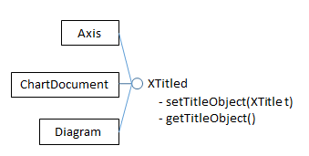
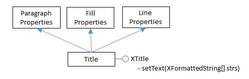
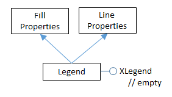
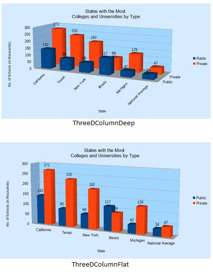
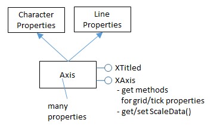

# Chapter 29. Column Charts 
 
 
All the chart examples in the next four chapters come from 
the same program, Chart2Views.java, which loads a 
spreadsheet from "chartsData.ods". Depending on the 
function, a different table in the sheet is used to create a 
chart from a template. The main() function is: 
 
// in Chart2Views.java 
private static final String CHARTS_DATA = 
"chartsData.ods"; 
 
 
public static void main(String args[]) 
{ 
  XComponentLoader loader = Lo.loadOffice(); 
  XSpreadsheetDocument doc = Calc.openDoc(CHARTS_DATA, loader); 
  if (doc == null) { 
    System.out.println("Could not open " + CHARTS_DATA); 
    Lo.closeOffice(); 
    return; 
  } 
  GUI.setVisible(doc, true); 
  XSpreadsheet sheet = Calc.getSheet(doc, 0); 
 
  // ---- use different chart templates ---- 
 
  XChartDocument chartDoc = colChart(doc, sheet); 
                                // see sections 1-3 
 
  // String[] templateNames = Chart2.getChartTemplates(chartDoc); 
                                // section 4 
  // Lo.printNames(templateNames, 1); 
 
  // multColChart(doc, sheet);  // sections 5 & 6 
  // colLineChart(doc, sheet);  // section 7 
 
  // barChart(doc, sheet); 
 
  // pieChart(doc, sheet); 
  // pie3DChart(doc, sheet); 
  // donutChart(doc, sheet); 
 
  // areaChart(doc, sheet); 
 
  // lineChart(doc, sheet); 
  // linesChart(doc, sheet); 
 
  // scatterChart(doc, sheet); 
  // scatterLineLogChart(doc, sheet); 
  // scatterLineErrorChart(doc, sheet); 
 
  // labeledBubbleChart(doc, sheet); 
 

!!! note "Topics"
    Creating a Chart 
Title; Creating Axis 
Titles; Rotating Axis 
Titles; What Chart 
Templates are 
Available?; Multiple 
Columns; 3D Pizazz; 
The Column and Line 
Chart 
Example folders: 
"Chart2 Tests" and 
"Utils" 
  // netChart(doc, sheet); 
 
  // happyStockChart(doc, sheet); 
  // stockPricesChart(doc, sheet); 
 
  Lo.waitEnter(); 
  Lo.closeDoc(doc); 
  Lo.closeOffice(); 
}  // end of main() 
 
colChart() utilizes the "Sneakers Sold this Month" table in "chartsData.ods" (see 
Figure 1) to generate the column chart in Figure 2. 

 
 

Figure 1. The "Sneakers Sold this Month" Table. 

 
 

Figure 2. The Column Chart for the Table in Figure 1. 

 
colChart() is: 
 
// in Chart2Views.java 
private static XChartDocument colChart(XSpreadsheetDocument doc, 
                                       XSpreadsheet sheet) 
{ 
  CellRangeAddress rangeAddr = Calc.getAddress(sheet, "A2:B8"); 
  XChartDocument chartDoc = 
      Chart2.insertChart(sheet, rangeAddr, "C3", 15, 11, "Column"); 
  Calc.gotoCell(doc, "A1"); 
 
  Chart2.setTitle(chartDoc, Calc.getString(sheet, "A1")); 
  Chart2.setXAxisTitle(chartDoc, Calc.getString(sheet, "A2")); 
  Chart2.setYAxisTitle(chartDoc, Calc.getString(sheet, "B2")); 
  Chart2.rotateYAxisTitle(chartDoc, 90); 
  return chartDoc; 
}  // end of colChart() 
 
The column chart created by Chart2.insertChart() utilizes the cell range A2:B8, which 
spans the two columns of the table, but not the title in cell A1. The "C3" argument 
specifies where the top-left corner of the chart will be positioned in the sheet, and 
15x11 are the dimensions of the image in millimeters.  

Calc.gotoCell() causes the application window's view of the spreadsheet to move so 
that cell "A1" is visible, which lets the user see the sneakers table and the chart 
together.  

If the three set methods and rotateYAxisTitle() are left out of colChart(), then the 
generated chart will have no titles as in Figure 3. 

 
 

Figure 3. The Column Chart for the Table in Figure 1, with no Titles. 

 
## 1.  Creating a Chart Title 

Chart2.setTitle() is passed a string which becomes the chart's title. For example: 
 
// part of colChart() in Chart2Views.java... 

Chart2.setTitle(chartDoc, Calc.getString(sheet, "A1")); 
 
utilizes the string from cell "A1" of the spreadsheet (see Figure 1). 

Setting a title requires three interfaces: XTitled, XTitle, and XFormattedString. 

XTitled is utilized by several chart services, as shown in Figure 4. 

 
 

Figure 4. Services Using the XTitled Interface. 

 
The XChartDocument interface is converted into XTitled by Chart2.setTitle(), so an 
XTitle object can be assigned to the chart: 
 
// in the Chart2 class 
public static void setTitle(XChartDocument chartDoc, String title) 
/* set the title, and use Arial, 14 pt style */ 
{   
  System.out.println("Chart title: \"" + title + "\""); 
  XTitled xTitled = Lo.qi(XTitled.class, chartDoc); 
  XTitle xtitle = createTitle(title); 
  if (xtitle != null) { 
    xTitled.setTitleObject(xtitle); 
    setXTitleFont(xtitle, "Arial", 14); 
  } 
}  // end of setTitle() 
 
The XTitle object is an instance of the Title service which inherits a wide assortment 
of properties related to the text's paragraph, fill, and line styling, as shown in Figure 5. 

 

Figure 5. The Title Service. 

 
Text is added to the XTitle object by Chart2.createTitle(), as an XFormattedString 
array: 
 
// in the Chart2 class 
public static XTitle createTitle(String titleString) 
{ 
  XTitle xtitle = Lo.createInstanceMCF(XTitle.class,  
                            "com.sun.star.chart2.Title"); 
  if (xtitle == null) { 
    System.out.println("Unable to create xtitle interface"); 
    return null; 
  }  
 
  XFormattedString xtitleStr =  
       Lo.createInstanceMCF(XFormattedString.class,  
           "com.sun.star.chart2.FormattedString"); 
  if (xtitleStr == null) { 
    System.out.println("Unable to create formatted string"); 
    return null; 
  }  
 
  xtitleStr.setString(titleString); 
  XFormattedString[] titleArray =  
             new XFormattedString[] {xtitleStr}; 
  xtitle.setText(titleArray); 
  return xtitle; 
}  // end of createTitle() 
 
The use of an XFormatttedString[] array may seem to be overkill when the title is a 
single string, but it also allows character properties to be associated with the string 
through XFormattedString2, as shown in Figure 6. 

 
 

Figure 6. The FormattedString Service. 

 
Character properties allow the font and point size of the title to be changed to Arial 
14pt by Chart2.setXTitleFont(): 
 
// in the Chart2 class 
public static void setXTitleFont(XTitle xtitle,  
                                 String fontName, int ptSize) 
{ 
  XFormattedString[] foStrs = xtitle.getText(); 
  if (foStrs != null) { 
    Props.setProperty(foStrs[0], "CharFontName", fontName); 
    Props.setProperty(foStrs[0], "CharHeight", ptSize); 
  } 
}  // end of setXTitleFont() 
 
The "CharFontName" and "CharHeight" properties come from the 
CharacterProperties class. 

 
## 2.  Creating Axis Titles 

Setting the axes titles needs a reference to the XAxis interface. Incidentally, this 
interface name is a little misleading since "X" is the naming convention for interfaces, 
not a reference to the x-axis.  

Figure 9 in Chapter 28 shows that the XAxis interface is available via the 
XCoordinateSystem interface, which can be obtained by calling 
Chart2.getCoordSystem(). XCoordinateSystem.getAxisByDimension() can then be 
employed to get an axis reference. This is implemented by Chart2.getAxis(): 
 
// in the Chart2 class 
// globals: axis values 
public static final int X_AXIS = 0; 
public static final int Y_AXIS = 1; 
public static final int Z_AXIS = 2; 
 
 
public static XAxis getAxis(XChartDocument chartDoc,  
                                  int axisVal, int idx) 
{  
  XCoordinateSystem coordSys = getCoordSystem(chartDoc); 
  try { 
    return coordSys.getAxisByDimension(axisVal, idx); 
  } 
  catch(Exception ex) { 
    System.out.println("Could not get the axis"); 
    return null; 
  } 
}  // end of getAxis() 
 
XCoordinateSystem.getAxisByDimension() takes two integer arguments: the first 
represents the axis (x-, y-, or  z-), while the second is a primary or secondary index (0 
or 1) for the chosen axis. Chart2.java includes wrapper functions for Chart2.getAxis() 
for the most common cases: 
 
// in the Chart2 class 
public static XAxis getXAxis(XChartDocument chartDoc) 
{  return getAxis(chartDoc, Chart2.X_AXIS, 0);  } 
 
public static XAxis getYAxis(XChartDocument chartDoc) 
{  return getAxis(chartDoc, Chart2.Y_AXIS, 0);  } 
 
public static XAxis getXAxis2(XChartDocument chartDoc) 
{  return getAxis(chartDoc, Chart2.X_AXIS, 1);  } 
 
public static XAxis getYAxis2(XChartDocument chartDoc) 
{  return getAxis(chartDoc, Chart2.Y_AXIS, 1);  } 
 
Chart2.setAxisTitle() calls Chart2.getAxis() to get a reference to the correct axis, and 
then reuses many of the methods described earlier for setting the chart title: 
 
// in the Chart2 class 
public static void setAxisTitle(XChartDocument chartDoc,  
                     String title, int axisVal, int idx) 
{  
  XAxis axis = getAxis(chartDoc, axisVal, idx); 
  if (axis == null) 
    return; 
  XTitled titledAxis = Lo.qi(XTitled.class, axis); 
  XTitle xtitle = createTitle(title); 
  if (xtitle != null) { 
    titledAxis.setTitleObject(xtitle); 
    setXTitleFont(xtitle, "Arial", 12);  // Arial 12pt 
  } 
}  // end of setAxisTitle() 
 
As with Chart2.getAxis(), Chart2.java includes wrapper methods for 
Chart2.setAxisTitle() to simplify common axis cases: 
 
// in the Chart2 class 
public static void setXAxisTitle(XChartDocument chartDoc,  
                                 String title) 
{  setAxisTitle(chartDoc, title, Chart2.X_AXIS, 0);  } 
 
public static void setYAxisTitle(XChartDocument chartDoc,  
                                 String title) 
{  setAxisTitle(chartDoc, title, Chart2.Y_AXIS, 0);  } 
 
 
public static void setXAxis2Title(XChartDocument chartDoc,  
                                  String title) 
{  setAxisTitle(chartDoc, title, Chart2.X_AXIS, 1);  } 
 
public static void setYAxis2Title(XChartDocument chartDoc,  
                                  String title) 
{  setAxisTitle(chartDoc, title, Chart2.Y_AXIS, 1);  } 
 
 
## 3.  Rotating Axis Titles 

The default orientation for titles is horizontal, which is fine for the chart and x-axis 
titles, but can cause the y-axis title to occupy too much horizontal space. The solution 
is to call Chart2.rotateYAxisTitle() with an angle (usually 90 degrees) to turn the text 
counter-clockwise so it's vertically orientated (see Figure 2). 

The implementation accesses the XTitle interface for the axis title, and then modifies 
its "TextRotation" property from the Title service (see Figure 5). 

 
// in the Chart2 class 
public static void rotateYAxisTitle(XChartDocument chartDoc,  
                                    int angle) 
{  rotateAxisTitle(chartDoc, Chart2.Y_AXIS, 0, angle);  } 
 
 
public static void rotateAxisTitle(XChartDocument chartDoc,  
                                   int axisVal, int idx, int angle) 
// + angle is rotation counter-clockwise from horizontal 
{ 
  XTitle xtitle = getAxisTitle(chartDoc, axisVal, idx); 
  if (xtitle != null) 
    Props.setProperty(xtitle, "TextRotation", angle); 
}  // end of rotateAxisTitle() 
 
 
 
public static XTitle getAxisTitle(XChartDocument chartDoc,  
                                  int axisVal, int idx) 
{ XAxis axis = getAxis(chartDoc, axisVal, idx); 
  if (axis == null) 
    return null; 
  XTitled titledAxis = Lo.qi(XTitled.class, axis); 
  return titledAxis.getTitleObject(); 
}  // end of getAxisTitle() 
 
 
## 4.  What Chart Templates are Available? 

colChart() in Chart2Views.java returns its XChartDocument reference. This isn't 
necessary for rendering the chart, but allows the reference to be passed to 
Chart2.getChartTemplates(): 
 
// in main() in Chart2Views.java... 

XChartDocument chartDoc = colChart(doc, sheet); 
String[] templateNames = Chart2.getChartTemplates(chartDoc); 
Lo.printNames(templateNames, 1); 
 
The only way to list the chart templates supported by the chart2 module (i.e. those 
shown in Table 1 of Chapter 28) is by querying an existing chart document. That's the 
purpose of Chart2.getChartTemplates(): 
 
// in the Chart2 class 
public static String[] getChartTemplates(XChartDocument chartDoc) 
{ 
  XChartTypeManager ctMan = chartDoc.getChartTypeManager(); 
  return Info.getAvailableServices(ctMan); 
} 
 
Normally XChartTypeManager is used to create a template instance, but 
Info.getAvailableServices() accesses its 
XMultiServiceFactory.getAvailableServiceNames() method to list the names of all its 
supported services, which are templates: 
 
// in the Info class 
public static String[] getAvailableServices(Object obj) 
{ 
  XMultiServiceFactory msf =  
                  Lo.qi(XMultiServiceFactory.class, obj); 
  String[] serviceNames = msf.getAvailableServiceNames(); 
  Arrays.sort(serviceNames); 
  return serviceNames; 
}  // end of getAvailableServices() 
 
The output lists has 66 names, starting and ending like so: 
 
"com.sun.star.chart2.template.Area" 
"com.sun.star.chart2.template.Bar" 
"com.sun.star.chart2.template.Bubble" 
"com.sun.star.chart2.template.Column" 
"com.sun.star.chart2.template.ColumnWithLine" 
     : 
"com.sun.star.chart2.template.ThreeDLineDeep" 
"com.sun.star.chart2.template.ThreeDPie" 
"com.sun.star.chart2.template.ThreeDPieAllExploded" 
"com.sun.star.chart2.template.ThreeDScatter" 
 
Sixty-four of those names appear in Chapter 28's Table 1. The two missing are 
"GL3DBar" and "GL3DBarRoundedRectangle", which were reported as being "not 
ready for general use" in an OpenOffice forum posting from May 2014. 

 
 
## 5.  Multiple Columns 

The multColChart() method in Chart2Views.java uses a table containing three 
columns of data (see Figure 7) to generate two column graphs in the same chart, as in 

Figure 8. 

 
 

Figure 7. The "States with the Most Colleges" Table. 

 
 

Figure 8. A Multiple Column Chart Generated from the Table in Figure 7. 

 
multColChart() is: 
 
// in Chart2Views.java 
private static void multColChart(XSpreadsheetDocument doc, 
                                 XSpreadsheet sheet) 
{ 
  CellRangeAddress rangeAddr = Calc.getAddress(sheet, "E15:G21"); 
  XChartDocument chartDoc = 
     Chart2.insertChart(sheet, rangeAddr, "A22", 20, 11, "Column"); 
                         // ThreeDColumnDeep, ThreeDColumnFlat 
  Calc.gotoCell(doc, "A13"); 
 
  Chart2.setTitle(chartDoc, Calc.getString(sheet, "E13")); 
  Chart2.setXAxisTitle(chartDoc, Calc.getString(sheet, "E15")); 
  Chart2.setYAxisTitle(chartDoc, Calc.getString(sheet, "F14")); 
  Chart2.rotateYAxisTitle(chartDoc, 90); 
  Chart2.viewLegend(chartDoc, true); 
 
  // for a 3D version 
  // Chart2.showAxisLabel(chartDoc, Chart2.Z_AXIS, 0, false); 
  // Chart2.setChartShape3D(chartDoc, "cylinder");   
                               // box, cylinder, cone, pyramid 
}  // end of multColChart() 
 
The same "Column" chart template is used as in colChart(), and the additional column 
of data is treated as an extra column graph. The chart title and axis titles are added in 
the same way as before, and a legend is included by calling Chart2.viewLegend(): 
 
// in the Chart2 class 
public static void viewLegend(XChartDocument chartDoc,  
                              boolean isVisible) 
{ 
  XDiagram diagram = chartDoc.getFirstDiagram(); 
  XLegend legend = diagram.getLegend(); 
  if (isVisible && (legend == null)) { 
    XLegend leg = Lo.createInstanceMCF(XLegend.class,  
                              "com.sun.star.chart2.Legend"); 
    Props.setProperty(leg, "LineStyle", LineStyle.NONE); 
                         // no outline around legend 
    Props.setProperty(leg, "FillStyle", FillStyle.SOLID); 
    Props.setProperty(leg, "FillTransparence", 100);   
                         // transparent solid background 
    diagram.setLegend(leg); 
  } 
  Props.setProperty(diagram.getLegend(), "Show", isVisible);   
                                   // toggle visibility 
}  // end of viewLegend() 
 
The legend is accessible via the chart diagram service. viewLegend() creates an 
instance, and sets a few properties to make it look nicer. 

Figure 9 shows the Legend service, which defines several properties, and inherits 
many others from FillProperties and LineProperties. The "LineStyle", "FillStyle", and 
"FillTransparence" properties utilized in viewLegend() come from the inherited 
property classes, but "Show" is from the Legend service. 

 
 

Figure 9. The Legend Service. 

 
The XLegend interface contains no methods, and is used only to access the properties 
in its defining service. 

 
## 6.  3D Pizazz 

I'm not a fan of 3D charts which are often harder to understand than their 2D 
equivalents, even if they do look more "hi-tech". But if you really want  a 3D version 
of a chart, it's mostly just a matter of changing the template name in the call to 
Chart2.insertChart(). 

If the "Column" string is changed to "ThreeDColumnDeep" or "ThreeDColumnFlat" 
in insertChart() in multColChart(), then the charts in Figure 10 appear. 

 
 

Figure 10. Deep and Flat 3D Column Charts. 

 
"deep" orders the two 3D graphs along the z-axis, and labels the axis.  

The x-axis labels are rotated automatically in the top-most chart of Figure 10 because 
the width of the chart wasn't sufficient to draw them horizontally, and that's caused 
the graphs to be squashed into less vertical space.  

multColChart() contains two commented out lines which illustrate how a 3D graph 
can be changed: 
 
// part of multColChart() in Chart2Views.java... 

Chart2.showAxisLabel(chartDoc, Chart2.Z_AXIS, 0, false);   
                                           // hide labels 
Chart2.setChartShape3D(chartDoc, "cylinder");   
                  // shape can be: box, cylinder, cone, pyramid 
 
Chart2.showAxisLabel() is passed the boolean false to switch off the display of the z-
axis labels. Chart2.setChartShape3D() changes the shape of the columns; in this case 
to cylinders, as in Figure 11. 

 
 

Figure 11. Modified Deep 3D Column Chart. 

 
Chart2.showAxisLabel() uses Chart2.getAxis() to access the XAxis interface, and 
then modifies its "Show" property: 
 
// in the Chart2 class 
public static void showAxisLabel(XChartDocument chartDoc,  
                 int axisVal, int idx, boolean isVisible) 
{ XAxis axis = getAxis(chartDoc, axisVal, idx); 
  if (axis == null) 
    return; 
  //Props.showObjProps("Axis", axis); 
  Props.setProperty(axis, "Show", isVisible); 
}  // end of showAxisLabel() 
 
The Axis service contains a large assortment of properties (online documentation can 
be read by calling lodoc chart2 axis service), and inherits character and line 
properties depicted in Figure 12. 

 

Figure 12. The Axis Service. 

 
Chart2.setChartShape3D() affects the data 'points' (which in a 3D column chart are 
boxes by default). This requires access to the XDataSeries array of data points by 
calling Chart2.getDataSeries(), and then the "Geometry3D" property in the DataSeries 
service is modified. Figure 11 in Chapter 28 shows the service and its interfaces, and 
most of its properties are inherited from the DataPointProperties class, including 
"Geometry3D". The code for  Chart2.setChartShape3D(): 
 
// in the Chart2 class 
public static void setChartShape3D(XChartDocument chartDoc,  
                                   String shape) 
{  
  XDataSeries[] dataSeriesArr = getDataSeries(chartDoc); 
  for (XDataSeries dataSeries : dataSeriesArr) { 
    if (shape.equals("box")) 
      Props.setProperty(dataSeries, "Geometry3D",  
                                    DataPointGeometry3D.CUBOID); 
    else if (shape.equals("cylinder")) 
      Props.setProperty(dataSeries, "Geometry3D",  
                                    DataPointGeometry3D.CYLINDER); 
    else if (shape.equals("cone")) 
      Props.setProperty(dataSeries, "Geometry3D",  
                                    DataPointGeometry3D.CONE); 
    else if (shape.equals("pyramid")) 
      Props.setProperty(dataSeries, "Geometry3D",  
                                    DataPointGeometry3D.PYRAMID); 
    else 
      System.out.println("Did not recognize 3D shape: " + shape); 
  } 
}  // end of setChartShape3D() 
 
 
## 7.  The Column and Line Chart 

Another way to display the multiple columns of data in the "States with the Most 
Colleges" table (Figure 7) is to draw a column and line chart. The column is generated 
from the first data column, and the line graph uses the second column. The result is 
shown in Figure 13. 

 
 

Figure 13. A Column and Line Chart Generated from the Table in Figure 7. 

 
colLineChart() in Chart2Views.java generates Figure 13: 
 
// in Chart2Views.java 
private static void colLineChart(XSpreadsheetDocument doc, 
                                 XSpreadsheet sheet) 
{ 
  CellRangeAddress rangeAddr = Calc.getAddress(sheet, "E15:G21"); 
  XChartDocument chartDoc = Chart2.insertChart(sheet,  
                     rangeAddr, "A22", 20, 11, "ColumnWithLine"); 
  Calc.gotoCell(doc, "A13"); 
 
  Chart2.setTitle(chartDoc, Calc.getString(sheet, "E13")); 
  Chart2.setXAxisTitle(chartDoc, Calc.getString(sheet, "E15")); 
  Chart2.setYAxisTitle(chartDoc, Calc.getString(sheet, "F14")); 
  Chart2.rotateYAxisTitle(chartDoc, 90); 
  Chart2.viewLegend(chartDoc, true); 
}  // end of colLineChart() 
 
It's identical to mulColChart() except for the template string ("ColumnWithLine") 
passed to Chart2.insertChart(). 

A chart's coordinate system may utilize multiple chart types. Up to now a chart 
template (e.g. "Column") has been converted to a single chart type (e.g. 

ColumnChartType) by the chart API (specifically by the chart type manager), but the 
"ColumnWithLine" template is different. The manager implements that template  
using two chart types, "ColumnChartType" and "LineChartType". This is reported by 
Chart2.insertChart() calling Chart2.printChartTypes(): 
 
No. of chart types: 2 
  com.sun.star.chart2.ColumnChartType 
  com.sun.star.chart2.LineChartType 
 
Chart2.printChartTypes() uses Chart2.getChartTypes(), which was defined earlier: 
 
// in the Chart2 class 
public static void printChartTypes(XChartDocument chartDoc) 
{ 
  XChartType[] chartTypes = getChartTypes(chartDoc); 
  if (chartTypes.length > 1) { 
    System.out.println("No. of chart types: " + chartTypes.length); 
    for(XChartType ct : chartTypes) 
      System.out.println("  " + ct.getChartType()); 
  } 
  else 
    System.out.println("Chart type: " +  
                          chartTypes[0].getChartType()); 
}  // end of printChartTypes() 
 
Why is this separation of a single template into two chart types important?  
The short answer is that it complicates the search for a chart template's data. For 
example, my earlier Chart2.getChartType() returns the first chart type in the 
XChartType[] array since most templates only use a single chart type:  
 
// in the Chart2 class 
public static XChartType getChartType(XChartDocument chartDoc) 
{ 
  XChartType[] chartTypes = getChartTypes(chartDoc); 
  return chartTypes[0]; 
} 
 
This method is insufficient for examining a chart created with the "ColumnWithLine" 
template since the XChartType[] array holds two chart types. A programmer will have 
to use findChartType(), which searches the array for the specified chart type: 
 
// in the Chart2 class 
public static XChartType findChartType(XChartDocument chartDoc,  
                                       String chartType) 
{ String srchName = "com.sun.star.chart2." +  
                               chartType.toLowerCase(); 
  XChartType[] chartTypes = getChartTypes(chartDoc); 
  for(XChartType ct : chartTypes) { 
    String ctName = ct.getChartType().toLowerCase(); 
    if (ctName.equals(srchName)) 
      return ct; 
  } 
  System.out.println("Chart type " + srchName + " not found"); 
  return null; 
}  // end of findChartType() 
 
For example, the following call returns a reference to the line chart type: 
XChartType lineCT = Chart2.findChartType(chartDoc, "LineChartType"); 
The simple getChartType()  is used in Chart2.getDataSeries(): 
 
// in the Chart2 class 
public static XDataSeries[] getDataSeries(XChartDocument chartDoc) 
{ 
  XChartType xChartType = getChartType(chartDoc); 
  XDataSeriesContainer dsCon =  
                   Lo.qi(XDataSeriesContainer.class, xChartType); 
  return dsCon.getDataSeries(); 
}  //end of getDataSeries() 
 
This means that Chart2.getDataSeries() can only access the data associated with the 
column (the first chart type) in a "ColumnWithLine" chart document. The fix is to use 
a more complex version of Chart2.getDataSeries(): 
 
// in the Chart2 class 
public static XDataSeries[] getDataSeries(XChartDocument chartDoc,  
                                          String chartType) 
// get the data series associated with the specified chart type 
{ 
  XChartType xChartType = findChartType(chartDoc, chartType); 
  if (xChartType == null) 
    return null; 
  XDataSeriesContainer dsCon =  
                   Lo.qi(XDataSeriesContainer.class, xChartType); 
  return dsCon.getDataSeries(); 
}  //end of getDataSeries() 
 
 
This version requires a chart type string argument to get the correct chart type. For 
example, the call: 
XDataSeries[] ds = Chart2.getDataSeries(chartDoc, "LineChartType"); 
returns the data series associated with the line chart type. 

 
 
