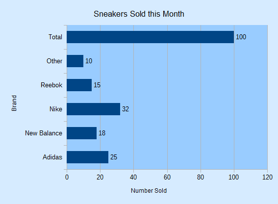
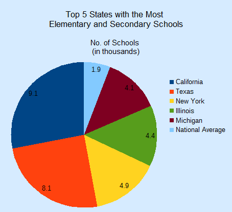
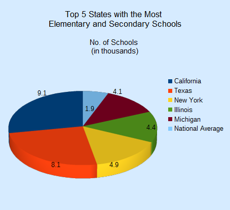
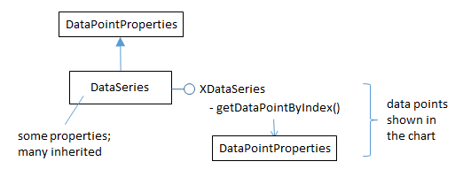
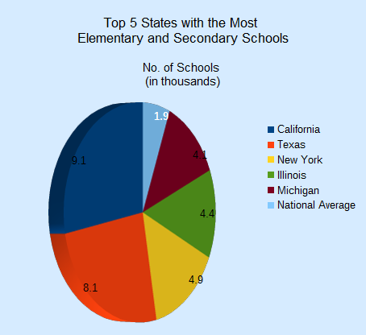
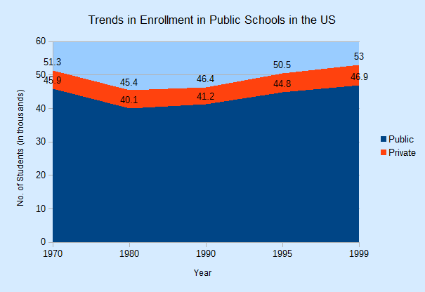
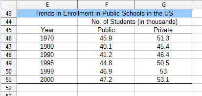
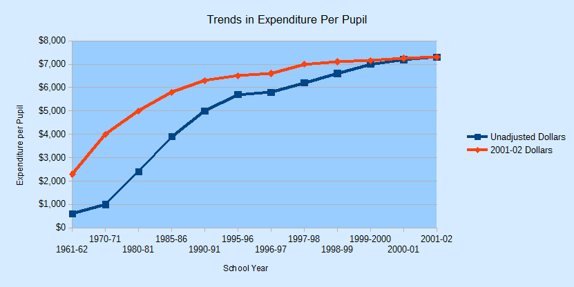
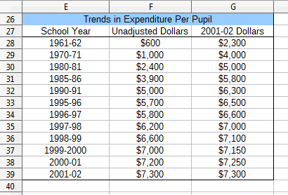

# Chapter 30. Bar, Pie, Area, Line Charts 

!!! note "Topics"
    The Bar Chart; 
    The Pie Chart; 3D Pie; 
    Donuts; The Area Chart; 
    The Line Chart: multiple 
    lines 

    Example folders: 
    "Chart2 Tests" and 
    "Utils" 
 
 
This chapter continues using the Chart2Views.java 
example from the previous chapter, but looks at how bar, 
pie (including 3D and donut versions), area, and line 
charts can be generated from spreadsheet data. The 
relevant lines of Chart2Views.java are: 
 
// part of Chart2Views.java 
public static void main(String args[]) 
{ 
  XComponentLoader loader = Lo.loadOffice(); 
  XSpreadsheetDocument doc = Calc.openDoc(CHARTS_DATA, loader); 
 
  GUI.setVisible(doc, true); 
  XSpreadsheet sheet = Calc.getSheet(doc, 0); 
 
  // ---- use different chart templates ---- 
 
  barChart(doc, sheet);       // see section 1 
 
  // pieChart(doc, sheet);    // section 2 
  // pie3DChart(doc, sheet);  // section 2.1 
  // donutChart(doc, sheet);  // section 2.3 
 
  // areaChart(doc, sheet);   // section 3 
 
  // lineChart(doc, sheet); 
  // linesChart(doc, sheet);  // section 4 
 
         :  // more chart examples 
 
  Lo.waitEnter(); 
  Lo.closeDoc(doc); 
  Lo.closeOffice(); 
}  // end of main() 
 
 
## 1.  The Bar Chart 

A bar chart is generated by barChart() in Chart2Views.java using the "Sneakers Sold 
this Month" Table from Figure 1. 

 
 

Figure 1. The "Sneakers Sold this Month" Table. 

 
The resulting chart is shown in Figure 2. 

 
 

Figure 2. The Bar Chart for the Table in Figure 1. 

 
It's informative to compare the bar chart in Figure 2 with the column chart for the 
same data in Figure 2 of Chapter 29. The data bars and axes have been swapped, so 
the x-axis in the column chart is the y-axis in the bar chart, and vice versa. 

barChart() is: 
 
// in Chart2Views.java 
private static void barChart(XSpreadsheetDocument doc, 
                             XSpreadsheet sheet) 
{ 
  CellRangeAddress rangeAddr = Calc.getAddress(sheet, "A2:B8");  
  XChartDocument chartDoc = 
        Chart2.insertChart(sheet, rangeAddr, "B3", 15, 11, "Bar"); 
  Calc.gotoCell(doc, "A1"); 
 
  Chart2.setTitle(chartDoc, Calc.getString(sheet, "A1")); 
  Chart2.setXAxisTitle(chartDoc, Calc.getString(sheet, "A2")); 
  Chart2.setYAxisTitle(chartDoc, Calc.getString(sheet, "B2")); 
  Chart2.rotateXAxisTitle(chartDoc, 90); 
                            // rotate vertical x-axis 
}  // end of barChart() 
 
Although the axes have been swapped in the chart drawing, the API still uses the 
same indices to refer to the axes in XCoordinateSystem.getAxisByDimension(). This 
means that "x-axis" is the vertical axis in a bar chart, and "y-axis" the horizontal. This 
is most apparent in the last line of barChart(): 
Chart2.rotateXAxisTitle(chartDoc, 90); 
This causes the "x-axis" title to rotate 90 degrees counter-clockwise, which affects the 
"Brand" string on the vertical axis of the chart (see Figure 2). 

 
 
## 2.  The Pie Chart 

pieChart() in Chart2Views.java utilizes the "Top 5 States with the Most Elementary 
and Secondary Schools" table in "chartsData.ods" (see Figure 3) to generate the pie 
chart in Figure 4. 

 
 

Figure 3. The "Top 5 States" Table. 

 
 

Figure 4. A Pie Chart for the Table in Figure 3. 

 
pieChart() is: 
 
// in Chart2Views.java 
private static void pieChart(XSpreadsheetDocument doc, 
                              XSpreadsheet sheet) 
{ 
  CellRangeAddress rangeAddr = Calc.getAddress(sheet, "E2:F8"); 
  XChartDocument chartDoc = 
        Chart2.insertChart(sheet, rangeAddr, "B10", 12, 11, "Pie"); 
                                           // Pie, PieAllExploded  
  Calc.gotoCell(doc, "A1"); 
 
  Chart2.setTitle(chartDoc, Calc.getString(sheet, "E1")); 
  Chart2.setSubtitle(chartDoc, Calc.getString(sheet, "F2")); 
  Chart2.viewLegend(chartDoc, true); 
}  // end of pieChart() 
 
Chart2.setSubtitle() displays the secondary heading in the chart; there's little 
difference between it and the earlier setTitle(): 
 
// in the Chart2 class 
public static void setSubtitle(XChartDocument chartDoc,  
                                        String subtitle) 
{ XDiagram diagram = chartDoc.getFirstDiagram(); 
  XTitled xTitled = Lo.qi(XTitled.class, diagram); 
  XTitle xtitle = createTitle(subtitle); 
  if (xtitle != null) { 
    xTitled.setTitleObject(xtitle); 
    setXTitleFont(xtitle, "Arial", 12); 
  } 
}  // end of setSubtitle() 
 
The XTitled reference for the subtitle is obtained from XDiagram, whereas the chart 
title is part of XChartDocument. 

 
### 2.1.  More 3D Pizzazz 

For some reason people like 3D pie charts, so pie3DChart() in Chart2Views.java 
produces one (see Figure 5) using the same table as the 2D version. 

 
 

Figure 5. A 3D Pie Chart for the Table in Figure 3. 

 
pie3DChart() is the same as pieChart() except that the "ThreeDPie" template is used: 
 
// in Chart2Views.java 
private static void pie3DChart(XSpreadsheetDocument doc, 
                               XSpreadsheet sheet) 
{ CellRangeAddress rangeAddr = Calc.getAddress(sheet, "E2:F8"); 
  XChartDocument chartDoc = 
           Chart2.insertChart(sheet, rangeAddr, "B10", 12, 11,  
                                              "ThreeDPie"); 
                            // ThreeDPie, ThreeDPieAllExploded 
  Calc.gotoCell(doc, "A1"); 
 
  Chart2.setTitle(chartDoc, Calc.getString(sheet, "E1")); 
  Chart2.setSubtitle(chartDoc, Calc.getString(sheet, "F2")); 
  Chart2.viewLegend(chartDoc, true); 
 
    :   // more code explained in a moment 
}  // end of pie3DChart() 
 
The drawback of 3D pie charts is the shape distortion caused by the perspective. For 
example, the red segment in the foreground of Figure 5 seems bigger than the dark 
blue segment at the back but that segment is numerical larger. 

The default rotation of a 3D pie is -60 degrees around the horizontal so its bottom 
edge appears to extend out of the page, and 0 degrees rotation around the vertical. 

These can be changed by modifying the "RotationHorizontal" and "RotationVertical" 
properties of the Diagram service. For example: 
 
// part of pie3DChart() in Chart2Views.java... 

XDiagram diagram = chartDoc.getFirstDiagram(); 
Props.setProperty(diagram, "RotationHorizontal", 0); 
                                 // no horizontal rotation 
Props.setProperty(diagram, "RotationVertical", -45); 
                     //  -ve rotates left edge out of page 
 
This changes the pie chart's appearance to be as in Figure 6. 

 
 

Figure 6. A Rotated 3D Pie Chart for the Table in Figure 3. 

 
The easiest way to see the current values for the diagram's properties is to add a call to 
Props.showObjProps() to the code above: 
Props.showObjProps("Diagram", diagram); 
 
### 2.2.  Changing the Data Point Labels 

Two problems with Figures 5 and 6 are the small data point labels and their default 
font color (black) which doesn't stand out against the darker pie segments.  

These issues can be fixed by changing some of the font related properties for the data 
points. This means a return to the DataSeries service shown in Figure 7. 

 

Figure 7. The DataSeries Service and XDataSeries Interface. 

 
The DataPointProperties class appears twice in Figure 7 because it allows the data 
point properties to be changed in two ways. The DataPointProperties class associated 
with the DataSeries service allows a property change to be applied to all the points 
collectively. The DataPointProperties class associated with a particular point allows a 
property to be changed only in that point. 

For example, the former approach is used to change all the data point labels in the pie 
chart to 14 pt, bold, and white: 
 
// end of pie3DChart() in Chart2Views.java... 

    : 
// change all the data points to be bold white 14pt 
XDataSeries[] ds = Chart2.getDataSeries(chartDoc); 
Props.setProperty(ds[0], "CharHeight", 14.0); 
Props.setProperty(ds[0], "CharColor", Calc.WHITE); 
Props.setProperty(ds[0], "CharWeight",  
                      com.sun.star.awt.FontWeight.BOLD); 
 
The changes to the chart are shown in Figure 8. 

 
 

Figure 8. A 3D Pie Chart with Changed Data Point Labels. 

 
The second approach is employed to emphasize the "National Average" data point 
label, which is the last one in the series: 
 
// end of pie3DChart() in Chart2Views.java... 

    : 
// change only the last data point to be bold white 14pt 
XPropertySet props = Chart2.getDataPointProps(chartDoc, 0, 5); 
if (props != null) { 
  Props.setProperty(props, "CharHeight", 14.0); 
  Props.setProperty(props, "CharColor", Calc.WHITE); 
  Props.setProperty(props, "CharWeight",  
                       com.sun.star.awt.FontWeight.BOLD); 
} 
 
This produces the chart shown in Figure 9, where only the National Average label is 
changed. 

 
 

Figure 9. A 3D Pie Chart with One Changed Data Point Label. 

 
Chart2.getDataPointProps() takes three arguments – the chart document, the index of 
the data series, and the index of the data point inside that series. The pie chart uses six 
data points, so a valid index will be between 0 and 5.  

If a matching data point is found by Chart2.getDataPointProps() then a reference to its 
properties is returned, allowing that point to be modified: 
 
// in the Chart2 class 
public static XPropertySet getDataPointProps( 
                                 XChartDocument chartDoc, 
                                 int seriesIdx, int idx) 
{ XPropertySet[] propsArr =  
               getDataPointsProps(chartDoc, seriesIdx); 
  if (propsArr == null) 
    return null; 
 
  if ((idx < 0) || (idx >= propsArr.length)) { 
    System.out.println("No data at index " + idx +  
                    "; use 0 to " + (propsArr.length-1)); 
    return null; 
  } 
  return propsArr[idx];  
}  // end getDataPointProps() 
 
A two-argument version of Chart2.getDataPointProps() returns the properties for all 
the data points in a series: 
 
// in the Chart2 class 
public static XPropertySet[] getDataPointsProps( 
                       XChartDocument chartDoc, int seriesIdx) 
// get all the properties for the data in the specified series 
{ 
  XDataSeries[] dataSeriesArr = getDataSeries(chartDoc); 
  if ((seriesIdx < 0) || (seriesIdx >= dataSeriesArr.length)) { 
    System.out.println("Series index is out of range"); 
    return null; 
  } 
 
  ArrayList<XPropertySet> propsList =  
                              new ArrayList<XPropertySet>(); 
  int idx = 0; 
  XPropertySet props = null; 
  do { 
    try { 
      props = dataSeriesArr[seriesIdx].getDataPointByIndex(idx++); 
      if (props != null) 
        propsList.add(props);  
    } 
    catch(com.sun.star.lang.IndexOutOfBoundsException e) {  
      break;   
    } 
  } while (props != null); 
 
  if (propsList.size() == 0) { 
    System.out.println("No Series at index " + seriesIdx); 
    return null; 
  } 
  XPropertySet[] propsArr = new XPropertySet[propsList.size()]; 
  for (int i=0; i < propsList.size(); i++) 
     propsArr[i] = propsList.get(i); 
  return propsArr; 
}  // end getDataPointsProps() 
 
Chart2.getDataSeries() is called to get the data series for the chart type as an array. 

This array is iterated over, collecting the property sets for each data point by calling 
XDataSeries.getDataPointByIndex(). 

 
### 2.3.  Anyone for Donuts? 

If a table has more than one column of data then a "Donut" chart can be used to show 
each column as a ring.  

donutChart() in Chart2Views.java utilizes the "Annual Expenditure on Institutions" 
table in "chartsData.ods" (see Figure 10) to generate the donut chart with two rings in 

Figure 11. 

 
 

Figure 10. The "Annual Expenditure on Institutions" Table. 

 
 

Figure 11. A Donut Chart for the Table in Figure 10. 

 
donutChart() is: 
 
// in Chart2Views.java 
private static void donutChart(XSpreadsheetDocument doc, 
                               XSpreadsheet sheet) 
{ CellRangeAddress rangeAddr = Calc.getAddress(sheet, "A44:C50"); 
  XChartDocument chartDoc = 
      Chart2.insertChart(sheet, rangeAddr, "D43", 15, 11, "Donut"); 
                            // Donut, DonutAllExploded, ThreeDDonut 
  Calc.gotoCell(doc, "A48"); 
 
  Chart2.setTitle(chartDoc, Calc.getString(sheet, "A43")); 
  Chart2.viewLegend(chartDoc, true); 
  Chart2.setSubtitle(chartDoc,  "Outer: " +  
               Calc.getString(sheet, "B44") + "\n" + 
               "Inner: " + Calc.getString(sheet, "C44")); 
}  // end of donutChart() 
 
The only thing of note is the use of a more complex string for Chart2.setSubtitle() to 
display information about both rings. 

 
 
## 3.  The Area Chart 

areaChart() in Chart2Views.java utilizes the "Trends in Enrollment in Public Schools 
in the US" table in "chartsData.ods" (see Figure 12) to generate the area chart in 

Figure 13. 

 
 

Figure 12. The "Annual Expenditure on Institutions" Table. 

 
 

Figure 13. An Area Chart for the Table in Figure 12. 

 
areaChart() is: 
 
// in Chart2Views.java 
private static void areaChart(XSpreadsheetDocument doc, 
                              XSpreadsheet sheet) 
{ 
  CellRangeAddress rangeAddr = Calc.getAddress(sheet, "E45:G50"); 
  XChartDocument chartDoc = 
      Chart2.insertChart(sheet, rangeAddr, "A52", 16, 11, "Area"); 
                       // Area, StackedArea, PercentStackedArea 
  Calc.gotoCell(doc, "A43"); 
 
  Chart2.setTitle(chartDoc, Calc.getString(sheet, "E43")); 
  Chart2.viewLegend(chartDoc, true); 
  Chart2.setXAxisTitle(chartDoc, Calc.getString(sheet, "E45")); 
  Chart2.setYAxisTitle(chartDoc, Calc.getString(sheet, "F44")); 
  Chart2.rotateYAxisTitle(chartDoc, 90); 
}  // end of areaChart() 
 
If  the "Area" template is replaced by "StackedArea" or "PercentStackedArea" then 
the two charts in Figure 14 are generated. 

 
 

Figure 14. Stacked and Percentage Stacked Area Charts for the Table in Figure 12. 

 
 
## 4.  The Line Chart 

linesChart() in Chart2Views.java utilizes the "Trends in Expenditure Per Pupil" table 
in "chartsData.ods" (see Figure 15) to generate two lines marked with symbols in 

Figure 16. 

 
 

Figure 15. The "Trends in Expenditure Per Pupil" Table. 

 
 

Figure 16. Line Charts for the Table in Figure 15. 

 
linesChart() is: 
 
// in Chart2Views.java 
private static void linesChart(XSpreadsheetDocument doc, 
                               XSpreadsheet sheet) 
{ 
  CellRangeAddress rangeAddr = Calc.getAddress(sheet, "E27:G39"); 
  XChartDocument chartDoc = Chart2.insertChart(sheet,  
                      rangeAddr, "A40", 22, 11, "LineSymbol"); 
                       // Line, LineSymbol, StackedLineSymbol 
  Calc.gotoCell(doc, "A26"); 
 
  Chart2.setTitle(chartDoc, Calc.getString(sheet, "E26")); 
  Chart2.viewLegend(chartDoc, true); 
  Chart2.setXAxisTitle(chartDoc, Calc.getString(sheet, "E27")); 
  Chart2.setYAxisTitle(chartDoc, "Expenditure per Pupil"); 
  Chart2.rotateYAxisTitle(chartDoc, 90); 
 
  Chart2.setDataPointLabels(chartDoc, Chart2.DP_NONE);    
                              // too crowded for data points 
}  // end of linesChart() 
 
Chart2.setDataPointLabels() switches off the displaying of the numerical data above 
the symbols so the chart is less cluttered 
There are many different line chart templates, as listed in Table 1 of Chapter 28. The 
"Line" template differs from "LineSymbol" by not including symbols over the data 
points. 

 
