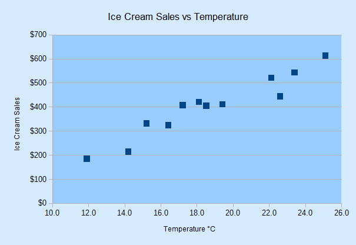
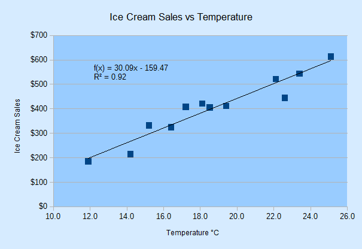
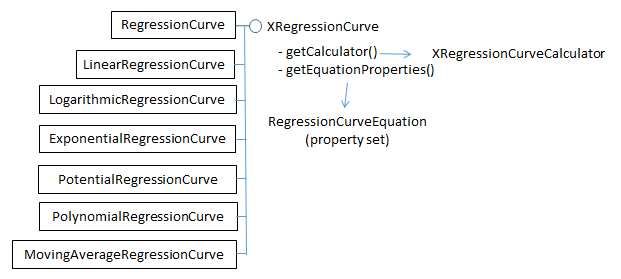
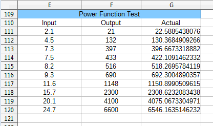
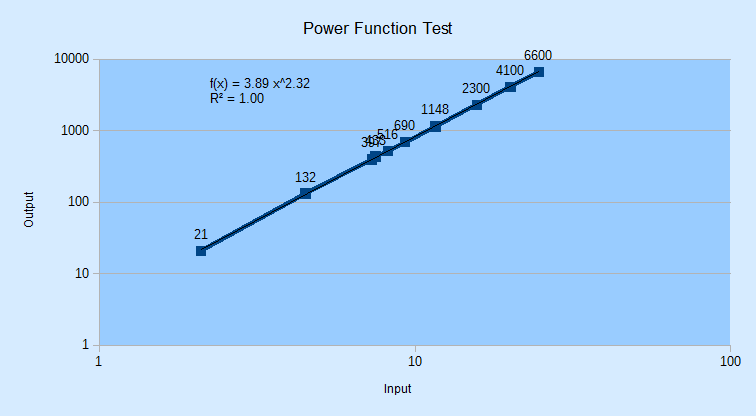
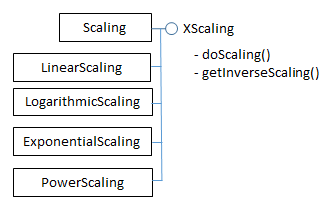
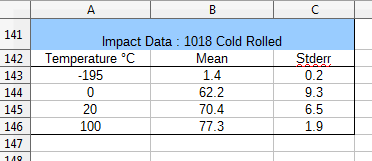
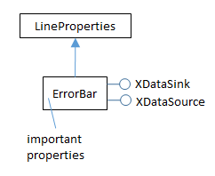

# Chapter 31. XY (Scatter) Charts 
 
 
This chapter continues using the Chart2Views.java 
example from previous chapters, but looks at how various 
kinds of scatter charts can be generated from spreadsheet 
data.  

A scatter chart is a good way to display (x, y) coordinate 
data since the x-axis values are treated as numbers not 
categories. In addition, regression functions can be calculated and displayed, the axis 
scales can be changed, and error bars added. 

The relevant lines of Chart2Views.java are: 
 
// part of Chart2Views.java 
public static void main(String args[]) 
{ 
  XComponentLoader loader = Lo.loadOffice(); 
  XSpreadsheetDocument doc = Calc.openDoc(CHARTS_DATA, loader); 
 
  GUI.setVisible(doc, true); 
  XSpreadsheet sheet = Calc.getSheet(doc, 0); 
 
  // ---- use different chart templates ---- 
 
  scatterChart(doc, sheet);               // see sections 1-3 
  // scatterLineLogChart(doc, sheet);     // section 4 
  // scatterLineErrorChart(doc, sheet);   // section 5 
 
         :  // more chart examples 
 
  Lo.waitEnter(); 
  Lo.closeDoc(doc); 
  Lo.closeOffice(); 
}  // end of main() 
 
## 1.  A Scatter Chart (with Regressions) 

scatterChart() in Chart2Views.java utilizes the "Ice Cream Sales vs. Temperature" 
table in "chartsData.ods" (see Figure 1) to generate the scatter chart in Figure 2. 

 

!!! note "Topics"
   A Scatter Chart 
(with Regressions); 
Calculating Regressions; 
Drawing a Regression 
Curve; Changing Axis 
Scales; Adding Error 
Bars 
Example folders: 
"Chart2 Tests" and 
"Utils" 
 

Figure 1. The  "Ice Cream Sales vs. Temperature" Table. 

 
 

Figure 2. Scatter Chart for the Table in Figure 1. 

 
Note that the x-axis in Figure 1 is numerical, showing values ranging between 10.0 
and 26.0. This range is calculated automatically by the template. 

scatterChart() is: 
 
// in Chart2Views.java 
private static void scatterChart(XSpreadsheetDocument doc, 
                                       XSpreadsheet sheet) 
{ 
  CellRangeAddress rangeAddr = Calc.getAddress(sheet, "A110:B122"); 
  XChartDocument chartDoc = Chart2.insertChart(sheet,  
              rangeAddr, "C109", 16, 11, "ScatterSymbol"); 
                 // ScatterSymbol, ScatterLine, ScatterLineSymbol 
  Calc.gotoCell(doc, "A104"); 
 
  Chart2.setTitle(chartDoc, Calc.getString(sheet, "A109")); 
  Chart2.setXAxisTitle(chartDoc, Calc.getString(sheet, "A110")); 
  Chart2.setYAxisTitle(chartDoc, Calc.getString(sheet, "B110")); 
  Chart2.rotateYAxisTitle(chartDoc, 90); 
  Chart2.setDataPointLabels(chartDoc, Chart2.DP_NONE);    
                                       // reduce clutter 
 
  // Chart2.calcRegressions(chartDoc); 
  // Chart2.drawRegressionCurve(chartDoc, Chart2.LINEAR); 
}  // end of scatterChart() 
 
If the Chart2.calcRegressions() line is uncommented then several different regression 
functions are calculated using the chart's data. Their equations and R
2
 values are 
printed as shown below: 
 
Linear regression curve: 
  Curve equation: f(x) = 30.09x - 159.5 
  R^2 value: 0.917 
 
Logarithmic regression curve: 
  Curve equation: f(x) = 544.1 ln(x) - 1178 
  R^2 value: 0.921 
 
Exponential regression curve: 
  Curve equation: f(x) = 81.62 exp( 0.0826 x ) 
  R^2 value: 0.865 
 
Power regression curve: 
  Curve equation: f(x) = 4.545 x^1.525 
  R^2 value: 0.906 
 
Polynomial regression curve: 
  Curve equation: f(x) =  - 0.5384x^2 + 50.24x - 340.1 
  R^2 value: 0.921 
 
Moving average regression curve: 
  Curve equation: Moving average trend line with period = %PERIOD 
  R^2 value: NaN 
 
A logarithmic or quadratic polynomial are the best matches, but linear is a close third. 

The "moving average" R
2
 result is NaN (Not-a-Number) since no average of period 2 
matches the data. 

If the Chart2.drawRegressionCurve() call is uncommented, the chart drawing will 
include a linear regression line and its equation and R
2
 value (see Figure 3). 

 
 

Figure 3. Scatter Chart with Linear Regression Line for the Table in Figure 1. 

 
The regression function is f(x) = 30.09x - 159.47, and the R
2
 value is 0.92 (to 2 dp). If 
the constant is changed to Chart2.LOGARITHMIC in the call to 
Chart2.drawRegressionCurve() then the generated function is f(x) = 544.1 ln(x) – 
1178 with an R
2
 value of 0.92. Other regression curves are represented by the Chart2 
constants EXPONENTIAL, POWER, POLYNOMIAL, and MOVING_AVERAGE. 

 
## 2.  Calculating Regressions 

Chart2.calcRegressions() is: 
 
// in the Chart2 class 
// globals 
private static final int[] CURVE_KINDS =  
      { LINEAR, LOGARITHMIC, EXPONENTIAL, POWER,  
        POLYNOMIAL, MOVING_AVERAGE }; 
 
private static final String[] CURVE_NAMES =  
      { "Linear", "Logarithmic", "Exponential", "Power",  
        "Polynomial", "Moving average" }; 
 
 
public static void calcRegressions(XChartDocument chartDoc) 
{ 
  for(int i=0; i < CURVE_KINDS.length; i++) { 
    XRegressionCurve curve = createCurve(CURVE_KINDS[i]); 
    System.out.println(CURVE_NAMES[i] + " regression curve:"); 
    evalCurve(chartDoc, curve); 
    System.out.println(); 
  } 
}  // end of calcRegressions() 
 
createCurve() matches the regression constants defined in CURVE_KINDS[] to 
regression services offered by the API: 
 
// in the Chart2 class 
public static XRegressionCurve createCurve(int curveKind) 
{ 
  if (curveKind == LINEAR) 
    return Lo.createInstanceMCF(XRegressionCurve.class,  
                "com.sun.star.chart2.LinearRegressionCurve"); 
  else if (curveKind == LOGARITHMIC) 
    return Lo.createInstanceMCF(XRegressionCurve.class,  
                "com.sun.star.chart2.LogarithmicRegressionCurve"); 
  else if (curveKind == EXPONENTIAL) 
    return Lo.createInstanceMCF(XRegressionCurve.class,  
                "com.sun.star.chart2.ExponentialRegressionCurve"); 
  else if (curveKind == POWER) 
    return Lo.createInstanceMCF(XRegressionCurve.class,  
                "com.sun.star.chart2.PotentialRegressionCurve"); 
  else if (curveKind == POLYNOMIAL)        // assume degree == 2 
    return Lo.createInstanceMCF(XRegressionCurve.class,  
                "com.sun.star.chart2.PolynomialRegressionCurve"); 
  else if (curveKind == MOVING_AVERAGE)    // assume period == 2 
    return Lo.createInstanceMCF(XRegressionCurve.class,  
         "com.sun.star.chart2.MovingAverageRegressionCurve"); 
  else {    
    System.out.println("Did not recognize regression line kind: " +  
                       curveKind + "; using linear"); 
    return Lo.createInstanceMCF(XRegressionCurve.class,  
                "com.sun.star.chart2.LinearRegressionCurve"); 
  } 
}  // end of createCurve() 
 
There are seven regression curve services in the chart2 module, all of which support 
the XRegressionCurve interface, as shown in Figure 4. 

 
 

Figure 4. The Regression Curve Services 
 
The RegressionCurve service shown in Figure 4 is not a superclass for the other 
services. Also note that the regression curve service for power functions is called 
"PotentialRegressionCurve". 

Chart2.evalCurve() uses XRegressionCurve.getCalculator() to access the 
XRegressionCurveCalculator interface. It sets up the data and parameters for a 
particular curve, and prints the results of curve fitting: 
 
// in the Chart2 class 
public static void evalCurve(XChartDocument chartDoc,  
                             XRegressionCurve curve) 
{ 
  XRegressionCurveCalculator curveCalc = curve.getCalculator(); 
 
  int degree = 1; 
  if (getCurveType(curve) != LINEAR) 
    degree = 2;   // assumes POLYNOMIAL curve has degree == 2 
  curveCalc.setRegressionProperties(degree, false, 0, 2); 
          // args: degree, forceIntercept, interceptValue, period 
 
  XDataSource dataSource = getDataSource(chartDoc); 
  // printLabeledSeqs(dataSource); 
 
  double[] xVals = getChartData(dataSource, 0); 
  double[] yVals = getChartData(dataSource, 1); 
  curveCalc.recalculateRegression(xVals, yVals); 
 
  System.out.println("  Curve equation: " +  
                            curveCalc.getRepresentation()); 
  double cc = curveCalc.getCorrelationCoefficient(); 
  System.out.printf("  R^2 value: %.3f\n", (cc*cc));   // 3 dp 
}  // end of evalCurve() 
 
The calculation is configured by calling 
XRegressionCurveCalculator.setRegressionProperties(), and carried out by 
XRegressionCurveCalculator.recalculateRegression().  

The degree argument of setRegressionProperties() specifies the polynomial curve's 
degree, which I've hardwired to be quadratic (i.e. a degree of 2). The period argument 
is used when a moving average curve is being fitted. 

recalculateRegression() requires two arrays of x- and y- axis values for the scatter 
points. These are obtained from the chart's data source by calling 
Chart2.getDataSource() which returns the XDataSource interface for the DataSeries 
service. 

Figure 5 shows the XDataSource, XRegressionCurveContainer, and XDataSink 
interfaces of the DataSeries service. 

 
 

Figure 5. More Detailed DataSeries Service. 

 
In previous chapters, I've only used the XDataSeries interface, which offers access to 
the data points in the chart. The XDataSource interface, which is read-only, gives 
access to the underlying data that was used to create the points. The data is stored as 
an array of XLabeledDataSequence objects; each object contains a label and a 
sequence of data.  

Chart2.getDataSource() is defined as: 
 
// in the Chart2 class 
public static XDataSource getDataSource(XChartDocument chartDoc) 
{ 
  XDataSeries[] dataSeriesArr = getDataSeries(chartDoc);  
  return Lo.qi(XDataSource.class, dataSeriesArr[0]); // get first 
}   
 
This method assumes that the programmer wants the first data source in the data 
series. This is adequate for most charts which only use one data source. 

Chart2.printLabeledSeqs() is a diagnostic function for printing all the labeled data 
sequences stored in an XDataSource: 
 
// in the Chart2 class 
public static void printLabeledSeqs(XDataSource dataSource) 
{  
  XLabeledDataSequence[] dataSeqs = dataSource.getDataSequences(); 
  System.out.println("No. of sequences in data source: " +  
                                         dataSeqs.length); 
  for (int i=0; i < dataSeqs.length; i++) { 
    Object[] labelSeq = dataSeqs[i].getLabel().getData(); 
    System.out.print(labelSeq[0] + " :"); 
    Object[] valsSeq = dataSeqs[i].getValues().getData(); 
    for (Object val : valsSeq) 
      System.out.print("  " + val); 
    System.out.println(); 
    String srRep = dataSeqs[i].getValues(). 

                            getSourceRangeRepresentation(); 
    System.out.println("  Source range: " + srRep); 
  } 
}  // end of printLabeledSeqs() 
 
When these function is applied to the data source for the scatter chart, the following is 
printed: 
 
No. of sequences in data source: 2 
Temperature °C :  14.2  16.4  11.9  15.2  18.5  22.1  19.4   
                  25.1  23.4  18.1  22.6  17.2 
Source range: $examples.$A$111:$A$122 
 
Ice Cream Sales :  215.0  325.0  185.0  332.0  406.0  522.0   
                   412.0  614.0  544.0  421.0  445.0  408.0 
Source range: $examples.$B$111:$B$122 
 
This output shows that the data source consists of two XLabeledDataSequence 
objects, representing the x- and y- values in the data source (see Figure 1). These 
objects' data are extracted as arrays by calls to Chart2.getChartData(): 
 
// in the Chart2 class 
// part of evalCurve() 
     : 
XDataSource dataSource = getDataSource(chartDoc); 
printLabeledSeqs(dataSource); 
 
double[] xVals = getChartData(dataSource, 0); 
double[] yVals = getChartData(dataSource, 1); 
curveCalc.recalculateRegression(xVals, yVals); 
 
When recalculateRegression() has finished, various results about the fitted curve can 
be extracted from the XRegressionCurveCalculator variable, curveCalc. evalCurve() 
prints the function string (using getRepresentation()) and the R
2
 value (using 
getCorrelationCoefficient()). 

 
 
## 3.  Drawing a Regression Curve 

One of the surprising things about drawing a regression curve is that there's no need to 
explicitly calculate the curve's function with XRegressionCurveCalculator. Instead 
Chart2.drawRegressionCurve() only has to initialize the curve via the data series' 
XRegressionCurveContainer interface (see Figure 5). drawRegressionCurve() is: 
 
// in the Chart2 class 
public static void drawRegressionCurve(XChartDocument chartDoc,  
                                       int curveKind) 
{ 
  XDataSeries[] dataSeriesArr = getDataSeries(chartDoc); 
  XRegressionCurveContainer rcCon = Lo.qi( 
             XRegressionCurveContainer.class, dataSeriesArr[0]); 
 
  XRegressionCurve curve = createCurve(curveKind); 
  rcCon.addRegressionCurve(curve);  // calculates the curve 
 
  // show equation and R^2 value 
  XPropertySet props = curve.getEquationProperties(); 
  Props.setProperty(props, "ShowCorrelationCoefficient", true); 
  Props.setProperty(props, "ShowEquation", true); 
 
  int key = getNumberFormatKey(chartDoc, "0.00");   // 2 dp 
  if (key != -1) 
    Props.setProperty(props, "NumberFormat", key); 
}  // end of drawRegressionCurve() 
 
The XDataSeries interface for the first data series in the chart is converted to 
XRegressionCurveContainer, and an XRegressionCurve instance added to it. This 
triggers the calculation of the curve's function. The rest of drawRegressionCurve() 
deals with how the function information is displayed on the chart. 

XRegressionCurve.getEquationProperties() returns a property set which is an instance 
of the RegressionCurveEquation class, shown in Figure 6. 

 
 

Figure 6. The RegressionCurveEquation Property Class. 

 
RegressionCurveEquation inherits properties related to character, fill, and line, since 
it controls how the curve, function string, and R
2
 value are drawn on the chart. These 
last two are made visible by setting the "ShowEquation" and 
"ShowCorrelationCoefficient" properties to true, which are defined in 
RegressionCurveEquation. Online documentation on this class can be accessed using 
lodoc RegressionCurveEquation. 

Another useful property is "NumberFormat" which can be used to reduce the number 
of decimal places used when printing the function and R
2
 value. 

Chart2.getNumberFormatKey() converts a number format string into a number format 
key, which is assigned to the "NumberFormat" property: 
 
// in the Chart2 class 
public static int getNumberFormatKey(XChartDocument chartDoc,  
                                     String nfStr) 
{ 
  XNumberFormatsSupplier xfs =   
                Lo.qi(XNumberFormatsSupplier.class, chartDoc); 
  XNumberFormats nFormats = xfs.getNumberFormats(); 
  int key = (int) nFormats.queryKey(nfStr,  
              new com.sun.star.lang.Locale("en", "us", ""), false); 
  if (key == -1) 
    System.out.println("Could not access key for format: \"" +  
                                                    nfStr + "\""); 
  return key; 
}  // end of getNumberFormatKey() 
 
The string-to-key conversion is straight forward if you know what number format 
string to use, but there's little documentation on them. Probably the best approach is to 
use the Format  Cells menu item in a spreadsheet document, and examine the 
dialog in Figure 7. 

 
 

Figure 7. The Format Cells Dialog. 

 
When you select a given category and format, the number format string is shown in 
the "Format Code" field at the bottom of the dialog. Figure 7 shows that the format 
string for two decimal place numbers is "0.00". This string should be passed to 
getNumberFormatKey() in drawRegressionCurve(): 
int key = getNumberFormatKey(chartDoc, "0.00");  
 
 
## 4.  Changing Axis Scales 

Another way to understand scatter data is by changing the chart's axis scaling. 

Alternatives to linear are logarithmic, exponential, or power, although I've found that 
the latter two cause the chart to be drawn incorrectly.  

scatterLineLogChart() in Chart2Views.java utilizes the "Power Function Test" table 
in "chartsData.ods" (see Figure 8).  

 
 

Figure 8. The "Power Function Test" Table. 

 
I used the formula "=4.1*POWER(E<number>, 3.2)" (i.e.        ) to generate the 
"Actual" column from the "Input" column's cells. Then I manually rounded the results 
and copied them into the "Output" column. 

The data range passed to the Chart.insertChart() uses the "Input" and "Output" 
columns of the table in Figure 8. The generated scatter chart in Figure 9 uses log 
scaling for the axes, and fits a power function to the data points. 

 
 

Figure 9. Scatter Chart for the Table in Figure 8. 

 
The power  function fits the data so well that the black regression line lies over the 
blue data curve. The regression function is f(x) = 3.89 x^2.32 (i.e.          ) with R
2
 
= 1.00, which is close to the power formula I used to generate the "Actual" column 
data. 

scatterLineLogChart() is: 
 
// in Chart2Views.java 
private static void scatterLineLogChart(XSpreadsheetDocument doc, 
                                        XSpreadsheet sheet) 
{ 
  CellRangeAddress rangeAddr = Calc.getAddress(sheet, "E110:F120"); 
  XChartDocument chartDoc = 
         Chart2.insertChart(sheet, rangeAddr,  
                         "A121", 20, 11, "ScatterLineSymbol"); 
  Calc.gotoCell(doc, "A121"); 
 
  Chart2.setTitle(chartDoc, Calc.getString(sheet, "E109")); 
  Chart2.setXAxisTitle(chartDoc, Calc.getString(sheet, "E110")); 
  Chart2.setYAxisTitle(chartDoc, Calc.getString(sheet, "F110")); 
  Chart2.rotateYAxisTitle(chartDoc, 90); 
 
  // change x- and y- axes to log scaling 
  Chart2.scaleXAxis(chartDoc, Chart2.LOGARITHMIC); 
  Chart2.scaleYAxis(chartDoc, Chart2.LOGARITHMIC); 
              // LINEAR, LOGARITHMIC, (EXPONENTIAL, POWER) 
 
  Chart2.drawRegressionCurve(chartDoc, Chart2.POWER); 
}  // end of scatterLineLogChart() 
 
Chart2.scaleXAxis() and Chart2.scaleYAxis() call the more general 
Chart2.scaleAxis() function: 
 
// in the Chart2 class 
public static XAxis scaleXAxis(XChartDocument chartDoc,  
                                               int scaleType) 
{  return scaleAxis(chartDoc, Chart2.X_AXIS, 0, scaleType);  } 
 
 
public static XAxis scaleYAxis(XChartDocument chartDoc,  
                                               int scaleType) 
{  return scaleAxis(chartDoc, Chart2.Y_AXIS, 0, scaleType);  } 
 
Chart2.scaleAxis() utilizes XAxis.getScaleData() and XAxis.setScaleData() to access 
and modify the axis scales: 
 
// in the Chart2 class 
public static XAxis scaleAxis(XChartDocument chartDoc, int axisVal,  
                                          int idx, int scaleType) 
/* scaleTypes: LINEAR, LOGARITHMIC, EXPONENTIAL, POWER, but 
   latter two seem unstable */ 
{  
  XAxis axis = getAxis(chartDoc, axisVal, idx); 
  if (axis == null) 
    return null; 
 
  ScaleData sd = axis.getScaleData(); 
  if (scaleType == LINEAR) 
    sd.Scaling = Lo.createInstanceMCF(XScaling.class, 
                       "com.sun.star.chart2.LinearScaling"); 
  else if (scaleType == LOGARITHMIC) 
    sd.Scaling = Lo.createInstanceMCF(XScaling.class, 
                       "com.sun.star.chart2.LogarithmicScaling"); 
  else if (scaleType == EXPONENTIAL) 
    sd.Scaling = Lo.createInstanceMCF(XScaling.class, 
                       "com.sun.star.chart2.ExponentialScaling"); 
  else if (scaleType == POWER) 
    sd.Scaling = Lo.createInstanceMCF(XScaling.class, 
                       "com.sun.star.chart2.PowerScaling"); 
  else 
    System.out.println("Did not recognize scaling: " + scaleType); 
  axis.setScaleData(sd); 
  return axis; 
}  // end of scaleAxis() 
 
The different scaling services all support the XScaling interface, as illustrated by 

Figure 10. 

 

Figure 10. The Scaling Services. 

 
 
## 5.  Adding Error Bars 

scatterLineErrorChart() in Chart2Views.java employs the "Impact Data : 1018 Cold 
Rolled" table in "chartsData.ods" (see Figure 11).  

 
 

Figure 11. The "Impact Data : 1018 Cold Rolled" Table. 

 
The data range passed to the Chart.insertChart() uses the "Temperature" and "Mean" 
columns of the table; the "Stderr" column is added separately to generate error bars 
along the y-axis. The resulting scatter chart is shown in Figure 12. 

 
 

Figure 12. Scatter Chart with Error Bars for the Table in Figure 11. 

 
scatterLineLogChart() is: 
 
// in Chart2Views.java 
private static void scatterLineErrorChart(XSpreadsheetDocument doc, 
                                          XSpreadsheet sheet) 
{ 
  CellRangeAddress rangeAddr = Calc.getAddress(sheet, "A142:B146"); 
  XChartDocument chartDoc = Chart2.insertChart(sheet,  
              rangeAddr, "F115", 14, 16, "ScatterLineSymbol"); 
  Calc.gotoCell(doc, "A123"); 
 
  Chart2.setTitle(chartDoc, Calc.getString(sheet, "A141")); 
  Chart2.setXAxisTitle(chartDoc, Calc.getString(sheet, "A142")); 
  Chart2.setYAxisTitle(chartDoc, "Impact Energy (Joules)"); 
  Chart2.rotateYAxisTitle(chartDoc, 90); 
 
  // y-axis error bars 
  String sheetName = Calc.getSheetName(sheet); 
  String errorLabel = sheetName + "." + "C142"; 
  String errorRange = sheetName + "." + "C143:C146"; 
  Chart2.setYErrorBars(chartDoc, errorLabel, errorRange); 
}  // end of scatterLineErrorChart() 
 
The new feature in scatterLineErrorChart() is the call to Chart2.setYErrorBars(), 
which I'll explain over the next four subsections. 

 
### 5.1.  Creating New Chart Data 

The secret to adding extra data to a chart is XDataSink.setData(). XDataSink is yet 
another interface for the DataSeries service (see Figure 5). 

 There are several stages required, which are depicted in Figure 13. 

 
 

Figure 13.  Using XDataSink to Add Data to a Chart. 

 
The DataProvider service produces two XDataSequence objects which are combined 
to become a XLabeledDataSequence object. An array of these objects is passed to 
XDataSink.setData(). 

The DataProvider service is accessed with one line of code: 
XDataProvider dp = chartDoc.getDataProvider(); 
Chart2.createLDSeq() creates a XLabeledDataSequence instance from two 
XDataSequence objects, one acting as a label the other as data. The XDataSequence  
object representing the data must have its "Role" property set to indicate the type of 
the data. 

 
// in the Chart2 class 
public static XLabeledDataSequence createLDSeq(XDataProvider dp,  
            String role, String dataLabel, String dataRange) 
// create labeled data sequence using label and data; 
// the data has the specified role 
{ 
  // create data sequence for the label 
  XDataSequence labelSeq =   
       dp.createDataSequenceByRangeRepresentation(dataLabel); 
 
  // create data sequence for the data 
  XDataSequence dataSeq =   
       dp.createDataSequenceByRangeRepresentation(dataRange); 
  XPropertySet dsProps = Lo.qi(XPropertySet.class, dataSeq); 
  Props.setProperty(dsProps, "Role", role);   
                       //specify data role (type) 
 
  // create labeled data sequence using label and data seqs 
  XLabeledDataSequence ldSeq =   
         Lo.createInstanceMCF(XLabeledDataSequence.class,  
                 "com.sun.star.chart2.data.LabeledDataSequence"); 
  ldSeq.setLabel(labelSeq);  // add label 
  ldSeq.setValues(dataSeq);  // add data 
  return ldSeq; 
}  // end of createLDSeq() 
 
Four arguments are passed to createLDSeq(): a reference to the XDataProvider 
interface, a role string, a label, and a data range. For example: 
 
// part of Chart2.setYErrorBars(); see section 5.4 below 
    : 
String label = sheetName + "." + "C142"; 
String dataRange = sheetName + "." + "C143:C146"; 
XLabeledDataSequence lds =  
  Chart2.createLDSeq(dp, "error-bars-y-positive", label, dataRange); 
 
Role strings are defined in DataSequenceRole, which is documented on the page that 
describes chart2's data submodule (call lodoc chart2 data module, and scroll to 
the bottom). 

XDataSink.setData() can accept multiple XLabeledDataSequence objects in an array, 
making it possible to add several kinds of data to the chart at once. This is just as well 
since I need to add two XLabeledDataSequence objects, one for the error bars above 
the data points (i.e. up the y-axis), and another for the error bars below the points (i.e. 

down the y-axis). The code for doing this: 
 
// part of Chart2.setYErrorBars(); see section 5.4 below 
    : 
XDataSink dataSink = ...    // create the data sink 
 
XDataProvider dp = chartDoc.getDataProvider(); 
 
XLabeledDataSequence posErrSeq =    // bars above data points 
    createLDSeq(dp, "error-bars-y-positive", dataLabel, dataRange); 
 
XLabeledDataSequence negErrSeq =    // bars below the data points 
    createLDSeq(dp, "error-bars-y-negative", dataLabel, dataRange); 
 
XLabeledDataSequence[] ldSeqArr = { posErrSeq, negErrSeq }; 
     // build array 
 
// add the two error bars to the data sink 
dataSink.setData(ldSeqArr); 
 
// add the data sink to the chart ... 

 
This code fragment leaves two topics unexplained: how the data sink is initially 
created, and how the data sink is linked to the chart. 

 
### 5.2.  Creating the Data Sink 

The data sink for error bars relies on the ErrorBar service, which is shown in Figure 
14. 

 

Figure 14. The ErrorBar Service 
 
The ErrorBar service stores error bar properties and implements the XDataSink 
interface. The following code fragment creates an instance of the ErrorBar service, 
sets some of its properties, and converts it to an XDataSink: 
 
// part of Chart2.setYErrorBars(); see section 5.4 below 
    : 
XPropertySet props = Lo.createInstanceMCF(XPropertySet.class,  
                              "com.sun.star.chart2.ErrorBar"); 
Props.setProperty(props, "ShowPositiveError", true); 
Props.setProperty(props, "ShowNegativeError", true); 
Props.setProperty(props, "ErrorBarStyle", ErrorBarStyle.FROM_DATA); 
 
XDataSink dataSink = Lo.qi(XDataSink.class, props); 
 
For details on the ErrorBar service, execute lodoc chart2 ErrorBar. 

 
### 5.3.  Linking the Data Sink to the Chart 

Once the data sink has been filled with XLabeledDataSequence objects, it can be 
linked to the data series in the chart. For error bars this is done via the properties 
"ErrorBarX" and "ErrorBarY". For example, the following code assigns a data sink to 
the data series' "ErrorBarY" property: 
 
// part of Chart2.setYErrorBars(); see section 5.4 below 
    : 
XDataSeries[] dsa = getDataSeries(chartDoc); 
XDataSeries ds = dsa[0]; 
Props.setProperty(ds, "ErrorBarY", props); 
 
Note that the value assigned to "ErrorBarY" is not an XDataSink interface (e.g. not 
dataSink from the earlier code fragment) but its property set (i.e. props). 

 
### 5.4.  Bringing it All Together 

Chart2.setYErrorBars() combines the previous code fragments into a single method: 
the data sink is created (as a property set), XLabeledDataSequence data is added to it, 
and then the sink is linked to the chart's data series: 
 
// in the Chart2 class 
public static void setYErrorBars(XChartDocument chartDoc,  
                                String dataLabel, String dataRange) 
// see sections 5.1 – 5.3. for details of this code 
{ 
  // initialize error bar properties 
  XPropertySet errorBarProps =  
      Lo.createInstanceMCF(XPropertySet.class,  
                           "com.sun.star.chart2.ErrorBar"); 
  Props.setProperty(errorBarProps, "ShowPositiveError", true); 
  Props.setProperty(errorBarProps, "ShowNegativeError", true); 
  Props.setProperty(errorBarProps, "ErrorBarStyle",  
                                       ErrorBarStyle.FROM_DATA); 
 
  // convert into data sink 
  XDataSink dataSink = Lo.qi(XDataSink.class, errorBarProps); 
 
  // use data provider to create labeled data sequences 
  // for the +/- error ranges 
  XDataProvider dp = chartDoc.getDataProvider(); 
 
  XLabeledDataSequence posErrSeq =  
      createLDSeq(dp, "error-bars-y-positive", dataLabel, dataRange); 
  XLabeledDataSequence negErrSeq =  
      createLDSeq(dp, "error-bars-y-negative", dataLabel, dataRange); 
  XLabeledDataSequence[] ldSeqArr = { posErrSeq, negErrSeq }; 
 
  // store the error bar data sequences in the data sink 
  dataSink.setData(ldSeqArr); 
 
  // store error bar in data series 
  XDataSeries[] dataSeriesArr = getDataSeries(chartDoc); 
  XDataSeries dataSeries = dataSeriesArr[0]; 
  Props.setProperty(dataSeries, "ErrorBarY", errorBarProps); 
}  // end of setYErrorBars() 
 
This is not our last visit to DataSink and XDataSink. I'll use their features again in the 
next chapter. 

 
