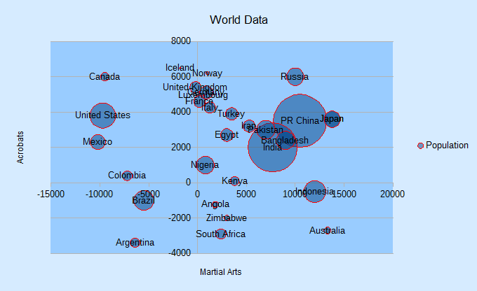
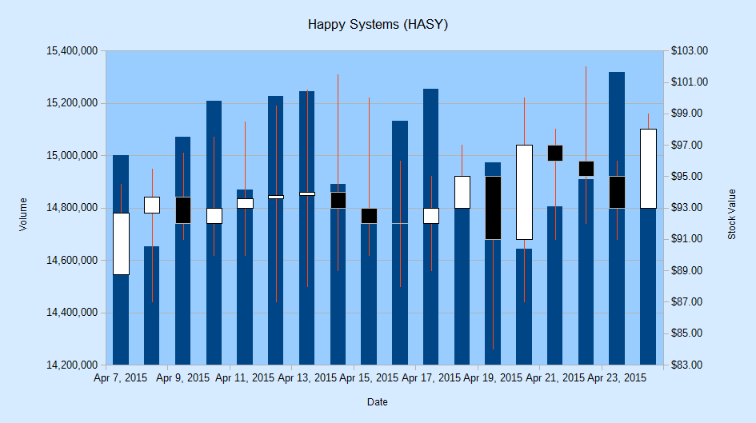
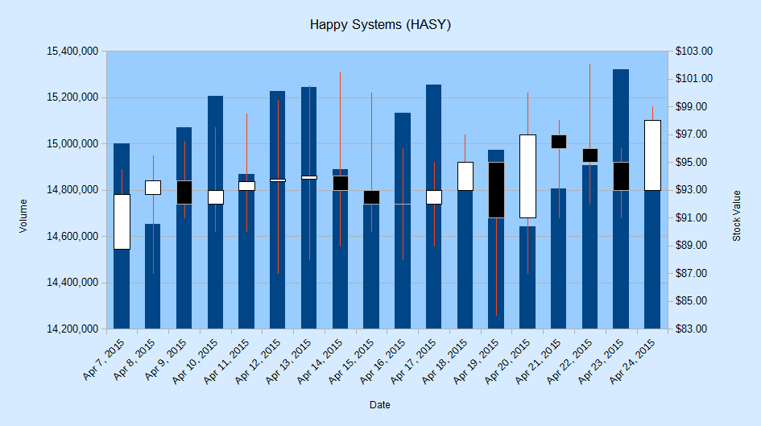
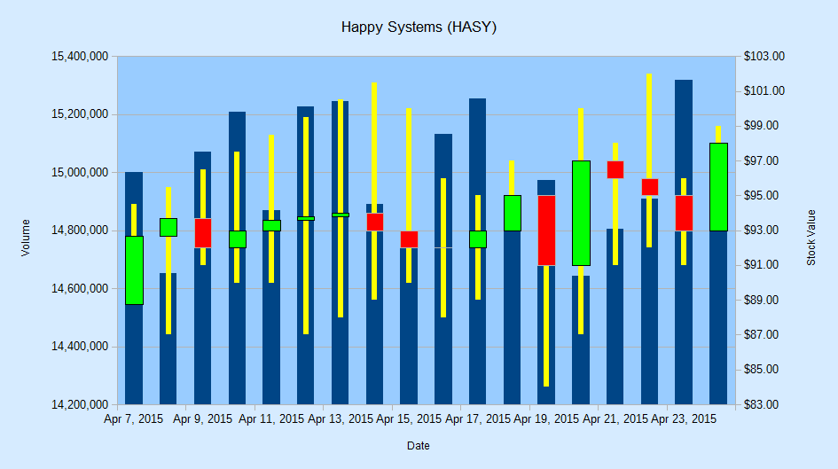
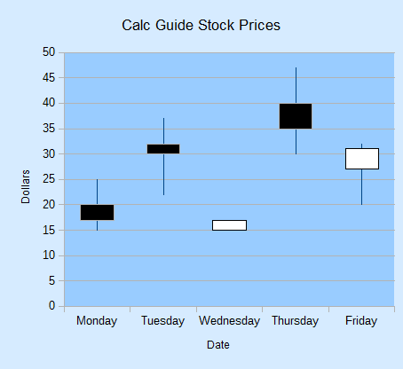

# Chapter 32. Bubble, Net, Stock Charts

!!! note "Topics"
    The Bubble
    Chart; The Net Chart;
    The Stock Chart: basic
    and modified candle
    sticks; Stock Chart and
    Line Graph

    Example folders:
    "Chart2 Tests" and
    "Utils"


This chapter concludes my use of the Chart2Views.java
example by looking at how bubble, net and stock charts
can be generated from spreadsheet data.

The relevant lines of Chart2Views.java are:

```java
// part of Chart2Views.java
public static void main(String args[])
{
  XComponentLoader loader = Lo.loadOffice();
  XSpreadsheetDocument doc = Calc.openDoc(CHARTS_DATA, loader);

  GUI.setVisible(doc, true);
  XSpreadsheet sheet = Calc.getSheet(doc, 0);

  // ---- use different chart templates ----

  labeledBubbleChart(doc, sheet);  // see section 1

  // netChart(doc, sheet);         // section 2

  // happyStockChart(doc, sheet);  // section 3
  // stockPricesChart(doc, sheet); // section 4

  Lo.waitEnter();
  Lo.closeDoc(doc);
  Lo.closeOffice();
}  // end of main()
```


## 1.  The Bubble Chart

A bubble chart is a variation of a scatter chart where each data point shows the
relationship between three variables. Two variables are used for a bubble's (x, y)
coordinate, and the third affects the bubble's size.

labeledBubbleChart() in Chart2Views.java utilizes the "World data" table in
"chartsData.ods" (see Figure 1).


Figure 1. The "World data" Table.


The data range passed to the Chart.insertChart() uses the first three columns of the
table; the "Country" column is added separately. The generated scatter chart is shown
in Figure 2.


Figure 2. Bubble Chart for the Table in Figure 1.


labeledBubbleChart() is:

```java
// in Chart2Views.java
private static void labeledBubbleChart(XSpreadsheetDocument doc,
                                XSpreadsheet sheet)
{
  CellRangeAddress rangeAddr = Calc.getAddress(sheet, "H63:J93");
  XChartDocument chartDoc =
      Chart2.insertChart(sheet, rangeAddr, "A62",18,11, "Bubble");
  Calc.gotoCell(doc, "A62");

  Chart2.setTitle(chartDoc, Calc.getString(sheet, "H62"));
  Chart2.setXAxisTitle(chartDoc, Calc.getString(sheet, "H63"));
  Chart2.setYAxisTitle(chartDoc, Calc.getString(sheet, "I63"));
  Chart2.rotateYAxisTitle(chartDoc, 90);
  Chart2.viewLegend(chartDoc, true);

  // change the data points
  XDataSeries[] ds = Chart2.getDataSeries(chartDoc);
  Props.setProperty(ds[0], "Transparency", 50);
                           // 100 == fully transparent
  Props.setProperty(ds[0], "BorderStyle", LineStyle.SOLID);
  Props.setProperty(ds[0], "BorderColor", Calc.RED);

  Props.setProperty(ds[0], "LabelPlacement", Chart2.DP_CENTER);
  // Chart2.setDataPointLabels(chartDoc, Chart2.DP_NUMBER);

/*
  String sheetName = Calc.getSheetName(sheet);
  String label = sheetName + "." + "K63";
  String names = sheetName + "." + "K64:K93";
  Chart2.addCatLabels(chartDoc, label, names);
*/
  }  // end of labeledBubbleChart()
```

The transparency and border properties of all the data points are set via the
DataPointProperties class for the data series. Without transparency, large bubbles
could obscure or completely hide smaller bubbles.

If the call to Chart2.setDataPointLabels() is uncommented, the result is messy, as
shown in Figure 3.


Figure 3. Numerically Labeled Bubble Chart for the Table in Figure 1.


Instead of labeling the bubbles with population sizes, it would be better to use the
"Country" values (see Figure 1). Chart2.addCatLabels() implements this feature,
producing Figure 4.




Figure 4. Category Labeled Bubble Chart for the Table in Figure 1.


Chart2.addCatLabels() employs the "Country" data to create an
XLabeledDataSequence object which is assigned the role "categories". It is then
assigned to the x-axis as category-based scale data:

```java
// in the Chart2 class
public static void addCatLabels(XChartDocument chartDoc,
                           String dataLabel, String dataRange)
{
  // create 'categories' labeled data sequence
  XDataProvider dp = chartDoc.getDataProvider();
  XLabeledDataSequence dLSeq =
             createLDSeq(dp, "categories", dataLabel, dataRange);

  // assign sequence to x-axis as category scale data
  XAxis axis = getAxis(chartDoc, X_AXIS, 0);
  if (axis == null)
    return;
  ScaleData sd = axis.getScaleData();
  sd.Categories = dLSeq;
  axis.setScaleData(sd);

  setDataPointLabels(chartDoc, Chart2.DP_CATEGORY);
     // label the data points with categories
}  // end of addCatLabels()
```

When setDataPointLabels() displays category data for the points, the new x-axis
categories are utilized.


## 2.  The Net Chart

The net chart (also called a radar chart) is useful for comparing multiple columns of
data (often between three and eight columns) in a 2D arrangement that resembles a
spider's web. Although net charts have an interesting look, a lot of people dislike them
(e.g. see "A Critique of Radar Charts" by Graham Odds at
http://blog.scottlogic.com/2011/09/23/a-critique-of-radar-charts.html).

netChart() in Chart2Views.java utilizes the "No of Calls per Day" table in
"chartsData.ods" (see Figure 5).


Figure 5. The "No of Calls per Day" Table.


The generated net chart is shown in Figure 6.


Figure 6. Net Chart for the Table in Figure 5.


netChart() is:

```java
// in Chart2Views.java
private static void netChart(XSpreadsheetDocument doc,
                             XSpreadsheet sheet)
{ CellRangeAddress rangeAddr = Calc.getAddress(sheet, "A56:D63");
  XChartDocument chartDoc =
      Chart2.insertChart(sheet, rangeAddr, "E55",16,11, "NetLine");
                           // Net, NetLine, NetSymbol
                           // StackedNet, PercentStackedNet
  Calc.gotoCell(doc, "E55");

  Chart2.setTitle(chartDoc, Calc.getString(sheet, "A55"));
  Chart2.viewLegend(chartDoc, true);
  Chart2.setDataPointLabels(chartDoc, Chart2.DP_NONE);

  // reverse x-axis so days increase clockwise around net
  XAxis xAxis = Chart2.getXAxis(chartDoc);
  ScaleData sd = xAxis.getScaleData();
  sd.Orientation = AxisOrientation.REVERSE;
  xAxis.setScaleData(sd);
}  // end of netChart()
```

Different net chart templates allow points to be shown, the areas filled with color, and
the lines to be stacked or displayed as percentages.

netChart() changes the x-axis which wraps around the circumference of the chart. By
default, the axis is drawn in a counter-clockwise direction starting from the top of the
net. This order doesn't seem right for the days of the week in this example, so I made
the order clockwise, as in Figure 6.


## 3.  The Stock Chart

A stock chart is a specialized column graph for displaying stocks and shares
information. All stock chart templates require at least three columns of data
concerning the lowest price, highest price, and closing price of a stock (or share). It's
also possible to include two other columns that detail the stock's opening price and
transaction volume.

The stock template names reflect the data columns they utilize:

* StockLowHighClose
* StockOpenLowHighClose
* StockVolumeLowHighClose
* StockVolumeOpenLowHighClose

The names also indicate the ordering of the columns in the data range supplied to the
template. For example, "StockVolumeOpenLowHighClose" requires five columns of
data in the order: transaction volume, opening price, lowest price, highest price, and
closing price.

happyStockChart() in Chart2Views.java utilizes the "Happy Systems (HASY)" table
in "chartsData.ods" (see Figure 7).


Figure 7. The "Happy Systems (HASY)" Table.


The table has six columns, the first being the x-axis categories, which are usually
dates. The other columns follow the order required by the
"StockVolumeOpenLowHighClose" template.

The generated stock chart is shown in Figure 8.




Figure 8. Stock Chart for the Table in Figure 7.


The chart is made up of two graphs with a common x-axis: a column graph for the
stock volume on each day, and a candle-stick graph showing the lowest, opening,
closing, and highest stock values. Figure 9 gives details of how these elements are
drawn.


Figure 9. The Elements of a Stock Chart.


The thin red lines drawn on the columns in Figure 9 denote the range between the
lowest and highest stock value on that day. The white and black blocks represent the
stock's change between its opening and closing price. A white block (often called a
"white day") means the price has increased, while black (a "black day") means that it
has decreased.

happyStockChart() is:

```java
// in Chart2Views.java
private static void happyStockChart(XSpreadsheetDocument doc,
                                    XSpreadsheet sheet)
{ CellRangeAddress rangeAddr = Calc.getAddress(sheet, "A86:F104");
  XChartDocument chartDoc =
      Chart2.insertChart(sheet, rangeAddr, "A105", 25, 14,
                               "StockVolumeOpenLowHighClose");
  Calc.gotoCell(doc, "A105");

  Chart2.setTitle(chartDoc, Calc.getString(sheet, "A85"));
  Chart2.setXAxisTitle(chartDoc, Calc.getString(sheet, "A86"));
  Chart2.setYAxisTitle(chartDoc, Calc.getString(sheet, "B86"));
  Chart2.rotateYAxisTitle(chartDoc, 90);

  Chart2.setYAxis2Title(chartDoc, "Stock Value");
  Chart2.rotateYAxis2Title(chartDoc, 90);

  Chart2.setDataPointLabels(chartDoc, Chart2.DP_NONE);
                     // too cluttered if numerical data is shown

  // change 2nd y-axis min and max; default is poor ($0 - $20)
  XAxis yAxis2 = Chart2.getYAxis2(chartDoc);
  ScaleData sd = yAxis2.getScaleData();
  sd.Minimum = 83;
  sd.Maximum = 103;
  yAxis2.setScaleData(sd);

  // more stock chart code; explained in a moment...

}  // end of happyStockChart()
```

happyStockChart() sets and rotates the secondary y-axis title, which appears on the
right of the chart. Chart2.setYAxis2Title() and Chart2.rotateYAxis2Title() are
implemented in the same way as Chart2.setYAxisTitle() and
Chart2.rotateYAxisTitle() described in Chapter 29, section 3.

happyStockChart() also changes the second y-axis' range; the default shows prices
between $0 and $20, which is too low. New minimum and maximum values are
assigned to the axis' scale data.


### 3.1.  Modifying the Chart Dates

A common problem is that date information clutters the stock chart, making it harder
to read. Figure 8 shows that the stock template is clever enough to only draw every
second date, but this is still too much information for the limited space.

One solution is to increase the x-axis interval so a tick mark (and date string) is only
drawn for every third day, as in Figure 10.


Figure 10. Stock Chart with Three-day Intervals for the X-Axis.


Changing the interval is implemented by adjusting the time increment for the x-axis in
its ScaleData object:

```java
// part of happyStockChart() in Chart2Views.java...
    :
// change x-axis type from number to date
XAxis xAxis = Chart2.getXAxis(chartDoc);
sd = xAxis.getScaleData();
sd.AxisType = AxisType.DATE;

// set major increment to 3 days
TimeInterval ti = new TimeInterval(3, TimeUnit.DAY);
TimeIncrement tc = new TimeIncrement();
tc.MajorTimeInterval = ti;
sd.TimeIncrement = tc;
xAxis.setScaleData(sd);
```

Before the interval can be changed, the axis type must be changed to be of type
DATE. Information on the ScaleData class can be accessed by calling `lodoc chart2 scaledata`.

Another technique for making the dates easier to read is to rotate their labels. The
following code rotates each label counter-clockwise by 45 degrees:

```java
// part of happyStockChart() in Chart2Views.java...
    :
XAxis xAxis = Chart2.getXAxis(chartDoc);
Props.setProperty(xAxis, "TextRotation", 45);
```

The resulting chart is shown in Figure 11.




Figure 11. Stock Chart with Rotated X-Axis Labels.


Note that the template has automatically switched back to showing every date instead
of every second one in Figure 8.


### 3.2.  Changing the Stock Values Appearance

This section describes two changes to the candle stick part of the chart: adjusting the
colors used in the "white days" and "black days" blocks, and making the high-low
stock line easier to read. The results appear in Figure 12.




Figure 12. Stock Chart with Modified Candle Sticks.


A stock chart is made up of two chart types: a column chart type for the volume
information, and a candle stick chart type for the stock prices. This information can be
listed by calling Chart2.printChartTypes():

```java
// in happyStockChart()
Chart2Views.javaChart2.printChartTypes(chartDoc);
```

It produces:

```
No. of chart types: 2
  com.sun.star.chart2.ColumnChartType
  com.sun.star.chart2.CandleStickChartType
```

In order to affect the candle stick chart type's data it is necessary to access its
XChartType instance. This can be done with the two-argument version of
Chart2.findChartType():

```java
// in happyStockChart()
XChartType candleCT = Chart2.findChartType(chartDoc,
                                   "CandleStickChartType");
```

Figure 13 shows that the XChartType interface is supported by the ChartType service,
and the CandleStickChartType subclass.


Figure 13. The ChartType Service.


CandleStickChartType contains some useful properties, including "WhiteDay" and
"BlackDay" (for details call lodoc chart2 CandleStickChartType). These
properties store sets containing multiple values from the FillProperties and
LineProperties services. They can be accessed like so:

```java
// part of happyStockChart() in Chart2Views.java...
    :
XChartType candleCT = Chart2.findChartType(chartDoc,
                                   "CandleStickChartType");
XPropertySet props = Lo.qi(XPropertySet.class,
                         Props.getProperty(candleCT, "WhiteDay"));
Props.showObjProps("WhiteDay", props);
Props.setProperty(props, "FillColor", Calc.GREEN);
```

The same sort of change can be done to the "FillColor" property inside the
"BlackDay" property  set. Both changes are implemented inside
Chart2.colorStockBars():

```java
// in the Chart2 class
public static void colorStockBars(XChartType ct,
                            int wDayColor, int bDayColor)
{ if (!ct.getChartType().equals(
                  "com.sun.star.chart2.CandleStickChartType"))
    System.out.println("Chart type not a candle stick: " +
                                            ct.getChartType());
  else {
    XPropertySet props = Lo.qi(XPropertySet.class,
                          Props.getProperty(ct, "WhiteDay"));
    Props.setProperty(props, "FillColor", wDayColor);

    props = Lo.qi(XPropertySet.class,
                          Props.getProperty(ct, "BlackDay"));
    Props.setProperty(props, "FillColor", bDayColor);
  }
}  // end of colorStockBars()
```

Chart2.findChartType() and Chart2.colorStockBars() are called at the end of
happyStockChart() to change the "white day" blocks to green and the "black day"
blocks to red:

```java
// part of happyStockChart() in Chart2Views.java...
    :
XChartType candleCT = Chart2.findChartType(chartDoc,
                                   "CandleStickChartType");
Chart2.colorStockBars(candleCT, Calc.GREEN, Calc.RED);
```

Making the high-low lines thicker and yellow requires access to the data series in the
candle stick chart type (as shown in Figure 13). This is implemented by using the two-
argument version of Chart2.getDataSeries():

```java
XDataSeries[] ds = Chart2.getDataSeries(chartDoc,
                                  "CandleStickChartType");
```

The high-low lines are adjusted via the "LineWidth" and "Color" properties in the
series. The code at the end of  happyStockChart() is:

```java
// part of happyStockChart() in Chart2Views.java...

    :
XDataSeries[] ds = Chart2.getDataSeries(chartDoc,
                                  "CandleStickChartType");
Props.setProperty(ds[0], "LineWidth", 120);   // in 1/100 mm
Props.setProperty(ds[0], "Color", Calc.YELLOW);
```


## 4.  Adding a Line Graph to a Stock Chart

stockPricesChart() in Chart2Views.java utilizes the "Calc Guide Stock Prices" table in
"chartsData.ods" (see Figure 14).


Figure 14. The "Calc Guide Stock Prices" Table.


The stock chart is created using the first five columns, excluding the "Pork Bellies"
data. There's no "Volume" column for the stocks, so the "StockOpenLowHighClose"
template is employed.

The stock chart is shown in Figure 15.




Figure 15. Stock Chart for the Table in Figure 14.


stockPricesChart() is:

```java
// in Chart2Views.java
private static void stockPricesChart(XSpreadsheetDocument doc,
                                      XSpreadsheet sheet)
{
  CellRangeAddress rangeAddr = Calc.getAddress(sheet, "E141:I146");
  XChartDocument chartDoc =
      Chart2.insertChart(sheet, rangeAddr, "E148", 12, 11,
                                     "StockOpenLowHighClose");
  Calc.gotoCell(doc, "A139");

  Chart2.setTitle(chartDoc, Calc.getString(sheet, "E140"));
  Chart2.setDataPointLabels(chartDoc, Chart2.DP_NONE);
  Chart2.setXAxisTitle(chartDoc, Calc.getString(sheet, "E141"));
  Chart2.setYAxisTitle(chartDoc, "Dollars");
  Chart2.rotateYAxisTitle(chartDoc, 90);

  // more code for adding the "Pork Bellies" line...

}  // end of stockPricesChart()
```

A line graph showing the movement of "Pork Bellies" is added to the chart by
Chart2.addStockLine(). The additional code at the end of stockPricesChart() is:

```java
// part of stockPricesChart() in Chart2Views.java...
    :
String sheetName = Calc.getSheetName(sheet);
String porkLabel = sheetName + "." + "J141";
String porkPoints = sheetName + "." + "J142:J146";
Chart2.addStockLine(chartDoc, porkLabel, porkPoints);

Chart2.viewLegend(chartDoc, true);
```

The resulting change to the stock chart is shown in Figure 16.


Figure 16. Stock Chart with Line Graph for the Table in Figure 15.


A data series belongs to a chart type, which is part of the coordinates system.
Therefore the first task is to obtain the chart's coordinate system. A new line chart
type is added to it, and an empty data series is inserted into the chart type.

The addition of a new chart type to the chart's coordinate system is preformed by
Chart2.addChartType(). The following adds a line chart type:

```java
// part of Chart2.addStockLine(); see below...
XChartType ct = Chart2.addChartType(chartDoc, "LineChartType");
```

Chart2.addChartType() uses Chart2.getCoordSystem() to get the chart's coordinate
system, and then converts it into an XChartTypeContainer so the new chart type can
be added:

```java
// in the Chart2 class
public static XChartType addChartType(XChartDocument chartDoc,
                                      String chartType)
{ // create new chart type
  XChartType ct = Lo.createInstanceMCF(XChartType.class,
                         "com.sun.star.chart2." + chartType);
  if (ct == null) {
    System.out.println("Unable to create XChartType: "+chartType);
    return ct;
  }

  // add chart type to coord system
  XCoordinateSystem coordSys = getCoordSystem(chartDoc);
  XChartTypeContainer ctCon =
           Lo.qi(XChartTypeContainer.class, coordSys);
  ctCon.addChartType(ct);
  return ct;
}  // end of addChartType()
```

Chart2.addChartType() returns a reference to the new chart type, and an empty data
series is added to it by converting the chart type into an XDataSeriesContainer:

```java
// part of Chart2.addStockLine(); see below...
    :
XChartType ct = addChartType(chartDoc, "LineChartType");
XDataSeriesContainer dataSeriesCnt =
                        Lo.qi(XDataSeriesContainer.class, ct);

// create (empty) data series in the line chart
XDataSeries ds = Lo.createInstanceMCF(XDataSeries.class,
                             "com.sun.star.chart2.DataSeries");
if (ds == null) {
  System.out.println("Unable to create XDataSeries: " + ds);
  return;
}
dataSeriesCnt.addDataSeries(ds);
```

This empty data series is filled with data points via its XDataSink interface, using the
steps shown in Chapter 31, section 5.1, Figure 13. A DataProvider service is required
so that two XDataSequence objects can be instantiated, one for the label of an
XLabeledDataSequence object, the other for its data. The XDataSequence object
representing the data must have its "Role" property set to "values-y" since it will
become the y-coordinates of the line graph.

The task of building the XLabeledDataSequence object is handled by
Chart2.createLDSeq(), which I used in Chapter 31, section 5.1 to add error bars to a
scatter chart, and in section 1 to place category labels in a bubble chart.

The code is:

```java
// part of Chart2.addStockLine(); see below...
    :
// treat series as a data sink
XDataSink dataSink = Lo.qi(XDataSink.class, ds);

// build a sequence representing the y-axis data
XDataProvider dp = chartDoc.getDataProvider();
XLabeledDataSequence dLSeq =
              createLDSeq(dp, "values-y", dataLabel, dataRange);

// add sequence to the sink
XLabeledDataSequence[] ldSeqArr = { dLSeq };
dataSink.setData(ldSeqArr);
```

All the preceding code fragments of this section are wrapped up inside
Chart2.addStockLine():

```java
// in the Chart2 class
public static void addStockLine(XChartDocument chartDoc,
                             String dataLabel, String dataRange)
{ // add (empty) line chart to the doc
  XChartType ct = addChartType(chartDoc, "LineChartType");
  XDataSeriesContainer dataSeriesCnt =
                            Lo.qi(XDataSeriesContainer.class, ct);

  // create (empty) data series in the line chart
  XDataSeries ds = Lo.createInstanceMCF(XDataSeries.class,
                                "com.sun.star.chart2.DataSeries");
  if (ds == null) {
    System.out.println("Unable to create XDataSeries: " + ds);
    return;
  }
  Props.setProperty(ds, "Color", 0xFF0000);
  dataSeriesCnt.addDataSeries(ds);

  // treat series as a data sink
  XDataSink dataSink = Lo.qi(XDataSink.class, ds);

  // build a sequence representing the y-axis data
  XDataProvider dp = chartDoc.getDataProvider();
  XLabeledDataSequence dLSeq =
             createLDSeq(dp, "values-y", dataLabel, dataRange);

  // add sequence to the sink
  XLabeledDataSequence[] ldSeqArr = { dLSeq };
  dataSink.setData(ldSeqArr);
}  // end of addStockLine()
```

Chart2.addStockLine() is passed a reference to the chart document, and references to
the label and data for the line graph:

```java
// part of stockPricesChart() in Chart2Views.java...
    :
String sheetName = Calc.getSheetName(sheet);
String porkLabel = sheetName + "." + "J141";
String porkPoints = sheetName + "." + "J142:J146";
Chart2.addStockLine(chartDoc, porkLabel, porkPoints);
```