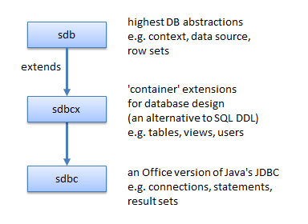

# Chapter 34. From JDBC to the Base API 

!!! note "Topics"
    Three Database 
    Modules: sdbc, sdbcx, 
    sdb; A Little JDBC; 
    From JDBC to sdbc 

    Example folders: "Base 
    Tests" and "Utils" 
 
 
Base offers a graphical interface for the building and 
manipulation of relational databases, including tools for 
the creation of forms and reports based on the tabular data. 

These features are explained at length in the Base 
Handbook, available at https://www.libreoffice.org/get-help/documentation/. 

Base can access many types of SQL databases, including Microsoft Access, MySQL, 
Oracle, and PostgreSQL, and is able to create its own HSQLDB databases embedded 
inside Office ODB documents.  

HSQLDB (also known as HyperSQL) is coded in Java (http://hsqldb.org/), a 
dependency that caused the LibreOffice development team to look for a replacement 
database engine in 2013. They decided on Firebird (http://www.firebirdsql.org/) 
which was coded in C until version 2.5, then moved to C++. A detailed rationale for 
the change is available as a series of links at http://en.libreofficeforum.org/node/6062. 

Currently (in LibreOffice 5.3), the default embedded database for ODB documents is 
still HSQLDB, with Firebird available as an 'experimental feature', turned on via 
Office's Tools >> Options >> Advanced menu dialog. This adds a "Firebird 
Embedded" option so either kind of database can be created by Base. The Firebird 
feature is labeled as 'unsafe', but seems perfectly reliable on Windows, although some 
HSQLDB functionality isn't available yet in embedded Firebird databases. This Part 
contains examples using both HSQLDB and Firebird. 

Base's API is explained in chapter 12 of the Developer's Guide  available at 
https://wiki.openoffice.org/w/images/d/d9/DevelopersGuide_OOo3.1.0.pdf. 

Alternatively, you can read the chapter online, starting at 
https://wiki.openoffice.org/wiki/Documentation/DevGuide/Database/Database_Acces
s (use loGuide "Database Access"). The guide's database examples are at 
http://api.libreoffice.org/examples/DevelopersGuide/examples.html#Database. 

 
 
## 1.  Three Database Modules 

The API is spread across three modules: sdbc, sdbcx, and sdb, whose structure is 
summarized in Figure 1. 

 

Figure 1. The Database Modules in LibreOffice. 

 
Office's core database functionality is in the sdbc module, which can be thought of as 
an Office version of Java's JDBC (Java Database Connectivity) API. This means that 
JDBC classes such as Connection, Statement, and ResultSet appear in the sdbc 
module, but are generally split in two to become Office service and interface classes. 

For example, sdbc contains services called Connection, Statement, and ResultSet, and 
interfaces called XConnection, XStatement, and XResultSet.  

The sdbcx module holds classes related to the schema (metadata) associated with 
databases, catalogs, tables, views, groups, users, columns, indexes, and keys. Much of 
this kind of data can also be manipulated at the SQL level, via DDL (Data Definition 
Language) statements such as CREATE and ALTER, or via the MetaDatabase classes 
borrowed from JDBC in the sdbc module. 

The sdb module offers higher-level abstractions, allowing the manipulation of other 
kinds of tabular data aside from databases. It makes it easy to manipulate databases 
embedded inside ODB documents, and also supports features such as row sets, 
persistent queries, and database authentication.  

One drawback of this hierarchy is the appearance of same-named services across 
modules. For instance, there are three ResultSet services, one each in the sdbc, sdbcx, 
and sdb modules. Fortunately, the interactive inheritance diagrams used in the 
LibreOffice documentation (e.g. at 
http://api.libreoffice.org/docs/idl/ref/servicecom_1_1sun_1_1star_1_1sdbc_1_1Result
Set.html) makes it quite easy to jump between the services (e.g. see lodoc 
ResultSet). 

 
 
## 2.  A Little JDBC 

The easiest way to understand the sdbc module is to have a reasonable knowledge of 
Java's JDBC, which is simpler and contains similar functionality. This short section 
on JDBC is only meant to be a refresher; if you haven’t encountered the API before, 
you should refer to longer explanations found in beginner/intermediate Java texts. 

Three that I like are: 
 Introduction to Java Programming, Comprehensive Version 
Y. Daniel Liang, Pearson, 2014, 10th Edition 
http://www.cs.armstrong.edu/liang/ 
(Chapters 32 and 35 relate to JDBC; chapter 35 is online, behind a 
login/password. However the material was printed in earlier versions, up to the 6th 
edition in 2007.) 
 Java How To Program (Early Objects) 
Paul Deitel, Harvey Deitel, Pearson, 2014, 10th Edition 
http://www.deitel.com/Books/Java/JavaHowtoProgram10eEarlyObjects/tabid/365
6/Default.aspx 
(Chapter 24 is about JDBC) 
 Core Java, Volume II – Advanced Features  
Cay S. Horstmann, Gary Cornell, Prentice Hall, 2016, 10th Edition 
http://www.informit.com/store/core-java-volume-ii-advanced-features-
9780137081608 
(Chapter 4 is about JDBC. It covers more topics than the Liang and Deitel 
chapters.) 
All these chapters introduce SQL, but it's worthwhile studying it separately since it 
utilizes a very different programming model from Java, based on relational algebra 
and tuples. One book I've used recently is: 
 Sams Teach Yourself SQL in 10 Minutes 
Ben Forta,  Sams, 2012, 4th edition 
http://forta.com/books/0672336073/ 
I'll be using a small subset of SQL: CREATE TABLE and INSERT to build tables, 
and simple SELECT statements to query them. 

 
### 2.1.  Using JDBC 

Figure 2 shows the main stages in how JDBC is used to access a database. 

 

Figure 2. Using JDBC. 

 
The first step involves loading the database driver, which registers it with JDBC's 
DriveManager. JDBC 4 introduced the ability to automatic detect and load a driver if 
its JAR file includes configuration information. This capability isn't part of sdbc 
though, perhaps because Base was developed in 2003-2005, and JDBC 4 was released 
at the end of 2006. 

Class.forName() is used to load the driver, as in: 
Class.forName("org.firebirdsql.jdbc.FBDriver"); 
A communications link through the driver to a database is represented by a 
Connection object, which is created by calling DriverManager.getConnection() with a 
the database's URL. For instance: 
 
Connection conn = DriverManager.getConnection( 
                     "jdbc:firebirdsql:embedded:crossrate.fdb"); 
 
The URL's format varies from one driver to the next, but always starts with "jdbc:" 
followed by the driver protocol name. The address may include a machine hostname 
and port number if the database is located across the network. The example above 
specifies the crossrate.fdb Firebird database in the same directory as the Java 
program. If a database requires a login and password, they can be included as extra 
arguments in the getConnection() call. 

A SQL statement is sent across the link via a Statement object, which is created by 
Connection.createStatement(): 
Statement statement = conn.createStatement(); 
The SQL statement is written as a string, and sent to the database using one of 
Statement's execute methods. For example: 
ResultSet rs = statement.executeQuery("SELECT * FROM Crossrate"); 
The results are returned as a ResultSet object, which can be thought of as a table of 
answers with a cursor pointing to a particular row in that table. The cursor is initially 
assigned to just before the first row, and can be moved down a row with 
ResultSet.next(). Typical code for iterating through all the rows  is: 
 
while (rs.next()) { 
   // look at a row of the result set 
} 
 
A particular cell on a row is accessed using the table's corresponding column name, or 
the column index (which starts at 1). For example: 
 
while(rs.next()) 
  System.out.println( rs.getString("FromCurrency")); 
 
This loop prints all the data in the "FromCurrency" column of the result set.  

The ResultSet class offers a large collection of getXXX() methods that return SQL 
data as Java types. 

 
### 2.2.  A Simple JDBC Program 

All the preceding code snippets come together in SimpleJDBC.java: 
 
// SimpleJDBC.java 
public static void main(String[] args) 
{ 
  try { 
    Class.forName("org.firebirdsql.jdbc.FBDriver");     
                            // requires Jaybird and Firebird 
 
    // connect to the database 
    Connection conn = DriverManager.getConnection( 
               "jdbc:firebirdsql:embedded:crossrate.fdb", 
               "sysdba", "masterkeys");  // login, password 
 
    Statement statement = conn.createStatement(); 
      
    // Execute a SQL query 
    ResultSet rs = statement.executeQuery( 
                               "SELECT * FROM Crossrate"); 
 
    // Print the result set 
    SimpleDateFormat sdf = new SimpleDateFormat("dd-MM-yyyy"); 
    System.out.println("FromCurrency \tToCurrency \t 
                                         ConvRate \tUpdateDate"); 
    System.out.println("============================="); 
 
    while(rs.next()) 
      System.out.println( rs.getString("FromCurrency") + ",   \t" + 
                          rs.getString("ToCurrency") + ",   \t" + 
                          rs.getFloat("ConvRate") + ",   \t" + 
                     sdf.format( rs.getTimestamp("UpdateDate")) ); 
                        // 4th column returns java.sql.Timestamp  
 
    System.out.println("============================="); 
 
    // Close down (should really be in a finally block) 
    rs.close(); 
    statement.close(); 
    conn.close(); 
  }  
  catch (ClassNotFoundException e)   // for Class.forName()  
  {  System.out.println("Failed to load driver: \n  " + e); } 
  catch (SQLException e)  
  {  for (Throwable t : e) 
       System.out.println(t); // to handle a 'chain' of SQLExceptions 
  } 
} // end of main() 
 
Figure 3 shows the command window output of this program. 

 
 

Figure 3. Compiling and Running SimpleJDBC.java. 

 
One of the harder parts of using JDBC is including the driver in the compilation and 
execution steps for a program. I've done it by writing two Windows batch scripts, 
called compile.bat and run.bat, which can be seen in action in Figure 3. These scripts 
hide the arguments of the javac.exe and java.exe commands which tell Java where to 
look for the driver's JAR. compile.bat is: 
javac -cp "D:\jaybird\jaybird-full-2.2.5.jar;." %* 
run.bat is: 
java -cp "D:\jaybird\jaybird-full-2.2.5.jar;."  
     -Djava.library.path="D:\jaybird" %* 
Jaybird is the JDBC driver for Firebird (available from 
http://www.firebirdsql.org/en/jdbc-driver/). 

The java.library.path argument in the call to java.exe locates the directory holding 
Jaybird's DLL.  

Fortunately, this driver location issue won't concern us when using sdbc, since the 
Office API already includes the necessary drivers.  

 
### 2.3.  A More Detailed Execution Diagram 

Now that I've introduced the classes and methods used in a simple JDBC program, its 
possible to draw a more technical version of Figure 2, as Figure 4. 

 
 

Figure 4. The Classes and Methods used in Typical JDBC Programs. 

 
Figure 4's blue boxes represent JDBC classes, and the arrows are labeled with the 
methods used to create objects. SimpleJDBC.java uses the DriveManager, 
Connection, Statement, and ResultSet classes shown in the figure, but there are a few 
other useful ones.  

DataSource allows the low-level details used to address a database in 
DriveManager.getConection() to be hidden behind a JNDI logical name. DataSource 
also hides how a connection is created, or perhaps reused if there are a pool of 
connections.  

RowSet abstracts away from manipulating databases to allowing access to more 
general tabular data, covering such things as CSV text files and spreadsheets. RowSet 
combines the functionality of DriveManager, Connection, and Statement, and is a 
subclass of ResultSet. 

The two metadata classes in Figure 4 hold schema data for database and result sets. 

ResultSetMetaData is particularly useful when instantiating a Swing JTable 
component to display results graphically. 

PreparedStatement lets SQL statements include Java-level parameters (denoted by 
'?'s). A PreparedStatement can be compiled and perhaps cached for speed, but is still 
open to changes so different queries can be sent to the database. 

 
 
## 3.  From JDBC to sdbc 

There's a mostly direct mapping from Figure 4's JDBC Class/method diagram to sdbc 
interface classes, which is depicted in Figure 5. 

 
 

Figure 5. The Interfaces and Methods used in Typical sdbc Programs. 

 
Figure 5's blue boxes are interfaces in the sdbc module which, following the Office 
style, all start with "X". Not shown are the corresponding services which hold the 
data/properties associated with the interface methods.  The service names are almost 
always the same as the interfaces but without the "X". For instance, the services for 
XConnection, XStatement, and XResultSet are Connection, Statement, and ResultSet.  

Figure 5 uses interface names rather than services since the interfaces contain the 
methods, and so it’s their documentation that should be searched for method details. 

Recall that this can be done with my "lodoc" batch utility. For example, lodoc 
XConnection loads the LibreOffice documentation webpage for XConnection. 

Another drawback of service names is that many aren't unique. For example, there are 
two Connection services – one in sdbc and another in the sdb module. 

I'm going to spend several chapters explaining Figure 5. The examples will access 
databases using XOfficeDatabaseDocument, XRowSet, XDatabaseContext, and 
XDriverManager, in the order denoted by the numbers along the top of Figure 5. 

XOfficeDatabase documents are covered first, in Chapter 35, XRowSet and 
XDatabaseContext in Chapter 36, and XDriverManager in Chapter 37. 

In Chapter 38,  I'll describe a fifth technique, based on the fact that an ODB file is a 
zipped folder. It's possible to employ zip-related classes (located in the java.util.zip 
package) to extract the folder's database files, and use HSQLDB or Firebird to access 
them through JDBC.  This approach side-steps Office's API but requires JDBC 
drivers for HyperSQL and Firebird. 

 
