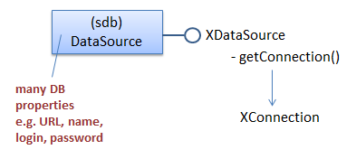
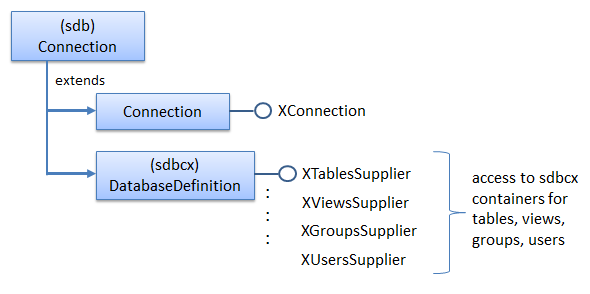
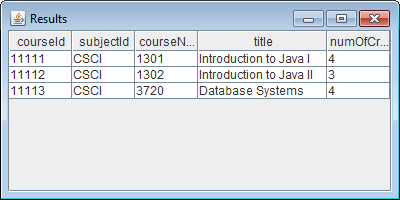
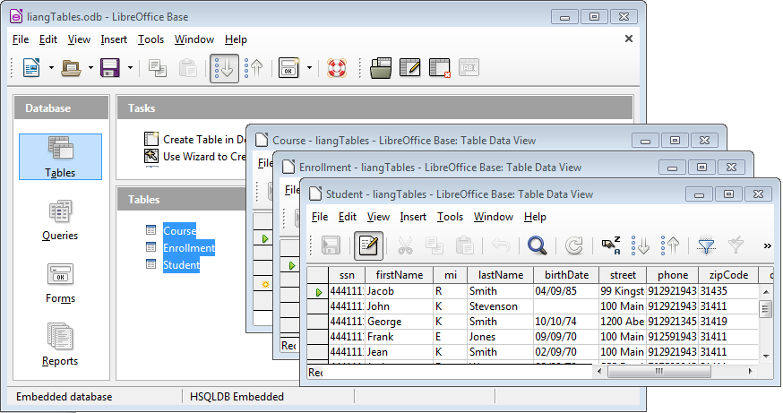
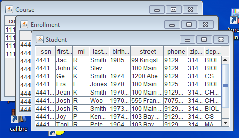
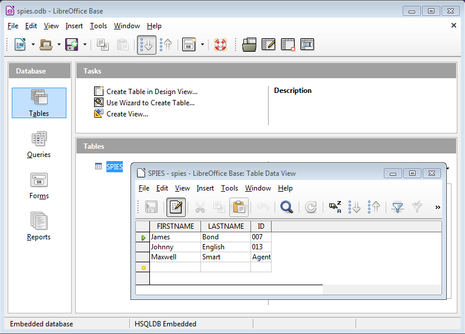
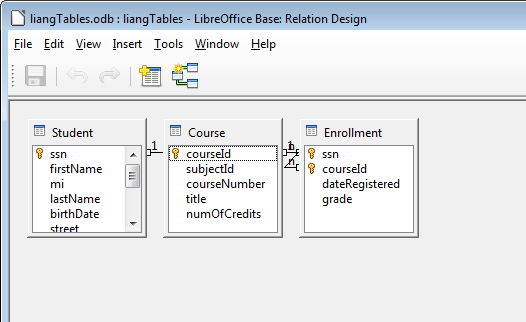

# Chapter 35. Examining Base Documents

!!! note "Topics"
    Querying an
    Embedded HSQLDB
    Database; Using
    Metadata when
    Querying; Debugging
    Database Code; Creating
    a Base Document;
    Processing Multiple
    SQL Commands;
    Displaying Table
    Relationships; Prepared
    Statements; Scrollable
    and Updatable Result
    Sets; Converting a
    Database to Text

    Example folders: "Base
    Tests" and "Utils"


This chapter looks at programming with Base documents
using the XOfficeDatabaseDocument interface, which was
labelled with a (1) in Figure 5 of the previous chapter.

Figure 1 repeats that figure but without the alternative
query approaches (labels (2), (3), and (4)).


Figure 1.  Querying a Base Document.


XOfficeDatabaseDocument accesses a database via the ODB document that's
connected to the database. The connection can take two forms – the database can be
embedded inside the ODB file, or the connection can be a URL which links to an
external database. Most of my examples will utilize ODB files that contain embedded
databases.


## 1.  Querying an Embedded HSQLDB Database

The following SimpleQuery.java example shows how to query a HSQLDB database
embedded inside an ODB file called liangTables.odb. It has three tables, called
Course, Enrollment, and Student. Figure 2 shows the data in the Course table,
displayed by Base. The filename reflects the fact that the database is based on one in
Y. Daniel Liang's "Introduction to Java Programming" textbook.


Figure 2. The Course Table in liangTables.odb.


Although SimpleQuery.java only queries liangTables.odb, the support methods it
utilizes are capable of accessing other kinds of ODB document, including ones
containing embedded Firebird databases, and database URLs.

The main() method for SimpleQuery.java is given below:

=== "java"
    ```java
    private static final String FNM = "liangTables.odb";
    
    
    // in SimpleQuery.java
    public static void main(String[] args)
    {
      XComponentLoader loader = Lo.loadOffice();
      XOfficeDatabaseDocument dbDoc = Base.openBaseDoc(FNM, loader);
      if (dbDoc == null) {
        System.out.println("Could not open database " + FNM);
        Lo.closeOffice();
        return;
      }
    
      XConnection conn = null;
      try {
        XDataSource dataSource = dbDoc.getDataSource();
        conn = dataSource.getConnection("", "");  // no login/password
        XStatement statement = conn.createStatement();
    
        // first query
        XResultSet rs =
              statement.executeQuery("SELECT * FROM \"Course\"");
    
        XRow xRow = Lo.qi(XRow.class, rs);
    
        System.out.println("CourseID \tSubjectID \tCourseNumber
                                     \tTitle  \tNumOfCredits");
        System.out.println("=========================");
        while(rs.next())
          System.out.println( xRow.getString(1) + ",   \t" +
                              xRow.getString(2) + ",   \t" +
                              xRow.getInt(3) + ",   \t" +
                              xRow.getString(4) + ",   " +
                              xRow.getInt(5) );
        System.out.println("=========================");
    
        // second query
        rs = statement.executeQuery(
               "SELECT \"courseNumber\", \"title\" FROM \"Course\"");
        xRow = Lo.qi(XRow.class, rs);
        XColumnLocate xLoc = Lo.qi( XColumnLocate.class, rs);
    
        System.out.println("CourseNumber \tTitle");
        System.out.println("====================================");
        while(rs.next())
          System.out.println(
                xRow.getString( xLoc.findColumn("courseNumber")) +
                ",   \t" +
                xRow.getString( xLoc.findColumn("title")) );
        System.out.println("====================================");
      }
      catch(SQLException e) {
        System.out.println(e);
      }
    
      Base.closeConnection(conn);
      Base.closeBaseDoc(dbDoc);
      Lo.closeOffice();
    }  // end of main()
    ```

The code is similar to the JDBC program described in the previous chapter, but uses
the sdbc interface, starting with XOfficeDatabaseDocument.

Base.openBaseDoc() loads the document as an instance of XComponent, then casts it
to XOfficeDatabaseDocument. The relationship between XOfficeDatabaseDocument
and XComponent is shown in Figure 3.


Figure 3. Obtaining an OfficeDataBaseDocument Instance.


The Base.openBaseDoc() method:

=== "java"
    ```java
    // in the Base class
    public static XOfficeDatabaseDocument openBaseDoc(
                            String fnm, XComponentLoader loader)
    {
      XComponent doc = Lo.openDoc(fnm, loader);
      if (doc == null) {
        System.out.println("Document is null");
        return null;
      }
    
      if (Info.reportDocType(doc) != Lo.BASE) {
        System.out.println("Not a database doc; closing " + fnm);
        Lo.closeDoc(doc);
        return null;
      }
    
      // cast XComponent to XOfficeDatabaseDocument
      XOfficeDatabaseDocument dbDoc =
                 Lo.qi(XOfficeDatabaseDocument.class, doc);
      if (dbDoc == null) {
        System.out.println("Not a database doc; closing " + fnm);
        Lo.closeDoc(doc);
        return null;
      }
      return dbDoc;
    }  // end of openDoc()
    ```

Database details, such as whether it's embedded inside or linked to the ODB file, and
its type (e.g. HSQLDB, Firebird), are stored in the DataSource service, which is
accessed by XOfficeDatabaseDocument.getDataSource():

=== "java"
    ```java
    // in SimpleQuery.java...
    XDataSource dataSource = dbDoc.getDataSource();
    ```

The simplest way of using the data source is to connect to the database by calling
getConnection():

=== "java"
    ```java
    XConnection conn = dataSource.getConnection("", "");
                                         // no login/password
    ```

XConnection.createStatement() returns an XStatement reference, which can be used
to send SQL queries to the database. A query's result set is stored in an XResultSet
instance:

=== "java"
    ```java
    // in SimpleQuery.java...
    XStatement statement = conn.createStatement();
    XResultSet rs = statement.executeQuery("SELECT * FROM \"Course\"");
    ```

Sdbc differs a little from JDBC in how the rows of a result set are examined. A row is
represented by a XRow instance which is a cast of XResultSet. However, the set's
cursor is still moved through the rows using XResultSet.next():

=== "java"
    ```java
    // in SimpleQuery.java...
    XRow xRow = Lo.qi(XRow.class, rs);
    while(rs.next())
      System.out.println( xRow.getString(1) + ",   \t" +
                          xRow.getString(2) + ",   \t" +
                          xRow.getInt(3)    + ",   \t" +
                          xRow.getString(4) + ",   " +
                          xRow.getInt(5) );
    ```

Access to data through XRow.getXXX() methods is only possible with column
indices. Column names can be used indirectly via XColumnLocate.findColumn()
which maps names to indices:

=== "java"
    ```java
    // in SimpleQuery.java...
    rs = statement.executeQuery(
           "SELECT \"courseNumber\", \"title\" FROM \"Course\"");
    
    xRow = Lo.qi(XRow.class, rs);
    XColumnLocate xLoc = Lo.qi( XColumnLocate.class, rs);
    
    System.out.println("CourseNumber \tTitle");
    System.out.println("====================================");
    while(rs.next())
      System.out.println(
             xRow.getString( xLoc.findColumn("courseNumber")) +
             ",   \t" +
             xRow.getString( xLoc.findColumn("title")) );
    System.out.println("====================================");
    ```

The output from SimpleQuery.java is shown in Figure 4.


Figure 4. SimpleQuery.java Output.


The program ends by closing the connection to the database (with
Base.closeConnection()) and the ODB file (with Base.closeBaseDoc()). Both methods
cast their arguments to XCloseable, and then call XCloseable.close().


## 2.  Using Metadata when Querying a Base Document

Metadata is information about a database, such as a table's schema, and driver and
database engine details. There are four sources of such information in the Base API:

* the DataSource service;
* the DatabaseDefinition services;
* the sdbc metadata services, DatabaseMetaData and ResultSetMetaData.

SimpleQuery.java is hardwired to query the Course table in the liangTables.odb
database, and prints rather ugly looking output (see Figure 4). Both these issues can
be addressed by utilizing database metadata information, as in DBQuery.java
described next. I'll use the program to illustrate how the four metadata services can be
employed.


### 2.1.  The DataSource Service

The DataSource service is depicted in Figure 5.




Figure 5. The DataSource Service and Interface.


A simple way to access a data source's properties is with my Props.java utility class.
For example, the following code prints all of its properties:

=== "java"
    ```java
    // part of DBQuery.java...
    XOfficeDatabaseDocument dbDoc =  ... // reference to a Base doc;
    XDataSource dataSource = dbDoc.getDataSource();
    Props.showObjProps("Data Source", dataSource);
    ```

This information includes the data source type (e.g. whether it is an embedded
HSQLDB or Firebird database), whether a password is required to access the tables,
and whether the database is read-only. My Base utility class includes several methods
that access this information individually. For example:

=== "java"
    ```java
    // part of DBQuery.java...
    System.out.println("Database type: " +
                         Base.getDataSourceType(dbDoc));
    System.out.println("Is embedded? " + Base.isEmbedded(dbDoc));
    
    XDataSource dataSource = dbDoc.getDataSource();
    Base.printDataSourceInfo(dataSource);
    
    System.out.println("Is password required: " +
                         Base.isPasswordRequired(dataSource));
    System.out.println("Is read-only: " + Base.isReadOnly(dataSource));
    ```

For the liangTables.odb file, the listed details are:

=== "java"
    ```java
    Database type: sdbc:embedded:hsqldb
    Is embedded? true
    
    Data Source Properties
      Info == [Lcom.sun.star.beans.PropertyValue;@cf768c
      IsPasswordRequired == false
      IsReadOnly == false
      // ... many more lines
      // :
    
    Is password required: false
    Is read-only: false
    ```


### 2.2.  The DatabaseDefinition Services

After a database connection is established, metadata about the structure of the
database, its tables, columns, user and group permissions, becomes available. It's
accessible through services in the sdbcx module, starting from DatabaseDefinition
shown in Figure 6.




Figure 6. Accessing Database MetaData via a Connection.


For example, Base.getTablesNames() casts an XConnection reference to a
XTablesSupplier, which gives access to information about the database's tables:

=== "java"
    ```java
    // in the Base class
    public static ArrayList<String> getTablesNames(XConnection conn)
    {
      XTablesSupplier tblsSupplier =
                        Lo.qi(XTablesSupplier.class, conn);
      XNameAccess tables = tblsSupplier.getTables();
      String[] tableNms = tables.getElementNames();
      return new ArrayList<String>(Arrays.asList(tableNms));
    }  // end of getTablesNames()
    ```

Base.getTablesNames() is called in DBQuery.java like so:

=== "java"
    ```java
    // part of DBQuery.java...
    XConnection conn =
            dataSource.getConnection("", ""); // no login/password
    
    ArrayList<String> tableNames = Base.getTablesNames(conn);
    System.out.println("No. of tables: " + tableNames.size());
    System.out.println( Arrays.toString(tableNames.toArray()));
    ```

The names of the three tables in liangTables.odb are reported as:

```
No. of tables: 3
[Course, Enrollment, Student]
```

Just as XTablesSupplier is for supplying table information, there are similarly named
'Supplier' interfaces for retrieving details about the database's views, groups, and user
accounts. Base.displayTablesInfo() prints all of this information, but the output can be
very large if there are more than one or two tables in the database.


### 2.3.  The DatabaseMetaData Service

Another way to obtain metadata is to utilize the JDBC-inspired XDatabaseMetaData
interface by calling XConnection.getMetaData():

=== "java"
    ```java
    XConnection conn =  ... // a connection to the database;
    XDatabaseMetaData md = conn.getMetaData();
    ```

The metadata includes database engine and driver details, as reported by
Base.reportDBInfo():

=== "java"
    ```java
    // in the Base class
    public static void reportDBInfo(XConnection conn)
    {
      try {
        XDatabaseMetaData md = conn.getMetaData();
    
        String productName = md.getDatabaseProductName();
        String productVersion = md.getDatabaseProductVersion();
        if ((productName == null) || productName.equals(""))
          System.out.println("No database info found");
        else
          System.out.println("DB:  " + productName +
                                  " v." + productVersion);
    
        String driverName = md.getDriverName();
        String driverVersion = md.getDriverVersion();
        if ((driverName == null) || driverName.equals(""))
          System.out.println("No driver info found");
        else
          System.out.println("SDBC driver:  " + driverName +
                                     " v." + driverVersion);
      }
      catch (SQLException e)
      {  System.out.println(e);  }
    }  // end of reportDBInfo()
    ```

The output for liangTables.odb shows that it utilizes HSQLDB:

```
DB:  HSQL Database Engine v.1.8.0
SDBC driver:  HSQL Database Engine Driver v.1.8.0
```

Unfortunately the XDatabaseMetaData methods don't return anything useful for
embedded Firebird databases. The output is:

```
No database info found
No driver info found
```

However, data source metadata is available for Firebird via
Base.getDataSourceType():

=== "java"
    ```java
    System.out.println("Database type: " +
                         Base.getDataSourceType(dbDoc));
    ```

For the same Firebird database, it reports:

```
Database type: sdbc:embedded:firebird
```

This illustrates that the functionalities of the HSQLDB and Firebird engines aren't
identical, and that the DataSource (section 2.1) and DataDefinition services (section
2.2) may produce more information than the sdbc metadata approach (this section).

Base.reportSQLTypes() and Base.reportFunctionSupport() utilize
XDatabaseMetaData. The former returns a list of SQL types, and the latter a list of
functions supported by the database engine; their use is illustrated in DBQuery.java.


### 2.4.  The ResultSetMetaData Service

XResultSetMetaData data allows a result set to be better formatted. It's used in
Base.printResultSet() to print results sets and in Base.displayResultSet() to fill a
scrollable JTable displayed inside a JFrame.

The following query prints a result set to standard output:

=== "java"
    ```java
    // part of DBQuery.java...
    ArrayList<String> tableNames = Base.getTablesNames(conn);
    XResultSet rs = Base.executeQuery("SELECT * FROM \"" +
                                tableNames.get(0) + "\"", conn);
    Base.printResultSet(rs);
    ```

The query employs the first string from the tableNames list as the SELECT's table.

The output for liangTables.odb is:

```
  courseId,  subjectId, courseNumber,      title, numOfCredits
--------------------------------------------------------------
     11111,       CSCI,       1301, Introduction to Java I,          4
     11112,       CSCI,       1302, Introduction to Java II,          3
     11113,       CSCI,       3720, Database Systems,          4
```

The formatting isn't perfect since its quite tricky to determine the maximum width
required for a column. Base.printResultSet() uses XResultSetMetaData to determine
the number of columns and their names:

=== "java"
    ```java
    // in the Base class
    public static void printResultSet(XResultSet rs)
    {
      if (rs == null) {
        System.out.println("No results set to print");
        return;
      }
    
      try {
        XResultSetMetaDataSupplier rsMetaSupp =
                 Lo.qi(XResultSetMetaDataSupplier.class, rs);
        XResultSetMetaData rsmd = rsMetaSupp.getMetaData();
    
        int tableWidth = 0;
        int numCols = rsmd.getColumnCount();
    
        String colName;
        for (int i = 0; i < numCols; i++) {
          if (i > 0) {
            System.out.print(", ");
            tableWidth += 2;
          }
          colName = rsmd.getColumnName(i+1);
          System.out.printf("%10s", colName);
          tableWidth += Math.max(colName.length(), 10);
        }
        System.out.println();
    
        for (int i=0; i < tableWidth; i++)
          System.out.print("-");
        System.out.println();
    
        XRow xRow = Lo.qi(XRow.class, rs);
        while (rs.next()) {
          for (int i = 0; i < numCols; i++) {
            if (i > 0)
              System.out.print(", ");
            System.out.printf("%10s", xRow.getString(i+1) );
          }
          System.out.println();
        }
        System.out.println();
      }
      catch(SQLException e) {
        System.out.println(e);
      }
    }  // end of printResultSet()
    ```

Fortunately, the hard work of writing a good ASCII-based table printer has already
been done by Hami Galip Torun with his DBTablePrinter class, available from
https://github.com/htorun/dbtableprinter/. It offers printTable() and printResultSet() for
printing a JDBC table and result set in beautiful ASCII.

I made a few small changes to his class to allow it to handle sdbc tables and result
sets, which consisted mainly of changing the Connection, Statement, and ResultSet
names to XConnection, XStatement, and XResultSet. I've also renamed the class as
BaseTablePrinter so I could keep using Torun's original DBTablePrinter for printing
JDBC results.

The result set shown above is printed by:

=== "java"
    ```java
    // part of DBQuery.java...
    BaseTablePrinter.printResultSet(rs);
    ```

The output:

```
Printing 3 rows from table Course
+----------+-----------+--------------+-------------------------+--------------+
| courseId | subjectId | courseNumber |          title          | numOfCredits |
+----------+-----------+--------------+-------------------------+--------------+
| 11111    | CSCI      |         1301 | Introduction to Java I  |            4 |
+----------+-----------+--------------+-------------------------+--------------+
| 11112    | CSCI      |         1302 | Introduction to Java II |            3 |
+----------+-----------+--------------+-------------------------+--------------+
| 11113    | CSCI      |         3720 | Database Systems        |            4 |
+----------+-----------+--------------+-------------------------+--------------+
```

A graphical display is implemented by my Base.displayResultSet(), which uses the
result set to fill a JTable GUI component inside a JFrame. This result set from above
is displayed by:

=== "java"
    ```java
    // part of DBQuery.java...
    Base.displayResultSet(rs);
    ```

Figure 7 shows the JFrame.



Figure 7. The Result Set Displayed in a Window.


There are some problems with the layout: too much vertical space below the table,
and column formatting which shows all the data, but not all the headings. However,
the user can resize the window and columns, so these drawbacks aren't serious.

displayResultSet() is coded as:

=== "java"
    ```java
    // in the Base class
    public static void displayResultSet(XResultSet rs)
    {  displayResultSet(rs, "Result set", 0);  }
    
    
    public static void displayResultSet(XResultSet rs,
                                      String title, int offset)
    { if (rs == null) {
        System.out.println("No results set to display");
        return;
      }
    
      try {
        XResultSetMetaDataSupplier rsMetaSupp =
                 Lo.qi(XResultSetMetaDataSupplier.class, rs);
        XResultSetMetaData rsmd = rsMetaSupp.getMetaData();
    
        // names of columns
        int numCols = rsmd.getColumnCount();
        String[] headers = new String[numCols];
        for (int i=0; i < numCols; i++) {
          headers[i] = rsmd.getColumnName(i+1);
        }
        // create table with column heads
        DefaultTableModel tableModel = new DefaultTableModel(headers, 0);
        JTable table = new JTable(tableModel);
    
        // fill table with XResultSet contents, one row at a time
        XRow xRow = Lo.qi(XRow.class, rs);
        while (rs.next())
          tableModel.addRow( getRow(xRow, numCols));
    
        // resize columns so data is visible
        table.setAutoResizeMode(JTable.AUTO_RESIZE_ALL_COLUMNS);
        resizeColumnWidth(table);
    
        SwingUtilities.invokeLater( new Runnable() {
          public void run()
          {  JFrame frame = new JFrame();
             frame.setBounds(offset, offset, 400, 200);
             frame.setTitle(title);
             frame.setDefaultCloseOperation(JFrame.DISPOSE_ON_CLOSE);
                     // so JFrame closure doesn't kill the main prog
             frame.add(new JScrollPane(table), BorderLayout.CENTER);
             frame.setVisible(true);
          }
        });
      }
      catch(SQLException e) {
        System.out.println(e);
      }
    }  // end of displayResultSet()
    ```

This sdbc display code is different from the JDBC version in only two ways. The first
is the use of XResultSetMetaDataSupplier to access the result set's metadata:

=== "java"
    ```java
    // part of Base.displayResultSet()...
    XResultSetMetaDataSupplier rsMetaSupp =
                     Lo.qi(XResultSetMetaDataSupplier.class, rs);
    XResultSetMetaData rsmd = rsMetaSupp.getMetaData();
    ```

The second is the utilization of an XRow instance to refer to each row in the result
set:

=== "java"
    ```java
    // part of Base.displayResultSet()...
    XRow xRow = Lo.qi(XRow.class, rs);
    while (rs.next())
      tableModel.addRow( getRow(xRow, numCols));
    ```


## 3.  Debugging Database Code

A useful way to debug larger programs is to display the database tables they're
manipulating. The simplest way of doing this is to open the tables inside Base.

A call to GUI.setVisible() makes Base and the loaded file visible. However, Base's
default behavior is to display its Forms view rather than the Tables view. Even after
changing to the Tables view, only the names of the tables are listed not their contents.
Base.showTables() deals with these issues, so that the following call:

=== "java"
    ```java
    // part of DBQuery.java...
    Base.showTables(dbDoc);
    Lo.waitEnter();
    ```

produces the windows shown in Figure 8 when liangTables.odb is being processed.




Figure 8. The liangTables.odb Tables in Base.


The call to Lo.waitEnter() gives the user a chance to examine the tables before the
program continues.

A drawback of this approach is that having open table windows at the end of the
program often causes Office to crash after Lo.closeOffice() is called.

Base.showTables() utilizes a series of dispatch commands to make the GUI visible,
show the Tables view, and open the tables in separate windows:

=== "java"
    ```java
    // in the Base class
    public static void showTables(XOfficeDatabaseDocument dbDoc)
    // open windows for all the tables in the doc
    {
      showTablesView(dbDoc);
      Lo.delay(500);  // wait for Tables View to appear
      Lo.dispatchCmd("SelectAll");
      Lo.dispatchCmd("DBTableOpen");  // open all tables
    }  // end of showTables()
    
    
    public static void showTablesView(XOfficeDatabaseDocument dbDoc)
    // make Base visible, and switch to its Table view
    {
      XComponent doc = Lo.qi(XComponent.class, dbDoc);
      GUI.setVisible(doc, true);
      Lo.delay(500);  // wait for GUI to appear
      Lo.dispatchCmd("DBViewTables");
    }  // end of showTablesView()
    ```

As usual, using dispatches makes the code very fragile. For example, consider the
"SelectAll" dispatch which causes Office to select all the table names in the Tables
View. To be more precise, "SelectAll" selects everything in the active window, which
should be the Tables view, but could easily be something else if the user clicked on
another window at the wrong time.

My Base class offers two alternatives to showTables(): Base.printDatabase() and
Base.displayDatabase(); the first builds upon Hami Galip Torun's class to generate
textual output of every table in the database, while the second uses my
Base.displayResultSet() to render each table in its own JFrame. They are called like
so:

=== "java"
    ```java
    // part of DBQuery.java...
    Base.printDatabase(conn);
    
    Base.displayDatabase(conn);
    ```

Base.displayDatabase() is a better choice for displaying large databases since each
JFrame can be resized and is scrollable, as in Figure 9.




Figure 9.  The liangTables.odb Tables shown in JFrames.


## 4.  Creating a Base Document

The DBCreate.java example creates a new document called spies.odb which holds a
single table of "top-secret" information on spies. Figure 10 shows the table inside
Base.




Figure 10. The SPIES Table inside spies.odb.


The example employs Base.createBaseDoc() to create an embedded database (which
can be either HSQLDB or Firebird).

The main() function for DBCreate.java is:

=== "java"
    ```java
    private static final String FNM = "spies.odb";
    
    
    // in DBCreate.java
    public static void main(String[] args)
    {
      XComponentLoader loader = Lo.loadOffice();
      XOfficeDatabaseDocument dbDoc = Base.createBaseDoc(FNM,
                                            Base.HSQLDB, loader);
                                         // Base.FIREBIRD, loader);
      if (dbDoc == null) {
        Lo.closeOffice();
        return;
      }
    
      XConnection conn = null;
      try {
        XDataSource dataSource = dbDoc.getDataSource();
        conn = dataSource.getConnection("", "");
    
        // create a table in the database
        Base.exec("CREATE TABLE SPIES " +
             "( FIRSTNAME VARCHAR(50), LASTNAME VARCHAR(50),
                ID VARCHAR(50), PRIMARY KEY (ID) )", conn);
    
        Base.exec("INSERT INTO SPIES VALUES(
                             'James', 'Bond', '007')", conn);
        Base.exec("INSERT INTO SPIES VALUES(
                             'Johnny', 'English', '013')", conn);
        Base.exec("INSERT INTO SPIES VALUES(
                             'Maxwell', 'Smart', 'Agent 86')", conn);
    
        XFlushable flusher = Lo.qi(XFlushable.class, dataSource);
        flusher.flush();
          // needed or data not saved to file; can only be called once
    
        // test the database with a query
        System.out.println();
        XResultSet rs = Base.executeQuery("SELECT * FROM SPIES", conn);
        BaseTablePrinter.printResultSet(rs);
      }
      catch(SQLException e) {
        System.out.println(e);
      }
    
      Base.closeConnection(conn);
      Base.closeBaseDoc(dbDoc);
      Lo.closeOffice();
    }  // end of main()
    ```

There's something missing from main() – there's no call to a 'save' function to save the
new spies.odb file before the program exits. There's no need because of how the
spies.odb file and database are created in two phases.

First, Base.createBaseDoc() creates an ODB file with an empty embedded database.
The file is saved by createBaseDoc(), then reloaded, and a reference returned by the
method. This unusual behavior is necessary or no link (an XConnection) can be
opened to the new database.

The second phase employs SQL DDL and DML commands to create and populate a
table inside the file. The unusual part of this phase is the need to finish off with a call
to XFlushable.flush(). This ensures that the table is written out to the embedded
database in the file.

The final part of the try-catch block is a test to see if the SPIES table can be
successfully queried. The BaseTablePrinter.printResultSet() output is:

```
Printing 3 rows from table SPIES
+-----------+----------+----------+
| FIRSTNAME | LASTNAME |    ID    |
+-----------+----------+----------+
| James     | Bond     | 007      |
+-----------+----------+----------+
| Johnny    | English  | 013      |
+-----------+----------+----------+
| Maxwell   | Smart    | Agent 86 |
+-----------+----------+----------+
```

Base.createBaseDoc() is defined as:

=== "java"
    ```java
    // in the Base class
    // globals
    public static final int UNKNOWN = 0;
    public static final int HSQLDB = 1;
    public static final int FIREBIRD = 2;
    
    public static final String HSQL_EMBEDDED = "sdbc:embedded:hsqldb";
    public static final String FIREBIRD_EMBEDDED =
                                             "sdbc:embedded:firebird";
    
    
    public static XOfficeDatabaseDocument createBaseDoc(
                   String fnm, int dbType, XComponentLoader loader)
    {
      if ((dbType != HSQLDB) && (dbType != FIREBIRD)) {
        System.out.println("Unknown db type; using HSQLDB");
        dbType = HSQLDB;
      }
    
      XComponent doc = Lo.createDoc("sdatabase", loader);
      if (doc == null) {
        System.out.println("Document creation failed");
        return null;
      }
    
      XOfficeDatabaseDocument dbDoc =
              Lo.qi(XOfficeDatabaseDocument.class, doc);
      XDataSource dataSource = dbDoc.getDataSource();
    
      String sourceStr = (dbType == FIREBIRD) ? FIREBIRD_EMBEDDED :
                                                HSQL_EMBEDDED;
      Props.setProperty(dataSource, "URL", sourceStr);
    
      System.out.println("Created a \"" + sourceStr +
                             "\" Base document in " + fnm);
    
      // save, close, reopen,
      // or no subsequent connection can be made to database
      Base.saveBaseDoc(dbDoc, fnm);
      Base.closeBaseDoc(dbDoc);
      return openBaseDoc(fnm, loader);
    }  // end of createBaseDoc()
    
    
    public static void saveBaseDoc(XOfficeDatabaseDocument dbDoc,
                                   String fnm)
    {  XComponent doc = Lo.qi(XComponent.class, dbDoc);
       Lo.saveDoc(doc, fnm);
    }
    ```

Base.createBaseDoc() utilizes Lo.createDoc() to create an empty ODB document, and
then sets its data source to be an embedded HSQLDB or Firebird database. The URL
property in the DataSource service is assigned "sdbc:embedded:hsqldb" or
"sdbc:embedded:firebird".


#### Viewing Database Creation

It's sometimes useful to observe the stages in a database's creation, and that's most
easily achieved by making Base's GUI visible during DBCreate.java's execution.

GUI.setVisible() is called at the start of the program:

=== "java"
    ```java
    // part of DBCreate.java...
    GUI.setVisible(dbDoc, true);
    ```

Of course, Base's tables view will not show anything initially since the database  is
empty. More surprisingly, the view remains empty after the SQL commands have
finished and XFlushable.flush() has been called. The table view must be 'refreshed' in
order for the new tables to be listed, which is done by Base.refreshTables():

=== "java"
    ```java
    // part of DBCreate.java...
    Base.refreshTables(conn);
          // place after the call to XFlushable.flush()
    Base.showTablesView(dbDoc);
    ```

Base.refreshTables() is implemented as:

=== "java"
    ```java
    // in the Base class
    public static void refreshTables(XConnection conn)
    {
      XTablesSupplier suppTables = Lo.qi(XTablesSupplier.class, conn);
      XRefreshable refresh =
               Lo.qi(XRefreshable.class, suppTables.getTables());
      refresh.refresh();
    }  // end of refreshTables()
    ```


## 5.  Processing Multiple SQL Commands

The simplest way to build databases with more tables and data is by storing the
necessary DDL and DML commands in a text file. This can be loaded by
Base.readCmds(), as in the DBCmdsQuery.java example.

main() creates an ODB document with an empty embedded HSQLDB database,
builds its tables by executing the commands loaded by Base.readCmds(), and displays
the tables inside Base:

=== "java"
    ```java
    // in DBCmdsCreate.java
    public static void main(String[] args)
    {
      if (args.length != 1) {
        System.out.println("Usage: java DBCmdsCreate <cmds fnm>");
        return;
      }
      String fnm = Info.getName(args[0]) + ".odb";
    
      XComponentLoader loader = Lo.loadOffice();
      XOfficeDatabaseDocument dbDoc = Base.createBaseDoc(fnm,
                                       Base.HSQLDB, loader);
                                    // Base.FIREBIRD, loader);
      if (dbDoc == null) {
        Lo.closeOffice();
        return;
      }
    
      ArrayList<String> cmds = Base.readCmds(args[0]);
      if (cmds == null) {
        System.out.println("No commands to process");
        Lo.closeOffice();
        return;
      }
      System.out.println("Read in " + cmds.size() + " commands");
    
      XConnection conn = null;
      try {
        XDataSource dataSource = dbDoc.getDataSource();
        conn = dataSource.getConnection("", "");  // no login/password
        processCmds(cmds, conn);
    
        XFlushable flusher = Lo.qi(XFlushable.class, dataSource);
        flusher.flush();   // needed or data not saved to file
    
        // must refresh the connection or the tables
        // will not be visible inside Base
        Base.refreshTables(conn);
        Base.showTables(dbDoc);
              // Office may not close cleanly while showing tables
        Lo.waitEnter();
      }
      catch(SQLException e) {
        System.out.println(e);
      }
    
      Base.closeConnection(conn);
      Base.closeBaseDoc(dbDoc);
      Lo.closeOffice();
    }  // end of main()
    
    
    
    private static void processCmds(ArrayList<String> cmds,
                                    XConnection conn)
    // filter out SELECTs since only creating in this example
    { for(String cmd : cmds) {
        if (cmd.startsWith("SELECT"))
          System.out.println("Ignoring: \"" + cmd + "\"");
        else
          Base.exec(cmd, conn);
      }
    }  // end of processCmds()
    ```

Base.readCmds() is a standard piece of Java for reading lines from a file, returning
them in a list. Each line is assumed to start with "CREATE", "INSERT", "UPDATE",
"DELETE", or SELECT". processCmds() in DBCmdsCreate.java skips over
"SELECT" queries.

Base.exec() hides the details of creating an Statement object, and deciding whether to
call XStatement.execute() for "CREATE" commands, XStatement.executeUpdate()
for "INSERT", "UPDATE", and DELETE", or XStatement.executeQuery() for
"SELECT".

After the commands have been processed, it's necessary to flush the newly created
tables to the file and refresh Base's Table view.

The call:

=== "java"
    ```java
    run DBCmdsCreate liangTables.txt
    ```

creates liangTables.odb and populates it with three tables called Course, Enrollment,
and Student, which can be seen in Figure 8.

The DBCmdsQuery.java example uses the same Base.readCmds() to read in queries
applied to a database. The only difference from DBCmdsCreate.java is that a database
is opened with Base.openBaseDoc() rather than created from scratch.


## 6.  Displaying Table Relationships

A  good way to understand the relationships between multiple tables in a database is
with a relation design diagram, which is generated by the Tools, Relationships
menu item in Base. For example, the diagram for the three tables in liangTables.odb is
shown in Figure 11.


Figure 11. The Relation Design Diagram for liangTables.odb.


Unfortunately, there's no way to generate relation design diagrams programmatically
except via dispatch commands. Another problem is that there's no API or Base menu
item for saving a diagram as an image. My solution uses Java's Robot class to send
the <alt> <print screen> keys to Windows to trigger a screenshot of the currently
active window. My code reads the image from the clipboard and saves it to a file.

This programming mishmash is demoed by DBRels.java:

=== "java"
    ```java
    // in DBRels.java
    public static void main(String[] args)
    {
      if (args.length != 1) {
        System.out.println("Usage: run DBRels <fnm>");
        return;
      }
    
      XComponentLoader loader = Lo.loadOffice();
      XOfficeDatabaseDocument dbDoc =
                       Base.openBaseDoc(args[0], loader);
      if (dbDoc == null) {
        System.out.println("Could not open database " + args[0]);
        Lo.closeOffice();
        return;
      }
    
      if (Base.isFirebirdEmbedded(dbDoc))
        System.out.println("Embedded Firebird does not
                                      support relation design");
      else {
        GUI.setVisible(dbDoc, true);
        Lo.delay(500);  // wait for GUI to appear
    
        Lo.dispatchCmd("DBRelationDesign");
            // open the relation design diagram window in Base
        Lo.delay(1000);
    
        JNAUtils.shootWindow();
            // take a screenshot of the currently active window
        Lo.delay(1000);
    
        // read an image from the clipboard, and save it
        BufferedImage im = Clip.readImage();
        if (im != null)
          Images.saveImage(im, "relations.png");
    
        Lo.dispatchCmd("CloseWin");  // close relation design window
        Lo.delay(500);
      }
    
      Base.closeBaseDoc(dbDoc);
      Lo.closeOffice();
    }  // end of main()
    ```

JNAUtils.shootWindow() doesn't utilize the JNA library, but its use of OS-level
functionality means it doesn't really belong in any of my other Office support classes.

The code:

=== "java"
    ```java
    // in the JNA class
    public static void shootWindow()
    // take a screenshot of the window in focus
    {
      EventQueue.invokeLater(new Runnable() {
        public void run() {
          try {
            Robot r = new Robot();
            r.keyPress(KeyEvent.VK_ALT); // press <alt> <print screen>
            r.keyPress(KeyEvent.VK_PRINTSCREEN);
            r.keyRelease(KeyEvent.VK_ALT);
            System.out.println("Screenshot of window completed");
          }
          catch(AWTException e)
          {  System.out.println("Unable to do screenshot: " + e); }
        }
      });
    }  // end of shootWindow()
    ```

Of course, there's a danger that the user (or OS) will move the window focus away
from the relation design window, causing the wrong window to be screenshot and
stored on the clipboard.

Clip.readImage() converts the first Bitmap it finds on the system clipboard into a
BufferedImage. I'll talk about my Clipboard support class in Chapter 43.

The image is saved to relations.png, which is shown in Figure 12.




Figure 12. Part of the relations.png Image.


Figure 12 isn't the same as Figure 11 because I rearranged and resized the boxes
before snapping the image. Figure 12 shows the original layout produced by Base.

Another issue with Base's relation design tool is that it's currently not implemented for
embedded Firebird databases. This explains the call to Base.isFirebirdEmbedded() in
DBRels.java which lets the diagram creation be skipped.

isFirebirdEmbedded() examines the document's DataSource "URL" property to see if
it contains the string "sdbc:embedded:firebird":

=== "java"
    ```java
    // in the Base class
    // globals
    public static final String HSQL_EMBEDDED = "sdbc:embedded:hsqldb";
    public static final String FIREBIRD_EMBEDDED =
                                             "sdbc:embedded:firebird";
    
    
    public static boolean isFirebirdEmbedded(
                               XOfficeDatabaseDocument dbDoc)
    { String embedFnm = getDataSourceType(dbDoc);
      if (embedFnm == null)
        return false;
      return (embedFnm.equals(FIREBIRD_EMBEDDED));
    }
    
    
    public static boolean isHSQLEmbedded(
                              XOfficeDatabaseDocument dbDoc)
    { String embedFnm = getDataSourceType(dbDoc);
      if (embedFnm == null)
        return false;
      return (embedFnm.equals(HSQL_EMBEDDED));
    }
    
    
    public static String getDataSourceType(XOfficeDatabaseDocument dbDoc)
    {
      if (dbDoc == null) {
        System.out.println("Database is null");
        return null;
      }
    
      XDataSource dataSource = dbDoc.getDataSource();
      if (dataSource == null) {
        System.out.println("DataSource is null");
        return null;
      }
      else
        return (String) Props.getProperty(dataSource, "URL");
    }  // end of getDataSourceType()
    ```

There's also an isHSQLEmbedded() method for checking if the document contains an
embedded HSQLDB database.


## 7.  Prepared Statements

Sdbc supports prepared statements, which are SQL commands with Java-level
parameters (denoted by '?'s). The PreparedStatement service stores properties related
to how the result set is created, and XPreparedStatement contains the methods.

PreparedSales.java shows how prepared statements are created and used. It starts by
creating a salesman.odb file containing a SALESMAN table with 5 rows of data.
Figure 13 shows the table inside Base.


Figure 13. The Initial SALESMAN Table in salesman.odb.


At this point, PreparedSales.java calls updatePs():

=== "java"
    ```java
    // in PreparedSales.java
    private static void updatePs(XConnection conn) throws SQLException
    // update the table with a prepared statement; 4 changes made
    {
      XPreparedStatement preStmt = conn.prepareStatement(
                    "UPDATE SALESMAN SET STREET = ? WHERE SNR = ?");
    
      // change STREET for Joseph (SNR == 1) to 34 Main Road
      XParameters ps = Lo.qi(XParameters.class, preStmt);
      ps.setString(1, "34 Main Road");
      ps.setInt(2, 1);
      preStmt.executeUpdate();
    
      // change STREET for George (SNR == 4) to Marryland
      ps.setString(1, "Marryland");
      ps.setInt(2, 4);
      preStmt.executeUpdate();
    
      // 2nd change of STREET of George to Michigan road
      // (since SNR is still == 4)
      ps.setString(1, "Michigan road");
      preStmt.executeUpdate();
    
      // change STREET for Jane (SNR == 3) to Bond Street
      ps.setString(1, "Bond Street");
      ps.setInt(2, 3);
      int numRowsChanged = preStmt.executeUpdate();
      System.out.println("No. of rows changed by executeUpdate(): " +
                                   numRowsChanged);  // == 1
      }  // end of updatePs()
    ```

The prepared statement is an UPDATE command which can change the STREET
entry for a given SNR value, but the street and SNR values are specified as "?"s.
updatePs() changes rows 1, 4, and 2 of SNR a total of four times (row 4 is changed
twice). The final result is shown in Figure 14.


Figure 14. The Updated SALESMAN Table in salesman.odb.


Office's XPreparedStatement methods are similar to those in JDBC's
PreparedStatement, except that the set() methods for the "?"s are in the XParameters
interface.


## 8.  Scrollable and Updatable Result Sets

Sdbc's scrollable and updatable result set features are borrowed from JDBC.

Scrollability lets the result set's cursor move backwards and jump to a particular row.
It can be combined with sensitivity, which allows the set to be automatically updated
when the database is modified.

An updatable result set means that changes made to the result set's data will trigger
updates to the database.

Before you become too excited, there's some bad news. Result sets in the current
version of Base's HSQLDB (v.1.8) support scrollability, but not sensitivity or
updatability. The situation is worse for the current version of Base's Firebird (v. 2.5.2)
which doesn't support any of these features; only forward movement of the cursor
through the result set is possible.

The engine's capabilities are likely to improve in the future, so it's a good idea to
check their status when you want to use them. Base.reportResultSetSupport() prints
relevant information by examining the XDatabaseMetaData interface:

=== "java"
    ```java
    // in the Base class
    public static void reportResultSetSupport(XConnection conn)
    {
      try {
        XDatabaseMetaData md = conn.getMetaData();
        System.out.println("Resultset Capabilities:");
        printTypeConcurrency(md, ResultSetType.FORWARD_ONLY,
                                 "forward only");
        printTypeConcurrency(md, ResultSetType.SCROLL_INSENSITIVE,
                                 "scrollable; db insensitive");
        printTypeConcurrency(md, ResultSetType.SCROLL_SENSITIVE,
                                 "scrollable; db sensitive");
      }
      catch(SQLException e) {
        System.out.println(e);
      }
    }  // end of reportResultSetSupport()
    
    
    private static void printTypeConcurrency(XDatabaseMetaData md,
                     int type, String typeStr) throws SQLException
    /*
      Possible ResultSet Type Values:
         FORWARD_ONLY: The result set is not scrollable (default)
         SCROLL_INSENSITIVE: The result set is scrollable but not
                             sensitive to database changes.
    
         SCROLL_SENSITIVE: The result set is scrollable and sensitive to
                           database changes.
    
    
       Possible 'Concurrency' Values:
          READ_ONLY: The result set cannot be used to update
                     the database (default)
          UPDATABLE: The result set can be used to update the database.
    
    */
    {
      if (md.supportsResultSetType(type)) {
        System.out.print("  Supports " + typeStr);
        if (md.supportsResultSetConcurrency(type,
                                   ResultSetConcurrency.READ_ONLY))
          System.out.print(" + read-only");
    
        if (md.supportsResultSetConcurrency(type,
                                   ResultSetConcurrency.UPDATABLE))
          System.out.print(" + updatable");
        System.out.println();
      }
    }  // end of printTypeConcurrency()
    ```

FancyRS.java contains an example call:

=== "java"
    ```java
    // part of FancyRS.java...
    Base.reportResultSetSupport(conn);
    ```

The output for an embedded HSQLDB database is:

```
Supports forward only + read only
Supports scrollable; db insensitive + read-only
```

The following is printed for an embedded Firebird database:

```
Supports forward only + read-only
```

FancyRS.java shows how scrollable and updatable result sets might be utilized if they
were available. The program begins by creating a sales.odb document which can
either hold an embedded HSQLDB or Firebird database with a small SALES table.
The table printed in ASCII is:

```
+--------+--------+-----+--------+------------+---------+
| SALENR | COS_NR | SNR |  NAME  |  SALEDATE  |  PRICE  |
+--------+--------+-----+--------+------------+---------+
|      1 |    100 |   1 | Linux  | 2016-02-12 |  15.000 |
+--------+--------+-----+--------+------------+---------+
|      2 |    101 |   2 | Beef   | 2016-10-18 |  15.780 |
+--------+--------+-----+--------+------------+---------+
|      3 |    104 |   4 | Juice  | 2016-08-09 |   1.500 |
+--------+--------+-----+--------+------------+---------+
```

The database and table are constructed in main():

=== "java"
    ```java
    // global
    private static final String FNM = "sales.odb";
    
    
    // in FancyRS.java
    public static void main(String[] args)
    {
      XComponentLoader loader = Lo.loadOffice();
      XOfficeDatabaseDocument dbDoc = Base.createBaseDoc(FNM,
                                           Base.HSQLDB, loader);
                                        // Base.FIREBIRD, loader);
                                        // date bug with Firebird
      if (dbDoc == null) {
        Lo.closeOffice();
        return;
      }
    
      XConnection conn = null;
      try {
        XDataSource dataSource = dbDoc.getDataSource();
        conn = dataSource.getConnection("", "");
    
        Base.exec("CREATE TABLE SALES " +
            "(SALENR INTEGER NOT NULL, " +
            " COS_NR INTEGER,  SNR INTEGER, NAME VARCHAR(50)," +
            " SALEDATE DATE, PRICE FLOAT(10), PRIMARY KEY(SALENR) )",
                 conn);
    
        Base.exec("INSERT INTO SALES " +
            "VALUES (1, '100', '1','Linux','2016-02-12',15)", conn);
        Base.exec("INSERT INTO SALES " +
            "VALUES (2, '101', '2','Beef','2016-10-18',15.78)", conn);
        Base.exec("INSERT INTO SALES " +
            "VALUES (3, '104', '4','Juice','2016-08-09',1.5)", conn);
    
        XFlushable flusher = Lo.qi(XFlushable.class, dataSource);
        flusher.flush();
        System.out.println();
    
        System.out.println("DataSource type: " +
                         Base.getDataSourceType(dbDoc));
        Base.reportDBInfo(conn);
        Base.reportResultSetSupport(conn);
        System.out.println();
    
        XResultSet rs = Base.executeQuery("SELECT * FROM SALES", conn);
        BaseTablePrinter.printResultSet(rs);
    
        useScrollable(conn);
        useUpdatable(conn);
      }
      catch(SQLException e) {
        System.out.println(e);
      }
    
     Base.closeConnection(conn);
     Base.closeBaseDoc(dbDoc);
     Lo.closeOffice();
    }  // end of main()
    ```

### 8.1.  A Firebird Date Bug

FancyRS.java creates the correct embedded HSQLDB database printed above, but if
the database type is changed to embedded Firebird (i.e. by changing the second
argument of Base.createBaseDoc()), then a well-known LibreOffice/Firebird bug
reveals itself. The SALESDATE column of the table will contain the wrong year and
month, as shown below:

```
+--------+--------+-----+--------+------------+---------+
| SALENR | COS_NR | SNR |  NAME  |  SALEDATE  |  PRICE  |
+--------+--------+-----+--------+------------+---------+
|      1 |    100 |   1 | Linux  | 0116-01-12 |  15.000 |
+--------+--------+-----+--------+------------+---------+
|      2 |    101 |   2 | Beef   | 0116-09-18 |  15.780 |
+--------+--------+-----+--------+------------+---------+
|      3 |    104 |   4 | Juice  | 0116-07-09 |   1.500 |
+--------+--------+-----+--------+------------+---------+
```

The century is set to 01, and each month is decremented by one.

This bug is discussed at
https://libreoffice-bugs.freedesktop.narkive.com/fPfsZXpa/bug-91324-new-embedded-firebird-current-date-gives-wrong-date-back.


### 8.2.  Using a Scrollable Result Set

useScrollable() in FancyRS.java creates a scrollable result set which is neither
sensitive to database changes nor can update the underlying database. In other words,
its result set type is assigned ResultSetType.SCROLL_INSENSITIVE and its
concurrency is ResultSetConcurrency.READ_ONLY. (For JDBC programmers, these
are equivalent to the JDBC constants TYPE_SCROLL_INSENSITIVE and
CONCUR_READ_ONLY.)

useScrollable() obtains a result set for the NAME and PRICE columns of the SALES
table, and prints them in reverse by moving backwards through the result set. The
output for the embedded HSQLDB version of the database is:

```
Report name and price backwards:
  Juice: 1.5
  Beef: 15.78
  Linux: 15.0
```

The output when the database is embedded Firebird:

```
Report name and price backwards:
useScrollable(): The driver does not support the function 'afterLast
not supported in firebird'.
```

The useScrollable() function:

=== "java"
    ```java
    // in FancyRS.java
    private static void useScrollable(XConnection conn)
    {
      try {
        XStatement stmt = conn.createStatement();
        Props.setProperty(stmt, "ResultSetType",
                        ResultSetType.SCROLL_INSENSITIVE);
              // does not update if there are changes to the database
    
        Props.setProperty(stmt, "ResultSetConcurrency",
                        ResultSetConcurrency.READ_ONLY);
              // does not update the database
    
        XResultSet srs = stmt.executeQuery(
                          "SELECT NAME, PRICE FROM SALES");
        System.out.println("\nReport name and price backwards:");
    
        // report in reverse order (works for HSQLDB, but
        // not supported by Firebird)
        XRow row = Lo.qi(XRow.class, srs);
        srs.afterLast();
        while (srs.previous())   // name: price printed
          System.out.println("  " + row.getString(1) +
                             ": " + row.getFloat(2));
        System.out.println();
      }
      catch(SQLException e) {
        System.out.println("useScrollable(): " +
                                  e.getMessage() + "\n");
      }
    }  // end of useScrollable()
    ```

### 8.3.  Using an Updatable Result Set

useUpdatable() in FancyRS.java tries to create a result set that is insensitive to
database changes but can write its own changes to the database.  In other words, its
result set type is assigned ResultSetType.SCROLL_INSENSITIVE and its
concurrency is ResultSetConcurrency.UPDATABLE. (For JDBC programmers, these
are equivalent to TYPE_SCROLL_INSENSITIVE and CONCUR_UPDATABLE.)

Since neither of the embedded databases support updating result sets, the code will
raise an exception when the XResultSetUpdate methods are called.

The code for useUpdatable():

=== "java"
    ```java
    // in FancyRS.java
    private static void useUpdatable(XConnection conn)
    {
      try {
        XStatement stmt = conn.createStatement();
        Props.setProperty(stmt, "ResultSetType",
                            ResultSetType.SCROLL_INSENSITIVE);
             // does not update if there are changes to the database
    
        Props.setProperty(stmt, "ResultSetConcurrency",
                            ResultSetConcurrency.UPDATABLE);
             // tries to update the database
    
        XResultSet srs = stmt.executeQuery(
                                 "SELECT NAME, PRICE FROM SALES");
        srs.next();
        XRowUpdate updateRow = Lo.qi(XRowUpdate.class,srs);
        updateRow.updateFloat(2, 25);
          // not possible since UPDATABLE downgraded to read-only;
          // an exception occurs
    
        XResultSetUpdate updateRs = Lo.qi(XResultSetUpdate.class, srs);
        updateRs.updateRow();
          // this call tries to update the data in DBMS;
          // an exception would occur if execution reached here
    
        XResultSet rs = Base.executeQuery("SELECT * FROM SALES", conn);
        BaseTablePrinter.printResultSet(rs);
      }
      catch(SQLException e) {
        System.out.println("useUpdatable(): " + e.getMessage() + "\n");
      }
    }  // end of useUpdatable()
    ```

The database is updated in two steps: first a row in the result set is updated, by casting
the current row to XRowUpdate, and calling one of its update() methods. Then the
modified row is written back to the database by casting the row to XResultSetUpdate
and calling updateRow().

An exception is raised when XRowUpdate.updateXXX() is called since sdbc (and
JDBC) react to the non-support of updating result sets by downgrading the
concurrency setting to ResultSetConcurrency.READ_ONLY.


## 9.  Converting a Database to Text

Base doesn't have an export feature for saving a database as text. One solution is to
utilize the "INTO TEXT" form of the SELECT command, as in:

```
SELECT * INTO TEXT FOO FROM SALES
```

This will store the SALES table as comma-separated rows in the FOO.csv file.

Unfortunately, although "INTO TEXT" is in HSQLDB (e.g. see
https://hsqldb.org/doc/guide/ch06.html), it isn't currently part of the embedded Firebird
engine.

A more general approach is to obtain the result set for SELECT * FROM SALES,
then use Java to write each row into a text file in CSV format. This is implemented by
Base.saveDatabase() and Base.saveTable():

=== "java"
    ```java
    // in the Base class
    public static void saveDatabase(XConnection conn)
    {
      if (conn == null) {
        System.out.println("Connection is null");
        return;
      }
    
      ArrayList<String> tableNames = getTablesNames(conn);
      if (tableNames == null)
        System.out.println("No tables found in database");
      else {
        for(String tableName : tableNames)
          saveTable(tableName, conn);
      }
    }  // end of saveDatabase()
    
    
    public static void saveTable(String tableName, XConnection conn)
    {
      try {
        XStatement statement = conn.createStatement();
        XResultSet rs = statement.executeQuery(
                           "SELECT * FROM " + tableName);
        System.out.println("Saving table: " + tableName);
        saveResultSet(rs, tableName + ".csv");
      }
      catch(com.sun.star.uno.Exception e) {
        System.out.println("Unable to save table: " + tableName);
        System.out.println(e);
      }
    }  // end of saveTable()
    ```

Base.saveDatabase() uses Base.getTablesNames() to get a list of table names, and
saveTable() is called for each one. saveTable() creates a CSV file for its table by
calling saveResultSet(), which writes the column headers and each row of the table
data to the file:

=== "java"
    ```java
    // in the Base class
    public static void saveResultSet(XResultSet rs, String fnm)
    {
      System.out.println("  Writing result set to " + fnm);
      try {
        BufferedWriter bw = new BufferedWriter( new FileWriter(fnm));
    
        XResultSetMetaDataSupplier rsMetaSupp =
                 Lo.qi(XResultSetMetaDataSupplier.class, rs);
        XResultSetMetaData rsmd = rsMetaSupp.getMetaData();
        int numCols = rsmd.getColumnCount();
    
        // include the headers row
        StringBuilder sb = new StringBuilder();
        for (int i = 0; i < numCols; i++) {
          if (i > 0)
            sb.append(",");
          sb.append( rsmd.getColumnName(i+1) );
        }
        bw.write(sb.toString());
        bw.newLine();
    
        // add data rows
        XRow xRow = Lo.qi(XRow.class, rs);
        while (rs.next()) {
          sb = new StringBuilder();
          for (int i = 0; i < numCols; i++) {
            if (i > 0)
              sb.append(",");
            sb.append(xRow.getString(i+1));
          }
          bw.write(sb.toString());
          bw.newLine();
        }
        bw.close();
      }
      catch (java.lang.Exception e) {
        System.out.println("Unable to store result set to " + fnm);
        System.out.println(e);
      }
    }  // end of saveResultSet();
    ```

SaveToCSV.java shows how to call Base.saveDatabase():

=== "java"
    ```java
    // in SaveToCSV.java
    XOfficeDatabaseDocument dbDoc = Base.openBaseDoc(args[0], loader);
    XDataSource dataSource = dbDoc.getDataSource();
    XConnection  conn = dataSource.getConnection("", "");
    Base.saveDatabase(conn);
    ```

There are third-party libraries for reading and writing CSV files. For example,
OpenCSV (https://opencsv.sourceforge.net/) includes a CSVWriter.writeAll() method
for storing a JDBC result set. I can't utilize it (without changes) since the sdbc result
set is a different type.