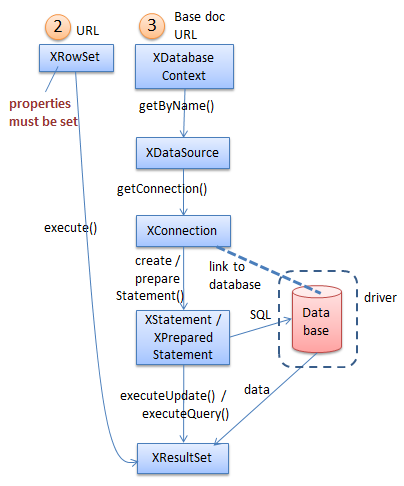
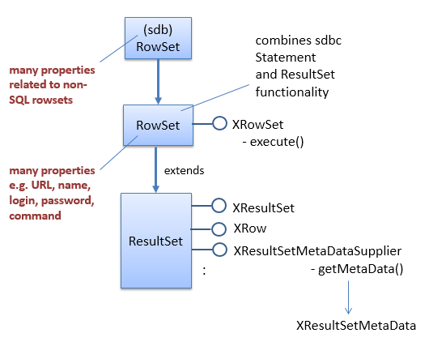
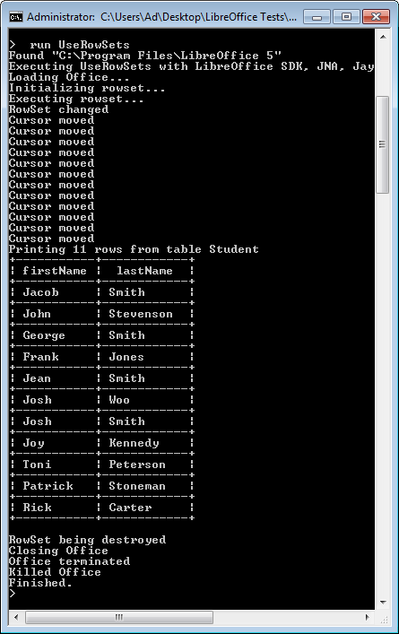
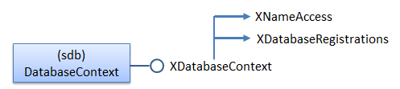

# Chapter 36. Using RowSets and Database Context

!!! note "Topics"
    Using RowSets;
    Using the Database
    Context; Copying Data
    From Base To Calc

    Example folders: "Base
    Tests" and "Utils"


This chapter looks at programming with the XRowSet and
XDatabaseContext interfaces, which were labelled (2) and
(3) in Figure 5 of the Chapter 34. Figure 1 repeats that
figure but without the alternative query approaches (labels (1) and (4)).




Figure 1.  Querying a Base Document.


## 1.  Using RowSets

Base's RowSet offers much the same functionality as JDBC's RowSet in that it
abstracts away from connecting Java to a database towards queries applied to general
tabular data. This means that a row set can access different types of information
include flat files, spreadsheets, and ODB files.

The JDBC RowSet is implemented in a different way from the sdb row set – JDBC
supports several RowSet subclasses, including JdbcRowSet, CachedRowSet and
WebRowSet, none of which are present in the Base API. Instead the different ways of
manipulating files are specified by setting properties in a RowSet object before it is
executed.

Figure 2 shows that row set properties are distributed between two RowSet services,
one in the sdbc module, the other in the higher-level sdb module.




Figure 2. The RowSet Services and Interfaces.


Although the XRowSet interface's most important method is execute(), it inherits
XResultSet which adds other useful functions. One benefit is that an executed row set,
which contains results, can be passed to the BaseTablePrinter class for ASCII
printing.

Aside from the documentation webpages for the two RowSet services, a good
summary of row set properties can be found in "The RowSet Service" section of the
Developer's Guide in chapter 12. The same information is online at:
https://wiki.openoffice.org/wiki/Documentation/DevGuide/Database/Usage/ (or use
`loguide "Database usage"`).

My personal view is that the RowSet service is overly complex, trying to combine too
many ways of accessing databases and tabular data. It's easier to use separate services
aimed at specific forms of data. For example, XOfficeDatabaseDocument for ODB
files, XDatabaseContext for URLs, and XDriverManager for none-ODB data such as
CSV files and e-mail address books. I'll discuss XDatabaseContext  in section 2 and
XDriverManager in the next chapter.

Another 'black mark' against RowSet is that the my example below hangs after
closing a row set; Lo.killOffice() must be called to end the program.

UseRowSets.java executes a row set containing a simple SQL query:

```java
// in UseRowSets.java
public static void main(String[] args)
{
  XComponentLoader loader = Lo.loadOffice();
  execQuery();
  Lo.closeOffice();
  Lo.killOffice();    // needed to clean-up after XRowSet
}  // end of main()


private static void execQuery()
{
  try {
    System.out.println("Initializing rowset...");
    XRowSet xRowSet = Base.rowSetQuery("liangTables.odb",
          "SELECT \"firstName\", \"lastName\" FROM \"Student\"");

    // add rowset listener
    xRowSet.addRowSetListener( new XRowSetListener() {
      public void cursorMoved(EventObject e)
      {  System.out.println("Cursor moved");  }

      public void rowChanged(EventObject e)
      {  System.out.println("Row changed");  }

      public void rowSetChanged(EventObject e)
      {  System.out.println("RowSet changed");  }

      public void disposing(EventObject e)
      {  System.out.println("RowSet being destroyed"); }
    });

    System.out.println("Executing rowset...");
    xRowSet.execute();

    BaseTablePrinter.printResultSet(xRowSet);
      // possible since XRowSet is a subclass of XResultSet

    // dispose of row set
    XComponent xComp = Lo.qi(XComponent.class, xRowSet);
    xComp.dispose();
  }
  catch(com.sun.star.uno.Exception e)
  {  System.out.println(e);  }
}  // end of execQuery()
```

The tricky initialization of RowSet properties is handled by Base.rowSetQuery():

```java
// in the Base class
public static XRowSet rowSetQuery(String fnm, String query)
{
  XRowSet xRowSet = Lo.createInstanceMCF(XRowSet.class,
                                 "com.sun.star.sdb.RowSet");

  Props.setProperty(xRowSet, "DataSourceName", FileIO.fnmToURL(fnm));
  Props.setProperty(xRowSet, "CommandType", CommandType.COMMAND);
                                       // TABLE, QUERY or COMMAND
  Props.setProperty(xRowSet, "Command", query);
         // command could be a table, query name, or SQL,
         // depending on the CommandType

  // set these if your database requires a login
  // Props.setProperty(xRowSet, "User", "");
  // Props.setProperty(xRowSet, "Password", "");

  // more attributes are defined in sdb and sdbc Rowset...


  return xRowSet;
}  // end of rowSetQuery()
```

Base.rowSetQuery() shows that initializing a row set is less work than directly
obtaining an ODB data source, connecting to the database, and creating a Statement
service. The equivalent of executing a statement is the call to XRowset.execute(),
carried out by execQuery() in UseRowSets.java:
xRowSet.execute();
Once the row set has been populated, it's passed to BaseTablePrinter.printResultSet()
where it's treated as an XResultSet instance:

```java
// in execQuery()...
BaseTablePrinter.printResultSet(xRowSet);
```

#### Listening to the Row Set

execQuery() shows how it's possible to attach a listener to a row set, which is woken
up when the result set cursor moves or the set is changed.

The anonymous XRowSetListener in execQuery() prints a short message if any of its
handlers are triggered; their output can be seen in Figure 3.




Figure 3. The Execution of UseRowSets.java.


#### Termination Problem after Closing a Row Set

The disposal of the row set is easy:

```java
// at the end of execQuery()...
XComponent xComp = Lo.qi(XComponent.class, xRowSet);
xComp.dispose();
```

Back in main(), Lo.closeOffice() is executed, returns, but then the program hangs. A
call to Lo.killOffice() (which utilizes Window's taskkill) is needed to terminate the
program and Office.


## 2.  Using the Database Context

Sdbc's XDatabaseContext lets the programmer access Base's database context, which
is a container for data sources (see Figure 1). Data sources map names to databases,
hiding the low-level details of the driver's protocol, and whether the database is
embedded in an ODB file or located at the other end of a URL. Base's database
context performs a similar role to JNDI for data sources in JDBC.

Figure 4 shows the DatabaseContext service and some of its important interfaces.




Figure 4. The DatabaseContext Service and Interfaces.


### 2.1.  Registered Data Sources

It's possible to add (or register) new data sources to Base's database context, but I
won't be using that feature. Currently registered sources are listed by
Base.printRegisteredDataSources():

```java
// in the Base class
public static void printRegisteredDataSources()
// print all registered datasources
{
  XDatabaseRegistrations dbRegs =
       Lo.createInstanceMCF(XDatabaseRegistrations.class,
                           "com.sun.star.sdb.DatabaseContext");

  XNameAccess nmsAccess = Lo.createInstanceMCF(XNameAccess.class,
                             "com.sun.star.sdb.DatabaseContext");

  String dsNames[] = nmsAccess.getElementNames();
  System.out.println("Registered Data Sources (" +
                                  dsNames.length + ")");
  for (int i = 0; i < dsNames.length; ++i) {
    String dbLoc = null;
    try {
      dbLoc = dbRegs.getDatabaseLocation(dsNames[i]);
    }
    catch(com.sun.star.uno.Exception e) {}
    System.out.println("  " + dsNames[i] + " in " + dbLoc);
  }
  System.out.println();
}  // end of printRegisteredDataSources()
```

The method iterates through the data source names in the database context, printing
the locations of their associated databases. The output for my version of Base is:

```
Registered Data Sources (1)
  Bibliography in file:///C:/Users/Dell/AppData/Roaming/LibreOffice/4/user/database/biblio.odb
```

Only a "Bibliography" data source is stored in the database context, which maps to an
ODB file called biblio.odb.


### 2.2.  Accessing a File Using a Data Source

New data sources can be created in the database context, which offers a way to access
ODB files without having to explicitly open them as documents. For example, the
DataSourcer.java example shows how "liangTables.odb" can be queried without
having to first instantiate XOfficeDatabaseDocument (i.e. without opening the ODB
file).


```java
// in DataSourcer.java
public static void main(String[] args)
{
  XComponentLoader loader = Lo.loadOffice();

  Base.printRegisteredDataSources();  // explained above

  XConnection conn = null;
  try {
    XDataSource dataSource =
          Base.getFileDataSource("liangTables.odb");
          // no office document opened

    conn = dataSource.getConnection("", ""); // no login/password

    XResultSet rs = Base.executeQuery(
        "SELECT \"firstName\", \"lastName\" FROM \"Student\"", conn);
    BaseTablePrinter.printResultSet(rs);
  }
  catch(SQLException e) {
    System.out.println(e);
  }

  Base.closeConnection(conn);
  Lo.closeOffice();
  Lo.killOffice();   // needed when Base.getFileDataSource() used
}  // end of main()
```

The database context is manipulated by Base.getFileDataSource():

```java
// in the Base class
public static XDataSource getFileDataSource(String fnm)
{
  try {
    String fileURL = FileIO.fnmToURL(fnm);
    XNameAccess nmsAccess = Lo.createInstanceMCF(XNameAccess.class,
                            "com.sun.star.sdb.DatabaseContext");
    XDataSource ds = Lo.qi(XDataSource.class,
                               nmsAccess.getByName(fileURL) );
    if (ds == null) {
      System.out.println("No data source for " + fnm);
      return null;
    }
    else {
      System.out.println("Found data source for " + fnm);
      return ds;
    }
  }
  catch(com.sun.star.uno.Exception e) {
    System.out.println("Unable to access data source for " + fnm +
                       ": " + e.getMessage());
    return null;
  }
}  // end of getFileDataSource()
```

The database context's XNameAccess interface is used to map the supplied filename
to a data source.

Back in main() of DataSourcer.java, the Student table in the database is queried using
the data source, and then the program closes the connection and Office. There's no
need to close an XOfficeDatabaseDocument document, (e.g. by calling
Base.closeBaseDoc(dbDoc)) since one was never opened.

Unfortunately, DataSourcer.java needs to call Lo.killOffice() or the program will
hang after the return of Lo.closeOffice(). This is similar to the row set problem in
UseRowSets.java in the previus section.


## 3.  Copying Data From Base To Calc

There are a few places in my Office support classes where the code assumes only one
document is open at a time. For programs that copy data from one document to
another, problems can be avoided by using an intermediate data structure. The usual
strategy is to read the data from the first document,  then close the file before the
second document is opened, and then the data is added to it.

This situation arises when copying database records (stored in a Base document) to a
spreadsheet (a Calc document). An alternative solution to using an intermediate data
structure is to access the database as a data source instead of as a
XOfficeDatabaseDocument object. This means that only a single Calc document is
manipulated by the program so no problems arise with my support classes. This
approach is implemented in StoreInCalc.java:

```java
// globals
private static final String FNM = "liangTables.odb";
private static final String CALC_FNM = "liangCalc.ods";


// in StoreInCalc.java
public static void main(String[] args)
{
  XComponentLoader loader = Lo.loadOffice();
  XSpreadsheetDocument doc = Calc.createDoc(loader);
  if (doc == null) {
    System.out.println("Document creation failed");
    Lo.closeOffice();
    return;
  }
  System.out.println("Created a Calc document");

  XSpreadsheet sheet = Calc.getSheet(doc, 0);
  if (sheet == null) {
    System.out.println("No spreadsheet found");
    Lo.closeOffice();
    return;
  }

  GUI.setVisible(doc, true);  // show the new sheet

  Object[][] rsa = queryDB(FNM,
         "SELECT \"firstName\", \"lastName\" FROM \"Student\"");
  if (rsa != null)
    fillSheet(sheet, rsa);
  Lo.delay(3000);  // wait for visible sheet to be changed

  Lo.saveDoc(doc, CALC_FNM);
  Lo.closeDoc(doc);
  Lo.closeOffice();

  // Lo.killOffice();   // needed when getFileDataSource() used
}  // end of main()
```

The program creates a XSpreadsheetDocument object, which is left open while
queryDB() queries the database. The result set is returned as a 2D array called rsa,
which fillSheet() uses to populate the spreadsheet. The document is saved and Office
closed.

queryDB() accesses the database as a data source, not as a document:

```java
// in StoreInCalc.java
private static Object[][] queryDB(String fnm, String query)
{
  Object[][] rsa = null;
  XConnection conn = null;
  try {
    XDataSource dataSource = Base.getFileDataSource(fnm);
    conn = dataSource.getConnection("", "");

    XResultSet rs = Base.executeQuery(query, conn);
    rsa = Base.getResultSetArr(rs);
  }
  catch(SQLException e) {
    System.out.println(e);
  }

  Base.closeConnection(conn);
  return rsa;
}  // end of queryDB()
```

Base.getResultSetArr() returns the result set as a 2D array of Objects. It builds the
array by traversing the result set a row at a time, creating a one-dimensional array for
each row. The data structure could be a defined as a 2D array of strings, except that
the Calc API requires an object array fillSheet() uses XCellRangeData.setDataArray()
to add the array to the sheet:

```java
// in StoreInCalc.java
private static void fillSheet(XSpreadsheet sheet, Object[][] rsa)
{
  try {
    XCellRange cellRange = sheet.getCellRangeByPosition(0, 0,
                                 rsa[0].length-1, rsa.length-1);
    XCellRangeData xData = Lo.qi(XCellRangeData.class, cellRange);
    xData.setDataArray(rsa);
  }
  catch (Exception e) {
    System.out.println("Could not writes values to cells");
  }
}  // end of fillSheet()
```