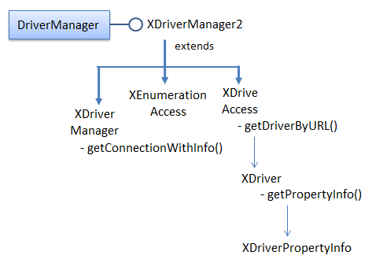
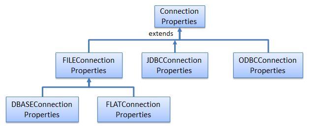
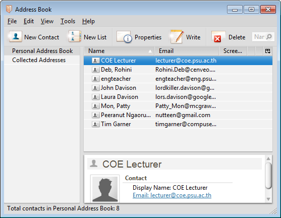

# Chapter 37. Using the Driver Manager

!!! note "Topics"
    Querying a CSV
    File; Querying an
    Access File; Querying a
    Calc Spreadsheet;
    Querying a Thunderbird
    Address Book

    Example folders: "Base
    Tests" and "Utils"


This chapter looks at programming with the
XDriveManager interface, which were labelled (4) in
Figure 5 of the Chapter 34. Figure 1 repeats that figure but
without the alternative query approaches (labels (1), (2)
and (3)).


Figure 1. Querying a Document.


XDriverManager offers a low-level driver approach for accessing databases, which is
similar to JDBC's DriverManager. It's rarely used to access Office databases, which
are more conveniently manipulated using XOfficeDatabaseDocument (see Chapter
35). More commonly XDriverManager is employed for non-Office databases, such as
MS Access files, and tabular data inside CSV files, Calc spreadsheets, and e-mail
address books. This chapter includes examples of how to query these kinds of files.

The drawback of using a driver manager is the low-level information that the
programmer has to supply, including the driver name, the file's URL, and the
connection properties. A good source for this information is the Developer's Guide, in
the "Driver Specifics" section of chapter 12. It's also accessible online at
https://wiki.openoffice.org/wiki/Documentation/DevGuide/Database/Driver_Specifics
(or use `loGuide "Database Driver Specifics"`). Unfortunately, the guide was last
updated in 2008 for OpenOffice 3.1, and some details have changed since then. A
better approach is to query Base's DriverManager at run time which will supply data
for the version of Office that you're using. Figure 2 shows the relevant parts of the
DriverManager service and its interfaces.




Figure 2. The DriveManager Service and Some of its Interfaces.


The XEnumerationAccess interface offers a convenient way to list all the drivers
currently known to Base. When the programmer calls
XDriveAcccess.getDriverByURL(), one of these is selected based on the URL's
database protocol. XDriver.getPropertyInfo() gives access to the properties that can be
set in the driver's connection.

These interfaces and methods are utilized by my Base.getSupportedDrivers() and
Base.printDriverProperties() functions, as seen in CSVQuery.java explained next.


## 1.  Querying a CSV File

CSVQuery.java opens a CSV file, examines its us-500 table, and prints the first
names of the people resident in New York City:

```java
// part of CSVQuery.java...
XResultSet rs = Base.executeQuery("SELECT \"first_name\" FROM
                    \"us-500\" WHERE \"City\" = 'New York'", conn);
BaseTablePrinter.printResultSet(rs);
```

The novel parts of CSVQuery.java are how it sets up the database connection and
how it determines the table's format. The main() function:

```java
// global
private static final String FNM = "us-500.csv";


// in CSVQuery.java
public static void main(String[] args)
{
  XComponentLoader loader = Lo.loadOffice();

  XDriverManager dm = Base.getDriverManager();
  if (dm == null) {
    System.out.println("Could not access Driver manager");
    Lo.closeOffice();
    return;
  }

  ArrayList<String> driveNms = Base.getSupportedDrivers();
  System.out.println("Drivers (" + driveNms.size() + "):");
  for(String driveNm : driveNms)
    System.out.println("  " + driveNm);
  System.out.println();

  String url = "sdbc:flat:" + FileIO.fnmToURL(FNM);
  System.out.println("Using URL: " + url);

  XDriver driver = Base.getDriverByURL(url);
  Base.printDriverProperties(driver, url);

  // set up properties for a CSV file with no password
  PropertyValue[] props = Props.makeProps(
        new String[] { "user", "password",
                       "JavaDriverClass", "Extension",
                       "HeaderLine", "FieldDelimiter",
                       "StringDelimiter" },
        new Object[] { "", "",
               "com.sun.star.comp.sdbc.flat.ODriver", "csv",
                true, ",", "\"\"" }
          );

  XConnection conn = null;
  try {
    conn = dm.getConnectionWithInfo(url, props);

    // ArrayList<String> tableNames = Base.getTablesNames(conn);
    ArrayList<String> tableNames = Base.getTablesNamesMD(conn);
    System.out.println("No. of tables: " + tableNames.size());
    System.out.println( Arrays.toString(tableNames.toArray()));
                // reports all CSV tables ??

    XResultSet rs = Base.executeQuery("SELECT \"first_name\" FROM
            \"us-500\" WHERE \"City\" = 'New York'", conn);
    BaseTablePrinter.printResultSet(rs);
  }
  catch(Exception e) {
    System.out.println(e);
  }

  Base.closeConnection(conn);
  Lo.closeOffice();
}  // end of main()
```

The XDriverManager interface is obtained by Base.getDriverManager():

```java
// in the Base class
public static XDriverManager getDriverManager()
{ return Lo.createInstanceMCF(XDriverManager.class,
                              "com.sun.star.sdbc.DriverManager");
}
```

Base.getSupportedDrivers() returns a list of all the Base drivers:

```java
// in the Base class
public static ArrayList<String> getSupportedDrivers()
{
  XDriverManager dm = getDriverManager();
  XEnumerationAccess enumAccess =
                   Lo.qi(XEnumerationAccess.class, dm);
  XEnumeration driversEnum = enumAccess.createEnumeration();
  if (driversEnum == null) {
    System.out.println("No drivers found");
    return null;
  }

  ArrayList<String> drivers = new ArrayList<String>();
  while(driversEnum.hasMoreElements()) {
    try {
      drivers.add( Info.getImplementationName(
                          driversEnum.nextElement()) );
    }
    catch(com.sun.star.uno.Exception e) {}
  }
  return drivers;
}  // end of getSupportedDrivers()
```

The XDriverManager interface is cast to XEnumerationAccess, which can loop
through the drivers and access their names. The list on one of my test machines is:

```
Drivers (11):
  com.sun.star.comp.sdbc.ODBCDriver
  com.sun.star.comp.sdbc.JDBCDriver
  com.sun.star.comp.sdbc.MorkDriver
  com.sun.star.comp.sdbc.ado.ODriver
  com.sun.star.comp.sdbc.calc.ODriver
  com.sun.star.comp.sdbc.dbase.ODriver
  com.sun.star.comp.sdbc.firebird.Driver
  com.sun.star.comp.sdbc.flat.ODriver
  com.sun.star.sdbcx.comp.hsqldb.Driver
  org.openoffice.comp.connectivity.pq.Driver.noext
  org.openoffice.comp.drivers.MySQL.Driver
```

CSVQuery.java uses the "flat" driver to access the CSV file. Later examples in this
chapter employ the ADO, Calc, and Mork drivers for an Access database, a Calc
spreadsheet, and a Thunderbird address book.

There's no need for the programmer to explicitly load a driver, since Base does it
automatically based on the database protocol in the file's URL. The URL is
constructed with the following code:

```java
// part of CSVQuery.java...
String url = "sdbc:flat:" + FileIO.fnmToURL(FNM);
System.out.println("Using URL: " + url);

XDriver driver = Base.getDriverByURL(url);
```

The database protocol is set to be "sdbc:flat", and the local file is converted to "file://"
URL form; the resulting URL is:

```java
sdbc:flat:file:///C:/Users/Ad/Desktop/LibreOffice Tests/
                                        Base Tests/us-500.csv
```

Base.getDriverByURL() is:

```java
// in the Base class
public static XDriver getDriverByURL(String url)
{ XDriverAccess driverAccess =
        Lo.createInstanceMCF(XDriverAccess.class,
                             "com.sun.star.sdbc.DriverManager");
  return driverAccess.getDriverByURL(url);
}  // end of getDriverByURL()

Base.printDriverProperties() prints the driver's name, and its properties:

// in the Base class
public static void printDriverProperties(XDriver driver, String url)
{
  if (driver == null) {
    System.out.println("Driver is null");
    return;
  }
  try {
    System.out.println("Driver Name: " +
                    Info.getImplementationName(driver));

    DriverPropertyInfo[] dpInfo = driver.getPropertyInfo(url, null);
    if (dpInfo == null) {
      System.out.println("Properties info for the driver is null");
      return;
    }
    System.out.println("No. of Driver properties: " + dpInfo.length);
    for(int i=0; i < dpInfo.length; i++)
       System.out.println("  " + dpInfo[i].Name + " = " +
                                 dpInfo[i].Value);
    System.out.println();
  }
  catch(SQLException e) {
    System.out.println("No properties info for the driver");
  }
}  // end of printDriverProperties()
```

The method utilizes XDriver.getPropertyInfo() (see Figure 2) to access an array of
DriverProperty objects.

The information printed for the CSV file's "flat" driver is:

```
Driver Name: com.sun.star.comp.sdbc.flat.ODriver
No. of Driver properties: 11
  CharSet =
  Extension = .*
  ShowDeleted = 0
  EnableSQL92Check = 0
  UseRelativePath = 0
  URL =
  FieldDelimiter =
  HeaderLine = 0
  StringDelimiter = 0
  DecimalDelimiter = 0
  ThousandDelimiter = 0
```

Knowing the property names is a good start, but what do they do? Connection
properties are defined across several classes which inherit the ConnectionProperties
class, as shown in Figure 3.




Figure 3. Connection Properties and Subclasses.


The most relevant class for the CSV flat file is FlatConnectionProperties, although
some properties are also inherited from FileConnectionProperties and
ConnectionProperties.

Some experimentation is required to decide which properties to set, but a good source
of answers are the OpenOffice and LibreOffice forums where people have dealt with
similar questions before. The properties are passed to the connection by calling
XDriverManager.getConnectionWithInfo():

```java
// part of CSVQuery.java...
// set up properties for a CSV file with no password
PropertyValue[] props = Props.makeProps(
        new String[] { "user", "password",
                       "JavaDriverClass", "Extension",
                       "HeaderLine", "FieldDelimiter",
                       "StringDelimiter" },
        new Object[] { "", "",
               "com.sun.star.comp.sdbc.flat.ODriver", "csv",
                true, ",", "\"\"" }
      );
XConnection conn = dm.getConnectionWithInfo(url, props);
```


## 2.  Finding out about Tables

A common need when querying databases is knowing their table schemas.

In my earlier ODB document examples, I used classes from the sdbcx module to get
schema information (see Figure 10). For example, Base.getTablesNames() accesses
information about all the tables in the database:

```java
// in the Base class
public static ArrayList<String> getTablesNames(XConnection conn)
{
  XTablesSupplier tblsSupplier =
                    Lo.qi(XTablesSupplier.class, conn);
  XNameAccess tables = tblsSupplier.getTables();
  String[] tableNms = tables.getElementNames();
  return new ArrayList<String>(Arrays.asList(tableNms));
}  // end of getTablesNames()
```

This technique doesn't work with non-Office databases, such as CSV files, Access
databases, and spreadsheets. If Base.getTablesNames() is passed a connection to these
then the XTablesSupplier instance is set to null.

Fortunately, there's an alternative, lower-level approach based on using the
DatabaseMetaData service (see Figure 1), as implemented in getTablesNamesMD():

```java
// in the Base class
public static ArrayList<String> getTablesNamesMD(XConnection conn)
// get table names using DatabaseMetaData
{
  ArrayList<String> names = new ArrayList<String>();
  try {
     XDatabaseMetaData dm = conn.getMetaData();
     XResultSet rs = dm.getTables(null, null, "%",
                                         new String[]{"TABLE"});
     XRow xRow = Lo.qi(XRow.class, rs);
     while (rs.next())
       names.add(xRow.getString(3));    // 3 == table name
   }
   catch(SQLException e) {
     System.out.println(e);
   }
   return names;
 }  // end of getTablesNamesMD()
```

Table schema details are retrieved by querying XDatabaseMetaData, which lets
Base.getTablesNamesMD() return a list of table names. The bad news is that the
generated list is incorrect, including every CSV file name in the current directory.

This meant that I had to hardwire the "us-500" table name into the query in
CSVQuery.java. rather than use the Base.getTablesNamesMD() data.


## 3.  Querying an Access File

AccessQuery.java is almost the same as CSVQuery.java, except for the change in
driver and the connection properties.

The list of drivers printed by Base.getSupportedDrivers() suggests that I should use
the ADO driver to connect to Microsoft Access files since ActiveX Data Objects
(ADO) is one of Microsoft's technologies for database access.

The documentation on how to use this driver is quite sparse and out of date. The URL
protocol is given as "sdbc:ado:<ADO specific connection string>", with two
examples:

* `sdbc:ado:PROVIDER=Microsoft.Jet.OLEDB.4.0;`
`DATA SOURCE= c:\northwind.mdb`
* `sdbc:ado:Provider=msdaora;data source=testdb`
The first is the most relevant, but only supports the old Access file format (MDB). For
ACCDB files (Access 2007 and later), it must be revised to:

```
"sdbc:ado:PROVIDER=Microsoft.ACE.OLEDB.12.0;DATA SOURCE=".
```

Base.getTablesNamesMD() returns slightly incorrect results when it examines Access
files. For example, a database with four tables is reported to have five, one of them
the empty string:

```
No. of tables: 5
[AuthorISBN, Authors, Publishers, Titles, ]
```

The main() function for AccessQuery.java:

```java
//private static final String FNM = "Books.mdb";
private static final String FNM = "Books.accdb";


// in AccessQuery.java
public static void main(String[] args)
{
  XComponentLoader loader = Lo.loadOffice();

  XDriverManager dm = Base.getDriverManager();
  if (dm == null) {
    System.out.println("Could not access Driver manager");
    Lo.closeOffice();
    return;
  }

  String url = "sdbc:ado:PROVIDER=Microsoft.ACE.OLEDB.12.0;
                DATA SOURCE=" +
                FileIO.getAbsolutePath(FNM);
                         // for accdb *and* mdb files
  System.out.println("Using URL: " + url);

  XConnection conn = null;
  try {
    conn = dm.getConnectionWithInfo(url, null);
                  // no connection properties needed

    ArrayList<String> tableNames = Base.getTablesNamesMD(conn);
    System.out.println("No. of tables: " + tableNames.size());
    System.out.println( Arrays.toString(tableNames.toArray()));
             // table list includes an empty string

    XResultSet rs = Base.executeQuery(
                      "SELECT * FROM \"Authors\"", conn);
    BaseTablePrinter.printResultSet(rs);
  }
  catch(Exception e) {
    System.out.println(e);
  }

  Base.closeConnection(conn);
  Lo.closeOffice();
}  // end of main()
```


## 4.  Querying a Calc Spreadsheet

CalcQuery.java examines the "Marks" spreadsheet in totals.ods.

The Calc driver treats each named sheet in the spreadsheet as a separate table. This
time, Base.getTablesNamesMD() returns a correct list of the sheet names.

```java
private static final String FNM = "totals.ods";


// in CalcQuery.java
public static void main(String[] args)
{
  XComponentLoader loader = Lo.loadOffice();
  XDriverManager dm = Base.getDriverManager();
  if (dm == null) {
    System.out.println("Could not access Driver manager");
    Lo.closeOffice();
    return;
  }

  String url = "sdbc:calc:" + FileIO.fnmToURL(FNM);
  System.out.println("Using URL: " + url);

  XConnection conn = null;
  try {
    conn = dm.getConnectionWithInfo(url, null);
                  // no connection properties needed

    ArrayList<String> tableNames = Base.getTablesNamesMD(conn);
    System.out.println("No. of tables: " + tableNames.size());
    System.out.println( Arrays.toString(tableNames.toArray()));

    XResultSet rs = Base.executeQuery(
           "SELECT \"Stud. No.\", \"Fin/45\" FROM \"Marks\"
            WHERE \"Fin/45\" < 20", conn);
    BaseTablePrinter.printResultSet(rs);
  }
  catch(Exception e) {
    System.out.println(e);
  }

  Base.closeConnection(conn);
  Lo.closeOffice();
}  // end of main()
```


## 5.  Querying a Thunderbird Address Book

One reason for Office being able to access the address books of e-mail software is for
implementing mail merge applications. ThunderbirdQuery.java examines the personal
addresses in Thunderbird (https://mozilla.org/en-US/thunderbird/).

The Office documentation at
https://wiki.openoffice.org/wiki/Documentation/DevGuide/Database/Driver_Specifics
mentions support for Mozilla, Outlook, Outlook Express and LDAP, but several
forum posts describe updates and changes.

"sdbc:address:mozilla" supports SeaMonkey Mail, the 2006 replacement for the
Mozilla e-mail reader (https://seamonkey-project.org/), and
"sdbc:address:thunderbird" connects to Thunderbird. Base uses the Mork driver
(com.sun.star.comp.sdbc.MorkDriver) to access both SeaMonkey and Thunderbird.

The Thunderbird e-mail reader on my test machine has two address books, called
"Personal Address Book" and "Collected Addresses", as shown in Figure 4.




Figure 4. My Thunderbird Address Books.


When I use Base.getTablesNamesMD() to list the 'tables' inside Thunderbird, it
reports slightly different names :

```
[AddressBook, CollectedAddressBook]
```

These changes made me suspicious about the rest of the table's schema, including the
names of the table's columns. Inside Thunderbird, the e-mail column is labeled
"Email" (as shown in Figure 4), but is that what Base sees?
Base.displayTablesSchema() lists the table and column information for the connected
database, using sdbcx to get the table names. However, there's a meta data variant
which utilizes Base.getTablesNamesMD(), as shown below:

```java
// in the Base class
public static void displayTablesSchema(XConnection conn)
{  displayTablesSchema(conn, true);  }


public static void displayTablesSchema(XConnection conn,
                                       boolean useSDBCX)
{
  ArrayList<String> tableNames = (useSDBCX) ? getTablesNames(conn) :
                                            getTablesNamesMD(conn);
    // choose to use SDBCX or DatabaseMetaData
  if (tableNames == null)
    System.out.println("No tables found in database");
  else {
    System.out.println("No. of tables: " + tableNames.size());
    ArrayList<String> columnNames;
    for(String tableName : tableNames) {
      System.out.print("  " + tableName + ":");
      columnNames = getColumnNames(conn, tableName);
      if (columnNames == null)
        System.out.println(" -- no column names --");
      else {
        for(String colName : columnNames)
          System.out.print(" \"" + colName + "\"");
        System.out.println("\n");
      }
    }
  }
}  // end of displayTablesSchema()


public static ArrayList<String> getColumnNames(
                     XConnection conn, String tableName)
{
  ArrayList<String> names = new ArrayList<String>();
  try {
    XDatabaseMetaData dm = conn.getMetaData();
    XResultSet rs = dm.getColumns(null, null, tableName, "%");
    XRow xRow = Lo.qi(XRow.class, rs);
    while (rs.next())
      names.add(xRow.getString(4));    // 4 == column name
  }
  catch(SQLException e) {
    System.out.println(e);
  }
  return names;
}  // end of getColumnNames()
```

A `Base.displayTablesSchema(conn,false)` call produces the following
information when the connection is linked to Thunderbird:

```
No. of tables: 2
  AddressBook: "Department" "Last Name" "Comments" "Mobile" "Phone
(Work)" "City (Work)" "City" "Job Title" "Custom 3" "Work Address 2"
"Custom 2" "Birth Month" "Company" "ZIP/Postal (Home)" "Custom 1"
"Custom 4" "Birth Day" "Web Page (Work)" "Nickname" "Web Page (Home)"
"Birth Year" "Fax" "First Name" "Address 1" "Phone (Home)" "State"
"State (Work)" "Display Name" "Country" "Pager" "E-mail (2)" "Work
Address" "Country (Work)" "Zip/Postal (Work)" "Address 2" "E-mail"
"Mail Format"

  CollectedAddressBook: "Department" "Last Name" "Comments" "Mobile"
"Phone (Work)" "City (Work)" "City" "Job Title" "Custom 3" "Work
Address 2" "Custom 2" "Birth Month" "Company" "ZIP/Postal (Home)"
"Custom 1" "Custom 4" "Birth Day" "Web Page (Work)" "Nickname" "Web
Page (Home)" "Birth Year" "Fax" "First Name" "Address 1" "Phone
(Home)" "State" "State (Work)" "Display Name" "Country" "Pager" "E-
mail (2)" "Work Address" "Country (Work)" "Zip/Postal (Work)"
"Address 2" "E-mail" "Mail Format"
```

The "AddressBook" table contains two e-mail related column names: "E-mail" and
"E-mail (2)". As a consequence, I wrote the query to retrieve all the e-mail addresses
from the Personal Address Book as:

XResultSet rs = Base.executeQuery(
        "SELECT \"E-mail\" FROM \"AddressBook\"", conn);
BaseTablePrinter.printResultSet(rs);

This produces textual output which matches that in Figure 4:

```
Printing 8 rows from table AddressBook
+------------------------------+
|            E-mail            |
+------------------------------+
| timgarner@compuserve.com     |
+------------------------------+
| Rohini.Deb@cenveo.com        |
+------------------------------+
| Patty_Mon@mcgraw-hill.com    |
+------------------------------+
| nutteen@gmail.com            |
+------------------------------+
| lors.davison@googlemail.com  |
+------------------------------+
| lordkiller.davison@gmail.com |
+------------------------------+
| lecturer@coe.psu.ac.th       |
+------------------------------+
| engteacher@eng.psu.ac.th     |
+------------------------------+
```

The main() function of ThunderbirdQuery.java:

```java
// in ThunderbirdQuery.java
public static void main(String[] args)
{
  XComponentLoader loader = Lo.loadOffice();

  XDriverManager dm = Base.getDriverManager();
  if (dm == null) {
    System.out.println("Could not access Driver manager");
    Lo.closeOffice();
    return;
  }

  XConnection conn = null;
  try {
    conn = dm.getConnectionWithInfo(
                    "sdbc:address:thunderbird", null);

    ArrayList<String> tableNames = Base.getTablesNamesMD(conn);
    System.out.println("No. of tables: " + tableNames.size());
    System.out.println( Arrays.toString(tableNames.toArray()));

    Base.displayTablesSchema(conn, false); // use getTablesNamesMD()

    XResultSet rs = Base.executeQuery(
            "SELECT \"E-mail\" FROM \"AddressBook\"", conn);
    BaseTablePrinter.printResultSet(rs);
  }
  catch(Exception e) {
    System.out.println(e);
  }

  Base.closeConnection(conn);
  Lo.closeOffice();
}  // end of main()
```
