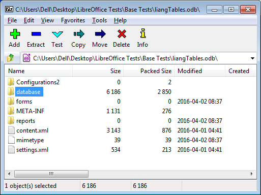
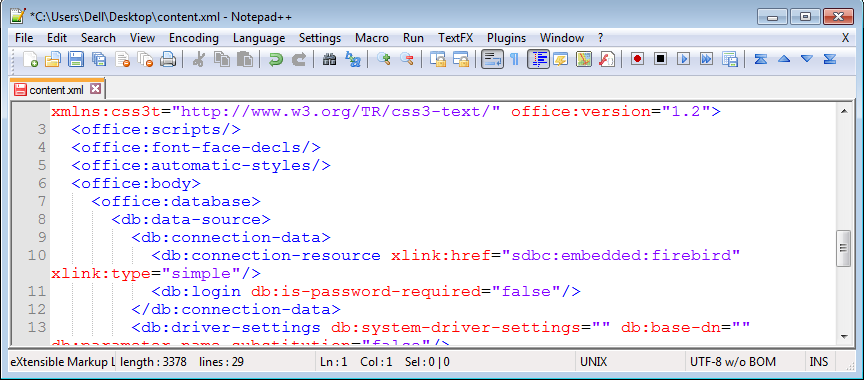
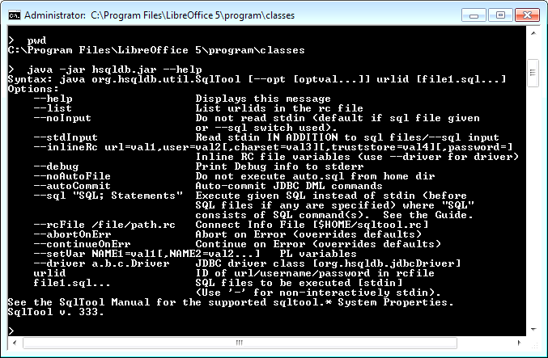

# Chapter 38. Treating an ODB File as a Zipped Folder 

!!! note "Topics"
    Extracting a 
    Database from an ODB 
    File; Querying an 
    Extracted HSQLDB 
    Database; Querying an 
    Extracted Firebird 
    Database 

    Example folders: "Base 
    Tests" and "Utils" 
 
 
An ODB document can be manipulated as a zipped folder, 
using tools such as 7-zip (http://www.7-zip.org/). This 
means that it's possible to use Java zip classes (in the 
java.util.zip package) to extract a database from the ODB 
file. The advantage of this technique is that the resulting 
HSQLDB or Firebird database can be accessed through Java's JDBC without using 
the sdbc, sdbcx, or sdb modules in the Office API. 

The Office download includes a copy of the HSQLDB database engine (stored in 
<OFFICE DIR>\program\classes\hsqldb.jar) so there's no need to download any 
software for manipulating HyperSQL databases through JDBC. However, Firebird 
programming requires Firebird's embedded engine and its JDBC driver, called 
Jaybird.  

I'll discuss the details of how to run HSQLDB and Firebird databases after explaining 
how to extract them from ODB documents.  

EmbeddedQuery.java shows all the top-level stages: 
 
// in EmbeddedQuery.java 
public static void main(String[] args) 
{ 
  if (args.length != 1) { 
    System.out.println("Usage: run EmbeddedQuery <fnm>"); 
    return; 
  } 
 
  ArrayList<String> dbFnms = Base.extractEmbedded(args[0]); 
  if (dbFnms == null) 
    return; 
 
  System.out.println("Is this a Firebird embedded database? " +  
                          Jdbc.isFirebirdEmbedded(dbFnms)); 
  System.out.println("Is this an HSQLDB embedded database? " +  
                          Jdbc.isHSQLEmbedded(dbFnms)); 
 
  Connection conn = null; 
  try { 
    conn = Jdbc.connectToDB(dbFnms); 
    if (conn == null) 
      return; 
 
    ArrayList<String> tableNames = Jdbc.getTablesNames(conn); 
    System.out.println("No. of tables: " + tableNames.size()); 
    System.out.println( Arrays.toString(tableNames.toArray())); 
 
    ResultSet rs = Jdbc.executeQuery("SELECT * FROM \"" +  
                         tableNames.get(0) + "\"", conn); 
 
    DBTablePrinter.printResultSet(rs);   
    conn.close(); 
  } 
  catch(SQLException e) { 
    System.out.println(e); 
   } 
  // FileIO.deleteFiles(dbFnms); 
}  // end of main() 
 
 
## 1.  Extracting a Database from an ODB File 

Base.extractEmbedded() first determines if the ODB file contains an embedded 
HSQLDB or Firebird database since the unzipping steps are slightly different for each 
one. 

 
// in the Base class 
// globals 
public static final int HSQLDB = 1; 
public static final int FIREBIRD = 2; 
public static final String HSQL_EMBEDDED = "sdbc:embedded:hsqldb"; 
public static final String FIREBIRD_EMBEDDED =  
                                         "sdbc:embedded:firebird"; 
 
 
public static ArrayList<String> extractEmbedded(String fnm) 
{ 
  String embedFnm = getEmbeddedFnm(fnm); 
  if (embedFnm == null) { 
    System.out.println(fnm + " is not an embedded  
                                      HSQL/Firebird database"); 
    return null; 
  } 
  else if (embedFnm.equals(HSQL_EMBEDDED)) { 
    System.out.println(fnm + " is an embedded HSQL database"); 
    return unzipFiles(fnm, HSQLDB); 
  } 
  else if (embedFnm.equals(FIREBIRD_EMBEDDED)) { 
    System.out.println(fnm + " is an embedded Firebird database"); 
    return unzipFiles(fnm, FIREBIRD); 
  } 
  else { 
    System.out.println(fnm + " holds an unknown embedded db: " +  
                                                       embedFnm); 
    return null; 
  } 
}  // end of extractEmbedded() 
 
In earlier chapters I retrieved the database type by examining the connection 
properties of the driver, but I don't want to use that technique here since it requires the 
Office API. One alternative is to look for information inside the ODB document. 

If an ODB file is opened as a zipped folder, the top-level always contains a 
content.xml file and a database/ folder, as in Figure 1. 

 
 

Figure 1. Inside an ODB Document. 

 
content.xml stores information about the database type inside its <db.connection-
resource> element. The "xlink:href" attribute is assigned "sdbc:embedded.hsqldb" for 
an embedded HSQLDB database, and "sdbc:embedded:firebird" for embedded 
Firebird.  

The "xlink:href" attribute inside content.xml for the liangTable.odb document is 
shown in Figure 2, which indicates that it's an embedded HSQLDB database.  

 
 

Figure 2. Part of content.xml for liangTables.odb. 

 
Incidentally, I used a Notepad++ plugin called XMLTools to format the XML in 
Figure 2, which makes it much easier to read. 

Base.getEmbeddedFnm() unzips content.xml so the "xlink:href" attribute of the 
<db.connection-resource> element can be extracted: 
 
// in the Base class 
// globals 
public static final String TEMP_DIR = "baseTmp/"; 
 
public static String getEmbeddedFnm(String fnm) 
{ 
  FileIO.makeDirectory(TEMP_DIR); 
  String contentFnm = TEMP_DIR + "content.xml"; 
  if (unzipContent(fnm, contentFnm)) { 
    String embedRes = getEmbeddedResource(contentFnm); 
    FileIO.deleteFile(contentFnm); 
    return embedRes; 
  } 
  else { 
    System.out.println("Could not find content.xml inside " + fnm); 
    return null; 
  } 
}  // end of getEmbeddedFnm() 
 
Base.unzipContent() extracts content.xml, storing it temporarily in the baseTmp/ 
subdirectory. Base.getEmbeddedResource() accesses the <db.connection-resource> 
element inside the file, returning the string assigned to its "xlink:href" attribute. This 
value may be null if the attribute isn't present, or it may contain the URL string of an 
external database. 

Back in Base.extractEmbedded(), if the document contains an embedded database 
then the next step is to copy the database files from the zipped file into the baseTemp/ 
folder.  

The extraction details are similar but not quite the same for embedded HSQLDB and 
Firebird databases, as can be seen by looking inside the database/ folders for the two 
kinds of database. Figure 3 shows the contents of an HSQLDB database/ folder on the 
left and a Firebird database/ folder on the right. 

 
 

Figure 3. Contents of a HSQLDB database/ folder (a)  
and a Firebird database/ folder (b). 

 
A HSQLDB database consists of several files (called backup, data, log, properties, 
and script) while the Firebird database is just one file (firebird.fdb). 

The HSQLDB "script" file contains table definitions, and the data for non-cached 
tables, while the "data" file contains the data for cached tables. The "backup" file is a 
compressed backup of the last known consistent state of the data file. The "log" file 
contains recent changes to the database, and the "properties" file stores database 
settings. 

Base.unzipFiles() unzips all of the files it finds inside database/, but changes the 
names of the HSQLDB files so they are all called "hsqlDatabase" but with different 
extensions based on their zip names. The new names are hsqlDatabase.backup, 
hsqlDatabase.data, hsqlDatabase.log, hsqlDatabase.properties, and 
hsqlDatabase.script, which makes them easy for JDBC to load at run time. No change 
is made to the name of the extracted firebird.fdb file. 

Base.extractEmbedded() returns a list of the files it has extracted from the ODB file. 

Back in EmbeddedQuery.java, Jdbc.isFirebirdEmbedded() and 
Jdbc.isHSQLEmbedded() examine this list to determine what kind of database was 
retrieved.  

 
 
## 2.  Querying an Extracted HSQLDB Database 

There's no need to use Base inside EmbeddedQuery.java; all database manipulations 
can be done with JDBC, along with the help of my Jdbc.java support class. 

The relevant lines in EmbeddedQuery.java are: 
 
// part of EmbeddedQuery.java... 

Connection conn = null; 
try { 
  conn = Jdbc.connectToDB(dbFnms); 
  if (conn == null) 
    return; 
 
  ArrayList<String> tableNames = Jdbc.getTablesNames(conn); 
  System.out.println("No. of tables: " + tableNames.size()); 
  System.out.println( Arrays.toString(tableNames.toArray())); 
 
  ResultSet rs = Jdbc.executeQuery("SELECT * FROM \"" +  
                           tableNames.get(0) + "\"", conn); 
 
  // Jdbc.printResultSet(rs); 
  DBTablePrinter.printResultSet(rs);   
  // Jdbc.displayResultSet(rs); 
 
  conn.close(); 
} 
 
I won’t bother describing most of my Jdbc.java support methods (e.g. 

getTablesNames(), executeQuery(), printResultSet(), and displayResultSet()) since 
they're virtually identical to the same-named Base.java methods. The main difference 
is that they use JDBC's Connection, Statement, and ResultSet classes instead of sdbc's 
XConnection, XStatement, and XResultSet interfaces. I'm also using Hami Galip 
Torun's original DBTablePrinter class rather than my modified BaseTablePrinter 
version. 

Jdbc.connectToDB() uses Jdbc.isHSQLEmbedded() and Jdbc.isFirebirdEmbedded() 
to decide which connect methods are used for HSQLDB and Firebird. 

 
// in the Jdbc class 
public static Connection connectToDB(ArrayList<String> fnms) 
{ 
  if (isHSQLEmbedded(fnms)) 
    return connectToHSQL(Base.TEMP_DIR + Base.HSQL_FNM); 
  else if (isFirebirdEmbedded(fnms)) 
    return connectToFB(Base.TEMP_DIR + Base.FB_FNM + ".fdb"); 
  else { 
    System.out.println("Unrecognized embedded database"); 
    return null; 
  } 
}  // end of connectToDB() 
 
I'll explain the details of connectToHSQL() here, and connectToFB() in the next 
section. 

The HSQLDB website (http://hsqldb.org/) contains a lot of documentation on how to 
utilize JDBC, but one thing to remember is that Office's hsqldb.jar is version 1.8 of 
the engine. The most prominent documentation at the HSQLDB website is for the 
current version (v.2.3 as I write this). Fortunately, the older 1.8. documentation is still 
around, beginning at http://www.hsqldb.org/doc/1.8/guide/, and a short JDBC 
example is in Appendix B at http://www.hsqldb.org/doc/1.8/guide/apb.html. 

Jdbc.connectToHSQL() is based on that example: 
 
// in the Jdbc class 
public static Connection connectToHSQL(String filePath) 
{ 
 Connection conn = null; 
  try { 
    Class.forName("org.hsqldb.jdbcDriver"); 
    conn = DriverManager.getConnection("jdbc:hsqldb:file:" +  
                            filePath + 
                            ";shutdown=true",  "SA", ""); 
           // force db closure (shutdown) at connection close 
           // otherwise data, log and lock will not be deleted 
  } 
  catch (ClassNotFoundException e) { 
    System.out.println("Failed to load JDBC-HSQLDB driver"); 
  } 
  catch(SQLException e) { 
    System.out.println(e); 
  } 
  return conn; 
}  // end of connectToHSQL() 
 
Using HSQLDB Interactively: SqlTool 
It's useful to be able to examine a database without having to write Java code first; 
HSQLDB includes SqlTool for that purpose.  

SqlTool is explained at length in chapter 8 of the user guide for HSQLDB 1.8 at 
http://www.hsqldb.org/doc/1.8/guide/ch08.html. It's also possible to get help at 
runtime by calling hsqldb.jar with the "--help" argument: 
java -jar <OFFICE>\program\classes\hsqldb.jar --help 
Figure 4 shows the help generated when the JAR file is called inside the 
<OFFICE>\program\classes folder. 

 
 

Figure 4. Using SqlTool inside hsqldb.jar. 

 
 
## 3.  Querying an Extracted Firebird Database 

Accessing a Firebird database without passing through the Office API is a bit more 
work than for HSQLDB since there's no JAR file inside Office containing the 
necessary JDBC driver. 

The easiest thing is to download the embedded version of Firebird from 
http://www.firebirdsql.org/en/downloads/, making sure to grab either the 32-bit or 64-
bit version for your OS. This should be unzipped to a convenient location (e.g. 

d:\firebird), and the path added to Window's PATH environment variable. 

 
Bug Note: When I added Firebird 2.5.5 to PATH this caused a problem 
whenever I subsequently opened embedded Firebird databases in Base! Office 
issued a Runtime error r6034, related to the Microsoft Visual C++ runtime 
library. This is triggered by the presence of a mscvcr80.dll file in the 
downloaded firebird/ directory which duplicates one in Windows. 

One solution is to move Microsoft.VC80.CRT.manifest, msvcp80.dll, and 
msvcr80.dll (i.e. three files) from the firebird/ directory to some other location 
(e.g. into an UNUSED/ directory in firebird/). 

 
The JDBC driver, called Jaybird, is a separate download from 
http://www.firebirdsql.org/en/jdbc-driver/. This should be unzipped to a convenient 
location (e.g. d:\jaybird). 

There's no need to add Jaybird to the classpath of the javac.exe compiler, but calls to 
java.exe must include the location of its JAR and associated DLL. For example, 
run.bat in the Base Tests/ folder calls java.exe like so: 
 
java  -cp "%LO%\program\classes\*;%LO%\URE\java\*; 
           ..\Utils;D:\jna\jna-4.1.0.jar; 
           D:\jna\jna-platform-4.1.0.jar; 
           D:\jaybird\jaybird-full-2.2.10.jar;."  
      -Djava.library.path="D:\jaybird" %* 
 
The information in bold allows Jdbc.connectToFB() to find the JDBC driver at run 
rime: 
 
// in the Jdbc class 
public static Connection connectToFB(String filePath) 
{ 
  Connection conn = null; 
  try { 
    Class.forName("org.firebirdsql.jdbc.FBDriver"); 
    conn = DriverManager.getConnection( 
             "jdbc:firebirdsql:embedded:" + filePath, 
                                      "sysdba", "masterkey");  
  } 
  catch (ClassNotFoundException e) { 
    System.out.println("Failed to load JDBC-Firebird driver"); 
  } 
  catch(SQLException e) { 
    System.out.println(e); 
  } 
  return conn; 
}  // end of connectToFB() 
 
Note that the DriverManager.getConnection() call requires the system admin's default 
login and password, "sysdba" and "masterkey". 

 
Using Firebird Interactively: isql 
It's useful to be able to examine a database without writing Java code. Firebird offers 
isql.exe for that purpose, but it's not included in the embedded Firebird download. 

The 'simplest' way of adding it is to download the zipped version of the full firebird 
system (called "Classic, Superclassic & Superserver"), and unzip only isql.exe which 
is in the bin/ directory. Copy isql.exe to the embedded firebird directory on your 
machine (e.g. into d:\firebird), and make a copy of the fbembed.dll file in that folder, 
renaming it to fbclient.dll. 

The isql manual is online at http://www.firebirdsql.org/manual/isql.html. isql also has 
built-in help, as shown in Figure 5. 

 
 

Figure 5. Using help inside isql.exe. 

  
 
