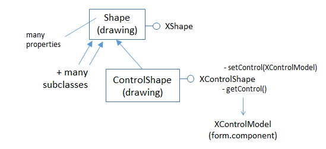
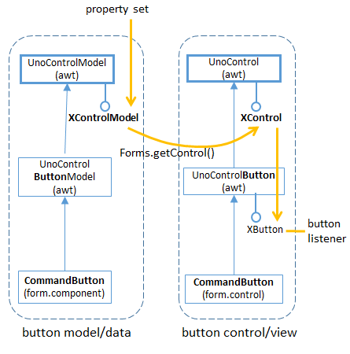

# Chapter 40. Building a Form 
Programmatically 
 
 
BuildForm.java creates a text-based form at run-time, and 
attaches listeners to the controls. Three of the controls 
(two list boxes and a grid control) are "data aware" which 
means that they obtain their data externally from a 
database. Figure 1 shows a screenshot of the generated document, with the controls 
and data sources labeled. 

 
 

Figure 1. The BuildForm.java Generated Document. 

 
The document contains two forms: the default "Form", and "GridForm" holding a 
single GridControl. "GridForm" employs the same database as "Form", but interacts 
with it in a different way. 

Table 1 summarizes which listeners are used with which controls. These are Office 
listeners (i.e. subclasses of XEventListener) not Java classes. 

 
Form Control Listeners 
CommandButton XActionListener, XMouseListener 

!!! note "Topics"
   Creating 
Controls; Assigning a 
Data Source to a Form; 
Creating Data-aware 
Controls; Attaching 
Listeners 
Example folders: "Forms 
Tests" and "Utils" 
Textfield XTextListener, XFocusListener 
RadioButton, CheckBox XPropertyChangeListener 
ListBox XItemListener 
GridControl XSelectionChangeListener, 
XGridColumnListener 
Table 1. Controls and Associated Listeners Used by BuildForm.java. 

 
The finished form is saved in "build.odt", which retains the data links (since they're 
stored as properties of the form controls), but the listeners are discarded. 

The main() function of BuildForm.java creates a text document, and adds form 
controls by calling createForm(): 
 
// globals 
private static final String DB_FNM = "liang.odb";    // database  
 
private XTextDocument doc;  // for use by the listeners 
 
// in BuildForm.java 
public BuildForm() 
{ 
  XComponentLoader loader = Lo.loadOffice(); 
  doc = Write.createDoc(loader); 
 
  if (doc == null) { 
    System.out.println("Writer doc creation failed"); 
    Lo.closeOffice(); 
    System.exit(1); 
  } 
 
  doc.addEventListener(this);   
      // for showing disposing of document (and controls) 
  GUI.setVisible(doc, true); 
 
  XTextViewCursor tvc = Write.getViewCursor(doc); 
  Write.append(tvc, "Building a Form\n"); 
  Write.endParagraph(tvc); 
 
  createForm(doc); 
  Lo.dispatchCmd("SwitchControlDesignMode"); 
    // switch from form design/editing mode to live mode 
 
  Lo.waitEnter(); 
 
  Lo.saveDoc(doc, "build.odt"); 
  Lo.closeDoc(doc); 
  Lo.closeOffice(); 
}  // end of BuildForm() 
 
  
## 1.  Creating Controls 

createForm() makes many calls to Forms.addControl(), and other Forms.addXXX() 
methods which indirectly use Forms.addControl(). For example, the call that creates 
the "No automatic generation" radio button at the top of the form is: 
 
// part of createForm() in BuildForm.java... 

XPropertySet props =  
     Forms.addControl(doc, "Option",  "No automatic generation",  
                      "RadioButton", 106, 11, 50, 6); 
 
It returns the model's properties since additional values often need to be set after the 
control has been created. 

Forms.addControl() starts by creating the control's view, utilizing a subclass of the 
Shape service, called ControlShape. The relevant part of the service hierarchy is 
shown in Figure 2. 

 

Figure 2. The Shape and ControlShape Services. 

 
Properties in the Shape service define the position, width, and height of the control 
inside the form. In the call to Forms.addControl() above, the first pair of numbers, 
(106,11), is the intended position, while its width and height are 50 x 6.  

After the view has been initialized, the control's model is created by using the string 
passed in the method call (e.g. "RadioButton" in this example). 

The model and shape are linked together using XControlShape.setControl().  

Forms.addControl() is: 
 
// in the Forms class 
public static XPropertySet addControl(XComponent doc,  
     String name, String label, String compKind, int x, int y, 
                                        int width, int height) 
// use the default form, "Form", for the control 
{  return addControl(doc, name, label, compKind,  
                              x, y, width, height, null);  } 
 
 
 
public static XPropertySet addControl(XComponent doc,   
      String name, String label, String compKind, int x, int y, 
      int width, int height, XNameContainer parentForm) 
{ 
  XPropertySet modelProps = null; 
  try { 
    // create a shape to represent the control's view 
    XControlShape cShape = 
        Lo.createInstanceMSF(XControlShape.class,  
                        "com.sun.star.drawing.ControlShape"); 
 
    // position and size of the shape 
    cShape.setSize(new Size(width*100, height * 100)); 
    cShape.setPosition(new Point(x * 100, y * 100)); 
 
    // adjust the anchor so that the control is tied to the page 
    XPropertySet shapeProps = Lo.qi(XPropertySet.class, cShape); 
    TextContentAnchorType eAnchorType =  
                       TextContentAnchorType.AT_PARAGRAPH; 
    shapeProps.setPropertyValue("AnchorType", eAnchorType); 
 
    // create the control's model 
    XControlModel cModel =  
               Lo.createInstanceMSF(XControlModel.class,  
                   "com.sun.star.form.component." + compKind); 
 
    // insert the model into the form (or default to "Form") 
    if (parentForm != null) 
      parentForm.insertByName(name, cModel); 
 
    // link model to the shape 
    cShape.setControl(cModel); 
 
    // add shape to shapes collection of the doc's draw page 
    XDrawPage drawPage = getDrawPage(doc); 
    XShapes formShape s= Lo.qi(XShapes.class, drawPage ); 
    formShapes.add(cShape); 
 
    // set Name and Label properties for the model 
    modelProps = Lo.qi(XPropertySet.class, cModel); 
    modelProps.setPropertyValue("Name", name); 
    if (label != null) 
      modelProps.setPropertyValue("Label", label); 
  } 
  catch (Exception e) { 
    System.out.println(e); 
  } 
  return modelProps; 
}  // end of addControl() 
 
 
The control is added to the form in two ways: firstly the control model is placed in the 
parent form with: 
parentForm.insertByName(name, cModel); 
then the control shape is inserted into the form's draw page: 
 
XDrawPage drawPage = getDrawPage(doc); 
XShapes formShape s= Lo.qi(XShapes.class, drawPage ); 
formShapes.add(cShape); 
 
The Forms class contains several methods that call addControl() with fixed 
arguments, and set various model properties. For example, Forms.addButton() makes 
a CommandButton: 
 
// in the Forms class 
public static XPropertySet addButton(XComponent doc,  
   String name, String label, int x, int y, int width, int height) 
{ 
  XPropertySet buttonProps = null; 
  try { 
    buttonProps = addControl(doc, name, label, "CommandButton",  
                             x, y, width, height); 
    buttonProps.setPropertyValue("HelpText", name); 
 
    // don't want button to be accessible by the "tab" key 
    buttonProps.setPropertyValue("Tabstop", false); 
 
    // the button should not steal focus when clicked 
    buttonProps.setPropertyValue("FocusOnClick", false); 
  } 
  catch (Exception e) { 
    System.out.println(e); 
  } 
 
  return buttonProps; 
}  // end of addButton() 
 
The "CommandButton" string passed to addControl() means that the model will be an 
instance of "com.sun.star.form.component.CommandButton". 

Another variant of addControl() is Forms.addLabelledControl() which calls 
addControl() twice to attach a text label to the control. For instance, the 
"FIRSTNAME" text field is created with: 
 
// part of createForm() in BuildForm.java... 

XPropertySet props = 
    Forms.addLabelledControl(doc, "FIRSTNAME", "TextField", 11); 
 
The Forms.addLabelledControl() code: 
 
// in the Forms class 
public static XPropertySet addLabelledControl(XComponent doc,  
          String label, String compKind, int y) 
{  return addLabelledControl(doc, label, compKind, 2, y, 6);  } 
 
 
public static XPropertySet addLabelledControl(XComponent doc,  
        String label, String compKind, int x, int y, int height) 
{ 
  XPropertySet ctrlProps = null; 
  try { 
    // create label (fixed text) control 
    String name = label + "_Label"; 
    XPropertySet labelProps =  
       addControl(doc, name, label, "FixedText", x, y, 25, 6); 
 
    // create data field control 
    ctrlProps = addControl(doc, label, null, compKind,  
               x + 26, y, 40, height);  // to the right 
    ctrlProps.setPropertyValue("DataField", label); 
 
    // add label props to the control 
    ctrlProps.setPropertyValue("LabelControl", labelProps); 
  } 
  catch (Exception e) { 
    System.out.println(e); 
  } 
 
  return ctrlProps; 
}  // end of addLabelledControl() 
 
The label is of type com.sun.star.form.component.FixedText, and linked to the text 
field by setting its "DataField" and "LabelControl" properties. 

 
 
## 2.  Assigning a Data Source to a Form 

The "Form" and "GridForm" forms are both 'data aware', which means they're 
connected to external databases. Data awareness is supported by the DataForm 
subclass of the Form service, which is also connected to the RowSet and ResultSet 
services of Base, as in Figure 3. 

 

Figure 3. Part of the DataForm Service Hierarchy. 

 
RowSet in the sdbc module supports the "DataSourceName", "Command", and 
"CommandType" properties (amongst others). "DataSourceName" is set to the 
database's URL, and "Command", and "CommandType" specify how the database 
will be queried by the form's controls. 

The "Form" form is attached to the "liang.odb" database by: 
 
// part of createForm() in BuildForm.java... 

XForm defForm = Forms.getForm(doc, "Form"); 
Forms.bindFormToTable(defForm,  
                         FileIO.fnmToURL("liang.odb"), "Course"); 
 
The code for Forms.bindFormToTable(): 
 
// in the Forms class 
public static void bindFormToTable(XForm xForm, 
                          String sourceName, String tableName) 
{ Props.setProperty(xForm, "DataSourceName", sourceName); 
  Props.setProperty(xForm, "Command", tableName); // any table name 
  Props.setProperty(xForm, "CommandType", CommandType.TABLE); 
}  // end of bindFormToTable() 
 
CommandType.TABLE permits SQL SELECT queries to be sent to the data source 
by the controls. The "Command" setting can be the name of any table in the database 
since the form's two list boxes (see Figure 1) send their own SELECT queries (see 
below). 

"GridForm" is set up by a call to Forms.bindFormToSQL() which sends a SQL query 
to the database to obtain a result set for filling the GridControl table. The code 
fragment in BuildForm.java is: 
 
// part of createForm() in BuildForm.java... 

XNameContainer gridCon = Forms.insertForm("GridForm", doc); 
XForm gridForm = Lo.qi(XForm.class, gridCon); 
 
Forms.bindFormToSQL(gridForm, FileIO.fnmToURL(DB_FNM),  
         "SELECT \"firstName\", \"lastName\" FROM \"Student\""); 
 
The code for Forms.bindFormToSQL(): 
 
// in the Forms class 
public static void bindFormToSQL(XForm xForm, 
                                 String sourceName, String cmd) 
{ Props.setProperty(xForm, "DataSourceName", sourceName); 
  Props.setProperty(xForm, "Command", cmd);   // SQL statement 
  Props.setProperty(xForm, "CommandType", CommandType.COMMAND);     
}  // end of bindFormToSQL() 
 
It's not clear to me why the command type must be CommandType.COMMAND in 
Forms.bindFormToSQL() since the SELECT query should be processable by 
CommandType.TABLE, but using that type cause a run-time error. 

 
  
## 3.  Creating Data-aware Controls 

Some control models have subclasses that support data-awareness, which means they 
can access the form's data source using SELECT queries. The different types are 
shown in Table 2. 

 
Control Models Type of Access 
GridControl Fill a table (grid) with data 
DatabaseListBox, 
DatabaseComboBox 
Fill a list with data 
DatabaseTextField, 
DatabaseDateField, 
DatabaseTimeField, 
DatabaseNumericField, 
DatabasePatternField, 
DatabaseFormattedField, 
DatabaseCurrencyField 
Fill a text field 
DatabaseRadioButton, 
DatabaseCheckBox 
Specify whether a box is selected 
or not. 

DatabaseImageControl Read an image 
Table 2. Data-aware Control Models. 

 
The service hierarchy for these control models is similar to the hierarchy for 
DatabaseListBox shown in Figure 4 (except for GridControl which I'll get to shortly). 

 
 

Figure 4. Part of the Service Hierarchy for DatabaseListBox. 

 
Figure 4 should be compared with the service hierarchy for an non-data-aware model, 
such as CommandButton in Figure 8 of Chapter 39.  

The model is initialized by setting properties using the database associated with the 
parent form. Exactly which properties should be set depends on the model, but 
DatabaseListBox and DatabaseComboBox are fairly straightforward. 

"ListSourceType" is set to ListSourceType.SQL, and "ListSource" assigned a string 
array containing a SQL command. The command should be a SELECT query which 
returns a single column result set. 

The two DatabaseListBoxs in BuildForm.java (see Figure 1) are initialized by calling 
Forms.addDatabaseList() like so: 
 
// part of createForm() in BuildForm.java... 

Forms.addDatabaseList(doc, "CourseNames",  
          "SELECT \"title\" FROM \"Course\"", 90, 90, 20, 6); 
 
Forms.addDatabaseList(doc, "StudNames",  
          "SELECT \"lastName\" FROM \"Student\"",  140, 90, 20, 6); 
 
Forms.addDatabaseList() is: 
 
// in the Forms class 
public static XPropertySet addDatabaseList(XComponent doc,  
                         String name, String sqlCmd, 
                         int x, int y, int width, int height) 
{ 
  XPropertySet listProps = null; 
  try { 
    listProps = addControl(doc, name, null, "DatabaseListBox",  
                           x, y, width, height); 
    // listProps.setPropertyValue("DefaultSelection",  
    //                        new short[]{0});  // hangs 
    listProps.setPropertyValue("Dropdown", true); 
    listProps.setPropertyValue("MultiSelection", false); 
    listProps.setPropertyValue("BoundColumn", (short) 0); 
 
    // data-aware properties 
    listProps.setPropertyValue("ListSourceType",  
                                        ListSourceType.SQL); 
    listProps.setPropertyValue("ListSource",  
                                     new String[] { sqlCmd }); 
  } 
  catch (Exception e) { 
    System.out.println(e); 
  } 
  return listProps; 
}  // end of addDatabaseList() 
 
The DatabaseListBox control is created by calling Forms.addControl(), and then the 
model's properties are configured.  

Setting the list's default selection to be its first value causes Office to hang, so I've 
commented out that line in addDatabaseList() above. This means that the list boxes 
appear to be empty until the user clicks on them. 

 
 
## 4.  Initializing the GridControl 

The GridControl is created by calling Forms.addControl() with "GridControl" as the 
model string. Also, since this is the only control not inside the "Form" default form, 
it's necessary to include a reference to the nameContainer for "GridForm": 
 
// part of createForm() in BuildForm.java... 

// add "GridForm" to document 
XNameContainer gridCon = Forms.insertForm("GridForm", doc); 
XForm gridForm = Lo.qi(XForm.class, gridCon); 
 
// "GridForm" uses an SQL query as its data source 
Forms.bindFormToSQL(gridForm, FileIO.fnmToURL(DB_FNM),  
          "SELECT \"firstName\", \"lastName\" FROM \"Student\""); 
 
// create grid control inside "GridForm" 
props = Forms.addControl(doc, "SalesTable", null,  
                      "GridControl", 2, 100, 100, 40, gridCon); 
 
"GridForm"s query generates a result set with two columns consisting of first and last 
names from the Student table. For this information to be displayed by the grid, two of 
the grid's columns must be attached to the two result set columns. This is done by 
calling Forms.createGridColumn() twice: 
 
// part of createForm() in BuildForm.java... 

// get grid control's model 
XControlModel gridModel = Lo.qi(XControlModel.class, props); 
 
// connect grid control's columns to result set 
Forms.createGridColumn(gridModel, "firstName", "TextField", 25); 
Forms.createGridColumn(gridModel, "lastName", "TextField", 25); 
 
The main service for a grid control model is GridControl in the form.components 
module. Part of its hierarchy is shown in Figure 5. 

 

Figure 5. Part of the GridControl Service Hierarchy. 

 
If Figure 5's hierarchy is compared to those for other models, such as 
CommandButton in Figure 8 of Chapter 39, there are some differences. GridControl 
inherits the UnoControlModel service, but not through UnoControlGridModel in the 
awt module. A search for such a service returns an entire awt.grid sub-module for grid 
services, interfaces, and classes, but these aren't utilized by the form's grid control. 

The consequence is that GridControl is initialized in a different way from other 
models, and listener code becomes a little harder to implement (as we'll see in section 
6). 

Forms.createGridColumn() employs the XGridColumnFactory interface to link a grid 
column to a result set column: 
 
// in the Forms class 
public static void createGridColumn(XControlModel gridModel,  
        String dataField, String colKind, int width) 
{  
  try { 
    // column container and factory 
    XIndexContainer colContainer =  
                    Lo.qi(XIndexContainer.class, gridModel); 
    XGridColumnFactory colFactory =  
                    Lo.qi(XGridColumnFactory.class, gridModel); 
     
    // create the column 
    XPropertySet colProps = colFactory.createColumn(colKind); 
    colProps.setPropertyValue("DataField", dataField);   
                // connect column to this result set column 
    colProps.setPropertyValue("Label", dataField); 
    colProps.setPropertyValue("Name", dataField); 
    if (width > 0) 
      colProps.setPropertyValue("Width", new Integer(width * 10)); 
     
    // add properties column to container 
    colContainer.insertByIndex(colContainer.getCount(), colProps); 
  } 
  catch (Exception e) { 
    System.out.println(e); 
  } 
}  // end of createGridColumn() 
 
 
## 5.  Attaching Listeners 

Table 1 shows that nine Office  listeners are used with the controls. To reduce coding, 
BuildForm implements their methods: 
 
// in BuildForm.java 
public class BuildForm implements XEventListener,  
                   XActionListener, XPropertyChangeListener,  
                   XTextListener, XFocusListener, XItemListener, 
                   XMouseListener, XSelectionChangeListener, 
                   XGridColumnListener 
{ 
  :  // methods for creating the controls ... 

 
  :  // methods for attaching listeners to the controls ... 

 
  // listener methods for ... 

 
  // XEventListener 
  public void disposing(EventObject ev) 
  { String implName = Info.getImplementationName(ev.Source); 
    System.out.println("Disposing: " + implName); 
  } 
 
 
  // XActionListener  
  public void actionPerformed(ActionEvent ev) 
  // called when a button has been pressed 
  {  System.out.println("Pressed \"" + ev.ActionCommand + "\"");  }   
 
 
  : // many more listener methods 
 
}  // end of BuildForm class 
 
The listener methods are fairly simple, except for the XSelectionChangeListener 
attached to the grid control. A button control is attached to a listener like so: 
 
// part of createForm() in BuildForm.java... 

XPropertySet props = Forms.addButton(doc, "first", "<<", 2, 63, 8); 
listenToButton(props); 
 
The code in listenToButton() is depicted by Figure 6. All the other "listener attacher"  
functions in BuildForm.java work in a similar way. 

 
 

Figure 6. Attaching a Listener to a Button Control. 

 
The property set passed to listenToButton() is cast to XControlModel, and then 
converted into a view using Forms.getControl(). The control is cast to an interface 
(such as XButton or XTextComponent) which offers an addXXXListener() method. 

The listenToButton() method is: 
 
// in BuildForm.java 
public void listenToButton(XPropertySet props) 
{ 
  XControlModel cModel = Lo.qi(XControlModel.class, props); 
  XControl control = Forms.getControl(doc, cModel); 
  XButton xButton = Lo.qi(XButton.class, control); 
 
  xButton.setActionCommand(Forms.getName(cModel)); 
  xButton.addActionListener(this);  // use BuildForms as the listener 
}  // end of listenToButton() 
 
 
## 6.  Listening for Grid Control Selection Changes 

Grid selection changes occur when the user clicks on a cell in the table, as in Figure 7. 

 

Figure 7. Grid Control Selection Change. 

 
Figure 8 shows the grid model and control hierarchy.  

 
 

Figure 8. Attaching a Listener to a Grid Control. 

 
The grid model inherits UnoControlModel via FormControlModel. On the control 
side, GridControl in the form.control module inherits UnoControl directly. 

GridControl supports two listener interfaces – XSelectionSupplier and XGridControl. 

Their attachment is handled by listenToGrid(), which is called after the control has 
been initialized by createForm(): 
 
// in createForm() in BuildForm.java... 

props = Forms.addControl(doc, "SalesTable", null, 
                   "GridControl", 2, 100, 100, 40, gridCon); 
XControlModel gridModel = Lo.qi(XControlModel.class, props); 
 
Forms.createGridColumn(gridModel, "firstName", "TextField", 25); 
Forms.createGridColumn(gridModel, "lastName", "TextField", 25); 
listenToGrid(gridModel); 
 
listenToGrid() is defined as: 
 
// in BuildForm.java 
public void listenToGrid(XControlModel gridModel) 
{ 
  XControl control = Forms.getControl(doc, gridModel); 
  XGridControl gc = Lo.qi(XGridControl.class, control); 
  gc.addGridControlListener(this); 
 
  XSelectionSupplier gridSelection =  
                      Lo.qi(XSelectionSupplier.class, gc); 
  gridSelection.addSelectionChangeListener(this); 
}  // end of listenToGrid() 
 
There's no point using XGridControlListener in this example because its 
columnChanged() method is only triggered when the data in a column changes, which 
never occurs. However, XSelectionChangeListener.selectionChanged() is sent an 
event whenever the user's selection changes, which is what we're interested in 
reporting. 

 
 
## 7.  Using the Result Set 

The XGridControl interface for GridControl doesn't offer all the methods I need for 
announcing selection changes.  

XGridControl inherits XGrid and XGridFieldDataSupplier. XGrid can retrieve the 
currently selected column, while XGridFieldDataSupplier provides access to the data, 
but neither of them offer a way to find the currently selected row. That requires the 
result set for the table, which can only be examined by starting from the form level.  

Getting to the result set requires a number of casts, the first being from the event 
object arriving at the listener to the model that sent it. Forms.getEventControlModel() 
does that job: 
 
// in the Forms class 
public static XControlModel getEventControlModel(EventObject ev) 
{ XControl xControl = Lo.qi(XControl.class, ev.Source); 
  return xControl.getModel(); 
} 
 
Another conversion step is from control model to the parent form, which is carried out 
by Forms.getFormName(): 
 
// in the Forms class 
public static String getFormName(XControlModel cModel) 
{ XChild xChild = Lo.qi(XChild.class, cModel); 
  XNamed xNamed = Lo.qi(XNamed.class, xChild.getParent()); 
  return xNamed.getName(); 
} 
 
selectionChanged() utilizes getEventControlModel() and getFormName() to convert 
an event object to a form. Finally, XForm is cast to a result set using the hierarchy in 

Figure 3. 

 
// in BuildForm.java 
public void selectionChanged(EventObject ev) 
{ 
  XControlModel cModel = Forms.getEventControlModel(ev); 
  XGridControl gc =  Lo.qi(XGridControl.class, ev.Source);   
  System.out.println("Grid " + Forms.getName(cModel) +  
                     " column: " + gc.getCurrentColumnPosition()); 
 
  String formName = Forms.getFormName(cModel); 
  XForm gForm = Forms.getForm(doc, formName); 
  XResultSet rs = Lo.qi(XResultSet.class, gForm); 
  try { 
    System.out.println("    row: " + rs.getRow()); 
  } 
  catch (com.sun.star.uno.Exception e) { 
    System.out.println(e); 
  } 
}  // end of selectionChanged() 
 
selectionChanged() jumps through these hoops in order to print the currently selected 
column and row in the table. The selected column is obtained by calling 
XGridControl.getCurrentColumnPosition(), and the current row comes from 
XResultSet.getRow(). 

 
 
## 8.  Some Bugs  

My first version of BuildForm.java had a few problems which caused it to hang.  

The most serious occurred when I tried to include an image button in the form. The 
relevant lines in createForm() in BuildForm.java were: 
 
// in createForm() in BuildForm.java... 

props = Forms.addControl(doc, "Smiley", null, 
                                 "ImageButton", 90, 80, 10, 10); 
props.setPropertyValue("ImageURL", FileIO.fnmToURL("smiley.png")); 
 
The button would sometimes appear at the correct position, but cause Office to hang 
when pressed, and sometimes the button wouldn't appear at all. After failing to find an 
answer online, I commented out the above lines. If anyone knows of a solution please 
contact me. 

A more minor issue is the initial lack of text in the DatabaseListBoxs. In the original 
Forms.addDatabaseList(), the list text was set with: 
listProps.setPropertyValue("DefaultSelection", new short[]{0}); 
This line caused Office to hang, and once again I 'solved' the problem by commenting 
out the code. The unfortunate side-effect is that now the list box's text is blank until 
the user clicks on the list. 

 
 
 
 
 
