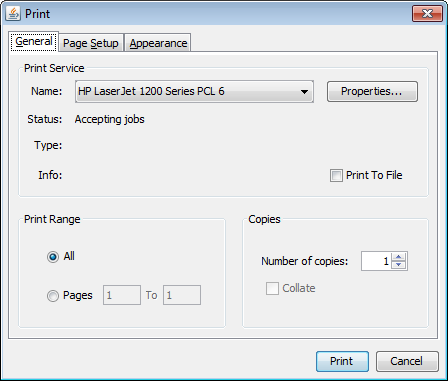
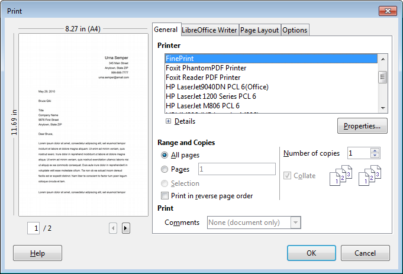
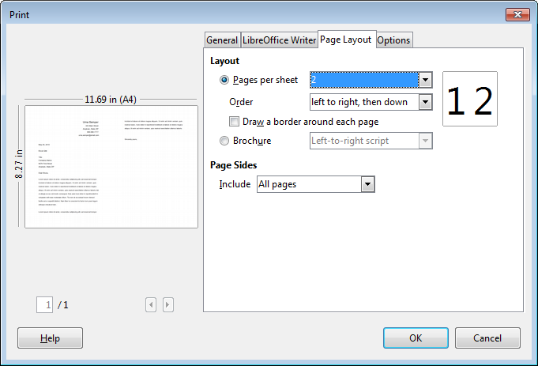
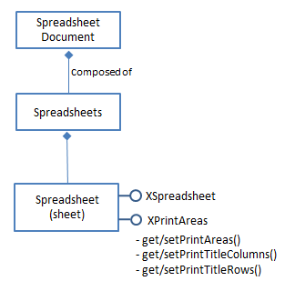
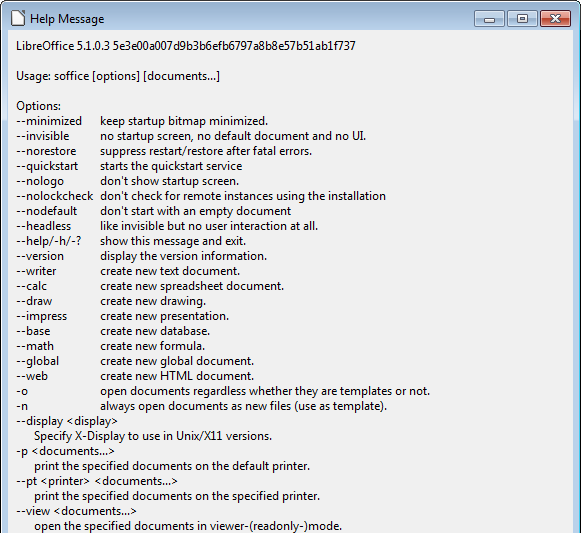

# Chapter 41. Printing

!!! note "Topics"
    The Java Print
    Service (JPS); Printing
    in Office Writer,
    Impress, Calc; Viewing
    a Document's Print
    Properties; Specialized
    Printing: Writer,
    Impress, Calc; Hacking
    the GUI; Command
    Prompt Printing

    Example folders:
    "Printing Tests" and
    "Utils"


Java's Print Service (JPS) and Office's printing APIs
nicely compliment each other. For example, since Java 1.4
(February 2002), JPS has included printer discovery based
on document types and printer attributes. but Office's API
lacks such capabilities. JPS cannot easily print much
beyond text and images; binary data can be sent to a
printer, but it's left to the device to interpret and render it,
which is only possible in high-end printers, not ordinary
inkjets and laser printers. In contrast, Office can print a
very wide range of document formats, including ODF,
Microsoft, and PDF files.

This chapter starts by describing JPS's PrintService, which I'll use later to select a
printer for the Office API. Then there's an overview of the printing capabilities of the
Office API, with examples of how to print Writer, Impress, and Calc files.

The bad news is that Office's printing API has a few bugs and missing features. By
'missing' I mean parts of Office's printing GUI with no equivalents in the API. Also,
buggy features in the API, such as the printing of multiple pages/sheet and slide
handouts, work flawlessly in the GUI.

I'll finish with a short discussion of command line printing in Windows. The OS has
several print utilities that are a little hard to find and use. Also, Office can be started
from the command line in order to print documents.


## 1.  The Java Print Service (JPS)

Java 1.4 saw the introduction of the Java Print service (JPS) API which allows a
printer to be selected based on document types and attributes such as color output,
paper sizes, and double-sided printing.

JPS printing passes through four stages:

1.  Selection of a print service (i.e. a printer or print driver), represented by a
PrintService instance. The programmer can supply document types and printer
attributes to limit the search.
2.  Creation of a Doc object for the document that's to be printed.
3.  Creation of a print job combining the Doc object and print request attributes. A
listener can be attached to monitor what's happening during the printing.
4.  The printing is started, and performed asynchronously.

Document types are encoded as DocFlavor objects which contain data source details
(e.g. whether the document comes from an input stream or a URL), and a MIME type
(e.g. image/gif, application/pdf). A common misconception about DocFlavor is that it
means that Java can print that kind of document. A DocFlavor is used to check
whether a printer supports a document type, and the answer may be "no".

The following code locates print services that support GIF documents sent from a file:

```java
// stage 1: find print services for GIF files
DocFlavor gifFlavor = DocFlavor.INPUT_STREAM.GIF;
PrintService[] services =
       PrintServiceLookup.lookupPrintServices(gifFlavor, null);
```

The matching print services are returned in a PrintService[] array.

lookupPrintServices()'s second argument (which is null here) could be a set of print
request attributes (PRAs).

There are four kinds of print attributes. The first two are requests sent from a program
to the printer, which may be accepted or rejected:

* Print request attributes (PRA) ask for particular printing features, such as two-
sided output, or a paper size.
* Doc attributes (DA) supply information about a document, such as its page size,
use of color, or page ranges for printing.

The two other attributes types are used by the printer service to convey information
about the printer and job back to the program.

* Print service attributes (PSA) give information about the print service, such as the
printer's make and model or whether it is currently accepting jobs.
* Print job attributes (PJA) give information about the status of a particular print
job, such as whether it has successfully finished.

The following code fragment looks for printer services that can print on both sides of
A4 paper:

```java
// stage 1 example using attributes
AttributeSet attrs = new HashAttributeSet();
attrs.add(MediaSizeName.ISO_A4);
attrs.add(Sides.DUPLEX);
PrintService[] services =
         PrintServiceLookup.lookupPrintServices(null, attrs);
```

AttributeSet is an interface and HashAttributeSet an implementation which supports
the four kinds of attributes.

The easiest way to find out about particular attribute  is via the Attribute interface
documentation at
https://docs.oracle.com/javase/8/docs/api/index.html?java/util/jar/Attributes.html,
which lists the attribute subclasses, such as MediaSizeName and Sides used in the
example above.

The next fragment creates a Doc object for a GIF file, a stage 2 task in JPS printing:

```java
// stage 2 : create a Doc object for a GIF file
FileInputStream in = new FileInputStream(fileName);
Doc doc = new SimpleDoc(in, gifFlavor, null);
```

The third argument of the SimpleDoc constructor can be a set of document attributes
(DAs).

JPS stage 3 involves the creation of a print job, and perhaps a listener:

```java
// stage 3: print job creation
DocPrintJob job = service[0].createPrintJob();
job.addPrintJobListener(new PrintJobAdapter() {...} );
```

The listener will receive information about the print job's progress as print job
attributes (PJAs).

Stage 4 starts the printing:

```java
job.print(doc, null);
```

The second argument of print() can be a set of print request attributes (PRAs).


### 1.1.  Listing the Printers

The ListPrinters.java example in this section focuses on JPS stage 1. It prints short
details about all the available printers, fuller information about the default printer, and
a list of printer names. The main() function:

```java
// in ListPrinters.java
public static void main(String [] args)
{
  JPrint.listServices();         // short info
  // JPrint.listServices(true);  // full info, but slow to generate

  PrintService ps = PrintServiceLookup.lookupDefaultPrintService();
  System.out.println("Default printer \"" + ps.getName() + "\":");
  JPrint.listService(ps, true);  // full info on default printer

  String[] pNames = JPrint.getPrinterNames();
  System.out.println("Printer names (" + pNames.length + "):");
  for(String pName : pNames)
    System.out.println("  " + pName);
}  // end of main()
```

Most of the functionality is implemented by the JPrint.java utility class.

JPrint.listServices() on one of my test machines prints the following:

```
-------- Print services (16) ----------

1.  "Send To OneNote 2010"
  color-supported:supported
  printer-name:Send To OneNote 2010
  queued-job-count:0
  printer-is-accepting-jobs:accepting-jobs
  Supported doc types:  image/gif image/jpeg image/png
                        application/octet-stream

2.  "Ricoh Aficio MP 2000 PCL(Black Office Room)"
  color-supported:not-supported
  printer-name:Ricoh Aficio MP 2000 PCL(Black Office Room)
  queued-job-count:0
  printer-is-accepting-jobs:accepting-jobs
  Supported doc types:  image/gif image/jpeg image/png
                       application/octet-stream

  :
  :

16. "CutePDF Writer"
  color-supported:supported
  printer-name:CutePDF Writer
  queued-job-count:0
  printer-is-accepting-jobs:accepting-jobs
  Supported doc types:  image/gif image/jpeg image/png
           application/octet-stream application/postscript
```

The information for each printer consists of four attributes, including its name and the
MIME types that it can process. For example, the Ricoh Aficio MP 2000 printer can
deal with standard graphics formats and "application/octet-stream". This latter type
means that the printer will accept binary printer data, but doesn't mean that it can
correctly print it. For instance, it may be output as a mishmash of ASCII characters.

The service listing methods in JPrint.java:

```java
// in the JPrint class
public static void listServices(boolean showAll)
{ PrintService[] psa =
      PrintServiceLookup.lookupPrintServices(null, null);
  listServices(psa, showAll);
}


public static void listServices(PrintService[] psa,
                                         boolean showAll)
{ if (psa != null && psa.length > 0) {
    System.out.println("\n-------- Print services (" +
                           psa.length + ") ----------\n");
    for (int i = 0; i < psa.length; i++) {
      System.out.println((i+1) + ". \"" + psa[i].getName() + "\"");
      listService(psa[i], showAll);
    }
    System.out.println("------------------\n");
  }
  else
    System.out.println("No print services found");
}  // end of listServices()


public static void listService(PrintService ps, boolean showAll)
{
  // print basic attributes
  Attribute[] attrs = ps.getAttributes().toArray();
  for(Attribute attr : attrs)
    System.out.println("  " + attr.getName() + ":" + attr);

  // print the supported MIME types
  System.out.print("  Supported doc types: ");
  DocFlavor[] flavors = ps.getSupportedDocFlavors();
  for (int j = 0; j < flavors.length; j++) {
    // Filter out DocFlavors that have a representation class other
    // than java.io.InputStream.

    String repclass = flavors[j].getRepresentationClassName();
    if (!repclass.equals("java.io.InputStream")) // restrict to files
      continue;
    System.out.print(" " + flavors[j].getMimeType());
  }
  System.out.println();

  // print every printer attribute
  if (showAll) {
    System.out.println("  ----");
    ArrayList<NamedAttribute> attrList = getAttributes(ps);
    Collections.sort(attrList);
    for (NamedAttribute attr : attrList)
      printAttr(ps, attr.getAttribute());
  }
  System.out.println();
}  // end of listService()
```

The lookupPrintServices() call in listServices():

```java
PrintServiceLookup.lookupPrintServices(null, null)
```

has no DocFlavor or attribute arguments, so every printer service will be returned in
the array. listServices() iterates through each PrintService object, and prints its basic
attributes, the supported MIME types for files, and optionally a list of every printer
attribute.

The four attributes returned by PrintService.getAttributes() are the tip of a very large
iceberg. Java supports a multitude of attributes as seen if you look at the Java 8
Attribute documentation at
https://docs.oracle.com/javase/8/docs/api/javax/print/attribute/Attribute.html. Over 70
subclasses are listed, including PrinterName, Sides, and Chromacity. A taste of what
can be printed occurs when the default printer's details are listed:

```java
// in ListPrinters.java...
PrintService ps = PrintServiceLookup.lookupDefaultPrintService();
System.out.println("Default printer \"" + ps.getName() + "\":");
JPrint.listService(ps, true);  // full info
```

The default printer for my test machine is an old laser printer. ListPrinter.java reports
the following:

```
Default printer "HP LaserJet 1200 Series PCL 6":
  color-supported:not-supported
  printer-name:HP LaserJet 1200 Series PCL 6
  queued-job-count:0
  printer-is-accepting-jobs:accepting-jobs
  Supported doc types:  image/gif image/jpeg image/png
application/octet-stream
  ----
  chromaticity: color
  copies-supported: null
  ipp-attribute-fidelity: false
  job-name: Java Printing
  media: iso-a4
  media-printable-area: (4.233,4.233)->(197.951,288.459)mm
  orientation-requested: portrait
  page-ranges: 1-2147483647
  printer-resolution: 60000x60000 dphi
  requesting-user-name: Ad
  sheet-collate: uncollated
  sides: one-sided
  spool-data-destination:
file:/C:/Users/Ad/Desktop/LibreOffice%20Tests/Printing%20Tests/o
ut.prn
  sun-alternate-media: null
```

The "chromacity" attribute states how color and monochrome documents are mapped
to each other. Probably the attribute the user really wants to examne is "color-
supported" which shows that this printer only offers grayscales.

The main drawback of printing all these attributes is the time required to collect them,
sort them, and remove duplicates; each printer may take several seconds to process.


### 1.2.  Discovering Print Services

PrintServiceLookup.lookupPrintServices() should be called with DocFlavor and/or
print request attributes to narrow down the search. Some examples can be found in
Discovery.java. For instance, the following fragment looks for printers that can
process JPEG files:

```java
// in Discovery.java...
DocFlavor flavor = DocFlavor.INPUT_STREAM.JPEG;
PrintService[] psa =
         PrintServiceLookup.lookupPrintServices(flavor, null);

System.out.println("\nServices that support " + flavor);
String[] pNames = JPrint.getPrinterNames(psa);
if (pNames != null)
  for (String pName : pNames)
    System.out.println("  " + pName);
```

It's very likely that the printers listed by this search can also output PDF, Word,
PowerPoint and other file formats printable from Office, since Office delivers pages
to a printer rendered as images.

However, if a search is made for printers that can process PDF files:

```java
DocFlavor flavor = DocFlavor.INPUT_STREAM.PDF;
PrintService[] psa =
         PrintServiceLookup.lookupPrintServices(flavor, null);
```

then no matches are found. This means that none of the printers can process PDF by
themselves.

JPrint.findPrinterNames() lets printers be selected based on partial names. The
following call collects all the printers whose names include "HP":

```
String[] pNames = JPrint.findPrinterNames("HP");
```

Multiple attributes can be used in a search. The following looks for all the "HP"
printer services that support color:

```java
// in Discovery.java...
AttributeSet attrs = new HashAttributeSet();
System.out.println("\nHP Services that support color:");
PrintService[] psa;

for (String pName : pNames) {   // from the "HP" search above
  attrs.clear();
  attrs.add(new PrinterName(pName, null));   // must be included
  attrs.add(ColorSupported.SUPPORTED);
  psa = PrintServiceLookup.lookupPrintServices(null, attrs);
  if (psa.length > 0)
    System.out.println("  " + pName);
}
```

It's possible to look for color printers with less code:

```java
// in Discovery.java...
AttributeSet attrs = new HashAttributeSet();
attrs.add(ColorSupported.SUPPORTED);
PrintService[] psa =
    PrintServiceLookup.lookupPrintServices(null, attrs);
```

Unfortunately the returned print services include non-color printers. It seems that the
printer name must be part of the attribute set to get a correct match.

DocFlavors and attributes can be combined, as in the following that looks for a printer
that supports JPEG and A4 paper:

```java
// in Discovery.java...
DocFlavor flavor = DocFlavor.INPUT_STREAM.JPEG;
AttributeSet attrs = new HashAttributeSet();
attrs.add(MediaSizeName.ISO_A4);
PrintService[] psa =
    PrintServiceLookup.lookupPrintServices(flavor, attrs);
```

A quite different printer selection approach is to display a dialog box at run time to let
the user set the search criteria. Java offers ServiceUI.printDialog() for this, which I've
wrapped inside JPrint.dialogSelect():

```java
// in the JPrint class
public static PrintService dialogSelect()
{
  GUI.setLookFeel();
  PrintService psa[] =
              PrintServiceLookup.lookupPrintServices(null, null);
  PrintService defaultService =
              PrintServiceLookup.lookupDefaultPrintService();
  PrintRequestAttributeSet attrs =
              new HashPrintRequestAttributeSet();  // none

  PrintService service = ServiceUI.printDialog(null, 100, 100,
                               psa, defaultService, null, attrs);
  if (service == null)
    System.out.println("No print service selected");
  return service;
}  // end of dialogSelect()
```

dialogSelect() initializes ServiceUI.printDialog() with a list of printer services, the
default printer, and an empty print request attribute set.

In Discovery.java, JPrint.dialogSelect() is called like so:

```java
// in Discovery.java...
PrintService ps = JPrint.dialogSelect();
if (ps != null) {
  System.out.println("\nYou selected " + ps.getName());
  JPrint.listService(ps, true);  // full info
}
```

The dialog looks like Figure 1.




Figure 1. The ServiceUI.printDialog() Dialog.


Pressing the "Print" button returns a PrintService reference; pressing "Cancel" returns
null.


### 1.3.  Printing Using Java

After a print service has been selected, JPS stages 2-4 involve instantiating a Doc
object, creating a print job, and starting the printing. These are managed by my
JPrint.printFile():

```java
// in the JPrint class
public static void printFile(PrintService ps, String fnm)
{
  if (ps == null) {
    System.out.println("Print service is null");
    return;
  }

  DocPrintJob printJob = ps.createPrintJob();   // stage 2
  try {
    InputStream is = new FileInputStream(fnm);
    DocFlavor flavor = getFlavor(ps, fnm);
    Doc doc = new SimpleDoc(is, flavor, null);  // stage 3
    printJob.print(doc, null);                  // stage 4
    is.close();
  }
  catch(Exception e) {
    System.out.println("Unable to print " + fnm);
    System.out.println(e);
  }
}  // end of printFile()
```

The user supplies a PrintService and a filename. A DocFlavor for the file is obtained
by JPrint.getFlavor():

```java
// in the JPrint class
public static DocFlavor getFlavor(PrintService ps, String fnm)
{
   DocFlavor flavor = getFlavorFromFnm(fnm);
   System.out.println("File-based DocFlavor: " + flavor);
   if (!ps.isDocFlavorSupported(flavor)) {
     System.out.println("Not supported by printer;
                                      using autosense");
     flavor = DocFlavor.INPUT_STREAM.AUTOSENSE;
   }
   return flavor;
}  // end of getFlavor()


public static DocFlavor getFlavorFromFnm(String fnm)
{
  String ext = fnm.substring(fnm.lastIndexOf('.') + 1).

                                      toLowerCase();
  if (ext.equals("gif"))
    return DocFlavor.INPUT_STREAM.GIF;
  else if (ext.equals("jpeg"))
    return DocFlavor.INPUT_STREAM.JPEG;
  else if (ext.equals("jpg"))
    return DocFlavor.INPUT_STREAM.JPEG;
  else if (ext.equals("png"))
    return DocFlavor.INPUT_STREAM.PNG;
  else if (ext.equals("ps"))
    return DocFlavor.INPUT_STREAM.POSTSCRIPT;
  else if (ext.equals("pdf"))
    return DocFlavor.INPUT_STREAM.PDF;
  else if (ext.equals("txt"))
    return DocFlavor.INPUT_STREAM.TEXT_PLAIN_HOST;
  else     // try to determine flavor from file content
    return DocFlavor.INPUT_STREAM.AUTOSENSE;
}  // end of getFlavorFromFnm
```

getFlavorFromFnm() uses the file's extension to choose a
DocFlavor.INPUT_STREAM constant, which is checked by the print service in
PrintService.isDocFlavorSupported().

JPrint.printFile() is utilized in my JDocPrinter.java example:

```java
// in JDocPrinter.java
public static void main(String[] args)
{
  if ((args.length < 1) || (args.length > 2)) {
    System.out.println("Usage: java JDocPrinter <filename>
                   [<(partial)printer-name>]");
    return;
  }

  String fnm = args[0];
  String pName = null;
  if (args.length == 2) {
    String[] pNames = JPrint.findPrinterNames(args[1]);
    if (pNames != null) {
      System.out.println("Using first match: \"" + pNames[0] + "\"");
      pName = pNames[0];
    }
  }
  if (pName != null)
    JPrint.print(pName, fnm);
  else {
    PrintService ps = JPrint.dialogSelect();
    if (ps != null)
      // JPrint.printMonitorFile(ps, fnm);
      JPrint.printFile(ps, fnm);
  }
}  // end of main()
```

JPrint.printMonitorFile() is fancier version of JPrint.printFile() which attaches a
PrintJobListener to the print job. The listener's methods are triggered as the job passes
through its printing states such as its delivery to the printer, completion, cancellation,
or printing error.

The lines in JPrint.printMonitorFile() that add the listener to the print job are:

```java
// in JPrint.printMonitorFile()...
DocPrintJob printJob = ps.createPrintJob();
printJob.addPrintJobListener(new PJWatcher());
```

PJWatcher implements the PrintJobListener interface:

```java
// in the JPrint class
private static class PJWatcher implements PrintJobListener
{
  public void printDataTransferCompleted(PrintJobEvent pje)
  {  System.out.println(" >> Data transferred to printer"); }

  public void printJobCanceled(PrintJobEvent pje)
  {  System.out.println(" >> Print job was cancelled");  }

  public void printJobCompleted(PrintJobEvent pje)
  {  System.out.println(" >> Print job completed successfully");  }

  public void printJobFailed(PrintJobEvent pje)
  {  System.out.println(" >> Print job failed");  }

  public void printJobNoMoreEvents(PrintJobEvent pje)
  {  System.out.println(" >> No more events will be delivered");  }

  public void printJobRequiresAttention(PrintJobEvent pje)
  {  System.out.println(" >> Print job needs attention"); }

}  // end of PJWatcher class
```

### 1.4.  More Information on javax.print

Good sources of information on Java printing include the tutorial at
https://docs.oracle.com/javase/tutorial/2d/printing/ which covers JPS and the older
Java 2D printing API, and the JPS API user guide at
https://docs.oracle.com/javase/8/docs/technotes/guides/jps/spec/JPSTOC.fm.html.

Two books I've found useful:

* Core Java, Volume II -- Advanced Features
Cay S. Horstmann; Gary Cornell
Prentice Hall, 2016, 10th ed.

https://horstmann.com/corejava.html
Chapter 7 includes a section on printing, including a table of attributes.

* Pro Java 8 Programming
Terrill Brett Spell
Apress, 2015, 3rd ed.

https://apress.com/9781484206423/
Chapter 11 is about printing.


## 2.  Printing in Office

In this section I'll employ the print service search methods in JPrint.java to find a
printer for Office. The service name is passed to functions that use the Office API to
send a document to the printer.

Only a handful of Office methods are required to print a document; the real
complexity of the API is the multitude of properties which configure how the
document is output. Not surprisingly, these properties are spread across many
modules since different document types (i.e. Writer, Draw, Impress, and Calc) are
managed by different parts of the API.

Figure 2 shows the OfficeDocument services and their print-related interfaces. The
words in brackets are the modules where the services are located. The rounded
rectangles refer to print property tables explained later in this chapter.


Figure 2. The OfficeDocument Interface and its Print-related Interfaces.


The XPrintable interface is used when printing Writer, Draw, Impress, or Calc
documents since their services all inherit OfficeDocument. Writer documents can also
employ XPagePrintable for printing. Note that it isn't possible to print databases using
XPrintable.

OfficeDocument also has XPrintJobBroadcaster and XPrintableBroadcaster interfaces
for attaching listeners to a print job. However, XPrintableBroadcaster is no longer
supported, having been superseded by XPrintJobBroadcaster .

The tricky aspects of XPrintable, XPrintJobBroadcaster, and XPagePrintable are the
properties used to configure how they work. XPrintable.getPrinter() and
XPrintable.setPrinter() utilize PrintDescriptor properties, the XPrintJobListener
created by XPrintJobBroadcaster uses PrintableState properties, XPrintable.print()
uses PrintOptions, and XPagePrintable employs PagePrintSettings. I'll be explaining
all of these in due course, with the aid of the tables referred to in Figure 2.

We're not finished with properties yet. There's also several "XXXSettings" services
which configure printing properties within a document. These are summarized by
Figure 3.


Figure 3. The Setting Services.


The rounded rectangles refer to property tables described later in this chapter.


## 3.  Printing any Document

At this point you may be thinking that Office printing is rather complex. In fact, if
you're happy to print a document using the default printing settings then it's fairly
simple. The DocPrinter.java example illustrates this by printing any Office document
supplied on its command line to the default printer or to the one named in the second
command line argument. The complete code:

```java
// in DocPrinter.java
public static void main(String args[])
{
  if ((args.length < 1) || (args.length > 3)) {
    System.out.println("Usage: DocPrinter fnm
                        [printer-name [no-of-pages]]");
    return;
  }

  String fnm = args[0];
  String pName = JPrint.getDefaultPrinterName();  // default

  if (args.length > 1) {   // 2 or 3 args
    String[] printerNames = JPrint.findPrinterNames(args[1]);
    if (printerNames == null)
      System.out.println("Using default printer: \"" +
                                            pName + "\"");
    else {
      pName = printerNames[0];
      System.out.println("Using first matching printer: \"" +
                                              pName + "\"");
    }
  }

  String pagesStr = "1-";   // default is print all pages
  if (args.length == 3)
    pagesStr = args[2];

  XComponentLoader loader = Lo.loadOffice();
  XComponent doc = Lo.openDoc(fnm, loader);
  if (doc == null) {
    System.out.println("Could not open " + fnm);
    Lo.closeOffice();
    return;
  }
  int docType = Info.reportDocType(doc);

  XPrintable xp = Lo.qi(XPrintable.class, doc);
  if (xp == null)
    System.out.println("Cannot print; XPrintable is null");
  else if (!Print.isPrintable(docType))
    System.out.println("Cannot print that document type");
  else {
    Print.usePrinter(xp, pName);
    Print.reportPrinterProps(xp);
    Print.print(xp, pagesStr);
  }
  Lo.closeDoc(doc);
  Lo.closeOffice();
}  // end of main()
```

An optional third command line argument is a page range, given in string form. For
instance, "2-4;6" will print pages 2 to 4 and 6 (with the page numbering starting at 1).

The printer name is obtained using methods from my JPrint.java class. The Office
API takes over after the document has been loaded, and utilizes support functions in
my Print.java class (note: no "J" in the name).

The document type is printed and returned by Info.reportDocType() as one of:
Lo.UNKNOWN, Lo.WRITER, Lo.BASE, Lo.CALC, Lo.DRAW, Lo.IMPRESS, or
Lo.MATH.

The loaded document is cast to XPrintable (see Figure 1), and Print.isPrintable() tests
for those document types that can be printed using XPrintable.print():

```java
// in the Print class
public static boolean isPrintable(int docType)
{ return ((docType == Lo.WRITER) || (docType == Lo.CALC) ||
          (docType == Lo.DRAW) || (docType == Lo.IMPRESS));  }

Print.usePrinter() adds the printer's name and paper format to the XPrintable
properties by calling XPrintable.setPrinter() with an array of PrintDescriptor
properties (see Figure 1):

// in the Print.java class
public static void usePrinter(XPrintable xp, String printer)
{
  if (xp == null) {
    System.out.println("Cannot set printer XPrintable is null");
    return;
  }
  System.out.println("Using printer \"" + printer + "\"");
  xp.setPrinter( Props.makeProps("Name", printer,
                                 "PaperFormat", PaperFormat.A4) );
  setListener(xp);
}
```

Table 1 lists the PrintDescriptor properties, or use my lodoc.bat script to access the
class' documentation online (type `lodoc PrinterDescriptor`).


|Property              |Description                            |
|----------------------|---------------------------------------|
|Name                  |Name of the printer.                   |
|PaperOrientation      |Paper orientation                      |
|                      |(com.sun.star.view.PaperOrientation:   |
|                      |PORTRAIT, LANDSCAPE)                   |
|PaperFormat           |Paper size formats                     |
|                      |(com.sun.star.view.PaperFormat: A3, A4,|
|                      |A5, B4, B5, LETTER, LEGAL,             |
|                      |TABLOID, USER)                         |
|PaperSize             |Paper size in 100th mm                 |
|                      |(com.sun.star.awt.Size).               |
|IsBusy                |Is the printer busy?                   |
|CanSetPaperOrientation|Can the paper orientation be set?      |
|CanSetPaperFormat     |Are other paper formats supported?     |
|CanSetPaperSize       |Are other paper sizes supported?       |

Table 1. Properties in com.sun.star.view.PrinterDescriptor.


Print.setListener() inside Print.usePrinter() attaches an XPrintJobListener listener to
the print job by casting XPrintable to XPrintJobBroadcaster (see Figure 1).


```java
// in the Print class
public static void setListener(XPrintable xp)
{
  if (xp == null) {
    System.out.println("Cannot set listener; XPrintable is null");
    return;
  }

  XPrintJobBroadcaster pb = Lo.qi(XPrintJobBroadcaster.class, xp);
  if (pb == null) {
    System.out.println("Cannot obtain print job broadcaster");
    return;
  }

  pb.addPrintJobListener( new XPrintJobListener()
  {
     public void printJobEvent(PrintJobEvent e)
     { System.out.println("Print Job status: " +
                              printableState(e.State));  }

     public void disposing(com.sun.star.lang.EventObject e)
     {  System.out.println("Disposing of print job: " + e);  }
  });
}  // end of setListener()
```

XPrintJobListener.printJobEvent() is called at different stages during the job's
execution, and Print.printableState() converts the retrieved PrintableState constant
into a more readable string:

```java
// in the Print class
public static String printableState(PrintableState val)
{
 if (val == PrintableState.JOB_STARTED )
   return "JOB_STARTED";
 else if (val == PrintableState.JOB_COMPLETED )
   return "JOB_COMPLETED";
 else if (val == PrintableState.JOB_SPOOLED )
   return "JOB_SPOOLED";
 else if (val == PrintableState.JOB_ABORTED )
   return "JOB_ABORTED";
 else if (val == PrintableState.JOB_FAILED )
   return "JOB_FAILED";
 else if (val == PrintableState.JOB_SPOOLING_FAILED )
   return "JOB_SPOOLING_FAILED";
 else {
   System.out.println("Unknown printable state");
   return "??";
 }
}  // end of printableState()
```

The PrintableState constants are summarized in Table 2.


|Enumerator Constant|Description                              |
|-------------------|-----------------------------------------|
|JOB_STARTED        |Printing/rendering has begun.            |
|JOB_COMPLETED      |Printing/rendering has finished; spooling|
|                   |has begun.                               |
|JOB_SPOOLED        |Spooling has finished successfully. This |
|                   |is the "success" state for a print job.  |
|JOB_ABORTED        |Printing was aborted (e.g., by the user) |
|                   |during printing or spooling.             |
|JOB_FAILED         |The printing ran into an error.          |
|JOB_SPOOLING_FAILED|The document could be printed but not    |
|                   |spooled.                                 |

Table 2. Properties in com.sun.star.view.PrintableState enum.


Back in the main() function of DocPrinter.java, Print.reportPrinterProps() outputs the
printer's PrintDescriptor settings (listed in Table 1). It loops through the properties
array returned by XPrintable.getPrinter():

```java
// in the Print class
public static void reportPrinterProps(XPrintable xp)
{
  if (xp == null) {
    System.out.println("Cannot report printer props");
    return;
  }

  PropertyValue[] printProps = xp.getPrinter();
  if (printProps == null)
    System.out.println("No Printer properties found");
  else {
    System.out.println("Printer properties:");
    String name;
    for (PropertyValue prop : printProps) {
      name = prop.Name;
      if (name.equals("PaperOrientation"))
        System.out.println("  " + name + ": " +
               paperOrientation((PaperOrientation)prop.Value));
      else if (name.equals("PaperFormat"))
        System.out.println("  " + name + ": " +
                       paperFormat((PaperFormat)prop.Value));
      else if (name.equals("PaperSize")) {
        Size sz = (Size)prop.Value;
        System.out.println("  " + name + ": (" +
                            sz.Width + ", " + sz.Height + ")");
      }
      else
        System.out.println("  " + name + ": " + prop.Value);
    }
    System.out.println();
  }
}  // end of reportPrinterProps()
```

The constants in the PaperOrientation and PaperFormat classes are mapped to more
easily understood strings.

Typical output from Print.reportPrinterProps() is:

```
Printer properties:
  Name: FinePrint
  PaperOrientation: PORTRAIT
  PaperFormat: A4
  PaperSize: (11906, 16838)
  IsBusy: false
  CanSetPaperOrientation: true
  CanSetPaperFormat: true
  CanSetPaperSize: true
```

At last it's time to print the document. As Figure 1 indicates, the call to
XPrintable.print() is configured using PrintOptions properties, which are listed in
Table 3.


|Property   |Description                                 |
|-----------|--------------------------------------------|
|CopyCount  |Number of copies to print.                  |
|FileName   |Send the output to a file rather than to the|
|           |printer.                                    |
|Collate    |Collate the printed pages (set to true or   |
|           |false).                                     |
|Sort       |Sort the pages (deprecated; use Collate)    |
|Pages      |A string that specifies pages and page      |
|           |ranges to print.  For example, "1-4;10" to  |
|           |print the pages 1 to 4 and 10.              |
|Wait       |Wait for the print request to be            |
|           |completed.                                  |
|DuplexMode |Set duplex constant (using                  |
|           |com.sun.star.view.DuplexMode)               |
|PrinterName|The name of the printer.                    |

Table 3. Properties in com.sun.star.view.PrintOptions.


The configuration and printing is carried out by Print.print():

```java
// in the Print class
public static void print(XPrintable xp)
{  print(xp, "1-");  }   // print all the pages


public static void print(XPrintable xp, String pagesStr)
{
  if (xp == null) {
    System.out.println("Cannot print; XPrintable is null");
    return;
  }
  System.out.println("Print range: " + pagesStr);
  System.out.println("Sending document...");

  PropertyValue[] props =
           Props.makeProps("Pages", pagesStr, "Wait", true);
                                          // synchronous
                 // see com.sun.star.view.PrintOptions
  xp.print(props);    // print the document
  System.out.println("Delivered");
}  // end of print()
```

Two properties are set: "Pages" and "Wait". "Pages" could be left out if all of the
document is to printed, but "Wait" is necessary; it forces the print() call to wait until
the job has been delivered to the driver, and so has left the Office process. If "Wait"
wasn't included then DocPrinter could continue and perhaps close Office before it had
fully transmitted the document to the printer. This would cause a crash.

Note that there's no need to set the "PrinterName" property since its already been
supplied as one of the PrintDescriptor properties.


## 4.  Viewing a Document's Print Properties

The previous section looked at printer-related properties stored in PrinterDescriptor
(Table 1) and PrintOptions (Table 2). But the real property mother lode are those
related to documents, which are stored in the many subclasses below the Settings
service (see Figure 3). The ShowPrintProps.java example prints out those properties
for a given input document. The relevant lines are:

```java
// in ShowPrintProps.java...
int docType = Info.reportDocType(doc);
XProperty Set docProps = Print.getDocSettings(docType);

Props.showProps("Document Settings", docProps);
```

The document type returned by Info.reportDocType() is employed by
Print.getDocSettings() to decide which of the subclasses of the Settings service (once
again, see Figure 3) should be instantiated:

```java
// in the Print class
public static XPropertySet getDocSettings(int docType)
{
  XPropertySet props = null;
  if (docType == Lo.WRITER)
    props = Lo.createInstanceMSF(XPropertySet.class,
                  "com.sun.star.text.DocumentSettings");
  else if (docType == Lo.IMPRESS)
    props = Lo.createInstanceMSF(XPropertySet.class,
                  "com.sun.star.presentation.DocumentSettings");
  else if (docType == Lo.DRAW)
    props = Lo.createInstanceMSF(XPropertySet.class,
                  "com.sun.star.drawing.DocumentSettings");
  else if (docType == Lo.CALC)
    props = Lo.createInstanceMSF(XPropertySet.class,
                  "com.sun.star.sheet.DocumentSettings");
  else if (docType == Lo.BASE)
    System.out.println("No document settings for a base doc");
  else if (docType == Lo.MATH)
    System.out.println("No document settings for a math doc");
  else
    System.out.println("Unknown document type");

  return props;
}  // end of getDocSettings()
```

All these setting services support XPropertySet, which is returned as
Print.getDocSettings()'s result.

The printing-related properties defined in the Settings superclass are listed in Table 4,
but it contains  many more properties for different aspects of a document. For a full
list, use `lodoc Settings document` to look at the online documentation. The Settings
webpage is also a good starting point for examining its DocumentSettings subclasses.


|Property                |Description                              |
|------------------------|-----------------------------------------|
|PrinterName             |Printer used by the document.            |
|PrinterSetup            |A byte array containing driver-specific  |
|                        |data.                                    |
|IsPrintBooklet          |Put two document pages on one physical   |
|                        |page, such that you can fold the output  |
|                        |into a booklet.                          |
|IsPrintBookletFront     |Only print the fronts of a booklet       |
|IsPrintBookletBack      |Only print the backs of a booklet        |
|PrintQuality            |Normal (0); Grayscale (1), Black and     |
|                        |white (2).                               |
|PrinterIndependentLayout|Forbid use of printer metrics for layout.|
|EmbedFonts              |Whether to embed fonts used by the       |
|                        |document.                                |
|EmbedSystemFonts        |Whether to embed system fonts used by    |
|                        |the document.                            |

Table 4. Printing-related Properties in com.sun.star.document.Settings.


Writer documents utilize the DocumentSettings service in the text module which
doesn't contain any printing properties, but is far from empty. Again, use
`lodoc DocumentSettings text` to visit its documentation in the text module. Instead, the
print properties are inherited from the PrintSettings service in the text module, which
are listed in Table 5. Use `lodoc PrintSettings text` to visit its documentation.


|Property           |Description                                |
|-------------------|-------------------------------------------|
|PrintGraphics      |If true, print graphic objects.            |
|PrintTables        |If true, print text tables.                |
|PrintDrawings      |If true, print shapes.                     |
|PrintLeftPages     |If true, print left pages.                 |
|PrintRightPages    |If true, print right pages.                |
|PrintControls      |If true, then control shapes in the        |
|                   |document (usually inside forms) are        |
|                   |printed.                                   |
|PrintReversed      |If true, print the pages in reverse order, |
|                   |starting with the last page.               |
|PrintPaperFromSetup|If true, use the paper tray specified for  |
|                   |the system printer. If false, use the paper|
|                   |tray specified by the page style.          |
|PrintFaxName       |Name of the fax machine.                   |
|PrintAnnotationMode|Specify how notes are printed. Uses        |
|                   |com.sun.star.text.NotePrintMode: NOT,      |
|                   |ONLY, DOC_END, or PAGE_END).               |
|PrintProspect      |If true, prospect printing is used. Related|
|                   |to brochures (I think).                    |
|PrintPageBackground|Determines if the background color /       |
|                   |background graphic of pages is printed.    |
|PrintBlackFonts    |Determines if characters are printed in    |
|                   |black.                                     |
|PrintEmptyPages    |Determines if automatically inserted       |
|                   |empty pages are printed.                   |

Table 5. Properties in com.sun.star.text.PrintSettings.


Back in ShowPrintProps.java, the properties are printed with Props.showProps(). The
output is quite lengthy since every setting is printed, not just the printing-related ones
in my tables. Typical output when a Writer file is examined includes:

```
  :
PrintAnnotationMode == 0
PrintBlackFonts == false
PrintControls == true
PrintDrawings == true
PrintEmptyPages == false
PrintFaxName ==
PrintGraphics == true
PrintHiddenText == false
PrintLeftPages == true
PrintPageBackground == true
PrintPaperFromSetup == false
PrintProspect == false
PrintProspectRTL == false
PrintReversed == false
PrintRightPages == true
PrintSingleJobs == false
PrintTables == true
PrintTextPlaceholder == false
PrinterIndependentLayout == 3
PrinterName ==
PrinterSetup == [B@1222c14
PropLineSpacingShrinksFirstLine == true
ProtectForm == false
RedlineProtectionKey == [B@6d8acf
Rsid == 537223
  :
```

A Calc file uses the DocumentSettings service in the sheet module (use
`lodoc DocumentSettings sheet` to examine its documentation). However, printing-related
properties are stored elsewhere, in the GlobalSheetSettings and PageStyle services,
which need additional code to access them as I'll explain later.

An Impress file uses DocumentSettings in the presentation module (see
`lodoc DocumentSettings service presentation`); its printing-related properties are given in
Table 6.


|Property          |Description                                |
|------------------|-------------------------------------------|
|IsPrintDrawing    |Enables or disables the printing of the    |
|                  |drawing pages.                             |
|IsPrintNotes      |Enables or disables the printing of the    |
|                  |notes pages.                               |
|IsPrintHandout    |Enables or disables the printing of the    |
|                  |handout pages.                             |
|IsPrintOutline    |Enables or disables the printing of the    |
|                  |outline pages.                             |
|IsPrintHiddenPages|Enables or disables the printing of draw   |
|                  |pages that are marked as hidden.           |
|IsPrintFitPage    |Enables or disables the fitting of the page|
|                  |to the printable area during printing.     |
|IsPrintTilePage   |If this is true and the paper size for     |
|                  |printing is larger than the paper size of  |
|                  |the printer than the content is tiled over |
|                  |multiple pages.                            |

Table 6. Printing-related Properties in com.sun.star.presentation.DocumentSettings.

Draw documents are similar to presentations, and this is reflected in the
DocumentSettings service in the drawing module (see
`lodoc DocumentSettings service drawing`) which offers a subset of the slide
properties. The printing-related ones are listed in Table 7.


|Property       |Description                                |
|---------------|-------------------------------------------|
|IsPrintFitPage |Enables or disables the fitting of the page|
|               |to the printable area during printing.     |
|IsPrintTilePage|If this is true and the paper size for     |
|               |printing is larger than the paper size of  |
|               |the printer than the content is tiled over |
|               |multiple pages.                            |

Table 7. Printing-related Properties in com.sun.star.drawing.DocumentSettings.


The drawing and presentation DocumentSettings services inherit the Settings service,
and a HeaderFooterSettings service in the documents folder (see
`lodoc HeaderFooterSettings`), which add the properties in Table 8.


|Property       |Description                            |
|---------------|---------------------------------------|
|IsPrintPageName|Enables or disables the printing of the|
|               |page name in the header or footer.     |
|IsPrintDate    |Enables or disables the printing of the|
|               |date in the header or footer.          |
|IsPrintTime    |Enables or disables the printing of the|
|               |current time in the header or footer.  |

Table 8. Properties in com.sun.star.document.HeaderFooterSettings.


### 4.1.  Additional Writer Print Properties

As Figure 2 indicates, Writer Documents have access to an XPagePrintable interface
offered by the GenericTextDocument service (see `lodoc XPagePrintable`). It has a
print method, XPagePrintable.printPages() which utilizes properties stored in the
PagePrintSettings service (see Table 9). These relate to the document's margins and
printing multiple pages on a single sheet.


|Property    |Description                     |
|------------|--------------------------------|
|PageRows    |Number of page rows on each     |
|            |printed page.                   |
|PageColumns |Number of page columns on each  |
|            |printed page.                   |
|LeftMargin  |Left margin of the printed page.|
|RightMargin |Right margin.                   |
|TopMargin   |Top margin.                     |
|BottomMargin|Bottom margin.                  |
|HoriMargin  |Margin between page rows.       |
|VertMargin  |Margin between page columns.    |
|IsLandscape |Print in landscape format?      |

Table 9. Properties in com.sun.star.text.PagePrintSettings.


These properties are printed by casting the document to XPagePrintable:

```java
// part of ShowPrintProps.java...
if (docType == Lo.WRITER) {
  XPagePrintable xpp = Lo.qi(XPagePrintable.class, doc);
  PropertyValue[] printProps = xpp.getPagePrintSettings();
  Props.showProps("Page print settings", printProps);
}
```

Typical output is:

```
Properties for "Page print settings":
  PageRows: 1
  PageColumns: 1
  LeftMargin: 0
  RightMargin: 0
  TopMargin: 0
  BottomMargin: 0
  HoriMargin: 0
  VertMargin: 0
  IsLandscape: false
```


### 4.2.  Additional Calc Print Properties

Figure 3 indicates that a Calc document has three sources of printing-related
properties: DocumentSettings in the sheet module, GlobalSheetSettings also in the
sheet module, and PageStyle in the style module.

In a break with usual Office conventions, the GlobalSheetService service (see
`lodoc GlobalSheetSettings`) doesn’t store the properties; instead they're maintained by its
XGlobalSheetSettings interface (see `lodoc XGlobalSheetSettings`). The printing-
related properties are listed in Table 10.


|Property         |Description                               |
|-----------------|------------------------------------------|
|PrintAllSheets   |Specifies whether all sheets or only      |
|                 |selected sheets are printed.              |
|PrintEmptyPages  |Specifies whether empty pages are         |
|                 |printed.                                  |
|UsePrinterMetrics|Specifies whether printer metrics are used|
|                 |for display.                              |

Table 10. Printing-related Properties in com.sun.star.sheet.XGlobalSheetSettings.


This organization of the documentation may be an error, since the
XGlobalSheetSettings properties are accessed in the usual way, by instantiating the
GlobalSheetSettings service, and casting it to XPropertySet:

```java
XPropertySet globalSheetProps =
      Lo.createInstanceMCF(XPropertySet.class,
             "com.sun.star.sheet.GlobalSheetSettings");

Props.showProps("Global Sheet Settings", globalSheetProps);
```

GlobalSheetSettings properties are applied to all sheets, so you may want to reset a
changed property to its original value after a print. There's an example of using global
sheet settings in PrintSheet.java later in this chapter.

Another source of spreadsheet properties is the PageStyle service. I explained page
styles in Chapter 22, so I refer you back there for the details. A page style is
associated with a sheet, and so it's necessary to first choose a sheet to examine, and
then access its "PageStyle" property:

```java
XSpreadsheetDocument ssDoc = Calc.getSSDoc(doc);
XSpreadsheet sheet = Calc.getSheet(ssDoc, 0);   // first sheet

String styleName = (String) Props.getProperty(sheet, "PageStyle");
System.out.println("\nPageStyle of first sheet: " + styleName);
```

The page style name is used to lookup the properties for that particular style:

```java
XPropertySet props = Info.getStyleProps(doc, "PageStyles",
                                                     styleName);
Props.showProps(styleName + " PageStyles", props);
```

Props.showProps() prints an extensive list of properties, drawn form several services
in the PageStyle hierarchy. A simplified version of that hierarchy is shown in Figure
4.


Figure 4. Part of the PageStyle Service Hierarchy.


I'm only interested in printing-related properties in this chapter. Some come from the
PageProperties service in the style module (see `lodoc PageProperties style`), as listed
in Table 11.


|Property             |Description                     |
|---------------------|--------------------------------|
|Lots of border props…|                                |
|Lots of margin props…|                                |
|IsLandscape          |Determines if the page format is|
|                     |landscape.                      |
|PrinterPaperTray     |Contains the name of a paper    |
|                     |tray of the selected printer.   |
|Lots of header props…|                                |
|Lots of footer props…|                                |
|Lots of grid props…  |                                |
|GridPrint            |Determines whether text grid    |
|                     |lines are printed.              |

Table 11. Printing-related Properties in com.sun.star.style.PageProperties.


Many more print properties come from TablePageStyle in the sheet module (see
`lodoc TablePageStyle`, which are given in Table 12.


|Property              |Description                                    |
|----------------------|-----------------------------------------------|
|PrintAnnotations      |Enables printing of cell annotations.          |
|PrintGrid             |Enables printing of the cell grid.             |
|PrintHeaders          |Enables printing of column and row             |
|                      |headers.                                       |
|PrintCharts           |Enables printing of charts.                    |
|PrintObjects          |Enables printing of embedded objects.          |
|PrintDrawing          |Enables printing of drawing objects.           |
|PrintFormulas         |Enables printing of formulas instead of their  |
|                      |results.                                       |
|PrintZeroValues       |Enables printing of zero-values.               |
|PrintDownFirst        |Specifies the print order for the pages within |
|                      |each sheet.                                    |
|PageScale             |Contains the scaling factor (in percent) for   |
|                      |printing the sheet.                            |
|ScaleToPages          |Contains the number of pages the sheet will    |
|                      |use for printing.                              |
|ScaleToPagesX         |Contains the number of horizontal pages the    |
|                      |sheet will be printed on.                      |
|ScaleToPagesY         |Contains the number of vertical pages the      |
|                      |sheet will be printed on.                      |
|LeftPageHeaderContent |Contains the content of the header for the     |
|                      |left pages                                     |
|                      |(com.sun.star.sheet.XHeaderFooterContent).     |
|RightPageHeaderContent|Contains the content of the header for the     |
|                      |right pages                                    |
|                      |(com.sun.star.sheet.XHeaderFooterContent).     |
|LeftPageFooterContent |Contains the content of the footer for the left|
|                      |pages                                          |
|                      |(com.sun.star.sheet.XHeaderFooterContent).     |
|RightPageFooterContent|Contains the content of the footer for the     |
|                      |right pages                                    |
|                      |(com.sun.star.sheet.XHeaderFooterContent).     |

Table 12. Printing-related Properties in com.sun.star.sheet.TablePageStyle.


## 5.  Specialized Printing

In this section I'll use some of the document properties just described to control how
Writer, Impress, and Calc documents are printed. The example code is in
TextPrinter.java, ImpressPrinter.java, SheetPrinter.java, and PrintSheet.java.

The sad news is that although TextPrinter.java and ImpressPrinter.java successfully
print their documents, the API ignores most of the changes to the properties. Perhaps
even sadder (from a programming perspective) is the fact that these same documents
are correctly printed if the properties are set via Office's GUI.

Aside from this, the print GUI in Office offers more functionality than the API. For
example, it's possible to output multiple slides and sheets on a single page through the
print dialog but not with API calls.


### 5.1.  Printing a Text Document

TextPrinter.java sends a text document to a specified printer, with two pages printed
on each sheet.

After the document has been loaded, the printing is carried out by:

```java
// part of TextPrinter.java...
XPrintable xp = Lo.qi(XPrintable.class, doc);
Print.usePrinter(xp, pName);

XPagePrintable xpp = Lo.qi(XPagePrintable.class, doc);
PropertyValue[] props = xpp.getPagePrintSettings();
Props.setProp(props, "IsLandscape", true);
Props.setProp(props, "PageColumns", (short)2);

xpp.setPagePrintSettings(props);
xpp.printPages(new PropertyValue[1]);    // empty array of props
```

To help understand what the code is doing, refer back to Figure 2. The document is
cast to XPrintable so the printer settings can be initialized by Print.usePrinter(). Then
the document is cast to XPagePrintable so its PagePrintSettings properties can be
configured. That's done via XPagePrintable.setPagePrintSettings() and finally
XPagePrintable.printPages() is called with an empty array.

The document is printed but unfortunately the two pages/sheet and landscape settings
are ignored.

This bug has been known for many years, and some people have suggested an
alternative implementation where the properties are passed to
XPagePrintable.printPages() rather than to XPagePrintable.setPagePrintSettings().

The last two lines from above would be replaced by:

```java
xpp.printPages(props);
```

Unfortunately this produces the same output in my tests.

If the Writer document is printed through the Office GUI, then the print dialog looks
something like Figure 5.




Figure 5. The Writer application's Print Dialog.


The pages/sheet settings are on the "Page Layout" tab, as in Figure 6.




Figure 6. The "Page Layout" Tabbed Window in the Print Dialog.


When "Ok" is pressed, the document is printed correctly.


### 5.2.  Printing an Impress Document

ImpressPrinter.java prints an Impress document to the specified printer in handout
format, six slides per sheet, in black and white. A4 paper in landscape mode is
utilized.

After the document has been loaded, the printing is carried out by the following code:

```java
// part of ImpressPrinter.java...
// set document props
XPropertySet props = Lo.createInstanceMSF(XPropertySet.class,
                   "com.sun.star.presentation.DocumentSettings");
Props.setProperties(props,
  new String[] {"IsPrintHandout","SlidesPerHandout","IsPrintFitPage",
                "IsPrintDate", "PrintQuality", "PrinterName" },
  new Object[] { true, (short)6, true, true, 2, pName}   // 2 == B&W
);
Props.showProps("Document Settings", props);

// set printer props
XPrintable xp = Lo.qi(XPrintable.class, doc);
Print.usePrinter(xp, pName);
xp.setPrinter( Props.makeProps(
              "PaperOrientation", PaperOrientation.LANDSCAPE,
              "PaperFormat", PaperFormat.A4) );
Print.reportPrinterProps(xp);

Print.print(xp);
```

To help understand what the code is doing, refer back to Figure 2. A presentation
DocumentSettings service is created, and its printing properties set. The
"PrintQuality" and "PrinterName" properties are from the Settings service (see Table
4), "IsPrintHandout" and "IsPrintFitPage" are from DocumentSettings (see table 6),
and "IsPrintDate" from HeaderFooterSettings (see Table 8). This leaves the
"SlidesPerHandout" property, which isn't documented anywhere. I discovered it by
looking at the print-out of that service's properties with:

```java
Props.showProps("Document Settings", props);
```

The printer properties are set as in earlier examples, but with the addition of
"PaperOrientation" and "PaperFormat" which are PrintDescriptor properties (see table
1).

The document is printed but as one color slide per sheet; the handout and black and
white settings are ignored.

If the same Impress document is printed through the Office GUI, then the print dialog
looks like Figure 7.


Figure 7. The Impress application's Print Dialog.


This is much closer to what I want to output, although I couldn't print the handouts in
landscape mode.


### 5.3.  Printing a Calc Document

SheetPrinter.java prints the first sheet of a Calc document, scaled so that two pages
are used in the vertical direction. Also, the paper is set to landscape mode and A4
size, and the header's central field is modified. In addition, commented-out code
restricts the printed area of the sheet to be a single column.

The good news is that all of these setting are correctly processed at print-time.

After the document has been loaded, the printing is carried out by:

```java
// part of SheetPrinter.java...

XSpreadsheet sheet = Calc.getSheet(doc, 0);  // first sheet
String styleName = (String) Props.getProperty(sheet, "PageStyle");

// get the properties set for the sheet's page style
XPropertySet props =
              Info.getStyleProps(doc, "PageStyles", styleName);
Props.setProperty(props, "ScaleToPagesY", (short)2);
                 // use a max of 2 pages on the y-axis
Props.showProps(styleName, props);

showTotalsHeader(props);

/*
  // print only the "E" column
  XPrintAreas printAreas = Lo.qi(XPrintAreas.class, sheet);
  printAreas.setPrintAreas(new CellRangeAddress[] {});
                 // reset print areas

  CellRangeAddress addr = Calc.getAddress(sheet, "E1:E111");
  printAreas.setPrintAreas(new CellRangeAddress[]{ addr });
                 // set area
*/

// set printer settings
XPrintable xp = Lo.qi(XPrintable.class, doc);
Print.usePrinter(xp, pName);
PropertyValue[] printProps =
    Props.makeProps("PaperOrientation", PaperOrientation.LANDSCAPE,
                    "PageFormat", PaperFormat.A4);
xp.setPrinter(printProps);
Print.reportPrinterProps(xp);

Print.print(xp);
```

The scaling is done by accessing the sheet's page style properties, and setting the
"ScaleToPagesY" value. This is one of the TablePageStyle properties listed in Table
12.


#### Headers and Footers

The headers and footers are manipulated by showTotalsHeader():

```java
// in SheetPrinter.java
private static void showTotalsHeader(XPropertySet props)
// change the header of the sheet
{
  //  get the right-hand header and footer
  XHeaderFooterContent header =
            Calc.getHeadFoot(props, "RightPageHeaderContent");
  XHeaderFooterContent footer =
            Calc.getHeadFoot(props, "RightPageFooterContent");

  // print details about them
  Calc.printHeadFoot("Right Header", header);
  Calc.printHeadFoot("Right Footer", footer);

  // modify the header center text to be "Totals"
  Calc.setHeadFoot(header, Calc.HF_CENTER, "Totals");

  // turn on headers and make left and right page headers the same
  Props.setProperty(props, "HeaderIsOn", true);
  Props.setProperty(props, "HeaderIsShared", true);
                              // from style.PageProperties
  Props.setProperty(props, "RightPageHeaderContent", header);
  }  // end of showTotalsHeader()
```

A sheet may have two headers (one for the left hand page, one for the right) and two
footers, which are accessed as XHeaderFooterContent objects (see
`lodoc XHeaderFooterContent`). XHeaderFooterContent  is a collection of three XText
instances representing the left, center, and right of the content area.

The headers and footers are accessed via the sheet's page style properties, stored as
the properties "LeftPageHeaderContent", "RightPageHeaderContent",
"LeftPageFooterContent", and "RightPageFooterContent" in the TablePageStyle
service (see Table 12).

Calc.getHeadFoot() retrieves the page style properties, and returns the requested
XHeaderFooterContent:

```java
// in the Calc class
public static XHeaderFooterContent getHeadFoot(XPropertySet props,
                                               String content)
{  return Lo.qi( XHeaderFooterContent.class,
                            Props.getProperty(props, content));  }
```

Calc.printHeadFoot() prints the three text fields inside the XHeaderFooterContent
object:

```java
// in the Calc class
public static void printHeadFoot(String title,
                                 XHeaderFooterContent hfc)
{ XText left = hfc.getLeftText();
  XText center = hfc.getCenterText();
  XText right = hfc.getRightText();
  System.out.println(title + ": \"" + left.getString() + "\" : \"" +
                                center.getString() + "\" : \"" +
                                right.getString() + "\"");
}  // end of showHeadFoot()
```

Calc.setHeadFoot() can change the text in the left, center, or right of a
XHeaderFooterContent instance:

```java
// in the Calc class
public static void setHeadFoot(XHeaderFooterContent hfc,
                                     int region, String text)
{ XText xText = getRegion(hfc, region);
  if (xText == null) {
    System.out.println("Could not set text");
    return;
  }
  XTextCursor headerCursor = xText.createTextCursor();
  headerCursor.gotoStart(false);
  headerCursor.gotoEnd(true);
  headerCursor.setString(text);
}  // end of setHeadFoot()


public static XText getRegion(XHeaderFooterContent hfc, int region)
{
  if (hfc == null) {
    System.out.println("Header/footer content is null");
    return null;
  }
  if (region == HF_LEFT)
    return hfc.getLeftText();
  else if (region == HF_CENTER)
    return hfc.getCenterText();
  else if (region == HF_RIGHT)
    return hfc.getRightText();
  else {
    System.out.println("Unknown header/footer region");
    return null;
  }
}  // end of getRegion()
```

Back in SheetPrinter.java, showTotalsHeader() changes the central text field of the
right header to "Totals". It then switches on the display of headers, makes the left and
right headers the same, and inserts the modified XHeaderFooterContent instance back
into the page styles:

```java
// part of showTotalsHeader() in SheetPrinter.java...
Props.setProperty(props, "HeaderIsOn", true);
Props.setProperty(props, "HeaderIsShared", true);
                          // from style.PageProperties
Props.setProperty(props, "RightPageHeaderContent", header);
```

#### Print Areas

A sheet is usually manipulated via the XSpreadsheet interface in the Spreadsheet
service. However, Spreadsheet supports a number of other interfaces, including
XPrintAreas for specifying printable areas within a sheet. This interface is illustrated
in Figure 8.




Figure 8. The Spreadsheet XPrintAreas Interface.


Aside from defining printable areas, XPrintAreas also has methods for setting which
rows and/or columns are repeated if a sheet spans several pages.

The commented out code in SheetPrinter.java does two things: it cancels any existing
print areas, and specifies that only the "E" column will be printed:

```java
// part of SheetPrinter.java...
XPrintAreas printAreas = Lo.qi(XPrintAreas.class, sheet);
printAreas.setPrintAreas(new CellRangeAddress[] {});
                     // cancel print areas

CellRangeAddress addr = Calc.getAddress(sheet, "E1:E111");
printAreas.setPrintAreas(new CellRangeAddress[]{ addr });
                    // set area to be the "E" column
```


### 5.4.  Printing a Single Sheet

My thanks to user "villeroy" on the OpenOffice forums for suggesting this example:
how is a single sheet of a multi-sheet spreadsheet printed?

One part of the solution is to set the "PrintAllSheets" property to false in the
GlobalSheetSettings service (see Table 10). The other is to make the current sheet
explicitly active in the XSpreadsheetView interface, which is equivalent to bringing
the sheet to the foreground in the Calc application.

The PrintSheet.java example shows how to do this for a spreadsheet of three sheets,
where only "Sheet2" is printed:

```java
// in PrintSheet.java
public static void main(String args[])
{
  // hardwired spreadsheet and printer choice
  String fnm = "tables.ods";
  String pName = "FinePrint";

  // load the spreadsheet
  XComponentLoader loader = Lo.loadOffice();
  XComponent cDoc = Lo.openReadOnlyDoc(fnm, loader);
  XSpreadsheetDocument doc = Calc.getSSDoc(cDoc);
  if (doc == null) {
    System.out.println("Could not open " + fnm);
    Lo.closeOffice();
    return;
  }

  // what are the sheets called?
  String[] sheetNms = Calc.getSheetNames(doc);
  System.out.println("Names of sheets (" + sheetNms.length + "):");
  for(String sheetNm : sheetNms)
    System.out.println("  " + sheetNm);

  // make "Sheet2" active
  XSpreadsheet sheet = Calc.getSheet(doc, "Sheet2");
  Calc.setActiveSheet(doc, sheet);

  // set Global Sheet settings
  // changes are remembered
  XPropertySet gsProps =
              Lo.createInstanceMCF(XPropertySet.class,
                   "com.sun.star.sheet.GlobalSheetSettings");
  Props.setProperty(gsProps, "PrintAllSheets", false);
  System.out.println();
  Props.showProps("Global Sheet Settings", gsProps);

  // set printer settings
  XPrintable xp = Lo.qi(XPrintable.class, doc);
  Print.usePrinter(xp, pName);
  PropertyValue[] printProps =
      Props.makeProps("PaperOrientation", PaperOrientation.LANDSCAPE,
                      "PageFormat", PaperFormat.A4);
  xp.setPrinter(printProps);

  Print.print(xp);

  // reset global settings
  Props.setProperty(gsProps, "PrintAllSheets", true);

  Lo.closeDoc(doc);
  Lo.closeOffice();
}  // end of main()
```

One issue with changing GlobalSheet settings is that they are remembered after Office
has closed, and will be used by default during future prints. In that case, it's a good
idea to reset the "PrintAllSheets" to true after the Print.print() call.


## 6.  A Bad Idea: Hacking the GUI

A recurring observation of the last few sections is that printer dialogs inside Office are
less buggy and more feature-rich than the API. In previous chapters, I've sometimes
resorted to using Office's GUI by sending dispatch messages, and key presses to the
window. I decided not to follow that approach here since it's too unreliable.

Getting to the print dialog is straightforward. The document window is made visible,
and an ".uno:Print" dispatch opens the print dialog:

```
GUI.setVisible(doc, true);
Lo.delay(1000);   // give the Office window time to appear
Lo.dispatchCmd("Print");
Lo.delay(500);    // give the Print dialog time to appear
```

The first problem is that the print dialog uses tabbed windows, and the window that's
foremost can vary. Usually it's the "General" window (e.g. see Figure 5), but if the
user has previously clicked the "Ok" button in another tabbed window (such as the
"Page Layout" window in Figure 6) then that window will be foremost when the print
dialog is next invoked. This means that my code cannot be sure which tabbed window
is active after the "Print" dispatch.

There's also the issue of moving around the tabbed windows and their fields. This can
be implemented using Java's Robot class to send TAB and CTRL-TAB characters, as
in:

```java
private static void ctrlTab()
// send a CTRL-TAB character combination
{ try {
    Robot robot = new Robot();
    robot.keyPress(KeyEvent.VK_CONTROL);
    robot.keyPress(KeyEvent.VK_TAB);
    robot.delay(100);
    robot.keyRelease(KeyEvent.VK_TAB);
    robot.keyRelease(KeyEvent.VK_CONTROL);
  }
  catch(AWTException e)
  { System.out.println(e); }
}   // end of ctrlTab()
```

The difficulty is knowing how many TABs and CTRL-TABs are needed, which
depends on the tab ordering of each window.

Even if my code somehow managed to get to the correct field in the correct tabbed
window, there's still the problem of entering data and 'pressing' the "Ok" button
afterwards.

On balance, I decided not to bother implementing this 'solution'.


## 7.  Command Prompt Printing

Another approach to printing documents, which avoids the use of Java, is to utilize
command line utilities.

There's no shortage of command line printing tools in Linux and the Mac OS, based
around the CUPS printing system ( https://cups.org/), and plenty of sites
explaining how to use lp, lpq, lpstat and others (e.g.
https://computerhope.com/unix/ulp.htm,
https://eecs.utk.edu/resources/it/kb/printing/linux-command-line/).

Perhaps less well known are the printing utilities in Windows, listed in Table 13.


|VBScript   |Purpose                                  |
|-----------|-----------------------------------------|
|Prnmngr.vbs|Printer management. Adds, deletes, and   |
|           |lists printers or printer connections, in|
|           |addition to setting and displaying the   |
|           |default printer.                         |
|           |Used by printersList.bat                 |
|Prncnfg.vbs|Configures or displays configuration     |
|           |information about a printer.             |
|           |Used by printerStatus.bat                |
|Prnjobs.vbs|Pauses, resumes, cancels, and lists print|
|           |jobs.                                    |
|           |Used by printerJobs.bat                  |
|Prnqctl.vbs|Printer queue management. Prints a test  |
|           |page, pauses or resumes a printer, and   |
|           |clears a printer queue.                  |
|           |Used by printerClean.bat                 |
|Prndrvr.vbs|Adds, deletes, and lists printer drivers.|
|Prnport.vbs|Printer port management.                 |
|Pubprn.vbs |Publish a printer to Active Directory.   |

Table 13. Windows 7's VBScript Printing Utilities.


The utilities are Visual Basic scripts, located in the
C:\Windows\System32\Printing_Admin_Scripts\en-US\ folder which isn't a standard
part of Window's PATH environment variable.

One way of finding documentation on these tools is by starting "Windows Help" and
then following the links to the commands reference section. This will eventually take
you to Microsoft's TechNet website. A slightly easier alternative is the TechRepublic
article "How to take advantage of the hidden VBScript print utilities in Windows 10"
by Greg Shultz at
https://techrepublic.com/article/how-to-take-advantage-of-the-hidden-vbscript-print-utilities-in-windows-10/.

In my "Printing Tests" examples folder, there are four Batch files (printersList.bat,
printerStatus.bat, printerJobs.bat, and printerClean.bat) which use these VBScripts in
simple ways.

printersList.bat lists the names of all the print services visible to Windows, and also
the name of the default printer. For example:

```
>  printersList
Printer name Send To OneNote 2010
Printer name Ricoh Aficio MP 2000 PCL(Black Office Room)
Printer name PrinterShare
Printer name Print to Evernote
Printer name Microsoft XPS Document Writer
Printer name HPLJM806 (HP LaserJet M806)
Printer name HP LaserJet9040DN PCL 6(Office)
Printer name HP LaserJet M806 PCL 6
Printer name HP LaserJet 1200 Series PCL 6
Printer name Foxit PhantomPDF Printer
Printer name FinePrint
Printer name Fax

The default printer is FinePrint
```

These names can be used as printer name arguments in my earlier Java programs.

printerStatus.bat reports the status of a printer:

```
>  printerStatus "HP LaserJet 1200 Series PCL 6"
Printer status Idle
Extended printer status Unknown
```

printerJobs.bat lists all the print jobs currently on a printer's queue:

```
>  printerJobs "HP LaserJet 1200 Series PCL 6"
Number of print jobs enumerated 0
```

printerClean.bat deletes all the jobs on a printer queue:

```
>  printerClean "HP LaserJet 1200 Series PCL 6"
Microsoft (R) Windows Script Host Version 5.8
Copyright (C) Microsoft Corporation. All rights reserved.
```

Success Purge Printer HP LaserJet 1200 Series PCL 6

Notably missing from the VBScripts is a way to print a document, perhaps because
Windows already has an awesome "print" command:

```
>  print /?
Prints a text file.

PRINT [/D:device] [[drive:][path]filename[...]]
   /D:device   Specifies a print device.
```


An alternative is "printui" which starts Window's printui.dll
(https://technet.microsoft.com/en-us/library/ee624057(v=ws.11).aspx).

However, I'd not recommend "print" or "printui" since Office is a much better
command line printing tool.

If you open a command prompt in the Office directory (e.g. in C:\Program
Files\LibreOffice 5), you can get a list of its command line options by typing:

```
> soffice.exe –h
```

Figure 9 shows the top half of a long window.




Figure 9. Some of Office Command Line Arguments.


Another information source is the "Starting the LibreOffice Software With
Parameters" webpage at
https://help.libreoffice.org/Common/Starting_the_Software_With_Parameters.

The relevant parameters for printing are "-p" and "--pt", which can be seen near the
bottom of Figure 9. "-p" prints a file to the default printer, while "--pt" (note the two '-
's)  sends the document to the named printer. A suitable name can be obtained from
the printersList.bat script.

I've utilized these parameters in a loprint.bat script in the "Printing Tests" folder. If
loprint is called with no arguments, then Figure 9's help window is displayed. If a
filename argument is supplied then the document is sent to the default printer using
the '-p' parameter. Two arguments are assumed to be a printer name and filename, and
are processed by "--pt". For example:

```
> loprint "HP LaserJet 1200 Series PCL 6" cover.odg
```

prints the cover.odg Draw file to the HP laserjet.