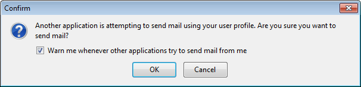
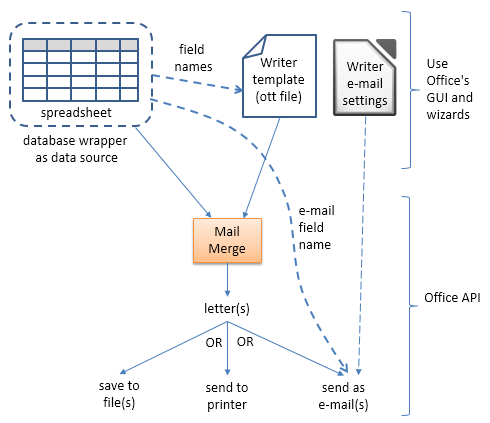
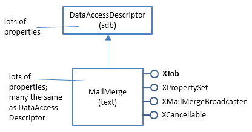

# Chapter 42. Sending E-mail

!!! note "Topics"
    SimpleSystemMail /
    SimpleCommandMail;
    Using the
    MailServiceProvider
    Service; Using
    JavaMail; The Desktop
    API; Thunderbird
    Scripting; Office Mail
    Merge

    Example folders: "Mail
    Tests" and "Utils"


The Jargon file is a humorous collection of computer
slang (online at https://catb.org/jargon/html/), and its
entry for Zawinski's "Law of Software Envelopment"
(https://catb.org/jargon/html/Z/Zawinskis-Law.html)
came to mind while I was preparing this chapter. It states:

> "Every program attempts to expand until it can
read mail. Those programs which cannot so
expand are replaced by ones which can."

Office is a reasonable example (if you replace 'read' with 'send') because, depending
on how you count things, its API contains three different ways of sending e-mail. If
you program in Java, the number increases to six! These approaches are summarized
in Table 1, and none are without drawbacks.


|API               |Services/Classes Used  |Drawbacks                               |
|------------------|-----------------------|----------------------------------------|
|Office API        |SimpleSystemMail or    |User must click "Ok" in a "Confirm"     |
|(coded in Java)   |SimpleCommandMail      |dialog before the e-mail is sent.       |
|                  |MailServiceProvider    |Two DLLs must be repositioned in the    |
|                  |(joint best choice)    |Office installation before the code will|
|                  |                       |work.                                   |
|                  |                       |Firewalls may block it.                 |
|                  |MailMerge              |Works well, but focuses on mail         |
|                  |                       |merge rather than general purpose e-    |
|                  |                       |mail.                                   |
|                  |                       |The user must configure Office's e-     |
|                  |                       |mail settings in Writer before the code |
|                  |                       |will work.                              |
|Java only         |JavaMail: Session,     |Requires the download of the            |
|(no use of Office)|Message, Transport, and|javax.mail JAR.                         |
|                  |others (joint best     |Firewalls may block it.                 |
|                  |choice)                |                                        |
|                  |Desktop.mail()         |Attachments are not supported as        |
|                  |                       |standard in the mailto: protocol.       |
|                  |                       |The e-mail client appears, and the user |
|                  |                       |must press "Send".                      |
|                  |                       |                                        |
|                  |Process & batch file   |Needs a separate batch file.            |
|                  |                       |Tied to the Thunderbird e-mail client.  |
|                  |                       |The e-mail client appears, and the user |
|                  |                       |must press "Send".                      |

Table 1. Office and Java Approaches for Sending E-mail.


My aim is to write a sendMessage() function that sends a text message, optionally
including a file attachment, to a specified e-mail address. The mail will be sent
through an SMTP (Simple Mail Transfer Protocol) server that uses STARTTLS to
encrypt the link. I've tested the code using my local departmental server, and with my
Gmail account.

One surprising entry in Table 1 is Office's mail merge, which typically utilizes a
Writer template file and a spreadsheet (or database) to generate form letters addressed
to different people. These letters can be saved to files, sent to a printer, or posted out
as e-mail attachments. It's the last alternative that led me to include mail merging in
this chapter.

Table 1 identifies two "joint best choice" approaches for sending e-mail. If the mail-
out is part of other Office-related tasks, such as the run-time generation of a
document, then its best to use Office's MailServiceProvider service since it nicely
integrates with the rest of the API. However, if you plan to write a standalone e-mail
application which loads and sends ODF attachments, then JavaMail has more features
(https://java.net/projects/javamail/pages/Home/).

I'll start this chapter by explaining the Office services for sending e-mail:
SimpleSystemMail/SimpleCommandMail, and the newer MailServiceProvider. Then
I'll switch to non-Office approaches, looking first at JavaMail, followed by two
techniques which don't need an extra JAR file but do require the user to interact with
the OSes e-mail client. I'll finish with mail merge in Office.


## 1.  SimpleSystemMail/SimpleCommandMail

The SimpleSystemMail and SimpleCommandMail services in the system module
send e-mail using the OSes default e-mail client. They both implement the same
interfaces, but SimpleSystemMail is for Windows, and SimpleCommandMail for
Linux and MacOS. Figure 1 shows the services and some of their interfaces.


Figure 1. The SimpleSystemMail and SimpleCommandMail Services.


By utilizing the machine's e-mail client, the services don't need the programmer to
enter the mail server address, its port, and a login and password, since this
information is in the client's account settings (or user profile). A drawback of this
approach is that the message passes through the client's GUI, and the user must press
a "Send" button (or equivalent) to post the message. Fortunately, XSimpleMailClient
lets the user interface be mostly hidden, but a "Confirm" dialog like the one in Figure
2 still pops up.




Figure 2.  The "Confirm" Dialog when using
SimpleSystemMail/SimpleCommandMail.


This dialog can be disabled via the checkbox shown in Figure 2, but that's a bad idea
from a security viewpoint.

SimpleSystemMail and SimpleCommandMail are utilized by sendEmailByClient() in
my Mail.java utility class:

```java
// in the Mail class
public static void sendEmailByClient(String to, String subject,
                                      String body, String fnm)
{
  System.out.println("Sending e-mail by client...");
  try {
    XSimpleMailClientSupplier mcSupp =
        Lo.createInstanceMCF(XSimpleMailClientSupplier.class,
                    "com.sun.star.system.SimpleSystemMail");
                       // windows e-mail client service
    if (mcSupp == null) {
      mcSupp = Lo.createInstanceMCF(
                     XSimpleMailClientSupplier.class,
                     "com.sun.star.system.SimpleCommandMail");
                   // returns null on Windows; used on Linux/Mac
      if (mcSupp == null) {
        System.out.println("Unable to create client");
        return;
      }
    }

    XSimpleMailClient mc = mcSupp.querySimpleMailClient();
                    // defaults to ThunderBird on my OS

    XSimpleMailMessage msg = mc.createSimpleMailMessage();
    msg.setRecipient(to);
    msg.setSubject(subject);

    XSimpleMailMessage2 msg2 = Lo.qi(XSimpleMailMessage2.class, msg);
    msg2.setBody(body);

    if (fnm != null) {
      String[] attachs = new String[1];
      attachs[0] = FileIO.getAbsolutePath(fnm);  // attachment
      msg.setAttachement(attachs);
    }

    mc.sendSimpleMailMessage(msg,
                   SimpleMailClientFlags.NO_USER_INTERFACE);
         // hides GUI but still displays a "Confirm" dialog
  }
  catch(com.sun.star.uno.Exception e)
  {  System.out.println(e);  }
}  // end of sendEmailByClient()
```

The function first tries to instantiate the Windows SimpleSystemMail service, which
returns null on a Linux/Mac platform, and then switches to SimpleCommandMail
(which returns null on Windows). The resulting XSimpleMailClientSupplier instance
is used to obtain a reference to the system's default e-mail client, as represented by
XSimpleMailClient.

An XSimpleMailMessage object is initialized with the recipient, subject line, body
text, and optionally attached file. One of the quirks of the API is that the body text is
added via the XSimpleMailMessage2 subclass of  XSimpleMailMessage.

A typical call to sendEmailByClient():

```java
// part of LoMailer.java...
Mail.sendEmailByClient("xxx@xxx", "Test", "Body", "skinner.png");
```

The default e-mail client on Windows is the application associated with the mailto
protocol, as depicted in Figure 3.


Figure 3. The Default E-mail Client of Windows 7.


A good description of how to set up this association can be found at
https://ubergizmo.com/how-to/set-default-email-client-windows/


## 2.  Using the MailServiceProvider Service

The MailServiceProvider service utilizes a Python script called mailmerge.py which
creates a socket-based link to the specified mail server. If that link utilizes SSL (or its
successor TLS) for encrypted communication, then your code will probably crash
with the error message "No SSL support included in this Python".

This bug (https://bugs.documentfoundation.org/show_bug.cgi?id=77354) is marked
as "RESOLVED NOTOURBUG" at Office's bugzilla website which seems a bit
dismissive. The problem appears to be due to the position of Office's application
folders in Window's PATH environment variable. When Windows searches for two
DLLs, ssleay32.dll and libeay32.dll, which implement OpenSSL, it may find incorrect
versions in folders mentioned earlier in PATH. It's these incorrect DLLs that cause
Python to issue the cryptic error. One solution is to copy the correct DLLs from
Office's "program\" folder into the "program\python-core-???\lib\" folder (??? is a
version number, such as 3.3.3), thereby ensuring they're chosen first.

Another issue with switching to MailServiceProvider is that the programmer must
supply more information  to setup the SMTP connection, namely the address of the
mail server, its port, and the login and password for accessing the server.

MailServiceProvider is utilized by the Mail.sendEmail() function. Given below are
examples of how it sends e-mail to my local fivedots.coe.psu.ac.th mail server and to
the Gmail server at smtp.gmail.com:

```java
// part of LoMailer.java...
Mail.sendEmail("fivedots.coe.psu.ac.th", 25, "ad", password,
      "xxx@xxx", "Test 1", "Body 1", "skinner.png");

Mail.sendEmail("smtp.gmail.com", 587,
               "Andrew.Davison50@gmail.com", password,
      "xxx@xxx","Test 2", "Body 2", "addresses.ods");
```

The Mail.sendEmail() arguments are: the mail server address, its port, the login and
password for the server, the recipient of the mail, the subject line, the body text, and
an optional attachment filename.

SMTP is built on top of a TCP network link, and in these security conscious days
many companies and universities (including mine) use firewalls to block everything
but Web links. That means I cannot use MailServiceProvider to access my Gmail
account at work since its mail server is beyond my departmental firewall. However, I
can access the fivedots departmental mail server.

MailServiceProvider is located in the mail module, along with several interfaces. The
other important service is MailMessage for constructing e-mail messages. Figure 4
shows the relationships between the services and their interfaces.


Figure 4. The MailServiceProvider and MailMessage Services.


An SMTP service is created via the XMailServiceProvider interface:

```java
// part of Mail.sendEmail()
       :
XMailServiceProvider msp =
          Lo.createInstanceMCF(XMailServiceProvider.class,
                "com.sun.star.mail.MailServiceProvider");
if (msp == null) {
  System.out.println("Could not create MailServiceProvider");
  return;
}

XMailService service = msp.create(MailServiceType.SMTP);
if (service == null) {
  System.out.println("Could not create SMTP MailService");
  return;
}
```

A listener can be attached to the service, to report on its connection status:

```java
// part of Mail.sendEmail()
      :
service.addConnectionListener( new XConnectionListener() {
  public void connected(EventObject e)
  {  System.out.println("Connected to server " +getServerName(e)); }

  public void disconnected(EventObject e)
  {  System.out.println("  Disconnected"); }

  public void disposing(EventObject e) {}
});
```

The connection requires address, port, protocol, login and password details, which are
supplied through XCurrentContext and XAuthenticator:

```java
// in the Mail class
public static void sendEmail(String mailhost, int port,
                String user, String password,
                String to, String subject, String body, String fnm)
{
  :  // service creation code; see above

  // initialize service data: context and authenticator
  XCurrentContext xcc = new XCurrentContext() {
    public Object getValueByName(String name)
    {
      if (name.equals("ServerName"))
        return (Object) mailhost;
      else if (name.equals("Port"))
        return (Object) new Integer(port);
      else if (name.equals("ConnectionType"))
        return (Object) "Ssl";     // or "Insecure";
      else if (name.equals("Timeout"))
        return (Object)  new Integer(60);
      System.out.println("Do not recognize \"" + name + "\"");
      return null;
    }
  };

  XAuthenticator auth = new XAuthenticator() {
    public String getUserName()
    { return user;  }
    public String getPassword()
    { return password;  }
  };

  // connect to service
  service.connect(xcc, auth);
  System.out.println("Isconnected: " + service.isConnected());
```

I've hardwired a time of 60 seconds in XCurrentContext which sets how long the code
waits for a connection before giving up.

MailMessage utilizes an unusual create() method, and the message's body is
represented by an XTransferable instance rather than a string:

```java
// part of Mail.sendEmail()
      :
String from = user + "@" + mailhost;  // person sending this e-mail
XMailMessage msg = com.sun.star.mail.MailMessage.create(
                 Lo.getContext(), to, from,
                 subject, new TextTransferable(body));
```

The online documentation for MailMessage.create() (use `lodoc MailMessage` to
access it) is misleading in that it doesn’t mention the need for the component context,
which is obtained with the Lo.getContext() call.

My TextTransferable class implements the XTransferable interface, which defines
how different MIME data types are transferred. XTransferable is mainly used in two
ways – for packaging e-mail data (as here), and for moving data to and from the
clipboard (which I'll discuss in the next chapter).

TextTransferable lets Unicode text be treated as a transferable:

```java
// in the Utils/ folder
public class TextTransferable implements XTransferable
{
  private final String text;
  private final String UNICODE_MIMETYPE ="text/plain;charset=utf-16";

  public TextTransferable(String s)
  {  text = s;  }

  public Object getTransferData(DataFlavor df)
                         throws UnsupportedFlavorException
  { if (!df.MimeType.equalsIgnoreCase(UNICODE_MIMETYPE))
      throw new UnsupportedFlavorException();
    return text;
  }

  public DataFlavor[] getTransferDataFlavors()
  { DataFlavor[] dfs = new DataFlavor[1];
    dfs[0] = new DataFlavor(UNICODE_MIMETYPE, "Unicode Text",
                                      new Type(String.class));
    return dfs;
  }

  public boolean isDataFlavorSupported(DataFlavor df)
  {  return df.MimeType.equalsIgnoreCase(UNICODE_MIMETYPE);  }

}  // end of TextTransferable class
```

A DataFlavor object hold three fields: the MIME type string for the data (e.g.
"text/plain"), a 'human presentable' name for the data (which can be anything), and the
corresponding Office data type.

We're not finished with transferable data since an attached file must also be packaged
in a similar way using Office's MailAttachment class and my FileTransferable class:

```java
// part of Mail.sendEmail()
if (fnm != null)
  msg.addAttachment( new MailAttachment(
                             new FileTransferable(fnm), fnm));
```

FileTransferable looks up the MIME type for its supplied file, and stores the file
contents in a byte array which is returned by getTransferData():

```java
// in the Utils/ folder
public class FileTransferable implements XTransferable
{
  private String mimeType = "application/octet-stream";   // default
  private byte[] fileData = null;


  public FileTransferable(String fnm)
  {
    mimeType = Info.getMIMEType(fnm);
    try {
      fileData = Files.readAllBytes( Paths.get(fnm));
    }
    catch(java.lang.Exception e)
    {  System.out.println("Could not read bytes from " + fnm);  }
  }  // end of FileTransferable()


  public Object getTransferData(DataFlavor df)
                               throws UnsupportedFlavorException
  { if (!df.MimeType.equalsIgnoreCase(mimeType))
      throw new UnsupportedFlavorException();
    return fileData;
  }  // end of getTransferData()


  public DataFlavor[] getTransferDataFlavors()
  { DataFlavor[] flavors = new DataFlavor[1];
    flavors[0] = new DataFlavor(mimeType, mimeType,
                                      new Type(byte[].class));
    return flavors;
  }


  public boolean isDataFlavorSupported(DataFlavor df)
  {  return df.MimeType.equalsIgnoreCase(mimeType);  }

}  // end of FileTransferable class
```

MIME type lookup is implemented by Info.getMIMEType() which uses Java's
MimetypesFileTypeMap to examine a file of MIME types stored in my Utils/ folder:

```java
// in the Info class
private static final String MIME_FNM = "mime.types";


public static String getMIMEType(String fnm)
{
  File f = new File(fnm);
  try {
    MimetypesFileTypeMap mftMap = new MimetypesFileTypeMap(
                          FileIO.getUtilsFolder() + MIME_FNM);
    return mftMap.getContentType(f);
  }
  catch(java.lang.Exception e)
  {  System.out.println("Could not find " + MIME_FNM);
     return "application/octet-stream";   // better than nothing
  }
}  // end of getMIMEType()
```

Back in Mail.sendEmail(), all that's left to do is to send the message using
XSmtpService.sendMailMessage():

```java
// part of Mail.sendEmail()...
XSmtpService smtpService = Lo.qi(XSmtpService.class, service);
smtpService.sendMailMessage(msg);

service.disconnect();
```


## 3.  Using JavaMail

JavaMail can send and receive e-mail via SMTP, POP3 and IMAP (its website is
https://java.net/projects/javamail/pages/Home/). Although JavaMail is mainly intended
to be a component of Java EE, it can be downloaded as a single JAR file
(javax.mail.jar) as an add-on to the JDK. It's being actively developed (the current
version is 1.5.6, released in mid 2016), and the website has lots of examples (see
https://java.net/projects/javamail/downloads/download/javamail-samples.zip), a FAQ,
and API documentation (at https://javamail.java.net/nonav/docs/api/).

The main textbook about JavaMail is:

* JavaMail API 1st Edition
Elliotte Rusty Harold
O'Reilly, 2013

This started out as a chapter in Harold's "Java Network Programming" text, but was
separated off after the 3rd edition.

Another nice resource if you want to build a GUI e-mail client using JavaMail is
chapter 5 of The Art of Java by Herbert Schlidt and James Holmes, McGraw Hill,
2003.

JavaMail utilizes the same approach as mailmerge.py mentioned earlier – it creates an
SMTP connection using a TCP socket link to a mail server. As such it suffers from
the same problem with firewalls, which means that I can't use it with my Gmail
account when I'm at work.

My non-Office e-mail support functions are in JMail.java, and have a similar interface
to the Office versions. For instance, JMail.sendEmail() is employed to send an e-mail
with JavaMail. The following two calls use the fivedots and Gmail servers:

```java
// in JMailer.java...
JMail.sendEmail("fivedots.coe.psu.ac.th", 25, "ad", password,
      "xxx@xxx", "Test 1", "Body 1", "skinner.png");

JMail.sendEmail("smtp.gmail.com", 587,
               "Andrew.Davison50@gmail.com", password,
      "xxx@xxx","Test 2", "Body 2", "addresses.ods");
```

They're no different from my earlier Mail.sendEmail() examples, except for the name
of the support class. The arguments are: the mail server address, its port, the login and
password for the server, the recipient of the mail, the subject line, the body text, and
an optional attachment.

JavaMail sending is based around three classes: Transport, Session, and Message.

Transport specifies the underlying communication link, while Session handles the
details of the communication protocol using that link. For example, secure
communication is setup through properties passed to Session.getInstance():

```java
// part of JMail.sendEmail()...
Properties props = new Properties();
props.put("mail.smtp.starttls.enable", "true");
props.put("mail.smtp.ssl.trust", "*");  // no certificate needed
props.put("mail.smtp.timeout", "60000");

Session session = Session.getInstance(props);
```

The mail server address, port, login and password details are used to create a
SMTPTransport instance (a subclass of Transport):

```java
// part of JMail.sendEmail()...
URLName url = new URLName("smtp", mailhost, port, "",
                                              user, password);
Transport transport = new SMTPTransport(session, url);
transport.connect(mailhost, port, user, password);
```

JavaMail supports two kinds of listeners, one for the connection and the other for
message delivery. Simple implementations are given in JMail.sendEmail():

```java
// part of JMail.sendEmail()...
      :
transport.addConnectionListener( new ConnectionListener() {
  public void opened(ConnectionEvent e)
  {  System.out.println("  Connection opened to: "+e.getSource()); }

  public void disconnected(ConnectionEvent e)
  {  System.out.println("  Connection disconnected"); }

  public void closed(ConnectionEvent e)
  {  System.out.println("  Connection closed"); }
});

transport.addTransportListener( new TransportListener() {
  public void messageDelivered(TransportEvent e)
  {  System.out.println("  Message delivered");  }

  public void messageNotDelivered(TransportEvent e)
  {  System.out.println("  Message not delivered");  }

  public void messagePartiallyDelivered(TransportEvent e)
  {  System.out.println("  Message partially delivered");  }
});
```

An SMTP message has fields for the recipient, subject line, body text, and an optional
attached file:

```java
// part of JMail.sendEmail()
      :
SMTPMessage msg = new SMTPMessage(session);
msg.setReturnOption(SMTPMessage.RETURN_HDRS);
msg.setNotifyOptions(SMTPMessage.NOTIFY_SUCCESS |
                     SMTPMessage.NOTIFY_FAILURE);

msg.setFrom();  // uses default
msg.setRecipient(Message.RecipientType.TO, new InternetAddress(to));
msg.setSentDate(new Date());
msg.setSubject(subject);

if (attachFnm == null)
  msg.setText(body);
else {   // add body text and file as attachments
  MimeBodyPart p1 = new MimeBodyPart();
  p1.setText(body);

  String mimeType = Info.getMIMEType(attachFnm);

  MimeBodyPart p2 = new MimeBodyPart();
  FileDataSource fds = new FileDataSource(attachFnm);
  p2.setDataHandler(new DataHandler(fds));  // add data,
  p2.setFileName(fds.getName());            // filename,
  p2.setHeader("Content-Type", mimeType);   // MIME type

  // create multipart
  Multipart mp = new MimeMultipart();
  mp.addBodyPart(p1);   // for body text
  mp.addBodyPart(p2);   // for the attached file
  msg.setContent(mp);
}
```

If the message contains body text and an attachment then it's necessary to add them as
MimeBodyPart objects in a Multipart container. Body text on its own can be added
using SMTPMessage.setText().

The MimeBodyPart holding the attachment must include the file's MIME type in its
"Content-type" header.

Once the message has been sent, the link is closed:

```java
transport.sendMessage(msg, msg.getAllRecipients());
transport.close();
```


## 4.  The Desktop API

The Java equivalent of Office's SimpleSystemMail/SimpleCommandMail service is
the Desktop.mail() method. It utilizes the OSes default e-mail client to post a
message, which means that there's no need to download the javax.mail JAR. The
delivery doesn't need to explicitly include the mail server address, port, login, and
password since they're obtained from the client's settings.

Desktop.mail() utilizes the mailto protocol to communicate with the client, but its
specification (in RFC 2368, at https://ietf.org/rfc/rfc2368.txt) doesn't cover
attachments. There are unofficial extensions supported by some clients, but they're not
part of Thunderbird (but see the next section).

The mailto syntax is:

```
"mailto:" recipients [ "?" key "=" value  ("&" key "=" value)* ]
```

with

* `recipients:` comma-separated e-mail addresses without spaces; Outlook needs
semicolons instead of commas;
* `key: subject, cc, bcc, body` (note: there's no attachment keyword);
* `value:` URL-encoded text (e.g. space becomes %20).

An example:

```
mailto:xxx@xxx?subject=Hello&body=How%20are%20you%3F
```

Desktop.mail() is employed by JMail.sendEmailByClient(). An example of its use:

```
JMail.sendEmailByClient("xxx@xxx", "Hello", "How are you?");
```

There's no way in Desktop to suppress the client's GUI, which appears on-screen, and
the user must press the "Send" button (or equivalent) to post out the message.

JMail.sendEmailByClient() is:

```java
// in the JMail class
public static void sendEmailByClient(String to,
                                    String subject, String body)
{  sendEmailByClient(to, subject, body, null);  }


public static void sendEmailByClient(String to, String subject,
                                     String body, String fnm)
{
  if (!Desktop.isDesktopSupported()) {
    System.out.println("Desktop mail not supported");
    return;
  }

  // construct "mailto:" string for Desktop.mail()
  String uriStr = String.format("mailto:%s?subject=%s&body=%s",
                            encodeMailto(to), encodeMailto(subject),
                            encodeMailto(body) );
  if (fnm != null)
    uriStr += "&attachment=\"" + FileIO.getAbsolutePath(fnm) + "\"";
  try {
    Desktop desktop = Desktop.getDesktop();
    desktop.mail(new URI(uriStr));
  }
  catch (Exception e)
  {  System.out.println(e); }
}  // end of sendEmailByClient()


public static String encodeMailto(String str)
{
  try {
    return URLEncoder.encode(str, "UTF-8").replace("+", "%20");
  }
  catch (UnsupportedEncodingException e) {
     System.out.println("Could not encode: \"" + str + "\"");
     return null;
  }
}  // end of encodeMailto()
```

Following the mailto specification, the key values in the mailto string must be URL
encoded.

sendEmailByClient() has an attachment argument mainly because I've read that some
clients, such as Outlook, can accept it. But if I try to use an attachment with
Thunderbird, the call to Desktop.mail() fails.


## 5.  Thunderbird Scripting

The reason for my uncertainty about Thunderbird supporting attachments is that
although it doesn't allow them in "mailto" strings, it can process attachments via its
GUI, and the command line (see
https://kb.mozillazine.org/Command_line_arguments_-_Thunderbird/). Its command
line features open up another way of sending e-mail: by having Java execute
Thunderbird through an external script.

My Windows batch file, called TBExec.bat, applies various checks to its command
line arguments, and then invokes Thunderbird using:

```java
thunderbird.exe -compose "to='%1',subject='%2',
                          body='%3',attachment='%CD%\%4'"
```

The "attachment" value is an absolute file name.

The Java code uses Runtime.exec() to execute the batch file, passing it three or four
arguments:

```java
// in the JMail class
public static void sendEmailByTB(String to, String subject,
                                 String body, String fnm)
{
  String mailExec =
      String.format("cmd /c TBExec.bat %s \"%s\" \"%s\"",
                                       to, subject, body);
  if (fnm != null)  // add attachment argument
    mailExec += " " + fnm;
  try {
    Process p = Runtime.getRuntime().exec(mailExec);
    p.waitFor();
    System.out.println("Sent e-mail using Thunderbird");
  }
  catch (java.lang.Exception e) {
    System.out.println("Unable to send Thunderbird mail: " + e);
  }
}  // end of sendEmailByTB()
```

As with Desktop.mail(), there's no way to stop the Thunderbird GUI from being
displayed, and the user has to press the "Send" button to send off the message.


## 6.  Office Mail Merge

Mail merge usually involves a spreadsheet of data and a form letter stored as a Writer
template (an OTT file). Data from the spreadsheet replaces fields in the template, such
as < Name > and < Address >, with real names and addresses, creating a series of
personalized letters. Other common uses are to generate labels and envelopes.

After the letters (or labels or envelopes) have been created, they can be saved to files
(or to a single file), sent to a printer, or attached to e-mails. It's because of this last
choice that I've included mail merging here.

Figure 5 pictures the mail merge stages in more detail.




Figure 5. Mail Merging using a Spreadsheet and a Writer Template.


### 6.1.  Preparing the Mail Merge Inputs

Mail merge configuration is most easily done using Office's GUI and wizards, and is
excellently explained in chapter 11 of the Writer Guide (available from
https://th.libreoffice.org/get-help/documentation).

A screenshot of a typical spreadsheet is shown in Figure 6.


Figure 6. The addresses.ods Spreadsheet.


The field names employed in the template correspond to column names in the
spreadsheet (e.g. "Title" and "First Name"). Also, if the merging involves posting out
of e-mails then there must be an "E-mail" column in the sheet; those addresses will be
used as the message recipients.

The spreadsheet has to be converted into a data source for the merge. This is done via
Office's  File, Wizards, Address Data Source menu item, as explained in the Writer
Guide. The outcome is a new ODB file with the same name as the spreadsheet
(addresses.odb in my case). This data source can be viewed from inside Calc by
selecting the menu item View, Data Sources. The GUI display is shown in Figure 7.


Figure 7. Addresses.ods with a Data Source.


The "Addresses" data source has been opened to show its "Addresses" table. Both of
these names will be needed later when we start programming.

The next step is to add fields in the "Addresses" table to the Writer template. This
involves dragging field names from the top row of the  table over to the template, and
positioning them in the text. Figure 8 shows part of the resulting template, stored in
formLetter.ott.


Figure 8. Part of formLetter.ott.


The fields are automatically displayed in angled brackets inside gray rectangles.


### 6.2.  Programming the Mail Merge

The MailMerge service is located in the text module; most of its programming
involves setting properties, and then calling XJob.execute(). The main services and
interfaces are shown in Figure 9.




Figure 9. The MailMerge Service and Interfaces.


The XMailMergeBroadcaster interface is employed to attach a listener to the merging
process, and XCancellable can kill the merge.

If you look at the documentation for the MailMerge and DataAccessDescriptor
services (e.g. use `lodoc MailMerge`), you'll discover many properties in both, and
that most (but not all) of the DataAccessDescriptor properties are redefined in
MailMerge.

The coding is summarized by the following snippet from Mail.mergeTask():

```java
// in Mail.mergeTask()
  :
XJob job = Lo.createInstanceMCF(XJob.class,
                             "com.sun.star.text.MailMerge");

XPropertySet props = Lo.qi(XPropertySet.class, job);
Props.setProperty(props, "DataSourceName", dataSourceName);
Props.setProperty(props, "Command", tableName);
  :   // many more properties are set...
  :

job.execute(new NamedValue[0]);
```

The MailMerge service is created as an XJob interface. Service properties are set, and
then the merge is carried out by calling XJob.execute(). The NamedValue array is
empty since there's no need to set any more properties using it.


### 6.3.  Specializing the Merge

Mail.mergeTask() is passed numerous property values. To simplify its interface, the
call is hidden inside three other functions called Mail.mergeLetter(),
Mail.mergePrint(), and Mail.mergeEmail(), which focus on the three different
outcomes of a merge (see Figure 5).

Mail.mergeLetter() takes four arguments, three of which (data source name, table
name, template filename) are needed for any kind of merge:

```java
// in  the Mail class
public static void mergeLetter(String dataSourceName,
                               String tableName, String templateFnm,
                               boolean isSingle)
{ System.out.println("Merging letters to files...");
  mergeTask(dataSourceName, tableName, templateFnm,
          MailMergeType.FILE,
          isSingle, null, false, null, null, null);
  }  // end of mergeLetter()
```

The following call to Mail.mergeLetter() saves six letters as "letter0.odt" to
"letter5.odt":

```java
// in MailMerge.java...
private static final String DATA_SOURCE_NAME = "Addresses";
private static final String TABLE_NAME = "Addresses";
private static final String TEMPLATE_FNM = "formLetter.ott";


Mail.mergeLetter(DATA_SOURCE_NAME, TABLE_NAME, TEMPLATE_FNM, false);
```

I've defined the data source name, table name, and template filename as constants to
make the call to Mail.mergeLetter() easier to read. The boolean argument specifies
whether a single file should hold all the generated letters. The generated filenames are
hardwired inside Mail.mergeTask() to be "letter" and a number.

Six files are created since the spreadsheet (see Figure 6) has six rows of data.

Mail.mergePrint() is passed the same first three arguments (data source name, table
name, template filename), and a printer name and a boolean to signal whether
multiple print jobs should be created:

```java
// in MailMerge.java...
Mail.mergePrint(DATA_SOURCE_NAME, TABLE_NAME, TEMPLATE_FNM,
                "FinePrint", false);
```

This example will send a single combined print job to the "FinePrint" printer. The
printer name can be obtained using one of the techniques explained in the previous
chapter.

Mail.mergePrint() calls Mail.mergeTask() with its printer name and multiple jobs
boolean arguments set:

```java
// in the Mail class
public static void mergePrint(String dataSourceName,
                              String tableName, String templateFnm,
                       String printerName, boolean isMultipleJobs)
{
  System.out.println("Merging letters for printing...");
  mergeTask(dataSourceName, tableName, templateFnm,
            MailMergeType.PRINTER,
           false, printerName, isMultipleJobs, null, null, null);
}  // end of mergePrint()
```

Mail.mergeEmail() is passed the data source name, table name, and template filename
as before, and the mail server's password, e-mail subject line and body string:

```java
// in MailMerge.java...
Mail.mergeEmail(DATA_SOURCE_NAME, TABLE_NAME, TEMPLATE_FNM,
                password,
                "Hello", "Please read the attached message.");
```

Six e-mails are sent to the addresses listed in the "E-mail" column of the spreadsheet
(see Figure 6). Each e-mail contains the subject and body text supplied in the call, and
an attached copy of the personalized letter.

Mail.mergeEmail() calls Mail.mergeTask():

```java
// in the Mail class
public static void mergeEmail(String dataSourceName,
                              String tableName, String templateFnm,
                        String passwd, String subject, String body)
{
  System.out.println("Merging letters for sending as e-mail...");
  boolean isConfigured = checkMailConfig(passwd);
  System.out.println("--> Mailhost is " +
              (isConfigured ? "" : "NOT ") + "configured");
  if (isConfigured)
    mergeTask(dataSourceName, tableName, templateFnm,
              MailMergeType.MAIL,
              false, null, false, passwd, subject, body);
}  // end of mergeEmail()
```

The e-mailing employs the same mailmerge.py Python script as MailServiceProvider,
which means it will crash when using SSL encryption unless ssleay32.dll and
libeay32.dll have been copied from Office's "program\" folder into "program\python-
core-???\lib\". Please refer back to section 2 for more details.

mailmerge.py attempts to open a link with the specified mail server at the given port,
and usually has to supply a login and password to be allowed access. If you look back
at the arguments passed to Mail.mergeEmail() you can see that the password is
supplied, but what about the mail server address, its port, and a login name?  The only
way to specify them is via Writer's option dialog. The relevant windows are shown in
Figure 10.


Figure 10. Setting Writer E-mail Options.


The left-hand dialog allows the mail server's address and port to be entered
(fivedots.coe.psu.ac.th and 25). If secure communication is required (i.e. SSL, TLS, or
STARTTLS), then the secure SSL checkbox is ticked and the "Server Authentication"
button pressed. A second dialog opens, shown on the right in Figure 10, which lets
you enter a login and password for accessing the server. It's good practice not to enter
a password since the data is stored as plain text in "registrymodifications.xcu" in
Office's user configuration directory (often the folder
$APPDATA$\LibreOffice\??\user). It's safer to pass the password to
Mail.mergeTask() at run time, as I've done in Mail.mergeEmail().

mergeEmail() calls Mail.checkMailConfig() to check if the mail server address, port
number, username, and password can be found in "registrymodifications.xcu". If the
first three aren't present then checkMailConfig() returns false and the merge is
aborted. If the password is found, then a stern warning message is printed, but
merging continues.

checkMailConfig() calls Info.getRegItemProp() which uses XPath to search through
"registrymodifications.xcu" for the specified property names and values.


### 6.4.  mergeTask(): Implementing Mail Merging

mergeTask() is an expanded version of the code snippet given above which creates an
XJob instance, sets properties in the MailMerge service, and calls XJob.execute().

The properties settings are spread across if-tests which determine if the task involves
file creation, printing, or e-mail. Also, a listener is attached to the merge process. The
mergeTask() code:

```java
// in the Mail class
public static void mergeTask(String dataSourceName,
                               String tableName,
                               String templateFnm,
         short outputType, boolean isSingle,           // for FILE
         String printerName, boolean isMultipleJobs,   // for PRINTER
         String passwd, String subject, String body)   // for MAIL
{
  XJob job = Lo.createInstanceMCF(XJob.class,
                          "com.sun.star.text.MailMerge");
  if (job == null) {
    System.out.println("Could not create MailMerge service");
    return;
  }

  XPropertySet props = Lo.qi(XPropertySet.class, job);

  // standard task properties
  Props.setProperty(props, "DataSourceName", dataSourceName);
  Props.setProperty(props, "Command", tableName);
  Props.setProperty(props, "CommandType", CommandType.TABLE);
  Props.setProperty(props, "DocumentURL",
                                FileIO.fnmToURL(templateFnm));

  // vary properties based on output type
  Props.setProperty(props, "OutputType", outputType);
  if (outputType == MailMergeType.FILE) {
    Props.setProperty(props, "SaveAsSingleFile", isSingle);
    Props.setProperty(props, "FileNamePrefix", "letter");
                                      // hardwired filename
  }
  else if (outputType == MailMergeType.PRINTER) {
    Props.setProperty(props, "SinglePrintJobs", isMultipleJobs);
                      // true means one print job for each letter
    PropertyValue[] pProps =
       Props.makeProps("PrinterName", printerName, "Wait", true);
                                        //  synchronous printing
           // from com.sun.star.view.PrintOptions
    Props.setProperty(props, "PrintOptions", pProps);
  }
  else if (outputType == MailMergeType.MAIL) {
    if (passwd != null)
      Props.setProperty(props, "OutServerPassword", passwd);

    Props.setProperty(props, "AddressFromColumn", "E-mail");
                                      // hardwired column name
    Props.setProperty(props, "Subject", subject);
    Props.setProperty(props, "MailBody", body);

    Props.setProperty(props, "SendAsAttachment", true);
    Props.setProperty(props, "AttachmentName", "letter.pdf");
                                    // hardwired filename and type
    Props.setProperty(props, "AttachmentFilter",
                                       "writer_pdf_Export");
  }

  // monitor task's execution
  XMailMergeBroadcaster xmmb =
                       Lo.qi(XMailMergeBroadcaster.class, job);
  xmmb.addMailMergeEventListener( new XMailMergeListener()
  {
    int count = 0;
    long start = System.currentTimeMillis();

    public void notifyMailMergeEvent(MailMergeEvent e)
    { count++;
      XModel model = e.Model;
      // Props.showProps("Mail merge event", model.getArgs());
      long currTime = System.currentTimeMillis();
      System.out.println("  Letter " + count + ": " +
                                (currTime - start) + "ms");
      start = currTime;
    }
  });

  try {
    job.execute(new NamedValue[0]);
  }
  catch (com.sun.star.uno.Exception e) {
    System.out.println("Could not start executing task: " + e);
  }
}  // end of mergeTask()
```

There are four properties that are always set:

```java
Props.setProperty(props, "DataSourceName", dataSourceName);
Props.setProperty(props, "Command", tableName);
Props.setProperty(props, "CommandType", CommandType.TABLE);
Props.setProperty(props, "DocumentURL",
                              FileIO.fnmToURL(templateFnm));
```

These specify the use of a spreadsheet table, the data source name, and the template
filename (as a URI).

The other properties are divided up based on the MailMergeType constants FILE,
PRINT, and MAIL (see `lodoc MailMergeType`).

I've hardwired certain properties to reduce the number of arguments that need to be
passed to Mail.mergeLetter(), Mail.mergePrint(), and Mail.mergeEmail().

The listener implements the XMailMergeListener interface, and is attached through
XMailMergeBroadcaster. notifyMailMergeEvent() is called each time a new letter is
created. For my addresses.ods spreadsheet, it's triggered six times since there are six
rows of data (see Figure 6).

notifyMailMergeEvent() prints only timing information for each letter task, but more
details could be obtained by accessing the event's model.


### 6.5.  Mail Merge Reliability

Office's  mail merge wizard, which implements the "Office API" parts of Figure 5,
and so corresponds to my Mail.mergeTask()function, has a long history of crashing.

Mail.mergeTask() has always worked fine in my tests, except that it displays a
"LibreOffice has stopped working" error dialog after terminating. However, no
zombie Office processes are left over, so the dialog can be safely ignored and closed.