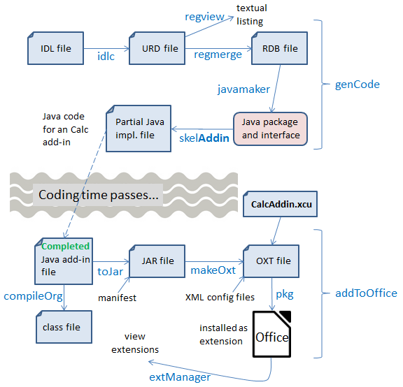
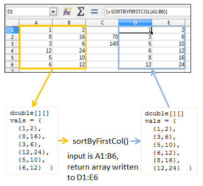

# Chapter 47. Calc Add-ins

!!! note "Topics"
    Implementing a
    Calc Add-in; The IDL
    definitions of the
    Functions; XCU creation

    Example folders: "Addin
    Tests" and "Utils"


Calc Add-ins are extensions containing spreadsheet
functions; my Doubler add-in contains three: doubler() for
doubling a supplied value, doublerSum() for summing a
cell range after doubling each cell value, and
sortByFirstCol() which sorts a supplied cell range returning an array sorted into
ascending order based on the first column.

Figure 1 shows the Doubler add-in as the first entry in the extension manger after it's
been installed in Office.


Figure 1. The Doubler Calc Add-in, and other Extensions.


I created a small spreadsheet in calcTest.ods using doubler(), doublerSum(), and
sortByFirstCol(), which is displayed in Figure 2.


Figure 2. Calc Add-in Functions Used in a Spreadsheet.


doubler() is called six times to double the values in the "A" column, storing them in
the "B" column. doublerSum() is called twice to double and sum the "A" and "B"
columns, placing the results in C2 and C3. sortByFirstCol() sorts the cell range A1:B6
into ascending order by the values in the "A" column, and stores the resulting array in
D1:E6.

sortByFirstCol() is as an example of an Array function (or formula) because it returns
an array which is written into a block of cells (i.e. D1:E6). The slightly tricky way of
doing that is to select the block before typing "=sortByFirstCol(A1:B6)" into the
formula text bar, and then press Shift+Ctrl+Enter instead of the Enter key. The cell
range output is denoted by curly braces surrounding the function, which are just
visible in the bottom screenshot in Figure 2.

Alternatively, the Function Wizard can be called, and its Array box checked as the
function's inputs are specified, as in Figure 3.


Figure 3. The Function Wizard and sortByFirstCol()

The add-in functions from the Doubler extension, and other Office extensions, are
listed under the Add-in" category of the Function Wizard, as shown in Figure 4.


Figure 4. The Function Wizard's Add-in Category.


If you're unfamiliar with the Function Wizard, then you should download the Calc
Guide from https://th.libreoffice.org/get-help/documentation. Chapter 7 is about
formulas and functions, and Appendix B lists the functions by categories, including
the add-ins which come with Calc. The functions-by-category data is also online at
https://help.libreoffice.org/Calc/Functions_by_Category
An interesting wiki page comparing the features of the current version of LibreOffice
and MS Office can be found at
https://wiki.documentfoundation.org/Feature_Comparison:_LibreOffice_-_Microsoft_Office.
The spreadsheet section states that LibreOffice Calc has 500
functions versus 468 in MS Excel, with a large overlap between them but with 25
functions unique to Calc 5.2 and 14 unique to Excel 2016. Another interesting
comparison is offered by Zeki Bildirici as a spreadsheet at
https://wiki.documentfoundation.org/images/c/c6/Excel2013_Calc_Functions_Comparison.ods,
which matches functions in Excel 2013 to their equivalents in Calc 3.x.


## 1.  Implementing a Calc Add-in

The writing of a Calc add-in became much easier after OpenOffice 2.0.4 was released
in 2005, when it became possible to define an add-in as an IDL type, and use the
UNO component tools (e.g. idlc, regmerge, javamaker, and uno-skeletonmaker) to
generate the add-in's boiler-plate code. Prior to this, the programmer had to write a
class that implemented several interfaces including XAddin, XServiceName, and
XServiceInfo.

I mention this 'ancient' history because the Developer's Guide (no spring chicken
itself, having been released in 2009) only explains the pre-2005 approach. There's a
lengthy example in chapter 8, which can also be found online at
https://wiki.openoffice.org/wiki/Documentation/DevGuide/Spreadsheets/Spreadsheet_Add-Ins
(or use `loGuide "Spreadsheet Add-Ins"`). The code (called
ExampleAddIn) can be downloaded from
https://api.libreoffice.org/examples/DevelopersGuide/examples.html#Spreadsheet

According to forum posts, the old approach still works, but I haven’t checked; I'm
only going to use the 'new' way of implementing add-ins (post-2005), using IDL types
and the UNO component tools. Figure 5 shows the required steps.




Figure 5. Implementing a Calc Add-in.


One point in favor of this approach is that it's almost identical to the stages needed to
create an UNO component, as described in Chapter 45. Figure 5 is very similar to
Figure 1 in that chapter, and the batch scripts labeling the arrows are unchanged,
except for skelAddin.bat. skelAddin.bat only differs from skelComp.bat of Chapter 45
in a single argument passed to uno-skeletonmaker.exe, which tells it to generate an
add-in skeleton rather than a component.

The other, more significant, change in Figure 5 is the addition of an XML
configuration file called CalcAddin.xcu. It defines the GUI elements for the functions,
used by the Function Wizard in Figure 3.

A great write-up of this way of coding Calc add-ins by Jan Holst Jensen can be found
at https://biochemfusion.com/doc/Calc_addin_howto.html. He explains how to create a
DoobieDoo add-in consisting of four Python functions, with the code available at
https://wiki.openoffice.org/wiki/Calc/Add-In/Python_How-To.

There's another good example in the OpenOffice NetBeans integration documentation
at https://wiki.openoffice.org/wiki/Calc/Add-In/Project_Type. If you skip past the
description of NetBeans' project wizard, the generated add-in code section is quite
informative. Unlike  my example, the add-in can be localized to show documentation
in English or German.

The specification document for the NetBeans add-in wizard is at
https://openoffice.org/specs/sdk/tools/spec_openoffice-netbeans-integration-calc-addin-wizard.odt.
In amongst details about dialog structuring, there's some good
material on the format of CalcAddin.xcu. I'll explain the XCU format in section 2.5.


## 2.  The IDL definitions of the Functions

My Doubler functions (doubler(), doublerSum(), and sortByFirstCol()) are defined in
Doubler.idl:

```
#ifndef _org_openoffice_doubler_XDoubler_
#define _org_openoffice_doubler_XDoubler_

#include <com/sun/star/uno/XInterface.idl>


module org { module openoffice { module doubler {

  interface XDoubler {
    double doubler([in] double value);

    double doublerSum([in] sequence< sequence< double > > vals);

    sequence< sequence< double > > sortByFirstCol(
                      [in] sequence< sequence< double > > vals);
  };
}; }; };


module org { module openoffice { module doubler
{
  service Doubler : XDoubler;
}; }; };

#endif
```

The IDL defines an XDoubler interface and Doubler service, both in the
org.openoffice.doubler module; XDoubler supports three functions.

As mentioned in Chapter 45, the main source for information about IDL types is
chapter 3 of the Developer's Guide. The subsection "Using UNOIDL to Specify New
Components" explains how to define an interface, and the same information is online
at
https://wiki.openoffice.org/wiki/Documentation/DevGuide/WritingUNO/Using_UNOIDL_to_Specify_New_Components
(or use `loGuide "Using UNOIDL"`). However,
add-in functions only support a subset of the IDL input and return types.

Input arguments must use "[in]", and are restricted to the types long, double, string,
and any. Sequences must be two-dimensional (e.g. sequence< sequence<double>>),
because they're used to represent cell ranges in the spreadsheet. It's possible to use the
XCellRange and XPropertySet as input types, and use sequence<any> as the type of
the last argument so it will be assigned the inputs not used by previous arguments.

Return types can be long, double, string, and any, or a 2D sequence (e.g. sequence<
sequence<double>>) which can be assigned to a cell range in the spreadsheet.

XVolatileResult is a special return type which represents a result that may change
over time; its value is automatically updated in the cell containing the function.

Details on how IDL types are mapped to Java can be found in chapter 2 of the guide,
starting at the "Type Mapping" subsection (online at
https://wiki.openoffice.org/wiki/Documentation/DevGuide/ProUNO/Java/Type_Mappings,
or via `loGuide "Type Mappings"`). The Java versions of the add-in function
types are also detailed in the online documentation for the AddIn service (use
`lodoc Addin` to find the page).


### 2.1.  Converting IDL into Java Code

Figure 5 shows the steps needed to convert Doubler.idl into partial Java code for the
add-in functions. The idlc.bat, regmerge.bat, and javamaker.bat scripts are unchanged
from Chapter 45, and skelAddin.bat only differs from that chapter's skelComp.bat by
calling javamaker.exe with a "calc-add-in" argument rather than "component". The
four calls used to generate the Java code are:

```
> idlc.bat Doubler
> regmerge.bat Doubler
> javamaker.bat Doubler
> skelAddin.bat Doubler
```

or they can be called collectively through genCode.bat:

```
> genCode Doubler
```

Since idlc.bat and skelAddin.bat copy files into "Program Files/", they must be run
with Administrative privileges, as in Chapter 45.

The end result is DoublerImpl.java, which contains all the necessary boiler-plate code,
and three stub functions:

```java
// part of DoublerImpl.java...

public double doubler(double value)
{
  return 0;
}

public double doublerSum(double[][] vals)
{
  return 0;
}

public double[][] sortByFirstCol(double[][] vals)
{
  return new double[0][0];
}
```

In a spreadsheet, doublerSum() and sortByFirstCol() can be passed cell range
arguments (e.g. =doublerSum(A1:A6)), which are treated as 2D arrays. The
transformation retains the row ordering of the cells in the array, as illustrated by
Figure 6.




Figure 6. From Cell Range to Input Array,
and Output Array to Cell Range.


The same mapping is used in reverse if the function returns a 2D array, as in the case
of sortByFirstCol().


### 2.2.  Implementing the Add-in Functions

Implementing doubler() and doublerSum() is easy, but I had some problems with
sortByFirstCol() when using Java's Arrays.sort(). The code was initially:

```java
// added at the start of DoublerImpl.java...

import java.util.*;    // import for Arrays and Comparator classes

private static final String LOG_FNM = "c:\\arrayInfo.txt";
                       // for debugging

// :
// completed function stubs
public double doubler(double value)
{  return value*2;  }


public double doublerSum(double[][] vals)
{
  double sum = 0;
  for (int i = 0; i < vals.length; i++)
    for (int j = 0; j < vals[i].length; j++)
      sum += vals[i][j]*2;
  return sum;
} // end of doublerSum()


public double[][] sortByFirstCol(double[][] vals)
{
  FileIO.appendTo(LOG_FNM, Lo.getTimeStamp() + ": sortByFirstCol()");
  selectionSort(vals);

  for (int i = 0; i < vals.length; i++)
    FileIO.appendTo(LOG_FNM, "  " + Arrays.toString(vals[i]));

  return vals;
}  // end of sortByFirstCol()


private void selectionSort(double[][] vals)
// ascending order based on first column of vals; FAILS ??
{
  Arrays.sort(vals, new Comparator<double[]>() {
    public int compare(double[] row1, double[] row2)
    // compare first column of each row
    {
      FileIO.appendTo(LOG_FNM, "compared");   // never reached ??
      return Double.compare(row1[0], row2[0]);
    }
  });
}  // end of selectionSort()
```

FileIO.appendTo() is my way of debugging add-in functions by appending messages
to a file. Its  main drawback is the lack of a UNIX-like tail command in Windows for
monitoring the end of a file; I use tail.exe from the Gow UNIX utilities for Windows
(https://github.com/bmatzelle/gow/wiki/).

The above version of sortByFirstCol() fails without returning an array for the cell
range D1:E6, as can be seen by the block of #VALUE! text in Figure 7.


Figure 7. sortByFirstCol() Failing in calcTest.ods.


The debugging text written to the log (c:/arrayInfo.txt) shows that Arrays.sort() fails,
although why is a mystery.

I replaced selectionSort() with my own insertion sort:

```java
// part of DoublerImpl.java...

private void selectionSort(double[][] vals)
// ascending order based on first column of vals; WORKS!
{
  double[] temp;
  for(int i = vals.length-1; i > 0; i--) {
    int first = 0;
    for(int j = 1; j <= i; j ++) {
      if(vals[j][0] > vals[first][0]) // compare first col values
        first = j;
    }
    temp = vals[first]; // swap rows
    vals[first] = vals[i];
    vals[i] = temp;
  }
}  // end of selectionSort()
```

This version of sortByFirstCol() works correctly, and the spreadsheet looks like the
screenshot at the bottom of Figure 2. The debugging text confirms the sorting:

```
2016-11-02 14:04:21: sortByFirstCol()
  [1.0, 2.0]
  [3.0, 6.0]
  [5.0, 10.0]
  [6.0, 12.0]
  [8.0, 16.0]
  [12.0, 24.0]
```

The add-in functions in DoublerImpl.java make use of two of my utility functions,
namely Lo.getTimeStamp() and FileIO.appendTo(), so the add-in extension must
include utils.jar.


### 2.3.  Functions that use Global State (a Bad Idea)

The Java code generated by uno-skeletonmaker.exe includes a reference to Office's
component context, stored as a XComponentContext reference:

```java
private final XComponentContext m_xContext;  // in DoublerImpl.java
```

The variable is initialized in the constructor:

```java
public DoublerImpl( XComponentContext context )
{  m_xContext = context;  }
```

This reference can be used to initialize the globals used by my Lo utility library and
other support classes, by calling Lo.addonInitialize():

```java
// part of DoublerImpl()...
doc = Lo.addonInitialize(m_xContext);
```

Lo.addonInitialize() returns an XComponent instance, which refers to the spreadsheet.

These additions to DoublerImpl.java make it possible for doubler(), doublerSum(),
and sortByFirstCol() to access and change the spreadsheet independently of their
input arguments. For example, it's possible to access document information such as
the title bar text, and the supported services:

```java
// in DoubleImpl.java
// global
private XComponent doc;


public double doubler(double value)
{
  FileIO.appendTo(LOG_FNM, "Window title: " + GUI.getTitleBar());
  FileIO.appendTo(LOG_FNM, "Services for this document:");
  for(String service : Info.getServices(doc))
    FileIO.appendTo(LOG_FNM, "  " + service);

  return value*2;
}
```

Calls to FileIO.appendTo() are the only way to 'print' information. The lines appended
to the log are:

```
Window title: calcTest.ods - LibreOffice Calc
Services for this document:
  com.sun.star.document.OfficeDocument
  com.sun.star.sheet.SpreadsheetDocument
  com.sun.star.sheet.SpreadsheetDocumentSettings
```

However, this way of using add-in functions is poor programming style because it
becomes hard to know what a function is doing without checking its implementation.

For that reason, I'd avoid this kind of coding unless absolutely necessary.


### 2.4.  Problems with Office Types

The input argument types for add-in functions are usually long, double, string, any, or
a sequence, but it's also possible to use XCellRange and XPropertySet. Return types
are typically long, double, string, any, or a sequence, but a special case is
XVolatileResult.

I tried using XCellRange as an input type and XVolatileResult as a return type in two
functions in Doubler.idl:

```
#ifndef _org_openoffice_doubler_XDoubler_
#define _org_openoffice_doubler_XDoubler_

#include <com/sun/star/uno/XInterface.idl>
#include <com/sun/star/table/XCellRange.idl>
#include <com/sun/star/sheet/XVolatileResult.idl>

module org { module openoffice { module doubler {

  interface XDoubler {
    double doubler([in] double value);

    double doublerSum([in] sequence< sequence< double > > vals);

    sequence< sequence< double > > sortByFirstCol(
                      [in] sequence< sequence< double > > vals);

    long usedCells([in] com::sun::star::table::XCellRange cr);
                    // javamaker cannot process this function

    com::sun::star::sheet::XVolatileResult counter(
                     [in] string aName, [in] double value);
                    // javamaker cannot process this function
  };
}; }; };

#endif
```

Office's idlc.exe and regmerge.exe tools are happy to process these types, but
javamaker.exe always fails to recognize 'com.sun.star.table.XCellRange' and
'com.sun.star.sheet.XVolatileResult', reporting an "Unknown entity" error. I tried
calling javamaker with the inclusion of extra Office RDB files, such as services.rdb
and offapi.rdb, but with no success.

I was unable to find an add-in example online that uses XCellRange, perhaps because
it's more natural to pass a cell range to a function as an array.

XVolatileResult is utilized by the example in the Developer's Guide (ExampleAddIn
at https://api.libreoffice.org/examples/DevelopersGuide/examples.html#Spreadsheet),
but it employs the old add-in coding style based on implementing the XAddIn
interface.


### 2.5.  Creating CalcAddIn.xcu

The second half of the Calc add-in development process shown in Figure 5 starts
when the programmer has finished writing the add-in functions. It uses the same batch
scripts as in Chapter 45: compileOrg.bat, toJar.bat, makeOxt.bat, and pkg.bat. The
only difference is that the Doubler/ directory zipped up as an OXT file contains a
configuration file, CalcAddIn.xcu.. The folder's structure is:

```java
Doubler
|   CalcAddIn.xcu
|   description.xml
|   double.png
|   license.txt
|   package-description.txt
|   Utils.jar
|
\---META-INF
        manifest.xml
```

makeOxt.bat moves the Doubler.rdb type data and DoublerImpl.jar into Doubler/, and
zips the contents into Doubler.oxt.

CalcAddin.xcu contains an XML description for each function in Doubler. For
example, sortByFirstCol() is represented by:

```
<node oor:name="sortByFirstCol" oor:op="replace">
  <prop oor:name="DisplayName">
        <value xml:lang="en">sortByFirstCol</value></prop>

  <prop oor:name="Description">
        <value xml:lang="en">sorts a cell range into ascending
                             order using the first column values
                             of the range</value></prop>

  <prop oor:name="Category">
        <value>Add-In</value></prop>

  <prop oor:name="CompatibilityName">
        <value xml:lang="en">sortByFirstCol</value></prop>

  <node oor:name="Parameters">
    <node oor:name="vals" oor:op="replace">
      <prop oor:name="DisplayName">
            <value xml:lang="en">cell range</value></prop>
      <prop oor:name="Description">
            <value xml:lang="en">range of doubles</value></prop>
    </node>
  </node>

</node>
```

There are five fields: "DisplayName", "Description", "Category",
"CompatibilityName", and "Parameters", most of which are utilized by Office's
Function Wizard, as shown in Figure 3.

The "Category" value can be any of the wizard's pop-down list categories, but "Add-
In" seems the best choice. If you want to use one of the others, a complete list is given
in the documentation for getProgrammaticCategoryName() in the XAddin class (use
lodoc XAddin to access the page).

The simplest value to use for "CompatibilityName" is the function's name. This
becomes important when the spreadsheet is exported as an Excel XLS file, when the
function's name is replaced by this string.

According to Jan Holst Jensen in his "Calc Add-in How-to" article
(https://biochemfusion.com/doc/Calc_addin_howto.html), it's possible to supply the
name of a .NET or COM Automation function in this field, and have the exported
spreadsheet correctly call that Excel function, but I haven't tried that myself.

The "Parameters" field may contain several sub-nodes, one for each function
argument. Each node maps the argument's name in the IDL definition to text shown
by the Function Wizard. For example, the IDL definition for sortByFirstCol() is:

```
sequence< sequence< double > > sortByFirstCol(
                  [in] sequence< sequence< double > > vals);
```

The "vals" argument is mapped to a display name and description used by the
Function Wizard in Figure 3.