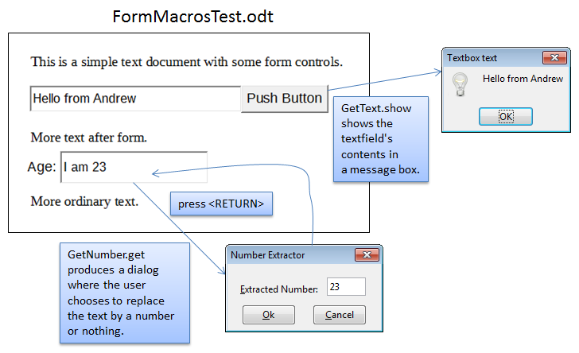
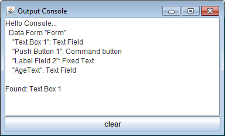
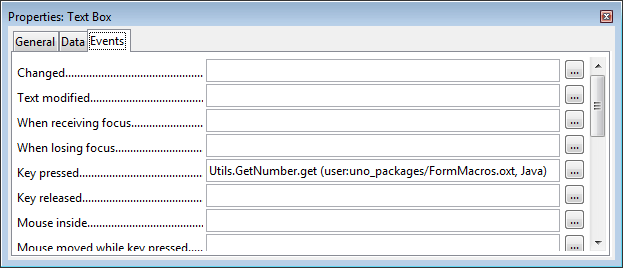
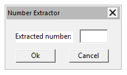
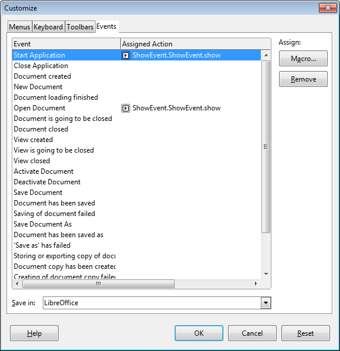
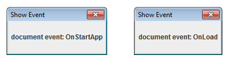
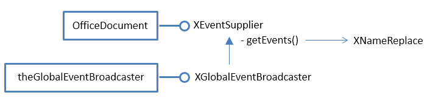
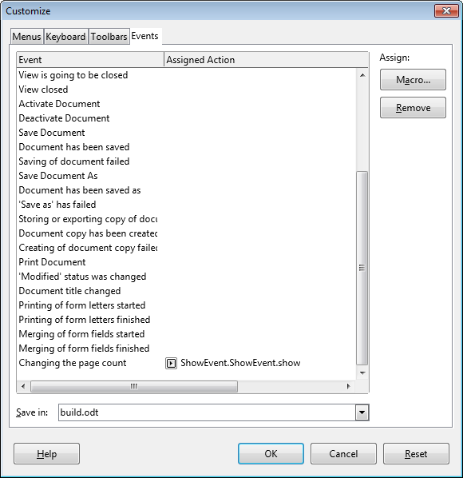

# Chapter 49. Extension and Document  
Event Macros 
 
 
The previous chapter introduced event macros, and described  
how a simple macro could be installed by copying it to a 
specific Office directory. This chapter looks at two other 
ways to package macros: as extensions, and by attaching 
them to documents. 

 
 
## 1.  Form Macros as an Extension 

Adding a macro to Office by installing it as an extension means that the user doesn't 
need to grapple with Office folders and copying files since Office's extension 
manager does it for them. This section also uses more complex macros than the ones 
in the previous chapter, namely ones that utilize their own dialogs and employ my 
utility classes. 

The FormMacros.oxt extension is created by zipping up a FormMacros\ folder, which 
is listed below: 
 
FormMacros 
 |   description.xml 
 |   form.png 
 |   license.txt 
 |   package-description.txt 
 |    
 +---dialogLibrary 
 |       NumExtractor.xdl 
 |        
 +---META-INF 
 |       manifest.xml 
 |        
 \---Utils 
         GetNumber.class 
         GetText.class 
         NumActionListener.class 
         parcel-descriptor.xml 
         Utils.jar 
 
The macros are in the Utils\ folder, and are utilized by the form stored in 
FormMacrosTest.odt in the ways shown in Figure 1. 

!!! note "Topics"
    Form Macros as 
an Extension; Loading 
an XML Dialog; 
Building a Dialog at 
Runtime; Storing 
Macros inside the 
(Form) Document; 
Attaching Macros to 
Other Events; Executing 
Macros from the 
Command Line 
Example folders: 
"EvMacro Tests" and 
"Utils" 
 

Figure 1. A Form and its Macros. 

 
Figure 1 illustrates the actions of two macros. GetText.show is attached to the form's 
button, and display the text in the adjacent textfield when the button is pressed. The 
GetNumber.get macro is attached to the second textfield, and is activated when 
<RETURN> is pressed. A dialog, created by the macro, offers the user a choice of 
replacing the text by a number or clearing the textfield. 

To simplify the example a little, FormMacrosTest.odt was created by hand rather than 
programmatically. Also, I'm going to attach the extension's macros to the button and 
textfield using Office's GUI, as explained shortly. 

I won’t explain all the contents of the FormMacros\ folder, because most of them 
were covered in early chapters, particularly in Chapter 45. For example, I won't be 
describing how I drew the "Number Extractor" dialog stored in 
dialogLibrary\NumExtractor.xdl since that technique was covered in the last chapter, 
in section 5. 

The new elements of FormMacros\ are the contents of manifest.xml and parcel-
descriptor.xml. 

manifest.xml states the location of the macros inside the extension, which in my case 
are in the Utils\ subdirectory. This is encoded as: 
 
<?xml version="1.0" encoding="UTF-8"?> 
<manifest:manifest  
     xmlns:manifest="http://openoffice.org/2001/manifest"> 
 
  <manifest:file-entry manifest:media-type= 
          "application/vnd.sun.star.framework-script" 
                       manifest:full-path="Utils/" /> 
 
</manifest:manifest> 
 
parcel-descriptor.xml give details about the two macros, GetText.show and 
GetNumber.get, which are used by the Macro Selector dialog: 
 
<?xml version="1.0" encoding="UTF-8"?> 
<parcel language="Java" xmlns:parcel="scripting.dtd"> 
 
   
 
   
 
</parcel> 
 
There's an important difference between this parcel-descriptor.xml and the one given 
for ShowEvent.show in the previous chapter, related to the new macros' classpaths: 
      <prop name="classpath" value=".:GetText:Utils.jar"/> 
and 
      <prop name="classpath" value=".:GetNumber:Utils.jar"/> 
The classpath line for ShowEvent.show was: 
      <prop name="classpath" value="ShowEvent.jar"/> 
 
The difference, which took many hours of experimentation to find, is due to the 
inclusion of my utilities classes as a JAR in Utils\.  

When Utils.jar is in the extension, Office is unable to recognize GetText.show and 
GetNumber.get packaged as JARs (e.g. as GetText.jar and GetNumber.jar). It appears 
that Office can only add a single JAR to its classpath with <languagedepprops>. 

Instead I've stored the macros as .class files in Utils\. In addition, it's necessary to 
include "." in the classpath so NumActionListener.class can be found at runtime.  

The three Java files (GetText.java, GetNumber.java, and NumActionListener.java) 
are compiled and manually copied into FormMacros\Utils\. Then the 
installMacros.bat batch script zips up the folder as an OXT file, and calls unopkg.exe 
to install it. The extension manager displays the "Form Macros" as in Figure 2. 

 
 

Figure 2. The Form Macros Extension. 

 
By default, extension macros are installed as user macros, as can be seen in the Macro 
Selector dialog in Figure 3. 

 
 

Figure 3. The User Extension Macros in the Macro Selector. 

 
The Utils\ subdirectory of the extension has become a module called Utils. 

The full names of the extension macros can be obtained using my ListMacros.java or 
FindMacros.java examples. For example: 
run FindMacros Utils 
produces: 
 
Matching Macros in Office: (2) 
  vnd.sun.star.script:Utils.GetNumber.get? 
      language=Java&location=user:uno_packages/FormMacros.oxt 
 
  vnd.sun.star.script:Utils.GetText.show? 
      language=Java&location=user:uno_packages/FormMacros.oxt 
  
### 1.1.  The GetText.show Macro 

GetText.show is triggered when a button is pressed; it displays the text currently in 
the "Text Box 1" textfield inside a message box (see Figure 1). The code for the class 
is: 
 
// in GetText.java 
public class GetText 
{ 
  private static final String LOG_FNM = "c://macrosInfo.txt"; 
              // log file for storing debugging output 
 
 
  public static void show(XScriptContext sc, ActionEvent e) 
  // Called when a button pressed 
  {  
    String controlName = Forms.getEventSourceName(e); 
 
    FileIO.appendTo(LOG_FNM, "\"" + controlName +  
                 "\" sent ActionEvent at " + Lo.getTimeStamp()); 
 
    XComponent doc = Lo.scriptInitialize(sc); 
    if (doc == null) 
      return; 
 
    // for debugging 
    Console console = new Console(); 
    console.setVisible(true); 
 
    Forms.listForms(doc); 
 
    XControlModel textBox = Forms.getControlModel(doc, "Text Box 1"); 
    // Props.showObjProps("TextBox", textBox); 
 
    String textContents = (String)Props.getProperty(textBox, "Text"); 
    GUI.showXMessageBox("Textbox text", textContents); 
 
    console.setVisible(false); 
    console.closeDown(); 
  } // end of show() for ActionEvent 
 
}  // end of GetText class 
 
The class implements a single show() method suitable for responding to 
ActionEvents. 

Forms.getEventSourceName() returns the name of the control that sent the event and 
FileIO.appendTo() writes the details to a log file. This log is useful for debugging, 
and can be removed when the macro is finished. 

Lo.scriptInitialize() uses the macro's XScriptContext object to initialize globals 
maintained by my Lo class: 
 
// in the Lo class 
// globals 
private static XComponentContext xcc = null; 
private static XDesktop xDesktop = null; 
private static XMultiComponentFactory mcFactory = null;    
private static XMultiServiceFactory msFactory = null; 
 
 
public static XComponent scriptInitialize(XScriptContext sc) 
{ 
  if (sc == null) { 
    System.out.println("Script Context is null"); 
    return null; 
  } 
 
  xcc = sc.getComponentContext(); 
  if (xcc == null)  { 
    System.out.println("Could not access component context"); 
    return null; 
  } 
  mcFactory = xcc.getServiceManager(); 
  if (mcFactory == null) { 
    System.out.println("Office Service Manager is unavailable"); 
    return null; 
  } 
 
  xDesktop = sc.getDesktop(); 
  if (xDesktop == null)  { 
    System.out.println("Could not access desktop"); 
    return null; 
  } 
 
  XComponent doc = xDesktop.getCurrentComponent(); 
  if (doc == null)  { 
    System.out.println("Could not access document"); 
    return null; 
  } 
 
  msFactory =  Lo.qi(XMultiServiceFactory.class, doc); 
  return doc; 
}  // end of scriptInitialize() 
 
The log approach is fine for simple debugging, but it's also possible to create a 
Console window for displaying more complex textual output. One useful thing to 
report are the form's control details, by calling Forms.listForms(). The Console 
window looks as in Figure 4. 

 
 

Figure 4. The Console Window Output for GetText.show. 

 
The control names in Figure 4 include "Text Box 1", which is used by 
Forms.getControlModel() to reference the textfield control: 
 
// part of show() in GetText.java... 

XControlModel textBox = Forms.getControlModel(doc, "Text Box 1"); 
String textContents = (String)Props.getProperty(textBox, "Text"); 
GUI.showXMessageBox("Textbox text", textContents); 
 
### 1.2.  The GetNumber.get Macro 

The second textfield in Figure 1 is called "AgeText". Its listener processes the text 
when the user types <RETURN>, which is implemented using a keypress listener, as 
shown in Figure 5. 

 
 

Figure 5. The "AgeText" Properties Dialog. 

 
GetNumber.get is woken up by every keypress, which should be ignored until the key 
is <RETURN>. Then the text is read from the "AgeText" textfield, and the extracted 
number displayed in the "Number Extractor" dialog (shown in Figure 1). This dialog 
has its own listener (a NumActionListener object) attached to the "Ok" and "Cancel" 
buttons which updates the "AgeText" textfield depending on which is pressed. 

The GetNumber class defines a single static get() method, suitable for receiving 
KeyEvents: 
 
// in GetNumber.java 
public static void get(XScriptContext sc, KeyEvent e) 
{  
  String controlName = Forms.getEventSourceName(e); 
  if (e.KeyCode == Key.RETURN) {  // return typed 
    XComponent doc = Lo.scriptInitialize(sc); 
    if (doc != null) { 
      XControlModel cModel =  
             Forms.getControlModel(doc, controlName); 
      if (Forms.isTextField(cModel)) 
        loadXDLDialog(cModel); 
        // runtimeDialog(cModel); 
    } 
  } 
} // end of get() 
 
When the <RETURN> key is pressed, Forms.getControlModel() searches the form 
for the control that sent the event (i.e. the "AgeText" textfield).  

If the control is a textfield then the "Number Extractor" dialog is displayed in one of 
two ways – either loadXDLDialog() loads the dialog's XML from 
dialogLibrary\NumExtractor.xdl inside the extension, or runtimeDialog() creates the 
dialog dynamically by calling methods in my Dialogs utility class. I'll look at each 
approach in the next two sections. 

 
### 1.3.  Loading an XML Dialog  

Chapter 46 on Add-ons describes how to use Office's dialog editor to create a dialog 
and export it as an XDL file. The same steps were used to create NumExtractor.xdl, 
which is shown in Figure 6. 

 

Figure 6. The NumExtractor.xdl Dialog. 

 
The XML contents of NumExtractor.xdl are: 
 
<?xml version="1.0" encoding="UTF-8"?> 
<!DOCTYPE dlg:window PUBLIC "-//OpenOffice.org//DTD OfficeDocument 
1.0//EN" "dialog.dtd"> 
 
<dlg:window xmlns:dlg="http://openoffice.org/2000/dialog" 
            xmlns:script="http://openoffice.org/2000/script" 
            dlg:id="NumExtractor" 
            dlg:left="109" dlg:top="73" 
            dlg:width="94" dlg:height="44" 
            dlg:closeable="true" dlg:moveable="true" 
            dlg:title="Number Extractor"> 
 
 <dlg:bulletinboard> 
  <dlg:text dlg:id="Label1" dlg:tab-index="0" 
            dlg:left="8" dlg:top="11" 
            dlg:width="48" dlg:height="10" 
            dlg:value="Extracted number: " 
            dlg:align="right"/> 
 
  <dlg:button dlg:id="CommandButton1" dlg:tab-index="2" 
              dlg:left="8" dlg:top="27" 
              dlg:width="33" dlg:height="12" 
              dlg:value="Ok"/> 
 
  <dlg:textfield dlg:id="TextField1" dlg:tab-index="1" 
                 dlg:left="61" dlg:top="9" 
                 dlg:width="24" dlg:height="12" 
                 dlg:align="center" 
                 dlg:readonly="true"/> 
 
  <dlg:button dlg:id="CommandButton2" dlg:tab-index="3" 
              dlg:left="52" dlg:top="27" 
              dlg:width="33" dlg:height="12" 
              dlg:value="Cancel"/> 
 
 </dlg:bulletinboard> 
</dlg:window> 
 
The most important things to note for later are the control IDs; in particular, the 
textfield and button names: "TextField1", "CommandButton1", and 
"CommandButton2". 

loadXDLDialog() utilizes Dialogs.loadAddonDialog() described in Chapter 46 to 
obtain a reference to the dialog. It's initialized by initDialog() and made live by 
XDialog.execute(): 
 
// in GetNumber.java 
private static void loadXDLDialog(XControlModel cModel) 
{ 
  XDialog dialog = Dialogs.loadAddonDialog( 
                          "org.openoffice.formmacros",  
                          "dialogLibrary/NumExtractor.xdl"); 
  if (dialog == null) 
    return; 
  initDialog(dialog, cModel); 
  dialog.execute(); 
}  // end of loadXDLDialog() 
 
initDialog() fills the dialog's textfield with numerical data extracted from the form's 
"AgeText" field, and attaches a NumActionListener to its buttons: 
 
// part of GetNumber.java 
private static void initDialog(XDialog dialog,  
                               XControlModel cModel) 
{ 
  XControl dialogCtrl = Dialogs.getDialogControl(dialog); 
  if (dialogCtrl == null) 
    return; 
 
  int val = extractDigits(  
                (String)Props.getProperty(cModel, "Text")); 
 
  // store extracted number in dialog's read-only text field; 
  // the names of the controls are hardwired 
  XTextComponent numFieldTB = Lo.qi(XTextComponent.class, 
                 Dialogs.findControl(dialogCtrl, "TextField1")); 
  numFieldTB.setText(""+val); 
 
  // assign same listener to both buttons 
  NumActionListener naListener =  
               new NumActionListener(dialog, cModel, val); 
 
  XButton okButton = Lo.qi(XButton.class, 
          Dialogs.findControl(dialogCtrl, "CommandButton1")); 
  okButton.addActionListener(naListener); 
 
  XButton cancelButton = Lo.qi(XButton.class, 
          Dialogs.findControl(dialogCtrl, "CommandButton2")); 
  cancelButton.addActionListener(naListener); 
} // end of initDialog() 
 
Dialogs.findControl() finds the dialog's textfield and buttons using the IDs that we 
saw in NumExtractor.xdl. 

The NumActionListener class is included in the extension's Utils\ folder. It's a 
standard button listener, but uses Office's XActionListener and ActionEvent not the 
Java classes with similar names: 
 
// in NumActionListener.java 
public class NumActionListener implements XActionListener 
{ 
  private XDialog dialog; 
  private XControlModel cModel; 
  private int val; 
 
 
  public NumActionListener(XDialog dialog,  
                            XControlModel cModel, int val) 
  { this.dialog = dialog; 
    this.cModel = cModel; 
    this.val = val; 
  }  // end of NumActionListener() 
 
 
  public void actionPerformed(ActionEvent e) 
  { 
    String buttonName = Dialogs.getEventSourceName(e); 
    System.out.println("Event received from : " + buttonName); 
 
    if (buttonName.equals("CommandButton1"))        // "OK" button 
      Props.setProperty(cModel, "Text", "" + val);   
                                          // put val in text field 
    else if (buttonName.equals("CommandButton2"))   // "Cancel" 
      Props.setProperty(cModel, "Text", "");   // clear text field 
 
    dialog.endExecute(); 
  }  // end of actionPerformed() 
 
 
  public void disposing(EventObject e) { }  
 
}  // end of NumActionListener class 
 
The number extracted from the "AgeText" textfield is passed to the listener via its 
constructor, along with a reference to the control. If the user presses "Ok" then the 
number is written into the textfield, otherwise an empty string is used to clear its 
contents. 

 
### 1.4.  Building a Dialog at Runtime 

Office's dialog editor is the easiest way to construct a dialog, but there may be 
situations where you want to create a simple dialog at run time. The commented-out 
call to runtimeDialog() in GetNumber.get shows how to do this using my Dialog class 
functions: 
 
// part of GetNumber.java 
private static void runtimeDialog(XControlModel cModel) 
{ 
  XControl dialogCtrl = makeDialogControl(); 
  if (dialogCtrl == null) 
    return; 
 
  XDialog dialog = Dialogs.createDialogPeer(dialogCtrl); 
  if (dialog == null) 
    return; 
 
  initDialog(dialog, cModel); 
  dialog.execute(); 
}  // end of runtimeDialog() 
 
The dialog generated by makeDialogControl() (see Figure 7) is very similar to the one 
defined in NumExtractor.xdl. 

 
 

Figure 7. The Rendering of the Runtime Dialog. 

 
makeDialogControl() creates an empty dialog, and fills it with a label, textfield and 
two buttons: 
 
// part of GetNumber.java 
private static XControl makeDialogControl() 
{ 
  XControl dialogCtrl =  
        Dialogs.createDialogControl(109, 73, 94, 44,  
                                      "Number Extractor"); 
  if (dialogCtrl == null) 
    System.out.println("dialog control is null"); 
  // log("Dialog name:" + Dialogs.getControlName(dialogCtrl)); 
        // reports "OfficeDialog1" 
 
  XControl xc = Dialogs.insertLabel(dialogCtrl, 8, 11, 48,  
                                    "Extracted Number: "); 
  // log("Label name:" + Dialogs.getControlName(xc)); 
        // FixedText1 
 
  xc = Dialogs.insertTextField(dialogCtrl, 61, 9, 24, ""); 
  // log("Text field name:" + Dialogs.getControlName(xc)); 
        // TextField1 
 
  xc = Dialogs.insertButton(dialogCtrl, 9, 27, 33, "Ok"); 
  // log("Ok button name:" + Dialogs.getControlName(xc)); 
       // CommandButton1 
 
  xc = Dialogs.insertButton(dialogCtrl, 52, 27, 33, "Cancel"); 
  // log("Cancel button name:" + Dialogs.getControlName(xc)); 
       // CommandButton2 
 
  return dialogCtrl; 
}  // end of makeDialogControl() 
 
One tricky aspect is deciding on the control positions and widths passed to the 
Dialogs.insertXXX() methods. I based them on the values in NumExtractor.xdl.  

initDialog() is again used to initialize the dialog's textfield and buttons, which 
assumes they are called "TextField1", "CommandButton1", and "CommandButton2". 

I confirmed this for the runtime dialog by writing their name to the log file: 
 
// part of GetNumber.java 
// global 
private static final String LOG_FNM = "c://macrosInfo.txt"; 
 
private static void log(String msg) 
{  FileIO.appendTo(LOG_FNM, msg);  } 
 
 
### 1.5.  Dialogs and their Controls 

Dialog controls utilize the same model-view framework as form controls (which were 
described back in Chapter 39). Controls store data as properties spread over a 
hierarchy centered around UnoControlModel in the com.sun.star.awt module. A small 
fragment of that hierarchy is shown in Figure 8. 

 
 

Figure 8. UnoControlModel and Some Subclasses. 

 
A dialog is represented by UnoControlDialogModel, which stores properties such as 
the title, a background image or color, and windowing flags such as whether it is 
closeable. Its XNameContainer interface allows the names of its component controls 
to be accessed.  

Some of the important properties, such as the (x, y) position of a control, are a little 
hard to find – they're not in UnoControlModel but its superclass, 
UnoControlDialogElement. 

The other part of the model-view framework are views which represent how a control 
is drawn. Views for different controls are subclasses of the UnoControl service, as 
shown in Figure 9. 

 

Figure 9. UnoControl and Some Subclasses. 

 
UnoControl's XControl contains methods for linking a model to a view. Also, 
subclass interfaces, such as XButton and XTextComponent, are where listeners are 
attached to controls. 

It helps to remember the naming conventions illustrated by Figures 8 and 9 – a service 
containing the word "Model" is almost always for storing data, while a service 
without the word "Model" is almost always a view. 

Figure 9 doesn't include a dialog view; it's sufficiently different to deserve its own 
diagram, Figure 10. 

 

Figure 10. The UnoControlDialog Service. 

 
UnoControlDialog isn't a subclass of UnoControl, but its interface, 
XUnoControlDialog, still inherits XControl and so can be linked to a model. It also 
inherits XControlContainer which allows controls to be added to and removed from a 
dialog. XDialog contains execute() which makes a dialog active on screen. 

Dialogs.createDialogControl() creates a dialog view and model, and links them. The 
dialog is initialized by setting various properties in its model: 
 
// in the Dialogs class 
public static XControl createDialogControl(int x, int y,  
                     int width, int height, String title) 
{ try { 
    XControl dialogCtrl =   
                 Lo.createInstanceMCF(XControl.class,  
                     "com.sun.star.awt.UnoControlDialog"); 
    XControlModel xControlModel =  
                 Lo.createInstanceMCF(XControlModel.class,  
                     "com.sun.star.awt.UnoControlDialogModel"); 
    dialogCtrl.setModel(xControlModel);  // link view and model 
     
    XPropertySet props = getControlProps(dialogCtrl.getModel()); 
    props.setPropertyValue("PositionX", x); 
    props.setPropertyValue("PositionY", y); 
    props.setPropertyValue("Height", height); 
    props.setPropertyValue("Width", width); 
 
    props.setPropertyValue("Title", title); 
    props.setPropertyValue("Name", "OfficeDialog"); 
 
    props.setPropertyValue("Step", 0); 
    props.setPropertyValue("Moveable", true); 
    props.setPropertyValue("TabIndex", new Short((short) 0)); 
 
    return dialogCtrl; 
  } 
  catch (Exception ex) { 
    System.out.println("Could not create dialog control: " + ex); 
    return null; 
  } 
}  // end of createDialogControl() 
 
makeDialogControl() in the GetNumber class adds a label, textfield, and two buttons 
to the dialog by calling Dialogs.insertXXX() methods. These methods are all quite 
similar, so I'll only explain insertButton(). Its job is to create a button model, and 
initialize its properties: 
 
// in the Dialogs class 
public static XControl insertButton(XControl dialogCtrl, 
                          int x, int y, int width, String label) 
{  return insertButton(dialogCtrl, x, y, width, label,  
                       PushButtonType.STANDARD_value); 
} 
 
 
public static XControl insertButton(XControl dialogCtrl, 
                          int x, int y, int width,  
                          String label, int pushButtonType) 
{ try { 
    // create a button model 
    XMultiServiceFactory msf =  
             Lo.qi(XMultiServiceFactory.class,  
                            dialogCtrl.getModel()); 
    Object model = msf.createInstance( 
               "com.sun.star.awt.UnoControlButtonModel"); 
     
    // generate a unique name for the control 
    XNameContainer nameCon = getDialogNmCon(dialogCtrl); 
    String nm = createName(nameCon, "CommandButton"); 
     
    // set properties in the model 
    XPropertySet props = getControlProps(model); 
    props.setPropertyValue("PositionX", x); 
    props.setPropertyValue("PositionY", y); 
    props.setPropertyValue("Height", 14); 
    props.setPropertyValue("Width", width); 
 
    props.setPropertyValue("Label", label); 
    props.setPropertyValue("PushButtonType",  
                  new Short((short) pushButtonType)); 
    props.setPropertyValue("Name", nm); 
     
    // add the model to the dialog 
    nameCon.insertByName(nm, model); 
     
    // get the dialog's container holding all the control views 
    XControlContainer ctrlCon =  
               Lo.qi(XControlContainer.class, dialogCtrl); 
 
    // use the model's name to get its view inside the dialog 
    return ctrlCon.getControl(nm); 
  } 
  catch (Exception ex) { 
    System.out.println("Could not create button control: " + ex); 
    return null; 
  } 
}  // end of insertButton() 
 
First the model is created and added to the dialog. Its view is retrieved from the 
dialog's control container, and returned as an XControl object. 

Back in GetNumber.runtimeDialog(), the dialog's window (or peer) is linked to the 
Office window by Dialogs.createDialogPeer(): 
 
// in the Dialogs class 
public static XDialog createDialogPeer(XControl dialogCtrl) 
{ 
  XWindow xWindow = (XWindow) Lo.qi(XWindow.class, dialogCtrl); 
  xWindow.setVisible(false); 
             // set dialog window invisible until it is executed 
 
  XToolkit xToolkit = Lo.createInstanceMCF(XToolkit.class,  
                                  "com.sun.star.awt.Toolkit"); 
  XWindowPeer windowParentPeer = xToolkit.getDesktopWindow(); 
 
  dialogCtrl.createPeer(xToolkit, windowParentPeer); 
 
  XComponent dialogComponent = Lo.qi(XComponent.class, dialogCtrl); 
  return getDialog(dialogCtrl); 
}  // end of createDialogPeer() 
 
 
## 2.  Storing Macros inside the (Form) Document 

The previous section examined how to add macros to Office as extensions. Another 
popular way of utilizing macros is to embed them inside documents. 

I'll create a variation of the previous form, with the same functionality for its text 
fields, but GetText.show and GetNumber.get (and its dialog and listener) will be 
stored inside the document. 

Office documents, such as FormMacrosTest.odt, can be manipulated as zip files; I 
chose 7-Zip (http://www.7-zip.org/) for the purpose, because it's powerful, open 
source, and can be executed from the command line and from DOS batch scripts. 

I'm reusing the same form from the previous section, but stored in 
FormDocMacros.odt. It's unzipped using my unzipDoc.bat script to create a folder 
called FormDocMacros_odt\. The macros are added by modifying this folder: two 
new subdirectories are created, and the manifest.xml file changed, as illustrated by 

Figure 11. 

 

Figure 11. The Changed FormDocMacros_odt\ Folder 
 
The dialogLibrary\ folder contains the same "Number Extractor" dialog definition as 
before. The Scripts\java\Utils\ folder contains Macros.jar, and a new version of 
parcel-descriptor.xml. 

Macros.jar is different from the earlier extension, which used three classes 
(GetText.class, GetNumber.class, and NumActionListener.class) and Utils.jar. 

Unfortunately, this combination doesn't work for document macros. Instead, 
Macros.jar is a renamed version of Utils.jar with GetText.class, GetNumber.class, and 
NumActionListener.class added to it.  

This change to the code organization is reflected in parcel-descriptor.xml. The 
classpath entries for the two macros become: 
<prop name="classpath" value="Macros.jar"/> 
manifest.xml specifies the structure of FormDocMacros_odt\, so lines are added 
describing dialogLibrary\ and Scripts\: 
 
// added to manifest.xml 
 
<manifest:file-entry manifest:media-type="text/xml"  
       manifest:full-path= 
          "Scripts/java/Utils/parcel-descriptor.xml"/> 
 
<manifest:file-entry manifest:media-type= 
                 "application/vnd.sun.star.dialog-library"  
       manifest:full-path="dialogLibrary/" /> 
<manifest:file-entry manifest:media-type="" 
       manifest:full-path="dialogLibrary/NumExtractor.xdl" /> 
 
<manifest:file-entry manifest:media-type="application/binary"  
       manifest:full-path="Scripts/java/Utils/"/> 
<manifest:file-entry manifest:media-type="application/binary"  
       manifest:full-path="Scripts/java/"/> 
<manifest:file-entry manifest:media-type="application/binary"  
       manifest:full-path="Scripts/"/> 
 
<manifest:file-entry manifest:media-type="application/binary"  
       manifest:full-path="Scripts/java/Utils/Macros.jar"/> 
  
FormDocMacros_odt\ is re-zipped, becoming FormDocMacros.odt. Double-clicking 
on it causes it to open, to display the same form as before, but only after the user has 
clicked "Enable Macros" in the security warning (see Figure 12). 

 
 

Figure 12. The Macro Security Warning when Opening FormDocMacros.odt. 

 
Although the form is the same as previously, the button and textfield must be 
configured to use the document macros rather than macros stored inside Office. For 
example, the button's "Execute action" event should be assigned to GetText.show in 
the document, as in Figure 13. 

 
 

Figure 13. Selecting a Document Macro. 

 
The resulting event is displayed in Figure 14. 

 
 

Figure 14. The "Execute action" Event. 

 
 
## 3.  Attaching Macros to Other Events 

This chapter and the last have concentrated on adding macros to form controls, but 
other parts of Office, and other documents, can utilize event macros as well. 

A summary of the different ways that event macros can be employed is given on the 
wiki page "Scripting LibreOffice" at https://help.libreoffice.org/Common/Scripting. It 
lists uses for event macros such as: 
 attached to form controls (already described); 
 attached to menu items and toolbar icons (this is covered by Add-ons in 
Chapter 46); 
 attached to Office and document events (described next); 
 attached to key combinations; 
 attached to an embedded object, such as a chart; 
 attached to a graphic; 
 attached to a hyperlink. 

The Tools > Customize dialog window supports the connection of event macros to 
menus, keyboards, toolbars, and events, as shown in Figure 15. 

 
 

Figure 15. The Tools > Customize Dialog. 

 
The Events tab in Figure 15 has a pop-down list at its bottom which allows macros to 
be attached to Office events (as in the figure) or to events associated with the 
currently open document. 

A macro is selected via the "Macro…" button which takes the user to the Macro 
Selector dialog. In Figure 15, I've attached ShowEvent.show to the Office events 
"Start Application" and "Open Document". When Office starts it will display the 
dialog window on the left of Figure 16, and the dialog on the right when the document 
is opened. 

 

Figure 16. The ShowEvent.show Dialogs for Office Events. 

 
These dialogs are drawn by the DocumentEvent version of show() in the ShowEvent 
class: 
 
// in the ShowEvent class 
public static void show(XScriptContext sc,  
                      com.sun.star.document.DocumentEvent e)  
{  display("document", e.EventName);  } 
 
Automatic Macro Attachment 
It's possible to automate the attachment of macros to Office and document events, as 
illustrated by the DocEvents.java example: 
 
// in DocEvents.java 
public static void main(String[] args) 
{ 
  XComponentLoader loader = Lo.loadOffice(); 
 
  Macros.listOfficeEvents(); 
 
  // list the "OnStartApp" and "OnLoad" Office event properties 
  PropertyValue[] osaProps = Macros.getEventProps("OnStartApp"); 
  Props.showProps("OnStartApp Event", osaProps); 
 
  PropertyValue[] olProps = Macros.getEventProps("OnLoad"); 
  Props.showProps("OnLoad Event", olProps); 
 
  // attach macros to event if it does not have macros already 
  if (Lo.isNullOrEmpty( (String)Props.getProp(osaProps, "Script"))) 
    Macros.setEventScript("OnStartApp",  
       "vnd.sun.star.script:ShowEvent.ShowEvent.show? 
                           language=Java&location=share"); 
 
  if (Lo.isNullOrEmpty( (String)Props.getProp(olProps, "Script"))) 
    Macros.setEventScript("OnLoad",  
       "vnd.sun.star.script:ShowEvent.ShowEvent.show? 
                          language=Java&location=share"); 
 
 
  XTextDocument doc = Write.openDoc("build.odt", loader); 
  if (doc == null) { 
    System.out.println("Could not open build.odt"); 
    Lo.closeOffice(); 
    return; 
  } 
 
  GUI.setVisible(doc, true); 
  Lo.wait(2000); 
 
  Macros.listDocEvents(doc); 
 
  // list the "OnPageCountChange" doc event properties 
  PropertyValue[] opccProps =  
               Macros.getDocEventProps(doc, "OnPageCountChange"); 
    Props.showProps("OnPageCountChange Event", opccProps); 
 
  if (Lo.isNullOrEmpty(  
                   (String)Props.getProp(opccProps, "Script"))) { 
    Macros.setDocEventScript(doc, "OnPageCountChange",  
       "vnd.sun.star.script:ShowEvent.ShowEvent.show? 
                             language=Java&location=share"); 
 
    Lo.save(doc);  // must save doc after event macro change 
  } 
 
  Lo.waitEnter(); 
  Lo.closeDoc(doc); 
  Lo.closeOffice(); 
} // end of main() 
 
The program begins by listing all the names of the Office events by calling 
Macros.listOfficeEvents(), and then the properties for the "OnStartApp" and 
"OnLoad" events. It attaches ShowEvent.show to the two events, resulting in the 
macro setup in Figure 15. 

The output from Macros.listOfficeEvents() is: 
 
Event Handler names 
No. of names: 28 
  "OnCloseApp"  "OnCopyTo"  "OnCopyToDone"  "OnCopyToFailed" 
  "OnCreate"  "OnFocus"  "OnLoad"  "OnLoadFinished" 
  "OnModeChanged"  "OnModifyChanged"  "OnNew"  "OnPrepareUnload" 
  "OnPrepareViewClosing"  "OnPrint"  "OnSave"  "OnSaveAs" 
  "OnSaveAsDone"  "OnSaveAsFailed"  "OnSaveDone"  "OnSaveFailed" 
  "OnStartApp"  "OnStorageChanged"  "OnTitleChanged"  "OnUnfocus" 
  "OnUnload"  "OnViewClosed"  "OnViewCreated"  "OnVisAreaChanged" 
 
These names can be mapped without too much difficulty to the strings in the "Events" 
column of Figure 15. 

The properties listed for the "OnStartApp" and "OnLoad" events are: 
 
Properties for "OnStartApp Event": 
  EventType: Script 
  Script: 
 
Properties for "OnLoad Event": 
  EventType: Script 
  Script: 
 
In other words, neither events have macros attached to them at the start of 
DocEvents.java. 

Events are manipulated using the XEventSupplier interface. Its relevant services and 
interfaces are shown in Figure 17. 

 

Figure 17. The XEventSupplier Interface. 

 
Document events are reached through the OfficeDocument service while Office 
events are obtained via theGlobalEventBroadcaster (or the deprecated 
GlobalEventBroadcaster). 

Macro.listOfficeEvents() starts with the theGlobalEventBroadcaster service, and uses 
XEventSupplier.getEvents() to obtain an XNameReplace object which is a named 
container whose entries can be changed: 
 
// in the Macros class 
public static void listOfficeEvents() 
{ System.out.println("\nEvent Handler names"); 
  XNameReplace eventHandlers = getEventHandlers(); 
  Lo.printNames( eventHandlers.getElementNames() ); 
} 
 
 
public static XNameReplace getEventHandlers() 
{ XGlobalEventBroadcaster geb =  
           theGlobalEventBroadcaster.get(Lo.getContext()); 
  return geb.getEvents();  
} 
 
Macros.getEventProps() looks up a specific event handler, and casts its entry in the 
XNameReplace container to a PropertyValue array: 
 
// in Macros class 
public static PropertyValue[] getEventProps(String eventName) 
{  
  XNameReplace eventHandlers = getEventHandlers(); 
  return getEventProps( eventHandlers, eventName); 
}  
 
 
public static PropertyValue[] getEventProps( 
            XNameReplace eventHandlers, String eventName) 
{ try { 
    Object oProps = eventHandlers.getByName(eventName); 
    if (AnyConverter.isVoid(oProps))  // or conversion may fail 
      return null; 
    else 
      return (PropertyValue[])oProps; 
  } 
  catch(com.sun.star.uno.Exception e) 
  {  System.out.println("Could not find event " + eventName); 
     return null; 
  } 
} // end of getEventProps() 
 
Macros.setEventScript() utilizes getEventProps() to get the PropertyValue[] array for 
a given event, and sets the "Script" property to be the full name of the macro (e.g. 

"vnd.sun.star.script:ShowEvent.ShowEvent.show?language=Java&location=share"). 

Then the original entry in the XNameReplace object is updated with the changed 
property: 
 
public static void setEventScript(String eventName,  
                                  String scriptName) 
{ 
  PropertyValue[] evProps = getEventProps(eventName); 
  if (evProps != null) 
    Props.setProp(evProps, "Script", scriptName); 
  else 
    evProps = Props.makeProps("EventType", "Script", 
                              "Script", scriptName); 
 
  XNameReplace eventHandlers = getEventHandlers(); 
  try { 
    eventHandlers.replaceByName(eventName, evProps); 
    System.out.println("Set script for " + eventName + " to \"" + 
                                           scriptName + "\""); 
  } 
  catch(com.sun.star.uno.Exception e) 
  {  System.out.println("Could not set script " + eventName);  } 
} // end of setEventScript() 
 
The Macros utilities class contains similar methods for getting and setting document 
events. Macros.listDocEvents(), Macros.getDocEventProps(), and 
Macros.setDocEventScript() get the XEventSupplier object from the document via its 
OfficeDocument service. 

Macros.listDocEvents() prints the following document event names: 
 
Doc Event Handler names 
No. of names: 34 
  "OnCloseApp"  "OnCopyTo"  "OnCopyToDone"  "OnCopyToFailed" 
  "OnCreate"  "OnFieldMerge"  "OnFieldMergeFinished"  "OnFocus" 
  "OnLayoutFinished"  "OnLoad"  "OnLoadFinished"  "OnMailMerge" 
  "OnMailMergeFinished"  "OnModeChanged"  "OnModifyChanged"  "OnNew" 
  "OnPageCountChange"  "OnPrepareUnload"   
  "OnPrepareViewClosing"  "OnPrint" 
  "OnSave"  "OnSaveAs"  "OnSaveAsDone"  "OnSaveAsFailed" 
  "OnSaveDone"  "OnSaveFailed"  "OnStartApp"  "OnStorageChanged" 
  "OnTitleChanged"  "OnUnfocus"  "OnUnload"  "OnViewClosed" 
  "OnViewCreated"  "OnVisAreaChanged" 
 
There's a big overlap with Office events, and the difference between the same-named 
events, such as "OnLoad", is that the Office version is fired when any document is 
loaded, whereas the document "OnLoad" will only fire for the loading of "build.odt". 

DocEvent.java attaches ShowEvent.show to its "OnPageCountChange" event, and the 
document is saved so the change is remembered. 

The change can be confirmed by opening the document and checking the Event tab of 
the Tools > Customize dialog. The "OnPageCountChange" setting is at the end of the 
events, as in Figure 18. 

 
 

Figure 18. The Event tab of the Tools > Customize Dialog. 

 
Note that the "Save in:" pop-down list at the bottom of the dialog shows the document 
name instead of "LibreOffice". 

 
 
## 4.  Executing Macros from the Command Line 

One of the show() method in the ShowEvent class doesn't have an event argument: 
 
// part of ShowEvent.java 
public static void show(XScriptContext sc) 
{  display("menu/run");   } 
 
This method can be called in a number of different situations:   
 when the macro is attached to a menu item; 
 when the macro is executed from the "Run Macro..." menu item of the  
Tools > Macros menu; 
 if there's no suitable event handling version of show(), then this version acts as 
a default; 
 when the macro is executed from the command line. 

The last approach can be employed when Office is called from the command line to 
open a document. The command line arguments can include the full name of a macro, 
which will cause its "run" version to be called. For example: 
 
office.exe build.odt "vnd.sun.star.script:ShowEvent.ShowEvent.show? 
                                   language=Java&location=share" 
 
"build.odt" is opened, and the ShowEvent.show share macro executed.  

The execMacro.bat batch file in the examples simplifies these command line 
parameters. 

 
