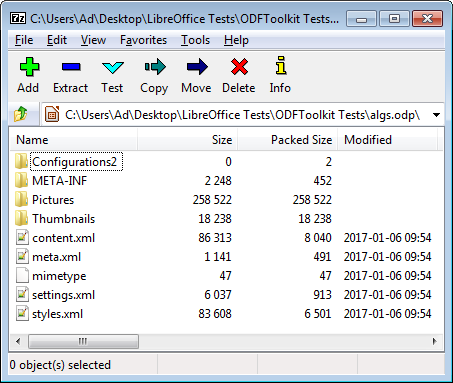
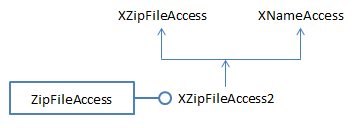
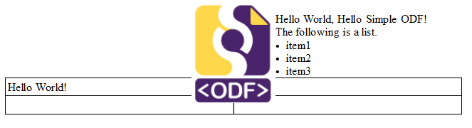
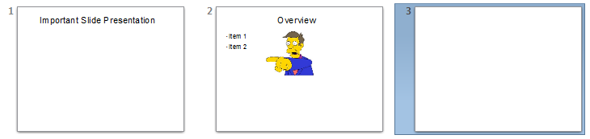

# Chapter 51. Simple ODF 
 
 
An OpenDocument Format (ODF) document is a zipped 
folder containing an assortment of XML files, images, and 
other resources. This makes it possible to manipulate using 
zip/unzip and XML features, but that isn't a good idea due 
to the complexity of the formats. This chapter looks at a 
few of these lower-level techniques, but is mainly about the 
Simple API for ODF, a sub-project of the Apache ODF 
Toolkit (http://incubator.apache.org/odftoolkit/simple/). It's 
a small Java API for creating, modifying and extracting 
data from ODF documents, built on top of the ODFDOM  
library (http://incubator.apache.org/odftoolkit/odfdom/). Rather surprisingly, its 
support for the concatenation of documents is better than that in the Office API. 

 
 
## 1.  The OpenDocument Format 

The contents of an ODF document (i.e. the zipped folder) depend on its type (e.g. 

does it contain a spreadsheet, presentation, or text?), but several files always appear 
inside the folder: 
 content.xml: the document's textual contents, but not binary data such as 
images; 
 meta.xml: the document's meta information, such as the author's name and the 
last modification date. The data is most easily viewed through Office's File > 
Properties menu item; 
 styles.xml: the styles used for the document's pages, paragraphs, text formats, 
and others, which are usually set via the Styles and Formatting dialogs in 
Office; 
 settings.xml: information specific to the application and document's display, 
such as the window's size/position, printer settings, and whether headers and 
footers are visible; 
 manifest.xml: this lists the content of the zipped folder, and is stored in the 
META-INF/ subdirectory; 
 mimetype: a one-line file listing the document's MIME-type. 

The easiest way of viewing these files and folders is to unzip the ODF file using a 
utility such as 7-Zip, as in Figure 1. 

 

!!! note "Topics"
    The 
OpenDocument Format; 
Doc Information; 
Unzipping an ODF Doc; 
the Simple Java API for 
ODF (Apache ODF 
Toolkit): making docs 
(text, sheet, and slides), 
slide movement, doc 
concatenation (text, 
sheet, and slides) 
Example folders: 
"ODFToolkit Tests" and 
"Utils" 
 

Figure 1. An Unzipped View of algs.odp. 

 
Figure 1's Configurations2/ folder stores localization information for the Office GUI; 
Pictures/ stores the images used in the document; Thumbnails/ holds a small 128x128 
picture of the document in thumbnail.png. 

The wikipedia page about ODF is quite informative 
(https://en.wikipedia.org/wiki/OpenDocument), as is its entry for the OpenDocument 
technical specification 
(https://en.wikipedia.org/wiki/OpenDocument_technical_specification). There's a 
quick summary of the OpenDocument Format (ODF) at 
https://help.libreoffice.org/Common/XML_File_Formats.  

The ODF standard was developed by the Organization for the Advancement of 
Structured Information Standards (OASIS) consortium  (https://www.oasis-
open.org/), whose website hosts a lot of information. A related community site is 
http://opendocument.xml.org/ 
The most complete textbook on ODF is: 
OASIS OpenDocument Essentials 
J. David Eisenberg, 2005 
http:// books.evc-cit.info/ 
The associated website has a free draft of the book, and all the examples and support 
code. The site often seems to be offline, but the book can be found at other locations. 

A recent version can be purchased at Lulu: http://www.lulu.com/shop/j-david-
eisenberg/oasis-opendocument-essentials/paperback/product-392512.html 
 
 
## 2.  Document Information 

There's little need to directly manipulate a document's XML files since the Office API 
offers high-level techniques for accessing most of their information.  

For example, part of meta.xml for algs.odp is: 
 
<office:meta> 
  <dc:title>PowerPoint Presentation</dc:title> 
  <dc:date>2017-01-06T16:53:58.639000000</dc:date> 
  <meta:editing-cycles>4</meta:editing-cycles> 
  <meta:editing-duration>PT1M52S</meta:editing-duration> 
  <meta:generator>LibreOffice/5.1.0.3$ 
      Windows_x86LibreOffice_project/ 
      5e3e00a007d9b3b6efb6797a8b8e57b51ab1f737</meta:generator> 
  <meta:document-statistic meta:object-count="92"/> 
  <meta:user-defined meta:name="Secret">Made in  
                            Thailand</meta:user-defined> 
</office:meta> 
 
This data is displayed in the General tab of the  File > Properties window in Figure 2. 

 
 

Figure 2. File > Properties Window. 

 
Rather than attempting to extract and parse meta.xml, this information is reachable 
through the XDocumentProperties interface which I described back in Chapter 3, 
section 2.  

The following DocInfo.java example uses Info.printDocProperties() to print document 
details: 
 
// in DocInfo.java 
public class DocInfo 
{ 
  public static void main(String args[]) 
  { 
    if (args.length < 1) { 
      System.out.println("Usage: run DocInfo <fnm>"); 
      return; 
    } 
 
    XComponentLoader loader = Lo.loadOffice(); 
    XComponent doc = Lo.openDoc(args[0], loader); 
    if (doc == null) { 
      System.out.println("Could not open " + args[0]); 
      Lo.closeOffice(); 
      return; 
    } 
 
    System.out.println(); 
    Props.showObjProps("Document", doc); 
    Info.printDocProperties(doc); 
 
    Lo.closeDoc(doc); 
    Lo.closeOffice(); 
  }  // end of main() 
 
}  // end of DocInfo class 
 
When DocInfo is passed algs.odp, some of the output is: 
 
Document Properties Info 
  Author: 
  Title: PowerPoint Presentation 
  Subject: 
  Description: 
  Generator: LibreOffice/5.1.0.3$Windows_x86 LibreOffice_project/ 
                     5e3e00a007d9b3b6efb6797a8b8e57b51ab1f737 
     : 
  Modification Date: Jan 06, 2017 16:53 
     : 
  Secret == Made in Thailand 
 
Info.printDocProperties() calls many XDocumentProperties.getXXX() methods to 
obtain these details: 
 
// in the Info class 
public static void printDocProperties(Object doc) 
{ 
  XDocumentPropertiesSupplier docPropsSupp = 
           Lo.qi(XDocumentPropertiesSupplier.class, doc); 
  XDocumentProperties dps = docPropsSupp.getDocumentProperties(); 
  printDocProps(dps); 
 
  XPropertyContainer udProps = dps.getUserDefinedProperties(); 
  Props.showObjProps("UserDefined Info", udProps); 
}  // end of printDocProperties() 
 
 
public static void printDocProps(XDocumentProperties dps) 
{ 
  System.out.println("Document Properties Info"); 
 
  System.out.println("  Author: " + dps.getAuthor()); 
  System.out.println("  Title: " + dps.getTitle()); 
  System.out.println("  Subject: " + dps.getSubject()); 
     :  // many more prints 
}  // end of printDocProps() 
 
XDocumentProperties replaces the deprecated XDocumentInfo interface, which has 
been removed from LibreOffice (although it's still in OpenOffice). The two classes 
manipulate almost the same information, but the older XDocumentInfo can retrieve 
the document's MIME-type, which is absent from XDocumentProperties. One way of 
obtaining this would be to access the mimetype file zipped inside the document, as 
shown next. 

 
 
## 3.  Unzipping an ODF Document 

My DocUnzip.java example shows how it's possible to list the zipped contents of a 
document, access its MIME-type, and extract a zipped file: 
 
// in DocUnzip.java 
public class DocUnzip 
{ 
  public static void main(String args[]) 
  { 
    if ((args.length < 1) || (args.length > 2)) { 
      System.out.println("Usage: run DocUnzip <fnm> [<ExtractFnm>]"); 
      return; 
    } 
    XComponentLoader loader = Lo.loadOffice(); 
 
    FileIO.zipList(args[0]); 
    // FileIO.zipListUno(args[0]);   // only names listed 
 
    // get zip access to the document 
    XZipFileAccess zfa = FileIO.zipAccess(args[0]); 
 
    String mimeType = FileIO.getMimeType(zfa); 
    System.out.println("MIME type: " + mimeType); 
    System.out.println("Other MIME type approach: " +  
                                Info.getMIMEType(args[0])); 
 
    // convert MIME-type too other forms 
    int docType = Info.mimeDocType(mimeType); 
    System.out.println("Doc Type: " + docType + "; " +  
                                 Lo.docTypeStr(docType)); 
 
    if (args.length == 2)   // extract the named file 
      FileIO.unzipFile(zfa, args[1]); 
 
    Lo.closeOffice(); 
  }  // end of main() 
}  // end of DocUnzip class 
 
The program can be called like so: 
run DocUnzip algs.odp content.xml 
content.xml will be unzipped from algs.odp and saved as contentCopy.xml in the 
local directory. 

The rest of the output is: 
 
Listing of algs.odp: 
Raw Size    Size     Date        Time         Name 
--------  -------  -------      -------      -------- 
47        47       Jan 6, 2017  9:54:00 AM   mimetype 
0         0        Jan 6, 2017  9:54:00 AM   Configurations2/popupmenu/ 
0         0        Jan 6, 2017  9:54:00 AM   Configurations2/floater/ 
0         0        Jan 6, 2017  9:54:00 AM   Configurations2/images/Bitmaps/ 
0         2        Jan 6, 2017  9:54:00 AM   
Configurations2/accelerator/current.xml 
0         0        Jan 6, 2017  9:54:00 AM   Configurations2/menubar/ 
0         0        Jan 6, 2017  9:54:00 AM   Configurations2/progressbar/ 
0         0        Jan 6, 2017  9:54:00 AM   Configurations2/toolbar/ 
0         0        Jan 6, 2017  9:54:00 AM   Configurations2/statusbar/ 
0         0        Jan 6, 2017  9:54:00 AM   Configurations2/toolpanel/ 
83608     6501     Jan 6, 2017  9:54:00 AM   styles.xml 
4364      4364     Jan 6, 2017  9:54:00 AM   
Pictures/100000000000004600000035E6F1CB2181A9ACF1.png 
16977     16977    Jan 6, 2017  9:54:00 AM   
Pictures/10000000000003080000002A0A348B9039C3652D.png 
20480     20480    Jan 6, 2017  9:54:00 AM   
Pictures/10000000000001F4000001F4E2E69E1D.jpg 
45056     45056    Jan 6, 2017  9:54:00 AM   
Pictures/10000000000000C8000000EEB0A3D2D2.jpg 
8192      8192     Jan 6, 2017  9:54:00 AM   
Pictures/10000000000000E1000000E1B343DD04.jpg 
40960     40960    Jan 6, 2017  9:54:00 AM   
Pictures/10000000000000E60000015E784CAA37.jpg 
69632     69632    Jan 6, 2017  9:54:00 AM   
Pictures/10000000000000DC000000FF9A43DBBF.jpg 
28672     28672    Jan 6, 2017  9:54:00 AM   
Pictures/100000000000011800000160792BAA16.jpg 
12288     12288    Jan 6, 2017  9:54:00 AM   
Pictures/10000000000000DC0000014B7CFE8C49.jpg 
11901     11901    Jan 6, 2017  9:54:00 AM   
Pictures/10000000000000BC0000010DD7ECB1F7.jpg 
18238     18238    Jan 6, 2017  9:54:02 AM   Thumbnails/thumbnail.png 
86313     8040     Jan 6, 2017  9:54:02 AM   content.xml 
6037      913      Jan 6, 2017  9:54:02 AM   settings.xml 
1141      491      Jan 6, 2017  9:54:02 AM   meta.xml 
2248      452      Jan 6, 2017  9:54:02 AM   META-INF/manifest.xml 
 
 
MIME type: application/vnd.oasis.opendocument.presentation 
Other MIME type approach: application/vnd.oasis.opendocument.presentation 
Doc Type: 5; simpress 
 
Extracting content.xml 
Saving to contentCopy.xml 
 
Most of the output is a detailed listing of the zipped contents of algs.odp. 

 
### 3.1.  Listing the Contents of a Zipped Folder 

There are two "zipList" functions in the FileIO utility class. FileIO.zipListUno() is 
simpler since only file and folder names are printed: 
 
// in the FileIO class 
public static void zipListUno(String fnm) 
{ 
  XZipFileAccess zfa = zipAccess(fnm); 
  XNameAccess nmAccess = Lo.qi(XNameAccess.class, zfa); 
  String[] names = nmAccess.getElementNames(); 
 
  System.out.println("\nZipped Contents of " + fnm); 
  Lo.printNames(names, 1); 
}  // end of zipListUno() 
 
 
public static XZipFileAccess zipAccess(String fnm) 
// get zip access to the document using Office API 
{ 
  return Lo.createInstanceMCF(XZipFileAccess.class, 
                         "com.sun.star.packages.zip.ZipFileAccess", 
                         new Object[]{ fnmToURL(fnm) }); 
} 
 
XZipFileAccess is created by instantiating the ZipFileAccess service with the 
document's filename. The interface is cast to XNameAccess which allows the names 
of the zipped files to be retrieved as an array of strings. Figure 3 shows the 
relationships between the service and interfaces. 

 
 

Figure 3. The ZipFileAccess Service. 

 
The ZipFileAccess service and interfaces are in the com.sun.star.packages.zip 
module, which includes a ZipEntry class for holding information about each zipped 
file (e.g. its compressed size). I was unable to find a way of creating ZipEntry objects, 
but Java contains a complete zip API. By using Java rather than Office, I was able to 
implement a more fancy "zipList": 
 
// in the FileIO class 
public static void zipList(String fnm) 
// using the Java API 
{ 
  DateFormat df= DateFormat.getDateInstance();   // date format 
  DateFormat tf= DateFormat.getTimeInstance();   // time format 
  tf.setTimeZone( TimeZone.getDefault() ); 
  try { 
    ZipFile zfile = new ZipFile(fnm); 
    System.out.println("Listing of " + zfile.getName() + ":"); 
    System.out.println("Raw  Size  Size  Date   Time   Name"); 
    System.out.println("---  ----  ----  ----   ----   ----"); 
    Enumeration<? extends java.util.zip.ZipEntry> zfs =  
                                            zfile.entries(); 
    while (zfs.hasMoreElements()) { 
      java.util.zip.ZipEntry entry =  
              (java.util.zip.ZipEntry) zfs.nextElement(); 
      Date d = new Date(entry.getTime()); 
      System.out.print( padSpaces(entry.getSize(), 9) + " "); 
      System.out.print( padSpaces(entry.getCompressedSize(),7)+ " "); 
      System.out.print(" " + df.format(d) + " "); 
      System.out.print(" " + tf.format(d) + "  "); 
      System.out.println(" " + entry.getName()); 
    } 
    System.out.println(); 
  } 
  catch (java.io.IOException e)  
  {  System.out.println(e); } 
}  // end of zipList() 
 
Another advantage of switching to Java are the large number of online examples of 
zip manipulation; my zipList() function is closely based on one at  
http://www.drdobbs.com/jvm/java-and-the-zip-file-format/184410339. 

 
### 3.2.  Extracting a MIME-type 

FileIO.getMimeType() employs XZipFileAccess.getStreamByPattern() to access the 
zipped mimetype file as an input stream. 

 
// in the FileIO class 
public static String getMimeType(XZipFileAccess zfa) 
{ 
  try { 
    XInputStream inStream = zfa.getStreamByPattern("mimetype"); 
    String[] lines = FileIO.readLines(inStream); 
    if (lines != null) 
      return lines[0].trim(); 
  } 
  catch (com.sun.star.uno.Exception e) 
  {  System.out.println(e);  } 
 
  System.out.println("No mimetype found"); 
  return null; 
}  // end of getMimeType() 
 
There's an alternative approach which looks up the file's MIME-type  using the Java 
API class MimetypesFileTypeMap: 
 
// in the Info class 
// global 
private static final String MIME_FNM = "mime.types"; 
 
 
public static String getMIMEType(String fnm) 
{ 
  try { 
    MimetypesFileTypeMap mftMap = new MimetypesFileTypeMap( 
                         FileIO.getUtilsFolder() + MIME_FNM); 
    return mftMap.getContentType(new File(fnm)); 
  } 
  catch(java.lang.Exception e) 
  {  System.out.println("Could not find " + MIME_FNM);   
     return "application/octet-stream";   // better than nothing 
  } 
}  // end of getMIMEType() 
 
The MimetypesFileTypeMap() constructor examines a list of MIME-types loaded 
from the utility classes folder. 

Most of my utility functions use document 'types' coded as integers rather than as 
MIME-type strings; the values are defined at the start of the Lo utility class: 
 
// in the Lo class 
public static final int UNKNOWN = 0; 
public static final int WRITER = 1; 
public static final int BASE = 2; 
public static final int CALC = 3; 
public static final int DRAW = 4; 
public static final int IMPRESS = 5; 
public static final int MATH = 6; 
 
Info.mimeDocType() maps ODF MIME-type strings to one of these integers: 
 
// in the Info class 
public static int mimeDocType(String mimeType) 
{ 
  if (mimeType == null)  
    return Lo.UNKNOWN; 
 
  if (mimeType.contains("vnd.oasis.opendocument.text")) 
    return Lo.WRITER; 
  else if (mimeType.contains("vnd.oasis.opendocument.base")) 
    return Lo.BASE; 
  else if (mimeType.contains("vnd.oasis.opendocument.spreadsheet")) 
    return Lo.CALC; 
  else if (mimeType.contains("vnd.oasis.opendocument.graphics") || 
           mimeType.contains("vnd.oasis.opendocument.image") || 
           mimeType.contains("vnd.oasis.opendocument.chart")) 
    return Lo.DRAW; 
  else if (mimeType.contains("vnd.oasis.opendocument.presentation")) 
    return Lo.IMPRESS; 
  else if (mimeType.contains("vnd.oasis.opendocument.formula")) 
    return Lo.MATH; 
  else return Lo.UNKNOWN; 
}  // end of mimeDocType() 
 
Some of my functions also utilize short document type strings, which are also defined 
in the Lo class: 
 
// in the Lo class 
// docType strings 
public static final String UNKNOWN_STR = "unknown"; 
public static final String WRITER_STR = "swriter"; 
public static final String BASE_STR = "sbase"; 
public static final String CALC_STR = "scalc"; 
public static final String DRAW_STR = "sdraw"; 
public static final String IMPRESS_STR = "simpress"; 
public static final String MATH_STR = "smath"; 
 
Lo.docTypeStr() maps document type integers to these strings. 

 
 
### 3.3.  Extracting a Zipped File 

The XZipFileAccess.getStreamByPattern() method used in FileIO.getMimeType() is 
also employed by FileIO.unzipFile() to extract a zipped file: 
 
// in FileIO class 
public static void unzipFile(XZipFileAccess zfa, String fnm) 
{ 
  String fileName = Info.getName(fnm); 
  String ext = Info.getExt(fnm); 
  try { 
    System.out.println("Extracting " + fnm); 
    XInputStream inStream = zfa.getStreamByPattern("*" + fnm); 
 
    XSimpleFileAccess3 fileAcc =  
          Lo.createInstanceMCF(XSimpleFileAccess3.class, 
                    "com.sun.star.ucb.SimpleFileAccess"); 
 
    String copyFnm =  (ext == null) ? (fileName + "Copy") : 
                                      (fileName + "Copy." + ext); 
    System.out.println("Saving to " + copyFnm); 
    fileAcc.writeFile(FileIO.fnmToURL(copyFnm), inStream); 
  } 
  catch (com.sun.star.uno.Exception e) 
  {  System.out.println(e);  } 
}  // end of unzipFile() 
 
The XZipFileAccess.getStreamByPattern() call includes the wildcard character "*" so 
the filename will be found even if prefixed by a directory path, as in the case of an 
ODF document's manifest.xml which is stored in "META-INF/manifest.xml". 

I utilize Office's IO interface, XSimpleFileAccess3, which supports writeFile() to 
directly connect an XInputStream  to a file. The filename of the extracted data is 
constructed from the zipped filename with the addition of "Copy". 

 
 
## 4.  Higher-level Manipulation of ODF 

Manipulating an ODF document as zipped files and XML is a recipe for highly 
complex (and probably bug-ridden) code. And why bother when the Office API offers 
all the necessary functionality in a higher-level framework? 
"Maslow's hammer" maxim comes to mind; it states: "if all you have is a hammer, 
then everything looks like a nail". In other words, it's useful to know about ODF APIs 
other than Office's since they might offer better, easier ways of doing some tasks. 

As a consequence, I'm going to spend the rest of the chapter looking at the Simple 
Java API for ODF, a sub-project of Apache ODF Toolkit 
(http://incubator.apache.org/odftoolkit/simple/). It's a relatively small Java API for 
creating, modifying and extracting data from ODF documents, built on top of the 
ODFDOM  library (http://incubator.apache.org/odftoolkit/odfdom/).  

Its best features are the cookbook pages at 
http://incubator.apache.org/odftoolkit/simple/document/cookbook/, the Getting 
Started Guide (http://incubator.apache.org/odftoolkit/simple/gettingstartguide.html), 
and its demo pages (http://incubator.apache.org/odftoolkit/simple/demo/).  

The cookbook contains examples for manipulating text documents, presentations, 
tables in text documents and spreadsheets, charts, style handling, text navigation, text 
extraction, text fields, text forms, and document metadata. The API documentation is 
at http://incubator.apache.org/odftoolkit/mvn-site/0.8-incubating/simple-odf/apidocs/, 
and a mail archive at http://mail-archives.apache.org/mod_mbox/incubator-odf-users/ 
By far the worst feature of the API is the large number of libraries that must be 
installed before even a lowly "Hello World" example will work. Fortunately, I've 
included copies of those libraries at this chapter's website at 
http://fivedots.coe.psu.ac.th/~ad/jlop/. 

The Simple API doesn't have the depth of features of Office, so it's best suited for the 
creation of simple text documents, spreadsheets, and presentations. However, it has 
better support for combining documents (e.g. concatenating two slide decks into a 
single one), and can move/copy slides in a presentation much more easily than Office; 
look back at Chapter 17, sections 4 and 5 for my complaints about that. 

 
### 4.1.  Building Simple Documents 

This subsection looks at how the Simple API can be used to create text, spreadsheet, 
and slide documents. 

 
Make a Text Document 
My MakeTextDoc.java example creates a text document containing an image, some 
text, a list, and a table.; the result is shown in Figure 4. 

 
 

Figure 4. The Output of MakeTextDoc.java. 

 
This isn't quite what the output looks like in the "Getting Started Guide", where the 
program is called HelloWorld.java – in the guide the first paragraph is beneath the 
image rather than to one side. 

The MakeTextDoc.java code: 
 
public class MakeTextDoc 
{ 
  public static void main(String[] args) 
  { 
    try { 
      TextDocument doc = TextDocument.newTextDocument(); 
      doc.newImage(new URI("odf-logo.png")); 
 
      // add paragraphs and list 
      doc.addParagraph("Hello World, Hello Simple ODF!"); 
      doc.addParagraph("The following is a list."); 
      List list = doc.addList(); 
      String[] items = {"item1", "item2", "item3"}; 
      list.addItems(items); 
 
      // add table 
      Table table = doc.addTable(2, 2); 
      Cell cell = table.getCellByPosition(0, 0); 
      cell.setStringValue("Hello World!"); 
 
      System.out.println("Creating MakeTextDoc.odt"); 
      doc.save("MakeTextDoc.odt"); 
    } 
    catch (Exception e) { 
      System.out.println(e); 
    } 
  }  // end of main() 
 
} // end of MakeTextDoc class 
 
I was unable to find a way of changing the image's text wrap property to affect the 
paragraph's position. It's probably do-able using the lower-level ODFDOM  library, 
but the programming information for that part of ODF Toolkit is mostly limited to its 
API documentation. However, there's a good introductory tutorial at 
http://www.langintro.com/odfdom_tutorials/. 

 
Make a Spreadsheet 
The MakeSheet.java example creates a spreadsheet with a single sheet, and a few 
cells of data, as in Figure 5. 

 
 

Figure 5. The Output of MakeSheet.java. 

 
The program: 
 
public class MakeSheet  
{ 
  public static void main(String[] args)  
  { 
    try { 
      SpreadsheetDocument doc =  
             SpreadsheetDocument.newSpreadsheetDocument(); 
      Table sheet = doc.getSheetByIndex(0); 
      sheet.getCellByPosition(0, 0).setStringValue("Hello"); 
      for (int row = 0; row < 5; row++) 
        sheet.getCellByPosition(1, row).setDoubleValue(row*2.0); 
 
      System.out.println("Saving document to makeSheet.ods"); 
      doc.save("makeSheet.ods"); 
    }  
    catch (Exception e)  
    {  System.out.println(e); } 
  }  // end of main() 
 
}  // end of MakeSheet class 
 
 
Make a Slide Deck 
The MakeSlides.java example creates a slide deck. The first slide contains a title, the 
second some bulleted text and a picture, and the third slide is blank, as in Figure 6. 

 
 

Figure 6. The Output of MakeSlides.java. 

 
The program: 
 
public class MakeSlides 
{ 
  public static void main(String[] args) 
  { 
    try { 
      PresentationDocument doc =  
                PresentationDocument.newPresentationDocument(); 
 
      // a title slide 
      Slide slide1 = doc.newSlide(0, "slide1",  
                                   SlideLayout.TITLE_ONLY); 
      Textbox titleBox = slide1.getTextboxByUsage( 
                             PresentationClass.TITLE).get(0); 
      titleBox.setTextContent("Important Slide Presentation"); 
 
      // a slide with text bullets and a picture 
      Slide slide2 = doc.newSlide(1, "slide2",  
                                 SlideLayout.TITLE_OUTLINE); 
      titleBox = slide2.getTextboxByUsage( 
                             PresentationClass.TITLE).get(0); 
      titleBox.setTextContent("Overview"); 
 
      Textbox outline = slide2.getTextboxByUsage( 
                             PresentationClass.OUTLINE).get(0); 
      List txtList = outline.addList();   // two bullets 
      txtList.addItem("Item 1"); 
      txtList.addItem("Item 2"); 
 
      Image image = Image.newImage(slide2, new URI("skinner.png")); 
      FrameRectangle rect = image.getRectangle(); 
      rect.setX(8);     // position the image 
      rect.setY(4); 
      image.setRectangle(rect); 
 
      System.out.println("Saving document to makeSlides.odp"); 
      doc.save("makeSlides.odp"); 
    } 
    catch (Exception e) 
    { System.out.println(e);  } 
  }  // end of main() 
 
}  // end of MakeSlides class 
 
Programming with this part of the API is a littlie tricky since slide elements are 
represented by different types of boxes. I also found it hard to determine the position 
of the image, except by trial-and-error. 

 
### 4.2.  Moving a Slide 

Back in Chapter 17, section 4, I had to use copy and paste dispatch commands in the 
slide-sorter view to rearrange a deck. Moving a slide in the Simple API is much 
easier, as shown in MoveSlide.java, which moves the first slide of the deck to its end: 
 
public class MoveSlide  
{ 
  public static void main(String[] args)  
  { 
    try { 
      PresentationDocument doc =  
             PresentationDocument.loadDocument("algs.odp"); 
      int numSlides = doc.getSlideCount(); 
      System.out.println("Moving first slide to the end"); 
      doc.moveSlide(0, numSlides);   // why not numSlides-1? 
 
      System.out.println("Saving document to algsMoved.odp"); 
      doc.save("algsMoved.odp"); 
      doc.close(); 
    }  
    catch (Exception e)  
    {  System.out.println(e); } 
  }  // end of main() 
 
}  // end of MoveSlide class 
 
PresentationDocument.moveSlide() works without a hitch, although I'm confused 
why I need to supply numSlides as the second numerical argument rather than 
numSlides-1.  

There's also a PresentationDocument.copySlide() method for copying. 

 
### 4.3.  Combining Two Documents 

This subsection presents three short programs that combine two text documents, 
appends the sheets of two spreadsheets, and concatenates two slide decks. These 
examples are much simpler to program than equivalent ones using the Office API. 

 
Combining Text Documents 
CombineTexts.java adds the contents of doc2.odt to the end of the contents of 
doc1.odt, separating them with a page break. The result is saved to combined.odt: 
 
public class CombineTexts  
{ 
  public static void main(String[] args)  
  { 
    try { 
      TextDocument doc1 = TextDocument.loadDocument("doc1.odt"); 
      TextDocument doc2 = TextDocument.loadDocument("doc2.odt"); 
 
      doc1.addPageBreak(); 
      Paragraph lastPara = doc1.getParagraphByReverseIndex(0, false); 
 
      // insert contents at end and copy styles 
      doc1.insertContentFromDocumentAfter(doc2, lastPara, true); 
 
      System.out.println("Saving combination to combined.odt"); 
      doc1.save("combined.odt"); 
      doc1.close(); 
      doc2.close(); 
    }  
    catch (Exception e)  
    {  System.out.println(e); } 
  }  // end of main() 
 
}  // end of CombineTexts class 
 
The crucial method is TextDocument.insertContentFromDocumentAfter(). 

 
Combining Spreadsheets 
CombineSheets.java places the sheets in ss2.odt after the sheets in ss1.odt, and saves 
the result in combined.ods: 
 
public class CombineSheets  
{ 
  public static void main(String[] args)  
  { 
    try { 
      SpreadsheetDocument doc1 =  
              SpreadsheetDocument.loadDocument("ss1.ods"); 
      SpreadsheetDocument doc2 =  
              SpreadsheetDocument.loadDocument("ss2.ods"); 
      int numSheets2 = doc2.getSheetCount(); 
 
      // add sheets of second document to end of first doc 
      for(int i=0; i < numSheets2; i++) { 
        Table t = doc2.getSheetByIndex(i); 
        doc1.appendSheet(t, t.getTableName()); 
      } 
      System.out.println("Saving combination to combined.ods"); 
      doc1.save("combined.ods"); 
      doc1.close(); 
      doc2.close(); 
    }  
    catch (Exception e)  
    {  System.out.println(e); } 
  }  // end of main() 
 
}  // end of CombineSheets class 
 
Sadly there isn't a single method that appends tables. Instead  I've used a loop to 
append each sheet from ss2.ods after the sheets in ss1.ods. 

 
Combining Slide Decks 
CombineDecks.java adds the slides in deck2.odp after the slides in deck1.odp, saving 
the result in combined.odp: 
 
public class CombineDecks  
{ 
  public static void main(String[] args)  
  { 
    try { 
      PresentationDocument doc1 =  
              PresentationDocument.loadDocument("deck1.odp"); 
      PresentationDocument doc2 =  
              PresentationDocument.loadDocument("deck2.odp"); 
      doc1.appendPresentation(doc2); 
      System.out.println("Saving combination to combined.odp"); 
      doc1.save("combined.odp"); 
      doc1.close(); 
      doc2.close(); 
    }  
    catch (Exception e)  
    {  System.out.println(e); } 
  }  // end of main() 
 
}  // end of CombineDecks class 
 
The PresentationDocument.appendPresentation() method does all the work, and 
should be compared to my hacky Office solution in Chapter 17, section 5. 

